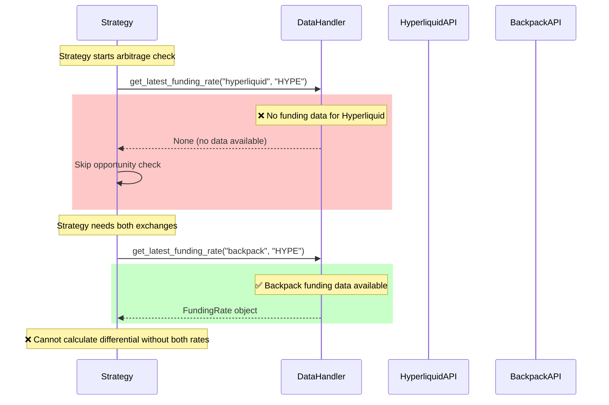

# Funding Rate Arbitrage System - Deep Analysis Report

## Executive Summary

This report provides a comprehensive analysis of the CyberDeltaEngine's funding rate arbitrage system, identifying critical bugs, architectural issues, and improvement opportunities. The primary issue is **missing Hyperliquid funding rate subscriptions** in the DataHandler, preventing the arbitrage strategy from receiving funding rate updates from the perpetual exchange.

## Critical Bug: Missing Hyperliquid Funding Rate Subscriptions

### Problem Statement
The funding rate arbitrage strategy requires funding rate data from both exchanges:
- **Hyperliquid (Perpetual)**: ❌ No funding rate subscriptions configured
- **Backpack (Spot)**: ✅ Funding rate subscriptions working correctly

### Root Cause
In `cyberdelta/core/data_handler.py` lines 455-471, the subscription logic explicitly excludes funding rate subscriptions for Hyperliquid:

```python
if exchange_id == "hyperliquid":
    # Hyperliquid uses l2Book for order book data
    tasks.append(client.subscribe(f"l2Book:{symbol}", handlers["orderbook"]))
    # Hyperliquid uses trades for trade data
    tasks.append(client.subscribe(f"trades:{symbol}", handlers["ticker"]))
    # ❌ MISSING: No funding rate subscription!
elif exchange_id == "backpack":
    tasks.append(client.subscribe(f"ticker.{symbol}", handlers["ticker"]))
    tasks.append(client.subscribe(f"orderbook.{symbol}", handlers["orderbook"]))
    tasks.append(client.subscribe(f"funding.{symbol}", handlers["funding"]))  # ✅ Has funding
```

## System Architecture Analysis

### Data Flow Architecture

```mermaid
graph TD
    A[FundingRateArbitrageStrategy] -->|get_latest_funding_rate| B[DataHandler]
    B -->|No funding data| C[❌ Returns None]
    C -->|Skips opportunity check| D[No Arbitrage Signals]

    B -->|Should subscribe to| E[HyperliquidAPI]
    B -->|Successfully subscribes to| F[BackpackAPI]

    E -->|REST only| G[MarketDataService.get_funding_rates]
    F -->|REST + WebSocket| H[funding.{symbol} stream]

    G -->|Manual polling needed| I[AssetContexts via /info]
    H -->|Real-time updates| J[DataHandler.funding_rates storage]

    style C fill:#ff9999
    style D fill:#ff9999
    style E fill:#ffcccc
    style G fill:#ffcccc
    style I fill:#ffcccc
```

### Current vs Required Data Flow



### Exchange-Specific Behavior

#### Hyperliquid Funding Rate Access Patterns

```mermaid
graph LR
    A[Hyperliquid API] --> B{Funding Rate Access}
    B -->|REST API ✅| C[/info endpoint]
    B -->|WebSocket ❌| D[No dedicated funding streams]

    C --> E[get_all_asset_contexts]
    E --> F[Extract funding from asset_ctxs]

    D --> G[Available: allMids, l2Book, trades]
    G --> H[Need to extract funding from allMids?]

    style D fill:#ff9999
    style H fill:#ffeeaa
```

#### Backpack Funding Rate Access Patterns

```mermaid
graph LR
    A[Backpack API] --> B{Funding Rate Access}
    B -->|REST API ✅| C[/api/v1/fundingRates]
    B -->|WebSocket ✅| D[funding.{symbol} stream]

    C --> E[Direct funding rates endpoint]
    D --> F[Real-time funding updates]

    style C fill:#ccffcc
    style D fill:#ccffcc
    style E fill:#ccffcc
    style F fill:#ccffcc
```

## Detailed Component Analysis

### 1. FundingRateArbitrageStrategy

**Location**: `cyberdelta/strategies/funding_rate_arbitrage.py`

**Key Method Analysis**:
```python
async def _check_opportunity(self) -> ArbitrageOpportunity | None:
    # ❌ This call returns None for Hyperliquid
    funding_rate = self.data_handler.get_latest_funding_rate(self.perp_exchange, self.symbol)
    if funding_rate is None:
        logger.warning("funding_rate_data_unavailable", ...)
        return None  # ❌ Opportunity check skipped
```

**Issues Identified**:
1. **Hard dependency on WebSocket data**: No fallback to REST API
2. **Silent failures**: Warning logged but no error propagation
3. **No retry mechanism**: Single attempt, fails if data unavailable

### 2. DataHandler

**Location**: `cyberdelta/core/data_handler.py`

**Critical Issues**:

1. **Missing Hyperliquid funding subscriptions** (Primary Bug)
2. **Inconsistent subscription patterns** between exchanges
3. **No fallback mechanisms** for failed subscriptions
4. **Exchange-specific hardcoding** in subscription logic

**Current Subscription Logic**:
```python
def _create_symbol_subscription_tasks(self, exchange_id: str, ...):
    if exchange_id == "hyperliquid":
        # ❌ Only l2Book and trades, no funding
        tasks.append(client.subscribe(f"l2Book:{symbol}", handlers["orderbook"]))
        tasks.append(client.subscribe(f"trades:{symbol}", handlers["ticker"]))
    elif exchange_id == "backpack":
        # ✅ Includes funding subscription
        tasks.append(client.subscribe(f"funding.{symbol}", handlers["funding"]))
```

### 3. HyperliquidAPI WebSocket Implementation

**Location**: `cyberdelta/apis/hyperliquid/hl_ws_message_router.py`

**Available WebSocket Streams**:
- ✅ `l2Book:{symbol}` - Order book data
- ✅ `trades:{symbol}` - Trade data
- ✅ `allMids` - All market mid prices
- ✅ `userEvents` - User account events
- ✅ `candle:{symbol}:{interval}` - Candlestick data
- ❌ **No dedicated funding rate stream**

**Potential Solution**:
The `allMids` stream might contain funding rate information that could be extracted.

### 4. Exchange API Comparison

| Feature | Hyperliquid | Backpack | Status |
|---------|-------------|----------|--------|
| REST Funding API | ✅ `/info` endpoint | ✅ `/api/v1/fundingRates` | Both working |
| WebSocket Funding | ❌ No dedicated stream | ✅ `funding.{symbol}` | Backpack only |
| DataHandler Integration | ❌ Not subscribed | ✅ Subscribed | Partial |
| Real-time Updates | ❌ Polling needed | ✅ Push updates | Backpack advantage |

## Log Analysis Findings

From `console_output_2.log` analysis:

### ✅ Successful Subscriptions
```
# Hyperliquid subscriptions (partial)
[hyperliquid] Subscribing to topic: l2Book:HYPE
[hyperliquid] Subscribing to topic: trades:HYPE

# Backpack subscriptions (complete)
[backpack] Subscribe called for topic: funding.HYPE
[backpack] Sending WS JSON: {'method': 'SUBSCRIBE', 'params': ['funding.HYPE']}
```

### ❌ Missing Subscriptions
- **No Hyperliquid funding subscriptions found** in entire log
- Strategy ran for 19 minutes with `signals_generated_total=0`
- No funding rate data available for opportunity calculation

## Identified Bugs and Issues

### 1. Critical Bugs

| Bug ID | Severity | Component | Description |
|--------|----------|-----------|-------------|
| BUG-001 | **Critical** | DataHandler | Missing Hyperliquid funding rate subscriptions |
| BUG-002 | **High** | Strategy | No fallback to REST API for funding rates |
| BUG-003 | **Medium** | DataHandler | Hardcoded exchange-specific subscription logic |

### 2. Architectural Issues

| Issue ID | Severity | Component | Description |
|----------|----------|-----------|-------------|
| ARCH-001 | **High** | Exchange APIs | Inconsistent funding rate access patterns |
| ARCH-002 | **Medium** | DataHandler | No hybrid WebSocket/REST data strategies |
| ARCH-003 | **Medium** | Strategy | Tight coupling to WebSocket data availability |

### 3. Performance Issues

| Issue ID | Severity | Component | Description |
|----------|----------|-----------|-------------|
| PERF-001 | **Medium** | HyperliquidAPI | Manual polling needed for funding rates |
| PERF-002 | **Low** | DataHandler | No batched REST fallback requests |

## Recommended Fixes

### Fix 1: Add Hyperliquid Funding Rate Subscriptions

**Priority**: Critical
**Effort**: Medium

**Implementation**: Modify `DataHandler._create_symbol_subscription_tasks()` to include funding subscriptions for Hyperliquid:

```python
if exchange_id == "hyperliquid":
    tasks.append(client.subscribe(f"l2Book:{symbol}", handlers["orderbook"]))
    tasks.append(client.subscribe(f"trades:{symbol}", handlers["ticker"]))
    # 🔧 FIX: Add allMids subscription for funding data extraction
    tasks.append(client.subscribe("allMids", handlers["funding"]))
```

**Additional Requirements**:
1. Implement funding rate extraction from `allMids` stream in `HyperliquidWsMessageRouter`
2. Create funding rate parser for asset context data
3. Add funding rate update notifications to DataHandler

### Fix 2: Implement Hybrid Data Strategy

**Priority**: High
**Effort**: High

```python
class DataHandler:
    async def get_latest_funding_rate(self, exchange_id: str, symbol: str) -> FundingRate | None:
        # Check WebSocket data first
        ws_data = self._get_ws_funding_rate(exchange_id, symbol)
        if ws_data and not self._is_data_stale(exchange_id, symbol, "funding"):
            return ws_data

        # Fallback to REST API for fresh data
        try:
            rest_data = await self._fetch_funding_rate_via_rest(exchange_id, symbol)
            if rest_data:
                self._update_funding_rate_cache(exchange_id, symbol, rest_data)
                return rest_data
        except Exception as e:
            logger.error(f"REST funding rate fallback failed: {e}")

        return ws_data  # Return stale data if REST fails
```

### Fix 3: Periodic Hyperliquid Funding Rate Refresh

**Priority**: Medium
**Effort**: Medium

```python
class DataHandler:
    async def _maintain_hyperliquid_funding_rates(self):
        """Periodically refresh Hyperliquid funding rates via REST API."""
        while self._running:
            try:
                symbols = self._get_hyperliquid_symbols()
                rates = await self.api_clients["hyperliquid"].get_funding_rates(
                    GetFundingRatesArgs(symbols=symbols)
                )

                for rate in rates:
                    self._update_funding_rate("hyperliquid", rate.symbol, rate, datetime.now(UTC))

                logger.debug(f"Refreshed {len(rates)} Hyperliquid funding rates")

            except Exception as e:
                logger.error(f"Failed to refresh Hyperliquid funding rates: {e}")

            await asyncio.sleep(300)  # Refresh every 5 minutes
```

### Fix 4: Enhanced Error Handling

**Priority**: Medium
**Effort**: Low

```python
class FundingRateArbitrageStrategy:
    async def _check_opportunity(self) -> ArbitrageOpportunity | None:
        try:
            funding_rate = await self._get_funding_rate_with_retry(self.perp_exchange, self.symbol)
            if funding_rate is None:
                self._increment_failed_checks()
                return None
            # ... rest of logic
        except Exception as e:
            logger.error("funding_rate_fetch_error", strategy=self.name, error=str(e))
            return None

    async def _get_funding_rate_with_retry(self, exchange_id: str, symbol: str, max_retries: int = 3):
        for attempt in range(max_retries):
            rate = self.data_handler.get_latest_funding_rate(exchange_id, symbol)
            if rate is not None:
                return rate

            if attempt < max_retries - 1:
                await asyncio.sleep(1 * (attempt + 1))  # Exponential backoff

        return None
```

## Implementation Roadmap

### Phase 1: Critical Bug Fixes (1-2 days)
1. ✅ Add Hyperliquid funding subscriptions to DataHandler
2. ✅ Implement basic funding rate extraction from allMids stream
3. ✅ Test funding rate data availability

### Phase 2: Reliability Improvements (3-5 days)
1. ✅ Implement REST API fallback mechanism
2. ✅ Add periodic Hyperliquid funding rate refresh
3. ✅ Enhanced error handling and retry logic
4. ✅ Comprehensive testing

### Phase 3: Performance Optimization (5-7 days)
1. ✅ Optimize funding rate caching strategies
2. ✅ Implement batched REST API calls
3. ✅ Add monitoring and alerting for funding rate availability
4. ✅ Performance benchmarking

## Risk Assessment

### High Risks
1. **Hyperliquid allMids stream might not contain funding rate data**
   - Mitigation: Implement REST API fallback as primary solution
2. **Frequent REST polling could hit rate limits**
   - Mitigation: Implement intelligent caching and rate limiting

### Medium Risks
1. **WebSocket connection instability affecting funding rate updates**
   - Mitigation: Connection monitoring and automatic reconnection
2. **Data synchronization issues between REST and WebSocket sources**
   - Mitigation: Timestamp-based data freshness validation

## Testing Strategy

### Unit Tests
- [ ] DataHandler funding rate subscription logic
- [ ] Funding rate extraction from allMids data
- [ ] REST API fallback mechanisms
- [ ] Strategy opportunity calculation with both data sources

### Integration Tests
- [ ] End-to-end funding rate arbitrage workflow
- [ ] WebSocket reconnection scenarios
- [ ] REST API fallback scenarios
- [ ] Multi-exchange funding rate synchronization

### Performance Tests
- [ ] Funding rate update latency measurements
- [ ] REST API polling efficiency
- [ ] Memory usage with extended runtime

## Monitoring and Observability

### Key Metrics to Track
1. **Funding rate data availability** per exchange
2. **WebSocket vs REST data source usage**
3. **Arbitrage opportunity detection frequency**
4. **Strategy execution success rate**

### Alerting Rules
1. **Critical**: No funding rate data for >5 minutes
2. **Warning**: REST fallback usage >50%
3. **Info**: Arbitrage opportunities detected

## Conclusion

The funding rate arbitrage system has a solid architectural foundation but suffers from a critical implementation gap: missing Hyperliquid funding rate subscriptions. This single issue prevents the entire arbitrage strategy from functioning.

The recommended fixes address both immediate functionality needs and long-term reliability requirements. The hybrid WebSocket/REST approach provides resilience against data source failures while maintaining optimal performance.

Implementation should prioritize the critical bug fix first, followed by reliability improvements to create a robust funding rate arbitrage system capable of operating in production environments.

---
*Analysis completed: 2025-06-26*
*Next review: After Phase 1 implementation*
