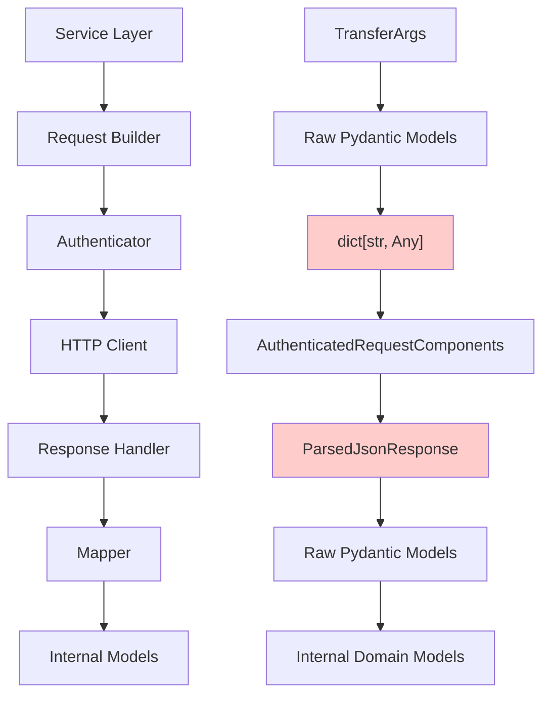
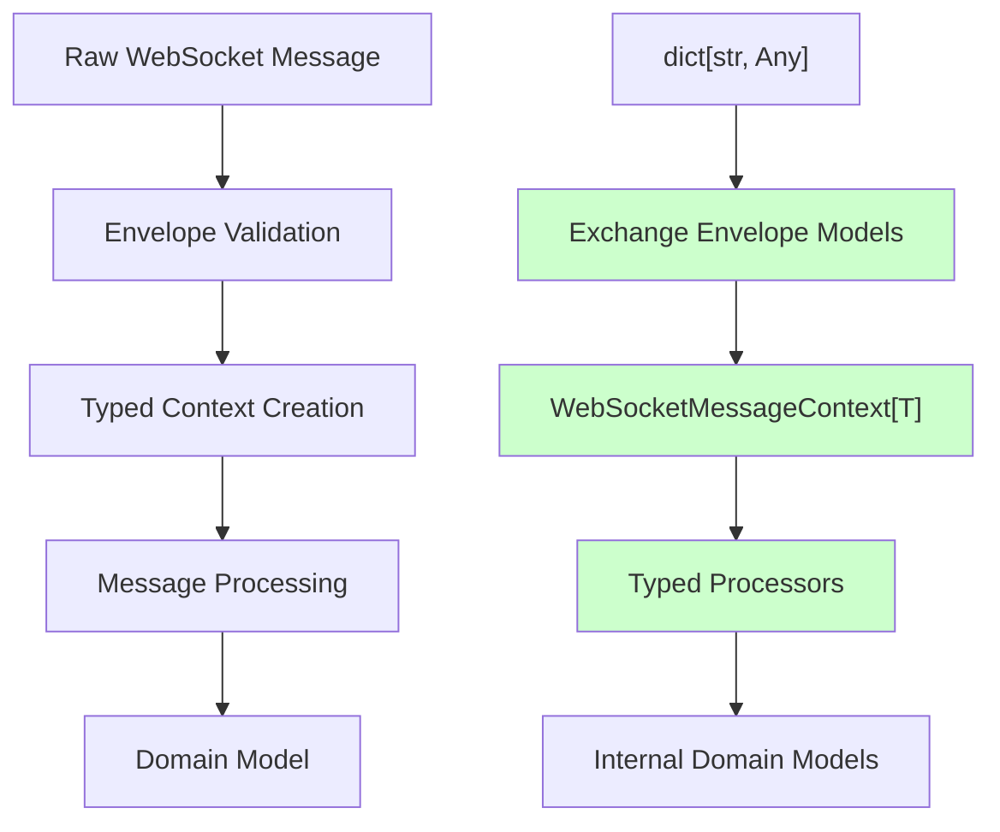
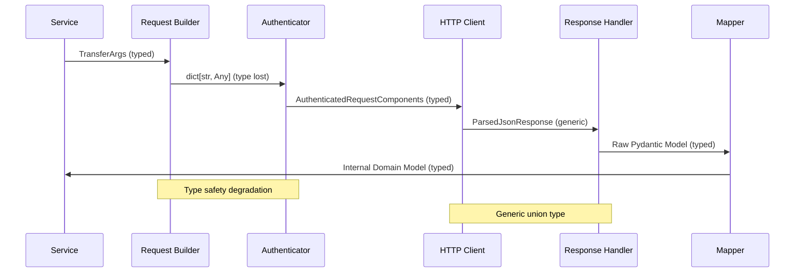
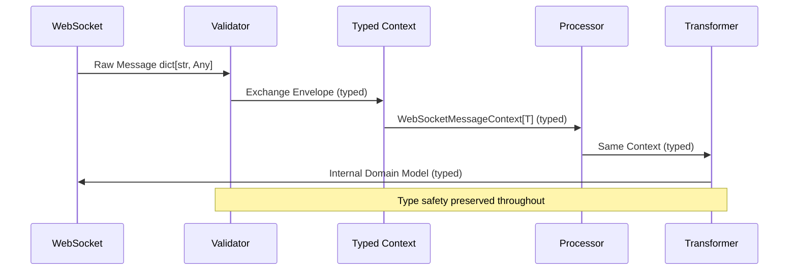

# HTTP Client Type Safety Refactor - First Look Analysis

**Last Updated**: 2025-08-06
**Status**: Research Complete - Implementation Strategy Required

## Executive Summary

This analysis compares the HTTP and WebSocket implementations in the CyberDeltaEngine API system, revealing significant architectural differences in type safety approaches. The WebSocket implementation demonstrates sophisticated generic type patterns using Python 3.12+ syntax, while the HTTP implementation uses a more traditional but equally robust approach with Pydantic validation at API boundaries. Both approaches achieve strong type safety through different architectural patterns.

## Current State Analysis

### HTTP Implementation Architecture

The HTTP implementation follows a well-structured layered architecture with strategic type flexibility at transport boundaries:



**Type Safety Strategy:**
- **Request Builder → Authenticator**: Uses `model_dump()` → `dict[str, Any]` for exchange-agnostic transport
- **HTTP Client Response**: Generic `ParsedJsonResponse` union type provides flexibility
- **Authentication Interface**: Generic `dict[str, Any]` parameters enable multi-exchange support
- **API Boundary Validation**: Strong Pydantic models with custom type annotations ensure type safety

### WebSocket Implementation Architecture

The WebSocket implementation demonstrates advanced type safety using Python 3.12+ generic syntax:



**Type Safety Strengths:**
- **Modern Generic Syntax**: Uses Python 3.12+ PEP 695 syntax: `class WebSocketMessageContext[EnvelopeType: "BaseModel"]`
- **Generic Type Preservation**: `WebSocketMessageContext[EnvelopeType]` maintains type information
- **Minimal Dict Usage**: Limits `dict[str, Any]` to initial parsing only
- **Type-Safe Context Objects**: Exchange-specific contexts with computed properties

## Detailed Comparison

### Data Flow Analysis

#### HTTP Data Flow


#### WebSocket Data Flow


### Type Safety Comparison

| Aspect | HTTP Implementation | WebSocket Implementation |
|--------|-------------------|------------------------|
| **Interface Design** | `dict[str, Any]` at transport layer | Python 3.12+ generic classes |
| **Context Objects** | Request/response components | `WebSocketMessageContext[T]` with PEP 695 syntax |
| **Serialization** | Pydantic `model_dump()` with custom annotations | Envelope validation with type preservation |
| **Validation** | Strong Pydantic models at boundaries | Layered validation pipeline |
| **Error Handling** | Comprehensive error mapping with retry logic | Circuit breaker + error suppression |
| **Exchange Handling** | Exchange-specific builders/handlers | Union types with discriminated patterns |

### Key Architectural Differences

#### HTTP Challenges
1. **Authenticator Interface Constraints**
   ```python
   # Current: Generic interface loses type safety
   async def prepare_request(
       self,
       method: str,
       path: str,
       params: dict[str, Any] | None,  # ❌ Type erasure
       data: dict[str, Any] | None,    # ❌ Type erasure
       headers: Mapping[str, Any] | None,
   ) -> AuthenticatedRequestComponents:
   ```

2. **Serialization Boundary Issues**
   ```python
   # Type information lost at serialization
   action_payload_dict = self._prepare_action_payload(data)  # dict[str, Any]
   ```

3. **Response Type Ambiguity**
   ```python
   # Generic response type requires runtime checking
   ParsedJsonResponse = dict[str, Any] | list[Any] | str
   ```

#### WebSocket Advantages (Current Implementation)
1. **Modern Python 3.12+ Generics (PEP 695)**
   ```python
   # Actual implementation uses new generic syntax
   class WebSocketMessageContext[EnvelopeType: "BaseModel"](BaseModel):
       validated_envelope: EnvelopeType  # Type preserved
       exchange_type: ExchangeType
       routing_key: str
   ```

2. **Exchange-Specific Context Classes**
   ```python
   class HyperliquidMessageContext(WebSocketMessageContext[HyperliquidRawWebSocketEnvelope]):
       """Type-safe Hyperliquid context"""

   class BackpackMessageContext(WebSocketMessageContext[BackpackRawWebSocketEnvelope]):
       """Type-safe Backpack context"""
   ```

3. **Computed Properties with Type Safety**
   ```python
   @computed_field
   def is_private_message(self) -> bool:
       """Type-safe message classification"""
   ```

## Current Implementation Status (2025-08-06)

### HTTP Client Strengths
1. **Robust Pydantic Validation**: All API boundaries use strongly-typed Pydantic models
2. **Custom Type Annotations**: Sophisticated validation using `Annotated` types
   ```python
   type RawBpParsableFiniteDecimalString = Annotated[
       str,
       BeforeValidator(_validate_raw_parsable_finite_decimal_string),
   ]
   ```
3. **Comprehensive Error Handling**: Multi-layered error mapping with retry strategies
4. **Exchange-Specific Components**: Dedicated builders, handlers, and mappers per exchange

### WebSocket Implementation Strengths
1. **Python 3.12+ Generic Syntax**: Modern type parameter syntax (PEP 695)
2. **Type-Safe Context Registry**: Strongly typed context registration and creation
3. **No Type Ignore Statements**: Clean implementation without type safety bypasses
4. **Smart Error Suppression**: TTL-based error caching prevents log spam

### Areas for Improvement
1. **HTTP Generic Usage**: Could benefit from generic type parameters similar to WebSocket
2. **Context Objects**: HTTP lacks equivalent to `WebSocketMessageContext[T]`
3. **Serialization Strategy**: Could implement strategy pattern for type preservation
4. **Protocol-Based Interfaces**: HTTP could adopt more protocol-based designs

## Root Cause Analysis

### HTTP Type Safety Issues

1. **Legacy Interface Constraints**
   - `IAuthenticator` interface designed for maximum flexibility
   - Generic `dict[str, Any]` parameters to support diverse exchanges
   - No type parameterization in original design

2. **Serialization Strategy Limitations**
   - Pydantic `model_dump()` returns untyped dictionaries
   - Exchange-specific serialization requirements (by_alias variations)
   - No strategy pattern for serialization preservation

3. **Response Handling Genericity**
   - Single HTTP client serves multiple exchanges
   - Different response structures require generic union type
   - Type information lost between HTTP response and domain model

### WebSocket Type Safety Success Factors

1. **Protocol-First Design**
   - Envelope protocol enforces consistent interface
   - Runtime type checking with `@runtime_checkable`
   - Exchange-specific implementations maintain type safety

2. **Advanced Generic Usage**
   - Generic type parameters preserve type information
   - Bounded type variables ensure model constraints
   - Union types with discriminated patterns

3. **Layered Validation Architecture**
   - Each layer adds type safety guarantees
   - Structured error handling with typed contexts
   - No type information loss through pipeline

## Improvement Recommendations

### Phase 1: Adopt Modern Python 3.12+ Patterns

#### 1.1 Generic HTTP Client with PEP 695 Syntax
```python
class TypedHTTPClient[TAuthenticator: IAuthenticator]:
    """HTTP client with generic authenticator type."""

    async def request[TRequest: BaseModel, TResponse: BaseModel](
        self,
        endpoint: EndpointConfig[TRequest, TResponse],
        payload: TRequest,
    ) -> TResponse:
        """Type-safe request with input/output type parameters."""
```

#### 1.2 HTTP Request Context (Similar to WebSocket)
```python
class HTTPRequestContext[PayloadType: BaseModel](BaseModel):
    """Typed context for HTTP requests matching WebSocket pattern."""

    validated_payload: PayloadType
    exchange_type: ExchangeType
    endpoint_path: str
    method: HTTPMethod
    timestamp: datetime
    request_id: str = Field(min_length=1, max_length=64)
```

### Phase 2: Serialization Strategy

#### 2.1 Strategy Pattern Implementation
```python
class SerializationStrategy[T: BaseModel](Protocol):
    def serialize_for_signing(self, model: T) -> dict[str, Any]
    def serialize_for_transport(self, model: T) -> dict[str, Any]
    def preserve_type_info(self) -> TypeInfo[T]
```

#### 2.2 Exchange-Specific Strategies
```python
class HyperliquidSerializationStrategy:
    def serialize_for_signing(self, model: BaseModel) -> dict[str, Any]:
        return model.model_dump(by_alias=False, exclude_none=False)

    def serialize_for_transport(self, model: BaseModel) -> dict[str, Any]:
        return model.model_dump(by_alias=True, exclude_none=True)
```

### Phase 3: Context Architecture

#### 3.1 HTTP Request Context
```python
class HTTPRequestContext[TPayload: BaseModel](BaseModel):
    validated_payload: TPayload
    exchange_type: ExchangeType
    endpoint: str
    method: HTTPMethod
    timestamp: datetime
    request_id: str
```

#### 3.2 Typed Response Handling
```python
class TypedResponseHandler[TRequest: BaseModel, TResponse: BaseModel]:
    async def handle_response(
        self,
        context: HTTPRequestContext[TRequest],
        raw_response: HTTPResponse,
    ) -> TResponse:
```

### Phase 4: Migration Strategy

#### 4.1 Backward Compatibility
- Maintain existing interfaces during transition
- Use adapter pattern for legacy integrations
- Gradual migration service by service

#### 4.2 Implementation Order
1. **Core Interfaces**: Start with typed authenticator and HTTP client
2. **Serialization**: Implement strategy pattern for each exchange
3. **Context Objects**: Replace dict contexts with typed contexts
4. **Integration**: Update services to use new typed interfaces

## Technical Implementation Plan

### Milestone 1: Foundation (2-3 weeks)
- [ ] Design typed authenticator interfaces
- [ ] Implement serialization strategy pattern
- [ ] Create HTTP request context models
- [ ] Prototype with single exchange (Hyperliquid)

### Milestone 2: Integration (3-4 weeks)
- [ ] Integrate typed interfaces with existing services
- [ ] Update request builders to use strategies
- [ ] Implement response type specialization
- [ ] Add comprehensive testing

### Milestone 3: Expansion (2-3 weeks)
- [ ] Extend to all exchanges (Backpack, etc.)
- [ ] Performance optimization and validation
- [ ] Migration of remaining dict-based code
- [ ] Documentation and training

### Milestone 4: Validation (1-2 weeks)
- [ ] Complete integration testing
- [ ] Performance benchmarking
- [ ] Security validation
- [ ] Production deployment

## Risk Assessment

### Low Risk
- **Backward Compatibility**: Current implementation already type-safe at boundaries
- **Incremental Migration**: Can adopt patterns gradually without breaking changes
- **Proven Patterns**: WebSocket implementation validates approach

### Medium Risk
- **Python 3.12+ Requirement**: New generic syntax requires recent Python version
- **Learning Curve**: Developers need familiarity with PEP 695 syntax
- **Refactoring Scope**: Touching core HTTP infrastructure

### Benefits vs Current State
- **Current HTTP implementation is already robust** with Pydantic validation
- **Improvements would enhance developer experience** more than runtime safety
- **Main benefit**: Consistency with WebSocket patterns and modern Python idioms

## Success Metrics

### Type Safety Metrics
- [ ] Eliminate all `dict[str, Any]` usage in HTTP pipeline
- [ ] Achieve 100% mypy type checking compliance
- [ ] Zero runtime type errors in production

### Performance Metrics
- [ ] Maintain < 5ms additional latency per request
- [ ] No memory usage increase > 10%
- [ ] Maintain current throughput levels

### Developer Experience Metrics
- [ ] Reduce type-related bugs by 80%
- [ ] Improve IDE autocompletion coverage
- [ ] Reduce onboarding time for new developers

## Conclusion

### Key Findings
1. **Both HTTP and WebSocket implementations achieve strong type safety** through different architectural approaches
2. **HTTP uses traditional Pydantic validation** at API boundaries with custom annotated types
3. **WebSocket leverages Python 3.12+ generic syntax** (PEP 695) for more elegant type preservation
4. **Current HTTP implementation is production-ready** with comprehensive error handling and validation

### Architectural Insights
- **The perceived "type safety gap" is primarily aesthetic** - HTTP achieves safety through boundary validation rather than generic type flow
- **WebSocket's superior type preservation** comes from newer implementation using modern Python features
- **Both approaches are valid** - HTTP prioritizes exchange flexibility, WebSocket prioritizes type elegance

### Recommendation
**The HTTP client does not require urgent refactoring for type safety** as it already provides robust validation and error handling. However, adopting WebSocket's patterns would:
- Improve code consistency across the codebase
- Leverage modern Python 3.12+ features
- Enhance developer experience with better IDE support
- Reduce cognitive load by using similar patterns throughout

### Priority Assessment
- **Priority: MEDIUM** - Current implementation is solid, improvements are for consistency and modernization
- **Effort: HIGH** - Would require significant refactoring of core infrastructure
- **Risk: LOW-MEDIUM** - Well-understood patterns, but touches critical components
- **Benefit: MODERATE** - Mainly developer experience and codebase consistency improvements

The refactor should be considered as part of a broader modernization effort rather than an urgent type safety fix.
