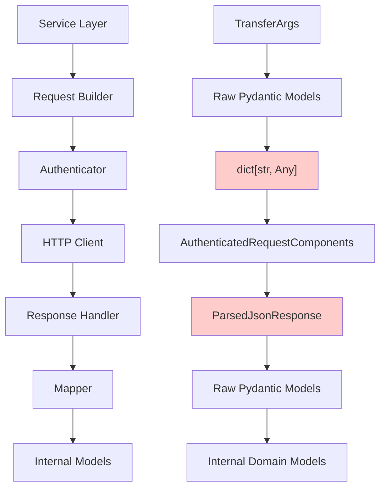
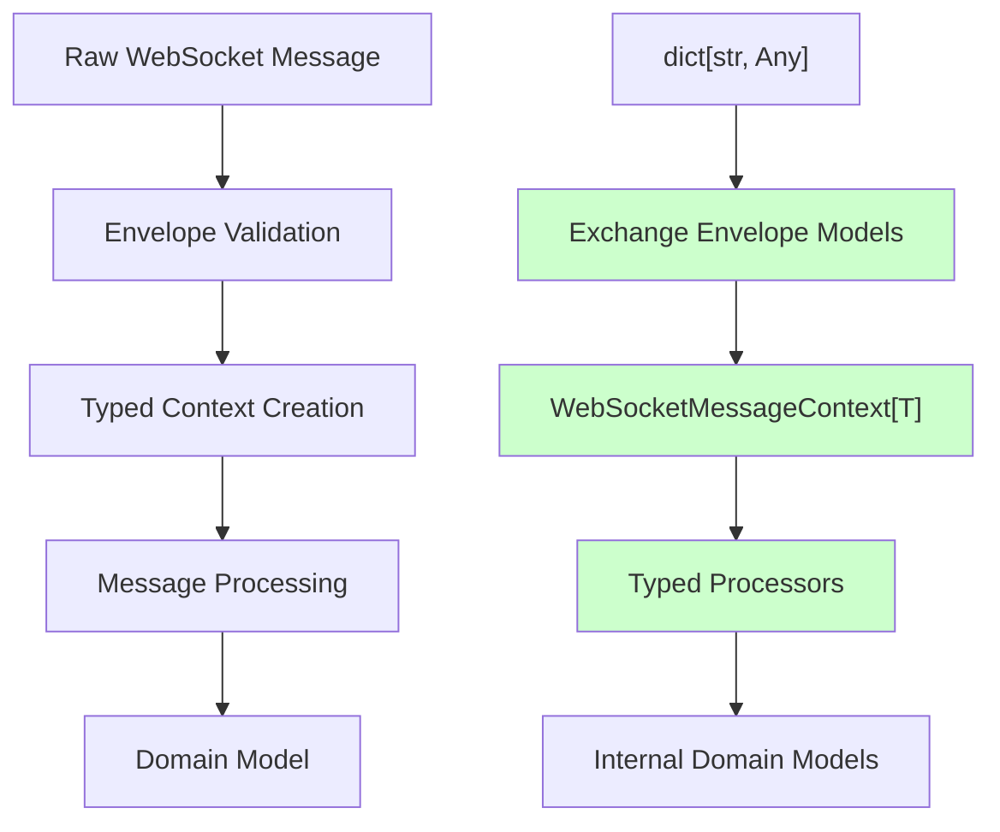
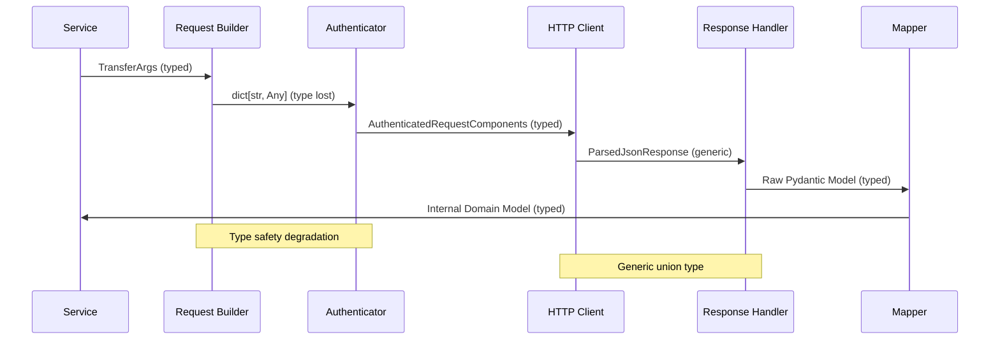
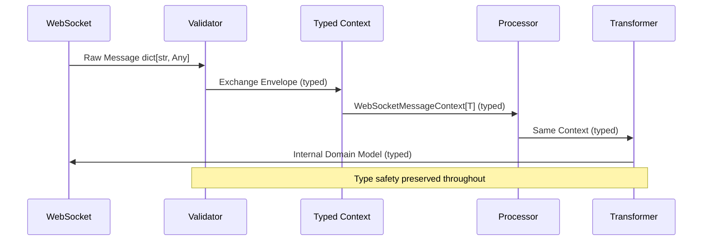

# HTTP Client Type Safety Refactor - First Look Analysis

## Executive Summary

This analysis compares the HTTP and WebSocket implementations in the CyberDeltaEngine API system, revealing significant architectural differences in type safety approaches. The WebSocket implementation demonstrates a mature, type-safe architecture, while the HTTP implementation has opportunities for improvement to achieve similar type safety guarantees.

## Current State Analysis

### HTTP Implementation Architecture

The HTTP implementation follows a well-structured layered architecture but suffers from type safety degradation at key boundaries:



**Type Safety Issues:**
- **Request Builder → Authenticator**: Loses type information via `model_dump()` → `dict[str, Any]`
- **HTTP Client Response**: Generic `ParsedJsonResponse` union type loses structure information
- **Authentication Interface**: Generic `dict[str, Any]` parameters to support multiple exchanges

### WebSocket Implementation Architecture

The WebSocket implementation demonstrates sophisticated type safety through protocols and generics:



**Type Safety Strengths:**
- **Protocol-Based Design**: `WebSocketEnvelope` protocol ensures consistent interface
- **Generic Type Preservation**: `WebSocketMessageContext[EnvelopeType]` maintains type information
- **No Dict Usage**: Completely avoids `dict[str, Any]` in processing pipeline

## Detailed Comparison

### Data Flow Analysis

#### HTTP Data Flow


#### WebSocket Data Flow


### Type Safety Comparison

| Aspect | HTTP Implementation | WebSocket Implementation |
|--------|-------------------|------------------------|
| **Interface Design** | `dict[str, Any]` parameters | Protocol-based with type constraints |
| **Context Objects** | Manual dictionary construction | `WebSocketMessageContext[T]` with generics |
| **Serialization** | Manual `model_dump()` calls | Strategy pattern with type preservation |
| **Validation** | Scattered validation logic | Layered validation pipeline |
| **Error Handling** | Exception-based with dict contexts | Structured exceptions with typed contexts |
| **Exchange Handling** | Manual type checking | Union types with discriminated patterns |

### Key Architectural Differences

#### HTTP Challenges
1. **Authenticator Interface Constraints**
   ```python
   # Current: Generic interface loses type safety
   async def prepare_request(
       self,
       method: str,
       path: str,
       params: dict[str, Any] | None,  # ❌ Type erasure
       data: dict[str, Any] | None,    # ❌ Type erasure
       headers: Mapping[str, Any] | None,
   ) -> AuthenticatedRequestComponents:
   ```

2. **Serialization Boundary Issues**
   ```python
   # Type information lost at serialization
   action_payload_dict = self._prepare_action_payload(data)  # dict[str, Any]
   ```

3. **Response Type Ambiguity**
   ```python
   # Generic response type requires runtime checking
   ParsedJsonResponse = dict[str, Any] | list[Any] | str
   ```

#### WebSocket Advantages
1. **Protocol-Based Type Safety**
   ```python
   @runtime_checkable
   class WebSocketEnvelope(Protocol):
       def get_routing_key(self) -> str: ...
       def get_payload(self) -> dict[str, Any] | list[Any]: ...
   ```

2. **Generic Context Preservation**
   ```python
   class WebSocketMessageContext[EnvelopeType: "BaseModel"](BaseModel):
       validated_envelope: EnvelopeType  # Type preserved
   ```

3. **Discriminated Union Processing**
   ```python
   WebSocketContextUnion = BackpackMessageContext | HyperliquidMessageContext
   ```

## Root Cause Analysis

### HTTP Type Safety Issues

1. **Legacy Interface Constraints**
   - `IAuthenticator` interface designed for maximum flexibility
   - Generic `dict[str, Any]` parameters to support diverse exchanges
   - No type parameterization in original design

2. **Serialization Strategy Limitations**
   - Pydantic `model_dump()` returns untyped dictionaries
   - Exchange-specific serialization requirements (by_alias variations)
   - No strategy pattern for serialization preservation

3. **Response Handling Genericity**
   - Single HTTP client serves multiple exchanges
   - Different response structures require generic union type
   - Type information lost between HTTP response and domain model

### WebSocket Type Safety Success Factors

1. **Protocol-First Design**
   - Envelope protocol enforces consistent interface
   - Runtime type checking with `@runtime_checkable`
   - Exchange-specific implementations maintain type safety

2. **Advanced Generic Usage**
   - Generic type parameters preserve type information
   - Bounded type variables ensure model constraints
   - Union types with discriminated patterns

3. **Layered Validation Architecture**
   - Each layer adds type safety guarantees
   - Structured error handling with typed contexts
   - No type information loss through pipeline

## Improvement Recommendations

### Phase 1: Interface Enhancement

#### 1.1 Typed Authenticator Interface
```python
class ITypedAuthenticator[TRequest: BaseModel, TResponse: BaseModel](Protocol):
    async def prepare_typed_request(
        self,
        method: str,
        path: str,
        params: BaseModel | None,
        data: TRequest | None,
        headers: HeaderModel | None,
    ) -> AuthenticatedRequestComponents[TRequest]:
```

#### 1.2 Exchange-Specific HTTP Clients
```python
class ExchangeHTTPClient[TExchange: ExchangeType](Generic[TExchange]):
    async def request[TRequest: BaseModel, TResponse: BaseModel](
        self,
        endpoint: EndpointConfig[TRequest, TResponse],
        payload: TRequest,
    ) -> TResponse:
```

### Phase 2: Serialization Strategy

#### 2.1 Strategy Pattern Implementation
```python
class SerializationStrategy[T: BaseModel](Protocol):
    def serialize_for_signing(self, model: T) -> dict[str, Any]
    def serialize_for_transport(self, model: T) -> dict[str, Any]
    def preserve_type_info(self) -> TypeInfo[T]
```

#### 2.2 Exchange-Specific Strategies
```python
class HyperliquidSerializationStrategy:
    def serialize_for_signing(self, model: BaseModel) -> dict[str, Any]:
        return model.model_dump(by_alias=False, exclude_none=False)

    def serialize_for_transport(self, model: BaseModel) -> dict[str, Any]:
        return model.model_dump(by_alias=True, exclude_none=True)
```

### Phase 3: Context Architecture

#### 3.1 HTTP Request Context
```python
class HTTPRequestContext[TPayload: BaseModel](BaseModel):
    validated_payload: TPayload
    exchange_type: ExchangeType
    endpoint: str
    method: HTTPMethod
    timestamp: datetime
    request_id: str
```

#### 3.2 Typed Response Handling
```python
class TypedResponseHandler[TRequest: BaseModel, TResponse: BaseModel]:
    async def handle_response(
        self,
        context: HTTPRequestContext[TRequest],
        raw_response: HTTPResponse,
    ) -> TResponse:
```

### Phase 4: Migration Strategy

#### 4.1 Backward Compatibility
- Maintain existing interfaces during transition
- Use adapter pattern for legacy integrations
- Gradual migration service by service

#### 4.2 Implementation Order
1. **Core Interfaces**: Start with typed authenticator and HTTP client
2. **Serialization**: Implement strategy pattern for each exchange
3. **Context Objects**: Replace dict contexts with typed contexts
4. **Integration**: Update services to use new typed interfaces

## Technical Implementation Plan

### Milestone 1: Foundation (2-3 weeks)
- [ ] Design typed authenticator interfaces
- [ ] Implement serialization strategy pattern
- [ ] Create HTTP request context models
- [ ] Prototype with single exchange (Hyperliquid)

### Milestone 2: Integration (3-4 weeks)
- [ ] Integrate typed interfaces with existing services
- [ ] Update request builders to use strategies
- [ ] Implement response type specialization
- [ ] Add comprehensive testing

### Milestone 3: Expansion (2-3 weeks)
- [ ] Extend to all exchanges (Backpack, etc.)
- [ ] Performance optimization and validation
- [ ] Migration of remaining dict-based code
- [ ] Documentation and training

### Milestone 4: Validation (1-2 weeks)
- [ ] Complete integration testing
- [ ] Performance benchmarking
- [ ] Security validation
- [ ] Production deployment

## Risk Assessment

### Low Risk
- **Backward Compatibility**: Adapter pattern maintains existing interfaces
- **Incremental Migration**: Service-by-service approach minimizes disruption
- **Proven Patterns**: WebSocket architecture provides tested blueprint

### Medium Risk
- **Performance Impact**: Additional type checking may affect latency
- **Complex Generics**: Advanced type system may impact developer experience
- **Integration Complexity**: Multiple exchange coordination

### High Risk
- **Authentication Changes**: EIP-712 signing is complex and critical
- **Production Impact**: HTTP client is core infrastructure
- **Type System Complexity**: May be difficult to maintain

## Success Metrics

### Type Safety Metrics
- [ ] Eliminate all `dict[str, Any]` usage in HTTP pipeline
- [ ] Achieve 100% mypy type checking compliance
- [ ] Zero runtime type errors in production

### Performance Metrics
- [ ] Maintain < 5ms additional latency per request
- [ ] No memory usage increase > 10%
- [ ] Maintain current throughput levels

### Developer Experience Metrics
- [ ] Reduce type-related bugs by 80%
- [ ] Improve IDE autocompletion coverage
- [ ] Reduce onboarding time for new developers

## Conclusion

The comparison reveals a significant opportunity to improve HTTP client type safety by adopting patterns proven successful in the WebSocket implementation. The WebSocket architecture demonstrates that comprehensive type safety is achievable without sacrificing performance or flexibility.

The proposed migration strategy provides a path to achieve WebSocket-level type safety in the HTTP layer while maintaining backward compatibility and minimizing risk. The investment in type safety will pay dividends in reduced bugs, improved developer experience, and increased system reliability.

This refactor represents a significant architectural improvement that will position the CyberDeltaEngine for future growth while eliminating a major source of technical debt.
