# Architecture Diagrams - Backpack Hummingbot Connector

## Overview
This document provides visual representations of the Backpack connector architecture, showing data flow, component relationships, and integration patterns.

## 1. High-Level Architecture

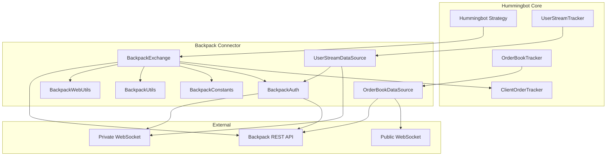

## 2. Component Interaction Flow

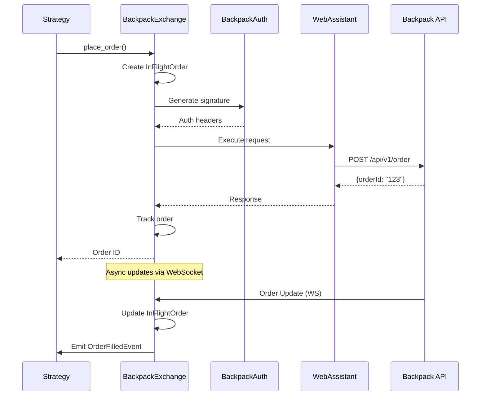

## 3. Data Flow Architecture

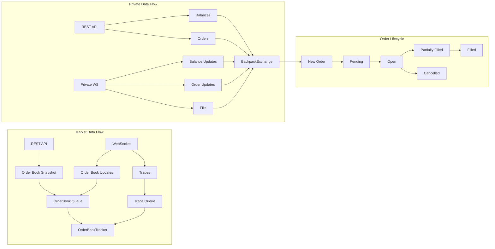

## 4. WebSocket Connection Architecture

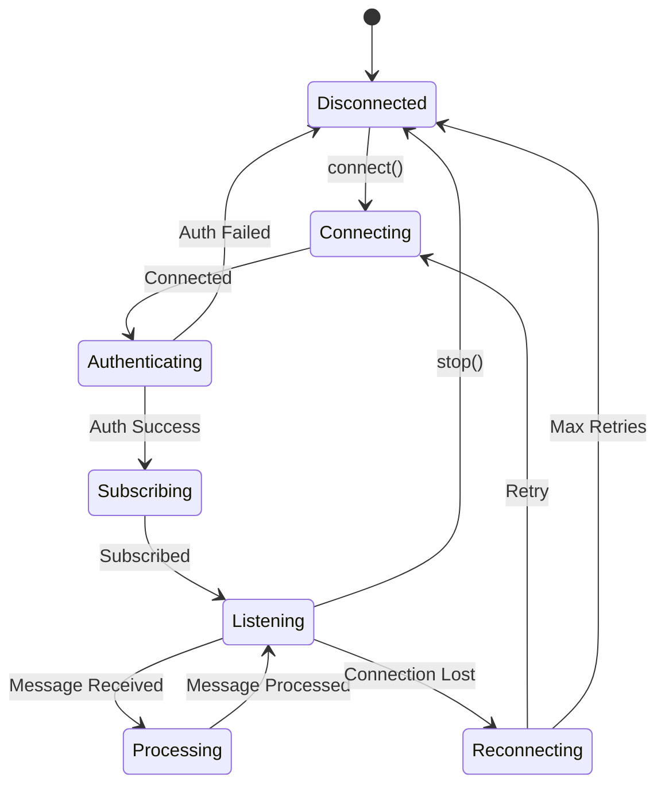

## 5. Authentication Flow

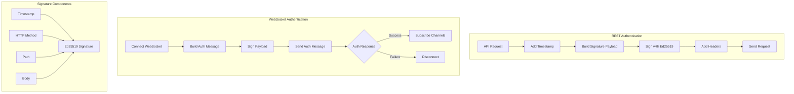

## 6. Order Management State Machine

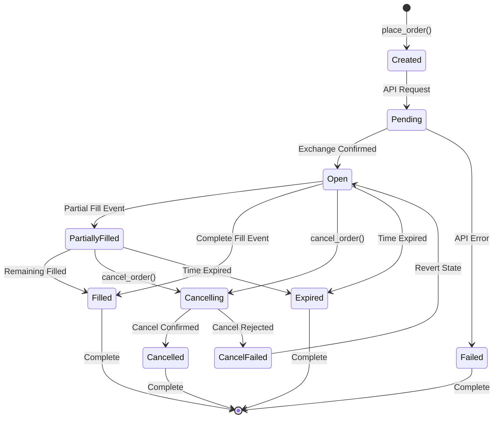

## 7. Class Hierarchy

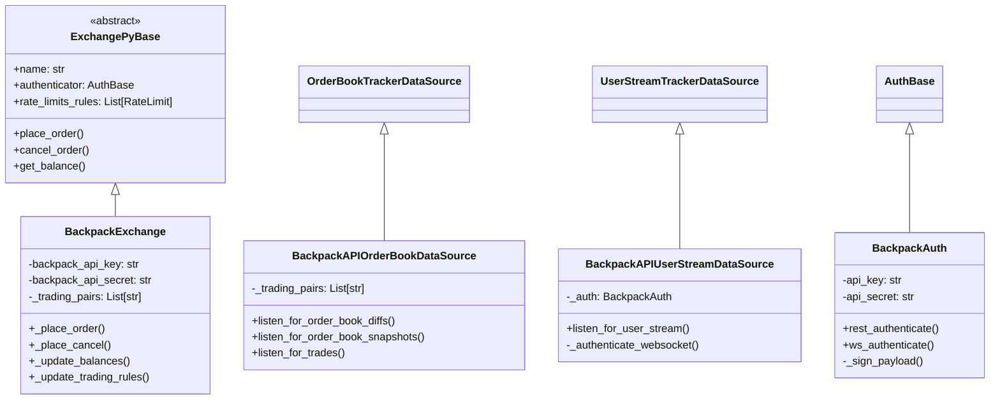

## 8. Rate Limiting Architecture

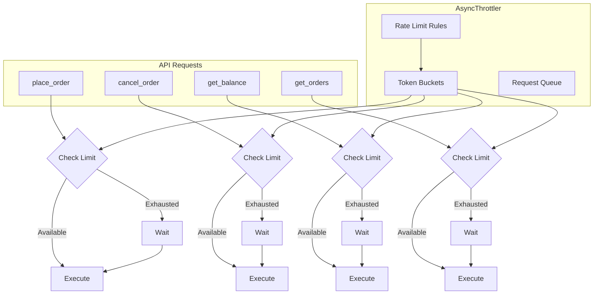

## 9. Error Handling Flow

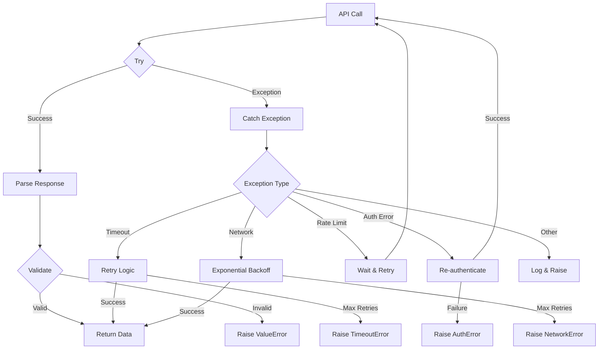

## 10. Message Processing Pipeline

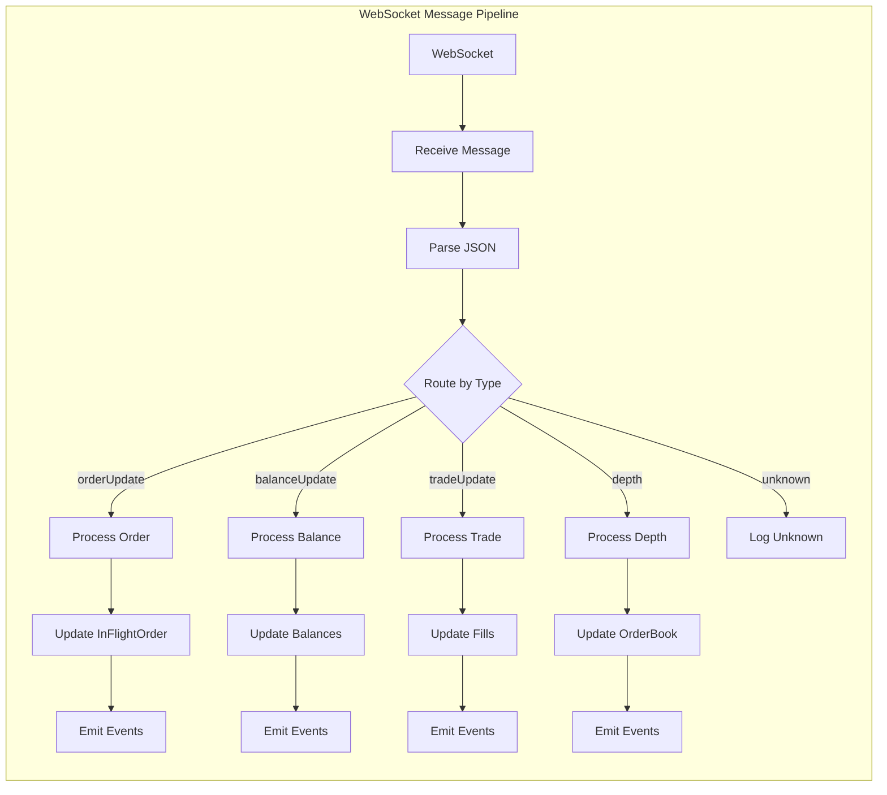

## 11. Minimal Implementation Path

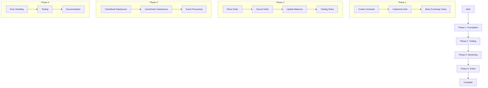

## 12. Testing Architecture

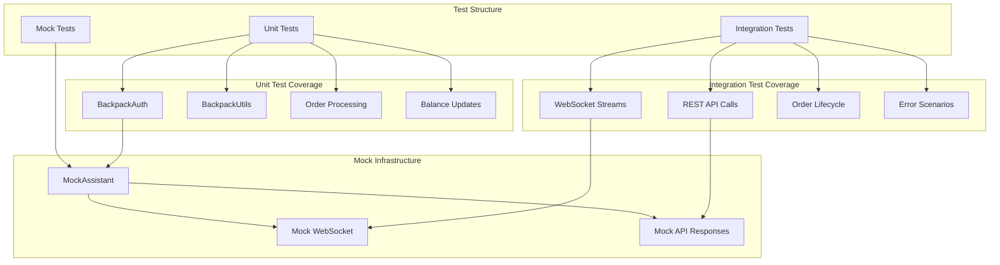

## Summary

These diagrams illustrate:

1. **Component Architecture**: How Backpack connector integrates with Hummingbot core
2. **Data Flow**: How market and private data flows through the system
3. **State Management**: Order lifecycle and WebSocket connection states
4. **Authentication**: Ed25519 signing process for REST and WebSocket
5. **Error Handling**: Robust error recovery patterns
6. **Message Processing**: WebSocket message routing and handling
7. **Implementation Path**: Phased approach for building the connector

The architecture follows Hummingbot's established patterns while incorporating Backpack-specific requirements like Ed25519 authentication and the exchange's WebSocket message formats.
