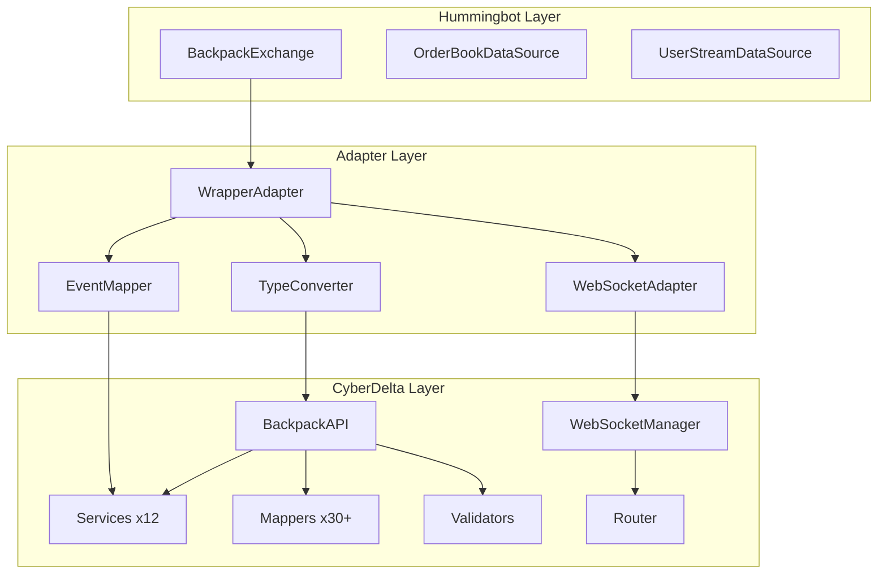
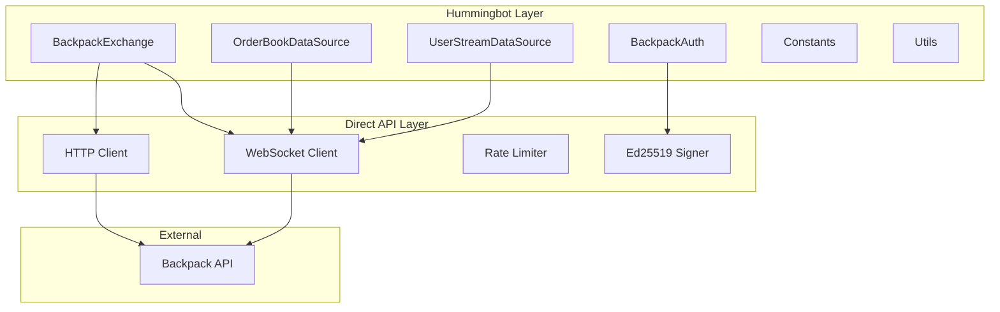

# Wrapper vs Clean Implementation: Technical Analysis

## Executive Summary

This document analyzes two approaches for implementing a Backpack connector for Hummingbot:
1. **Wrapper Approach**: Thin adapter layer around CyberDelta's existing BackpackAPI
2. **Clean Implementation**: Direct implementation of Hummingbot connector without CyberDelta

## Architecture Comparison

### Wrapper Approach



### Clean Implementation



## Implementation Complexity

### Wrapper Approach

| Component | Complexity | Lines of Code | Time Estimate |
|-----------|------------|---------------|---------------|
| WrapperAdapter | High | 800-1000 | 3 days |
| TypeConverter | Very High | 1500-2000 | 5 days |
| EventMapper | Medium | 500-700 | 2 days |
| WebSocketAdapter | High | 700-900 | 3 days |
| CircularDependencyResolution | High | 300-500 | 2 days |
| Testing | Very High | 2000-3000 | 5 days |
| **Total** | **Very High** | **5800-8100** | **20 days** |

#### Complexity Drivers:
1. **Type System Mismatch**
   - CyberDelta: Pydantic v2, Python 3.13 features
   - Hummingbot: dictionaries, Python 3.10
   - Need extensive conversion layer

2. **Architecture Mismatch**
   - CyberDelta: Service-oriented with 12+ services
   - Hummingbot: Monolithic connector pattern
   - Complex mapping required

3. **State Management**
   - Dual state tracking (CyberDelta + Hummingbot)
   - Synchronization challenges
   - Memory overhead

### Clean Implementation

| Component | Complexity | Lines of Code | Time Estimate |
|-----------|------------|---------------|---------------|
| BackpackExchange | Medium | 600-800 | 2 days |
| OrderBookDataSource | Low | 200-300 | 1 day |
| UserStreamDataSource | Medium | 300-400 | 1 day |
| BackpackAuth | Low | 150-200 | 0.5 days |
| Constants/Utils | Low | 200-300 | 0.5 days |
| WebUtils | Low | 150-200 | 0.5 days |
| Testing | Medium | 1000-1500 | 3 days |
| **Total** | **Medium** | **2600-3700** | **8.5 days** |

#### Complexity Drivers:
1. **Direct Implementation**
   - Follow existing Hummingbot patterns
   - Copy from Hyperliquid connector (similar API)
   - No translation layer needed

2. **Simple Architecture**
   - Direct API calls
   - Single state management
   - Native Hummingbot types

## Feature Comparison

### API Coverage

| Feature | Wrapper | Clean | Notes |
|---------|---------|-------|-------|
| Spot Trading | ✅ Full | ✅ Basic | Wrapper gets all CyberDelta features |
| Perp Trading | ✅ Full | ❌ Later | Wrapper includes perp support |
| Advanced Orders | ✅ All types | ✅ Basic | Clean implements what Hummingbot needs |
| WebSocket Streams | ✅ All | ✅ Required | Clean implements only needed streams |
| Error Handling | ✅ Sophisticated | ✅ Basic | CyberDelta has retry logic, circuit breakers |
| Rate Limiting | ✅ Advanced | ✅ Simple | CyberDelta has dynamic adjustment |

### Code Quality

| Aspect | Wrapper | Clean | Winner |
|--------|---------|-------|--------|
| Type Safety | ⚠️ Complex conversion | ✅ Native | Clean |
| Maintainability | ❌ Two codebases | ✅ Single | Clean |
| Testing | ❌ Complex mocking | ✅ Simple | Clean |
| Performance | ❌ Multiple layers | ✅ Direct | Clean |
| Debugging | ❌ Deep stack traces | ✅ Simple | Clean |

## Performance Analysis

### Wrapper Approach Performance

```python
# Call Stack Depth
Strategy.place_order()
  → BackpackExchange._place_order()
    → WrapperAdapter.place_order()
      → TypeConverter.convert_order_params()
      → CyberDeltaBridge.place_order()
        → BackpackAPI.place_order()
          → TradingService.place_order()
            → OrderPlacementService.place_single_order()
              → RequestBuilder.build_order_request()
              → HttpClient.post()
# 10 layers deep!
```

**Latency Impact**:
- Type conversion: +5-10ms
- Service routing: +3-5ms
- Validation layers: +2-3ms
- **Total overhead: +10-18ms per operation**

### Clean Implementation Performance

```python
# Call Stack Depth
Strategy.place_order()
  → BackpackExchange._place_order()
    → self._api_post("/api/v1/order")
      → HttpClient.post()
# 4 layers deep
```

**Latency Impact**:
- Direct call: ~0ms overhead
- **Total overhead: Minimal**

## Risk Analysis

### Wrapper Approach Risks

| Risk | Probability | Impact | Mitigation |
|------|-------------|--------|------------|
| Circular dependencies | High | Critical | Complex architecture needed |
| Python version incompatibility | High | High | Downgrade features |
| CyberDelta API changes | Medium | High | Version pinning |
| Memory leaks from dual state | Medium | Medium | Careful cleanup |
| Performance degradation | High | Medium | Caching, optimization |
| Debugging complexity | High | High | Extensive logging |

### Clean Implementation Risks

| Risk | Probability | Impact | Mitigation |
|------|-------------|--------|------------|
| Missing edge cases | Low | Low | Copy from Hyperliquid |
| API changes | Low | Low | Simple updates |
| Limited features initially | Medium | Low | Incremental addition |
| Duplicate code | Medium | Low | Acceptable tradeoff |

## Maintenance Considerations

### Wrapper Approach

**Advantages**:
- Inherits CyberDelta improvements
- Sophisticated error handling
- Comprehensive feature set

**Disadvantages**:
- Must maintain compatibility layer
- Two codebases to understand
- Complex debugging
- Circular dependency management
- Version synchronization issues

### Clean Implementation

**Advantages**:
- Single codebase
- Direct control
- Simple debugging
- Easy to modify
- No dependency issues

**Disadvantages**:
- Must implement features independently
- No automatic improvements from CyberDelta
- Duplicate effort

## Real-World Examples

### Similar Decisions in Other Projects

1. **ccxt Library**
   - Originally wrapped exchange APIs
   - Moved to clean implementations
   - Reason: Maintenance nightmare

2. **Hummingbot's Binance Connector**
   - Started with python-binance wrapper
   - Rewrote as clean implementation
   - Reason: Performance and control

3. **DeFi Protocols**
   - Many started wrapping web3.py
   - Moved to direct implementations
   - Reason: Gas optimization, control

## Decision Matrix

| Criteria | Weight | Wrapper | Clean | Weighted Score |
|----------|--------|---------|-------|----------------|
| Implementation Speed | 15% | 2/10 | 8/10 | W:0.3, C:1.2 |
| Maintainability | 25% | 3/10 | 9/10 | W:0.75, C:2.25 |
| Performance | 20% | 4/10 | 9/10 | W:0.8, C:1.8 |
| Feature Completeness | 15% | 10/10 | 6/10 | W:1.5, C:0.9 |
| Risk Level | 15% | 3/10 | 8/10 | W:0.45, C:1.2 |
| Debugging Ease | 10% | 2/10 | 9/10 | W:0.2, C:0.9 |
| **Total** | **100%** | **4.0** | **8.25** | **Clean Wins** |

## Code Examples

### Wrapper Approach Complexity

```python
# Type conversion nightmare
class TypeConverter:
    def hb_to_cd_order(self,
                       trading_pair: str,
                       amount: Decimal,
                       order_type: OrderType,
                       is_buy: bool,
                       price: Optional[Decimal]) -> PlaceOrderArgs:
        # Convert Hummingbot types to CyberDelta
        symbol = self._parse_trading_pair(trading_pair)  # BTC-USDC → Symbol

        # Map order type
        cd_order_type = self._map_order_type(order_type)  # OrderType → CyberDeltaOrderType

        # Create CyberDelta args (Pydantic v2)
        args = PlaceOrderArgs(
            symbol=symbol,
            side=OrderSide.BUY if is_buy else OrderSide.SELL,
            order_type=cd_order_type,
            quantity=amount,
            price=price,
            # ... 10 more fields
        )

        # Downgrade for Python 3.10 compatibility
        return self._downgrade_pydantic_model(args)
```

### Clean Implementation Simplicity

```python
# Direct and simple
class BackpackExchange(ExchangePyBase):
    async def _place_order(self,
                          order_id: str,
                          trading_pair: str,
                          amount: Decimal,
                          order_type: OrderType,
                          is_buy: bool,
                          price: Optional[Decimal] = None) -> str:
        # Direct API call
        params = {
            "symbol": trading_pair,
            "side": "Buy" if is_buy else "Sell",
            "orderType": order_type.name,
            "quantity": str(amount),
            "price": str(price) if price else None,
            "clientId": order_id,
        }

        response = await self._api_post("/api/v1/order", params)
        return response["orderId"]
```

## Recommendation

### **Choose Clean Implementation**

**Reasoning**:

1. **Faster Development**: 8.5 days vs 20 days
2. **Maintainable**: Single codebase, simple architecture
3. **Performant**: Direct API calls, minimal overhead
4. **Debuggable**: Simple stack traces, clear flow
5. **Proven Pattern**: All Hummingbot connectors use this approach
6. **No Circular Risks**: Complete isolation from CyberDelta

**The wrapper approach would be appropriate if**:
- CyberDelta was designed as a library for Hummingbot
- There was no architecture mismatch
- Python versions were compatible
- Performance wasn't critical

**But given**:
- CyberDelta is a complete trading engine
- Significant architecture differences
- Python version incompatibility
- Performance requirements

**Clean implementation is the clear choice.**

## Migration Strategy

If starting with clean implementation:

1. **Phase 1**: Basic spot trading (3 days)
2. **Phase 2**: WebSocket integration (2 days)
3. **Phase 3**: Advanced features (2 days)
4. **Phase 4**: Testing and polish (1.5 days)

Total: **8.5 days to production**

## Conclusion

While the wrapper approach offers feature completeness, the complexity cost is too high. Clean implementation provides a maintainable, performant solution that follows Hummingbot patterns and can be built in less than half the time.
