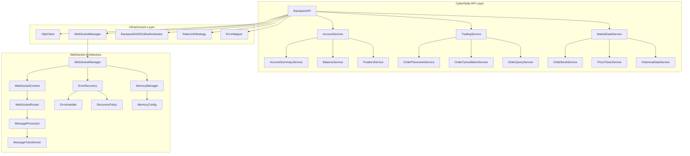
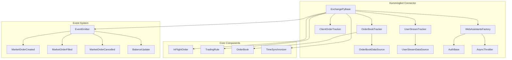
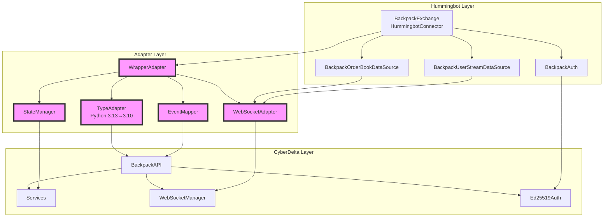
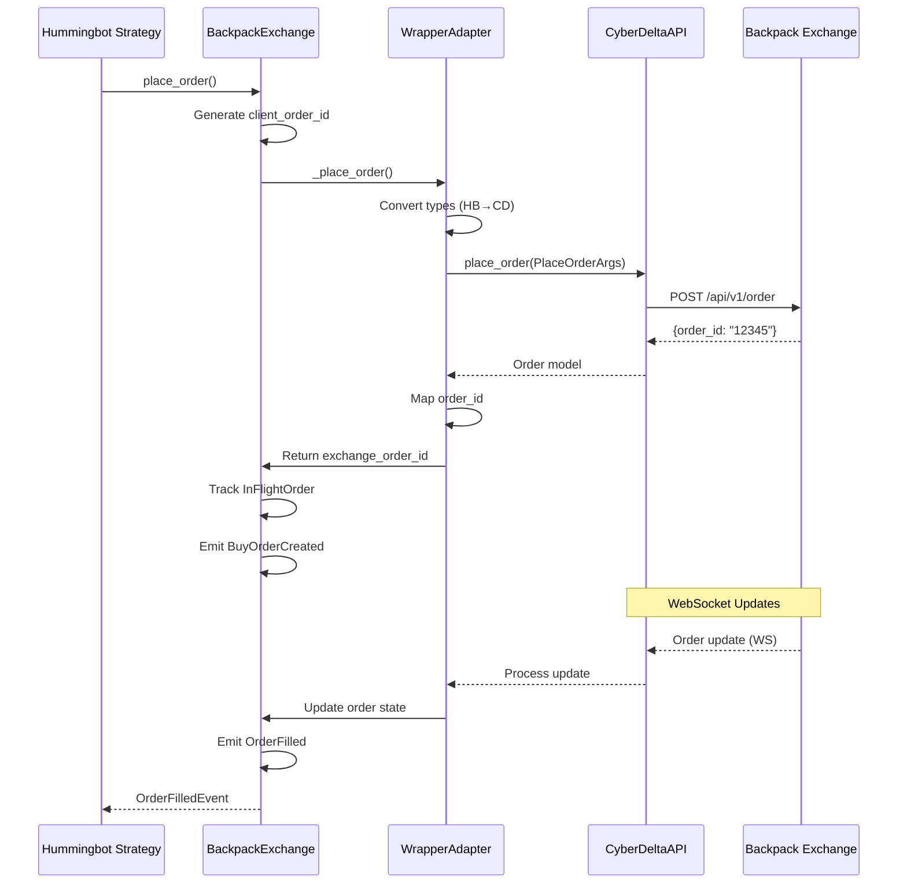
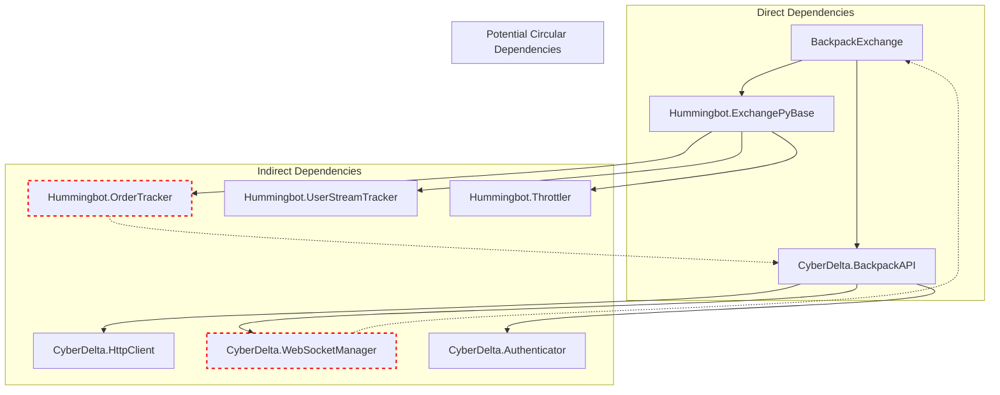
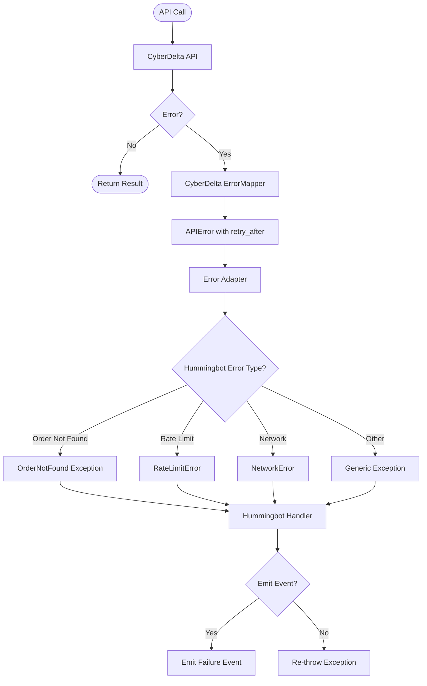
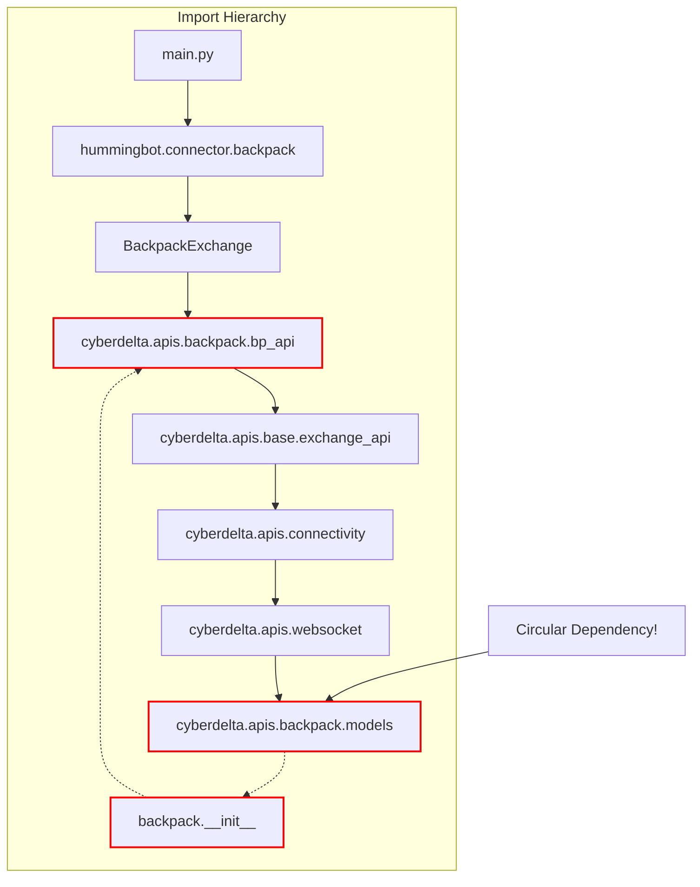
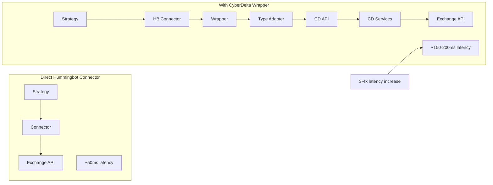

# Architecture Diagrams: CyberDelta-Hummingbot Integration

## 1. Current CyberDelta Architecture



## 2. Current Hummingbot Architecture



## 3. Proposed Integration Architecture



## 4. Order Lifecycle Flow



## 5. WebSocket Message Flow

```mermaid
graph LR
    subgraph "Backpack Exchange"
        BWS[WebSocket Server]
    end

    subgraph "CyberDelta WebSocket"
        CDWS[WebSocketManager]
        CDWS --> CTX[WebSocketContext]
        CTX --> RTR[Router]
        RTR --> PROC[Processor]
        PROC --> TRANS[Transformer]
    end

    subgraph "Adapter"
        WSA[WebSocketAdapter]
        MQ[MessageQueue]
        MC[MessageConverter]
    end

    subgraph "Hummingbot"
        USDS[UserStreamDataSource]
        Q[asyncio.Queue]
        EM[EventManager]
    end

    BWS --> CDWS
    TRANS --> WSA
    WSA --> MC
    MC --> MQ
    MQ --> USDS
    USDS --> Q
    Q --> EM
```



## 6. State Synchronization

```mermaid
stateDiagram-v2
    [*] --> Pending: place_order()

    state "Hummingbot States" as HB {
        Pending --> Open: Exchange confirms
        Open --> PartiallyFilled: Partial fill
        Open --> Filled: Complete fill
        Open --> Cancelled: Cancel success
        PartiallyFilled --> Filled: Remaining filled
        PartiallyFilled --> Cancelled: Cancel partial
    }

    state "CyberDelta States" as CD {
        New --> Active: Acknowledged
        Active --> PartialFilled: Fill event
        Active --> Filled: Complete
        Active --> Canceled: Cancel
        PartialFilled --> Filled: Complete
        PartialFilled --> Canceled: Cancel
    }

    state "State Mapper" as SM {
        New --> Pending
        Active --> Open
        PartialFilled --> PartiallyFilled
        Filled --> Filled
        Canceled --> Cancelled
    }
```

## 7. Component Dependencies



## 8. Error Handling Flow



## 9. Module Import Tree



## 10. Performance Impact Analysis



## Key Architecture Insights

### 1. Layer Complexity
The integration requires a multi-layer adapter architecture to bridge the two systems, adding complexity but maintaining separation of concerns.

### 2. State Management
Dual state machines (Hummingbot's InFlightOrder and CyberDelta's Order model) require careful synchronization.

### 3. WebSocket Adaptation
CyberDelta's sophisticated WebSocket architecture needs simplification for Hummingbot's queue-based approach.

### 4. Circular Dependency Risk
Multiple points where circular dependencies could occur, especially around WebSocket handlers and order tracking.

### 5. Performance Overhead
The wrapper approach adds 3-4 layers of indirection, potentially impacting latency-sensitive operations.

## Recommendations

1. **Minimize Layers**: Bypass CyberDelta services where possible for critical operations
2. **Lazy Loading**: Use lazy imports to prevent circular dependencies
3. **Async Optimization**: Ensure all adapter operations are truly async
4. **Caching**: Cache trading rules, market info to reduce API calls
5. **Direct Paths**: Create direct paths for time-critical operations (order placement/cancellation)
