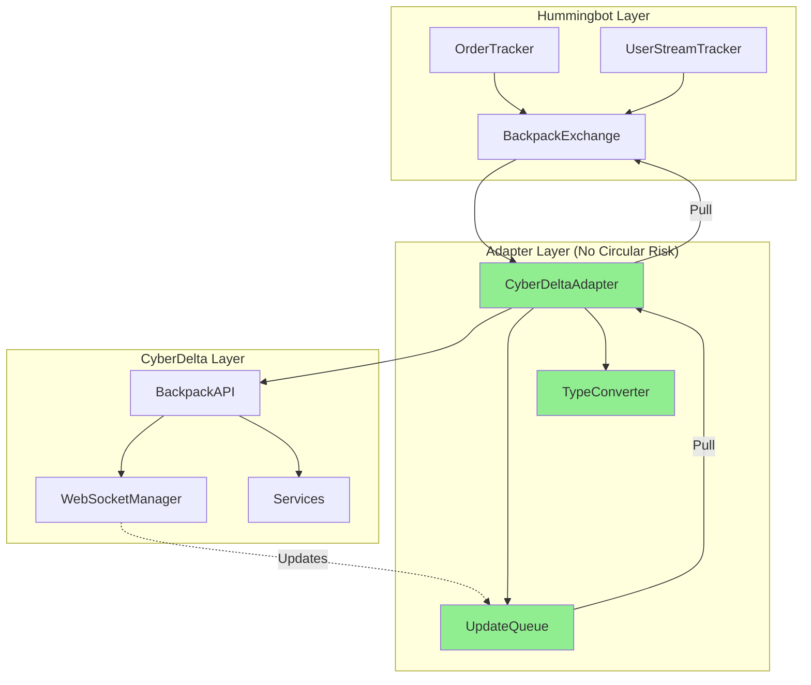

# Circular Dependency Resolution Strategy

## Analysis of Specific Circular Risks

### Risk 1: Hummingbot → CyberDelta → Hummingbot
```
BackpackExchange → BackpackAPI → ExchangeAPI → WebSocketManager
    → HummingbotUserStream → BackpackExchange
```

**THE PROBLEM**: CyberDelta's WebSocketManager should NOT know about Hummingbot at all!

**RESOLUTION**: Break the chain at WebSocketManager

```python
# WRONG - Creates circular dependency
class CyberDeltaWebSocketManager:
    def __init__(self, user_stream: HummingbotUserStream):  # ❌ NO!
        self.user_stream = user_stream

    async def process_message(self, msg):
        self.user_stream.handle(msg)  # Direct callback = circular

# CORRECT - Use callbacks/protocols
class CyberDeltaWebSocketManager:
    def __init__(self, message_handler: Callable[[dict], None] = None):  # ✅
        self.message_handler = message_handler  # Just a function, no import

    async def process_message(self, msg):
        if self.message_handler:
            self.message_handler(msg)  # No knowledge of Hummingbot

# In BackpackExchange
class BackpackExchange(ExchangePyBase):
    def __init__(self):
        # CyberDelta doesn't import Hummingbot
        self._cd_api = BackpackAPI(
            ws_message_handler=self._handle_ws_message  # Pass callback
        )

    def _handle_ws_message(self, msg: dict):
        # Process in Hummingbot context
        self._user_stream.put_nowait(msg)
```

### Risk 2: Order Tracker Cycle
```
ClientOrderTracker → BackpackExchange → CyberDelta Services
    → Event Emitter → ClientOrderTracker
```

**THE PROBLEM**: CyberDelta should not emit events directly to Hummingbot components!

**RESOLUTION**: One-way data flow only

```python
# WRONG - Bidirectional updates
class BackpackExchange:
    def __init__(self):
        self._cd_api = BackpackAPI()
        # CyberDelta emits to our tracker - CIRCULAR!
        self._cd_api.on_order_update = self._order_tracker.update_order  # ❌

# CORRECT - Pull updates, don't push
class BackpackExchange:
    def __init__(self):
        self._cd_api = BackpackAPI()
        # Store updates in CyberDelta
        self._cd_updates_queue = asyncio.Queue()

    async def _process_cd_updates(self):
        """Pull updates from CyberDelta, push to Hummingbot"""
        while True:
            # CyberDelta stores updates
            updates = await self._cd_api.get_pending_updates()
            for update in updates:
                # We control when/how to update our tracker
                self._order_tracker.update_order(update)
            await asyncio.sleep(0.1)
```

## Is `vendor/hummingbot` Structure Problematic?

### Current Structure Analysis

```
CyberDeltaEngine/
├── cyberdelta/           # Our code
│   └── apis/
│       └── backpack/     # CyberDelta Backpack implementation
├── vendor/
│   └── hummingbot/       # Git submodule (read-only)
│       └── hummingbot/
│           └── connector/
└── worktrees/
    └── hummingbot-dev/   # Worktree for development
        └── hummingbot/
            └── connector/
                └── exchange/
                    └── backpack/  # Our NEW connector here
```

### Problems with Current Structure

1. **Import Confusion**
```python
# Which hummingbot are we importing from?
from hummingbot.connector.exchange_py_base import ExchangePyBase  # vendor/?
from hummingbot.connector.exchange.backpack import BackpackExchange  # worktree/?
```

2. **Python Path Issues**
```python
# Need multiple paths
sys.path.append('/workspaces/CyberDeltaEngine')  # For cyberdelta
sys.path.append('/workspaces/CyberDeltaEngine/vendor/hummingbot')  # For hummingbot base
sys.path.append('/workspaces/CyberDeltaEngine/worktrees/hummingbot-dev')  # For our connector
```

3. **Testing Complexity**
- Tests need to import from multiple locations
- Mock paths become confusing
- CI/CD needs special configuration

## Recommended Structure

### Option 1: Separate Connector Package (BEST)

```
CyberDeltaEngine/
├── cyberdelta/                    # Main CyberDelta code
├── vendor/hummingbot/             # Submodule (unchanged)
└── cyberdelta-hummingbot-connector/  # NEW separate package
    ├── pyproject.toml
    ├── src/
    │   └── backpack_connector/
    │       ├── __init__.py
    │       ├── connector.py      # BackpackExchange
    │       ├── adapter/           # Adapters to CyberDelta
    │       │   ├── __init__.py
    │       │   ├── api_bridge.py # Bridges to CyberDelta API
    │       │   └── ws_bridge.py  # Bridges WebSocket
    │       └── interfaces/        # Protocols only
    │           └── protocols.py
    └── tests/
```

**Benefits**:
- Clear separation
- No circular import risk
- Easy to test independently
- Can be pip installed into hummingbot

### Option 2: Plugin Architecture in Worktree

```
worktrees/hummingbot-dev/
└── hummingbot/
    └── connector/
        └── exchange/
            └── backpack/
                ├── __init__.py
                ├── backpack_exchange.py   # Minimal, imports adapter
                └── _cyberdelta_adapter/   # Private module
                    ├── __init__.py
                    ├── bridge.py          # All CyberDelta imports here
                    └── protocols.py       # Interfaces only
```

**Implementation**:
```python
# backpack_exchange.py - NO CyberDelta imports
from ._cyberdelta_adapter.protocols import IAPIBridge

class BackpackExchange(ExchangePyBase):
    def __init__(self, api_bridge: IAPIBridge = None):
        if api_bridge is None:
            # Lazy import only when needed
            from ._cyberdelta_adapter.bridge import CyberDeltaBridge
            api_bridge = CyberDeltaBridge()
        self._api = api_bridge

# _cyberdelta_adapter/bridge.py - ALL CyberDelta imports
import sys
sys.path.append('/workspaces/CyberDeltaEngine')
from cyberdelta.apis.backpack import BackpackAPI

class CyberDeltaBridge(IAPIBridge):
    def __init__(self):
        self._cd_api = BackpackAPI(...)
```

## Concrete Resolution Steps

### Step 1: Isolate CyberDelta Imports

```python
# Create adapter module that contains ALL CyberDelta imports
# cyberdelta_adapter.py
import sys
sys.path.append('/workspaces/CyberDeltaEngine')

from cyberdelta.apis.backpack.bp_api import BackpackAPI
from cyberdelta.apis.backpack.bp_auth import BackpackEd25519Authenticator
from cyberdelta.apis.models.service_args.trading import PlaceOrderArgs

class CyberDeltaAdapter:
    """All CyberDelta interaction happens here"""

    def __init__(self, config: dict):
        self._api = BackpackAPI(...)
        self._updates = asyncio.Queue()

    async def place_order(self, **kwargs):
        # Convert and call CyberDelta
        args = PlaceOrderArgs(...)
        return await self._api.place_order(args)

    async def get_updates(self):
        # Return updates without callbacks
        return await self._updates.get()
```

### Step 2: Connector Uses Only Adapter

```python
# backpack_exchange.py - NO CyberDelta imports!
from .cyberdelta_adapter import CyberDeltaAdapter

class BackpackExchange(ExchangePyBase):
    def __init__(self, ...):
        super().__init__(...)
        # Only knows about adapter
        self._adapter = CyberDeltaAdapter(config)

    async def _place_order(self, ...):
        # Use adapter, not CyberDelta directly
        return await self._adapter.place_order(...)
```

### Step 3: WebSocket Without Callbacks

```python
# backpack_api_user_stream_data_source.py
class BackpackAPIUserStreamDataSource(UserStreamTrackerDataSource):
    def __init__(self, adapter: CyberDeltaAdapter):
        self._adapter = adapter

    async def listen_for_user_stream(self, output: asyncio.Queue):
        """Pull updates from adapter, no callbacks"""
        while True:
            try:
                # Adapter stores updates, we pull them
                update = await self._adapter.get_updates()
                output.put_nowait(update)
            except Exception as e:
                self.logger().error(f"Error: {e}")
                await asyncio.sleep(5)
```

## Testing the Solution

### Circular Dependency Test

```python
# test_no_circular.py
def test_imports():
    """Ensure no circular imports"""

    # Step 1: Import CyberDelta alone
    import cyberdelta.apis.backpack

    # Step 2: Clear imports
    import sys
    for key in list(sys.modules.keys()):
        if 'hummingbot' in key or 'cyberdelta' in key:
            del sys.modules[key]

    # Step 3: Import Hummingbot connector alone
    from hummingbot.connector.exchange.backpack import BackpackExchange

    # Step 4: Clear again
    for key in list(sys.modules.keys()):
        if 'hummingbot' in key or 'cyberdelta' in key:
            del sys.modules[key]

    # Step 5: Import both
    import cyberdelta.apis.backpack
    from hummingbot.connector.exchange.backpack import BackpackExchange

    # If we get here, no circular dependency!
    assert True
```

## Final Architecture



## Key Principles

1. **CyberDelta Never Imports Hummingbot** - One-way dependency only
2. **No Direct Callbacks** - Use queues/polling instead
3. **Single Adapter Module** - All CyberDelta imports in one place
4. **Pull, Don't Push** - Hummingbot pulls updates from adapter
5. **Lazy Imports** - Import CyberDelta only when needed

## Recommended Approach

1. **Use Option 1**: Create separate connector package
2. **Implement Adapter Pattern**: All CyberDelta interaction through adapter
3. **Use Queues**: No direct callbacks between systems
4. **Test Early**: Run circular dependency tests from day 1
5. **Document Clearly**: Mark which modules can import what

This approach completely eliminates circular dependency risk while maintaining clean architecture.
