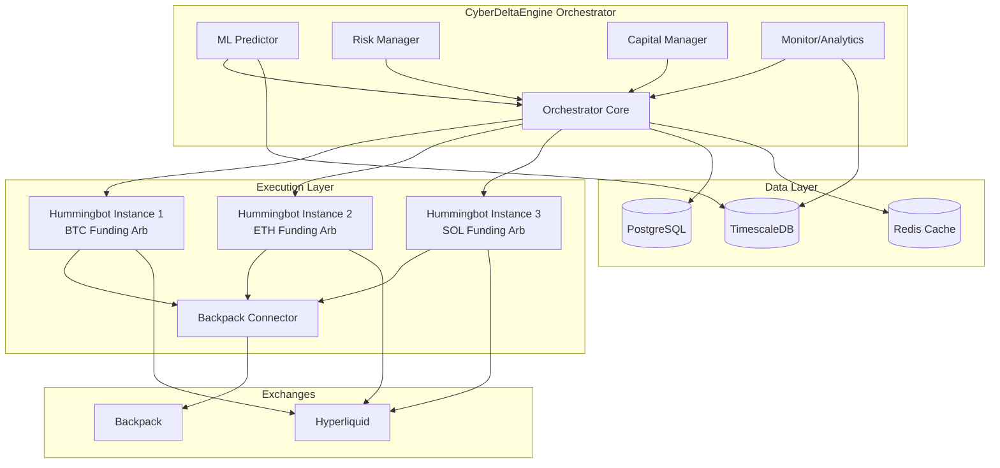
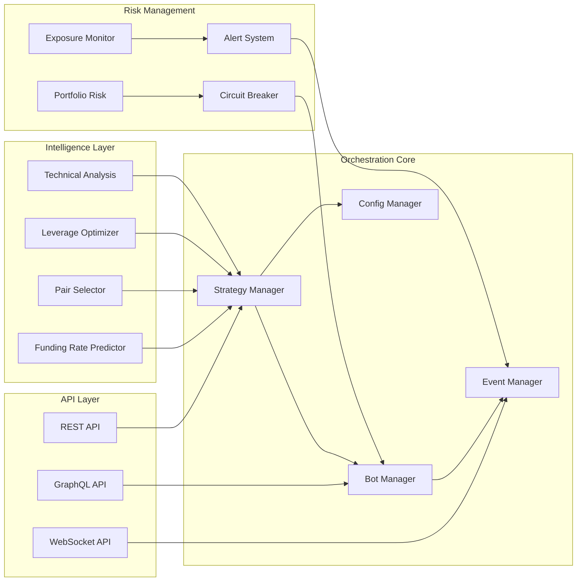
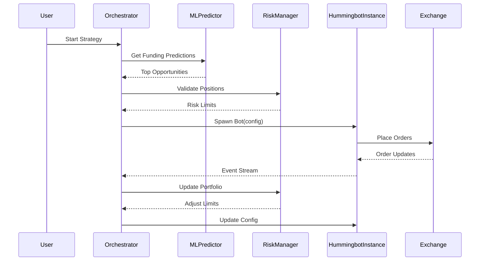

# Hummingbot Integration Strategy for CyberDeltaEngine

## Executive Summary
Leveraging Hummingbot as the core execution engine while building CyberDeltaEngine as an intelligent orchestration layer that adds Backpack support and sophisticated portfolio management capabilities.

## 1. Backpack Connector Strategy

### Option A: Private Connector as Python Package (Recommended)

```python
# Structure: cyberdelta-hummingbot-backpack/
cyberdelta_hummingbot_backpack/
├── __init__.py
├── backpack_exchange.py          # Main connector class
├── backpack_api_order_book_data_source.py
├── backpack_api_user_stream_data_source.py
├── backpack_auth.py              # Auth from your existing code
├── backpack_web_assistant.py     # REST/WS handlers
└── backpack_utils.py

# Installation in Hummingbot:
pip install git+ssh://git@github.com/YOUR_PRIVATE_REPO/cyberdelta-hummingbot-backpack.git
```

**Advantages:**
- Keep proprietary code private
- No public fork needed
- Can monetize later
- Easy updates

**Implementation leveraging your code:**
```python
# backpack_exchange.py - Wrapper around your existing API
from hummingbot.connector.exchange_py_base import ExchangePyBase
from cyberdelta.apis.backpack import BackpackAPI  # Your existing code
from cyberdelta.models.backpack import BackpackOrderModel

class BackpackExchange(ExchangePyBase):
    def __init__(self, api_key: str, api_secret: str, trading_pairs: List[str]):
        super().__init__()
        # Use your existing BackpackAPI
        self._api = BackpackAPI(
            api_key=api_key,
            api_secret=api_secret
        )

    async def _place_order(
        self,
        order_id: str,
        trading_pair: str,
        amount: Decimal,
        order_type: OrderType,
        is_buy: bool,
        price: Optional[Decimal] = None,
    ) -> str:
        # Leverage your existing order placement logic
        result = await self._api.place_order(
            symbol=trading_pair,
            side="Buy" if is_buy else "Sell",
            order_type=order_type.name,
            quantity=amount,
            price=price
        )
        return result.order_id
```

### Option B: Plugin Architecture (Alternative)

```python
# hummingbot_plugins/backpack_connector/
├── __init__.py
├── manifest.json
└── connector/
    ├── backpack.py
    └── backpack_config.yml

# manifest.json
{
    "name": "backpack_connector",
    "version": "1.0.0",
    "type": "exchange_connector",
    "private": true,
    "entry_point": "connector.backpack:BackpackExchange"
}
```

## 2. Private Integration Without Public Forking

### Strategy: Git Subtree with Private Overlay

```bash
# Initial setup
git clone https://github.com/hummingbot/hummingbot.git hummingbot-base
cd hummingbot-base

# Create private overlay repository
git remote add private git@github.com:YOUR_ORG/cyberdelta-hummingbot-private.git

# Add your custom code in separate directory
mkdir -p cyberdelta_extensions/
cp -r ../CyberDeltaEngine/cyberdelta/apis/backpack cyberdelta_extensions/

# Track upstream changes
git remote add upstream https://github.com/hummingbot/hummingbot.git
git fetch upstream

# Merge upstream updates
git checkout main
git merge upstream/master --allow-unrelated-histories
```

### Docker-based Private Deployment

```dockerfile
# Dockerfile.cyberdelta
FROM hummingbot/hummingbot:latest

# Add your private extensions
COPY cyberdelta_extensions /opt/hummingbot/cyberdelta_extensions
COPY requirements_cyberdelta.txt /opt/

# Install private dependencies
RUN pip install -r /opt/requirements_cyberdelta.txt

# Override connector registry
COPY connectors_override.py /opt/hummingbot/hummingbot/connector/

ENV PYTHONPATH="${PYTHONPATH}:/opt/hummingbot/cyberdelta_extensions"
```

## 3. Using Hummingbot as Internal Library

### Approach: Embedded Hummingbot Instances

```python
# cyberdelta/orchestrator/hummingbot_wrapper.py
import asyncio
from typing import Dict, Any
from hummingbot.client.hummingbot_application import HummingbotApplication
from hummingbot.core.event.events import OrderFilledEvent

class HummingbotInstance:
    """Wrapper for programmatic Hummingbot control"""

    def __init__(self, config_path: str, instance_id: str):
        self.instance_id = instance_id
        self.app = HummingbotApplication()
        self.config_path = config_path
        self._running = False

    async def start(self):
        """Start Hummingbot instance programmatically"""
        # Load configuration
        self.app.strategy_file_name = self.config_path

        # Override UI components for headless operation
        self.app.app.log = self._capture_logs
        self.app.app.display = lambda x: None  # Suppress display

        # Start the bot
        await self.app.start()
        self._running = True

    async def update_config(self, updates: Dict[str, Any]):
        """Dynamically update bot configuration"""
        for key, value in updates.items():
            setattr(self.app.strategy, key, value)

    def _capture_logs(self, msg: str):
        """Capture logs for orchestrator analysis"""
        # Send to central logging/monitoring
        pass

class HummingbotOrchestrator:
    """Manages multiple Hummingbot instances"""

    def __init__(self):
        self.instances: Dict[str, HummingbotInstance] = {}
        self.ml_predictor = FundingRatePredictor()

    async def spawn_instance(self, pair: str, strategy: str) -> str:
        """Spawn new Hummingbot instance for a trading pair"""
        instance_id = f"{strategy}_{pair}_{uuid.uuid4().hex[:8]}"

        # Generate config dynamically
        config = self._generate_config(pair, strategy)

        # Create and start instance
        instance = HummingbotInstance(config, instance_id)
        await instance.start()

        self.instances[instance_id] = instance
        return instance_id
```

## 4. Version Pinning Strategy

### Recommended: Git Submodule with Tagged Releases

```bash
# Add Hummingbot as submodule
git submodule add https://github.com/hummingbot/hummingbot.git vendor/hummingbot
cd vendor/hummingbot

# Pin to specific version
git checkout v1.24.0  # Latest stable as of writing

# Update main repo
cd ../..
git add vendor/hummingbot
git commit -m "Pin Hummingbot to v1.24.0"

# Update script for controlled upgrades
#!/bin/bash
# scripts/update_hummingbot.sh
cd vendor/hummingbot
git fetch --tags
echo "Available versions:"
git tag -l "v1.*"
read -p "Enter version to update to: " VERSION
git checkout $VERSION
cd ../..
git add vendor/hummingbot
git commit -m "Update Hummingbot to $VERSION"
```

### Alternative: Poetry with Git Dependencies

```toml
# pyproject.toml
[tool.poetry.dependencies]
python = "^3.8"
hummingbot = {git = "https://github.com/hummingbot/hummingbot.git", tag = "v1.24.0"}

# Your private connector
cyberdelta-backpack = {git = "ssh://git@github.com/YOUR_ORG/cyberdelta-backpack.git", branch = "main"}
```

## 5. Orchestrator Architecture

### System Overview



### Component Architecture



### Data Flow Architecture



## 6. Implementation Roadmap

### Phase 1: Foundation (Weeks 1-2)
```yaml
Week 1:
  - Set up private Git repository structure
  - Install Hummingbot locally
  - Create Backpack connector skeleton
  - Map existing BackpackAPI to Hummingbot interface

Week 2:
  - Complete Backpack connector implementation
  - Test basic order placement
  - Set up Docker environment
  - Create first funding arbitrage config
```

### Phase 2: Integration (Weeks 3-4)
```yaml
Week 3:
  - Build HummingbotWrapper class
  - Implement programmatic control
  - Create config generation system
  - Test multi-instance management

Week 4:
  - Integrate existing CyberDelta monitoring
  - Set up centralized logging
  - Build basic orchestrator API
  - Deploy to test environment
```

### Phase 3: Intelligence (Weeks 5-8)
```yaml
Weeks 5-6:
  - Port ML predictor from existing code
  - Create funding rate data pipeline
  - Build pair selection algorithm
  - Implement dynamic config updates

Weeks 7-8:
  - Add portfolio risk management
  - Implement capital rebalancing
  - Create monitoring dashboard
  - Performance optimization
```

### Phase 4: Production (Weeks 9-12)
```yaml
Weeks 9-10:
  - Production deployment setup
  - Implement circuit breakers
  - Add comprehensive alerting
  - Stress testing

Weeks 11-12:
  - Scale to multiple pairs
  - Fine-tune ML models
  - Document system
  - Open source non-core components
```

## 7. Backpack Connector Implementation

### Leveraging Your Existing Code

```python
# cyberdelta_hummingbot_backpack/backpack_exchange.py
import asyncio
from decimal import Decimal
from typing import Dict, Optional, Any, List

from hummingbot.connector.exchange_py_base import ExchangePyBase
from hummingbot.core.data_type.common import OrderType, TradeType
from hummingbot.core.data_type.order_book import OrderBook
from hummingbot.core.event.events import (
    OrderFilledEvent,
    MarketOrderFailureEvent,
    OrderCancelledEvent,
)

# Import your existing Backpack implementation
from cyberdelta.apis.backpack.bp_api import BackpackAPI
from cyberdelta.apis.backpack.bp_api_ws import BackpackAPIWs
from cyberdelta.models.backpack import (
    BackpackOrderModel,
    BackpackBalanceModel,
    BackpackMarketModel
)

class BackpackExchange(ExchangePyBase):
    """
    Hummingbot connector for Backpack exchange
    Leverages existing CyberDeltaEngine API implementation
    """

    def __init__(
        self,
        client_order_id_prefix: str,
        api_key: str,
        api_secret: str,
        trading_pairs: Optional[List[str]] = None,
        trading_required: bool = True,
    ):
        super().__init__(client_order_id_prefix)

        # Use your existing API implementation
        self._api = BackpackAPI(
            api_key=api_key,
            api_secret=api_secret,
            config=self._get_cyberdelta_config()
        )

        # WebSocket for real-time data
        self._ws_api = BackpackAPIWs(
            api_key=api_key,
            api_secret=api_secret
        )

        self._trading_pairs = trading_pairs or []
        self._trading_required = trading_required

    def _get_cyberdelta_config(self):
        """Get CyberDelta config for Backpack"""
        from cyberdelta.config import AppSettings
        config = AppSettings()
        return config.exchanges.backpack

    async def _place_order(
        self,
        order_id: str,
        trading_pair: str,
        amount: Decimal,
        order_type: OrderType,
        is_buy: bool,
        price: Optional[Decimal] = None,
    ) -> str:
        """Place order using existing BackpackAPI"""
        try:
            # Map Hummingbot types to your existing types
            order_params = {
                "symbol": self._convert_to_exchange_trading_pair(trading_pair),
                "side": "Buy" if is_buy else "Sell",
                "order_type": self._map_order_type(order_type),
                "quantity": str(amount),
                "client_order_id": order_id,
            }

            if price is not None:
                order_params["price"] = str(price)

            # Use your existing order placement
            result = await self._api.place_order(**order_params)

            # Emit Hummingbot events
            self._process_order_message(result)

            return result.exchange_order_id

        except Exception as e:
            self.logger().error(f"Failed to place order: {e}")
            self.trigger_event(
                MarketOrderFailureEvent(
                    self.current_timestamp,
                    order_id,
                    order_type
                )
            )
            raise

    async def _cancel_order(self, order_id: str) -> bool:
        """Cancel order using existing BackpackAPI"""
        try:
            result = await self._api.cancel_order(order_id)

            if result.success:
                self.trigger_event(
                    OrderCancelledEvent(
                        self.current_timestamp,
                        order_id
                    )
                )
            return result.success

        except Exception as e:
            self.logger().error(f"Failed to cancel order {order_id}: {e}")
            return False

    async def _update_balances(self):
        """Update balances using existing BackpackAPI"""
        try:
            balances = await self._api.get_balances()

            for balance in balances:
                self._account_balances[balance.currency] = balance.available
                self._account_available_balances[balance.currency] = balance.available

        except Exception as e:
            self.logger().error(f"Failed to update balances: {e}")

    def _map_order_type(self, order_type: OrderType) -> str:
        """Map Hummingbot OrderType to Backpack order type"""
        mapping = {
            OrderType.LIMIT: "Limit",
            OrderType.MARKET: "Market",
            OrderType.LIMIT_MAKER: "PostOnly",
        }
        return mapping.get(order_type, "Limit")
```

### WebSocket Integration

```python
# cyberdelta_hummingbot_backpack/backpack_api_user_stream_data_source.py
import asyncio
from typing import Optional, List, Dict, Any

from hummingbot.core.data_type.user_stream_tracker_data_source import (
    UserStreamTrackerDataSource
)
from hummingbot.logger import HummingbotLogger

# Use your existing WebSocket implementation
from cyberdelta.apis.backpack.bp_api_ws import BackpackAPIWs
from cyberdelta.websocket.ws_manager import WebSocketManager

class BackpackAPIUserStreamDataSource(UserStreamTrackerDataSource):
    """
    WebSocket data source for Backpack user stream
    Leverages existing CyberDelta WebSocket implementation
    """

    def __init__(self, api_key: str, api_secret: str):
        super().__init__()
        self._ws_api = BackpackAPIWs(
            api_key=api_key,
            api_secret=api_secret
        )
        self._ws_manager = WebSocketManager()

    async def _connected_websocket_assistant(self) -> Any:
        """Get connected WebSocket using CyberDelta implementation"""
        ws_url = self._ws_api.get_ws_url()

        # Use your existing WebSocket connection logic
        connection = await self._ws_manager.connect(
            url=ws_url,
            auth=self._ws_api.get_auth_headers()
        )

        # Subscribe to user channels
        await self._subscribe_to_user_streams(connection)

        return connection

    async def listen_for_user_stream(self, output: asyncio.Queue):
        """Listen to user stream and queue messages"""
        while True:
            try:
                ws = await self._connected_websocket_assistant()

                async for message in self._ws_api.listen_to_stream(ws):
                    # Process and queue messages for Hummingbot
                    processed_msg = self._process_websocket_message(message)
                    output.put_nowait(processed_msg)

            except Exception as e:
                self.logger().error(f"WebSocket error: {e}")
                await asyncio.sleep(5)  # Reconnect delay
```

## 8. Private Repository Structure

```bash
cyberdelta-hummingbot-private/
├── README.md
├── pyproject.toml
├── docker/
│   ├── Dockerfile
│   └── docker-compose.yml
├── connectors/
│   └── backpack/
│       ├── __init__.py
│       ├── backpack_exchange.py
│       └── tests/
├── orchestrator/
│   ├── __init__.py
│   ├── bot_manager.py
│   ├── ml_predictor.py
│   ├── risk_manager.py
│   └── capital_optimizer.py
├── strategies/
│   ├── enhanced_funding_arb.py
│   └── multi_exchange_delta_neutral.py
├── configs/
│   ├── bot_configs/
│   └── orchestrator_config.yml
├── scripts/
│   ├── install_private.sh
│   ├── update_hummingbot.sh
│   └── deploy_production.sh
└── tests/
    ├── connectors/
    ├── orchestrator/
    └── integration/
```

## 9. Monetization Strategy

### Phase 1: Internal Use (Months 1-3)
- Run privately for your own trading
- Gather performance metrics
- Build track record

### Phase 2: Selective Licensing (Months 4-6)
```python
# License model for Backpack connector
LICENSE_TIERS = {
    "basic": {
        "price": "$500/month",
        "features": ["Basic connector", "Community support"]
    },
    "pro": {
        "price": "$2000/month",
        "features": ["Connector + Orchestrator", "Priority support"]
    },
    "enterprise": {
        "price": "Custom",
        "features": ["Full suite", "Custom features", "SLA"]
    }
}
```

### Phase 3: SaaS Platform (Months 7-12)
- Hosted orchestrator service
- Pay per bot instance
- Revenue sharing model

## 10. Key Advantages of This Approach

1. **Speed to Market**: Trading in weeks, not months
2. **Risk Mitigation**: Using battle-tested Hummingbot core
3. **IP Protection**: Keep Backpack connector and orchestrator private
4. **Flexibility**: Can switch strategies without rewriting core
5. **Scalability**: Orchestrator can manage 100+ bot instances
6. **Monetizable**: Multiple revenue streams possible

## Conclusion

This strategy allows you to:
- Start generating returns immediately with Hummingbot
- Keep your competitive advantages (Backpack connector, ML models) private
- Build a sophisticated orchestration layer that's genuinely innovative
- Maintain flexibility to pivot or scale
- Create multiple monetization opportunities

The key insight is that you're not competing with Hummingbot - you're building the layer above it that they'll never build because it's too specialized for your use case.
