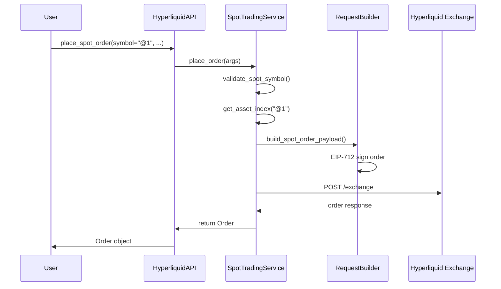

# Hyperliquid Spot Trading Implementation Report

## Executive Summary

After comprehensive analysis of the CyberDeltaEngine codebase and direct API exploration, we've found that:

1. **Spot trading is NOT implemented** in CyberDeltaEngine for Hyperliquid
2. **Hyperliquid testnet appears to have limited spot support** - only "@N" format tokens exist (likely test tokens)
3. The codebase has **partial infrastructure** ready for spot trading but lacks critical implementation

## Current State of Spot Trading in CyberDeltaEngine

### 🟢 What's Implemented

#### 1. **Spot Balance Reading**
```python
# cyberdelta/apis/hyperliquid/mappers/account/hl_balance_mapper.py
- transform_raw_clearinghouse_state_to_spot_balances()
- _process_other_spot_assets()
- _process_single_spot_asset()
```

#### 2. **Core Models**
```python
# cyberdelta/core/models/spot_balance.py
class SpotBalance(BaseModel):
    exchange: str
    asset: str
    timestamp: datetime
    available: Decimal
    total: Decimal
    # ... other fields

class HyperliquidSpotBalanceDetails(BaseModel):
    # Currently empty - placeholder for future fields
    pass
```

#### 3. **Raw API Models**
- Spot asset contexts in `hl_raw_meta_and_asset_ctxs.py`
- Spot metadata structures ready but unused

### 🔴 What's NOT Implemented

#### 1. **Spot Order Operations**
- ❌ No spot order placement
- ❌ No spot order cancellation
- ❌ No spot order status checking
- ❌ No spot order history

#### 2. **Spot Trading Service**
- ❌ No dedicated `HyperliquidSpotTradingService`
- ❌ No spot-specific symbol handling
- ❌ No spot market data services (order book, trades)

#### 3. **Spot Asset Management**
- ❌ No spot transfers (USDC between spot/perp)
- ❌ No spot withdrawals
- ❌ No spot deposits

### 🟡 Infrastructure Ready but Unused

1. **Protocol interfaces** support spot trading patterns
2. **Base service classes** could be extended for spot
3. **WebSocket infrastructure** could handle spot streams

## API Analysis Results

### Hyperliquid Spot Symbol Formats

From our API exploration, we found these spot token formats:

```mermaid
graph TD
    A[Hyperliquid Spot Symbols] --> B[@N Format]
    A --> C[NAME/USDC Format]

    B --> B1["@1 = 1.0936 USDC"]
    B --> B2["@10 = 0.574415 USDC"]
    B --> B3["@100 = 1.30235 USDC"]
    B --> B4["... @1000+ tokens"]

    C --> C1["PURR/USDC - canonical"]
    C --> C2["Expected on mainnet"]

    style B fill:#f9f,stroke:#333,stroke-width:2px
    style C fill:#ff9,stroke:#333,stroke-width:2px
```

### Key Findings from API Debug

1. **Testnet has 1246+ spot tokens** (all in "@N" format)
2. **No spotMeta in testnet** - only `universe` with perpetuals
3. **Spot tokens have mid prices** but no market metadata
4. **Clearinghouse state** includes spot asset positions

### Sample API Responses

#### 1. Spot Mid Prices (Real Data)
```json
{
  "@1": "1.0936",
  "@10": "0.574415",
  "@100": "1.30235",
  "@1000": "0.00032576"
  // ... 1246 total spot tokens
}
```

#### 2. Clearinghouse State Structure
```json
{
  "assetPositions": [
    {
      "position": {
        "coin": "@1",
        "cumFunding": {"allTime": "0.0", "sinceOpen": "0.0", "sinceChange": "0.0"},
        "entryPx": null,
        "leverage": {"type": "isolated", "value": 0, "rawUsd": "0.0"},
        "liquidationPx": null,
        "marginUsed": "0.0",
        "maxTradeSzs": ["0.0", "0.0"],
        "positionValue": "0.0",
        "returnOnEquity": "0.0",
        "szi": "0.0",
        "unrealizedPnl": "0.0"
      },
      "type": "oneWay"
    }
  ]
}
```

## Spot Order Flow (Hypothetical)

Based on perpetual implementation, spot orders would follow this flow:



## Missing Implementation Details

### 1. Spot Symbol Resolution
```python
# Currently missing - needed for spot
async def resolve_spot_symbol(symbol: str) -> int:
    """
    Map spot symbols to asset indices:
    - "@1" -> asset_index
    - "PURR/USDC" -> asset_index
    """
    pass
```

### 2. Spot Order Placement
```python
# Hypothetical implementation needed
class HyperliquidSpotTradingService:
    async def place_spot_order(self, args: PlaceSpotOrderArgs) -> Order:
        # 1. Validate spot symbol
        # 2. Get spot asset index
        # 3. Build order payload
        # 4. Sign with EIP-712
        # 5. Submit to /exchange
        # 6. Process response
        pass
```

### 3. Spot-Perp Transfers
```python
# Transfer USDC between accounts
async def transfer_usdc(self, amount: Decimal, to_perp: bool) -> TransferResult:
    payload = {
        "type": "usdTransfer",
        "amount": str(amount),
        "toPerp": to_perp
    }
    # Sign and submit
```

## Test Analysis

### Current Spot Tests
```
tests/integration/apis/hyperliquid/spot/
├── test_hl_spot_balances_*.py     ✅ Balance reading works
├── test_hl_spot_orders_*.py       ❌ Orders not implemented
├── test_hl_spot_candle_*.py       ❌ Market data not implemented
├── test_hl_spot_order_book_*.py   ❌ Order book not implemented
└── test_hl_spot_ticker_*.py       ❌ Ticker not implemented
```

### Failing Test Example
```python
# test_hl_spot_orders_positive.py
async def test_cancel_spot_order_not_implemented():
    """Test expects CancelOrderResult with success=False"""
    cancel_args = CancelOrderArgs(
        order_id="12345",
        symbol="USDC@0",  # Invalid format!
    )
    # Currently raises APIError instead of returning failed result
```

## Recommendations

### Option 1: Implement Spot Trading (Major Feature)
1. **Create `HyperliquidSpotTradingService`**
2. **Implement spot symbol mapping** (@N and NAME/USDC formats)
3. **Add spot order lifecycle** (place, cancel, status)
4. **Implement USDC transfers** between spot/perp
5. **Add spot market data services**

### Option 2: Clean Up Tests (Quick Fix)
1. **Mark spot tests as skipped** until implementation
2. **Remove invalid test expectations**
3. **Document spot trading as "not supported"**

### Option 3: Partial Implementation (Compromise)
1. **Fix spot symbol handling** for balance reading
2. **Implement USDC transfers only**
3. **Leave order operations for future**

## Technical Debt

1. **Symbol format inconsistency**: Tests use "USDC@0", API uses "@N"
2. **Missing asset index mapping** for spot tokens
3. **Incomplete error handling** for spot operations
4. **No WebSocket support** for spot data streams

## Conclusion

Spot trading in CyberDeltaEngine for Hyperliquid is **architecturally possible** but **not implemented**. The infrastructure exists, but critical components are missing. The failing test reveals this gap - it expects spot operations to fail gracefully, but the current implementation doesn't handle spot symbols at all.

The most pragmatic approach would be to:
1. Fix the immediate test issue (return failed result for spot symbols)
2. Document spot trading as unsupported
3. Plan full implementation if/when needed for trading strategies
