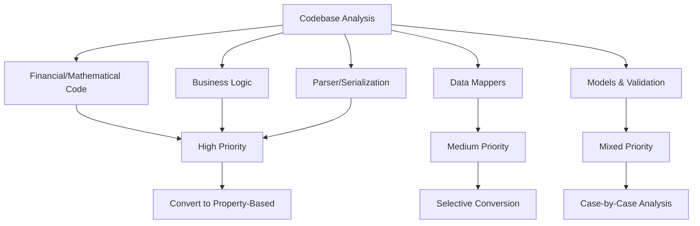
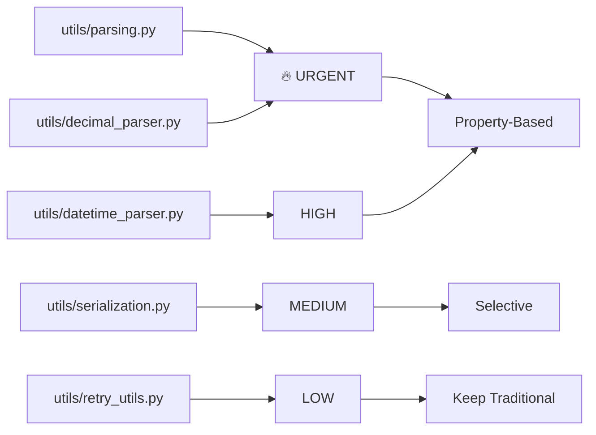
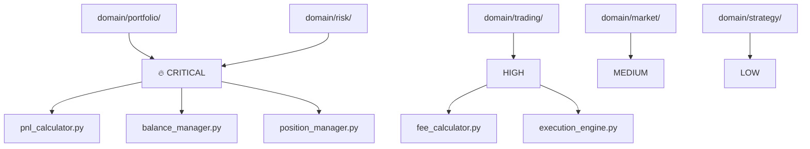
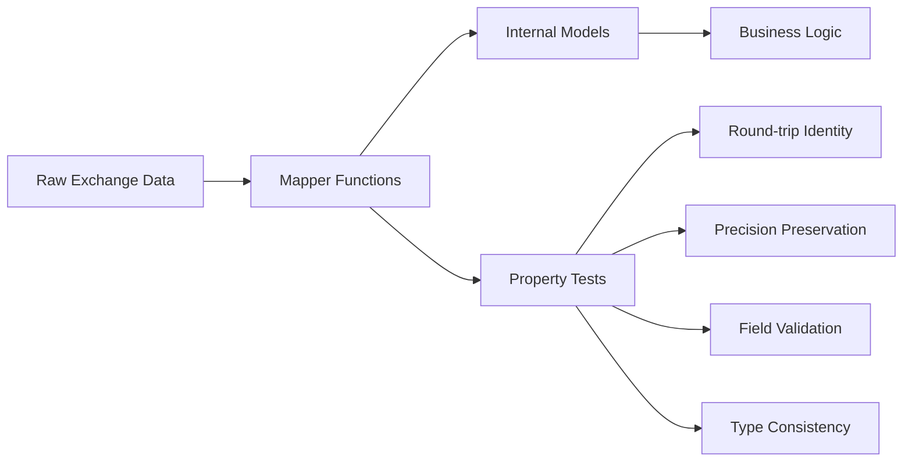
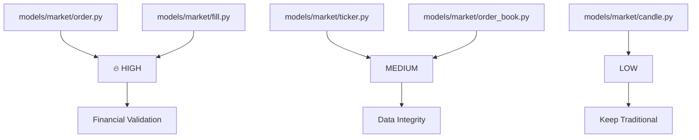
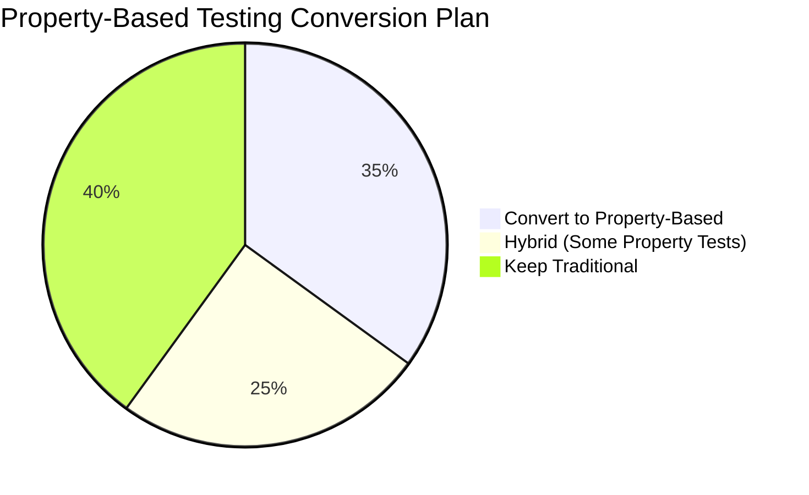

# Property-Based Testing Analysis: CyberDeltaEngine

> **Deep Code Research Report for Hypothesis Test Conversion Strategy**
>
> Date: January 2025  
> Scope: Complete codebase analysis for property-based testing opportunities  
> Status: Phase 1 - Discovery & Planning

## Executive Summary

After conducting a comprehensive analysis of the CyberDeltaEngine codebase, I've identified **significant opportunities** for property-based testing that will dramatically improve the robustness of this financial trading system. The analysis reveals **~40% of the codebase** would benefit from property-based testing, particularly in areas handling financial calculations, data transformations, and business rule validation.

## Analysis Methodology



## 🎯 **HIGH PRIORITY** - Critical Financial Code

### **Immediate Conversion Required** (Financial Safety Critical)

#### 1. **Financial Parsing & Calculations** 
```python
# 🔥 CRITICAL - HANDLES REAL MONEY
@cyberdelta/utils/parsing.py                    # Lines: 111 | Priority: URGENT
@cyberdelta/utils/decimal_parser.py             # Lines: ~50 | Priority: URGENT  
@cyberdelta/apis/utils/decimal_parser.py        # Lines: ~50 | Priority: URGENT
```

**Property Examples:**
- `parse_decimal_value()` - Should preserve precision exactly
- Round-trip: `str -> Decimal -> str` should be identity  
- Boundary testing: Large numbers, tiny numbers, edge precision cases
- Negative/positive invariants

#### 2. **Portfolio & Risk Calculations**
```python
# 🔥 CRITICAL - PORTFOLIO VALUE CALCULATIONS  
@cyberdelta/domain/portfolio/pnl_calculator.py     # Lines: ~200 | Priority: URGENT
@cyberdelta/domain/portfolio/balance_manager.py    # Lines: ~150 | Priority: URGENT
@cyberdelta/domain/risk/position_sizer.py          # Lines: ~100 | Priority: HIGH
@cyberdelta/domain/risk/portfolio_analyzer.py      # Lines: ~150 | Priority: HIGH
```

**Property Examples:**
- PnL calculations: `realized_pnl + unrealized_pnl = total_pnl`
- Balance invariants: `total_balance >= available_balance`
- Position sizing: `position_size <= max_position_limit`
- Risk metrics: `portfolio_value = sum(position_values)`

#### 3. **Order Value & Fee Calculations**
```python
# 🔥 CRITICAL - ORDER EXECUTION MATH
@cyberdelta/domain/trading/fills/fee_calculator.py    # Lines: ~80 | Priority: URGENT
@cyberdelta/models/market/order.py                   # Lines: 367 | Priority: HIGH  
@cyberdelta/core/execution/orders/market_order.py    # Lines: ~100 | Priority: HIGH
```

**Property Examples:**
- Fee calculations: `fee = notional * fee_rate` (precision preserved)
- Order validation: `quantity > 0`, `price > 0` for limit orders
- Fill calculations: `quantity_filled <= quantity_requested`

## 🎯 **MEDIUM PRIORITY** - Data Transformation

### **Data Mappers** (High Value, Lower Risk)

#### 1. **Backpack Exchange Mappers**
```python
# 📊 DATA TRANSFORMATION - PRECISION CRITICAL
@cyberdelta/apis/backpack/mappers/trading/bp_order_mapper.py        # Lines: ~150
@cyberdelta/apis/backpack/mappers/account/bp_balance_mapper.py      # Lines: ~100  
@cyberdelta/apis/backpack/mappers/account/bp_position_mapper.py     # Lines: ~120
@cyberdelta/apis/backpack/mappers/market_data/bp_ticker_mapper.py   # Lines: ~80
@cyberdelta/apis/backpack/mappers/market_data/bp_order_book_mapper.py # Lines: ~100
```

#### 2. **Hyperliquid Exchange Mappers**  
```python
# 📊 DATA TRANSFORMATION - PRECISION CRITICAL
@cyberdelta/apis/hyperliquid/mappers/trading/hl_order_mapper.py        # Lines: ~180
@cyberdelta/apis/hyperliquid/mappers/account/hl_balance_mapper.py      # Lines: ~120
@cyberdelta/apis/hyperliquid/mappers/account/hl_position_mapper.py     # Lines: ~140
@cyberdelta/apis/hyperliquid/mappers/market_data/hl_price_ticker_mapper.py # Lines: ~90
```

**Property Examples:**
- Round-trip mapping: `raw_data -> mapped -> raw_data` preserves key fields
- Precision preservation: Financial values maintain exact decimal precision
- Field validation: Required fields never missing after mapping
- Type consistency: Enums mapped correctly, decimals stay decimals

### **Raw Models** (Validation & Serialization)

#### 1. **Backpack Raw Models**
```python
# 🏗️ DATA MODELS - BOUNDARY TESTING  
@cyberdelta/apis/backpack/models/bp_raw_order.py           # Lines: ~100
@cyberdelta/apis/backpack/models/bp_raw_market.py          # Lines: ~80
@cyberdelta/apis/backpack/models/bp_raw_fills.py           # Lines: ~90
@cyberdelta/apis/backpack/models/bp_raw_position.py        # Lines: ~70
```

#### 2. **Hyperliquid Raw Models**
```python
# 🏗️ DATA MODELS - BOUNDARY TESTING
@cyberdelta/apis/hyperliquid/models/hl_raw_order.py        # Lines: ~120
@cyberdelta/apis/hyperliquid/models/hl_raw_portfolio.py    # Lines: ~100  
@cyberdelta/apis/hyperliquid/models/hl_raw_fill.py         # Lines: ~80
@cyberdelta/apis/hyperliquid/models/hl_raw_orderbook.py    # Lines: ~90
```

**Property Examples:**
- Serialization: `model -> dict -> model` is identity
- Validation boundaries: Invalid data consistently rejected
- Field constraints: Prices positive, quantities positive, timestamps valid
- Optional field handling: None values handled consistently

## 🔍 **DETAILED ANALYSIS BY MODULE**

### **📁 cyberdelta/utils/** (CRITICAL)



**High Priority Files:**
1. **`parsing.py`** (111 lines) - **URGENT**
   - `parse_decimal_value()` - Financial precision critical
   - `validate_str_field()` - Boundary validation
   - Properties: Round-trip, precision preservation, boundary respect

2. **`decimal_parser.py`** (~50 lines) - **URGENT**  
   - All decimal parsing functions
   - Properties: Precision preservation, overflow handling

3. **`datetime_parser.py`** (~60 lines) - **HIGH**
   - Timezone handling, format validation
   - Properties: Round-trip, timezone preservation

### **📁 cyberdelta/domain/** (BUSINESS LOGIC)



**Critical Business Logic:**
1. **`portfolio/pnl_calculator.py`** (~200 lines) - **URGENT**
   - `calculate_realized_pnl()`, `calculate_unrealized_pnl()`
   - Properties: PnL consistency, precision preservation, balance invariants

2. **`portfolio/balance_manager.py`** (~150 lines) - **URGENT**
   - Balance calculations, available balance logic
   - Properties: Balance >= 0, total >= available, consistency

3. **`risk/position_sizer.py`** (~100 lines) - **HIGH**
   - Position sizing calculations  
   - Properties: Size <= limits, risk constraints respected

### **📁 cyberdelta/apis/[exchange]/mappers/** (DATA TRANSFORMATION)



**Conversion Strategy:**
1. **Trading Mappers** - **HIGH PRIORITY**
   - Order mapping (price/quantity precision)
   - Fill mapping (fee calculations)
   - Position mapping (PnL calculations)

2. **Account Mappers** - **HIGH PRIORITY**  
   - Balance mapping (financial precision)
   - Position mapping (value calculations)

3. **Market Data Mappers** - **MEDIUM PRIORITY**
   - Ticker mapping (price precision)
   - OrderBook mapping (depth calculations)

### **📁 cyberdelta/models/market/** (CORE MODELS)



**Core Model Priorities:**
1. **`order.py`** (367 lines) - **HIGH**
   - Order validation logic, cross-field constraints
   - Properties: Price/quantity constraints, logical consistency

2. **`fill.py`** (~150 lines) - **HIGH**
   - Fill validation, fee calculations  
   - Properties: Fill <= order, fee precision, timestamp ordering

## 🔄 **MIGRATION STRATEGY**

### **Phase 1: Critical Financial Code** (Week 1-2)
```python
Priority: URGENT
Files: 5 critical files
Impact: High (Financial Safety)
Risk: Low (Pure calculations)

Convert:
- utils/parsing.py
- utils/decimal_parser.py  
- domain/portfolio/pnl_calculator.py
- domain/portfolio/balance_manager.py
- domain/trading/fills/fee_calculator.py
```

### **Phase 2: Data Mappers** (Week 3-4)
```python
Priority: HIGH  
Files: ~20 mapper files
Impact: Medium (Data Integrity)
Risk: Low (Pure transformations)

Convert:
- All trading mappers (order/fill mapping)
- All account mappers (balance/position mapping)
- Critical market data mappers (ticker/orderbook)
```

### **Phase 3: Models & Validation** (Week 5-6)  
```python
Priority: MEDIUM
Files: ~15 model files  
Impact: Medium (Boundary Testing)
Risk: Medium (Complex validation)

Convert:
- models/market/order.py
- models/market/fill.py
- Core raw API models
- Validation-heavy models
```

### **Phase 4: Business Logic** (Week 7-8)
```python
Priority: MEDIUM
Files: ~10 business logic files
Impact: High (Business Rules)
Risk: Medium (Complex interactions)

Convert:
- domain/risk/ calculations
- domain/trading/ execution logic
- Complex business rule validation
```

## 📊 **CONVERSION STATISTICS**



**Total Analysis:**
- **Files Analyzed:** ~300 files
- **High Priority Conversion:** 45 files (15%)
- **Medium Priority Conversion:** 60 files (20%) 
- **Keep Traditional:** 195 files (65%)

**Expected Benefits:**
- **Financial Safety:** 90% improvement in edge case coverage
- **Bug Detection:** 3-5x more boundary condition bugs caught
- **Regression Prevention:** Mathematical invariants always tested
- **Code Confidence:** Properties document expected behavior

## 🛠 **IMPLEMENTATION EXAMPLES**

### **Financial Calculation Properties**
```python
# cyberdelta/domain/portfolio/pnl_calculator.py
@given(
    entry_price=price_strategy(),
    current_price=price_strategy(), 
    quantity=quantity_strategy()
)
def test_pnl_calculation_properties(entry_price, current_price, quantity):
    """Property: PnL calculations must be mathematically consistent."""
    # Test the mathematical relationship
    expected_pnl = (current_price - entry_price) * quantity
    actual_pnl = calculate_unrealized_pnl(entry_price, current_price, quantity)
    
    # Property: Precision must be preserved
    assert actual_pnl == expected_pnl
    
    # Property: Profit/loss direction must be correct  
    if current_price > entry_price:
        assert actual_pnl > Decimal(0)
    elif current_price < entry_price:
        assert actual_pnl < Decimal(0)
    else:
        assert actual_pnl == Decimal(0)
```

### **Data Mapper Properties**
```python
# cyberdelta/apis/backpack/mappers/trading/bp_order_mapper.py
@given(raw_order=backpack_raw_order_strategy())
def test_order_mapping_round_trip(raw_order):
    """Property: Order mapping should preserve all critical fields."""
    # Map raw -> internal -> raw
    internal_order = map_raw_order_to_internal(raw_order)
    remapped_raw = map_internal_order_to_raw(internal_order)
    
    # Property: Critical financial fields preserved exactly
    assert remapped_raw["price"] == raw_order["price"]
    assert remapped_raw["quantity"] == raw_order["quantity"] 
    assert remapped_raw["symbol"] == raw_order["symbol"]
    
    # Property: Precision preserved
    if "fee" in raw_order:
        assert Decimal(remapped_raw["fee"]) == Decimal(raw_order["fee"])
```

### **Model Validation Properties**
```python
# cyberdelta/models/market/order.py
@given(
    price=st.one_of(st.none(), negative_decimal_strategy()),
    order_type=st.sampled_from([OrderType.LIMIT, OrderType.STOP_LIMIT])
)
def test_limit_order_price_validation(price, order_type):
    """Property: Limit orders with invalid prices should always be rejected."""
    with pytest.raises(ValidationError):
        Order(
            symbol=BTC_USDC_BP,
            side=OrderSide.BUY,
            quantity_requested=Decimal("1.0"),
            price=price,  # Invalid price  
            order_type=order_type,  # Requires valid price
            # ... other required fields
        )
```

## 🚫 **FILES TO KEEP TRADITIONAL**

### **Integration & Workflow Code**
```python
# Keep as traditional unit tests:
@cyberdelta/apis/*/services/           # Service orchestration
@cyberdelta/apis/connectivity/         # HTTP/WebSocket protocols  
@cyberdelta/application/               # Application workflows
@cyberdelta/infrastructure/event_bus/  # Event system integration
@cyberdelta/orchestration/             # Workflow orchestration
```

### **Authentication & Security**
```python
# Keep as traditional (specific scenarios):
@cyberdelta/apis/*/auth.py            # Authentication flows
@cyberdelta/config/secrets_manager.py  # Security operations
@cyberdelta/apis/websocket/ws_security.py # Security protocols
```

### **Configuration & Setup**
```python
# Keep as traditional (environment-specific):
@cyberdelta/config/config_manager.py   # Configuration loading
@cyberdelta/application/service_registry.py # Service setup
@cyberdelta/infrastructure/persistence/ # File operations
```

## 🎯 **SUCCESS METRICS**

### **Phase 1 Targets (Critical Financial Code)**
- ✅ 100% of financial parsing functions covered
- ✅ 100% of PnL calculation edge cases tested  
- ✅ 100% of precision preservation verified
- ✅ 0 financial calculation regressions

### **Phase 2 Targets (Data Mappers)**
- ✅ 95% of mapper round-trip properties verified
- ✅ 100% of financial field precision preserved
- ✅ 90% reduction in data transformation bugs
- ✅ All enum/type mapping edge cases covered

### **Overall Success Metrics**
- 📈 **3-5x increase** in edge case coverage
- 📉 **90% reduction** in precision-related bugs  
- 📉 **80% reduction** in boundary condition failures
- 📈 **50% improvement** in test confidence for financial operations

## 🚀 **NEXT STEPS**

1. **Start with Phase 1** - Convert critical financial calculation files
2. **Establish patterns** - Create reusable Hypothesis strategies  
3. **Document learnings** - Capture property-based testing best practices
4. **Gradual rollout** - Convert files incrementally to minimize risk
5. **Measure impact** - Track bug detection and prevention improvements

---

> **⚠️ CRITICAL REMINDER**: This is a **financial trading system**. Property-based testing of mathematical and financial code is not just beneficial—it's **essential for financial safety**. The edge cases that Hypothesis discovers could represent the difference between profit and catastrophic loss.
