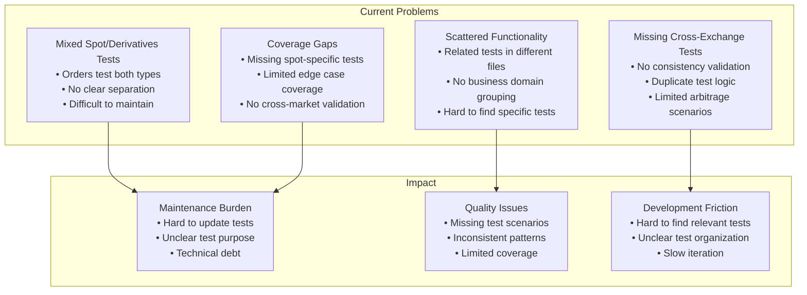
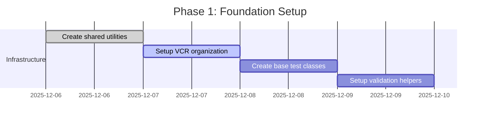
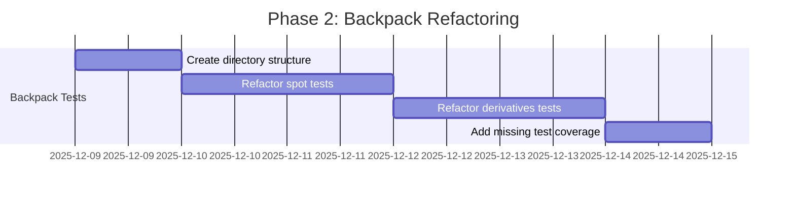
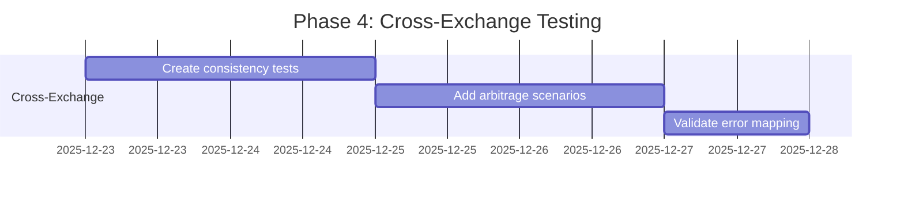

# Integration Tests Refactor Plan: Spot vs Derivatives Separation

**Date:** December 6, 2025  
**Scope:** Comprehensive refactoring of integration tests for clear spot vs derivatives separation  
**Target:** `/tests/integration/apis/` directory structure  

## Executive Summary

This document outlines a comprehensive plan to refactor the CyberDeltaEngine integration tests, creating clear separation between spot and derivatives functionality while addressing testing gaps and improving maintainability.

## Current State Analysis

### 1. Current Test Organization Issues



### 2. Current File Analysis

#### Backpack Tests (19 files)
| File | Type | Current Classification | Target Classification |
|------|------|----------------------|---------------------|
| `test_bp_balances_private.py` | Spot | ✅ Spot-focused | `spot/balances/positive/` |
| `test_bp_balances_zero_balance.py` | Edge Case | ✅ Spot edge case | `spot/balances/zero/` |
| `test_bp_positions_private.py` | Perp | ✅ Perp-focused | `perp/positions/positive/` |
| `test_bp_positions_zero_balance.py` | Edge Case | ✅ Perp edge case | `perp/positions/zero/` |
| `test_bp_orders_private.py` | Mixed | ❌ Both spot/perp | Split into both |
| `test_bp_orders_zero_balance.py` | Mixed | ❌ Both spot/perp | Split into both |
| `test_bp_account_summary_private.py` | Cross-cutting | ✅ Account-level | `account/positive/` |
| `test_bp_account_summary_zero_balance.py` | Edge Case | ✅ Account edge case | `account/zero/` |
| `test_bp_positive_balance.py` | Mixed | ❌ Positive balance tests | Split into categories |
| `test_bp_funding_rate_integration.py` | Perp | ✅ Perp-focused | `perp/funding/` |
| `test_bp_market_integration.py` | Mixed | ❌ Both market types | Split into both |
| `test_bp_ticker_integration.py` | Mixed | ❌ Both market types | Split into both |
| `test_bp_trade_integration.py` | Mixed | ❌ Both trade types | Split into both |
| `test_bp_order_book_integration.py` | Mixed | ❌ Both market types | Split into both |
| `test_bp_candle_integration.py` | Mixed | ❌ Both market types | Split into both |

#### Hyperliquid Tests (16 files)
| File | Type | Current Classification | Target Classification |
|------|------|----------------------|---------------------|
| `test_hl_balances_private.py` | Spot | ⚠️ Transfer-focused only | `spot/balances/positive/` + enhance |
| `test_hl_balances.py` | Spot | ⚠️ Limited coverage | `spot/balances/zero/` |
| `test_hl_positions_private.py` | Perp | ✅ Perp-focused | `perp/positions/positive/` |
| `test_hl_positions.py` | Perp | ✅ Perp-focused | `perp/positions/zero/` |
| `test_hl_orders_private.py` | Mixed | ❌ Primarily perp | Split into both |
| `test_hl_orders.py` | Mixed | ❌ Primarily perp | Split into both |
| `test_hl_account_summary_private.py` | Cross-cutting | ✅ Account-level | `account/positive/` |
| `test_hl_account_summary.py` | Cross-cutting | ✅ Account-level | `account/zero/` |
| `test_hl_funding_rate_integration.py` | Perp | ✅ Perp-focused | `perp/funding/` |

## Proposed Refactor Plan

### 1. New Directory Structure

```
tests/integration/apis/
├── shared/                              # Shared utilities and base classes
│   ├── __init__.py
│   ├── base_test_classes.py            # Base classes for common patterns
│   ├── validation_helpers.py           # Common validation logic
│   ├── auth_fixtures.py                # Shared authentication fixtures
│   └── vcr_helpers.py                  # VCR cassette utilities
│
├── cross_exchange/                     # Cross-exchange validation tests
│   ├── __init__.py
│   ├── conftest.py
│   ├── test_spot_balance_consistency.py
│   ├── test_derivative_position_consistency.py
│   ├── test_order_lifecycle_compatibility.py
│   ├── test_market_data_consistency.py
│   ├── test_arbitrage_scenarios.py
│   └── test_error_mapping_consistency.py
│
├── backpack/
│   ├── __init__.py
│   ├── conftest.py                     # Backpack-specific fixtures
│   ├── shared/                         # Backpack shared utilities
│   │   ├── __init__.py
│   │   └── bp_test_helpers.py
│   ├── spot/                           # Spot trading tests
│   │   ├── __init__.py
│   │   ├── conftest.py
│   │   ├── balances/
│   │   │   ├── __init__.py
│   │   │   ├── positive/              # Tests requiring actual balance
│   │   │   │   ├── __init__.py
│   │   │   │   ├── test_bp_spot_balances_private.py
│   │   │   │   └── test_bp_spot_transfers.py
│   │   │   └── zero/                  # Zero balance edge case tests
│   │   │       ├── __init__.py
│   │   │       ├── test_bp_spot_balances_zero.py
│   │   │       └── test_bp_spot_edge_cases.py
│   │   ├── orders/
│   │   │   ├── __init__.py
│   │   │   ├── positive/              # Tests requiring balance to place orders
│   │   │   │   ├── __init__.py
│   │   │   │   ├── test_bp_spot_orders_private.py
│   │   │   │   └── test_bp_spot_order_lifecycle.py
│   │   │   └── zero/                  # Zero balance order tests
│   │   │       ├── __init__.py
│   │   │       ├── test_bp_spot_orders_zero.py
│   │   │       └── test_bp_spot_insufficient_funds.py
│   │   ├── market_data/
│   │   │   ├── __init__.py
│   │   │   ├── test_bp_spot_tickers.py
│   │   │   ├── test_bp_spot_order_books.py
│   │   │   ├── test_bp_spot_trades.py
│   │   │   └── test_bp_spot_candles.py
│   │   └── strategies/
│   │       ├── __init__.py
│   │       └── test_bp_spot_arbitrage.py
│   ├── perp/                          # Perpetual trading tests
│   │   ├── __init__.py
│   │   ├── conftest.py
│   │   ├── positions/
│   │   │   ├── __init__.py
│   │   │   ├── positive/              # Tests requiring margin/balance
│   │   │   │   ├── __init__.py
│   │   │   │   ├── test_bp_perp_positions_private.py
│   │   │   │   └── test_bp_position_lifecycle.py
│   │   │   └── zero/                  # Zero balance/position tests
│   │   │       ├── __init__.py
│   │   │       ├── test_bp_perp_positions_zero.py
│   │   │       └── test_bp_perp_edge_cases.py
│   │   ├── orders/
│   │   │   ├── __init__.py
│   │   │   ├── positive/              # Tests requiring margin to place orders
│   │   │   │   ├── __init__.py
│   │   │   │   ├── test_bp_perp_orders_private.py
│   │   │   │   └── test_bp_perp_order_lifecycle.py
│   │   │   └── zero/                  # Zero margin order tests
│   │   │       ├── __init__.py
│   │   │       ├── test_bp_perp_orders_zero.py
│   │   │       └── test_bp_perp_insufficient_margin.py
│   │   ├── funding/
│   │   │   ├── __init__.py
│   │   │   ├── test_bp_funding_rates.py
│   │   │   └── test_bp_funding_payments.py
│   │   ├── margin/
│   │   │   ├── __init__.py
│   │   │   ├── test_bp_margin_calculations.py
│   │   │   └── test_bp_liquidation_scenarios.py
│   │   ├── market_data/
│   │   │   ├── __init__.py
│   │   │   ├── test_bp_perp_tickers.py
│   │   │   ├── test_bp_perp_order_books.py
│   │   │   ├── test_bp_perp_trades.py
│   │   │   └── test_bp_perp_candles.py
│   │   └── strategies/
│   │       ├── __init__.py
│   │       ├── test_bp_funding_arbitrage.py
│   │       └── test_bp_delta_neutral.py
│   ├── account/                        # Account management tests
│   │   ├── __init__.py
│   │   ├── conftest.py
│   │   ├── positive/                   # Tests requiring account balance
│   │   │   ├── __init__.py
│   │   │   ├── test_bp_account_summary_private.py
│   │   │   └── test_bp_portfolio_management.py
│   │   └── zero/                       # Zero balance account tests
│   │       ├── __init__.py
│   │       ├── test_bp_account_summary_zero.py
│   │       └── test_bp_account_edge_cases.py
│   ├── websockets/                     # WebSocket tests
│   │   ├── __init__.py
│   │   ├── conftest.py
│   │   ├── test_bp_ws_connection.py
│   │   ├── test_bp_ws_subscriptions.py
│   │   └── test_bp_ws_error_recovery.py
│   └── mappers/                        # Data mapper tests
│       ├── __init__.py
│       └── test_bp_trading_data_mapper_integration.py
│
└── hyperliquid/                        # Mirror structure for Hyperliquid
    ├── __init__.py
    ├── conftest.py
    ├── shared/
    │   ├── __init__.py
    │   └── hl_test_helpers.py
    ├── spot/
    │   ├── __init__.py
    │   ├── conftest.py
    │   ├── balances/
    │   │   ├── __init__.py
    │   │   ├── positive/                   # Tests requiring actual balance
    │   │   │   ├── __init__.py
    │   │   │   ├── test_hl_spot_balances_private.py
    │   │   │   ├── test_hl_spot_transfers.py
    │   │   │   └── test_hl_spot_withdrawals.py
    │   │   └── zero/                       # Zero balance edge case tests
    │   │       ├── __init__.py
    │   │       ├── test_hl_spot_balances_zero.py
    │   │       └── test_hl_spot_edge_cases.py
    │   ├── orders/
    │   │   ├── __init__.py
    │   │   ├── positive/                   # Tests requiring balance to place orders
    │   │   │   ├── __init__.py
    │   │   │   ├── test_hl_spot_orders_private.py
    │   │   │   └── test_hl_spot_order_lifecycle.py
    │   │   └── zero/                       # Zero balance order tests
    │   │       ├── __init__.py
    │   │       ├── test_hl_spot_orders_zero.py
    │   │       └── test_hl_spot_insufficient_funds.py
    │   ├── market_data/
    │   │   ├── __init__.py
    │   │   ├── test_hl_spot_tickers.py
    │   │   ├── test_hl_spot_order_books.py
    │   │   ├── test_hl_spot_trades.py
    │   │   └── test_hl_spot_candles.py
    │   └── strategies/
    │       ├── __init__.py
    │       └── test_hl_spot_arbitrage.py
    ├── perp/
    │   ├── __init__.py
    │   ├── conftest.py
    │   ├── positions/
    │   │   ├── __init__.py
    │   │   ├── positive/                   # Tests requiring margin/balance
    │   │   │   ├── __init__.py
    │   │   │   ├── test_hl_perp_positions_private.py
    │   │   │   └── test_hl_position_lifecycle.py
    │   │   └── zero/                       # Zero balance/position tests
    │   │       ├── __init__.py
    │   │       ├── test_hl_perp_positions_zero.py
    │   │       └── test_hl_perp_edge_cases.py
    │   ├── orders/
    │   │   ├── __init__.py
    │   │   ├── positive/                   # Tests requiring margin to place orders
    │   │   │   ├── __init__.py
    │   │   │   ├── test_hl_perp_orders_private.py
    │   │   │   └── test_hl_perp_order_lifecycle.py
    │   │   └── zero/                       # Zero margin order tests
    │   │       ├── __init__.py
    │   │       ├── test_hl_perp_orders_zero.py
    │   │       └── test_hl_perp_insufficient_margin.py
    │   ├── funding/
    │   │   ├── __init__.py
    │   │   ├── test_hl_funding_rates.py
    │   │   └── test_hl_funding_payments.py
    │   ├── margin/
    │   │   ├── __init__.py
    │   │   ├── test_hl_margin_calculations.py
    │   │   └── test_hl_liquidation_scenarios.py
    │   ├── market_data/
    │   │   ├── __init__.py
    │   │   ├── test_hl_perp_tickers.py
    │   │   ├── test_hl_perp_order_books.py
    │   │   ├── test_hl_perp_trades.py
    │   │   └── test_hl_perp_candles.py
    │   └── strategies/
    │       ├── __init__.py
    │       ├── test_hl_funding_arbitrage.py
    │       └── test_hl_delta_neutral.py
    ├── account/
    │   ├── __init__.py
    │   ├── conftest.py
    │   ├── positive/                       # Tests requiring account balance
    │   │   ├── __init__.py
    │   │   ├── test_hl_account_summary_private.py
    │   │   └── test_hl_portfolio_management.py
    │   └── zero/                           # Zero balance account tests
    │       ├── __init__.py
    │       ├── test_hl_account_summary_zero.py
    │       └── test_hl_account_edge_cases.py
    └── websockets/
        ├── __init__.py
        ├── conftest.py
        ├── test_hl_ws_connection.py
        ├── test_hl_ws_subscriptions.py
        └── test_hl_ws_error_recovery.py
```

### 2. Test Refactoring Strategy

#### Phase 1: Infrastructure Setup (Week 1)
1. **Create shared pytest fixtures and utilities:**
   ```python
   # tests/integration/apis/shared/conftest.py
   import pytest
   from decimal import Decimal
   
   @pytest.fixture
   def spot_test_symbols():
       """Common spot trading symbols for testing."""
       return ["SOL_USDC", "BTC_USDC", "ETH_USDC"]
   
   @pytest.fixture
   def derivatives_test_symbols():
       """Common derivatives symbols for testing."""
       return ["SOL-PERP", "BTC-PERP", "ETH-PERP"]
   
   @pytest.fixture
   def precision_test_amounts():
       """Test amounts for precision validation."""
       return [
           Decimal("0.00000001"),  # Dust
           Decimal("0.1"),         # Small
           Decimal("100"),         # Normal
           Decimal("999999.99")    # Large
       ]
   ```

2. **Create pytest-style validation helpers:**
   ```python
   # tests/integration/apis/shared/validation_helpers.py
   import pytest
   from decimal import Decimal
   from cyberdelta.core.models import SpotBalance, DerivativePosition, Order
   
   def assert_valid_spot_balance(balance: SpotBalance) -> None:
       """Common spot balance assertions for pytest."""
       assert isinstance(balance.total_quantity, Decimal)
       assert balance.total_quantity >= Decimal("0")
       assert balance.available_quantity >= Decimal("0")
       assert balance.available_quantity <= balance.total_quantity
       assert balance.exchange in ["backpack", "hyperliquid"]
       
   def assert_valid_derivative_position(position: DerivativePosition) -> None:
       """Common derivative position assertions for pytest."""
       assert isinstance(position.size, Decimal)
       assert position.size.is_finite()
       if position.size != Decimal("0"):
           assert position.entry_price is not None
           assert position.entry_price > Decimal("0")
       
   def assert_valid_order_lifecycle(order: Order) -> None:
       """Common order lifecycle assertions for pytest."""
       assert order.quantity_filled <= order.quantity_requested
       if order.quantity_filled > Decimal("0"):
           assert order.average_fill_price is not None
           assert order.average_fill_price > Decimal("0")
   ```

3. **Setup pytest VCR fixtures:**
   ```python
   # tests/integration/apis/shared/vcr_fixtures.py
   import pytest
   from pathlib import Path
   
   @pytest.fixture
   def vcr_cassette_dir(request, exchange_name):
       """Dynamic VCR cassette directory based on test location."""
       test_file = Path(request.module.__file__)
       test_dir = test_file.parent.name  # e.g., 'balances', 'orders'
       category = test_file.parent.parent.name  # e.g., 'spot', 'derivatives'
       return f"{exchange_name}/{category}/{test_dir}"
   
   @pytest.fixture
   def vcr_config():
       """Common VCR configuration for all tests."""
       return {
           "filter_headers": ["authorization", "x-api-key"],
           "match_on": ["method", "scheme", "host", "port", "path", "query"],
           "record_mode": "once",
       }
   ```

#### Phase 2: Exchange-Specific Refactoring (Weeks 2-3)

**Backpack Refactoring:**
1. **Split mixed tests:**
   - `test_bp_orders_private.py` → `spot/orders/` + `derivatives/orders/`
   - `test_bp_market_integration.py` → `spot/market_data/` + `derivatives/market_data/`
   
2. **Enhance spot coverage:**
   - Add comprehensive spot balance query tests
   - Create spot-specific order lifecycle tests
   - Add spot market data validation tests

3. **Enhance derivatives coverage:**
   - Add margin calculation validation tests
   - Create funding payment tracking tests
   - Add liquidation scenario tests

**Hyperliquid Refactoring:**
1. **Enhance spot implementation:**
   - Complete spot balance query tests (currently only transfers)
   - Add spot order tests (currently derivatives-focused)
   - Create comprehensive spot market data tests

2. **Split mixed tests:**
   - `test_hl_orders_private.py` → `spot/orders/` + `derivatives/orders/`
   - Split public/private test variants appropriately

#### Phase 3: Cross-Exchange Testing (Week 4)

1. **Balance consistency tests:**
   ```python
   # tests/integration/apis/cross_exchange/test_spot_balance_consistency.py
   import pytest
   from tests.integration.apis.shared.validation_helpers import assert_valid_spot_balance
   
   @pytest.mark.cross_exchange
   @pytest.mark.parametrize("exchange", ["backpack", "hyperliquid"])
   class TestSpotBalanceConsistency:
       """Cross-exchange spot balance consistency tests."""
       
       def test_spot_balance_model_consistency(self, exchange, spot_test_symbols):
           """Validate SpotBalance model across exchanges."""
           # Test implementation
           
       @pytest.mark.parametrize("precision", [8, 10, 12])
       def test_spot_balance_precision_handling(self, exchange, precision):
           """Test decimal precision handling across exchanges."""
           # Test implementation
   ```

2. **Order compatibility tests:**
   ```python
   # tests/integration/apis/cross_exchange/test_order_lifecycle_compatibility.py
   import pytest
   from decimal import Decimal
   
   class TestOrderLifecycleCompatibility:
       """Cross-exchange order lifecycle compatibility tests."""
       
       @pytest.fixture(params=["backpack", "hyperliquid"])
       def exchange_client(self, request):
           """Parametrized fixture for exchange clients."""
           # Return appropriate client based on request.param
           
       @pytest.mark.parametrize("order_type", ["LIMIT", "MARKET"])
       def test_spot_order_lifecycle_compatibility(self, exchange_client, order_type):
           """Test spot order lifecycle across both exchanges."""
           # Test implementation
           
       def test_order_precision_compatibility(self, exchange_client, precision_test_amounts):
           """Test order amount precision handling."""
           # Test implementation
   ```

3. **Arbitrage scenario tests:**
   ```python
   # tests/integration/apis/cross_exchange/test_arbitrage_scenarios.py
   import pytest
   from cyberdelta.core.models import SpotBalance, DerivativePosition
   
   @pytest.mark.integration
   class TestArbitrageScenarios:
       """Cross-exchange arbitrage scenario tests."""
       
       @pytest.fixture
       def arbitrage_setup(self):
           """Setup for arbitrage testing."""
           return {
               "spot_exchange": "backpack",
               "perp_exchange": "hyperliquid",
               "test_asset": "SOL",
           }
       
       def test_spot_perp_arbitrage_setup(self, arbitrage_setup):
           """Test setting up delta-neutral arbitrage positions."""
           # Test implementation
           
       @pytest.mark.parametrize("funding_rate", [Decimal("0.01"), Decimal("-0.01")])
       def test_funding_arbitrage_opportunity(self, arbitrage_setup, funding_rate):
           """Test funding rate arbitrage scenarios."""
           # Test implementation
   ```

### 3. Testing Gaps to Address

#### 3.1 Spot Trading Gaps
| Gap Category | Current State | Required Tests |
|--------------|---------------|----------------|
| **Hyperliquid Spot Balances** | Only transfer tests | Balance query, precision validation |
| **Spot Order Lifecycle** | Mixed with perps | Dedicated spot order tests |
| **Spot Market Data** | Mixed validation | Spot-specific ticker/orderbook tests |
| **Spot-Perp Arbitrage** | None | Cross-market arbitrage scenarios |
| **Spot Transfer Edge Cases** | Limited | Dust amounts, precision limits |

#### 3.2 Perpetual Trading Gaps
| Gap Category | Current State | Required Tests |
|--------------|---------------|----------------|
| **Margin Calculations** | Basic validation | Complex margin scenarios |
| **Funding Rate Arbitrage** | None | Funding arbitrage strategies |
| **Position Liquidation** | None | Liquidation trigger scenarios |
| **Cross-Margin Risk** | None | Portfolio-level risk tests |
| **Perp Market Data** | Mixed validation | Perp-specific data validation |

#### 3.3 Cross-Exchange Gaps
| Gap Category | Current State | Required Tests |
|--------------|---------------|----------------|
| **Model Consistency** | None | Cross-exchange model validation |
| **Error Code Mapping** | None | Consistent error handling |
| **Order Compatibility** | None | Same order across exchanges |
| **Market Data Consistency** | None | Price/orderbook comparison |
| **Delta-Neutral Strategies** | None | Cross-exchange arbitrage |

### 4. Implementation Roadmap

#### Phase 1: Foundation (Week 1)


**Tasks:**
- [ ] Create `tests/integration/apis/shared/` structure
- [ ] Implement `BaseSpotTest`, `BaseDerivativeTest`, `BaseCrossExchangeTest`
- [ ] Create common validation helpers
- [ ] Setup standardized VCR cassette organization
- [ ] Create fixture utilities for authentication

#### Phase 2: Backpack Refactoring (Week 2)


**Tasks:**
- [ ] Create `tests/integration/apis/backpack/` subdirectory structure with `positive/` and `zero/` folders
- [ ] Split `test_bp_orders_private.py` into spot/perp variants with balance separation
- [ ] Move `test_bp_balances_private.py` to `spot/balances/positive/` with `@pytest.mark.requires_balance`
- [ ] Move `test_bp_balances_zero_balance.py` to `spot/balances/zero/` with `@pytest.mark.zero_balance`
- [ ] Move `test_bp_positions_private.py` to `perp/positions/positive/` with `@pytest.mark.requires_balance`
- [ ] Move `test_bp_positions_zero_balance.py` to `perp/positions/zero/` with `@pytest.mark.zero_balance`
- [ ] Split `test_bp_positive_balance.py` into appropriate categories with proper marks
- [ ] Add margin calculation tests
- [ ] Add funding payment tracking tests

#### Phase 3: Hyperliquid Refactoring (Week 3)


**Tasks:**
- [ ] Create `tests/integration/apis/hyperliquid/` subdirectory structure with `positive/` and `zero/` folders
- [ ] Enhance `test_hl_balances_private.py` and move to `spot/balances/positive/` with `@pytest.mark.requires_balance`
- [ ] Create comprehensive zero balance tests in `spot/balances/zero/` with `@pytest.mark.zero_balance`
- [ ] Split order tests into spot/perp variants with balance separation
- [ ] Move position tests to appropriate `positive/` and `zero/` folders with correct marks
- [ ] Add comprehensive spot market data tests
- [ ] Add spot order lifecycle tests
- [ ] Enhance perpetual margin tests

#### Phase 4: Cross-Exchange Testing (Week 4)


**Tasks:**
- [ ] Create `tests/integration/apis/cross_exchange/` structure
- [ ] Implement balance consistency tests
- [ ] Implement order compatibility tests
- [ ] Create arbitrage scenario tests
- [ ] Add error code mapping validation
- [ ] Create delta-neutral strategy tests

### 5. Test Quality Improvements

#### 5.1 Pytest Test Organization
```python
# tests/integration/apis/backpack/spot/conftest.py
import pytest
from decimal import Decimal
from cyberdelta.apis.backpack import BackpackApiClient

@pytest.fixture(scope="session")
def bp_spot_client():
    """Backpack spot trading client fixture."""
    return BackpackApiClient()

@pytest.fixture
def bp_spot_test_config():
    """Backpack spot test configuration."""
    return {
        "symbols": ["SOL_USDC", "BTC_USDC"],
        "min_order_size": Decimal("0.01"),
        "test_quantities": [Decimal("0.01"), Decimal("0.1"), Decimal("1.0")],
    }

# tests/integration/apis/backpack/spot/balances/positive/test_bp_spot_balances_private.py
import pytest
from tests.integration.apis.shared.validation_helpers import assert_valid_spot_balance

@pytest.mark.spot
@pytest.mark.positive_balance
@pytest.mark.requires_balance
class TestBackpackSpotBalancesPositive:
    """Backpack spot balance tests requiring real balance."""
    
    @pytest.mark.vcr()
    def test_get_spot_balances_with_funds(self, bp_spot_client):
        """Test retrieving spot balances when account has funds."""
        balances = bp_spot_client.get_spot_balances()
        for balance in balances:
            assert_valid_spot_balance(balance)
            # Verify we have actual balances
            assert balance.total_quantity > Decimal("0")
    
    @pytest.mark.parametrize("asset", ["SOL", "USDC", "BTC"])
    def test_withdraw_spot_balance(self, bp_spot_client, asset):
        """Test withdrawing spot balance (requires real funds)."""
        # This test requires actual balance to withdraw
        balance = bp_spot_client.get_spot_balance(asset)
        assert_valid_spot_balance(balance)
        if balance.available_quantity > Decimal("0.01"):
            # Test actual withdrawal
            pass

# tests/integration/apis/backpack/spot/balances/zero/test_bp_spot_balances_zero.py
import pytest
from tests.integration.apis.shared.validation_helpers import assert_valid_spot_balance

@pytest.mark.spot
@pytest.mark.zero_balance
class TestBackpackSpotBalancesZero:
    """Backpack spot balance tests for zero balance scenarios."""
    
    @pytest.mark.vcr()
    def test_get_spot_balances_zero_state(self, bp_spot_client):
        """Test retrieving balances when account has zero balance."""
        balances = bp_spot_client.get_spot_balances()
        for balance in balances:
            assert_valid_spot_balance(balance)
            # Zero balance tests expect empty or zero balances
            assert balance.total_quantity >= Decimal("0")
    
    def test_insufficient_balance_scenarios(self, bp_spot_client):
        """Test behavior with insufficient balance."""
        # Test edge cases without requiring real funds
        pass
```

#### 5.2 Pytest Parameterized Test Patterns
```python
# tests/integration/apis/cross_exchange/test_spot_operations.py
import pytest
from decimal import Decimal

@pytest.mark.integration
class TestCrossExchangeSpotOperations:
    """Cross-exchange spot operations test suite."""
    
    @pytest.fixture(params=["backpack", "hyperliquid"])
    def exchange_client(self, request):
        """Parametrized exchange client fixture."""
        if request.param == "backpack":
            return BackpackApiClient()
        else:
            return HyperliquidApiClient()
    
    @pytest.mark.parametrize("symbol,expected_precision", [
        ("SOL_USDC", 8),
        ("BTC_USDC", 8),
        ("ETH_USDC", 8),
    ])
    def test_spot_balance_precision(self, exchange_client, symbol, expected_precision):
        """Test spot balance precision across exchanges and symbols."""
        balance = exchange_client.get_spot_balance(symbol.split("_")[0])
        assert_valid_spot_balance(balance)
        # Verify precision handling
        assert str(balance.total_quantity).split('.')[-1].rstrip('0') <= expected_precision
    
    @pytest.mark.parametrize("test_amount", [
        pytest.param(Decimal("0.00000001"), id="dust"),
        pytest.param(Decimal("0.1"), id="small"),
        pytest.param(Decimal("100"), id="normal"),
        pytest.param(Decimal("999999.99"), id="large"),
    ])
    def test_order_amount_handling(self, exchange_client, test_amount):
        """Test order amount handling across different scales."""
        # Test implementation
```

#### 5.3 Pytest Marks and Test Discovery
```toml
# pyproject.toml configuration
[tool.pytest.ini_options]
testpaths = ["tests/integration/apis"]
python_files = ["test_*.py"]
python_classes = ["Test*"]
python_functions = ["test_*"]
markers = [
    "integration: Integration tests requiring external services",
    "spot: Spot trading specific tests", 
    "perp: Perpetual/derivatives trading specific tests",
    "cross_exchange: Cross-exchange validation tests",
    "vcr: Tests using VCR cassettes",
    "slow: Slow running tests",
    "requires_balance: Tests requiring real money/balance",
    "zero_balance: Tests with zero balance scenarios",
    "positive_balance: Tests requiring positive balance",
]
addopts = [
    "--strict-markers",
    "--tb=short",
    "--cov=cyberdelta",
    "--cov-report=term-missing",
]

# Usage in tests
```
```python
@pytest.mark.spot
@pytest.mark.vcr()
class TestSpotBalances:
    """Spot balance test suite."""
    
    @pytest.mark.requires_balance
    def test_withdraw_spot_balance(self):
        """Test spot balance withdrawal."""
        pass

@pytest.mark.perp
@pytest.mark.vcr()
class TestPerpPositions:
    """Perpetual positions test suite."""
    
    def test_get_perp_positions(self):
        """Test retrieving perpetual positions."""
        pass
```

#### 5.4 VCR Cassette Organization
```
cassettes/
├── backpack/
│   ├── spot/
│   │   ├── balances/
│   │   │   ├── positive/         # Cassettes for tests with real balance
│   │   │   └── zero/             # Cassettes for zero balance scenarios
│   │   ├── orders/
│   │   │   ├── positive/         # Order tests requiring balance
│   │   │   └── zero/             # Insufficient funds scenarios
│   │   └── market_data/          # Public data (no balance needed)
│   ├── perp/
│   │   ├── positions/
│   │   │   ├── positive/         # Tests with real margin
│   │   │   └── zero/             # Zero margin scenarios
│   │   ├── orders/
│   │   │   ├── positive/         # Orders requiring margin
│   │   │   └── zero/             # Insufficient margin scenarios
│   │   ├── funding/              # Public funding data
│   │   └── margin/               # Margin calculations
│   └── account/
│       ├── positive/             # Account tests with balance
│       └── zero/                 # Zero balance account tests
├── hyperliquid/
│   └── [same structure]
└── cross_exchange/
    ├── consistency/
    ├── arbitrage/
    └── error_mapping/
```

### 6. Benefits and Expected Outcomes

#### 6.1 Immediate Benefits
1. **Clear Test Organization:** Easy to find tests for specific functionality
2. **Improved Maintainability:** Related tests grouped together  
3. **Better Coverage:** Explicit identification of gaps
4. **Faster Development:** Clear patterns for adding new tests
5. **Risk Management:** Clear separation of real money vs safe tests
6. **CI/CD Safety:** Can run zero-balance tests without financial risk
7. **Developer Experience:** Clear marks for test selection based on account state

#### 6.2 Long-term Benefits
1. **Scalability:** Easy to add new exchanges following same patterns
2. **Quality Assurance:** Comprehensive cross-exchange validation
3. **Strategy Testing:** Foundation for complex arbitrage scenario tests
4. **Documentation:** Tests serve as usage examples

#### 6.3 Balance Testing Strategy Benefits
1. **Financial Safety:** Zero-balance tests prevent accidental fund usage
2. **CI/CD Integration:** Safe automated testing without real money risk
3. **Development Workflow:** Developers can run comprehensive tests locally
4. **Testing Completeness:** Both edge cases (zero) and real scenarios (positive)
5. **Clear Intent:** Test names and structure clearly indicate requirements

#### 6.4 Success Metrics
- **Test Organization:** 100% of tests in appropriate categories
- **Coverage Improvement:** 90%+ coverage for spot and perp separately
- **Cross-Exchange Tests:** Tests for all major functionality across exchanges
- **Maintenance Reduction:** 50% reduction in test maintenance effort
- **Safety Compliance:** 0% accidental real money usage in CI/CD

### 7. Migration Strategy

#### 7.1 Pytest Migration Approach
```python
# Step 1: Create compatibility wrapper during migration
# tests/integration/apis/backpack/test_bp_orders_private.py (original location)
import pytest
from tests.integration.apis.backpack.spot.orders.test_bp_spot_orders_private import *
from tests.integration.apis.backpack.perp.orders.test_bp_perp_orders_private import *

# Add deprecation warning
@pytest.mark.filterwarnings("default::DeprecationWarning")
def test_migration_notice():
    """This test file has been split into spot and derivatives tests."""
    import warnings
    warnings.warn(
        "test_bp_orders_private.py has been split. "
        "Use spot/orders/ or perp/orders/ instead.",
        DeprecationWarning,
        stacklevel=2
    )
```

#### 7.2 Pytest Collection Verification
```bash
# Verify tests are discovered correctly after migration
pytest --collect-only tests/integration/apis/backpack/spot/
pytest --collect-only tests/integration/apis/backpack/perp/
pytest --collect-only tests/integration/apis/cross_exchange/

# Run specific test categories using marks
pytest -m "spot and not slow" tests/integration/apis/
pytest -m "perp and vcr" tests/integration/apis/
pytest -m "cross_exchange" tests/integration/apis/

# Run tests based on balance requirements
pytest -m "zero_balance" tests/integration/apis/          # Safe tests, no real money
pytest -m "positive_balance" tests/integration/apis/     # Tests requiring balance
pytest -m "requires_balance" tests/integration/apis/     # Real money tests
pytest -m "not requires_balance" tests/integration/apis/ # Exclude real money tests
```

#### 7.2 Risk Mitigation
- Phase-by-phase migration to limit scope of changes
- Comprehensive test validation after each phase
- Rollback procedures for each migration step

#### 7.3 Team Coordination
- Clear communication of directory changes
- Updated documentation for test location
- Training on new test organization patterns

### 8. Pytest Fixture Examples for Refactored Structure

#### 8.1 Shared Fixtures
```python
# tests/integration/apis/shared/conftest.py
import pytest
from typing import Dict, Any
from cyberdelta.apis.backpack import BackpackApiClient
from cyberdelta.apis.hyperliquid import HyperliquidApiClient

@pytest.fixture(scope="session")
def exchange_clients() -> Dict[str, Any]:
    """All exchange clients for cross-exchange testing."""
    return {
        "backpack": BackpackApiClient(),
        "hyperliquid": HyperliquidApiClient(),
    }

@pytest.fixture
def mock_order_response():
    """Mock order response for testing."""
    return {
        "client_order_id": "test-123",
        "exchange_order_id": "exchange-456",
        "status": "NEW",
        "quantity_requested": "1.0",
        "quantity_filled": "0.0",
    }
```

#### 8.2 Exchange-Specific Fixtures
```python
# tests/integration/apis/backpack/conftest.py
import pytest
from cyberdelta.apis.backpack import BackpackApiClient

@pytest.fixture(scope="module")
def bp_client():
    """Backpack API client fixture."""
    return BackpackApiClient()

@pytest.fixture
def bp_test_symbol(request):
    """Dynamic symbol based on test type."""
    if "spot" in request.module.__name__:
        return "SOL_USDC"
    elif "perp" in request.module.__name__:
        return "SOL-PERP"
    return "BTC_USDC"  # default
```

#### 8.3 Test Category Fixtures
```python
# tests/integration/apis/backpack/spot/conftest.py
import pytest
from decimal import Decimal

@pytest.fixture
def spot_order_params():
    """Standard spot order parameters."""
    return {
        "symbol": "SOL_USDC",
        "side": "BUY",
        "order_type": "LIMIT",
        "quantity": Decimal("1.0"),
        "price": Decimal("100.0"),
        "time_in_force": "GTC",
    }

# tests/integration/apis/backpack/perp/conftest.py
@pytest.fixture
def perp_position_params():
    """Standard perpetual position parameters."""
    return {
        "symbol": "SOL-PERP",
        "side": "LONG",
        "size": Decimal("10.0"),
        "leverage": 5,
        "margin_type": "cross",
    }
```

## Conclusion

This refactoring plan addresses the current limitations in test organization while ensuring full pytest compatibility throughout. The proposed structure leverages pytest's powerful features including:

- Parametrized fixtures for cross-exchange testing
- Custom marks for test categorization
- Shared conftest.py files for common fixtures
- VCR integration for deterministic testing
- Clear test discovery patterns

The phased approach ensures minimal disruption while delivering immediate benefits through improved organization and gradual enhancement of test coverage.

---

**Next Steps:**
1. Review and approve this refactoring plan
2. Begin Phase 1 implementation with pytest infrastructure
3. Set up pytest coverage reporting with pytest-cov
4. Configure pytest marks in pytest.ini
5. Plan team training on pytest best practices and new test organization