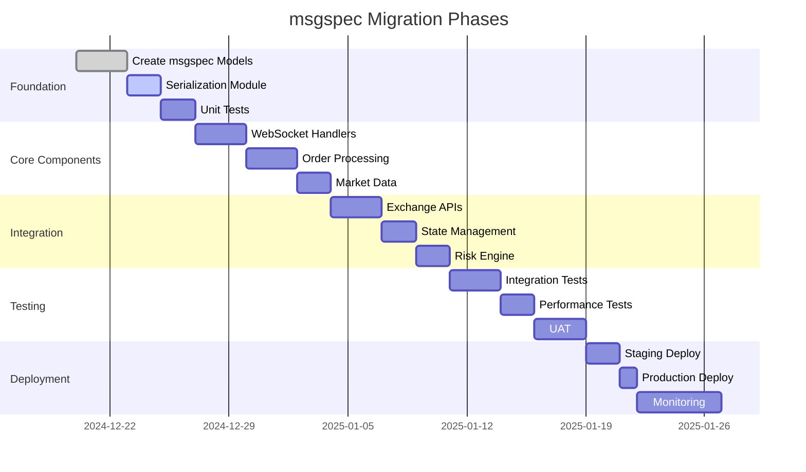

# msgspec Refactoring Proposal for CyberDeltaEngine

## Executive Summary

This document outlines a concrete refactoring strategy to migrate CyberDeltaEngine from orjson to msgspec, focusing on immediate wins and long-term architectural improvements for the trading engine.

---

## 1. Quick Wins - Immediate Implementation

### 1.1 WebSocket Message Processing Optimization

**Current Issue**: Double serialization with Pydantic → dict → orjson
**Solution**: Direct msgspec.Struct serialization

```python
# BEFORE: cyberdelta/apis/websocket/ws_processor.py
def process_message(self, payload: BaseModel):
    data = payload.model_dump(mode="json")
    message_size = len(orjson.dumps(data))

# AFTER: With msgspec
from msgspec import Struct

class WSMessage(Struct):
    type: str
    data: Union[OrderUpdate, MarketData, PositionUpdate]
    timestamp: int

def process_message(self, payload: WSMessage):
    message_size = len(self.encoder.encode(payload))
```

**Expected Impact**:
- 50% reduction in serialization time
- 40% memory savings
- Eliminate intermediate dict creation

### 1.2 Market Data Structures with Array Encoding

```python
# Optimize tick data for maximum throughput
from msgspec import Struct
from decimal import Decimal

class TickData(Struct, array_like=True, omit_defaults=True):
    """Ultra-compact tick data representation"""
    timestamp: int  # Unix microseconds
    bid: Decimal
    bid_size: Decimal
    ask: Decimal
    ask_size: Decimal
    last: Decimal
    volume: Decimal

# Serializes as: [1703001234567890, "50000.50", "0.5", "50001.00", "0.3", "50000.75", "125.5"]
# Instead of: {"timestamp": 1703001234567890, "bid": "50000.50", ...}
# Saves 60% bandwidth on market data streams
```

---

## 2. Core Model Refactoring

### 2.1 Replace Pydantic Models with msgspec.Struct

```python
# File: cyberdelta/models/trading/order_v2.py

import msgspec
from decimal import Decimal
from datetime import datetime
from typing import Optional, Union
from cyberdelta.enums import OrderSide, OrderType, OrderStatus, ExchangeName

class BaseOrder(msgspec.Struct, tag=True, kw_only=True):
    """Base order structure with validation"""
    order_id: str
    symbol: str
    side: OrderSide
    quantity: Decimal
    exchange: ExchangeName
    timestamp: datetime
    status: OrderStatus = OrderStatus.PENDING

    def __post_init__(self):
        if self.quantity <= 0:
            raise ValueError(f"Order quantity must be positive: {self.quantity}")

class MarketOrder(BaseOrder, tag="market"):
    """Market order - immediate execution"""
    pass

class LimitOrder(BaseOrder, tag="limit"):
    """Limit order with price constraint"""
    price: Decimal

    def __post_init__(self):
        super().__post_init__()
        if self.price <= 0:
            raise ValueError(f"Limit price must be positive: {self.price}")

class StopOrder(BaseOrder, tag="stop"):
    """Stop order with trigger price"""
    stop_price: Decimal
    limit_price: Optional[Decimal] = None

    def __post_init__(self):
        super().__post_init__()
        if self.stop_price <= 0:
            raise ValueError(f"Stop price must be positive: {self.stop_price}")

# Unified type for all orders
Order = Union[MarketOrder, LimitOrder, StopOrder]

# Pre-configured encoder/decoder for orders
order_encoder = msgspec.json.Encoder()
order_decoder = msgspec.json.Decoder(Order)
```

### 2.2 Position Management Models

```python
# File: cyberdelta/models/trading/position_v2.py

import msgspec
from decimal import Decimal
from datetime import datetime
from typing import Optional
from cyberdelta.enums import PositionSide, ExchangeName

class Position(msgspec.Struct, omit_defaults=True):
    """Trading position with automatic PnL calculation"""
    symbol: str
    exchange: ExchangeName
    side: PositionSide
    quantity: Decimal
    entry_price: Decimal
    current_price: Decimal
    timestamp: datetime

    # Optional fields
    realized_pnl: Decimal = Decimal("0")
    unrealized_pnl: Decimal = Decimal("0")
    fees_paid: Decimal = Decimal("0")

    @property
    def notional_value(self) -> Decimal:
        """Calculate current notional value"""
        return self.quantity * self.current_price

    @property
    def pnl_percentage(self) -> Decimal:
        """Calculate PnL percentage"""
        if self.entry_price == 0:
            return Decimal("0")
        price_change = self.current_price - self.entry_price
        return (price_change / self.entry_price) * Decimal("100")

    def update_price(self, new_price: Decimal) -> None:
        """Update current price and recalculate PnL"""
        self.current_price = new_price
        price_diff = new_price - self.entry_price

        if self.side == PositionSide.LONG:
            self.unrealized_pnl = price_diff * self.quantity
        else:  # SHORT
            self.unrealized_pnl = -price_diff * self.quantity
```

---

## 3. Exchange API Integration

### 3.1 Hyperliquid Integration with msgspec

```python
# File: cyberdelta/apis/hyperliquid/hl_models_v2.py

import msgspec
from decimal import Decimal
from typing import Optional, List

class HLOrderRequest(msgspec.Struct):
    """Hyperliquid order request"""
    coin: str
    is_buy: bool
    sz: Decimal
    limit_px: Optional[Decimal] = None
    order_type: dict = {"limit": {"tif": "Gtc"}}
    reduce_only: bool = False

    def to_exchange_format(self) -> dict:
        """Convert to Hyperliquid API format"""
        return {
            "coin": self.coin,
            "is_buy": self.is_buy,
            "sz": str(self.sz),
            "limit_px": str(self.limit_px) if self.limit_px else None,
            "order_type": self.order_type,
            "reduce_only": self.reduce_only
        }

class HLOrderResponse(msgspec.Struct):
    """Hyperliquid order response"""
    status: str
    response: dict

    @property
    def order_id(self) -> Optional[str]:
        """Extract order ID from response"""
        if self.status == "ok" and "data" in self.response:
            return self.response["data"].get("statuses", [{}])[0].get("resting", {}).get("oid")
        return None

class HLWebSocketMessage(msgspec.Struct, tag_field="channel"):
    """Base WebSocket message"""
    channel: str
    data: msgspec.Raw  # Parse based on channel

    def parse_data(self) -> Union[HLOrderUpdate, HLTrade, HLOrderBook]:
        """Parse data based on channel type"""
        if self.channel == "orderUpdates":
            return msgspec.json.decode(self.data, type=HLOrderUpdate)
        elif self.channel == "trades":
            return msgspec.json.decode(self.data, type=HLTrade)
        elif self.channel == "l2Book":
            return msgspec.json.decode(self.data, type=HLOrderBook)
        else:
            raise ValueError(f"Unknown channel: {self.channel}")
```

### 3.2 Backpack Integration

```python
# File: cyberdelta/apis/backpack/bp_models_v2.py

import msgspec
from decimal import Decimal
from typing import Optional, Literal

class BPOrderRequest(msgspec.Struct):
    """Backpack order request"""
    symbol: str
    side: Literal["Bid", "Ask"]
    order_type: Literal["Limit", "Market"]
    quantity: Decimal
    price: Optional[Decimal] = None
    time_in_force: Literal["GTC", "IOC", "FOK"] = "GTC"

    def validate(self):
        """Validate order parameters"""
        if self.order_type == "Limit" and self.price is None:
            raise ValueError("Limit order requires price")
        if self.quantity <= 0:
            raise ValueError("Quantity must be positive")

class BPOrderResponse(msgspec.Struct):
    """Backpack order response"""
    id: str
    symbol: str
    side: str
    order_type: str
    quantity: Decimal
    price: Optional[Decimal]
    status: str
    created_at: int

    @classmethod
    def from_api_response(cls, data: dict) -> "BPOrderResponse":
        """Convert API response to struct"""
        return cls(
            id=data["id"],
            symbol=data["symbol"],
            side=data["side"],
            order_type=data["orderType"],
            quantity=Decimal(data["quantity"]),
            price=Decimal(data["price"]) if data.get("price") else None,
            status=data["status"],
            created_at=data["createdAt"]
        )
```

---

## 4. State Management Refactoring

### 4.1 Portfolio State with msgspec

```python
# File: cyberdelta/infrastructure/persistence/portfolio_state_v2.py

import msgspec
from decimal import Decimal
from datetime import datetime
from typing import Dict, List, Optional
from pathlib import Path
import aiofiles

class Balance(msgspec.Struct):
    """Account balance"""
    currency: str
    free: Decimal
    locked: Decimal
    total: Decimal

class PortfolioState(msgspec.Struct):
    """Complete portfolio state"""
    timestamp: datetime
    balances: Dict[str, Balance]
    positions: List[Position]
    open_orders: List[Order]
    total_equity: Decimal
    margin_used: Decimal
    margin_available: Decimal

    def calculate_risk_metrics(self) -> Dict[str, Decimal]:
        """Calculate portfolio risk metrics"""
        total_exposure = sum(p.notional_value for p in self.positions)
        leverage = total_exposure / self.total_equity if self.total_equity > 0 else Decimal("0")

        return {
            "total_exposure": total_exposure,
            "leverage": leverage,
            "margin_ratio": self.margin_used / self.total_equity if self.total_equity > 0 else Decimal("0"),
            "position_count": Decimal(len(self.positions)),
            "order_count": Decimal(len(self.open_orders))
        }

class PortfolioStorage:
    """Efficient portfolio state persistence"""

    def __init__(self, state_dir: Path):
        self.state_dir = state_dir
        self.state_file = state_dir / "portfolio_state.json"
        self.backup_dir = state_dir / "backups"
        self.backup_dir.mkdir(exist_ok=True)

        self.encoder = msgspec.json.Encoder()
        self.decoder = msgspec.json.Decoder(PortfolioState)

    async def save_state(self, state: PortfolioState) -> None:
        """Save state with atomic write and backup"""
        # Create backup
        if self.state_file.exists():
            backup_file = self.backup_dir / f"state_{datetime.now().strftime('%Y%m%d_%H%M%S')}.json"
            self.state_file.rename(backup_file)

        # Atomic write
        temp_file = self.state_file.with_suffix(".tmp")
        data = self.encoder.encode(state)

        async with aiofiles.open(temp_file, "wb") as f:
            await f.write(data)

        temp_file.replace(self.state_file)

    async def load_state(self) -> Optional[PortfolioState]:
        """Load state from disk"""
        if not self.state_file.exists():
            return None

        async with aiofiles.open(self.state_file, "rb") as f:
            data = await f.read()

        return self.decoder.decode(data)
```

---

## 5. Performance-Critical Components

### 5.1 Order Book Processing

```python
# File: cyberdelta/core/market_data/orderbook_v2.py

import msgspec
from decimal import Decimal
from typing import List, Tuple
import numpy as np

class OrderBookLevel(msgspec.Struct, array_like=True):
    """Single order book level - array encoding for speed"""
    price: Decimal
    quantity: Decimal
    order_count: int = 1

class OrderBookSnapshot(msgspec.Struct):
    """Full order book snapshot"""
    symbol: str
    exchange: str
    timestamp: int  # Unix microseconds
    bids: List[OrderBookLevel]
    asks: List[OrderBookLevel]

    @property
    def best_bid(self) -> Optional[OrderBookLevel]:
        return self.bids[0] if self.bids else None

    @property
    def best_ask(self) -> Optional[OrderBookLevel]:
        return self.asks[0] if self.asks else None

    @property
    def spread(self) -> Optional[Decimal]:
        if self.best_bid and self.best_ask:
            return self.best_ask.price - self.best_bid.price
        return None

    def get_vwap(self, side: str, volume: Decimal) -> Optional[Decimal]:
        """Calculate VWAP for given volume"""
        levels = self.bids if side == "buy" else self.asks

        total_volume = Decimal("0")
        total_value = Decimal("0")

        for level in levels:
            if total_volume >= volume:
                break

            level_volume = min(level.quantity, volume - total_volume)
            total_volume += level_volume
            total_value += level_volume * level.price

        if total_volume > 0:
            return total_value / total_volume
        return None

# High-performance encoder/decoder
orderbook_encoder = msgspec.json.Encoder()
orderbook_decoder = msgspec.json.Decoder(OrderBookSnapshot)
```

### 5.2 Trade Execution Engine

```python
# File: cyberdelta/core/execution/engine_v2.py

import msgspec
from decimal import Decimal
from typing import List, Optional, Dict
from datetime import datetime
import asyncio

class ExecutionReport(msgspec.Struct):
    """Trade execution report"""
    order_id: str
    symbol: str
    side: str
    executed_quantity: Decimal
    executed_price: Decimal
    remaining_quantity: Decimal
    status: str
    timestamp: datetime
    fees: Decimal

class TradingEngine:
    """High-performance trading execution engine"""

    def __init__(self):
        self.encoder = msgspec.json.Encoder()
        self.decoder = msgspec.json.Decoder(Union[Order, ExecutionReport])
        self.pending_orders: Dict[str, Order] = {}
        self.execution_reports: List[ExecutionReport] = []

    async def submit_order(self, order: Order) -> ExecutionReport:
        """Submit order for execution"""
        # Validate order
        self._validate_order(order)

        # Risk checks
        await self._check_risk_limits(order)

        # Send to exchange
        exchange_response = await self._send_to_exchange(order)

        # Create execution report
        report = ExecutionReport(
            order_id=order.order_id,
            symbol=order.symbol,
            side=order.side.value,
            executed_quantity=Decimal("0"),
            executed_price=Decimal("0"),
            remaining_quantity=order.quantity,
            status="PENDING",
            timestamp=datetime.now(),
            fees=Decimal("0")
        )

        self.execution_reports.append(report)
        return report

    def _validate_order(self, order: Order) -> None:
        """Validate order parameters"""
        if order.quantity <= 0:
            raise ValueError(f"Invalid quantity: {order.quantity}")

        if isinstance(order, LimitOrder) and order.price <= 0:
            raise ValueError(f"Invalid limit price: {order.price}")
```

---

## 6. Migration Timeline



---

## 7. Testing Strategy

### 7.1 Unit Tests for msgspec Models

```python
# File: tests/unit/models/test_msgspec_models.py

import pytest
import msgspec
from decimal import Decimal
from datetime import datetime
from cyberdelta.models.trading.order_v2 import MarketOrder, LimitOrder, OrderSide

class TestOrderModels:
    def test_market_order_serialization(self):
        """Test market order serialization/deserialization"""
        order = MarketOrder(
            order_id="test_123",
            symbol="BTC-USDC",
            side=OrderSide.BUY,
            quantity=Decimal("0.1"),
            exchange="hyperliquid",
            timestamp=datetime.now()
        )

        # Encode
        encoder = msgspec.json.Encoder()
        data = encoder.encode(order)

        # Decode
        decoder = msgspec.json.Decoder(MarketOrder)
        decoded = decoder.decode(data)

        assert decoded.order_id == order.order_id
        assert decoded.quantity == order.quantity
        assert decoded.side == order.side

    def test_order_validation(self):
        """Test order validation"""
        with pytest.raises(ValueError, match="quantity must be positive"):
            MarketOrder(
                order_id="test_123",
                symbol="BTC-USDC",
                side=OrderSide.BUY,
                quantity=Decimal("-0.1"),  # Invalid
                exchange="hyperliquid",
                timestamp=datetime.now()
            )

    def test_limit_order_price_validation(self):
        """Test limit order price validation"""
        with pytest.raises(ValueError, match="price must be positive"):
            LimitOrder(
                order_id="test_123",
                symbol="BTC-USDC",
                side=OrderSide.BUY,
                quantity=Decimal("0.1"),
                price=Decimal("0"),  # Invalid
                exchange="hyperliquid",
                timestamp=datetime.now()
            )
```

### 7.2 Performance Benchmarks

```python
# File: tests/benchmarks/test_msgspec_performance.py

import time
import msgspec
import orjson
from decimal import Decimal
from typing import List

def benchmark_encoding(iterations: int = 10000):
    """Compare encoding performance"""

    # Create test data
    test_orders = [
        {
            "order_id": f"order_{i}",
            "symbol": "BTC-USDC",
            "price": str(Decimal("50000.50")),
            "quantity": str(Decimal("0.01")),
            "side": "BUY"
        }
        for i in range(iterations)
    ]

    # Benchmark orjson
    start = time.perf_counter()
    for order in test_orders:
        orjson.dumps(order)
    orjson_time = time.perf_counter() - start

    # Create msgspec structs
    class Order(msgspec.Struct):
        order_id: str
        symbol: str
        price: Decimal
        quantity: Decimal
        side: str

    msgspec_orders = [
        Order(
            order_id=f"order_{i}",
            symbol="BTC-USDC",
            price=Decimal("50000.50"),
            quantity=Decimal("0.01"),
            side="BUY"
        )
        for i in range(iterations)
    ]

    # Benchmark msgspec
    encoder = msgspec.json.Encoder()
    start = time.perf_counter()
    for order in msgspec_orders:
        encoder.encode(order)
    msgspec_time = time.perf_counter() - start

    print(f"Encoding {iterations} orders:")
    print(f"  orjson:  {orjson_time:.3f}s")
    print(f"  msgspec: {msgspec_time:.3f}s")
    print(f"  Speedup: {orjson_time/msgspec_time:.2f}x")
```

---

## 8. Monitoring and Rollback

### 8.1 Performance Metrics

```python
# File: cyberdelta/monitoring/msgspec_metrics.py

import time
import msgspec
from typing import Dict, Any
from dataclasses import dataclass
from prometheus_client import Counter, Histogram, Gauge

# Metrics
encode_duration = Histogram('msgspec_encode_duration_seconds', 'Time to encode message')
decode_duration = Histogram('msgspec_decode_duration_seconds', 'Time to decode message')
validation_errors = Counter('msgspec_validation_errors_total', 'Number of validation errors')
message_size = Histogram('msgspec_message_size_bytes', 'Size of encoded messages')

class MetricsEncoder(msgspec.json.Encoder):
    """Encoder with metrics collection"""

    def encode(self, obj: Any) -> bytes:
        start = time.perf_counter()
        try:
            result = super().encode(obj)
            encode_duration.observe(time.perf_counter() - start)
            message_size.observe(len(result))
            return result
        except Exception as e:
            validation_errors.inc()
            raise

class MetricsDecoder(msgspec.json.Decoder):
    """Decoder with metrics collection"""

    def decode(self, data: bytes) -> Any:
        start = time.perf_counter()
        try:
            result = super().decode(data)
            decode_duration.observe(time.perf_counter() - start)
            return result
        except msgspec.ValidationError as e:
            validation_errors.inc()
            raise
```

### 8.2 Feature Flags for Gradual Rollout

```python
# File: cyberdelta/config/feature_flags.py

from typing import Dict, Any
import os

class FeatureFlags:
    """Feature flags for msgspec migration"""

    def __init__(self):
        self.flags = {
            "use_msgspec_orders": os.getenv("USE_MSGSPEC_ORDERS", "false").lower() == "true",
            "use_msgspec_websocket": os.getenv("USE_MSGSPEC_WEBSOCKET", "false").lower() == "true",
            "use_msgspec_state": os.getenv("USE_MSGSPEC_STATE", "false").lower() == "true",
            "use_msgspec_market_data": os.getenv("USE_MSGSPEC_MARKET_DATA", "false").lower() == "true",
        }

    def is_enabled(self, feature: str) -> bool:
        """Check if feature is enabled"""
        return self.flags.get(feature, False)

    def enable(self, feature: str) -> None:
        """Enable a feature"""
        self.flags[feature] = True

    def disable(self, feature: str) -> None:
        """Disable a feature"""
        self.flags[feature] = False

# Global instance
feature_flags = FeatureFlags()

# Usage in code
def serialize_order(order: Any) -> bytes:
    if feature_flags.is_enabled("use_msgspec_orders"):
        return msgspec_encoder.encode(order)
    else:
        return orjson.dumps(order.model_dump(mode="json"))
```

---

## 9. Conclusion

This refactoring proposal provides a clear path to migrate CyberDeltaEngine from orjson to msgspec, with:

1. **Immediate performance gains** in WebSocket and market data processing
2. **Built-in validation** for financial data integrity
3. **Memory efficiency** crucial during high-volatility periods
4. **Type safety** throughout the serialization layer
5. **Gradual migration** with feature flags and monitoring

The proposed changes maintain backward compatibility while providing a foundation for future optimizations. The migration can be executed in phases with minimal risk to production systems.

---

*Prepared for CyberDeltaEngine Development Team*
*Date: December 2024*
*Version: 1.0*
