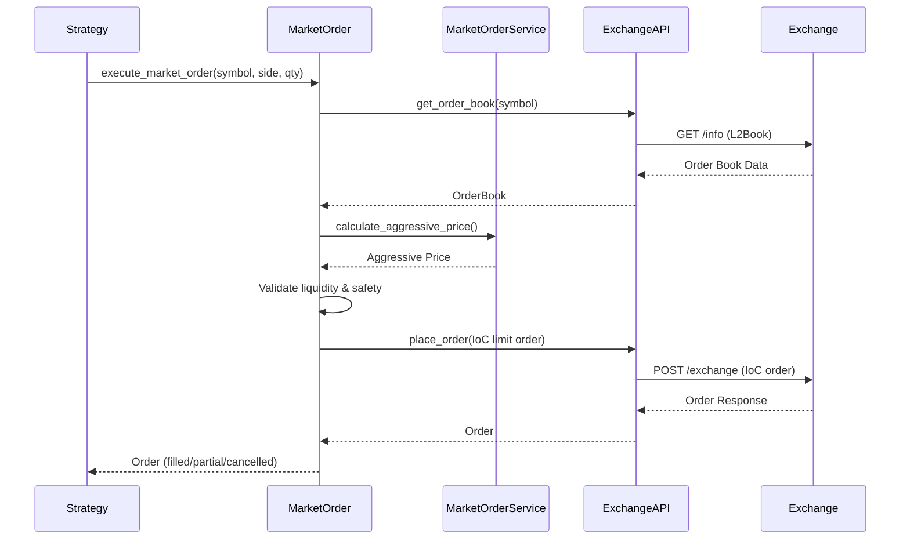

# MarketOrder - Business Logic Documentation

## Overview

The MarketOrder is a **business logic component** that implements programmatic market orders using aggressive IoC (Immediate-or-Cancel) limit orders. This component sits in the **core execution layer** (`cyberdelta/core/execution/orders/`) and leverages the existing exchange API infrastructure to execute market-like orders safely.

## Architecture Position

```
cyberdelta/
├── apis/                    # Exchange API layer (NOT HERE)
│   ├── hyperliquid/        # Exchange-specific implementation
│   └── base/               # Abstract interfaces
└── core/                   # Business logic layer (HERE)
    └── execution/
        └── orders/         # Order execution logic
            ├── market_order.py
            └── market_order_service.py
```

## Why Not in API Architecture?

1. **No Native Market Orders**: Hyperliquid doesn't provide a native market order API endpoint
2. **Business Logic**: Market order execution is a trading strategy, not an API concern
3. **Exchange Agnostic**: The logic works across any exchange supporting IoC limit orders
4. **Composition Pattern**: Builds on top of existing API primitives (`place_order` with IoC)

## Implementation Design

### Core Components

#### 1. MarketOrder
```python
class MarketOrder:
    """Executes market orders using aggressive IoC limit orders."""
    
    def __init__(
        self,
        exchange_api: ExchangeAPI,
        market_order_service: MarketOrderService,
        config: MarketOrderConfig
    ):
        self._exchange = exchange_api
        self._market_order_service = market_order_service
        self._config = config
    
    async def execute_market_order(
        self,
        symbol: str,
        side: OrderSide,
        quantity: Decimal,
        max_slippage: Decimal | None = None
    ) -> Order:
        """Execute a market order with safety checks."""
```

#### 2. MarketOrderService
```python
class MarketOrderService:
    """Service for calculating aggressive prices and managing market order execution logic."""
    
    async def calculate_aggressive_price(
        self,
        order_book: OrderBook,
        side: OrderSide,
        quantity: Decimal,
        slippage_estimate: Decimal
    ) -> Decimal:
        """Calculate IoC limit price with slippage buffer."""
```

### Execution Flow



### Safety Mechanisms

#### 1. Liquidity Validation
```python
def validate_liquidity(
    self,
    order_book: OrderBook,
    side: OrderSide,
    quantity: Decimal
) -> tuple[bool, Decimal]:
    """Check if sufficient liquidity exists."""
    
    levels = order_book.asks if side == OrderSide.BUY else order_book.bids
    available = Decimal("0")
    
    for price, size in levels:
        available += size
        if available >= quantity * self._config.min_liquidity_ratio:
            return True, available
    
    return False, available
```

#### 2. Price Bounds Checking
```python
def validate_price_bounds(
    self,
    aggressive_price: Decimal,
    reference_price: Decimal,
    side: OrderSide
) -> None:
    """Ensure price doesn't deviate too far from reference."""
    
    max_deviation = self._config.max_price_deviation_pct
    deviation = abs(aggressive_price - reference_price) / reference_price
    
    if deviation > max_deviation:
        raise MarketOrderError(
            f"Price deviation {deviation:.2%} exceeds limit {max_deviation:.2%}"
        )
```

#### 3. Slippage Control
```python
# Configuration-driven slippage limits
market_order_config = MarketOrderConfig(
    default_slippage_pct=Decimal("0.001"),      # 0.1%
    max_slippage_pct=Decimal("0.05"),           # 5% hard limit
    max_price_deviation_pct=Decimal("0.10"),    # 10% from reference
    min_liquidity_ratio=Decimal("2.0"),         # 2x order size required
    slippage_by_symbol={
        "BTC": Decimal("0.005"),                # 0.5% for liquid assets
        "ETH": Decimal("0.005"),
        "SOL": Decimal("0.01"),
        "default": Decimal("0.02")              # 2% for others
    }
)
```

### Integration with Existing Infrastructure

#### 1. Uses Existing Services
- `ExchangeAPI.get_order_book()` for market data
- `ExchangeAPI.get_ticker()` for mid-price reference
- `ExchangeAPI.place_order()` with IoC time-in-force

#### 2. Leverages Existing Components
- `SignalGenerator.estimate_slippage()` for historical slippage data
- Circuit breakers for volatility protection
- Rate limiting through existing infrastructure

#### 3. Error Handling
```python
class MarketOrderError(Exception):
    """Market order execution errors."""
    pass

class InsufficientLiquidityError(MarketOrderError):
    """Not enough liquidity in order book."""
    pass

class PriceDeviationError(MarketOrderError):
    """Aggressive price deviates too far from reference."""
    pass
```

### Usage Example

```python
# Initialize market order
market_order = MarketOrder(
    exchange_api=hyperliquid_api,
    market_order_service=MarketOrderService(),
    config=market_order_config
)

# Execute market buy order
try:
    order = await market_order.execute_market_order(
        symbol="BTC",
        side=OrderSide.BUY,
        quantity=Decimal("0.1"),
        max_slippage=Decimal("0.01")  # Optional: 1% max slippage
    )
    
    if order.status == OrderStatus.FILLED:
        logger.info(f"Market order filled at {order.price}")
    elif order.status == OrderStatus.PARTIALLY_FILLED:
        logger.warning(f"Partial fill: {order.quantity_filled}/{order.quantity}")
    else:
        logger.error("Market order failed - no fill")
        
except InsufficientLiquidityError as e:
    logger.error(f"Cannot execute: {e}")
except MarketOrderError as e:
    logger.error(f"Market order failed: {e}")
```

### AllMids Integration (Optional Enhancement)

For better pricing across all symbols:

```python
class EnhancedMarketOrderService(MarketOrderService):
    """Enhanced service using AllMids data."""
    
    async def get_all_mid_prices(self) -> dict[str, Decimal]:
        """Fetch all mid prices for reference."""
        # When AllMids is implemented in API layer
        all_mids = await self._exchange.get_all_mids()
        return {
            symbol: Decimal(price) 
            for symbol, price in all_mids.items()
        }
```

### Testing Strategy

```python
class TestMarketOrder:
    """Test market order execution logic."""
    
    async def test_successful_market_buy(self):
        """Test successful market buy execution."""
        # Mock order book with sufficient liquidity
        mock_order_book = OrderBook(
            symbol="BTC",
            bids=[(Decimal("50000"), Decimal("10"))],
            asks=[(Decimal("50010"), Decimal("10"))],
            timestamp=datetime.now(UTC)
        )
        
        # Execute market order
        order = await market_order.execute_market_order(
            symbol="BTC",
            side=OrderSide.BUY,
            quantity=Decimal("1")
        )
        
        # Verify aggressive pricing
        assert order.price > Decimal("50010")  # Above best ask
        assert order.time_in_force == TimeInForce.IOC
    
    async def test_insufficient_liquidity_rejection(self):
        """Test rejection when insufficient liquidity."""
        # Mock thin order book
        mock_order_book = OrderBook(
            symbol="ILLIQUID",
            bids=[(Decimal("100"), Decimal("0.1"))],
            asks=[(Decimal("101"), Decimal("0.1"))],
            timestamp=datetime.now(UTC)
        )
        
        # Should raise InsufficientLiquidityError
        with pytest.raises(InsufficientLiquidityError):
            await executor.execute_market_order(
                symbol="ILLIQUID",
                side=OrderSide.BUY,
                quantity=Decimal("1")  # 10x available liquidity
            )
```

### Monitoring and Metrics

```python
class MarketOrderMetrics:
    """Track market order execution metrics."""
    
    def record_execution(
        self,
        symbol: str,
        side: OrderSide,
        requested_qty: Decimal,
        filled_qty: Decimal,
        expected_price: Decimal,
        actual_price: Decimal,
        slippage: Decimal
    ) -> None:
        """Record execution metrics for analysis."""
        
        # Track fill rate
        fill_rate = filled_qty / requested_qty
        
        # Track actual vs expected slippage
        actual_slippage = abs(actual_price - expected_price) / expected_price
        
        # Log for monitoring
        logger.info(
            "market_order_execution",
            extra={
                "symbol": symbol,
                "side": side.value,
                "fill_rate": float(fill_rate),
                "expected_slippage": float(slippage),
                "actual_slippage": float(actual_slippage),
                "price_improvement": float(slippage - actual_slippage)
            }
        )
```

## Summary

The MarketOrder is a **business logic component** that:

1. **Lives in Core Layer**: `cyberdelta/core/execution/orders/`
2. **Uses API Layer**: Leverages existing exchange APIs
3. **Implements Strategy**: Aggressive IoC limit orders
4. **Ensures Safety**: Liquidity validation, price bounds, slippage control
5. **Exchange Agnostic**: Works with any exchange supporting IoC orders
6. **Component Naming**: Uses MarketOrder and MarketOrderService for clarity

This design maintains clean separation between:
- **API Layer**: Raw exchange communication and data models
- **Business Layer**: Trading logic and execution strategies
- **Strategy Layer**: High-level trading strategies using the executor