# CyberDeltaEngine Model Interactions & Boundaries

This diagram illustrates the relationships and boundaries between the core model modules in `cyberdelta/core/models` and their connections to external systems (API, strategy engine, portfolio manager, exchange APIs, etc.).

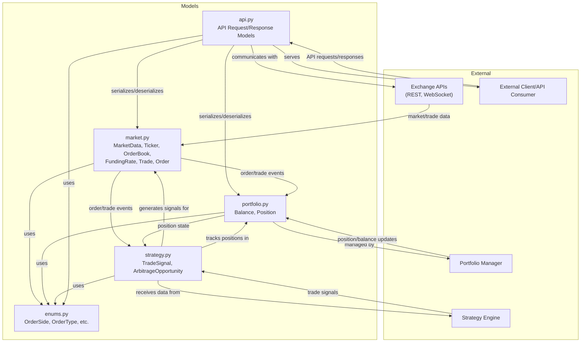

# Per-Model Sequence Flow Diagrams (Detailed)

---

## MarketData Lifecycle & Interactions

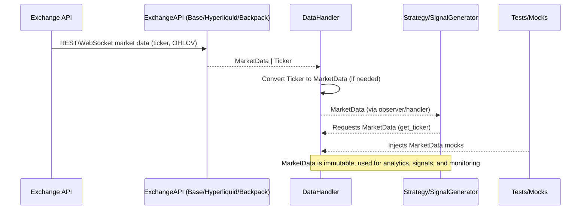

*Figure: MarketData is the canonical snapshot for symbol state, produced by API clients, managed by DataHandler, and consumed by strategies and tests.*

---

## Ticker Lifecycle & Interactions

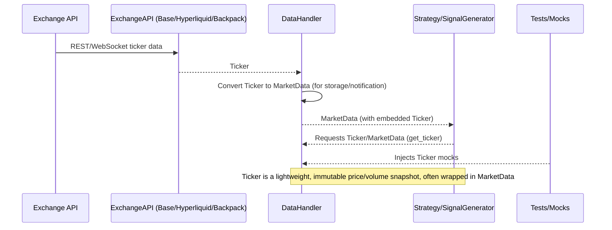

*Figure: Ticker is the atomic market price/volume update, typically wrapped in MarketData for downstream use.*

---

## OrderBook Lifecycle & Interactions

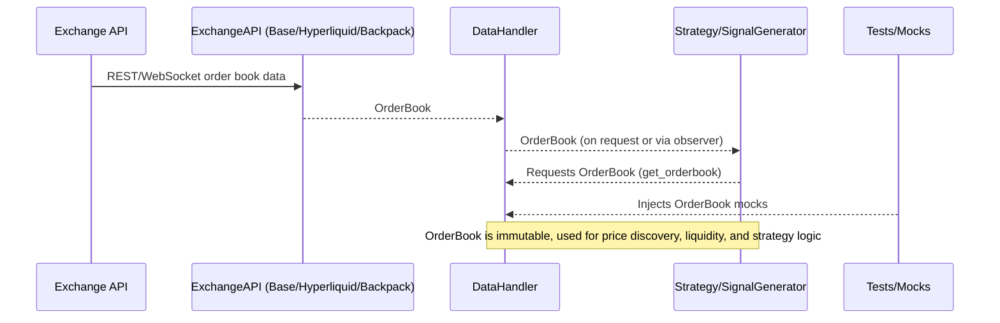

*Figure: OrderBook represents the current market depth, produced by API clients, managed by DataHandler, and used by strategies and tests.*

---

## FundingRate Lifecycle & Interactions

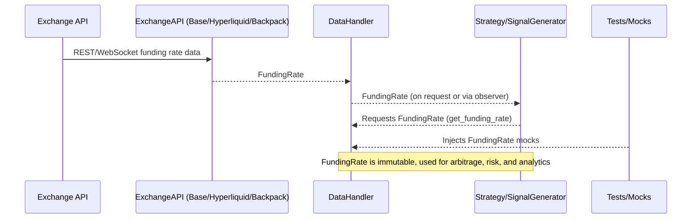

*Figure: FundingRate is the canonical funding data, produced by API clients, managed by DataHandler, and consumed by strategies and tests.*

---

## Trade Lifecycle & Interactions

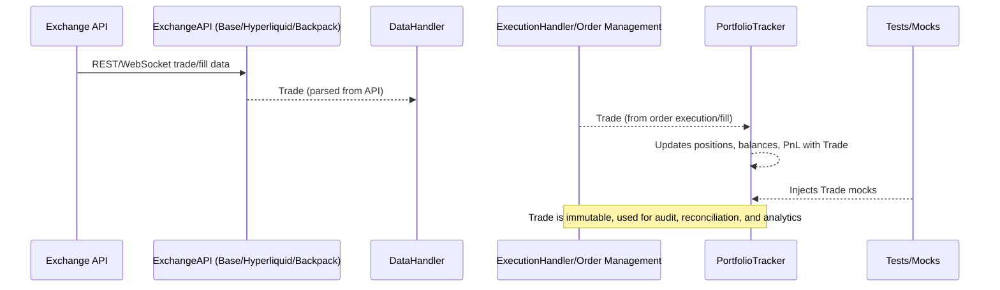

*Figure: Trade represents an immutable execution/fill, produced by API clients, processed by ExecutionHandler, and used by PortfolioTracker and tests.*

---

# Per-Model Flowchart Diagrams (Connectivity Overview)

---

## MarketData Connectivity

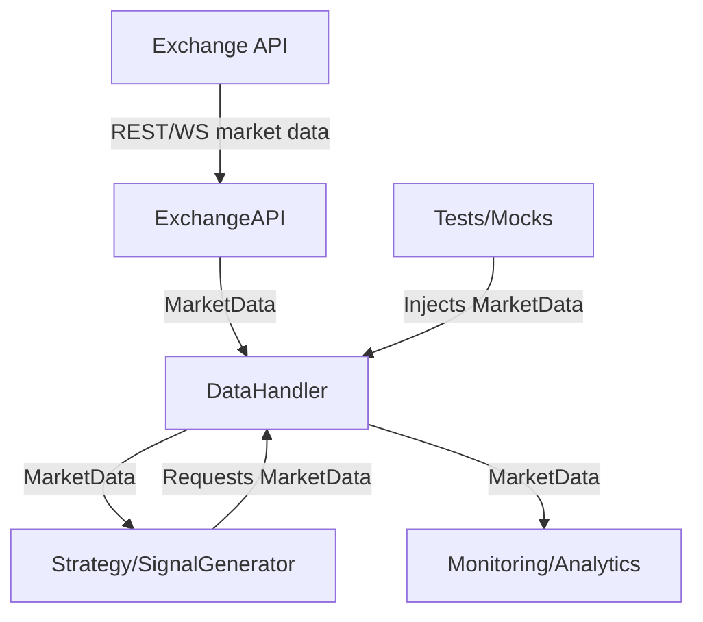
*Figure: MarketData flows from Exchange APIs through API clients and DataHandler to strategies, monitoring, and tests.*

---

## Ticker Connectivity
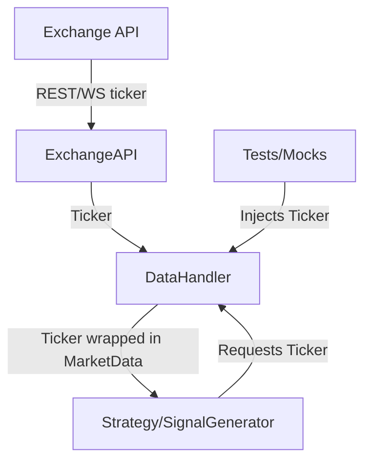
*Figure: Ticker is a direct price/volume update, typically wrapped in MarketData for downstream use.*

---

## OrderBook Connectivity

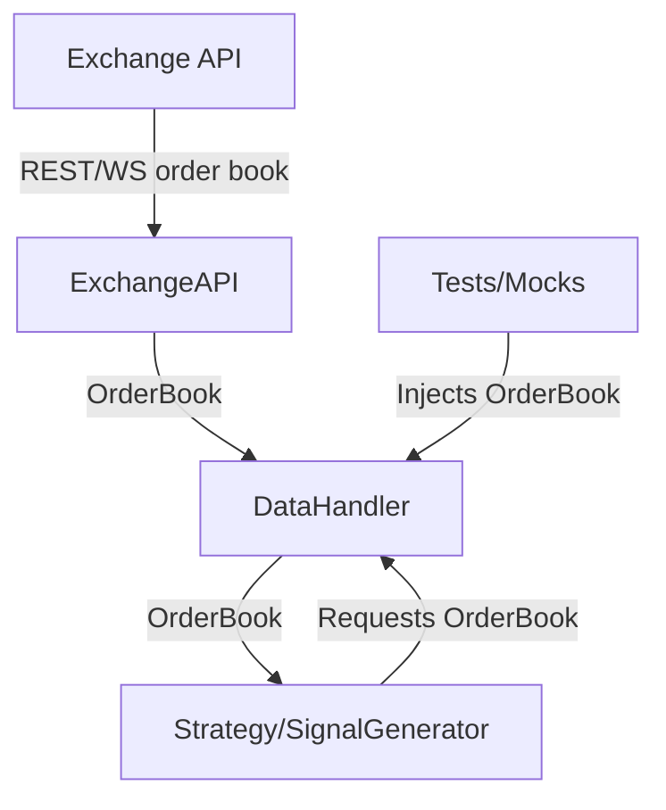
*Figure: OrderBook flows from Exchange APIs through API clients and DataHandler to strategies and tests.*

---

## FundingRate Connectivity

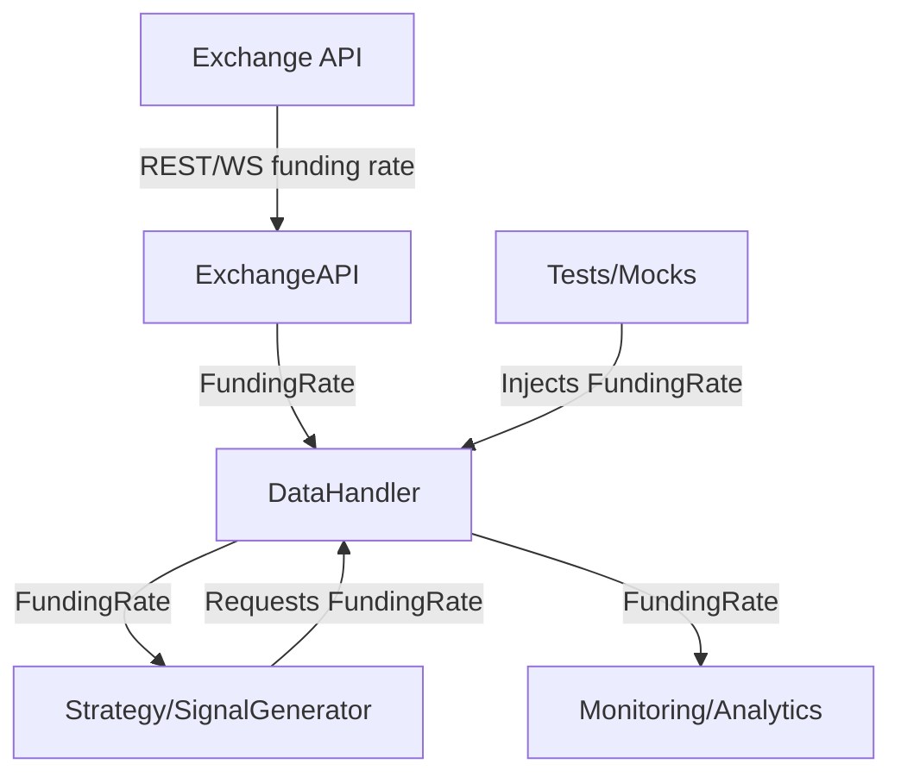
*Figure: FundingRate is distributed from Exchange APIs to strategies, monitoring, and tests via DataHandler.*

---

## Trade Connectivity

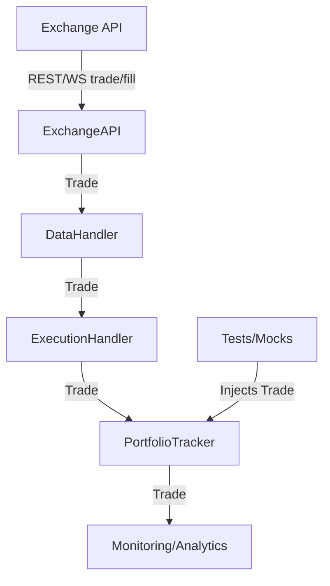
*Figure: Trade objects flow from Exchange APIs through API clients, DataHandler, ExecutionHandler, and PortfolioTracker, supporting audit, reconciliation, and analytics.*

---

# Per-Model Class Diagrams (Structure & Relationships)

---

## MarketData Class Diagram

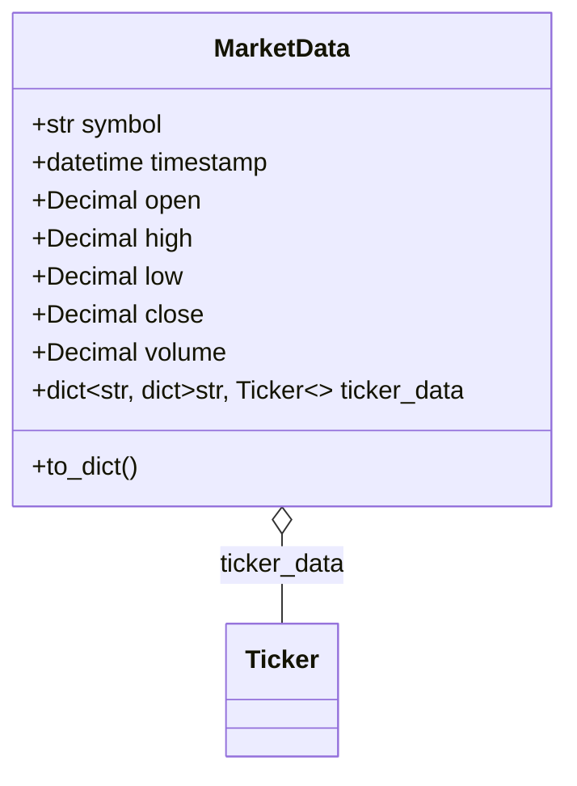
*Figure: MarketData aggregates Ticker objects for advanced analytics and provides immutable market snapshots.*

---

## Ticker Class Diagram

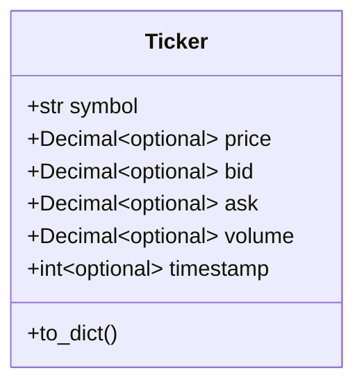
*Figure: Ticker is a lightweight, immutable snapshot of best bid/ask, last price, and volume for a symbol.*

---

## OrderBook Class Diagram

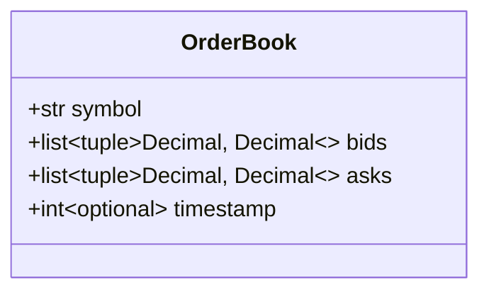
*Figure: OrderBook contains lists of price/quantity tuples for bids and asks, representing market depth.*

---

## FundingRate Class Diagram

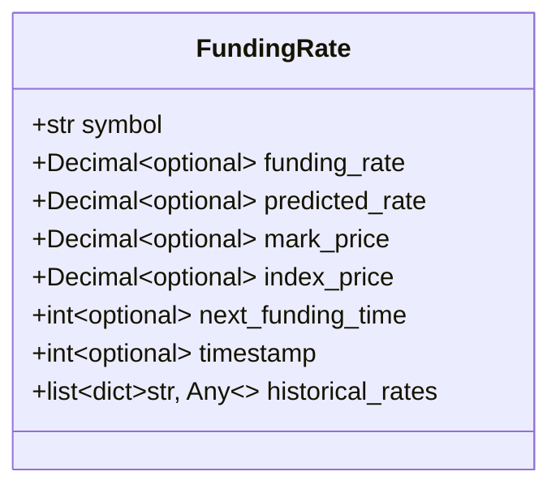
*Figure: FundingRate models the funding and related data for a perpetual contract, with optional historical data.*

---

## Trade Class Diagram

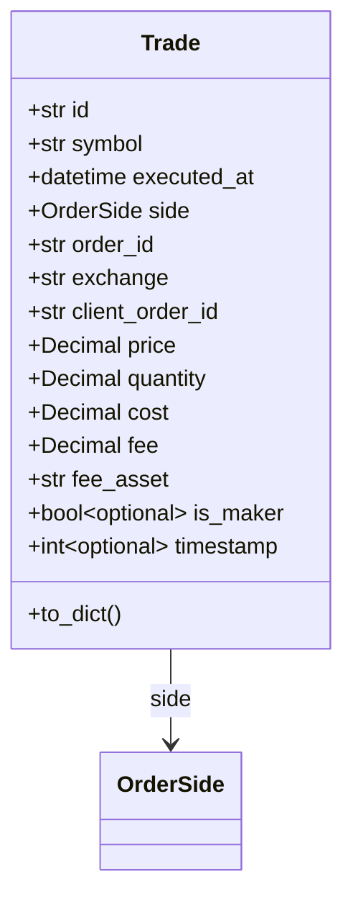
*Figure: Trade is an immutable record of a single execution event, referencing enums for side and containing all financial details.*

---

# Per-Module Component Diagrams

---

## market.py Component Diagram

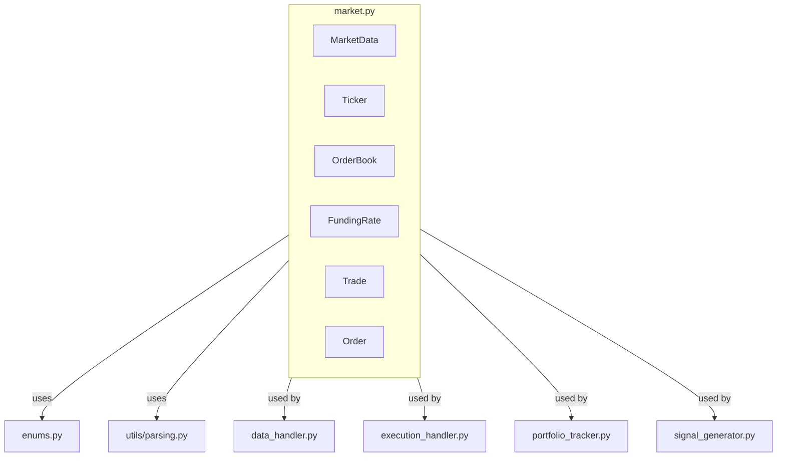
*Figure: market.py provides core data models used throughout the engine, depending on enums and parsing utilities.*

---

## data_handler.py Component Diagram

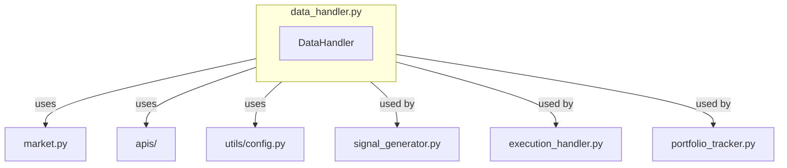
*Figure: data_handler.py manages market data ingestion, normalization, and distribution, interfacing with APIs and core models.*

---

## execution_handler.py Component Diagram

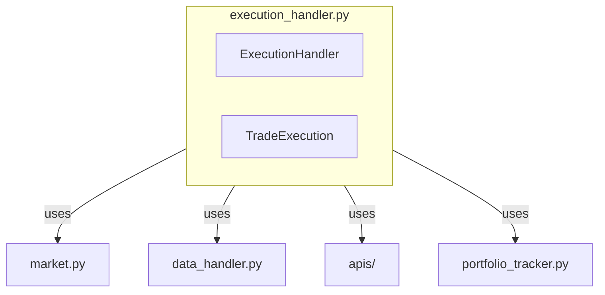
*Figure: execution_handler.py coordinates order execution, status tracking, and trade reconciliation.*

---

## portfolio_tracker.py Component Diagram

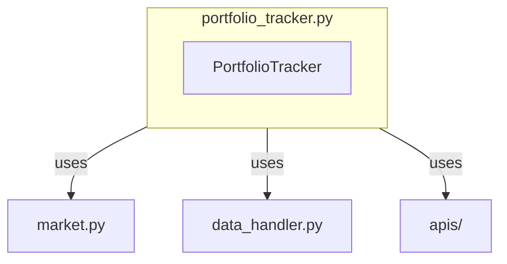
*Figure: portfolio_tracker.py tracks balances, positions, and order status, integrating with core models and APIs.*

---

## signal_generator.py Component Diagram

```mermaid
flowchart TD
    subgraph signal_generator.py
        SignalGenerator
    end
    signal_generator.py -->|uses| market[market.py]
    signal_generator.py -->|uses| data_handler[data_handler.py]
    signal_generator.py -->|uses| apis[apis/]
```
*Figure: signal_generator.py generates trading signals based on market data and funding rates.*

---

# Per-Module State Diagrams

---

## Order State Diagram (market.py)

```mermaid
stateDiagram-v2
    [*] --> NEW
    NEW --> PARTIALLY_FILLED : partial fill
    NEW --> FILLED : full fill
    NEW --> CANCELED : cancel
    PARTIALLY_FILLED --> FILLED : full fill
    PARTIALLY_FILLED --> CANCELED : cancel
    FILLED --> [*]
    CANCELED --> [*]
```
*Figure: Order lifecycle from creation to fill or cancellation, as managed in market.py.*

---

## Trade State Diagram (market.py)

```mermaid
stateDiagram-v2
    [*] --> CREATED
    CREATED --> RECORDED : processed by PortfolioTracker
    RECORDED --> [*]
```
*Figure: Trade is immutable and typically transitions from creation to being recorded in audit or portfolio systems.*

---

## DataHandler Connection State Diagram (data_handler.py)

```mermaid
stateDiagram-v2
    [*] --> DISCONNECTED
    DISCONNECTED --> CONNECTING : start
    CONNECTING --> CONNECTED : success
    CONNECTING --> DISCONNECTED : fail
    CONNECTED --> DISCONNECTED : error/close
```
*Figure: DataHandler manages WebSocket/REST connections with clear connection state transitions.*

---

## PortfolioTracker Position State Diagram (portfolio_tracker.py)

```mermaid
stateDiagram-v2
    [*] --> NO_POSITION
    NO_POSITION --> OPEN : open trade
    OPEN --> INCREASED : add to position
    OPEN --> REDUCED : partial close
    OPEN --> CLOSED : full close
    INCREASED --> REDUCED : partial close
    INCREASED --> CLOSED : full close
    REDUCED --> INCREASED : add to position
    REDUCED --> CLOSED : full close
    CLOSED --> NO_POSITION
```
*Figure: PortfolioTracker manages position states as trades are opened, increased, reduced, or closed.*

---