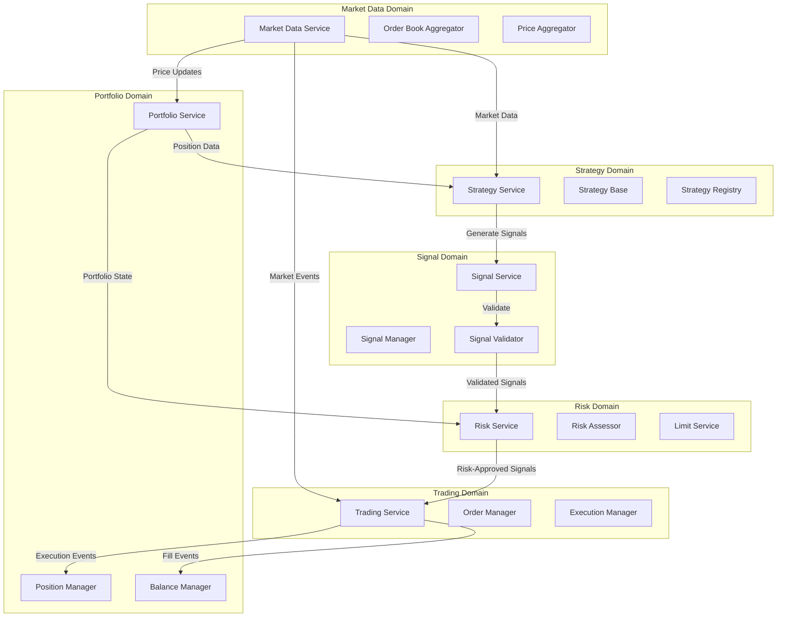

# CyberDeltaEngine: Clean New Architecture

## Executive Summary

After deleting all business logic due to inconsistencies from multiple incomplete refactoring attempts, we need to build a new clean architecture from scratch. This document defines how to build the business logic layer on top of the remaining well-designed infrastructure components.

### Current State (v0.0.1 - No Business Logic)

The system currently has NO business logic. What remains after deletion:

1. **Exchange API Clients** (`cyberdelta/apis/`) - Mature exchange integration layer connecting to Hyperliquid and Backpack
2. **Core Models** (`cyberdelta/models/`) - Strong Pydantic-based domain models  
3. **Symbol System** (`cyberdelta/core/symbols/`) - Rich domain-driven symbol management with `Symbol` objects (NEVER use string symbols)
4. **Configuration** (`cyberdelta/config/`) - Comprehensive Pydantic-based config system with AppSettings model
5. **WebSocket Infrastructure** (`cyberdelta/apis/websocket/`) - Solid real-time data handling
6. **Main Entry Point** (`main.py`) - Attempts to run but has no business logic to execute

### What Was Deleted (And Why)

All business logic was removed because it suffered from:
1. **Multiple overlapping refactoring attempts** - Each incomplete, adding layers of technical debt
2. **Severe duplication** - 5 validation systems, 2 incompatible position sizing systems
3. **Empty state containers** - Returning empty data while pretending to work
4. **Placeholder methods** - Masking integration failures throughout
5. **No clear boundaries** - Portfolio and risk modules had 70% functionality overlap

## What Needs to Be Built (From Scratch)

Since ALL business logic has been deleted, we need to build:

1. **Portfolio Management**
   - State management that actually stores and retrieves data
   - Balance and position tracking
   - Real persistence (not empty returns)

2. **Risk Management**  
   - Position sizing (single implementation, not 2 conflicting ones)
   - Risk assessment and limits
   - Exposure calculations

3. **Trading Engine**
   - Order management and execution
   - Fill processing
   - Trade execution framework

4. **Market Data Processing**
   - Price aggregation across exchanges
   - Order book management
   - Real-time data handling

5. **Strategy Framework**
   - Strategy execution and lifecycle management
   - Signal generation based on market conditions
   - Strategy registry for multiple strategies

6. **Signal Processing Framework**
   - Signal validation (one system, not 5)
   - Signal routing and management
   - Risk pre-checks before execution

## Core Architecture Principles

### 0. CRITICAL: Structured Logging with cyberdelta.logging

**ALL services MUST use the structured logging system from `cyberdelta.logging`**:

```python
# ❌ NEVER DO THIS - Raw logging
import logging
logger = logging.getLogger(__name__)
logger.info(f"Order placed: {order_id}")  # String formatting loses structure

# ✅ ALWAYS DO THIS - Structured logging
import structlog
from cyberdelta.logging.logging_helpers import log_order_lifecycle, log_trading_event

logger = structlog.get_logger(__name__)

# Use specific helpers for trading events
log_order_lifecycle(logger, order, "placed", signal_id=signal.signal_id)
log_trading_event(logger, "position_opened", position, exclude_sensitive=True)
```

#### Logging System Features

The logging system (`cyberdelta/logging/`) provides:
- **Structured Logging**: Uses `structlog` for JSON-structured logs
- **Trading Event Helpers**: 
  - `log_trading_event()` - Generic trading event logging
  - `log_order_lifecycle()` - Order-specific events (placed, filled, cancelled)
  - `log_position_update()` - Position events (opened, closed, updated)
- **Sensitive Data Protection**: Automatically excludes sensitive fields based on model type
- **Consistent Format**: All logs follow same structure for easy parsing

#### Sensitive Field Exclusion

The logging system automatically excludes sensitive fields to prevent leaking financial data:

```python
# cyberdelta/logging/logging_helpers.py defines sensitive fields per model:
SENSITIVE_FIELDS = {
    Order: {"trades", "hl_details", "bp_details"},
    Trade: {"hl_details", "bp_details"},
    TradeSignal: {"metadata"},  # May contain strategy-specific sensitive data
    DerivativePosition: {"hl_details", "bp_details"},
    MarginAccountSummary: {"total_equity", "available_equity", "hl_details", "bp_details"},
}
```

When using `log_trading_event()`, sensitive fields are excluded by default:
- `exclude_sensitive=True` (default) - Removes sensitive fields
- `exclude_sensitive=False` - Includes all fields (use with caution)

#### Usage Examples

```python
import structlog
from cyberdelta.logging.logging_helpers import (
    log_trading_event,
    log_order_lifecycle,
    log_position_update
)

logger = structlog.get_logger(__name__)

class TradingService:
    def __init__(self, config: AppSettings):
        self.config = config
        self.logger = structlog.get_logger(__name__)
        
    async def place_order(self, order: Order) -> None:
        # Log with structured data
        log_order_lifecycle(
            self.logger,
            order,
            "placed",
            exchange=order.exchange,
            safe_mode=self.config.general.safe_mode
        )
        
    async def update_position(self, position: DerivativePosition) -> None:
        # Log position updates
        log_position_update(
            self.logger,
            position,
            "updated",
            pnl=position.unrealized_pnl
        )
```

#### Logging Best Practices

1. **Always use structured logging** - Never use f-strings or .format()
2. **Use event names** - First parameter should be descriptive event name (e.g., "order_placed")
3. **Include context** - Add relevant IDs and state information as kwargs
4. **Use helpers for trading events** - Leverage the pre-built helpers for consistency
5. **Be mindful of sensitive data** - Let the helpers exclude sensitive fields automatically
6. **Log at appropriate levels**:
   - `info`: Normal operations (orders placed, positions updated)
   - `warning`: Risk limit violations, unusual conditions
   - `error`: Failures that need investigation (include exc_info=True)

### 1. CRITICAL: Configuration-First Architecture

**ALL services MUST use the validated AppSettings from the configuration system**. This is non-negotiable:

```python
# ❌ NEVER DO THIS - No hardcoded values
class RiskService:
    def __init__(self):
        self.max_position = 200.0  # WRONG!
        self.max_exposure = 1000.0  # WRONG!

# ✅ ALWAYS DO THIS - Use AppSettings
from cyberdelta.config import AppSettings

class RiskService:
    def __init__(self, config: AppSettings):
        self.config = config
        # Access validated settings
        self.max_position = config.risk.global_risk.max_position_usd
        self.max_exposure = config.risk.global_risk.max_total_exposure_usd
```

#### Configuration System Architecture

The configuration system (`cyberdelta/config/`) provides:
- **Entry Points**: 
  - `get_app_settings()` - Returns validated `AppSettings` with all configuration
  - `get_secrets_config()` - Returns validated `SecretsConfig` with API keys
- **Lazy Loading**: Configuration loads on first access with proper error handling
- **Validation**: All settings validated through Pydantic models
- **Type Safety**: Full type hints for all configuration values

#### Configuration Models Structure

```python
# cyberdelta/config/models/config_models.py
class AppSettings(BaseModel):
    general: GeneralSettings           # Logging, state files, safe mode
    exchanges: Dict[str, ExchangeSpecificConfig]  # Exchange-specific settings
    strategies: StrategiesSettings     # Strategy parameters
    risk: EnhancedRiskSettings        # Risk management settings
    execution: ExecutionSettings       # Order execution settings
    safety_systems: SafetySystemsSettings  # Circuit breakers, monitoring
    monitoring: MonitoringSettings     # Alerts and notifications
    calculation: PortfolioCalculationSettings  # PnL, metrics
    validation: PortfolioValidationSettings   # Validation rules
    state: PortfolioStateSettings     # State persistence
    symbols: SmartSymbolsConfig       # Symbol configuration
```

#### Key Configuration Access Patterns

```python
# 1. Load configuration ONCE in main.py
config = get_app_settings()
secrets = get_secrets_config()

# 2. Pass config to ALL services via dependency injection
market_service = MarketDataService(config, exchange_apis)
risk_service = RiskService(config, portfolio_service)
trading_service = TradingService(config, exchange_apis)

# 3. Access specific settings within services
class PortfolioService:
    def __init__(self, config: AppSettings):
        self.config = config
        # State management settings
        self.state_file = Path(config.general.state_file)
        self.backup_dir = Path(config.general.state_backup_directory)
        self.save_interval = config.general.state_save_interval
        
        # Validation settings
        self.balance_tolerance = config.validation.balance_tolerance
        self.position_tolerance = config.validation.position_size_tolerance

# 4. Access exchange-specific configuration
exchange_config = config.exchanges['hyperliquid']
api_url = exchange_config.active_api_base_url  # Handles mainnet/testnet
rate_limits = exchange_config.ip_weight_limit_per_minute

# 5. Access risk settings with proper types
risk_config = config.risk
global_limits = risk_config.global_risk  # GlobalRiskSettings
sizing_config = risk_config.sizing       # SizingSettings
checker_config = risk_config.checkers    # CheckerSettings
```

### 1. CRITICAL: Always Use Symbol Objects

**NEVER use string symbols**. The Symbol system (`cyberdelta/core/symbols/`) provides rich domain objects that must be used throughout:

```python
# ❌ NEVER DO THIS
async def place_order(symbol: str, ...):
    pass

# ✅ ALWAYS DO THIS  
from cyberdelta.core.symbols.models import Symbol
from cyberdelta.enums.exchange_names import ExchangeName

async def place_order(symbol: Symbol, exchange: ExchangeName, ...):
    pass
```

The Symbol system provides:
- Type safety with rich domain objects
- Exchange-specific symbol transformations
- Metadata handling (asset indices, symbol IDs)
- Validation and consistency

#### Symbol Usage Examples

```python
from cyberdelta.core.symbols import SymbolService, Symbol
from cyberdelta.enums.exchange_names import ExchangeName

# Initialize symbol service
symbol_service = SymbolService()

# Get symbol for specific exchange
btc_symbol = symbol_service.get_exchange_symbol("BTC_USD", ExchangeName.HYPERLIQUID)

# Use in trading
async def place_order(
    symbol: Symbol,  # NOT string!
    exchange: ExchangeName,  # NOT string!
    quantity: Decimal,
    price: Decimal
) -> Order:
    # Symbol object carries all metadata
    if symbol.metadata and hasattr(symbol.metadata, 'asset_index'):
        # Handle Hyperliquid-specific logic
        pass
```

### 2. Domain-Driven Design with Clear Boundaries



### 3. Event-Driven Architecture

All state changes propagate through domain events:

```python
from pydantic import BaseModel
from datetime import datetime, UTC
from decimal import Decimal
from typing import Optional
import uuid

class DomainEvent(BaseModel):
    """Base class for all domain events."""
    event_id: str = Field(default_factory=lambda: str(uuid.uuid4()))
    timestamp: datetime = Field(default_factory=lambda: datetime.now(UTC))
    version: int = 1

class OrderFilledEvent(DomainEvent):
    """Order fill event."""
    order_id: str
    symbol: str
    exchange: str
    side: str
    fill_price: Decimal
    fill_quantity: Decimal
    commission: Decimal
    remaining_quantity: Decimal

class PositionUpdatedEvent(DomainEvent):
    """Position update event."""
    symbol: str
    exchange: str
    previous_quantity: Decimal
    new_quantity: Decimal
    average_price: Decimal
    realized_pnl: Optional[Decimal] = None
```

### 4. Single Source of Truth

Each domain owns its state with clear interfaces:

```python
from abc import ABC, abstractmethod
from typing import Dict, List, Optional

class PortfolioStateProtocol(ABC):
    """Protocol for portfolio state access."""
    
    @abstractmethod
    async def get_balance(self, asset: str, exchange: str) -> Optional[Balance]:
        """Get balance for specific asset on exchange."""
        pass
    
    @abstractmethod
    async def get_position(self, symbol: str, exchange: str) -> Optional[Position]:
        """Get position for specific symbol on exchange."""
        pass
    
    @abstractmethod
    async def get_total_equity_usd(self) -> Decimal:
        """Get total portfolio equity in USD."""
        pass
```

### 5. Type Safety Throughout

**CRITICAL: All data structures MUST use proper types - NO Dict[str, Any] for domain objects**:

#### ❌ NEVER DO THIS:
```python
async def analyze(self, market_data: Dict, portfolio: Dict) -> Dict:
    price = market_data.get("price")  # What type? What structure?
    return {"action": "buy", "amount": 100}  # Untyped, error-prone
```

#### ✅ ALWAYS DO THIS:
```python
async def analyze(
    self, 
    market_data: MarketSnapshot,
    portfolio: PortfolioState
) -> Optional[TradeSignal]:
    ticker = market_data.get_ticker(ExchangeName.HYPERLIQUID, symbol)
    # Price threshold from config
    btc_threshold = self.config.strategies.momentum.btc_price_threshold
    if ticker and ticker.last_price > btc_threshold:
        return TradeSignal(
            symbol=symbol,
            exchange=ExchangeName.HYPERLIQUID,
            side=OrderSide.BUY,
            price=ticker.last_price
        )
```

All data structures use Pydantic for validation:

```python
from pydantic import BaseModel, Field, field_validator
from decimal import Decimal
from datetime import datetime

class TradingSignal(BaseModel):
    """Trading signal with full validation."""
    
    signal_id: str = Field(default_factory=lambda: str(uuid.uuid4()))
    strategy_id: str
    symbol: Symbol  # Using Symbol object, not string!
    exchange: ExchangeName  # Using enum, not string!
    direction: Literal["long", "short", "close"]
    strength: float = Field(ge=0.0, le=1.0)
    entry_price: Optional[Decimal] = None
    stop_loss: Optional[Decimal] = None
    take_profit: Optional[Decimal] = None
    timestamp: datetime = Field(default_factory=lambda: datetime.now(UTC))
    metadata: Dict[str, Any] = Field(default_factory=dict)
    
    @field_validator("symbol")
    @classmethod
    def validate_symbol(cls, v: Symbol) -> Symbol:
        """Validate symbol is a proper Symbol object."""
        if not isinstance(v, Symbol):
            raise ValueError("Must use Symbol object, not string")
        return v
```

## Module Architecture

### Existing Layer: Exchange Integration (`cyberdelta/apis/`)

The existing exchange API layer is well-architected and we'll use it as-is:

```
apis/
├── base/                   # Abstract base classes and interfaces
│   ├── exchange_api.py     # Base ExchangeAPI class
│   ├── authenticator_interface.py
│   └── rate_limit_strategy_interface.py
├── backpack/              # Backpack exchange implementation
│   ├── bp_api.py          # Main API class
│   ├── services/          # Service layer (trading, market data, account)
│   ├── mappers/           # Raw to internal model transformations
│   └── models/            # Raw API response models
├── hyperliquid/           # Hyperliquid exchange implementation
│   ├── hl_api.py          # Main API class
│   ├── services/          # Service layer
│   ├── mappers/           # Raw to internal model transformations
│   └── models/            # Raw API response models
├── connectivity/          # HTTP and WebSocket infrastructure
└── websocket/             # WebSocket handling infrastructure
```

### Layer 1: Core Domain Models (`cyberdelta/models/`)

Use existing models and add only what's missing:

```
models/                        # Existing models to use
├── spot_balance.py       # SpotBalance (use as-is for balances)
├── derivative_position.py # DerivativePosition (use as-is for positions)
├── trade_signal.py       # TradeSignal (use as-is for signals)
├── margin_account.py     # MarginAccountSummary
├── market/               # All market data models (use as-is)
│   ├── order.py         # Order model for order lifecycle
│   ├── order_book.py    # OrderBook model
│   ├── ticker.py        # Ticker model
│   └── trade.py         # Trade model (use for fills/executions)
├── [NEW] portfolio/      # Add only missing models
│   └── state.py          # New: Unified portfolio state across ALL exchanges
├── [NEW] risk/           # Add only missing models
│   ├── assessment.py     # New: Risk assessment results
│   └── limits.py         # New: Risk limit definitions
├── [NEW] trading/        # Add only missing models
│   └── execution_request.py  # New: Execution requests
└── [NEW] market/         # Add only missing models
    └── market_snapshot.py    # New: Type-safe market data aggregation
```

#### New Models to Create

1. **PortfolioState** (`models/portfolio/state.py`):
   ```python
   class PortfolioState(BaseModel):
       """Unified portfolio state aggregating all balances and positions across ALL exchanges.
       
       This is the single source of truth for the entire portfolio, combining:
       - Spot balances from all exchanges (Hyperliquid, Backpack, etc.)
       - Derivative positions from all exchanges
       - Calculated total equity across all exchanges in USD
       """
       balances: Dict[str, SpotBalance]  # key: "{exchange}:{asset}" e.g. "hyperliquid:USDC"
       positions: Dict[str, DerivativePosition]  # key: "{exchange}:{symbol}" e.g. "backpack:BTC_USD"
       timestamp: datetime
       total_equity_usd: Optional[Decimal] = None  # Sum of all balances + position values
       
       def get_exchange_balances(self, exchange: ExchangeName) -> Dict[str, SpotBalance]:
           """Get all balances for a specific exchange."""
           return {k: v for k, v in self.balances.items() if k.startswith(f"{exchange.value}:")}
           
       def get_exchange_positions(self, exchange: ExchangeName) -> Dict[str, DerivativePosition]:
           """Get all positions for a specific exchange."""
           return {k: v for k, v in self.positions.items() if k.startswith(f"{exchange.value}:")}
   ```

2. **ExecutionRequest** (`models/trading/execution_request.py`):
   ```python
   class ExecutionRequest(BaseModel):
       """Request to execute a trade based on risk-approved signal."""
       signal: TradeSignal
       position_size: PositionSize
       order_type: OrderType = OrderType.LIMIT
       time_in_force: TimeInForce = TimeInForce.GTC
       metadata: Optional[Dict[str, Any]] = None
   ```

3. **MarketSnapshot** (`models/market/market_snapshot.py`):
   ```python
   from datetime import datetime
   from typing import Dict, Optional
   from pydantic import BaseModel
   from cyberdelta.models.market.ticker import Ticker
   from cyberdelta.models.market.order_book import OrderBook
   from cyberdelta.core.symbols.models import Symbol
   from cyberdelta.enums import ExchangeName
   
   class MarketSnapshot(BaseModel):
       """Type-safe aggregated market data across all exchanges.
       
       This provides a consistent view of market state at a point in time,
       with helper methods for type-safe access to specific exchange/symbol data.
       """
       tickers: Dict[str, Ticker]  # key: "{exchange}:{symbol}"
       order_books: Dict[str, OrderBook]  # key: "{exchange}:{symbol}"
       timestamp: datetime
       
       def get_ticker(self, exchange: ExchangeName, symbol: Symbol) -> Optional[Ticker]:
           """Get ticker for specific exchange and symbol."""
           key = f"{exchange.value}:{symbol.value}"
           return self.tickers.get(key)
           
       def get_order_book(self, exchange: ExchangeName, symbol: Symbol) -> Optional[OrderBook]:
           """Get order book for specific exchange and symbol."""
           key = f"{exchange.value}:{symbol.value}"
           return self.order_books.get(key)
   ```

4. **RiskAssessment** (`models/risk/assessment.py`):
   ```python
   class RiskAssessment(BaseModel):
       """Risk assessment result for a trading signal."""
       signal_id: str
       approved: bool
       position_size: PositionSize
       current_exposure: Decimal
       limit_violations: List[str]
       max_loss_usd: Optional[Decimal]
   
   class PositionSize(BaseModel):
       """Calculated position size."""
       quantity: Decimal
       value_usd: Decimal
       percent_of_equity: Decimal
   ```

### Layer 2: Business Logic Services (`cyberdelta/logic/`)

New clean business logic layer where **ALL services receive AppSettings via dependency injection**:

```
logic/
├── market/
│   ├── __init__.py
│   ├── market_service.py          # Market data orchestration (receives AppSettings)
│   ├── market_aggregator.py       # Multi-exchange aggregation (uses config.exchanges)
│   └── market_cache.py            # Price caching (uses config.monitoring.cache settings)
├── trading/
│   ├── __init__.py
│   ├── trading_service.py         # Trading orchestration (receives AppSettings)
│   ├── order_manager.py           # Order lifecycle (uses config.execution settings)
│   ├── execution_engine.py        # Trade execution (uses config.execution.max_slippage_pct)
│   └── fill_handler.py            # Fill processing (uses config.execution.compensation)
├── portfolio/
│   ├── __init__.py
│   ├── portfolio_service.py       # Portfolio orchestration (receives AppSettings)
│   ├── portfolio_state.py         # State management (uses config.general.state_file)
│   ├── portfolio_reconciler.py    # Sync with exchanges (uses config.state.update_timeout)
│   └── portfolio_storage.py       # State persistence (uses config.general.state_backup_directory)
├── risk/
│   ├── __init__.py
│   ├── risk_service.py            # Risk orchestration (receives AppSettings)
│   ├── risk_assessor.py           # Risk assessment (uses config.risk.checkers)
│   ├── risk_sizer.py              # Position sizing (uses config.risk.sizing)
│   └── risk_limiter.py            # Limit checking (uses config.risk.global_risk)
├── signal/
│   ├── __init__.py
│   ├── signal_service.py          # Signal orchestration (receives AppSettings)
│   ├── signal_manager.py          # Signal management and routing
│   └── signal_validator.py        # Signal validation (uses config.risk.checkers.thresholds)
└── strategy/
    ├── __init__.py
    ├── strategy_service.py        # Strategy orchestration and execution loop (receives AppSettings)
    ├── strategy_base.py           # Base classes and interfaces for strategies
    └── strategy_registry.py       # Strategy registration and discovery
```

### Layer 3: Application Orchestration (`cyberdelta/application/`)

Application-level coordination:

```
application/
├── __init__.py
├── trading_engine.py       # Main trading engine
├── event_bus.py           # Event distribution
└── service_registry.py    # Service registration
```

### Layer 4: Infrastructure (`cyberdelta/infrastructure/`)

Technical infrastructure and persistence:

```
infrastructure/
├── persistence/
│   ├── __init__.py
│   ├── file_repository.py      # File-based persistence
│   └── cache.py               # In-memory caching
└── events/
    ├── __init__.py
    └── event_publisher.py     # Event publishing
```

## Handling Execution Without execution.py

Since the execution.py model was deleted, we'll use the existing `Order` model from `market/order.py` for order management and create minimal new models only where needed:

1. **Order Management**: Use the existing `Order` model which has:
   - Complete order lifecycle support
   - Exchange-specific details (HyperliquidOrderDetails, BackpackOrderDetails)
   - Status tracking and updates
   - Fill tracking

2. **Execution Flow**:
   - `TradeSignal` → Risk Assessment → `ExecutionRequest` → `Order` → Exchange API
   - Use `Order` model for tracking order state
   - Create `Trade` events when orders are partially/fully filled
   - Update portfolio state based on trades

## Service Implementation Examples

### 1. Portfolio Service (Single Source of Truth)

```python
from typing import Dict, Optional, List
from decimal import Decimal
from datetime import datetime, UTC
from pathlib import Path
import asyncio
import json
from pydantic import BaseModel
import structlog

from cyberdelta.config import AppSettings
from cyberdelta.models import SpotBalance, DerivativePosition, Trade
from cyberdelta.models.portfolio.state import PortfolioState  # New model to create
from cyberdelta.logic.portfolio.portfolio_storage import PortfolioStorage
from cyberdelta.application.event_bus import EventBus, DomainEvent
from cyberdelta.logging.logging_helpers import log_trading_event, log_position_update

logger = structlog.get_logger(__name__)

class PortfolioService:
    """Single source of truth for unified portfolio state across all exchanges.
    
    This service maintains the aggregated view of:
    - All balances on all exchanges
    - All positions on all exchanges
    - Total portfolio equity in USD
    - Cross-exchange portfolio metrics
    
    Configuration Integration:
    - Uses config.general.state_file for primary state persistence
    - Uses config.general.state_backup_directory for state backups
    - Uses config.general.state_save_interval for auto-save frequency
    - Uses config.state.update_timeout for state update operations
    - Uses config.validation settings for all validations
    """
    
    def __init__(
        self,
        config: AppSettings,
        storage: PortfolioStorage,
        event_bus: EventBus,
    ):
        self.config = config
        self._storage = storage
        self._event_bus = event_bus
        self._state_lock = asyncio.Lock()
        self._cached_state: Optional[PortfolioState] = None
        
        # Initialize from config
        self._state_file = Path(config.general.state_file)
        self._backup_dir = Path(config.general.state_backup_directory)
        self._save_interval = config.general.state_save_interval
        self._backup_count = config.general.state_backup_count
        
        # Validation settings from config
        self._balance_tolerance = config.validation.balance_tolerance
        self._position_tolerance = config.validation.position_size_tolerance
        self._max_position_age = config.validation.max_position_age_seconds
        
        # State update settings
        self._update_timeout = config.state.update_timeout
        self._atomic_updates = config.state.atomic_updates
        
    async def initialize(self) -> None:
        """Initialize service with persisted state."""
        async with self._state_lock:
            self._cached_state = await self._storage.load_state()
            if self._cached_state is None:
                self._cached_state = PortfolioState(
                    balances={},
                    positions={},
                    timestamp=datetime.now(UTC)
                )
    
    async def get_balance(self, asset: Symbol, exchange: ExchangeName) -> Optional[SpotBalance]:
        """Get balance for specific asset on exchange."""
        async with self._state_lock:
            key = f"{exchange.value}:{asset.value}"
            return self._cached_state.balances.get(key)
    
    async def get_position(self, symbol: Symbol, exchange: ExchangeName) -> Optional[DerivativePosition]:
        """Get position for specific symbol on exchange."""
        async with self._state_lock:
            key = f"{exchange.value}:{symbol.value}"
            return self._cached_state.positions.get(key)
    
    async def update_from_trade(self, trade: Trade) -> None:
        """Update portfolio state from trade execution."""
        async with self._state_lock:
            # Update position
            position_key = f"{trade.exchange}:{trade.symbol.value}"
            position = self._cached_state.positions.get(position_key)
            
            if position is None:
                position = DerivativePosition(
                    exchange=trade.exchange,
                    symbol=trade.symbol,
                    side=trade.side,
                    size=Decimal(0),
                    entry_price=None,
                    timestamp=datetime.now(UTC)
                )
            
            # Calculate new position
            new_quantity = position.size + trade.quantity * (1 if trade.side == OrderSide.BUY else -1)
            
            if new_quantity == 0:
                # Position closed
                self._cached_state.positions.pop(position_key, None)
                realized_pnl = self._calculate_realized_pnl(position, trade)
            else:
                # Update position
                new_avg_price = self._calculate_average_price(
                    position.size, position.entry_price or Decimal(0),
                    trade.quantity, trade.price, trade.side
                )
                
                position.size = new_quantity
                position.entry_price = new_avg_price
                position.timestamp = datetime.now(UTC)
                self._cached_state.positions[position_key] = position
                realized_pnl = None
            
            # Update balance (simplified - add fee handling)
            quote_asset = self._get_quote_asset(trade.symbol)
            balance_key = f"{trade.exchange}:{quote_asset}"
            balance = self._cached_state.balances.get(balance_key, SpotBalance(
                exchange=trade.exchange,
                asset=quote_asset,  # This should be a Symbol object
                timestamp=datetime.now(UTC),
                total_quantity=Decimal(0),
                available_quantity=Decimal(0)
            ))
            
            # Update balance based on trade
            cost = trade.quantity * trade.price * (-1 if trade.side == OrderSide.BUY else 1)
            # Note: SpotBalance is immutable, so we need to create a new instance
            new_balance = SpotBalance(
                exchange=balance.exchange,
                asset=balance.asset,
                timestamp=datetime.now(UTC),
                total_quantity=balance.total_quantity + cost - trade.fee,
                available_quantity=balance.available_quantity + cost - trade.fee
            )
            self._cached_state.balances[balance_key] = new_balance
            
            # Update timestamp
            self._cached_state.timestamp = datetime.now(UTC)
            
            # Persist state
            await self._storage.save_state(self._cached_state)
            
            # Log position update using structured logging
            if position:
                log_position_update(
                    logger,
                    position,
                    "updated" if new_quantity != 0 else "closed",
                    trade_id=trade.id,
                    realized_pnl=realized_pnl
                )
            
            # Publish event
            await self._event_bus.publish(PositionUpdatedEvent(
                symbol=trade.symbol,
                exchange=trade.exchange,
                previous_quantity=position.size if position else Decimal(0),
                new_quantity=new_quantity,
                average_price=position.entry_price if position else Decimal(0),
                realized_pnl=realized_pnl
            ))
```

### 2. Risk Service (Clear Boundaries)

```python
from typing import Optional, List
from decimal import Decimal
from pydantic import BaseModel

from cyberdelta.config import AppSettings
from cyberdelta.models import TradeSignal
from cyberdelta.models.risk.assessment import RiskAssessment, PositionSize  # New models to create
from cyberdelta.logic.portfolio.portfolio_service import PortfolioService

class RiskService:
    """Risk assessment and position sizing using validated AppSettings.
    
    Configuration Structure (config.risk):
    - risk.global_risk: GlobalRiskSettings
      - max_position_usd: Maximum position size in USD
      - max_total_exposure_usd: Maximum total exposure across all positions
    - risk.sizing: SizingSettings
      - method: "simple" or "kelly"
      - simple_fixed_fraction: Position sizing fraction
      - min_position_size / max_position_size: Position bounds
    - risk.checkers: CheckerSettings
      - thresholds: Comprehensive validation thresholds
      - enable_* flags: Toggle different checks
    """
    
    def __init__(
        self,
        config: AppSettings,
        portfolio_service: PortfolioService,
    ):
        self.config = config
        self._portfolio_service = portfolio_service
        
        # Extract commonly used settings
        self._global_risk = config.risk.global_risk
        self._sizing_config = config.risk.sizing
        self._checker_config = config.risk.checkers
        
        # Cache frequently accessed values
        self._max_position_usd = self._global_risk.max_position_usd
        self._max_exposure_usd = self._global_risk.max_total_exposure_usd
        
        # Sizing parameters based on configured method
        if self._sizing_config.method == "simple":
            self._sizing_fraction = self._sizing_config.simple_fixed_fraction
        else:  # kelly
            self._kelly_multiplier = self._sizing_config.kelly_multiplier
            self._kelly_max_allocation = self._sizing_config.kelly_max_allocation
        
    async def assess_signal(self, signal: TradeSignal) -> RiskAssessment:
        """Assess risk for trading signal."""
        # Get current portfolio state
        position = await self._portfolio_service.get_position(
            signal.symbol, signal.exchange
        )
        total_equity = await self._portfolio_service.get_total_equity_usd()
        
        # Calculate exposure
        current_exposure = self._calculate_exposure(position, signal.price)
        
        # Calculate position size
        position_size = await self.calculate_position_size(
            signal, total_equity, current_exposure
        )
        
        # Check limits using validated AppSettings
        limit_violations = []
        
        # Check 1: Max position size from config.risk.global_risk
        if position_size.value_usd > self._max_position_usd:
            limit_violations.append(
                f"Position size ${position_size.value_usd} exceeds max ${self._max_position_usd}"
            )
            
        # Check 2: Total exposure limit from config.risk.global_risk  
        new_exposure = current_exposure + position_size.value_usd
        if new_exposure > self._max_exposure_usd:
            limit_violations.append(
                f"New exposure ${new_exposure} would exceed max ${self._max_exposure_usd}"
            )
            
        # Check 3: Additional checks from config.risk.checkers if enabled
        if self._checker_config.enable_profitability:
            min_profit = self._checker_config.thresholds.min_profitability
            if signal.expected_profit and signal.expected_profit < min_profit:
                limit_violations.append(
                    f"Expected profit {signal.expected_profit} below minimum {min_profit}"
                )
                
        # Check 4: Price sanity checks if enabled
        if self._checker_config.enable_price_sanity:
            thresholds = self._checker_config.thresholds
            if signal.price < thresholds.min_price or signal.price > thresholds.max_price:
                limit_violations.append(
                    f"Price {signal.price} outside valid range [{thresholds.min_price}, {thresholds.max_price}]"
                )
            
        # Check 3: Minimum balance check (ensure we have funds)
        if total_equity < position_size.value_usd:
            limit_violations.append(f"Insufficient equity ${total_equity} for position ${position_size.value_usd}")
        
        return RiskAssessment(
            signal_id=signal.signal_id,
            approved=len(limit_violations) == 0,
            position_size=position_size,
            current_exposure=current_exposure,
            limit_violations=limit_violations,
            max_loss_usd=self._calculate_max_loss(
                position_size, signal.price, signal.stop_loss
            )
        )
    
    async def calculate_position_size(
        self,
        signal: TradeSignal,
        total_equity: Decimal,
        current_exposure: Decimal
    ) -> PositionSize:
        """Calculate position size using configured sizing method from AppSettings."""
        
        if self._sizing_config.method == "simple":
            # Simple fixed fraction sizing
            position_value = self._calculate_simple_size(total_equity, current_exposure)
        else:  # kelly
            # Kelly criterion sizing (for future implementation)
            position_value = self._calculate_kelly_size(
                signal, total_equity, current_exposure
            )
        
        # Apply position limits from config
        position_value = self._apply_position_limits(position_value, current_exposure)
        
        # Calculate quantity based on signal price
        quantity = position_value / signal.price if position_value > 0 else Decimal(0)
        
        # Apply min/max quantity constraints from config.risk.sizing
        if quantity > 0:
            quantity = max(quantity, self._sizing_config.min_position_size)
            quantity = min(quantity, self._sizing_config.max_position_size)
            # Recalculate value after quantity constraints
            position_value = quantity * signal.price
        
        return PositionSize(
            quantity=quantity,
            value_usd=position_value,
            percent_of_equity=position_value / total_equity * 100 if total_equity > 0 else Decimal(0)
        )
    
    def _calculate_simple_size(self, total_equity: Decimal, current_exposure: Decimal) -> Decimal:
        """Calculate position size using simple fixed fraction method."""
        # Use configured fraction from config.risk.sizing.simple_fixed_fraction
        fraction_based_size = total_equity * self._sizing_fraction
        
        # Apply configured max position size
        return min(fraction_based_size, self._max_position_usd)
    
    def _apply_position_limits(self, position_value: Decimal, current_exposure: Decimal) -> Decimal:
        """Apply global risk limits to position size."""
        # Check total exposure limit
        if current_exposure + position_value > self._max_exposure_usd:
            # Reduce position to stay within total exposure limit
            position_value = self._max_exposure_usd - current_exposure
            if position_value <= 0:
                position_value = Decimal(0)
                
        # Apply min/max position value constraints directly from config
        if position_value > 0:
            # min_position_size and max_position_size in config are already in USD
            position_value = max(position_value, self._sizing_config.min_position_size)
            position_value = min(position_value, self._sizing_config.max_position_size)
            
        return position_value
```

### 3. Execution Engine (Using Order Model)

```python
from typing import Optional, Dict, Any
from decimal import Decimal
from datetime import datetime, UTC
import asyncio
import uuid

from cyberdelta.config import AppSettings
from cyberdelta.models.market.order import Order, OrderStatus
from cyberdelta.models.market.trade import Trade
from cyberdelta.models.trading.execution_request import ExecutionRequest
from cyberdelta.apis.base.exchange_api import ExchangeAPI
from cyberdelta.enums import OrderSide, OrderType, TimeInForce

class ExecutionEngine:
    """Handles order execution using the Order model and AppSettings.
    
    Configuration Integration:
    - Uses config.execution.max_slippage_pct for slippage control
    - Uses config.execution.max_retries for retry attempts
    - Uses config.execution.retry_delay_base_sec for retry delays
    - Uses config.execution.compensation settings for limit orders
    - Uses config.exchanges for exchange-specific timeouts
    """
    
    def __init__(
        self,
        config: AppSettings,
        api_clients: Dict[str, ExchangeAPI],
    ):
        self.config = config
        self._api_clients = api_clients
        self._active_orders: Dict[str, Order] = {}
        
        # Cache execution settings
        self._exec_config = config.execution
        self._max_slippage = self._exec_config.max_slippage_pct
        self._max_retries = self._exec_config.max_retries
        self._retry_delay = float(self._exec_config.retry_delay_base_sec)
        
        # Compensation settings for limit orders
        self._use_limit_orders = self._exec_config.compensation.use_limit_orders
        self._limit_offset_pct = self._exec_config.compensation.limit_price_offset_pct
        
    async def execute_request(self, request: ExecutionRequest) -> Order:
        """Execute a trade request with config-driven order parameters."""
        
        # Apply execution settings from config
        order_type = request.order_type
        price = request.signal.price
        
        # Use limit orders with offset if configured
        if self._use_limit_orders and order_type == OrderType.MARKET:
            order_type = OrderType.LIMIT
            # Apply price offset based on side and config
            if request.signal.side == OrderSide.BUY:
                price = price * (Decimal(1) + self._limit_offset_pct)
            else:
                price = price * (Decimal(1) - self._limit_offset_pct)
        
        # Check slippage constraints from config
        if order_type == OrderType.MARKET:
            # Validate expected slippage is within configured limits
            market_price = await self._get_market_price(
                request.signal.symbol, request.signal.exchange
            )
            expected_slippage = abs(market_price - request.signal.price) / request.signal.price
            if expected_slippage > self._max_slippage:
                raise ValueError(
                    f"Expected slippage {expected_slippage:.2%} exceeds "
                    f"max allowed {self._max_slippage:.2%}"
                )
        
        # Create Order with validated parameters
        order = Order(
            exchange=request.signal.exchange,
            symbol=request.signal.symbol,
            side=request.signal.side,
            order_type=order_type,
            price=price,
            quantity=request.position_size.quantity,
            time_in_force=request.time_in_force,
            status=OrderStatus.PENDING,
            timestamp=datetime.now(UTC),
            metadata={
                "signal_id": request.signal.signal_id,
                "source_strategy": request.signal.source_strategy,
                "safe_mode": self.config.general.safe_mode
            }
        )
        
        # Get appropriate API client
        api = self._api_clients.get(request.signal.exchange)
        if not api:
            raise ValueError(f"No API client for {request.signal.exchange}")
        
        # Get exchange-specific timeout from config
        exchange_config = self.config.exchanges.get(request.signal.exchange)
        if not exchange_config:
            raise ValueError(f"No exchange config found for {request.signal.exchange}")
        timeout = exchange_config.request_timeout_seconds
        
        # Place order with retries based on config
        for attempt in range(self._max_retries):
            try:
                exchange_order = await asyncio.wait_for(
                    api.place_order(
                        symbol=order.symbol.value,
                        side=order.side.value,
                        order_type=order.order_type.value,
                        price=float(order.price),
                        quantity=float(order.quantity),
                        time_in_force=order.time_in_force.value
                    ),
                    timeout=timeout
                )
                break
            except asyncio.TimeoutError:
                if attempt < self._max_retries - 1:
                    await asyncio.sleep(self._retry_delay * (attempt + 1))
                else:
                    raise
        
        # Update order with exchange response
        order.order_id = exchange_order["order_id"]
        order.status = OrderStatus.OPEN
        order.exchange_timestamp = exchange_order.get("timestamp")
        
        # Track active order
        self._active_orders[order.order_id] = order
        
        return order
        
    async def handle_order_update(self, order_id: str, update: Dict[str, Any]) -> Optional[Trade]:
        """Handle order status updates from exchange."""
        order = self._active_orders.get(order_id)
        if not order:
            return None
            
        # Update order status
        if update.get("status"):
            order.status = OrderStatus(update["status"])
            
        # Handle fills
        if update.get("filled_quantity"):
            trade = Trade(
                id=update.get("trade_id", str(uuid.uuid4())),
                symbol=order.symbol,
                executed_at=datetime.now(UTC),
                side=order.side,
                order_id=order_id,
                exchange=order.exchange,
                price=Decimal(str(update["fill_price"])),
                quantity=Decimal(str(update["filled_quantity"])),
                fee=Decimal(str(update.get("fee", "0"))),
                fee_asset=update.get("fee_asset"),
                client_order_id=order.client_order_id
            )
            
            # Update order filled quantity
            order.filled_quantity = order.filled_quantity + trade.quantity
            
            # Check if order is complete
            if order.filled_quantity >= order.quantity:
                order.status = OrderStatus.FILLED
                del self._active_orders[order_id]
                
            return trade
            
        return None
```

### 4. Strategy Service (Signal Generation)

```python
from typing import List, Dict, Optional
from abc import ABC, abstractmethod
import asyncio
from datetime import datetime, UTC
from decimal import Decimal
import structlog

from cyberdelta.config import AppSettings
from cyberdelta.models import TradeSignal
from cyberdelta.models.portfolio.state import PortfolioState
from cyberdelta.logic.market.market_service import MarketDataService, MarketSnapshot
from cyberdelta.logic.portfolio.portfolio_service import PortfolioService
from cyberdelta.logic.signal.signal_service import SignalService
from cyberdelta.application.event_bus import EventBus
from cyberdelta.core.symbols.models import Symbol
from cyberdelta.enums import ExchangeName, OrderSide

logger = structlog.get_logger(__name__)

class BaseStrategy(ABC):
    """Base class for all trading strategies."""
    
    @abstractmethod
    async def analyze(
        self, 
        market_data: MarketSnapshot,
        portfolio_state: PortfolioState
    ) -> Optional[TradeSignal]:
        """Analyze market conditions and generate signals."""
        pass

class StrategyService:
    """Orchestrates strategy execution and signal generation.
    
    Configuration Usage:
    - Uses config.strategies for strategy parameters
    - Uses config.general.safe_mode for paper trading
    - Uses config.risk.checkers for pre-validation
    """
    
    def __init__(
        self,
        config: AppSettings,
        market_service: MarketDataService,
        portfolio_service: PortfolioService,
        signal_service: SignalService,
        event_bus: EventBus,
    ):
        self.config = config
        self._market_service = market_service
        self._portfolio_service = portfolio_service
        self._signal_service = signal_service
        self._event_bus = event_bus
        self._strategies: Dict[str, BaseStrategy] = {}
        self._running = False
        
        # Strategy configuration
        self._strategy_config = config.strategies
        self._safe_mode = config.general.safe_mode
        
    def register_strategy(self, name: str, strategy: BaseStrategy) -> None:
        """Register a trading strategy."""
        self._strategies[name] = strategy
        logger.info("strategy_registered", name=name)
        
    async def run(self) -> None:
        """Run all registered strategies with type-safe data."""
        self._running = True
        while self._running:
            try:
                # Get current market data with proper types
                market_snapshot = await self._market_service.get_market_snapshot()
                
                # Get portfolio state with proper types
                portfolio_state = await self._portfolio_service.get_state()
                
                # Run each strategy
                for name, strategy in self._strategies.items():
                    try:
                        # Generate signal with type-safe inputs
                        signal = await strategy.analyze(market_snapshot, portfolio_state)
                        
                        if signal:
                            # Validate signal has required fields
                            self._validate_signal(signal)
                            
                            # Send to signal service for validation
                            await self._signal_service.process_signal(signal)
                            
                            logger.info(
                                "signal_generated",
                                strategy=name,
                                signal_id=signal.signal_id,
                                symbol=signal.symbol.value,
                                exchange=signal.exchange.value,
                                side=signal.side.value,
                                price=float(signal.price) if signal.price else None
                            )
                    except Exception as e:
                        logger.error(
                            "strategy_error",
                            strategy=name,
                            error=str(e),
                            exc_info=True
                        )
                        
                # Wait for next cycle
                await asyncio.sleep(self._strategy_config.execution_interval_seconds)
                
            except Exception as e:
                logger.error("strategy_service_error", error=str(e), exc_info=True)
                # Use exponential backoff from config
                backoff_seconds = float(
                    self.config.execution.retry_delay_base_sec * 
                    self.config.execution.retry_backoff_multiplier
                )
                await asyncio.sleep(backoff_seconds)
                
    def _validate_signal(self, signal: TradeSignal) -> None:
        """Validate signal has all required fields."""
        if not isinstance(signal.symbol, Symbol):
            raise ValueError(f"Signal symbol must be Symbol type, got {type(signal.symbol)}")
        if not isinstance(signal.exchange, ExchangeName):
            raise ValueError(f"Signal exchange must be ExchangeName, got {type(signal.exchange)}")
        if signal.price and not isinstance(signal.price, Decimal):
            raise ValueError(f"Signal price must be Decimal, got {type(signal.price)}")
```

### 5. Trading Engine (Clean Orchestration)

```python
from typing import Dict, List, Optional
import asyncio
from datetime import datetime, UTC
import structlog

from cyberdelta.config import AppSettings
from cyberdelta.application.event_bus import EventBus
from cyberdelta.logic.market.market_service import MarketDataService
from cyberdelta.logic.trading.trading_service import TradingService
from cyberdelta.logic.portfolio.portfolio_service import PortfolioService
from cyberdelta.logic.risk.risk_service import RiskService
from cyberdelta.logic.signal.signal_service import SignalService
from cyberdelta.logic.strategy.strategy_service import StrategyService
from cyberdelta.models import TradeSignal, Trade
from cyberdelta.logging.logging_helpers import log_trading_event, log_order_lifecycle

logger = structlog.get_logger(__name__)

class TradingEngine:
    """Main trading engine orchestrator with comprehensive config integration.
    
    Configuration Usage:
    - Uses config.general.safe_mode to determine operational mode
    - Uses config.safety_systems for circuit breakers and monitoring
    - Uses config.strategies to determine which strategies to run
    - Uses config.monitoring for alerts and notifications
    - Uses config.state for reconciliation intervals
    """
    
    def __init__(
        self,
        config: AppSettings,
        event_bus: EventBus,
        market_data_service: MarketDataService,
        trading_service: TradingService,
        portfolio_service: PortfolioService,
        risk_service: RiskService,
        signal_service: SignalService,
        strategy_service: StrategyService,
    ):
        self.config = config
        self._event_bus = event_bus
        self._market_data = market_data_service
        self._trading = trading_service
        self._portfolio = portfolio_service
        self._risk = risk_service
        self._signal = signal_service
        self._strategy = strategy_service
        self._running = False
        self._tasks: List[asyncio.Task] = []
        
        # Safety settings from config
        self._safe_mode = config.general.safe_mode
        self._circuit_breakers_enabled = config.safety_systems.circuit_breakers.enabled
        self._reconciliation_interval = config.safety_systems.position_reconciliation.check_interval_sec
        
        # Monitoring settings
        self._notifications_enabled = config.monitoring.notifications_enabled
        self._alert_methods = config.monitoring.alert_methods
        
    async def start(self) -> None:
        """Start the trading engine."""
        if self._running:
            return
            
        self._running = True
        
        # Initialize services
        await self._portfolio.initialize()
        await self._market_data.start()
        
        # Subscribe to events
        await self._event_bus.subscribe("market_data_update", self._handle_market_data)
        await self._event_bus.subscribe("trading_signal", self._handle_trading_signal)
        await self._event_bus.subscribe("order_filled", self._handle_order_filled)
        
        # Start strategy service
        self._tasks.append(
            asyncio.create_task(self._strategy.run())
        )
        
        # Start reconciliation loop
        self._tasks.append(
            asyncio.create_task(self._reconciliation_loop())
        )
        
    async def stop(self) -> None:
        """Stop the trading engine."""
        self._running = False
        
        # Cancel all tasks
        for task in self._tasks:
            task.cancel()
            
        # Wait for tasks to complete
        await asyncio.gather(*self._tasks, return_exceptions=True)
        
        # Stop services
        await self._market_data.stop()
        
    async def _handle_trading_signal(self, signal: TradeSignal) -> None:
        """Handle trading signal from strategy."""
        try:
            # Risk assessment
            risk_assessment = await self._risk.assess_signal(signal)
            
            if not risk_assessment.approved:
                logger.warning(
                    "signal_rejected",
                    signal_id=signal.signal_id,
                    violations=risk_assessment.limit_violations,
                    current_exposure=float(risk_assessment.current_exposure)
                )
                return
                
            # Create execution request
            execution_request = ExecutionRequest(
                signal=signal,
                position_size=risk_assessment.position_size
            )
            
            # Execute trade (returns Order model)
            order = await self._trading.execute_request(execution_request)
            
            # Use structured logging helper
            log_order_lifecycle(logger, order, "placed", signal_id=signal.signal_id)
            
        except Exception as e:
            logger.error(
                "signal_handling_error",
                signal_id=signal.signal_id,
                error=str(e),
                exc_info=True
            )
            
    async def _handle_order_filled(self, trade: Trade) -> None:
        """Handle order fill event."""
        try:
            # Update portfolio
            await self._portfolio.update_from_trade(trade)
            
            # Update strategy
            await self._strategy.handle_trade(trade)
            
        except Exception as e:
            logger.error(
                "order_fill_handling_error",
                trade_id=trade.id,
                order_id=trade.order_id,
                error=str(e),
                exc_info=True
            )
            
    async def _reconciliation_loop(self) -> None:
        """Periodic reconciliation with exchanges."""
        while self._running:
            try:
                await self._portfolio.reconcile_with_exchanges()
                await asyncio.sleep(self._reconciliation_interval)
            except asyncio.CancelledError:
                break
            except Exception as e:
                logger.error(
                    "reconciliation_error",
                    error=str(e),
                    exc_info=True
                )
                # Use exponential backoff from config
                retry_delay = self.config.execution.retry_delay_base_sec * 2
                await asyncio.sleep(float(retry_delay))
```

## Key Design Patterns

### 1. Dependency Injection

```python
from typing import Protocol
from abc import abstractmethod

class ServiceRegistry:
    """Central service registry for dependency injection."""
    
    def __init__(self):
        self._services: Dict[type, Any] = {}
        
    def register(self, interface: type, implementation: Any) -> None:
        """Register service implementation."""
        self._services[interface] = implementation
        
    def get(self, interface: type) -> Any:
        """Get service implementation."""
        if interface not in self._services:
            raise ValueError(f"No implementation registered for {interface}")
        return self._services[interface]

# Usage
registry = ServiceRegistry()
registry.register(PortfolioServiceProtocol, portfolio_service)
registry.register(RiskServiceProtocol, risk_service)
```

### 2. Storage Pattern (File-Based)

```python
from abc import ABC, abstractmethod
from typing import Optional, List
import json
from pathlib import Path

class PortfolioStorage(ABC):
    """Storage interface for portfolio persistence."""
    
    @abstractmethod
    async def save_state(self, state: PortfolioState) -> None:
        """Save portfolio state."""
        pass
        
    @abstractmethod
    async def load_state(self) -> Optional[PortfolioState]:
        """Load portfolio state."""
        pass
        
    @abstractmethod
    async def save_snapshot(self, state: PortfolioState) -> None:
        """Save state snapshot."""
        pass

class FilePortfolioStorage(PortfolioStorage):
    """File-based implementation."""
    
    def __init__(self, config: AppSettings):
        self._data_dir = Path(config.general.state_file).parent
        self._state_file = Path(config.general.state_file)
        self._backup_dir = Path(config.general.state_backup_directory)
        self._data_dir.mkdir(parents=True, exist_ok=True)
        self._backup_dir.mkdir(parents=True, exist_ok=True)
        
    async def save_state(self, state: PortfolioState) -> None:
        """Save to JSON file."""
        with open(self._state_file, 'w') as f:
            json.dump(state.model_dump(), f, indent=2)
            
    async def load_state(self) -> Optional[PortfolioState]:
        """Load from JSON file."""
        if not self._state_file.exists():
            return None
        with open(self._state_file, 'r') as f:
            data = json.load(f)
            return PortfolioState.model_validate(data)
```

## Migration Strategy

### Phase 1: Foundation (Week 1)
1. Set up new module structure
2. Implement core domain models
3. Create event bus infrastructure
4. Set up dependency injection

### Phase 2: Domain Services (Week 2)
1. Implement portfolio service with real persistence
2. Implement risk service with single position sizing
3. Implement trading service with order management
4. Create unified validation service

### Phase 3: Integration (Week 3)
1. Wire services together with events
2. Implement reconciliation service
3. Create integration tests

### Phase 4: Strategy Migration (Week 4)
1. Port existing strategies to new architecture
2. Implement backtesting framework
3. Add performance analytics
4. Complete documentation

## Testing Strategy

### Unit Tests
```python
import pytest
from decimal import Decimal
from cyberdelta.logic.portfolio.portfolio_service import PortfolioService

@pytest.mark.asyncio
async def test_portfolio_update_from_trade():
    # Arrange
    portfolio_service = PortfolioService(
        persistence=MockPersistence(),
        event_bus=MockEventBus()
    )
    await portfolio_service.initialize()
    
    # Create a trade event with test data from fixtures
    config = get_test_config()  # Test config with known values
    market_data = await get_test_market_data()  # Current market prices
    
    trade = Trade(
        id="trade_123",
        order_id="order_123",
        symbol=symbol_service.get_exchange_symbol("BTC_USD", ExchangeName.HYPERLIQUID),
        executed_at=datetime.now(UTC),
        side=OrderSide.BUY,
        exchange="hyperliquid",
        price=market_data.get_ticker(ExchangeName.HYPERLIQUID, btc_symbol).last_price,
        quantity=config.test.default_trade_quantity,  # From test config
        fee=market_data.get_ticker(ExchangeName.HYPERLIQUID, btc_symbol).last_price * 
            config.test.default_trade_quantity * 
            config.exchanges.hyperliquid.maker_fee_rate,
        fee_asset="USDC"
    )
    
    # Act
    await portfolio_service.update_from_trade(trade)
    
    # Assert
    btc_symbol = symbol_service.get_exchange_symbol("BTC_USD", ExchangeName.HYPERLIQUID)
    position = await portfolio_service.get_position(btc_symbol, ExchangeName.HYPERLIQUID)
    assert position.size == trade.quantity
    assert position.entry_price == trade.price
```

### Integration Tests
```python
@pytest.mark.integration
async def test_trading_engine_signal_flow():
    # Full end-to-end test of signal → risk → execution → portfolio
    pass
```


## System Design Clarification

### What CyberDeltaEngine Will Be (Target State)

CyberDeltaEngine will be a **standalone automated trading engine** that:
- Connects TO cryptocurrency exchanges (Hyperliquid, Backpack) via their APIs
- Runs trading strategies autonomously
- Manages portfolio state and risk internally
- Executes trades based on strategy signals
- Operates via command-line interface (`main.py`)

### What CyberDeltaEngine Will NOT Be

- NOT an API server - won't expose REST/gRPC/WebSocket APIs
- NOT a web service - no HTTP endpoints for external clients
- NOT a microservice - it's a monolithic trading application
- NOT meant to be accessed by external systems - it's self-contained

### Current Reality (v0.0.1)

- `main.py` exists but cannot run any strategies (no business logic)
- Exchange connections work but there's nothing to execute trades
- Models exist but no services use them
- Configuration loads but nothing acts on it

### Integration Points

The system integrates with:
1. **Exchange APIs** (outbound) - via `cyberdelta/apis/` layer
2. **Configuration files** - YAML-based configuration
3. **File system** - for state persistence

## Summary: Execution Without execution.py

Since the execution.py model was deleted, the architecture adapts by:

1. **Using Existing Models**:
   - `Order` model from `market/order.py` for order lifecycle management
   - `TradeSignal` for strategy signals
   - Creating minimal new models only where absolutely needed

2. **Execution Flow**:
   ```
   Strategy → TradeSignal → SignalService (validation) → RiskAssessment → ExecutionRequest → Order → Exchange API → Trade → Portfolio Update
   ```

3. **Key Benefits**:
   - Leverages the comprehensive `Order` model with full lifecycle support
   - Uses existing `Trade` model for fills instead of creating duplicate
   - Creates only essential new models (ExecutionRequest, PortfolioState, RiskAssessment)
   - Maintains clean separation between domains

## Main Entry Point Implementation

### Complete main.py with Full Config Integration

```python
# main.py
import asyncio
import sys
from pathlib import Path
from typing import Dict, Any
import structlog

from cyberdelta.config import get_app_settings, get_secrets_config
from cyberdelta.config.models.config_models import AppSettings
from cyberdelta.config.secrets_models import SecretsConfig
from cyberdelta.exceptions.base import ConfigurationError

# Import exchange APIs
from cyberdelta.apis.hyperliquid import HyperliquidAPI
from cyberdelta.apis.backpack import BackpackAPI

# Import business logic services
from cyberdelta.logic.market.market_service import MarketDataService
from cyberdelta.logic.portfolio.portfolio_service import PortfolioService
from cyberdelta.logic.portfolio.portfolio_storage import FilePortfolioStorage
from cyberdelta.logic.risk.risk_service import RiskService
from cyberdelta.logic.trading.execution_engine import ExecutionEngine
from cyberdelta.logic.signal.signal_service import SignalService
from cyberdelta.logic.strategy.strategy_service import StrategyService
from cyberdelta.application.trading_engine import TradingEngine

# Import infrastructure
from cyberdelta.application.event_bus import EventBus
import structlog


async def initialize_exchange_apis(
    config: AppSettings,
    secrets: SecretsConfig
) -> Dict[str, Any]:
    """Initialize exchange API clients with config and secrets."""
    api_clients = {}
    
    # Initialize Hyperliquid if enabled
    hl_config = config.exchanges.get('hyperliquid')
    if hl_config and hl_config.enabled:
        api_clients['hyperliquid'] = HyperliquidAPI(
            config=hl_config,
            api_key=secrets.hyperliquid.api_key if secrets.hyperliquid else None,
            api_secret=secrets.hyperliquid.api_secret if secrets.hyperliquid else None
        )
        
    # Initialize Backpack if enabled
    bp_config = config.exchanges.get('backpack')
    if bp_config and bp_config.enabled:
        api_clients['backpack'] = BackpackAPI(
            config=bp_config,
            api_key=secrets.backpack.api_key,
            api_secret=secrets.backpack.api_secret
        )
        
    return api_clients


async def initialize_services(
    config: AppSettings,
    api_clients: Dict[str, Any],
    event_bus: EventBus
) -> Dict[str, Any]:
    """Initialize all business logic services with config."""
    
    # Initialize storage layer with config
    portfolio_storage = FilePortfolioStorage(config)
    
    # Initialize portfolio service
    portfolio_service = PortfolioService(
        config=config,
        storage=portfolio_storage,
        event_bus=event_bus
    )
    await portfolio_service.initialize()
    
    # Initialize market data service
    market_data_service = MarketDataService(
        config=config,
        api_clients=api_clients,
        event_bus=event_bus
    )
    
    # Initialize risk service
    risk_service = RiskService(
        config=config,
        portfolio_service=portfolio_service
    )
    
    # Initialize execution engine
    execution_engine = ExecutionEngine(
        config=config,
        api_clients=api_clients
    )
    
    # Initialize signal service
    signal_service = SignalService(
        config=config,
        event_bus=event_bus
    )
    
    # Initialize strategy service
    strategy_service = StrategyService(
        config=config,
        market_service=market_data_service,
        portfolio_service=portfolio_service,
        signal_service=signal_service,
        event_bus=event_bus
    )
    
    return {
        'portfolio': portfolio_service,
        'market_data': market_data_service,
        'risk': risk_service,
        'execution': execution_engine,
        'signal': signal_service,
        'strategy': strategy_service
    }


async def main():
    """Main entry point - loads config ONCE and passes to all services."""
    try:
        # STEP 1: Load configuration - THIS IS THE ONLY PLACE WE LOAD CONFIG
        print("Loading configuration...")
        config = get_app_settings()
        secrets = get_secrets_config()
        
        # STEP 2: Setup structured logging based on config
        structlog.configure(
            processors=[
                structlog.stdlib.filter_by_level,
                structlog.stdlib.add_logger_name,
                structlog.stdlib.add_log_level,
                structlog.stdlib.PositionalArgumentsFormatter(),
                structlog.processors.TimeStamper(fmt="iso"),
                structlog.processors.StackInfoRenderer(),
                structlog.processors.format_exc_info,
                structlog.processors.UnicodeDecoder(),
                structlog.processors.JSONRenderer()
            ],
            context_class=dict,
            logger_factory=structlog.stdlib.LoggerFactory(),
            cache_logger_on_first_use=True,
        )
        logger = structlog.get_logger(__name__)
        logger.info("configuration_loaded", 
                   log_level=config.general.log_level,
                   safe_mode=config.general.safe_mode)
        
        # STEP 3: Validate environment settings
        if config.general.safe_mode:
            logger.warning("safe_mode_enabled", message="No real trades will be executed")
            
        # STEP 4: Initialize event bus
        event_bus = EventBus()
        
        # STEP 5: Initialize exchange APIs with config
        logger.info("initializing_exchange_connections")
        api_clients = await initialize_exchange_apis(config, secrets)
        logger.info(
            "exchange_apis_initialized",
            count=len(api_clients),
            exchanges=list(api_clients.keys())
        )
        
        # STEP 6: Initialize all services with config
        logger.info("initializing_services")
        services = await initialize_services(config, api_clients, event_bus)
        
        # STEP 7: Initialize trading engine with config and all services
        logger.info("initializing_trading_engine")
        trading_engine = TradingEngine(
            config=config,
            event_bus=event_bus,
            market_data_service=services['market_data'],
            trading_service=services['execution'],
            portfolio_service=services['portfolio'],
            risk_service=services['risk'],
            signal_service=services['signal'],
            strategy_service=services['strategy']
        )
        
        # STEP 8: Start the trading engine
        logger.info("starting_trading_engine")
        await trading_engine.start()
        
        # STEP 9: Run until interrupted
        logger.info("trading_engine_running", message="Press Ctrl+C to stop")
        try:
            await asyncio.Event().wait()  # Run forever
        except KeyboardInterrupt:
            logger.info("shutdown_requested", source="user_interrupt")
            
        # STEP 10: Graceful shutdown
        logger.info("shutting_down_trading_engine")
        await trading_engine.stop()
        logger.info("shutdown_complete")
        
    except ConfigurationError as e:
        print(f"Configuration error: {e}")
        sys.exit(1)
    except Exception as e:
        print(f"Fatal error: {e}")
        logger.exception("unhandled_exception_in_main")
        sys.exit(1)


if __name__ == "__main__":
    # Run the async main function
    asyncio.run(main())
```

### Key Points About main.py

1. **Single Config Load**: Configuration is loaded ONLY ONCE at startup
2. **Dependency Injection**: Config is passed to ALL services via constructors
3. **No Hardcoded Values**: Everything comes from AppSettings
4. **Proper Error Handling**: Configuration errors are caught and reported
5. **Graceful Shutdown**: Services are properly stopped on exit

## Configuration Best Practices

### 1. Service Implementation Pattern

```python
class AnyService:
    def __init__(self, config: AppSettings, ...other_dependencies...):
        self.config = config
        # Cache frequently used settings
        self._some_setting = config.some.nested.setting
        # Never hardcode values!
```

### 2. Accessing Nested Configuration

```python
# Good - Type-safe access
max_position = config.risk.global_risk.max_position_usd
exchange_config = config.exchanges['hyperliquid']

# Bad - String-based access (loses type safety)
max_position = config.get('risk').get('global').get('max_position_usd')
```

### 3. Exchange-Specific Configuration

```python
# Each exchange has its own config with common + specific settings
hl_config = config.exchanges['hyperliquid']
api_url = hl_config.active_api_base_url  # Handles mainnet/testnet
rate_limit = hl_config.ip_weight_limit_per_minute  # HL-specific

bp_config = config.exchanges['backpack']
api_url = bp_config.active_api_base_url  # Same interface
rate_limit = bp_config.rate_limit_per_minute  # BP-specific
```

## Key Design Decision: Strategy vs Signal Services

The architecture separates strategy execution from signal processing:

1. **Strategy Service** (`cyberdelta/logic/strategy/`):
   - **strategy_service.py**: Main orchestrator that:
     - Manages the execution loop for all registered strategies
     - Fetches market data and portfolio state for strategies
     - Runs each strategy's analyze() method periodically
     - Sends generated signals to the signal service
   - **strategy_base.py**: Defines:
     - `BaseStrategy` abstract class that all strategies must inherit
     - Common interfaces and helper methods for strategies
     - Standard strategy lifecycle hooks (initialize, analyze, cleanup)
   - **strategy_registry.py**: Handles:
     - Dynamic strategy discovery and loading
     - Strategy registration and configuration
     - Strategy enable/disable management

2. **Signal Service** (`cyberdelta/logic/signal/`):
   - Validates incoming signals from strategies
   - Routes validated signals to risk assessment
   - Manages signal lifecycle and state
   - Ensures only valid signals proceed to execution

This separation allows:
- Multiple strategies to run independently
- Centralized signal validation and routing
- Clear audit trail from strategy → signal → risk → execution
- Easy addition of new strategies without changing core flow

### Example Strategy Implementation with Type Safety

```python
# cyberdelta/logic/strategy/strategy_base.py
from abc import ABC, abstractmethod
from typing import Optional, Dict, List
from decimal import Decimal
from datetime import datetime, UTC

from cyberdelta.config.models.config_models import StrategyConfig
from cyberdelta.models import TradeSignal
from cyberdelta.models.portfolio.state import PortfolioState
from cyberdelta.models.market.ticker import Ticker
from cyberdelta.models.market.order_book import OrderBook
from cyberdelta.core.symbols.models import Symbol
from cyberdelta.enums import ExchangeName, OrderSide

# Define typed market data structure
from pydantic import BaseModel

class MarketSnapshot(BaseModel):
    """Type-safe market data snapshot."""
    tickers: Dict[str, Ticker]  # key: "{exchange}:{symbol}"
    order_books: Dict[str, OrderBook]  # key: "{exchange}:{symbol}"
    timestamp: datetime
    
    def get_ticker(self, exchange: ExchangeName, symbol: Symbol) -> Optional[Ticker]:
        """Get ticker for specific exchange and symbol."""
        key = f"{exchange.value}:{symbol.value}"
        return self.tickers.get(key)

class BaseStrategy(ABC):
    """Base class for all trading strategies with type safety."""
    
    def __init__(self, config: StrategyConfig):
        self.config = config
        self.name = self.__class__.__name__
        
    async def initialize(self) -> None:
        """Initialize strategy resources."""
        pass
        
    @abstractmethod
    async def analyze(
        self, 
        market_data: MarketSnapshot,
        portfolio_state: PortfolioState
    ) -> Optional[TradeSignal]:
        """Analyze market conditions and generate trading signal."""
        pass
        
    async def cleanup(self) -> None:
        """Cleanup strategy resources."""
        pass

# Example concrete strategy with proper types
class MomentumStrategy(BaseStrategy):
    """Simple momentum-based trading strategy."""
    
    async def analyze(
        self, 
        market_data: MarketSnapshot,
        portfolio_state: PortfolioState
    ) -> Optional[TradeSignal]:
        # Type-safe access to market data - symbol from config or symbol service
        btc_symbol = self.config.symbols.get_symbol("BTC", "USD")
        ticker = market_data.get_ticker(ExchangeName.HYPERLIQUID, btc_symbol)
        
        if not ticker or not ticker.last_price:
            return None
            
        # Type-safe portfolio access
        position = portfolio_state.get_exchange_positions(ExchangeName.HYPERLIQUID).get(
            btc_symbol.value
        )
        
        # Generate signal with proper types
        if self._detect_momentum(ticker):
            return TradeSignal(
                symbol=btc_symbol,
                exchange=ExchangeName.HYPERLIQUID,
                side=OrderSide.BUY,
                price=ticker.last_price,
                confidence=self.config.strategies.momentum.signal_confidence,
                metadata={"strategy": self.name}
            )
        
        return None
        
    def _detect_momentum(self, ticker: Ticker) -> bool:
        """Detect momentum using typed ticker data."""
        if not ticker.price_change_24h:
            return False
        # Momentum threshold from config
        momentum_threshold = self.config.strategies.momentum.price_change_threshold
        return ticker.price_change_24h > momentum_threshold
```

## Conclusion

This architecture provides:

1. **Configuration-First Design** - All services use validated AppSettings
2. **Clear domain boundaries** - No more module confusion
3. **Single source of truth** - One portfolio state, one risk service  
4. **Real implementations** - No placeholders or empty returns
5. **Type safety** - Pydantic validation throughout including config
6. **Testability** - Clean interfaces and dependency injection
7. **Pragmatic model usage** - Uses existing models, creates only what's needed
8. **Separation of concerns** - Strategy generation separate from signal validation

By properly integrating the configuration system throughout all services and leveraging the well-designed exchange API clients and existing models while fixing the architectural issues, we can build a robust, maintainable autonomous trading system that operates independently without exposing external APIs.