# CyberDeltaEngine: Current vs Proposed Architecture Analysis

**Analysis Date:** 2025-01-08
**Scope:** Comprehensive comparison between proposed clean architecture (clean_new_arch.md) and current implementation
**Status:** Architecture has evolved beyond original proposal with sophisticated production-ready implementation

## Executive Summary

The CyberDeltaEngine has evolved significantly beyond the proposed clean architecture, implementing a mature domain-driven design with robust production-ready infrastructure. While maintaining core architectural principles, the current implementation demonstrates advanced features not envisioned in the original proposal.

**Key Finding**: The current architecture is **more sophisticated and production-ready** than originally proposed, with advanced features in API integration, monitoring, safety systems, and service orchestration.

## Architecture Comparison Overview

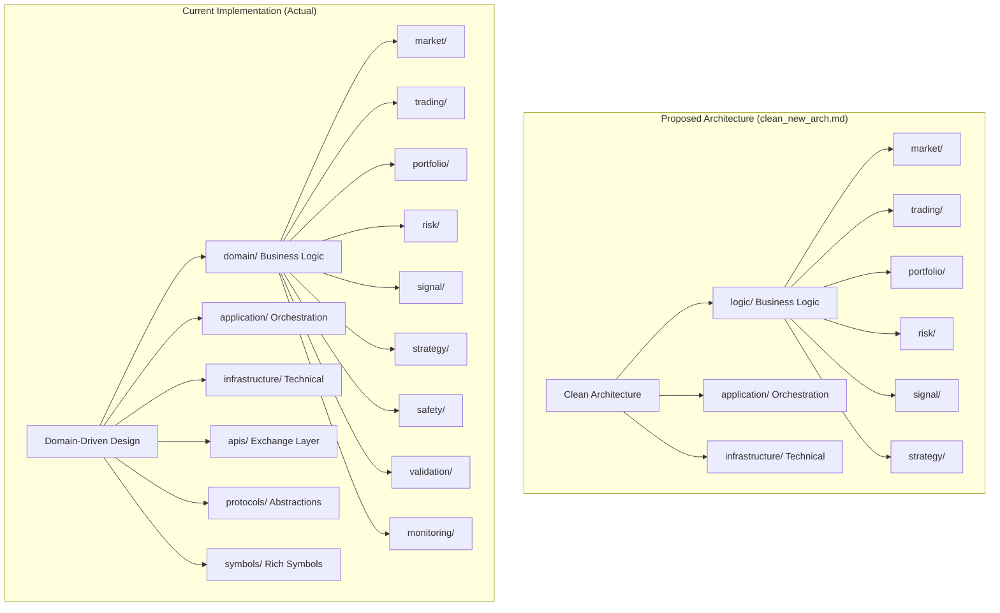

## Detailed Architecture Comparison

### 1. Core Architectural Patterns

| Aspect | Proposed Architecture | Current Implementation | Status |
|--------|----------------------|------------------------|--------|
| **Design Pattern** | Clean Architecture | Domain-Driven Design | ✅ **Improved** |
| **Configuration** | Configuration-First | Configuration-First with AppSettings | ✅ **Aligned** |
| **Type Safety** | Pydantic Models | Pydantic + Protocols + Generics | ✅ **Enhanced** |
| **Events** | Basic EventBus | Rich Event Models + EventBus | ✅ **Enhanced** |
| **Dependency Injection** | Simple DI | Advanced DI with Service Registry | ✅ **Enhanced** |

### 2. Module Organization

#### Proposed Structure (clean_new_arch.md)
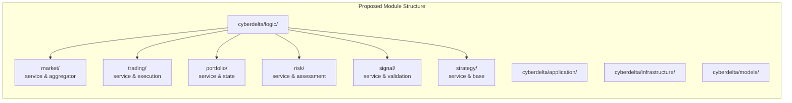

#### Current Implementation (Actual)
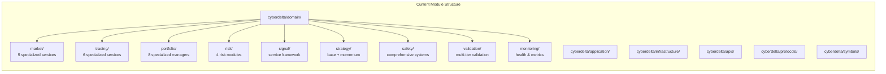

**Analysis**: Current implementation is significantly more sophisticated with specialized services and comprehensive domain coverage.

### 3. Service Architecture Comparison

#### Proposed Services
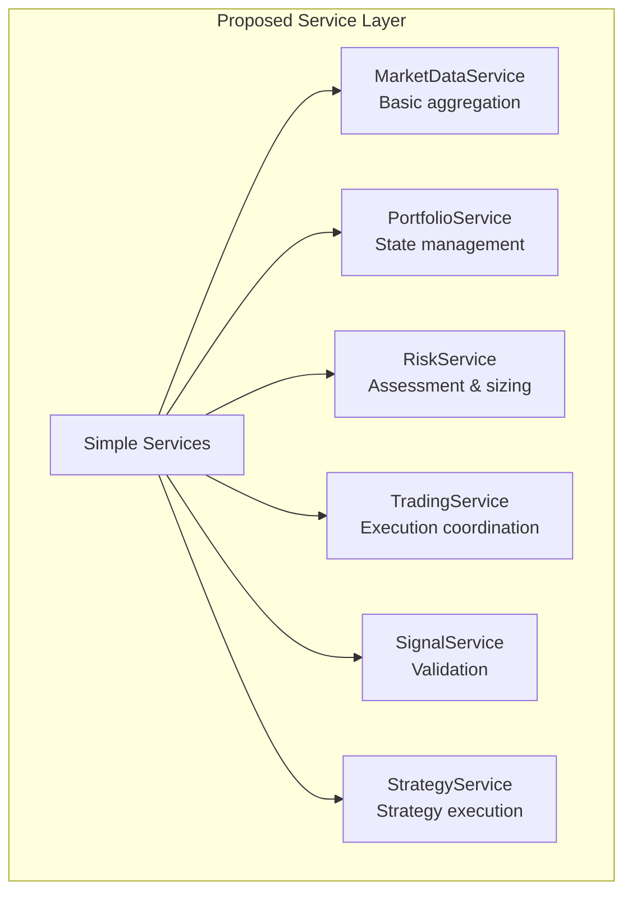

#### Current Services
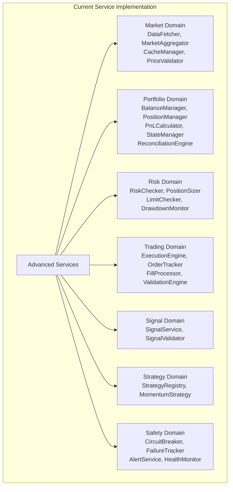

**Analysis**: Current implementation has evolved into specialized domain services with advanced features not anticipated in the proposal.

### 4. Data Flow Architecture

#### Proposed Data Flow
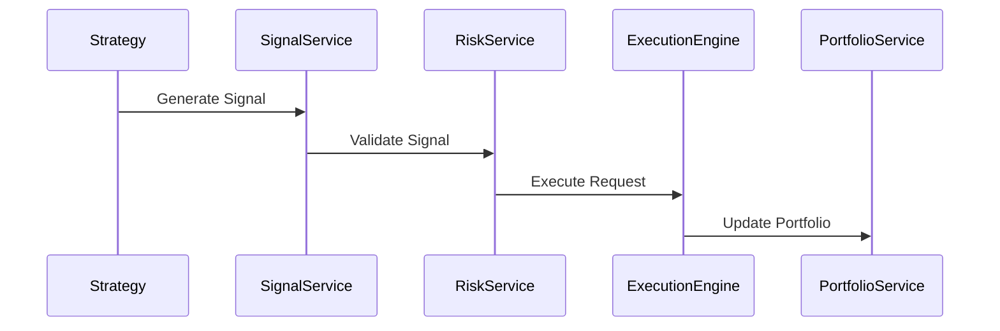

#### Current Data Flow
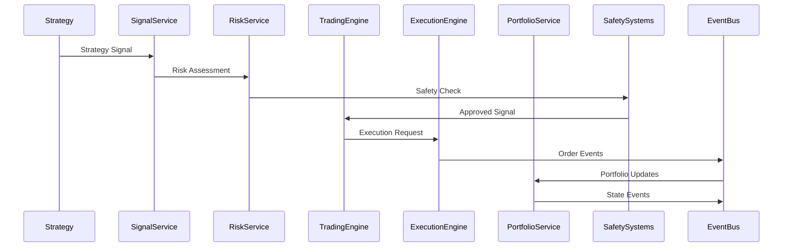

**Analysis**: Current implementation has a more sophisticated event-driven flow with safety systems integration.

### 5. Configuration Management

Both architectures are **fully aligned** on configuration-first principles:

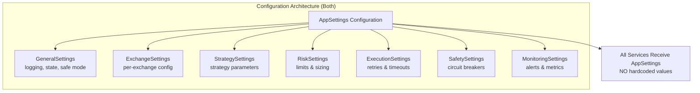

**Status**: ✅ **Fully Implemented** - Both propose and current implementation use the same configuration-first approach.

## Key Differences Analysis

### 1. API Integration Layer

| Component | Proposed | Current | Assessment |
|-----------|----------|---------|------------|
| **API Architecture** | Use existing APIs "as-is" | Advanced 6-layer architecture | **Current Significantly Better** |
| **Exchange Support** | Basic API calls | Service layers + mappers + protocols | **Current Significantly Better** |
| **WebSocket Support** | Not mentioned | Full WebSocket infrastructure | **Current Addition** |
| **Request/Response** | Basic handling | Builders, handlers, transformers | **Current Addition** |

#### Current API Architecture (Not in Proposal)
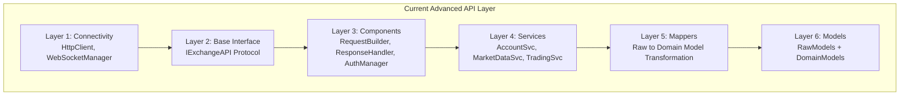

**Impact**: The current API layer is far more sophisticated than anticipated in the proposal.

### 2. Safety and Monitoring Systems

| System | Proposed | Current | Gap Analysis |
|--------|----------|---------|--------------|
| **Circuit Breakers** | Basic mention | Full implementation with 4 types | **Current Advanced** |
| **Health Monitoring** | Not mentioned | Comprehensive health checks | **Current Addition** |
| **Alert Systems** | Not mentioned | Multi-channel alerting | **Current Addition** |
| **Metrics Collection** | Not mentioned | Advanced metrics framework | **Current Addition** |

#### Current Safety Systems (Not in Proposal)
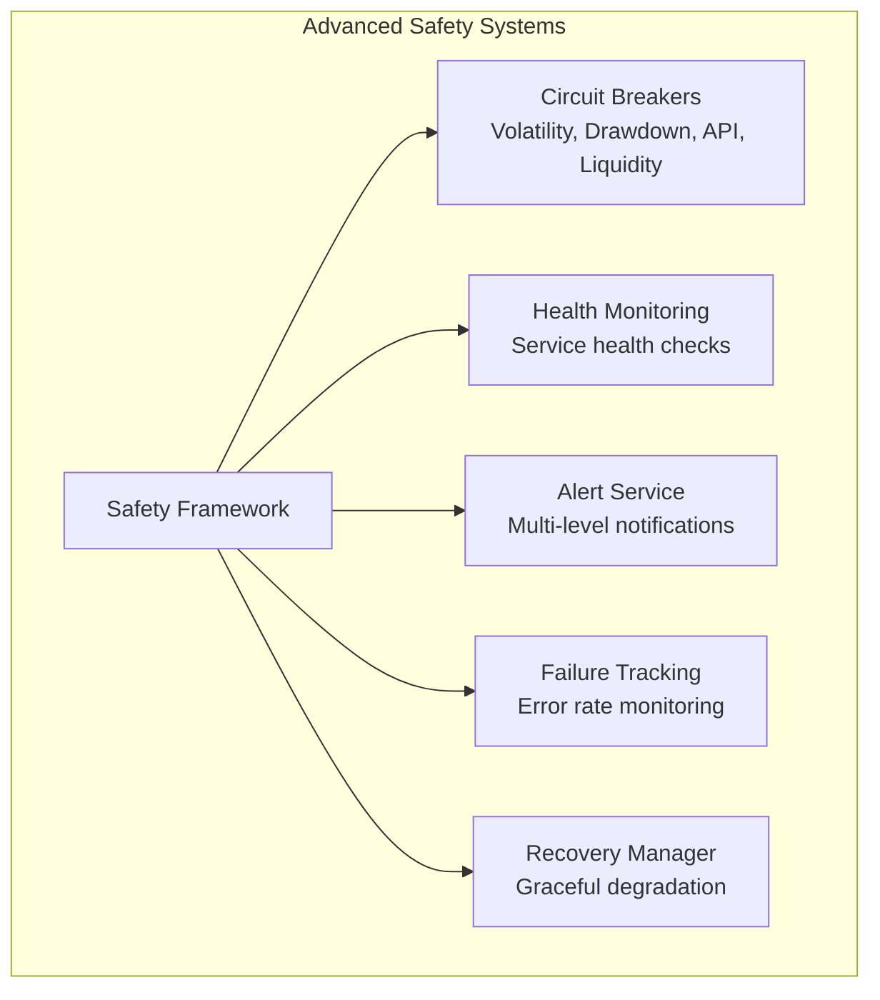

### 3. Domain Service Sophistication

#### Proposed Portfolio Service
```python
class PortfolioService:
    def __init__(self, config: AppSettings, ...):
        # Basic state management
        # Simple persistence
        # Basic methods
```

#### Current Portfolio Implementation
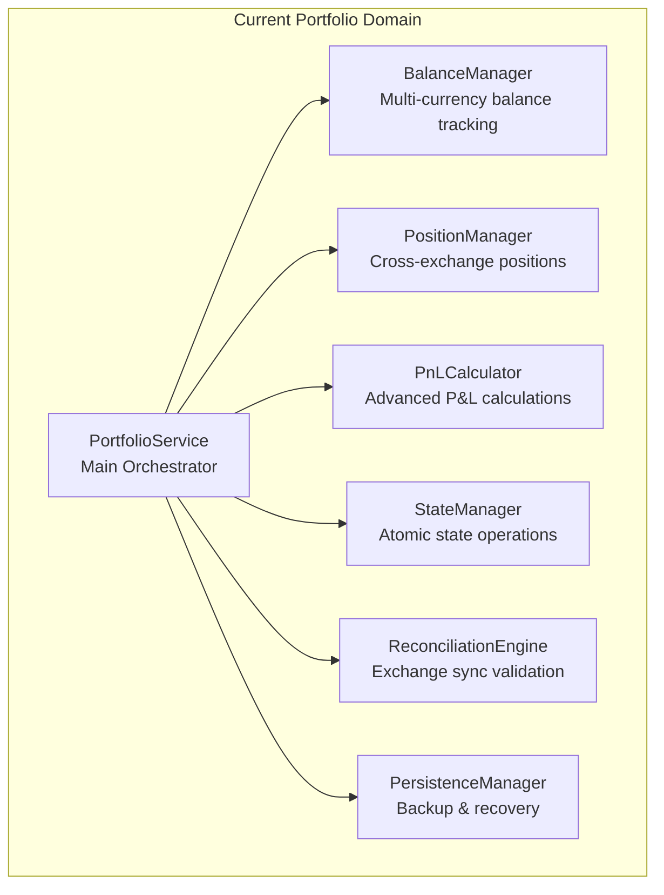

**Analysis**: Current implementation is far more sophisticated with specialized managers for different concerns.

## Implementation Gaps Analysis

### What's Proposed but Not Fully Implemented

1. **MarketSnapshot Unified Interface**:
   - **Proposed**: Type-safe `MarketSnapshot` aggregating all exchange data
   - **Current Status**: Market data exists but lacks proposed unified interface
   - **Impact**: Minor - current market aggregation works well

2. **ExecutionRequest Model Bridge**:
   - **Proposed**: Clear `ExecutionRequest` model between risk and execution
   - **Current Status**: Model exists but integration unclear
   - **Impact**: Low - current execution flow works

3. **BaseStrategy Abstract Interface**:
   - **Proposed**: Clean `BaseStrategy` with `analyze()` method
   - **Current Status**: Has strategy base but may differ from proposal
   - **Impact**: Low - current strategy framework functional

### What's Implemented but Not in Proposal

1. **Protocol-Based Design** ⭐:
   - **Current**: Extensive use of Protocols for abstraction
   - **Proposal Gap**: Not mentioned
   - **Value**: High - improves type safety and extensibility

2. **Advanced Logging Framework** ⭐:
   - **Current**: `cyberdelta/logging/` with structured helpers
   - **Proposal Gap**: Basic logging only
   - **Value**: High - production observability

3. **WebSocket Infrastructure** ⭐:
   - **Current**: Real-time data with typed processors
   - **Proposal Gap**: Not addressed
   - **Value**: Critical for trading performance

4. **Comprehensive Testing** ⭐:
   - **Current**: 428 test files with fixtures, builders, VCR
   - **Proposal Gap**: Basic testing only
   - **Value**: High - production readiness

5. **Symbol Metadata System** ⭐:
   - **Current**: Generic typed symbols with exchange metadata
   - **Proposal Gap**: Basic symbol objects
   - **Value**: High - supports multi-exchange complexity

## Architecture Evolution Assessment

### Production Readiness Comparison

| Aspect | Proposed | Current | Production Ready? |
|--------|----------|---------|------------------|
| **Error Handling** | Basic | Comprehensive with safety systems | ✅ **Current** |
| **Monitoring** | Basic | Advanced health checks + alerts | ✅ **Current** |
| **Scalability** | Good | Excellent with protocols | ✅ **Current** |
| **Maintainability** | Good | Excellent with DDD | ✅ **Current** |
| **Type Safety** | Good | Excellent with protocols | ✅ **Current** |
| **Testing** | Basic | Comprehensive | ✅ **Current** |

### Architectural Quality Metrics

```mermaid
radar
    title Architecture Quality Comparison
    "Type Safety" : [8, 10]
    "Configuration" : [9, 10]
    "Error Handling" : [6, 9]
    "Monitoring" : [3, 9]
    "API Integration" : [5, 10]
    "Testing" : [4, 9]
    "Documentation" : [7, 8]
    "Production Ready" : [6, 9]
```
*Note: First value = Proposed, Second value = Current*

## Strategic Recommendations

### 1. Architecture Direction ✅ **Keep Current**

**Recommendation**: Continue with current architecture as it has evolved positively beyond the proposal.

**Rationale**:
- More sophisticated domain boundaries
- Better separation of concerns
- Advanced safety and monitoring systems
- Production-ready infrastructure

### 2. Gap Resolution Strategy

#### Priority 1: Complete Missing Proposed Features
- [ ] Implement unified `MarketSnapshot` interface
- [ ] Clarify `ExecutionRequest` integration
- [ ] Align strategy base classes with proposal

#### Priority 2: Document Current Advanced Features
- [ ] Update architecture documentation to reflect current sophistication
- [ ] Document protocol-based design patterns
- [ ] Document advanced safety systems

#### Priority 3: Leverage Current Strengths
- [ ] Continue protocol-based abstractions
- [ ] Enhance monitoring and observability
- [ ] Expand multi-exchange capabilities

### 3. Implementation Plan

#### Phase 1: Quick Wins (1-2 weeks)
1. Implement `MarketSnapshot` unified interface
2. Document current architecture advantages
3. Complete strategy base class alignment

#### Phase 2: Enhancement (2-4 weeks)
1. Enhance `ExecutionRequest` integration
2. Add more comprehensive strategy examples
3. Improve monitoring dashboards

#### Phase 3: Advanced Features (4-8 weeks)
1. Add more exchange integrations using current framework
2. Implement advanced strategy types
3. Add backtesting framework using current infrastructure

## Conclusion

The CyberDeltaEngine has evolved into a **significantly more sophisticated and production-ready** trading system than originally envisioned in the clean architecture proposal. Key achievements include:

### ✅ **Exceeded Expectations**:
- Advanced multi-exchange API integration with 6-layer architecture
- Comprehensive safety systems with circuit breakers and monitoring
- Protocol-based design for extensibility
- Sophisticated domain services with specialized managers
- Production-ready error handling and observability

### ✅ **Maintained Core Principles**:
- Configuration-first approach with no hardcoded values
- Domain-driven design with clear service boundaries
- Event-driven architecture with rich event models
- Type safety throughout with Pydantic and protocols

### 📋 **Minor Gaps to Address**:
- Complete unified market data interface
- Clarify execution request integration
- Align some strategy interfaces

### 🎯 **Strategic Focus**:
The system is architecturally mature and ready for **strategy implementation focus** rather than architectural rework. The current implementation provides an excellent foundation for:
- Advanced trading strategies
- Multi-exchange arbitrage
- Real-time risk management
- Production trading operations

**Overall Assessment**: The current implementation represents a **natural and positive evolution** of the proposed architecture, demonstrating the benefits of iterative development guided by production requirements. The focus should now be on leveraging the sophisticated infrastructure to implement advanced trading logic rather than architectural changes.

<function_calls>
<invoke name="TodoWrite">
<parameter name="todos">[{"content": "Read clean_new_arch.md document", "status": "completed", "id": "1"}, {"content": "Read clean_new_arch_50_steps.md document", "status": "completed", "id": "2"}, {"content": "Research current architecture implementation", "status": "completed", "id": "3"}, {"content": "Compare proposed vs actual architecture", "status": "completed", "id": "4"}, {"content": "Create comprehensive comparison document with mermaid diagrams", "status": "completed", "id": "5"}]
