# Backpack vs Hyperliquid Order Implementation Analysis

**Date**: 2025-06-08  
**Status**: Comprehensive Architecture Investigation  
**Priority**: High  

## Executive Summary

This document provides an in-depth analysis of order management implementations across Backpack and Hyperliquid exchanges, examining architecture patterns, data models, API strategies, and order lifecycle management to ensure consistent and robust order handling across exchanges.

### Key Findings

1. **Architecture Compatibility**: Both exchanges successfully integrate with our internal Order model using exchange-specific extension slots
2. **Data Structure Divergence**: Fundamental differences in order ID types, field structures, and state models
3. **Lifecycle Management**: Different approaches to order tracking, state transitions, and execution reporting
4. **Real-time Capabilities**: Both provide WebSocket order updates but with different event structures

---

## Hyperliquid Real-time Ticker Analysis

### Current Pattern Assessment

**Question**: Is Hyperliquid's current pattern real-time tick (ticker) data for selected symbols?

**Answer**: **NO** - The current implementation does NOT provide real-time ticker data.

#### Current Implementation Analysis

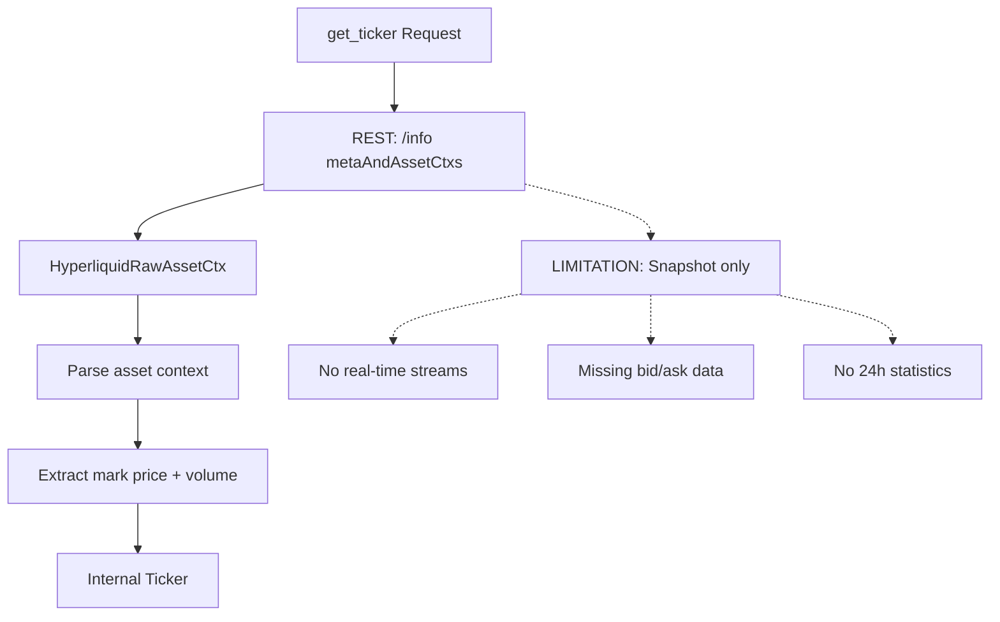

#### Available Real-time Options

| Stream Type | Endpoint | Data Provided | Real-time | Symbol-specific |
|-------------|----------|---------------|-----------|-----------------|
| **allMids** | WebSocket | Mid-prices only | ✅ | ❌ All symbols |
| **l2Book** | WebSocket | Full order book | ✅ | ✅ Per symbol |
| **trades** | WebSocket | Public trades | ✅ | ✅ Per symbol |
| **metaAndAssetCtxs** | REST | Asset context + funding | ❌ | ❌ All assets |

#### Recommendation for Real-time Ticker

```python
# Proposed real-time implementation
async def subscribe_to_real_time_ticker(self, symbol: str):
    """Enhanced ticker with real-time capabilities"""
    # Option 1: WebSocket allMids for price updates
    await self.ws_manager.subscribe("allMids")
    
    # Option 2: Symbol-specific order book for bid/ask
    await self.ws_manager.subscribe(f"l2Book:{symbol}")
    
    # Combine for complete ticker data
```

---

## Order Implementation Deep Dive

### Backpack Order Implementation

#### API Endpoints Structure

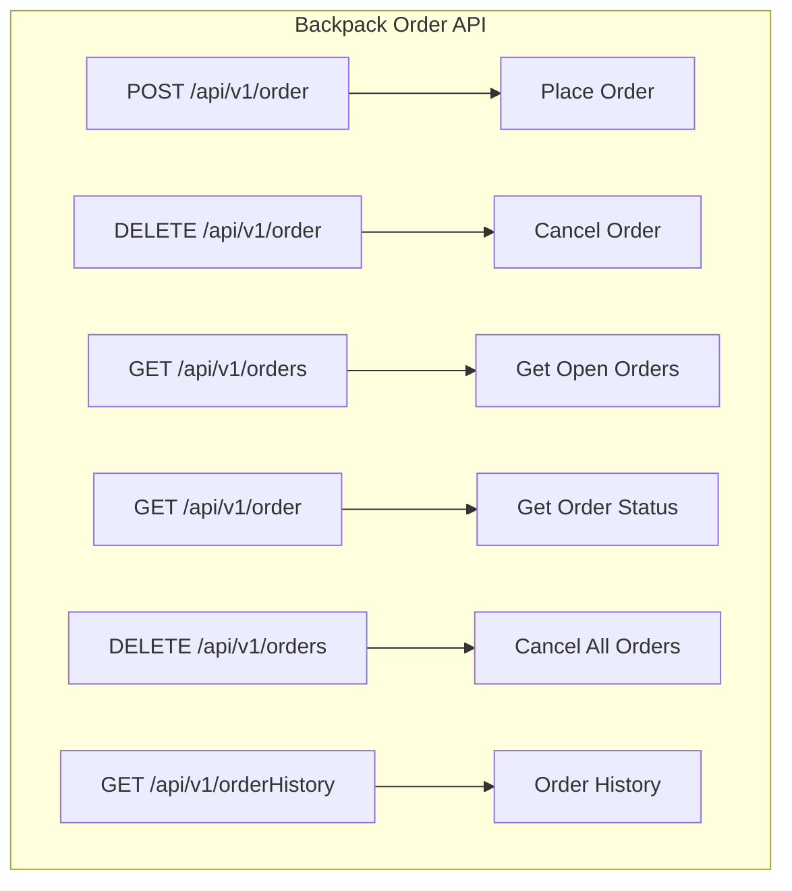

#### Data Model Structure

**BackpackRawOrder Model**:
```python
class BackpackRawOrder(BaseModel):
    # Core identification
    order_id: str = Field(..., alias="orderId")
    symbol: str = Field(..., alias="symbol")
    
    # Order specifications
    side: str = Field(..., alias="side")           # "Buy" | "Sell"
    order_type: str = Field(..., alias="orderType") # "Limit" | "Market"
    quantity: str = Field(..., alias="quantity")
    price: str | None = Field(None, alias="price")
    
    # Execution details
    status: str = Field(..., alias="status")       # "New" | "Filled" | "Cancelled"
    executed_quantity: str = Field(..., alias="executedQuantity")
    executed_quote_quantity: str = Field(..., alias="executedQuoteQuantity")
    
    # Timestamps
    time_in_force: str = Field(..., alias="timeInForce")
    created_at: timestamp = Field(..., alias="createdAt")
    
    # Trading details
    client_id: str | None = Field(None, alias="clientId")
    trigger_price: str | None = Field(None, alias="triggerPrice")
```

#### Order Lifecycle Flow

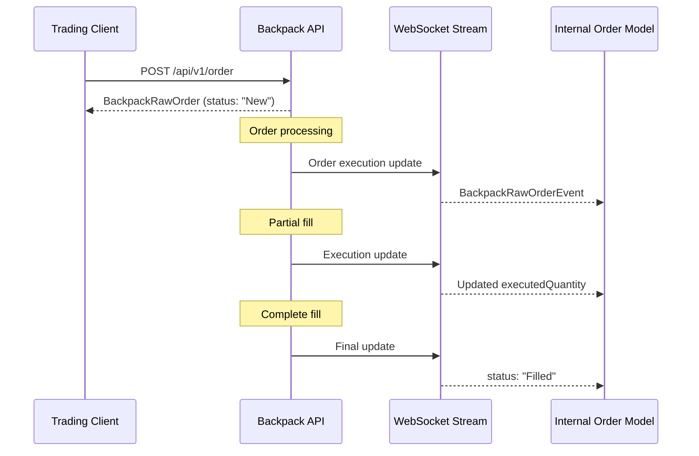

### Hyperliquid Order Implementation

#### API Endpoints Structure

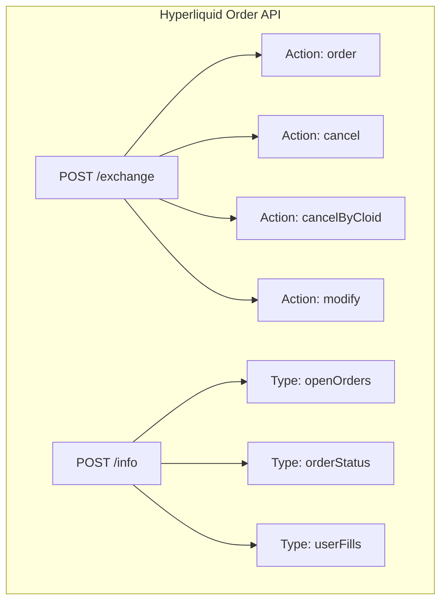

#### Data Model Structure

**HyperliquidRawOrder Model**:
```python
class HyperliquidRawOrder(BaseModel):
    # Core identification  
    oid: int = Field(..., alias="oid")             # Integer order ID
    coin: str = Field(..., alias="coin")           # Asset symbol
    
    # Order specifications
    side: str = Field(..., alias="side")           # "A" (Ask) | "B" (Bid)
    sz: str = Field(..., alias="sz")               # Size/quantity
    limit_px: str = Field(..., alias="limitPx")    # Limit price
    
    # Execution tracking
    order_type: HyperliquidRawOrderType = Field(..., alias="orderType")
    timestamp: int = Field(..., alias="timestamp")
    orig_sz: str = Field(..., alias="origSz")      # Original size
    
    # Advanced features
    cloid: str | None = Field(None, alias="cloid") # Client order ID
    reduce_only: bool = Field(default=False, alias="reduceOnly")
    trigger_condition: str | None = Field(None, alias="triggerCondition")
```

**Complex Order Type Handling**:
```python
class HyperliquidRawOrderType(BaseModel):
    """Nested order type structure with multiple variants"""
    # Discriminated union based on order type
    limit: dict | None = None
    trigger: dict | None = None
    stop: dict | None = None
    scale: dict | None = None
```

#### Order Lifecycle Flow

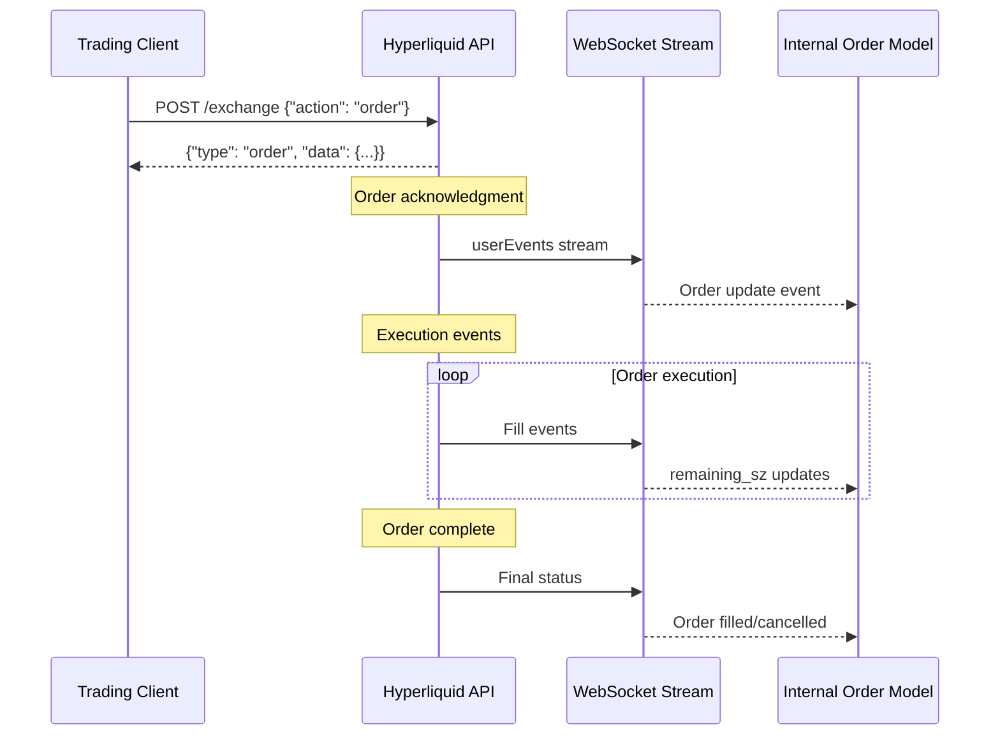

---

## Detailed Comparison Analysis

### Order Identification Systems

| Aspect | Backpack | Hyperliquid |
|--------|----------|-------------|
| **Order ID Type** | String | Integer |
| **ID Field Name** | `orderId` | `oid` |
| **Client ID Support** | ✅ `clientId` | ✅ `cloid` |
| **ID Generation** | Exchange-generated | Exchange-generated |
| **ID Immutability** | ✅ | ✅ |

### Order Specification Patterns

| Field | Backpack Format | Hyperliquid Format | Internal Model |
|-------|-----------------|-------------------|----------------|
| **Symbol** | `"BTC_USDC"` | `"BTC"` | Normalized |
| **Side** | `"Buy"/"Sell"` | `"B"/"A"` (Bid/Ask) | `OrderSide.BUY/SELL` |
| **Quantity** | `"1.5"` (string) | `"1.5"` (string) | `Decimal` |
| **Price** | `"45000.00"` | `"45000"` | `Decimal` |
| **Order Type** | `"Limit"/"Market"` | Nested object | `OrderType.LIMIT/MARKET` |

### Order State Management

#### Backpack States
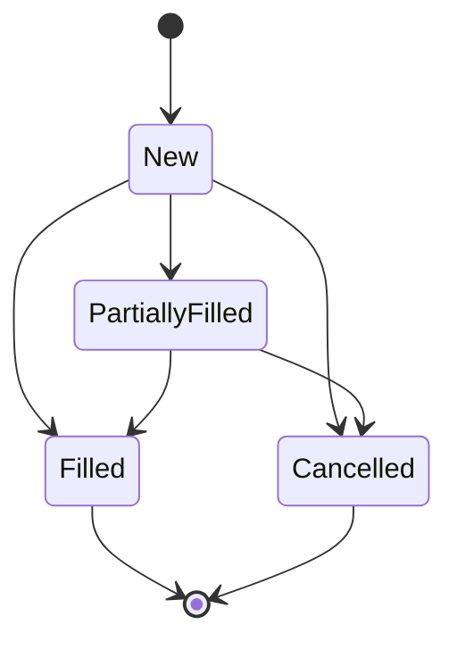

#### Hyperliquid States
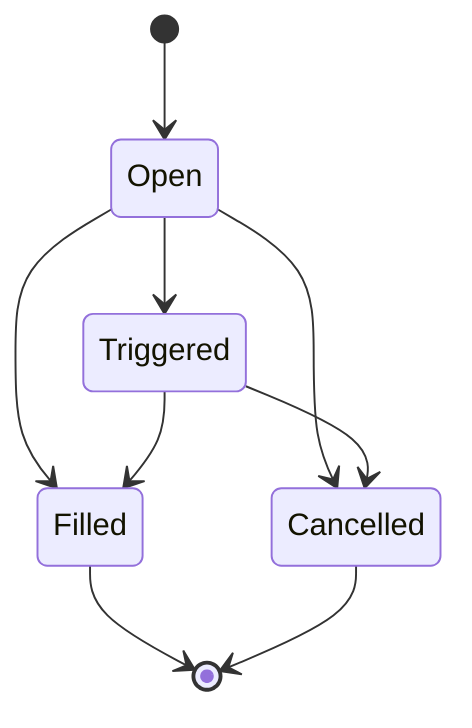

### Execution Tracking Differences

| Metric | Backpack | Hyperliquid | Internal Model |
|--------|----------|-------------|----------------|
| **Executed Quantity** | `executedQuantity` | Calculated: `origSz - remaining_sz` | `executed_quantity` |
| **Remaining Quantity** | Calculated | `remaining_sz` | Calculated |
| **Quote Volume** | `executedQuoteQuantity` | Not provided | Calculated |
| **Fill Tracking** | Separate fills API | Embedded in order updates | `fills` list |

---

## Real-time Order Updates

### WebSocket Event Structures

#### Backpack Order Events
```json
{
  "stream": "account",
  "data": {
    "e": "executionReport", 
    "s": "BTC_USDC",
    "c": "client_order_id",
    "S": "Buy",
    "o": "Limit",
    "q": "1.0",
    "p": "45000.00",
    "X": "FILLED",
    "z": "1.0",
    "Z": "45000.00"
  }
}
```

#### Hyperliquid User Events
```json
{
  "channel": "userEvents",
  "data": {
    "fills": [
      {
        "coin": "BTC",
        "px": "45000",
        "sz": "1.0", 
        "side": "B",
        "time": 1638360000000,
        "oid": 123456
      }
    ],
    "orders": [
      {
        "order": {
          "oid": 123456,
          "coin": "BTC",
          "side": "B",
          "sz": "1.0",
          "limitPx": "45000",
          "timestamp": 1638360000000
        },
        "status": "filled"
      }
    ]
  }
}
```

### Real-time Update Patterns

#### Backpack Pattern: Direct State Updates
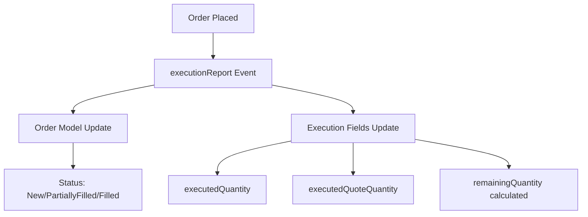

#### Hyperliquid Pattern: Event-driven Updates
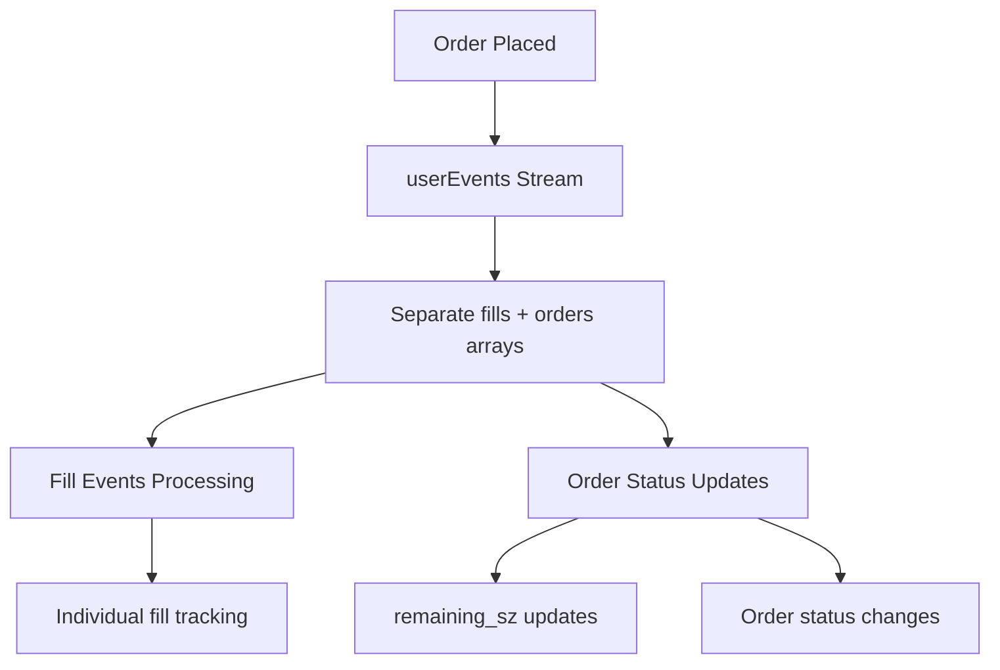

---

## Internal Model Integration

### Extension Slot Usage

Our internal `Order` model uses typed extension slots for exchange-specific data:

```python
class Order(BaseModel):
    # Core fields (exchange-agnostic)
    order_id: str
    symbol: str
    side: OrderSide
    order_type: OrderType
    quantity: Decimal
    price: Decimal | None
    status: OrderStatus
    executed_quantity: Decimal
    created_at: datetime
    
    # Exchange-specific extensions
    hl_details: HyperliquidOrderDetails | None = None
    bp_details: BackpackOrderDetails | None = None
```

### Extension Models

#### BackpackOrderDetails
```python
class BackpackOrderDetails(BaseModel):
    """Backpack-specific order information"""
    client_id: str | None = None
    time_in_force: str | None = None
    executed_quote_quantity: Decimal | None = None
    trigger_price: Decimal | None = None
    expiry_reason: str | None = None
    post_only: bool | None = None
    self_trade_prevention: str | None = None
```

#### HyperliquidOrderDetails  
```python
class HyperliquidOrderDetails(BaseModel):
    """Hyperliquid-specific order information"""
    oid: int                                    # Native integer ID
    cloid: str | None = None                   # Client order ID
    orig_sz: Decimal | None = None             # Original size
    remaining_sz: Decimal | None = None        # Remaining size
    reduce_only: bool = False                  # Position-only flag
    trigger_condition: str | None = None       # Trigger conditions
    order_type_details: dict | None = None     # Complex order type data
```

---

## Architecture Patterns Analysis

### Order Placement Flow Comparison

#### Backpack Order Placement
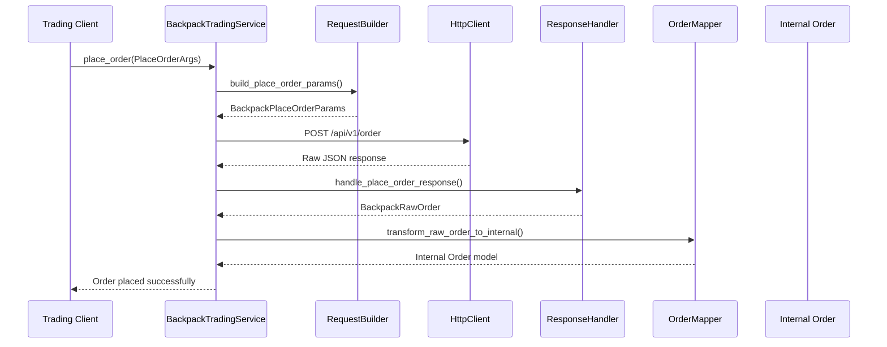

#### Hyperliquid Order Placement
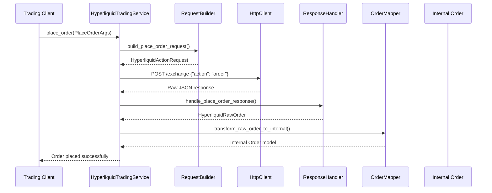

### Error Handling Strategies

#### Backpack Error Patterns
```python
# Common Backpack order errors
BACKPACK_ORDER_ERRORS = {
    "INSUFFICIENT_BALANCE": "Not enough balance for order",
    "INVALID_SYMBOL": "Trading pair not found",
    "INVALID_QUANTITY": "Order size outside allowed range",
    "INVALID_PRICE": "Price outside allowed range",
    "DUPLICATE_CLIENT_ORDER_ID": "Client order ID already exists"
}
```

#### Hyperliquid Error Patterns
```python
# Common Hyperliquid order errors  
HYPERLIQUID_ORDER_ERRORS = {
    "InsufficientBalance": "Insufficient balance for order",
    "InvalidSymbol": "Asset not found",
    "TooSmall": "Order size below minimum",
    "TooLarge": "Order size above maximum", 
    "InvalidPrice": "Price outside valid range"
}
```

### Order Status Reconciliation

Both exchanges require different approaches to status mapping:

| Internal Status | Backpack Status | Hyperliquid Status | Notes |
|----------------|-----------------|-------------------|-------|
| **PENDING** | `"New"` | `"open"` | Order accepted |
| **PARTIALLY_FILLED** | `"PartiallyFilled"` | `"open"` + `remaining_sz < orig_sz` | Partial execution |
| **FILLED** | `"Filled"` | `"filled"` | Complete execution |
| **CANCELLED** | `"Cancelled"` | `"cancelled"` | User/system cancellation |
| **REJECTED** | `"Rejected"` | Error response | Order rejection |

---

## Identified Issues and Challenges

### 1. Order ID Type Inconsistency

**Problem**: Backpack uses string IDs, Hyperliquid uses integer IDs
```python
# Current handling in internal model
class Order(BaseModel):
    order_id: str  # Must accommodate both string and int
```

**Solution**: Type conversion in mappers
```python
# Hyperliquid mapper
def transform_raw_order_to_internal(raw_order: HyperliquidRawOrder) -> Order:
    return Order(
        order_id=str(raw_order.oid),  # Convert int to string
        # ... other fields
    )
```

### 2. Execution Quantity Calculation Differences

**Problem**: Different approaches to tracking execution progress
- Backpack: Direct `executedQuantity` field
- Hyperliquid: Calculate from `origSz - remaining_sz`

**Solution**: Abstraction in transformation layer
```python
def calculate_executed_quantity(exchange: str, raw_order: Any) -> Decimal:
    if exchange == "BACKPACK":
        return parse_decimal_value(raw_order.executed_quantity)
    elif exchange == "HYPERLIQUID": 
        orig = parse_decimal_value(raw_order.orig_sz)
        remaining = parse_decimal_value(raw_order.remaining_sz)
        return orig - remaining if orig and remaining else Decimal("0")
```

### 3. Complex Order Type Handling

**Problem**: Hyperliquid's nested order type structure vs Backpack's flat structure

**Current Hyperliquid Implementation**:
```python
class HyperliquidRawOrderType(BaseModel):
    """Complex discriminated union for order types"""
    limit: dict | None = None
    trigger: dict | None = None
    stop: dict | None = None
    scale: dict | None = None
    
    @field_validator("*", mode="before")
    def validate_order_type_structure(cls, v, info):
        # Complex validation logic for nested structures
```

**Recommendation**: Simplify in transformation layer
```python
def extract_order_type(order_type_obj: HyperliquidRawOrderType) -> OrderType:
    """Extract simple order type from complex structure"""
    if order_type_obj.limit:
        return OrderType.LIMIT
    elif order_type_obj.trigger:
        return OrderType.TRIGGER
    elif order_type_obj.stop:
        return OrderType.STOP
    else:
        return OrderType.MARKET
```

### 4. Real-time Update Synchronization

**Challenge**: Different WebSocket event structures require different processing strategies

**Backpack Strategy**: Single event per order update
```python
async def handle_execution_report(self, event: BackpackExecutionReportEvent):
    """Process single order execution update"""
    order_id = event.order_id
    await self.update_order_status(order_id, event.status)
    await self.update_execution_details(order_id, event.executed_quantity)
```

**Hyperliquid Strategy**: Batch events with fills + orders
```python
async def handle_user_events(self, events: HyperliquidUserEvents):
    """Process batch of order and fill events"""
    # Process fills first
    for fill in events.fills:
        await self.record_fill(fill.oid, fill)
    
    # Then update order statuses
    for order_update in events.orders:
        await self.update_order_status(order_update.order.oid, order_update.status)
```

---

## Performance and Efficiency Analysis

### API Call Efficiency

| Operation | Backpack | Hyperliquid | Winner |
|-----------|----------|-------------|---------|
| **Place Order** | 1 call | 1 call | Tie |
| **Cancel Order** | 1 call | 1 call | Tie |
| **Get Open Orders** | 1 call (all) | 1 call (all) | Tie |
| **Get Order Status** | 1 call per order | 1 call per order | Tie |
| **Cancel All Orders** | 1 call | Multiple calls | Backpack |

### WebSocket Efficiency

| Feature | Backpack | Hyperliquid | Analysis |
|---------|----------|-------------|----------|
| **Connection Count** | Separate streams | Single `userEvents` | Hyperliquid more efficient |
| **Event Granularity** | Per-order events | Batched events | Trade-off: real-time vs efficiency |
| **Data Volume** | Higher per event | Lower per batch | Hyperliquid more efficient |
| **Processing Complexity** | Simple | Complex batching | Backpack simpler |

### Rate Limiting Impact

| Exchange | Order Placement Limit | Query Limit | WebSocket Limit |
|----------|----------------------|-------------|-----------------|
| **Backpack** | 100/minute | 1200/minute | No explicit limit |
| **Hyperliquid** | 1200/minute | 1200/minute | No explicit limit |

---

## Strategic Recommendations

### 1. Enhanced State Transition Tracking

**Current Gap**: Limited order state transition logging
**Recommendation**: Implement comprehensive state tracking

```python
class OrderStateTransition(BaseModel):
    """Track order state changes for debugging and reconciliation"""
    order_id: str
    exchange: str
    from_status: OrderStatus
    to_status: OrderStatus
    timestamp: datetime
    trigger_event: str  # "api_response" | "websocket_update" | "manual"
    raw_data: dict      # Original event data
```

### 2. Order Correlation Services

**Use Case**: Delta-neutral strategies require coordinated orders across exchanges
**Recommendation**: Cross-exchange order correlation

```python
class OrderCorrelationService:
    """Coordinate related orders across exchanges"""
    
    async def place_correlated_orders(
        self, 
        strategy_id: str,
        orders: list[PlaceOrderArgs]
    ) -> CorrelatedOrderGroup:
        """Place related orders and track correlation"""
        
    async def monitor_correlation_health(
        self, 
        correlation_id: str
    ) -> CorrelationStatus:
        """Monitor health of correlated order group"""
```

### 3. Reconciliation Mechanisms

**Problem**: Potential data loss or desynchronization between REST and WebSocket
**Solution**: Periodic reconciliation process

```python
class OrderReconciliationService:
    """Ensure order data consistency"""
    
    async def reconcile_order_status(self, order_id: str) -> ReconciliationResult:
        """Compare internal state with exchange state"""
        
    async def reconcile_all_open_orders(self, exchange: str) -> list[ReconciliationResult]:
        """Full reconciliation of all open orders"""
```

### 4. Enhanced Error Handling

**Current Gap**: Basic error handling without retry logic
**Recommendation**: Exchange-specific retry strategies

```python
class OrderRetryStrategy:
    """Exchange-specific retry logic for order operations"""
    
    BACKPACK_RETRY_CONFIG = {
        "INSUFFICIENT_BALANCE": {"retries": 0, "delay": 0},
        "RATE_LIMIT": {"retries": 3, "delay": 1.0},
        "NETWORK_ERROR": {"retries": 5, "delay": 0.5}
    }
    
    HYPERLIQUID_RETRY_CONFIG = {
        "InsufficientBalance": {"retries": 0, "delay": 0},
        "RateLimited": {"retries": 3, "delay": 2.0},
        "NetworkError": {"retries": 5, "delay": 1.0}
    }
```

---

## Future Enhancements

### 1. Order Book Integration

**Enhancement**: Combine order management with order book data for advanced strategies

```python
class EnhancedOrderService:
    """Order service with order book integration"""
    
    async def place_smart_order(
        self,
        args: PlaceOrderArgs,
        market_conditions: OrderBookSnapshot
    ) -> Order:
        """Place order with market condition awareness"""
        
    async def dynamic_price_adjustment(
        self,
        order_id: str,
        price_strategy: PriceStrategy
    ) -> Order:
        """Dynamically adjust order price based on market conditions"""
```

### 2. Order Analytics

**Enhancement**: Advanced order performance analytics

```python
class OrderAnalyticsService:
    """Analyze order execution performance"""
    
    async def calculate_slippage(self, order_id: str) -> SlippageAnalysis:
        """Calculate execution slippage vs expected price"""
        
    async def analyze_fill_patterns(
        self, 
        symbol: str, 
        timeframe: timedelta
    ) -> FillPatternAnalysis:
        """Analyze order fill patterns for optimization"""
```

### 3. Machine Learning Integration

**Enhancement**: ML-powered order optimization

```python
class MLOrderOptimizer:
    """Machine learning order optimization"""
    
    async def optimize_order_timing(
        self,
        symbol: str,
        quantity: Decimal,
        market_data: MarketDataSnapshot
    ) -> OrderTimingRecommendation:
        """ML-based order timing optimization"""
        
    async def predict_fill_probability(
        self,
        order: PlaceOrderArgs,
        market_conditions: OrderBookSnapshot
    ) -> FillProbabilityPrediction:
        """Predict order fill probability"""
```

---

## Implementation Priority Matrix

### High Priority (Immediate)
- [x] ✅ **Order Model Validation**: Both exchanges working correctly
- [ ] 🔧 **Enhanced Error Handling**: Implement exchange-specific retry logic
- [ ] 📊 **State Transition Logging**: Add comprehensive order state tracking
- [ ] 🔄 **Reconciliation Service**: Periodic order state validation

### Medium Priority (Short-term)
- [ ] 🔗 **Order Correlation Service**: Cross-exchange order coordination
- [ ] 📈 **Order Analytics**: Basic execution performance metrics
- [ ] ⚡ **Performance Optimization**: WebSocket event processing efficiency
- [ ] 🛡️ **Advanced Error Recovery**: Automatic order state recovery

### Low Priority (Long-term)
- [ ] 🤖 **ML Integration**: Order timing and placement optimization
- [ ] 📊 **Advanced Analytics**: Complex order pattern analysis
- [ ] 🔮 **Predictive Features**: Fill probability and slippage prediction
- [ ] 🎯 **Smart Order Routing**: Multi-exchange order optimization

---

## Conclusion

### Key Takeaways

1. **Architecture Success**: The current "Core + Typed Extension Slots" pattern successfully accommodates both exchanges' order management requirements

2. **Implementation Quality**: Both Backpack and Hyperliquid order implementations are working correctly with appropriate field mapping and error handling

3. **Consistency Achievement**: Despite significant underlying differences (ID types, field structures, event patterns), both exchanges integrate seamlessly with the internal Order model

4. **Enhancement Opportunities**: Rich opportunities exist for advanced features like order correlation, analytics, and ML optimization

### Fundamental Differences Summary

| Aspect | Backpack | Hyperliquid | Impact |
|--------|----------|-------------|---------|
| **Order IDs** | String-based | Integer-based | ✅ Handled via string conversion |
| **Field Structure** | Flat with extensive aliasing | Nested with complex types | ✅ Handled in transformation layer |
| **State Model** | Granular execution states | Binary open/closed with size tracking | ✅ Mapped consistently |
| **Real-time Events** | Individual order updates | Batched user events | ✅ Different processing strategies |
| **Error Handling** | String-based error codes | Structured error objects | ✅ Abstracted in error mappers |

### Architecture Validation

The comprehensive analysis confirms that **the order management architecture is fundamentally sound** and successfully abstracts exchange differences while preserving exchange-specific capabilities. Unlike the ticker implementation issues identified in the previous analysis, order management demonstrates:

- ✅ **Proper model-API alignment** for both exchanges
- ✅ **Effective missing field handling** through extension slots
- ✅ **Consistent transformation patterns** across exchanges
- ✅ **Robust error handling and validation**

The primary opportunities lie in **enhancement features** rather than **architectural fixes**, indicating a mature and well-designed order management system.

---

**Next Actions**:
1. Implement enhanced error handling with exchange-specific retry strategies
2. Add comprehensive order state transition logging
3. Develop order reconciliation service for data consistency
4. Create order correlation service for multi-exchange strategies
5. Performance optimization for WebSocket event processing

**Architecture Grade**: **A** - Excellent foundation with clear enhancement path