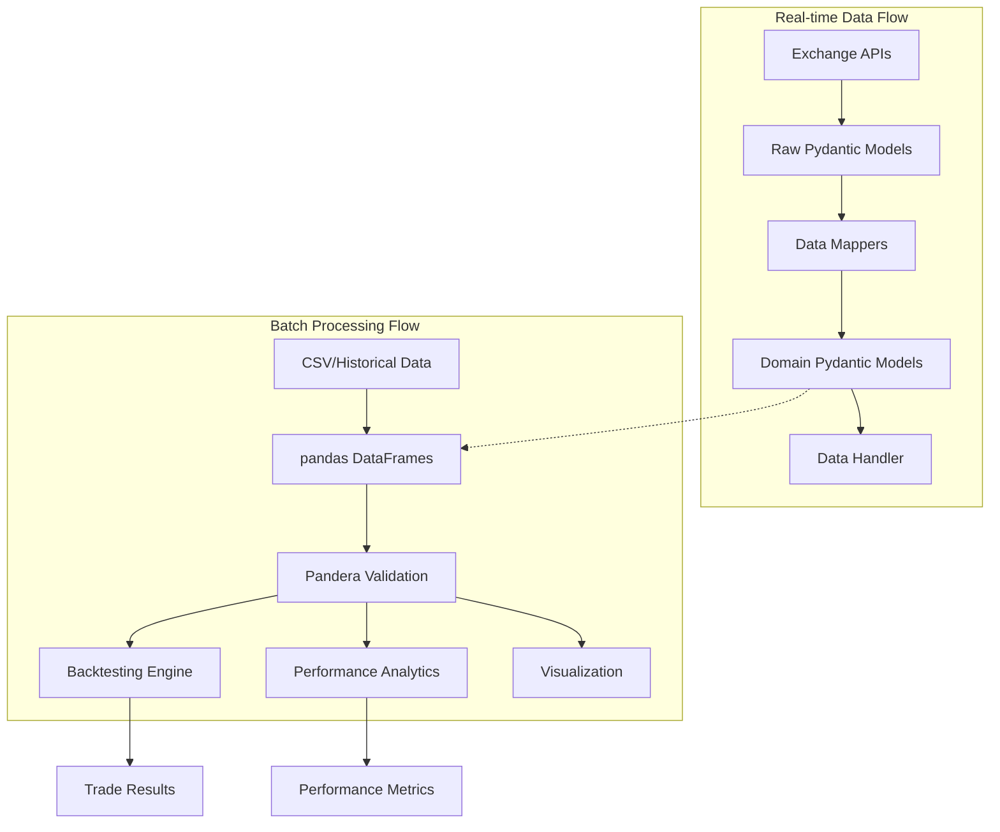
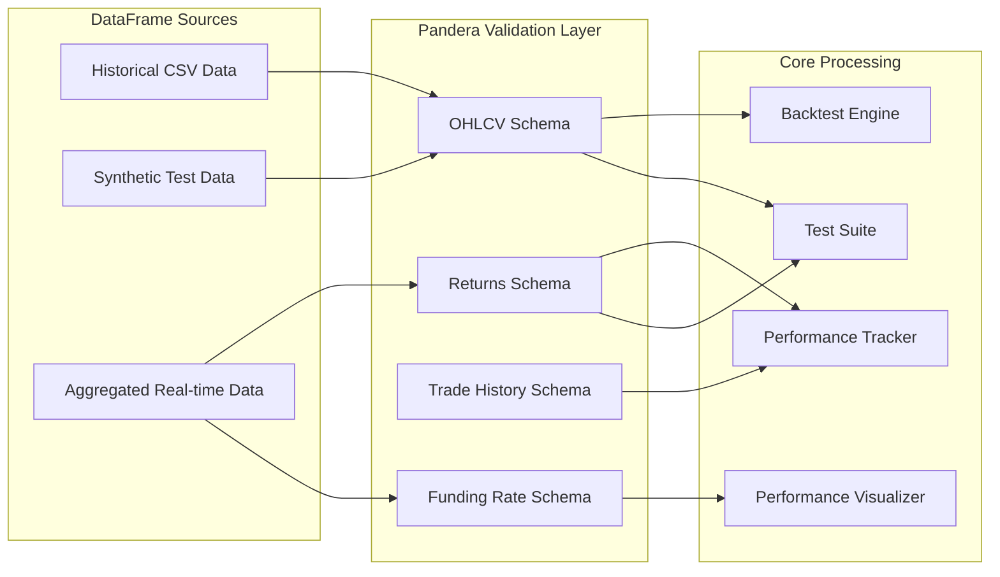
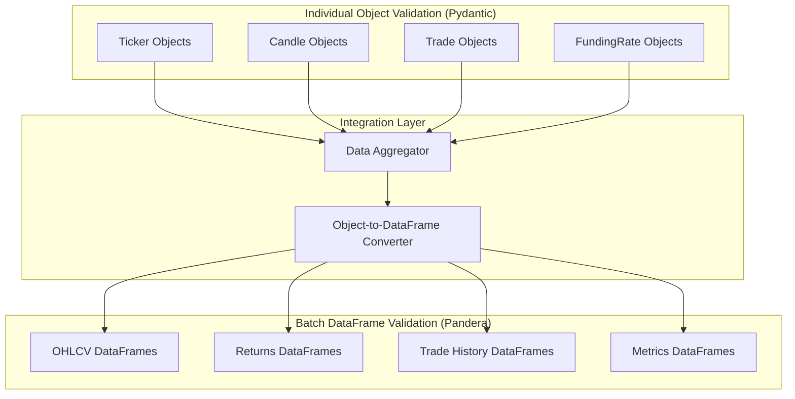

# Pandera Integration Plan for CyberDeltaEngine

## 1. **Rationale & Objectives**

- **Why Pandera?**
  While Pydantic provides comprehensive validation for individual market data objects (tickers, candles, funding rates) in the real-time data flow, Pandera is purpose-built for validating pandas DataFrames and Series used in batch processing, backtesting, analytics, and historical data workflows.
- **Strategic Complement to Existing Validation:**
  - Pydantic handles real-time individual object validation at API boundaries
  - Pandera will handle batch DataFrame validation for analytics and backtesting
  - Together they provide comprehensive data validation across all workflows
- **Objectives:**
  - Prevent propagation of malformed time series data in backtesting and analytics
  - Ensure data integrity for cross-exchange arbitrage calculations
  - Validate historical data imports and synthetic test data generation
  - Enable robust batch processing with fail-fast error detection

---

## 2. **Current State Analysis & Targeted Scope**

### **Existing DataFrame Usage Patterns:**
- **Primary Usage:** Backtesting (`cyberdelta/backtesting/`), performance tracking (`cyberdelta/monitoring/`), visualization (`cyberdelta/visualization/`), and testing (`cyberdelta/testing/`)
- **Limited Exchange Integration:** Real-time data flow uses Pydantic models, not DataFrames
- **Key Insight:** Pandera should complement, not replace, the existing Pydantic validation strategy

### **Where to Apply Pandera:**
- **Backtesting Engine:** Validate OHLCV data, trade history, and equity curves
- **Performance Analytics:** Validate aggregated time series for performance metrics calculation
- **Historical Data Processing:** Validate imported data from exchanges or files
- **Testing Data Generation:** Validate synthetic market data used in unit and integration tests
- **Cross-Exchange Analysis:** Validate arbitrage opportunity DataFrames and funding rate comparisons

---

## 3. **Implementation Steps**

### **Step 1: Current State Inventory (Completed)**

Based on codebase analysis, DataFrames are primarily used in:
- **Backtesting Module** (`cyberdelta/backtesting/backtesting.py`): Processes OHLCV data with MultiIndex columns
- **Performance Tracking** (`cyberdelta/monitoring/performance_tracker.py`): Aggregates time series data
- **Visualization** (`cyberdelta/visualization/performance_visualizer.py`): Renders performance charts and analytics
- **Testing** (`cyberdelta/testing/data_generation.py`): Generates synthetic market data

### **Step 2: Define Pandera Schemas Based on Actual Usage**

Priority schemas aligned with current codebase patterns:

#### **A. OHLCV Schema (MultiIndex Support)**
For backtesting data with multiple symbols:

```python
import pandera as pa
from pandera import Column, DataFrameSchema, Check, MultiIndex

# MultiIndex schema for backtesting data
ohlcv_schema = DataFrameSchema(
    {
        ("*", "open"): Column(pa.Float64, Check.gt(0), nullable=False),
        ("*", "high"): Column(pa.Float64, Check.gt(0), nullable=False),
        ("*", "low"): Column(pa.Float64, Check.gt(0), nullable=False),
        ("*", "close"): Column(pa.Float64, Check.gt(0), nullable=False),
        ("*", "volume"): Column(pa.Float64, Check.ge(0), nullable=False),
        ("*", "funding_rate"): Column(pa.Float64, nullable=True),  # Optional
    },
    index=pa.DatetimeIndex(name="timestamp"),
    coerce=True,
    strict=False,  # Allow additional columns
)

# Business logic validation
@pa.check("*", element_wise=False)
def ohlc_validation(series_dict):
    """Validate OHLC relationships across all symbols."""
    for symbol in series_dict.keys():
        if symbol[1] in ["open", "high", "low", "close"]:
            symbol_name = symbol[0]
            # Get OHLC for this symbol
            open_col = (symbol_name, "open")
            high_col = (symbol_name, "high")
            low_col = (symbol_name, "low")
            close_col = (symbol_name, "close")

            if all(col in series_dict for col in [open_col, high_col, low_col, close_col]):
                high = series_dict[high_col]
                low = series_dict[low_col]
                open_val = series_dict[open_col]
                close = series_dict[close_col]

                # Validate OHLC relationships
                assert (high >= low).all(), f"High must be >= Low for {symbol_name}"
                assert (high >= open_val).all(), f"High must be >= Open for {symbol_name}"
                assert (high >= close).all(), f"High must be >= Close for {symbol_name}"
                assert (low <= open_val).all(), f"Low must be <= Open for {symbol_name}"
                assert (low <= close).all(), f"Low must be <= Close for {symbol_name}"
    return True
```

#### **B. Performance Returns Schema**
For strategy performance tracking:

```python
performance_returns_schema = DataFrameSchema(
    {
        # Dynamic strategy columns - validated at runtime
        pa.Column(pa.Float64, regex=True, nullable=True): Column(
            pa.Float64,
            Check.between(-1.0, 10.0),  # Reasonable return bounds
            nullable=True
        )
    },
    index=pa.DatetimeIndex(name="timestamp"),
    coerce=True,
)
```

#### **C. Trade History Schema**
For completed trades DataFrame:

```python
trade_history_schema = DataFrameSchema({
    "trade_id": Column(pa.String, nullable=False, unique=True),
    "strategy": Column(pa.String, nullable=False),
    "symbol": Column(pa.String, nullable=False),
    "exchange": Column(pa.String, nullable=False),
    "direction": Column(pa.String, Check.isin(["LONG", "SHORT"]), nullable=False),
    "size": Column(pa.Float64, Check.gt(0), nullable=False),
    "entry_price": Column(pa.Float64, Check.gt(0), nullable=False),
    "exit_price": Column(pa.Float64, Check.gt(0), nullable=True),
    "pnl": Column(pa.Float64, nullable=True),
    "duration": Column(pa.Float64, Check.ge(0), nullable=True),  # minutes
    "is_completed": Column(pa.Bool, nullable=False),
},
index=pa.Index(pa.String, name="trade_id"),
coerce=True)
```

### **Step 3: Create Schema Module Structure**

Create centralized schema definitions:

```
cyberdelta/validation/schemas/
├── __init__.py
├── backtesting.py      # OHLCV schemas
├── performance.py      # Returns and analytics schemas
├── trading.py          # Trade and signal schemas
└── base.py            # Common validators and decorators
```

### **Step 4: Integrate Validation at Key Points**

**A. Backtesting Engine Integration:**
- Validate input data in `BacktestEngine._load_and_validate_data()`
- Add schema validation after CSV loading and before strategy initialization
- Example integration point: `cyberdelta/backtesting/backtesting.py:119-130`

**B. Performance Tracker Integration:**
- Validate DataFrames in `PerformanceTracker.get_returns_dataframe()`
- Add validation to `get_trades_dataframe()` and `get_funding_rates_dataframe()`
- Example integration point: `cyberdelta/monitoring/performance_tracker.py:386-450`

**C. Visualization Pipeline:**
- Validate input DataFrames in `PerformanceVisualizer.create_returns_chart()`
- Add validation to performance dashboard methods
- Example integration point: `cyberdelta/visualization/performance_visualizer.py:63-85`

**D. Testing Data Generation:**
- Validate synthetic data in `generate_synthetic_data()`
- Ensure test data meets production schema requirements
- Example integration point: `cyberdelta/testing/data_generation.py`

### **Step 5: Validation Decorators and Utilities**

Create validation decorators for seamless integration:

```python
from functools import wraps
import pandera as pa

def validate_dataframe(schema: pa.DataFrameSchema, input_arg: str = "data"):
    """Decorator to validate DataFrame inputs using Pandera schema."""
    def decorator(func):
        @wraps(func)
        def wrapper(*args, **kwargs):
            # Get the DataFrame argument
            if input_arg in kwargs:
                df = kwargs[input_arg]
            else:
                # Handle positional args based on function signature
                import inspect
                sig = inspect.signature(func)
                param_names = list(sig.parameters.keys())
                if input_arg in param_names:
                    idx = param_names.index(input_arg)
                    if idx < len(args):
                        df = args[idx]
                    else:
                        raise ValueError(f"DataFrame argument '{input_arg}' not found")
                else:
                    raise ValueError(f"Parameter '{input_arg}' not found in function signature")

            # Validate the DataFrame
            try:
                validated_df = schema.validate(df, lazy=True)
                # Replace the argument with validated DataFrame
                if input_arg in kwargs:
                    kwargs[input_arg] = validated_df
                else:
                    args = list(args)
                    args[idx] = validated_df
                    args = tuple(args)
            except pa.errors.SchemaErrors as e:
                raise ValueError(f"DataFrame validation failed: {e}")

            return func(*args, **kwargs)
        return wrapper
    return decorator
```

### **Step 6: Preserve Existing Validation Patterns**

**Complement, Don't Replace:**
- Keep existing Pydantic validation for individual objects intact
- Add Pandera validation only for DataFrame operations
- Maintain current error handling and logging patterns

**Integration Example:**
```python
# In backtesting.py
from cyberdelta.validation.schemas.backtesting import ohlcv_schema
from cyberdelta.validation.decorators import validate_dataframe

class BacktestEngine:
    @validate_dataframe(ohlcv_schema, "data")
    def _load_and_validate_data(self, data: pd.DataFrame | str) -> pd.DataFrame:
        # Existing logic preserved
        if isinstance(data, str):
            loaded_data = self._load_data_from_file(data)
        else:
            loaded_data = data.copy()

        # Pandera validation happens automatically via decorator
        return self._ensure_datetime_index(loaded_data)
```

---

## 4. **Risks & Mitigations**

| Risk | Mitigation |
|------|------------|
| **Performance Overhead** | Use Pandera's `lazy=True` mode for batch validation; profile DataFrame operations during backtesting. Implement conditional validation (dev/test vs. production). |
| **Schema Drift** | Version schemas alongside data models; implement schema migration strategies; use CI to detect schema violations. |
| **Integration Complexity** | Start with decorator-based validation; maintain existing error handling patterns; comprehensive testing. |
| **Pydantic Conflicts** | Clear separation: Pydantic for individual objects, Pandera for DataFrames; document usage patterns clearly. |
| **MultiIndex Complexity** | Use Pandera's advanced MultiIndex support; extensive testing with actual backtesting data formats. |

---

## 5. **Updated Architecture Diagrams**

### **A. Current Validation Architecture**



### **B. Pandera Integration Points**



### **C. Validation Strategy Separation**



---

## 6. **Implementation Roadmap**

### **Phase 1: Foundation (Week 1)**
- **Day 1-2:** Create schema module structure and base validation decorators
- **Day 3-4:** Implement OHLCV schema with MultiIndex support for backtesting
- **Day 5-7:** Implement performance returns and trade history schemas

### **Phase 2: Integration (Week 2)**
- **Day 1-3:** Integrate Pandera validation into backtesting engine
- **Day 4-5:** Add validation to performance tracker DataFrame methods
- **Day 6-7:** Integrate validation into visualization pipeline

### **Phase 3: Testing & Optimization (Week 3)**
- **Day 1-3:** Comprehensive testing with real and synthetic data
- **Day 4-5:** Performance profiling and optimization (lazy validation)
- **Day 6-7:** Documentation and developer guides

### **Phase 4: Rollout (Week 4)**
- **Day 1-2:** Code review and final adjustments
- **Day 3-4:** CI/CD pipeline integration
- **Day 5-7:** Production deployment with monitoring

---

## 7. **Success Metrics**

- **Data Quality:** Zero invalid DataFrames passing validation in backtesting and analytics
- **Performance Impact:** < 5% overhead for DataFrame validation in backtesting workflows
- **Developer Experience:** Clear validation error messages with actionable guidance
- **Test Coverage:** 100% schema coverage with edge case testing
- **Integration Success:** No conflicts with existing Pydantic validation

---

## 8. **References & Related Work**

- [Pandera Documentation](https://pandera.readthedocs.io/en/stable/)
- [MultiIndex Schema Support](https://pandera.readthedocs.io/en/stable/dataframe_schemas.html#multiindex)
- Related CyberDeltaEngine documentation:
  - `workflow/pydantic.md` - Individual object validation strategy
  - `workflow/security_audit_15_04_2025/` - Data validation security considerations
  - `cyberdelta/apis/` - Exchange integration and Pydantic model patterns

---

## 9. **Updated Implementation Notes**

**Key Insights from Codebase Analysis:**
- DataFrame usage is concentrated in backtesting, analytics, and testing modules
- Real-time data flow successfully uses Pydantic validation for individual objects
- MultiIndex DataFrames are actively used in backtesting (symbol, field) structure
- Performance tracking aggregates individual objects into time series DataFrames
- Existing validation patterns are robust and should be preserved

**Strategic Approach:**
- Pandera validation complements rather than replaces existing Pydantic validation
- Focus on batch processing workflows where DataFrames provide analytical value
- Maintain existing error handling and logging patterns for consistency
- Use decorators to seamlessly integrate validation without major refactoring

---

*Updated after comprehensive codebase analysis by Claude Code.
Based on actual DataFrame usage patterns in CyberDeltaEngine v2025.6.*
