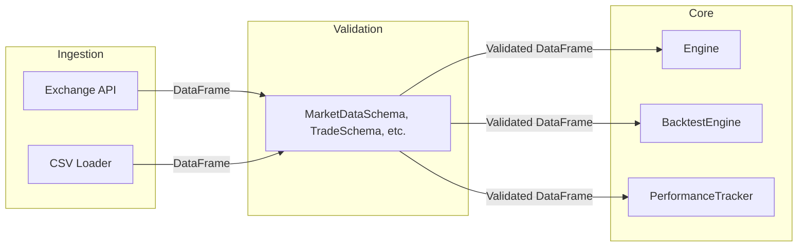

# Pandera Refactoring Plan for CyberDeltaEngine

## 1. **Rationale & Objectives**

- **Why Pandera?**  
  While Pydantic is used for strict validation of dict-based and API models, Pandera is purpose-built for validating pandas DataFrames and Series, which are prevalent in trading, backtesting, and analytics workflows.
- **Objectives:**  
  - Prevent propagation of malformed, missing, or out-of-range tabular data.
  - Centralize and document DataFrame schema definitions.
  - Enable fail-fast, testable, and maintainable data pipelines.

---

## 2. **Scope of Refactor**

- **Where to Apply Pandera:**
  - **Exchange Data Ingestion:** Validate all DataFrames received from exchange APIs or CSVs before further processing.
  - **Backtesting Engine:** Validate input data for backtests (e.g., OHLCV, trades, positions).
  - **Analytics/Monitoring:** Validate DataFrames used in performance tracking and reporting.
  - **Any DataFrame Boundary:** Any function/method that accepts or returns a DataFrame should have an associated Pandera schema.

---

## 3. **Implementation Steps**

### **Step 1: Inventory DataFrame Entry Points**

- Audit all locations where DataFrames are:
  - Ingested from external sources (APIs, files).
  - Passed between core components (e.g., engine, backtester, analytics).
  - Used as function/method arguments or return values.

### **Step 2: Define Pandera Schemas**

- For each DataFrame type, define a `pandera.DataFrameSchema` (or `pandera.SchemaModel` for class-based schemas) specifying:
  - **Column names and types** (e.g., `timestamp: pa.DateTime`, `open: pa.Float`, `volume: pa.Float`).
  - **Constraints** (e.g., `gt=0` for prices/volumes, non-nullable, categorical values).
  - **Optional business logic checks** (e.g., `close >= low`, `high >= open`).

#### **Example: Market Data Schema**

```python
import pandera as pa
from pandera import Column, DataFrameSchema, Check

market_data_schema = DataFrameSchema({
    "timestamp": Column(pa.DateTime, nullable=False),
    "open": Column(pa.Float, Check.gt(0)),
    "high": Column(pa.Float, Check.gt(0)),
    "low": Column(pa.Float, Check.gt(0)),
    "close": Column(pa.Float, Check.gt(0)),
    "volume": Column(pa.Float, Check.ge(0)),
})
```

### **Step 3: Integrate Validation at Boundaries**

- **Ingestion:**  
  Validate all incoming DataFrames immediately after loading (e.g., after `pd.read_csv`, API response parsing).
- **Processing:**  
  Before passing DataFrames to core logic (e.g., `Engine.process_dataframe`, backtest runs), validate against the appropriate schema.
- **Testing:**  
  Add/expand tests to ensure that invalid DataFrames are rejected and that error messages are clear and actionable.

### **Step 4: Refactor Existing Manual Checks**

- Replace ad-hoc DataFrame validation logic (e.g., column presence/type checks, manual assertions) with Pandera schema validation.
- Remove redundant or now-unnecessary manual checks.

### **Step 5: Documentation & Developer Guidance**

- Document all Pandera schemas and their intended use in code and in the developer documentation.
- Add docstrings to all functions/methods that require DataFrame validation, referencing the relevant schema.

### **Step 6: Continuous Integration**

- Add tests for all Pandera schemas.
- Ensure CI fails if any DataFrame validation fails in tests.

---

## 4. **Risks & Mitigations**

| Risk | Mitigation |
|------|------------|
| **Performance Overhead** | Use Pandera's `lazy=True` mode for batch validation in production; profile and optimize as needed. |
| **Schema Drift** | Enforce schema usage in all new/modified code via code review and CI tests. |
| **False Positives/Negatives** | Write comprehensive tests for edge cases and real-world data samples. |

---

## 5. **Mermaid Diagrams**

### **A. DataFrame Validation Flow**

```mermaid
flowchart TD
    A[External Data Source (API/CSV)] -->|Load DataFrame| B[Validate with Pandera Schema]
    B -- Valid --> C[Core Processing (Engine, Backtest, Analytics)]
    B -- Invalid --> D[Log Error & Reject Data]
```

### **B. Integration Points**



---

## 6. **Action Items & Timeline**

1. **Week 1:**  
   - Audit all DataFrame entry points.
   - Draft initial Pandera schemas for all major DataFrame types.
2. **Week 2:**  
   - Integrate validation at ingestion and processing boundaries.
   - Refactor existing manual checks.
   - Add/expand tests.
3. **Week 3:**  
   - Document schemas and update developer docs.
   - Review, test, and iterate based on feedback.

---

## 7. **References**

- [Pandera Documentation](https://pandera.readthedocs.io/)
- See also: `workflow/model_alignment_and_pydantic_refactor_plan.md`, `workflow/pydantic.md`, and security audit reports for rationale and related validation strategies.

---

*Drafted by Angel, CyberDeltaEngine Senior Software Engineer/Architect.  
**Requires human review and approval before production integration.*** 