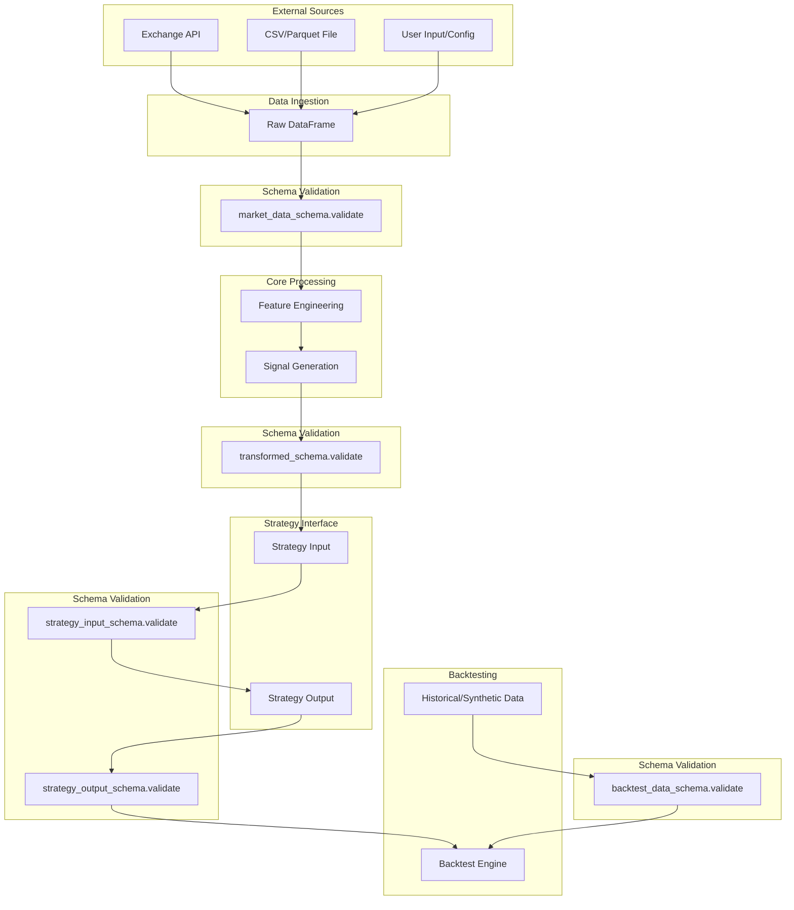
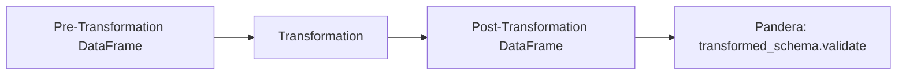
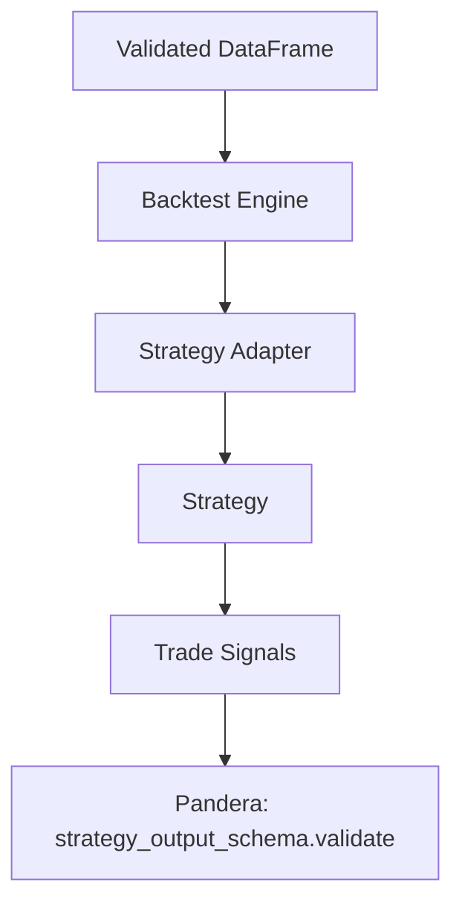

# Pandera Integration Plan for CyberDeltaEngine

## Overview

**Pandera** is a schema validation library for pandas DataFrames and Series. Integrating Pandera into CyberDeltaEngine will:
- Enforce data integrity and security at all critical data boundaries.
- Document expected data structures directly in code.
- Reduce risk of logic errors and attacks via malformed or untrusted data.
- Facilitate robust testing and future refactoring.

This plan outlines how to introduce Pandera, where to apply it, and provides concrete examples for maintainers and contributors.

---

## 1. Rationale and Security Context

- **Cursor Rule: security** mandates strict validation of all external/untrusted data (API, CSV, config, etc.).
- **Pandera** provides a declarative, testable, and maintainable way to enforce these requirements for all pandas-based data.
- **Fail Fast Principle:** Data should be validated immediately upon entry and before/after key transformations.

---

## 2. Where to Apply Pandera

### Data Boundary Overview (Visual)


*Figure: Key data boundaries and validation points for Pandera integration.*

- **Data Ingestion:** Validate all data loaded from CSV, API, or other sources before further processing.
- **Pre/Post-Processing:** Validate DataFrames before and after key transformations (feature engineering, signal generation, etc.).
- **Strategy Interfaces:** Enforce that strategies receive and output data in the correct format.
- **Backtesting:** Validate synthetic or historical data used in backtests.

---

## 3. Implementation Steps

### Step 1: Add Pandera to the Project

```sh
.venv/bin/pip install pandera
```

Add to `requirements.txt` if not already present.

### Step 2: Define Schemas

Create a new module, e.g., `cyberdelta/utils/schemas.py`:

```python
import pandera as pa
from pandera import Column, DataFrameSchema, Check

market_data_schema = DataFrameSchema({
    "timestamp": Column(pa.DateTime, nullable=False),
    "symbol": Column(pa.String, nullable=False),
    "open": Column(pa.Float, nullable=False),
    "high": Column(pa.Float, nullable=False),
    "low": Column(pa.Float, nullable=False),
    "close": Column(pa.Float, nullable=False),
    "volume": Column(pa.Float, nullable=False, checks=Check.ge(0)),
    # Add more columns as needed
})
```

- **Document each schema** with a docstring explaining its purpose and usage.
- **Version schemas** if your data evolves.

### Step 3: Validate Data at Entry Points

**On Data Load:**

```mermaid
flowchart LR
    A[External Data (API/CSV)] --> B[Raw DataFrame]
    B --> C[Pandera: market_data_schema.validate]
    C --> D[Internal Processing]
```
*Figure: Protecting the ingestion boundary with Pandera validation.*

```python
import pandas as pd
from cyberdelta.utils.schemas import market_data_schema

df = pd.read_csv("data.csv")
market_data_schema.validate(df)
```

**Before/After Transformations:**


*Figure: Validating data after transformation to catch logic or data errors early.*

```python
df_transformed = some_transformation(df)
market_data_schema.validate(df_transformed)
```

### Step 4: Integrate with Backtesting and Strategies


*Figure: Validating data at the interface between backtesting, strategy, and signal output.*

- In your backtesting engine, validate the input data before running simulations.
- In strategy adapters, validate the format of data passed to and from strategies.

### Step 5: Error Handling and Logging

Catch `SchemaError`/`SchemaErrors` and log or handle them securely:
```python
import pandera.errors

try:
    market_data_schema.validate(df)
except pandera.errors.SchemaError as e:
    logger.error(f"Data validation failed: {e}")
    # Handle or raise as appropriate
```

### Step 6: Testing

- Write unit tests that check both valid and invalid DataFrames against your schemas.
- Use Pandera's `hypothesis` integration for property-based testing if desired.

---

## 4. Security and Best Practices

- **Never trust external data:** Always validate before use.
- **Fail fast:** Raise/log errors on schema violations before data enters core logic.
- **Document schemas:** Use docstrings and Pandera's schema documentation features.
- **Version schemas:** If your data evolves, version your schemas to support migrations.
- **Cursor Rule: security** and **decimal**: Ensure that all financial columns are validated as `Decimal` or converted immediately after validation if Pandera does not natively support `Decimal`.

---

## 5. Example: Market Data Schema

```python
import pandera as pa
from pandera import Column, DataFrameSchema, Check

market_data_schema = DataFrameSchema({
    "timestamp": Column(pa.DateTime, nullable=False),
    "symbol": Column(pa.String, nullable=False),
    "open": Column(pa.Float, nullable=False),
    "high": Column(pa.Float, nullable=False),
    "low": Column(pa.Float, nullable=False),
    "close": Column(pa.Float, nullable=False),
    "volume": Column(pa.Float, nullable=False, checks=Check.ge(0)),
})
```

**Usage:**
```python
df = pd.read_csv("market_data.csv")
market_data_schema.validate(df)
```

---

## 6. Next Steps and Recommendations

- **Pilot Integration:** Start by validating all data loaded in `BacktestEngine` and core data handlers.
- **Expand Coverage:** Gradually add schemas for all major DataFrames/Series in the codebase.
- **Document and Review:** Update this plan and schemas as the project evolves. Review for security and correctness regularly.

---

## 7. References
- [Pandera Documentation](https://pandera.readthedocs.io/)
- [CyberDeltaEngine Security Rules](../workflow/14_04_2025_toly/security_report_01_input_validation.md)
- [Cursor Rules: security, decimal, comments]

---

*This document is a living plan. Update as Pandera usage expands or project requirements evolve.* 