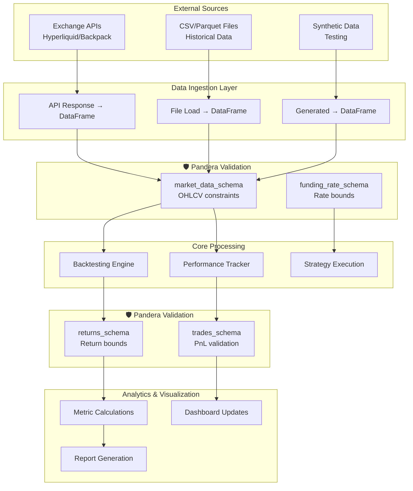

# Pandera Integration Plan for CyberDeltaEngine

## Overview

**Pandera** is a statistical data validation library that provides a flexible and expressive API for performing data validation on pandas DataFrames. Integrating Pandera into CyberDeltaEngine will:

- Enforce data integrity at DataFrame boundaries (APIs, CSV/Parquet files, transformations)
- Provide runtime validation of financial data constraints (OHLCV relationships, positive volumes, etc.)
- Document expected DataFrame structures as executable schemas
- Complement existing Pydantic validation for structured data models
- Enable property-based testing for DataFrame operations

## Current State Analysis

### Existing Validation Infrastructure

CyberDeltaEngine currently employs a robust validation strategy using:

1. **Pydantic Models** (Primary validation framework)
   - Used extensively for API data models and configuration
   - Examples: `ArbitrageOpportunity`, `DiscrepancyDetail`, `HistoricalDiscrepancyRecord`
   - Located in `/cyberdelta/validation/` and throughout the codebase

2. **Custom Parsing Utilities** (`/cyberdelta/utils/parsing.py`)
   - `validate_str_field()`, `validate_enum_field()`
   - `check_str_parsable_to_finite_decimal()`, `parse_decimal_value()`
   - Strict decimal parsing with detailed error messages

3. **Type Safety**
   - Strict mypy and pyright configurations
   - Comprehensive type annotations throughout

### DataFrame Usage Without Validation

The codebase extensively uses pandas DataFrames but lacks structured validation:

1. **Backtesting** (`/cyberdelta/backtesting/`)
   - Loads OHLCV data from CSV files
   - MultiIndex DataFrames with symbol-level market data
   - No validation of price relationships or data integrity

2. **Performance Tracking** (`/cyberdelta/monitoring/`)
   - Creates DataFrames for returns, trades, signals, funding rates
   - Complex calculations without input validation
   - Risk of propagating bad data through analytics pipeline

3. **Visualization** (`/cyberdelta/visualization/`)
   - Processes DataFrames for charts and metrics
   - Assumes data quality without verification

---

## 1. Rationale and Security Context

### Why Pandera?

- **Complements Pydantic**: While Pydantic excels at row-wise validation, Pandera specializes in column-wise and DataFrame-level validation
- **Financial Data Integrity**: Enforces domain-specific constraints (e.g., low ≤ close ≤ high)
- **Performance**: Vectorized validation operations on large DataFrames
- **Testing**: Built-in hypothesis strategies for property-based testing

### Security Considerations

Per `.claude/rules/security.md`:
- All external data sources (APIs, files) must be validated before processing
- Financial calculations require decimal precision validation
- Fail-fast principle: Invalid data should never reach core logic

---

## 2. Where to Apply Pandera

### Data Flow and Validation Points



### Priority Validation Points

1. **High Priority** (Data Ingestion)
   - `/cyberdelta/backtesting/backtesting.py:load_data()` - CSV market data
   - API response processing in exchange connectors
   - `/cyberdelta/testing/data_generation.py` - Synthetic data validation

2. **Medium Priority** (Transformations)
   - `/cyberdelta/monitoring/performance_tracker.py` - Performance DataFrames
   - `/cyberdelta/backtesting/results.py` - Equity curve validation
   - Return and drawdown calculations

3. **Low Priority** (Outputs)
   - Visualization data preparation
   - Report generation DataFrames

---

## 3. Implementation Roadmap

### Phase 1: Foundation (Week 1-2)

#### 1.1 Setup and Core Schemas

```bash
# Add to pyproject.toml dependencies
pandera = "^0.18.0"
pandera[strategies] = "^0.18.0"  # For hypothesis integration
```

Create `/cyberdelta/validation/schemas/dataframe_schemas.py`:

```python
"""DataFrame validation schemas using Pandera.

This module defines schemas for validating pandas DataFrames used throughout
CyberDeltaEngine, ensuring data integrity at critical boundaries.
"""

import pandera as pa
from pandera import Column, DataFrameSchema, Check, Index
from decimal import Decimal
import pandas as pd
from typing import Optional


class MarketDataSchema:
    """Schema for OHLCV market data validation."""
    
    # Basic OHLCV schema for single-index DataFrames
    ohlcv_schema = DataFrameSchema(
        columns={
            "open": Column(
                float,
                checks=[
                    Check.greater_than(0),
                    Check.finite(),
                ],
                nullable=False,
                description="Opening price"
            ),
            "high": Column(
                float,
                checks=[
                    Check.greater_than(0),
                    Check.finite(),
                ],
                nullable=False,
                description="High price"
            ),
            "low": Column(
                float,
                checks=[
                    Check.greater_than(0),
                    Check.finite(),
                ],
                nullable=False,
                description="Low price"
            ),
            "close": Column(
                float,
                checks=[
                    Check.greater_than(0),
                    Check.finite(),
                ],
                nullable=False,
                description="Closing price"
            ),
            "volume": Column(
                float,
                checks=[
                    Check.greater_than_or_equal_to(0),
                    Check.finite(),
                ],
                nullable=False,
                description="Trading volume"
            ),
        },
        index=Index(
            pd.DatetimeIndex,
            name="timestamp",
            nullable=False,
        ),
        # Cross-column validation
        checks=[
            # OHLCV relationship: low <= open,close <= high
            Check(lambda df: (df["low"] <= df["open"]).all(), 
                  error="Low price must be <= open price"),
            Check(lambda df: (df["low"] <= df["close"]).all(), 
                  error="Low price must be <= close price"),
            Check(lambda df: (df["open"] <= df["high"]).all(), 
                  error="Open price must be <= high price"),
            Check(lambda df: (df["close"] <= df["high"]).all(), 
                  error="Close price must be <= high price"),
        ],
        strict=True,  # No extra columns allowed
        coerce=True,  # Attempt type coercion
        name="OHLCV Market Data",
        description="Validates standard OHLCV market data structure"
    )
    
    # Extended schema with funding rate for perpetual futures
    ohlcv_with_funding_schema = ohlcv_schema.add_columns({
        "funding_rate": Column(
            float,
            checks=[
                Check.in_range(-0.1, 0.1),  # ±10% bounds
                Check.finite(),
            ],
            nullable=True,
            description="Funding rate for perpetual contracts"
        )
    })


class TradingDataSchema:
    """Schema for trading and performance data validation."""
    
    trades_schema = DataFrameSchema(
        columns={
            "trade_id": Column(str, nullable=False, unique=True),
            "strategy": Column(str, nullable=False),
            "symbol": Column(str, nullable=False),
            "side": Column(str, checks=Check.isin(["buy", "sell"]), nullable=False),
            "entry_price": Column(float, checks=Check.greater_than(0), nullable=False),
            "exit_price": Column(float, checks=Check.greater_than(0), nullable=True),
            "quantity": Column(float, checks=Check.greater_than(0), nullable=False),
            "pnl": Column(float, nullable=True),
            "entry_time": Column(pd.Timestamp, nullable=False),
            "exit_time": Column(pd.Timestamp, nullable=True),
        },
        checks=[
            # Exit time must be after entry time
            Check(lambda df: df[df["exit_time"].notna()].apply(
                lambda row: row["exit_time"] > row["entry_time"], axis=1
            ).all(), error="Exit time must be after entry time"),
            # PnL validation for closed trades
            Check(lambda df: df[df["exit_price"].notna()].apply(
                lambda row: validate_pnl(row), axis=1
            ).all(), error="PnL calculation mismatch"),
        ],
        name="Trades Data",
    )
    
    returns_schema = DataFrameSchema(
        index=Index(pd.DatetimeIndex, name="timestamp", nullable=False),
        columns={
            # Dynamic columns for each strategy - use regex
            "^strategy_.*": Column(
                float,
                checks=[
                    Check.in_range(-1, float('inf')),  # Returns >= -100%
                    Check.finite(),
                ],
                regex=True,
                description="Strategy returns"
            )
        },
        name="Returns Data",
    )


def validate_pnl(row: pd.Series) -> bool:
    """Validate PnL calculation for a trade."""
    if pd.isna(row["exit_price"]) or pd.isna(row["pnl"]):
        return True
    
    expected_pnl = (row["exit_price"] - row["entry_price"]) * row["quantity"]
    if row["side"] == "sell":
        expected_pnl = -expected_pnl
    
    # Allow small floating point differences
    return abs(row["pnl"] - expected_pnl) < 0.01
```

#### 1.2 Integration with Backtesting

Update `/cyberdelta/backtesting/backtesting.py`:

```python
from cyberdelta.validation.schemas.dataframe_schemas import MarketDataSchema

class BacktestEngine:
    def load_data(self, csv_path: str) -> pd.DataFrame:
        """Load and validate market data from CSV."""
        df = pd.read_csv(csv_path, index_col="timestamp", parse_dates=True)
        
        # Validate data structure
        try:
            if "funding_rate" in df.columns:
                MarketDataSchema.ohlcv_with_funding_schema.validate(df)
            else:
                MarketDataSchema.ohlcv_schema.validate(df)
        except pa.errors.SchemaError as e:
            logger.error(f"Market data validation failed: {e}")
            raise ValueError(f"Invalid market data format: {e}")
        
        logger.info(f"Loaded and validated {len(df)} rows of market data")
        return df
```

### Phase 2: Performance Tracking Integration (Week 3)

Update `/cyberdelta/monitoring/performance_tracker.py`:

```python
from cyberdelta.validation.schemas.dataframe_schemas import TradingDataSchema

class PerformanceTracker:
    @pa.check_output(TradingDataSchema.returns_schema)
    def get_returns_dataframe(self) -> pd.DataFrame:
        """Get validated returns DataFrame."""
        # Existing implementation
        return returns_df
    
    @pa.check_output(TradingDataSchema.trades_schema)
    def get_trades_dataframe(self) -> pd.DataFrame:
        """Get validated trades DataFrame."""
        # Existing implementation
        return trades_df
```

### Phase 3: Advanced Schemas and Testing (Week 4)

#### 3.1 Custom Validators for Financial Constraints

```python
# Add to dataframe_schemas.py

class FinancialValidators:
    """Custom validators for financial data constraints."""
    
    @staticmethod
    def sharpe_ratio_bounds(df: pd.DataFrame) -> bool:
        """Validate Sharpe ratio is within reasonable bounds."""
        sharpe = df.get("sharpe_ratio")
        if sharpe is None:
            return True
        return -10 <= sharpe <= 10
    
    @staticmethod
    def max_drawdown_bounds(df: pd.DataFrame) -> bool:
        """Validate maximum drawdown is between 0 and -100%."""
        dd = df.get("max_drawdown")
        if dd is None:
            return True
        return -1 <= dd <= 0


# Performance metrics schema
performance_metrics_schema = DataFrameSchema(
    columns={
        "total_return": Column(float, Check.finite()),
        "sharpe_ratio": Column(float, Check.finite()),
        "max_drawdown": Column(float, Check.in_range(-1, 0)),
        "win_rate": Column(float, Check.in_range(0, 1)),
        "profit_factor": Column(float, Check.greater_than_or_equal_to(0)),
    },
    checks=[
        Check(FinancialValidators.sharpe_ratio_bounds),
        Check(FinancialValidators.max_drawdown_bounds),
    ],
)
```

#### 3.2 Property-Based Testing

```python
# tests/test_dataframe_schemas.py

import hypothesis
from hypothesis import strategies as st
from pandera.strategies import dataframe_strategy
import pytest

class TestMarketDataSchema:
    
    @hypothesis.given(dataframe_strategy(MarketDataSchema.ohlcv_schema))
    def test_valid_ohlcv_data(self, df):
        """Test that generated valid data passes validation."""
        validated = MarketDataSchema.ohlcv_schema.validate(df)
        assert len(validated) == len(df)
    
    def test_ohlcv_relationships(self):
        """Test OHLCV relationship constraints."""
        df = pd.DataFrame({
            "open": [100.0],
            "high": [90.0],  # Invalid: high < open
            "low": [80.0],
            "close": [95.0],
            "volume": [1000.0],
        }, index=pd.DatetimeIndex(["2024-01-01"]))
        
        with pytest.raises(pa.errors.SchemaError, match="high price"):
            MarketDataSchema.ohlcv_schema.validate(df)
```

### Phase 4: Monitoring and Observability (Week 5)

#### 4.1 Validation Metrics

```python
# /cyberdelta/monitoring/validation_metrics.py

from dataclasses import dataclass
from typing import Dict, List
import time

@dataclass
class ValidationMetrics:
    """Track DataFrame validation metrics."""
    schema_name: str
    validation_time: float
    row_count: int
    column_count: int
    errors: List[str]
    
class ValidationMonitor:
    """Monitor DataFrame validation performance and errors."""
    
    def __init__(self):
        self.metrics: List[ValidationMetrics] = []
    
    def validate_with_metrics(
        self, 
        df: pd.DataFrame, 
        schema: DataFrameSchema
    ) -> pd.DataFrame:
        """Validate DataFrame and collect metrics."""
        start_time = time.time()
        errors = []
        
        try:
            validated = schema.validate(df)
            validation_time = time.time() - start_time
            
            metric = ValidationMetrics(
                schema_name=schema.name or "unnamed",
                validation_time=validation_time,
                row_count=len(df),
                column_count=len(df.columns),
                errors=errors
            )
            self.metrics.append(metric)
            
            return validated
            
        except pa.errors.SchemaErrors as e:
            validation_time = time.time() - start_time
            errors = [str(err) for err in e.schema_errors]
            
            metric = ValidationMetrics(
                schema_name=schema.name or "unnamed",
                validation_time=validation_time,
                row_count=len(df),
                column_count=len(df.columns),
                errors=errors
            )
            self.metrics.append(metric)
            raise
```

---

## 4. Security Best Practices

### Input Validation Strategy

1. **Fail Fast**: Validate immediately upon data ingestion
2. **Detailed Errors**: Log validation failures with context (but sanitize sensitive data)
3. **Schema Versioning**: Version schemas to support data evolution
4. **Strict Mode**: Use `strict=True` to reject unexpected columns

### Example: Secure API Data Validation

```python
async def process_market_data(api_response: dict) -> pd.DataFrame:
    """Securely process and validate API market data."""
    try:
        # Convert API response to DataFrame
        df = pd.DataFrame(api_response["data"])
        df["timestamp"] = pd.to_datetime(df["timestamp"])
        df.set_index("timestamp", inplace=True)
        
        # Validate structure and constraints
        validated_df = MarketDataSchema.ohlcv_schema.validate(df)
        
        # Additional security checks
        if len(validated_df) > 100000:
            raise ValueError("Suspicious data size - possible DoS attempt")
        
        return validated_df
        
    except pa.errors.SchemaError as e:
        logger.warning(f"Invalid market data from API: {e}")
        # Don't expose internal schema details in user-facing errors
        raise ValueError("Invalid market data format")
```

---

## 5. Migration Guide

### For Existing Code

1. **Identify DataFrame Creation Points**
   ```bash
   # Find DataFrame creation patterns
   rg "pd\.DataFrame\(" --type py
   rg "\.to_dataframe\(\)" --type py
   rg "read_csv\(" --type py
   ```

2. **Add Validation Incrementally**
   - Start with data ingestion functions
   - Add validation after major transformations
   - Use decorators for minimal code changes

3. **Handle Legacy Data**
   ```python
   def validate_with_fallback(df: pd.DataFrame, schema: DataFrameSchema) -> pd.DataFrame:
       """Validate with graceful degradation for legacy data."""
       try:
           return schema.validate(df)
       except pa.errors.SchemaError as e:
           logger.warning(f"Validation failed, attempting coercion: {e}")
           # Attempt to coerce and retry
           return schema.validate(df, lazy=True)
   ```

---

## 6. Performance Considerations

### Optimization Strategies

1. **Lazy Validation**: Use `lazy=True` to collect all errors
2. **Sampling**: Validate samples for large datasets
3. **Caching**: Cache validated schemas for repeated use

```python
# Example: Efficient validation for large datasets
def validate_large_dataset(df: pd.DataFrame, schema: DataFrameSchema) -> pd.DataFrame:
    """Efficiently validate large datasets."""
    if len(df) > 1_000_000:
        # Validate structure on sample
        sample = df.sample(n=10000, random_state=42)
        schema.validate(sample)
        
        # Validate full dataset with basic checks only
        return schema.validate(df, lazy=True)
    else:
        return schema.validate(df)
```

---

## 7. Testing Strategy

### Unit Tests
- Test each schema with valid and invalid data
- Test edge cases (empty DataFrames, NaN values)
- Test custom validators

### Integration Tests
- Test full data pipeline with validation
- Test error handling and logging
- Test performance impact

### Property-Based Tests
- Use Pandera's hypothesis strategies
- Generate edge cases automatically
- Test schema completeness

---

## 8. Documentation Standards

### Schema Documentation

```python
market_data_schema = DataFrameSchema(
    columns={...},
    name="OHLCV Market Data",
    description="""
    Validates market data for backtesting and live trading.
    
    Expected format:
    - Index: DatetimeIndex (UTC)
    - Columns: open, high, low, close, volume
    - Constraints: OHLCV relationships, positive prices
    
    Used by:
    - BacktestEngine.load_data()
    - LiveDataFeed.process_tick()
    """,
)
```

### Error Messages

```python
Check(
    lambda df: (df["low"] <= df["high"]).all(),
    error="Invalid OHLCV data: Low price exceeds high price. "
          "This may indicate data corruption or incorrect column mapping.",
    element_wise=False,
)
```

---

## 9. Rollout Plan

### Week 1-2: Foundation
- [ ] Add Pandera to dependencies
- [ ] Create core schemas module
- [ ] Integrate with backtesting data loading
- [ ] Add basic unit tests

### Week 3: Performance Tracking
- [ ] Add schemas for trades and returns
- [ ] Integrate with PerformanceTracker
- [ ] Add validation metrics

### Week 4: Advanced Features
- [ ] Add custom financial validators
- [ ] Implement property-based tests
- [ ] Create schema inheritance hierarchy

### Week 5: Monitoring
- [ ] Add validation monitoring
- [ ] Create validation dashboard
- [ ] Document best practices

### Week 6: Full Coverage
- [ ] Complete integration across all modules
- [ ] Performance optimization
- [ ] Team training and documentation

---

## 10. Success Metrics

- **Coverage**: 100% of DataFrame creation/transformation points have validation
- **Performance**: <10ms validation overhead for typical datasets
- **Quality**: 50% reduction in data-related bugs
- **Developer Experience**: Clear error messages, easy schema updates

---

## References

- [Pandera Documentation](https://pandera.readthedocs.io/)
- [Pandera Best Practices](https://pandera.readthedocs.io/en/stable/best_practices.html)
- [CyberDeltaEngine Security Rules](.claude/rules/security.md)
- [Property-Based Testing with Hypothesis](https://hypothesis.readthedocs.io/)

---

*Last Updated: December 2024*
*Next Review: After Phase 1 Implementation*