# cyberdelta/utils/ — Per-Folder Analysis

---

## state_manager.py
**Purpose:**
Provides robust state persistence and recovery for the engine, including atomic state saving, integrity validation, backup rotation, and corruption recovery. Ensures reliable restoration of engine state after failures or restarts.

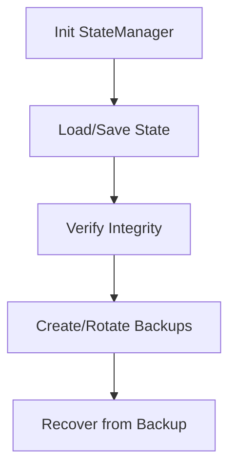

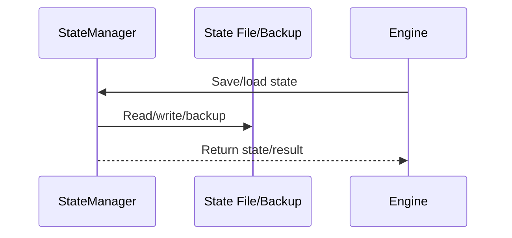

**Summary:**
- Inputs: State dictionaries, config.
- Outputs: Persisted state files, backups, recovery actions.
- Dependencies: Config, OS/filesystem, JSON.
- Critical Path: Ensures engine can recover from crashes or corruption.

---

## constants.py
**Purpose:**
Defines system-wide constants, enums, and configuration defaults for the engine, including exchange IDs, event types, timeframes, and rate limits. Centralizes values for maintainability and consistency.

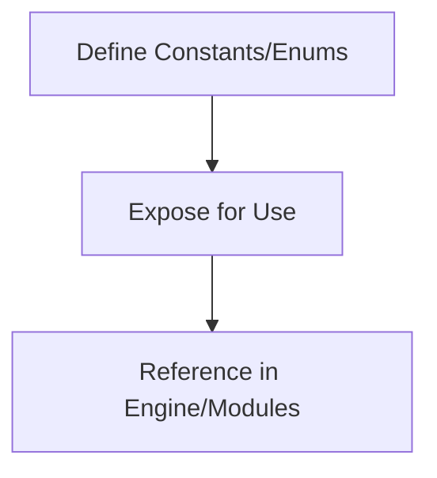

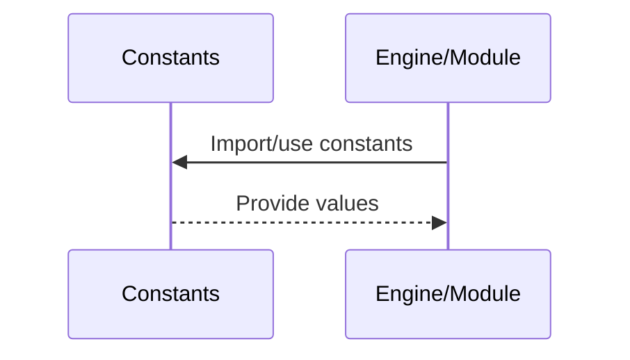

**Summary:**
- Inputs: None (static definitions).
- Outputs: Constants and enums for use throughout the codebase.
- Dependencies: None.
- Critical Path: Ensures consistent configuration and event handling.

---

## parsing.py
**Purpose:**
Provides robust, reusable utilities for parsing datetimes (ensuring UTC-awareness) and decimals (ensuring precision and safety). Used throughout the engine for model and data validation.

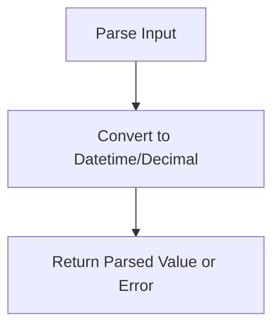

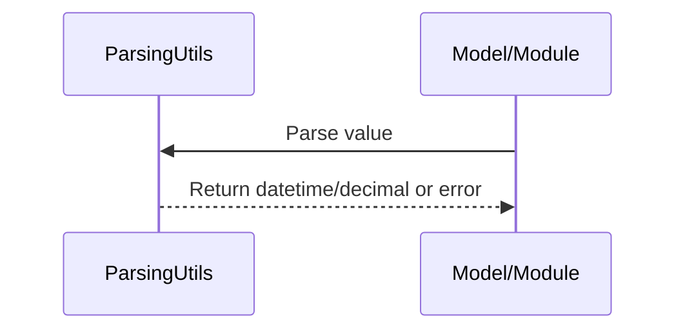

**Summary:**
- Inputs: Raw values (str, int, float, etc.).
- Outputs: Parsed datetime/Decimal or error.
- Dependencies: datetime, decimal.
- Critical Path: Ensures correctness and safety in all time/amount handling.

---

## config.py
**Purpose:**
Manages application configuration, supporting loading from YAML files, environment variables, and direct dictionaries. Provides dot-notation access, merging, and saving of config data.

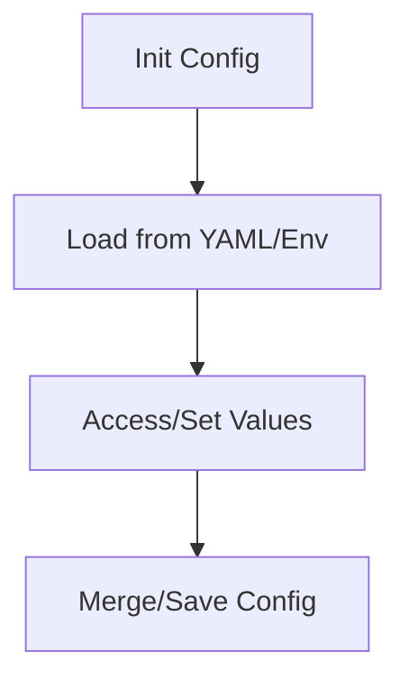

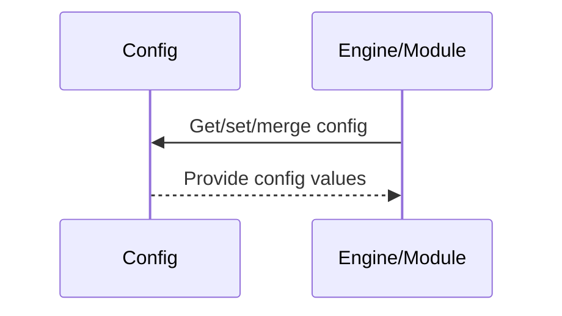

**Summary:**
- Inputs: YAML files, env vars, dicts.
- Outputs: Config values, merged/saved configs.
- Dependencies: YAML, OS, logging.
- Critical Path: Central to all configuration management and environment control.

---

## logging_config.py
**Purpose:**
Configures and manages logging for the engine, supporting console/file handlers, log levels, and module-specific overrides. Provides context managers for log capture and testing.

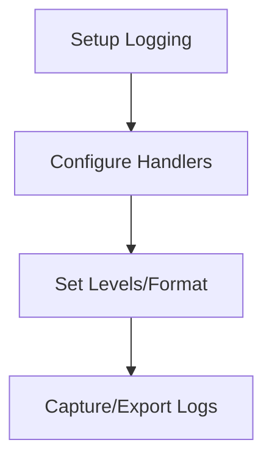

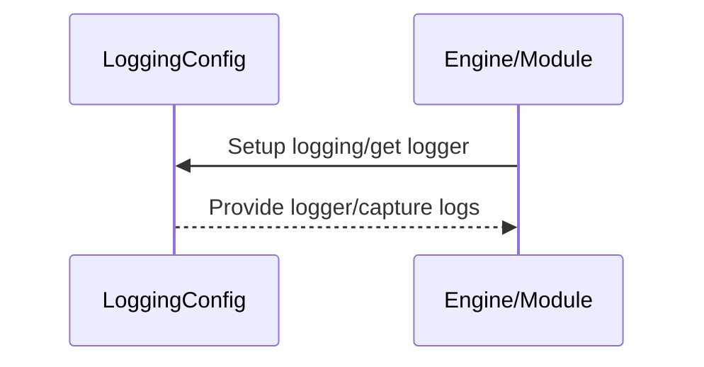

**Summary:**
- Inputs: Config, log level, file/module settings.
- Outputs: Configured loggers, captured logs.
- Dependencies: logging, OS, sys.
- Critical Path: Ensures observability, debugging, and auditability.

---

## serialization.py
**Purpose:**
Provides custom JSON serialization/deserialization utilities, handling Decimals, datetimes, and numpy types for safe, precise data interchange and persistence.

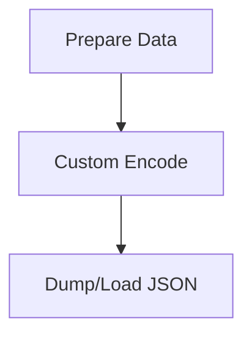

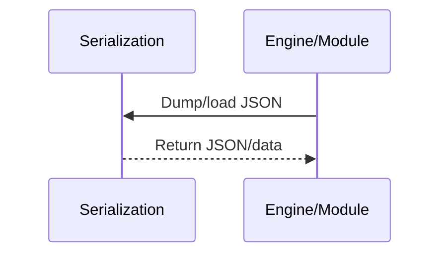

**Summary:**
- Inputs: Data to serialize/deserialize.
- Outputs: JSON strings, loaded data.
- Dependencies: json, datetime, decimal, numpy.
- Critical Path: Ensures safe, precise data interchange and persistence.

---

## __init__.py
**Purpose:**
Marks the directory as a Python package. No runtime logic or exports.

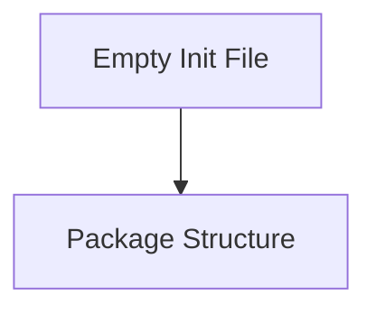

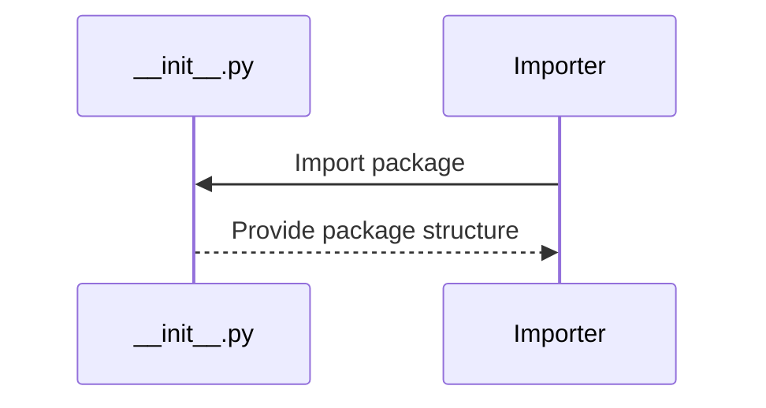

**Summary:**
- Inputs: None (empty init).
- Outputs: Package structure.
- Dependencies: None.
- Critical Path: Not runtime critical, but important for package structure. 