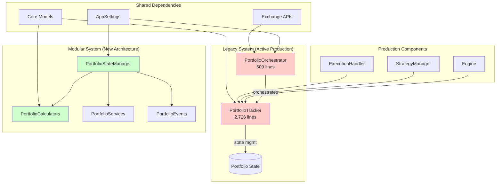
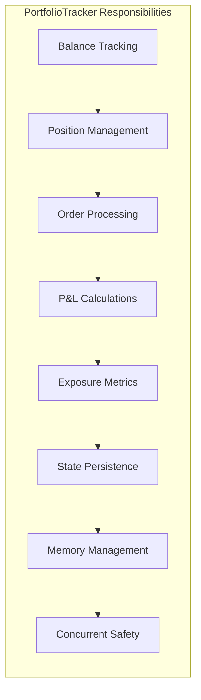
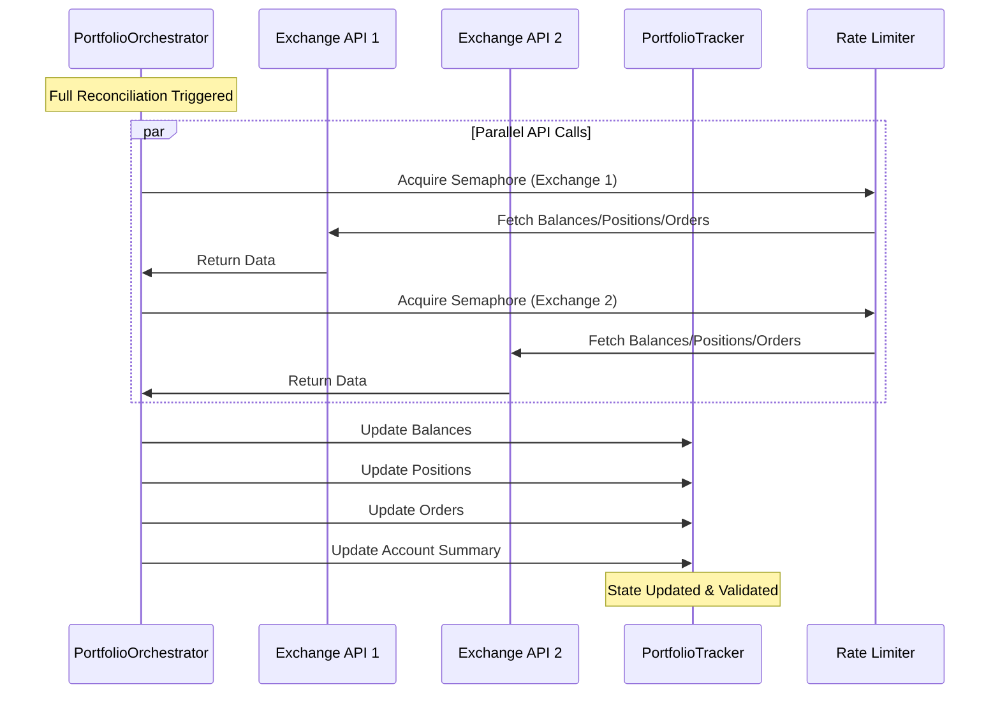
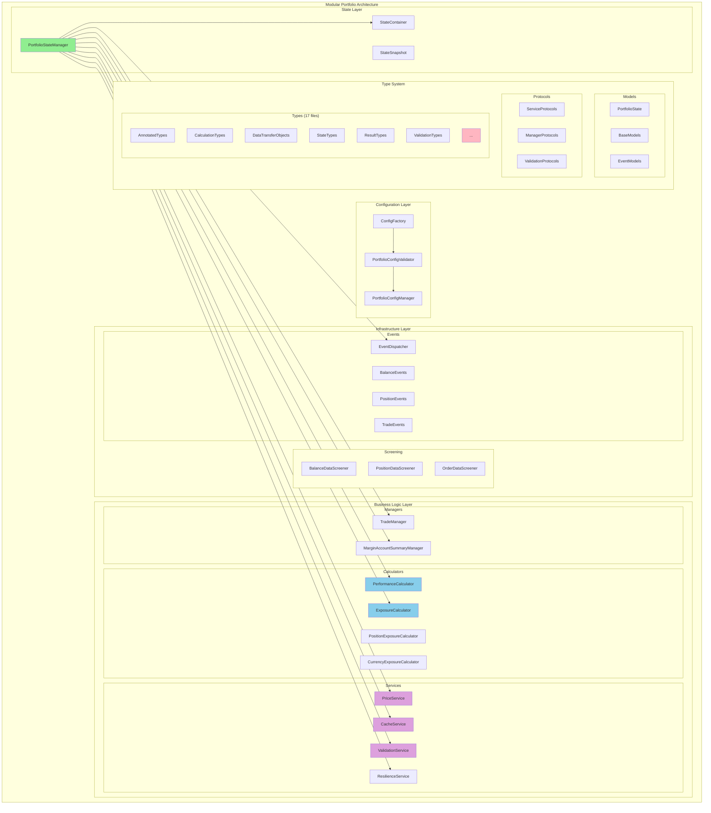
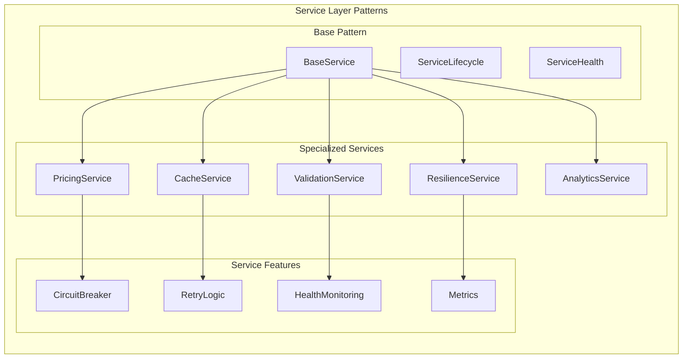
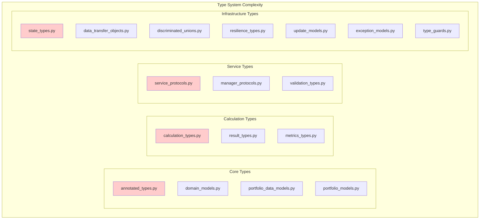
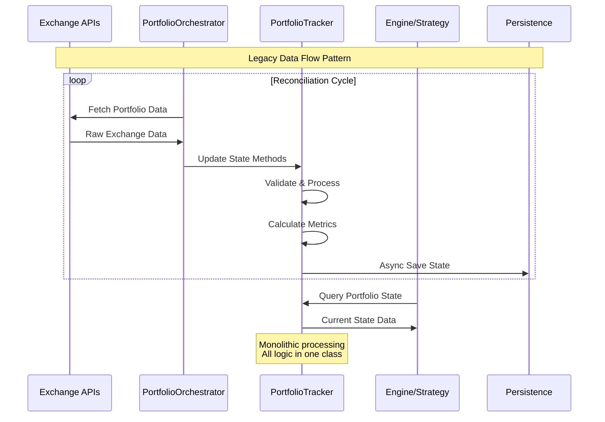
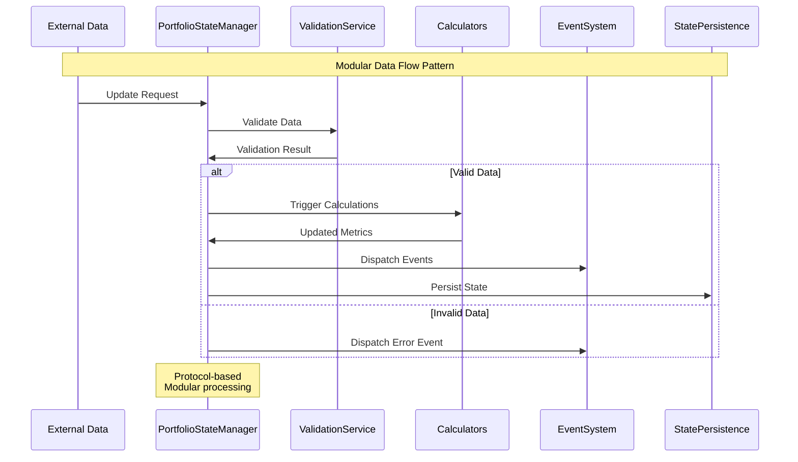
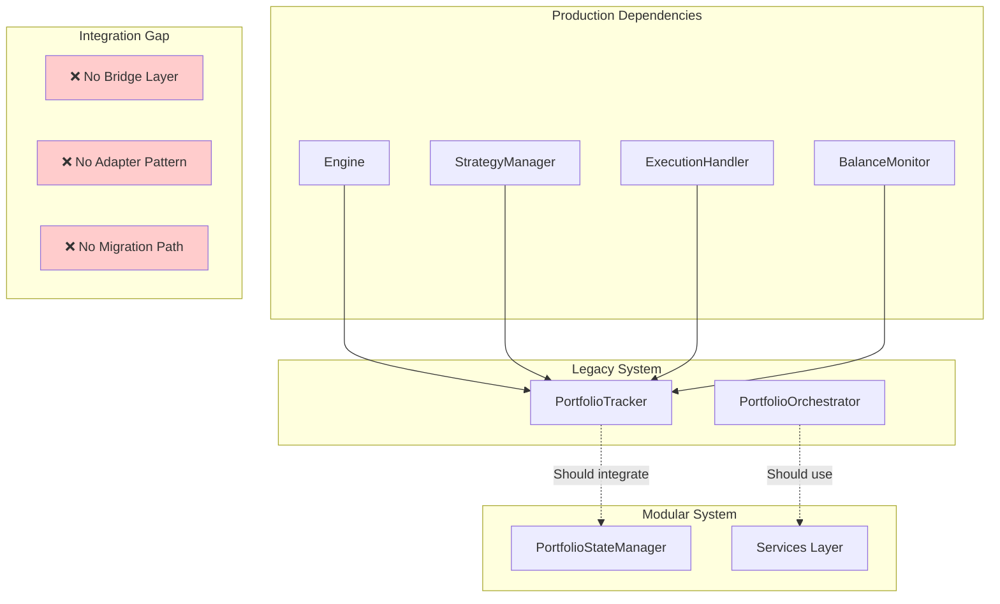

# Portfolio System Architecture Analysis - First Look

**Date:** 2025-07-26
**Status:** Comprehensive Analysis Complete
**Priority:** Critical - Architectural Debt Resolution Required

## Executive Summary

The CyberDeltaEngine portfolio system exhibits a **dual-architecture pattern** where two complete portfolio management systems coexist, creating significant technical debt and operational complexity. This analysis reveals a sophisticated but incomplete migration from a monolithic architecture to a modern modular system.

**Key Findings:**
- **Legacy System:** Monolithic `PortfolioTracker` (2,726 lines) + `PortfolioOrchestrator` (609 lines) still in active use
- **Modular System:** Complete modern architecture in `cyberdelta/core/portfolio/` with 128 files
- **Type System Debt:** 31 type-related files with significant duplication (vs documented 17)
- **Service Sprawl:** Multiple 1,500+ line services exist in modular system
- **Integration Gap:** 54 direct dependencies on legacy components across core module
- **Refactor Status:** ~60% complete - infrastructure done, core integration pending

## System Architecture Overview

### Current Dual-Architecture State



## Legacy System Deep Analysis

### PortfolioTracker (`cyberdelta/core/portfolio_tracker.py`)

**Architecture Classification:** Monolithic State Manager
**Size:** 2,600+ lines, 27,380+ tokens
**Status:** Production Critical

#### Core Responsibilities


#### Key Methods Analysis
- **50+ async methods** handling diverse portfolio operations
- **Exchange-specific locking** for concurrent safety
- **Memory management** with configurable cleanup policies
- **Extensive validation** for financial data integrity
- **Performance optimization** with batch processing

#### Technical Debt Issues
1. **Single Responsibility Violation**: Mixing state management, calculations, persistence, validation
2. **Tight Coupling**: Direct dependencies to exchange APIs and configuration models
3. **Testing Complexity**: Massive surface area makes comprehensive testing difficult
4. **Maintenance Burden**: Any change requires understanding 2,600+ lines of context

### PortfolioOrchestrator (`cyberdelta/core/portfolio_orchestrator.py`)

**Architecture Classification:** API Coordination Layer
**Size:** 610 lines
**Status:** Production Critical

#### Design Pattern Analysis


#### Strengths
- **Clean separation** between API calls and state management
- **Excellent error handling** with graceful degradation
- **Scalable concurrent processing** with semaphore-based rate limiting
- **Comprehensive logging** for operational visibility

#### Integration Issues
- **Tightly coupled** to PortfolioTracker monolithic interface
- **No abstraction layer** for different portfolio implementations
- **Hard-coded method calls** not compatible with modular system protocols

## Modular System Deep Analysis

### Architecture Overview

The modular system implements a sophisticated component-based architecture following modern software engineering principles:



### Component Analysis

#### PortfolioStateManager (New Architecture Core)
```python
# Key architectural differences from PortfolioTracker
class PortfolioStateManager:
    """Protocol-based, modular state manager"""

    def __init__(
        self,
        config: PortfolioConfig,
        state_container: StateContainerProtocol,
        validation_service: ValidationServiceProtocol,
        pricing_service: PricingServiceProtocol,
        event_dispatcher: EventDispatcherProtocol,
    ):
        # Protocol-based dependency injection
        # Clean separation of concerns
        # Testable architecture
```

#### Service Layer Architecture


### Type System Analysis

The modular system includes an extensive type system with **17 separate type definition files**:



**Type System Issues:**
- **17 separate files** create import complexity and maintenance burden
- **Circular import potential** between related type definitions
- **Over-engineering** - many similar types with slight variations
- **Developer cognitive load** - difficult to understand type relationships

## Data Flow Analysis

### Legacy System Data Flow


### Modular System Data Flow


## Integration Analysis

### Current Integration Challenges



### Required Integration Components

1. **Portfolio Manager Protocol**
   ```python
   @runtime_checkable
   class PortfolioManagerProtocol(Protocol):
       """Unified interface for both systems"""
       async def get_total_capital(self) -> Decimal: ...
       async def get_positions(self) -> list[Position]: ...
       async def update_balances(self, data: dict) -> None: ...
   ```

2. **Legacy System Adapter**
   ```python
   class LegacyPortfolioAdapter(PortfolioManagerProtocol):
       """Adapts PortfolioTracker to new protocol"""
       def __init__(self, tracker: PortfolioTracker): ...
   ```

3. **Migration Utilities**
   ```python
   class StateTransitionManager:
       """Manages gradual migration between systems"""
       async def migrate_state(self, from_system, to_system): ...
   ```

## Technical Debt Assessment

### Critical Technical Debt Issues

#### 1. Dual Architecture Maintenance (Priority: Critical)
- **Impact:** Every change requires dual implementation
- **Risk:** Data inconsistency, development slowdown
- **Resolution:** Establish migration timeline with adapter pattern

#### 2. Type System Over-Engineering (Priority: High)
- **Impact:** Developer cognitive load, maintenance complexity
- **Risk:** Import circular dependencies, performance overhead
- **Resolution:** Consolidate 17 files into 4-5 focused modules

#### 3. Service Size Violations (Priority: High)
Multiple services exceed 1,000 lines:
- `portfolio_analytics_service.py`: 1,562 lines
- `portfolio_config_manager.py`: 1,170 lines
- `portfolio_metrics_aggregation_service.py`: 1,211 lines

#### 4. Exception Hierarchy Complexity (Priority: Medium)
- **221 exported exceptions** with many Result-monad artifacts
- Similar exceptions with slight variations
- Incomplete migration from functional programming patterns

### Code Quality Analysis

#### Positive Patterns ✅
- **Strong type safety** with Pydantic validation throughout
- **Protocol-based interfaces** enabling flexible implementations
- **Comprehensive error handling** with specific exception types
- **Performance optimization** with caching and batch processing
- **Modern Python practices** with async/await, context managers

#### Concerning Patterns ❌
- **Monolithic components** violating single responsibility
- **Mixed architectural patterns** within same codebase
- **Complex initialization sequences** with many dependencies
- **Scattered business logic** across multiple layers
- **Inconsistent data models** between systems

## Risk Assessment

### Production Risks

#### 1. System Reliability (Risk Level: High)
- **Dual systems** create confusion and potential for errors
- **No data synchronization** between architectures
- **Complex rollback scenarios** in case of issues
- **Unknown performance implications** of running both systems

#### 2. Development Velocity (Risk Level: High)
- **High cognitive load** for developers switching between patterns
- **Complex testing requirements** for both systems
- **Feature development slowdown** due to dual maintenance
- **New developer onboarding complexity**

#### 3. Data Integrity (Risk Level: Medium)
- **Potential state divergence** between systems
- **Lost updates** if systems get out of sync
- **Inconsistent portfolio views** for different components
- **Audit trail complexity** with dual data sources

### Mitigation Strategies

#### Immediate Risk Mitigation
1. **Create adapter layer** to provide unified interface
2. **Establish data validation** between systems during transition
3. **Implement comprehensive monitoring** for both systems
4. **Document clear usage patterns** for developers

#### Long-term Risk Elimination
1. **Complete migration** to modular system
2. **Remove legacy components** once migration validated
3. **Consolidate type system** and service architectures
4. **Establish single source of truth** for portfolio data

## Refactor Status Assessment

### Completed Components ✅

#### Infrastructure (90% Complete)
- **Configuration System**: Pydantic-based with comprehensive validation
- **Exception Hierarchy**: Specialized exceptions with clear hierarchies
- **Base Classes**: TypedCalculator, TypedStateManager, BaseService patterns
- **Event System**: Complete event-driven architecture
- **Type System**: Extensive Pydantic models and protocols

#### Service Layer (85% Complete)
- **Validation Services**: Comprehensive data validation with business rules
- **Cache Services**: Memory-efficient caching with TTL support
- **Resilience Services**: Circuit breakers, retries, health monitoring
- **Configuration Services**: Type-safe configuration management
- **Symbol Services**: Symbol mapping and metadata management

#### Testing Infrastructure (80% Complete)
- **Unit Tests**: Comprehensive coverage for modular components
- **Integration Examples**: Working examples of component usage
- **Protocol Compliance**: Tests ensuring interface adherence
- **Mock Implementations**: Test doubles for all major protocols

### Incomplete Components ❌

#### Core Integration (30% Complete)
- **Portfolio Orchestration**: No integration with modular state manager
- **Production Dependencies**: Engine/Strategy still use legacy system
- **Data Migration**: No path for migrating existing portfolio state
- **API Integration**: Exchange APIs still feed legacy system only

#### Bridge Components (0% Complete)
- **Adapter Pattern**: No compatibility layer between systems
- **Protocol Unification**: No common interface for both architectures
- **State Synchronization**: No mechanism for keeping systems aligned
- **Migration Utilities**: No tools for gradual system transition

#### Production Validation (20% Complete)
- **Performance Benchmarking**: Limited comparison between systems
- **Load Testing**: No validation of modular system under production load
- **Monitoring Integration**: Basic monitoring, no production-ready alerting
- **Operational Procedures**: No runbooks for managing dual systems

## Recommended Action Plan

### Phase 1: Stabilization (Weeks 1-2)
**Objective:** Create stable foundation for migration

1. **Create Portfolio Manager Protocol**
   ```python
   @runtime_checkable
   class PortfolioManagerProtocol(Protocol):
       """Unified interface for portfolio operations"""
   ```

2. **Implement Legacy Adapter**
   - Wrap PortfolioTracker with protocol interface
   - Ensure backward compatibility
   - Add comprehensive logging

3. **Establish Testing Framework**
   - Protocol compliance tests
   - Cross-system validation tests
   - Performance benchmarking suite

### Phase 2: Bridge Implementation (Weeks 3-4)
**Objective:** Enable gradual migration

1. **Update PortfolioOrchestrator**
   - Accept PortfolioManagerProtocol instead of PortfolioTracker
   - Maintain backward compatibility
   - Add configuration switching

2. **Create State Migration Utilities**
   - Portfolio state format conversion
   - Data validation between systems
   - Rollback mechanisms

3. **Implement Production Monitoring**
   - Dual system health checks
   - Performance comparison metrics
   - Data consistency validation

### Phase 3: Core Component Migration (Weeks 5-8)
**Objective:** Migrate production dependencies

1. **Update Engine and Strategy Components**
   - Replace direct PortfolioTracker usage
   - Use PortfolioManagerProtocol interface
   - Maintain existing functionality

2. **Performance Validation**
   - Benchmark both systems under production load
   - Identify and resolve performance regressions
   - Optimize critical paths

3. **Integration Testing**
   - End-to-end testing with modular system
   - Production environment validation
   - Rollback procedure testing

### Phase 4: Legacy Removal (Weeks 9-10)
**Objective:** Complete migration and cleanup

1. **Deprecate Legacy Components**
   - Remove PortfolioTracker dependencies
   - Clean up unused code paths
   - Update documentation

2. **Type System Consolidation**
   - Merge 17 type files into 4-5 focused modules
   - Remove duplicate type definitions
   - Update import statements

3. **Service Architecture Cleanup**
   - Break down large services (>1000 lines)
   - Establish clear service boundaries
   - Implement proper dependency injection

## Success Metrics

### Technical Metrics
- **Code Complexity**: Reduce cyclomatic complexity by 40%
- **Test Coverage**: Maintain >90% coverage during migration
- **Performance**: No more than 5% performance degradation
- **Type Safety**: 100% mypy strict compliance

### Operational Metrics
- **Deployment Success**: 100% successful deployments during migration
- **System Uptime**: Maintain 99.9% uptime during transition
- **Error Rate**: No increase in production error rates
- **Development Velocity**: Return to baseline velocity within 2 weeks

### Quality Metrics
- **Code Duplication**: Reduce by 60% after consolidation
- **Architecture Compliance**: 100% adherence to new patterns
- **Documentation Coverage**: Complete documentation for all public APIs
- **Developer Satisfaction**: Improved developer experience surveys

## Conclusion

The CyberDeltaEngine portfolio system is at a critical architectural crossroads. The modular system represents a significant improvement in design quality, maintainability, and extensibility. However, the current dual-architecture state creates substantial technical debt and operational risk.

**Key Recommendations:**
1. **Prioritize Integration**: The adapter pattern approach enables safe, gradual migration
2. **Complete the Migration**: Dual systems create more complexity than benefits
3. **Consolidate Type System**: Reduce the 17 type files to manageable components
4. **Maintain Quality**: Use this migration as an opportunity to improve overall code quality

The estimated timeline of 10 weeks represents a significant investment, but the alternative—maintaining dual systems indefinitely—poses greater long-term risks to system stability, development velocity, and operational complexity.

Success depends on executing a methodical migration plan while maintaining production stability and avoiding feature development disruption. The strong foundation provided by the modular architecture makes this migration both feasible and highly beneficial for the project's long-term success.
