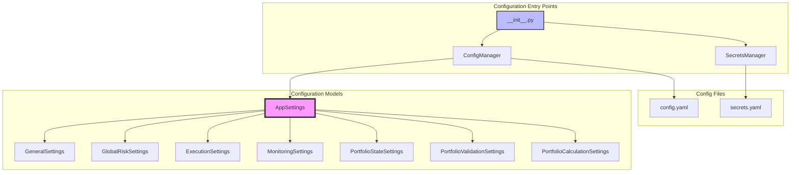
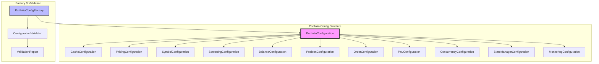
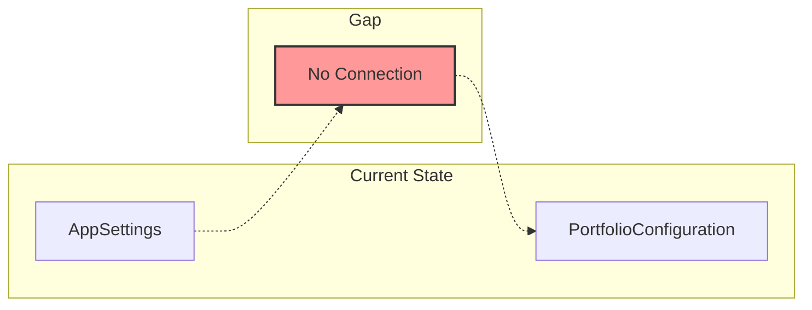
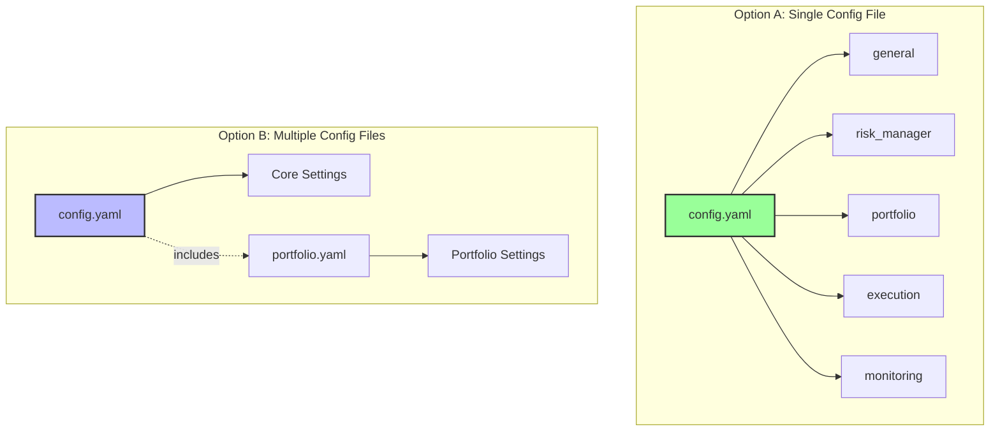
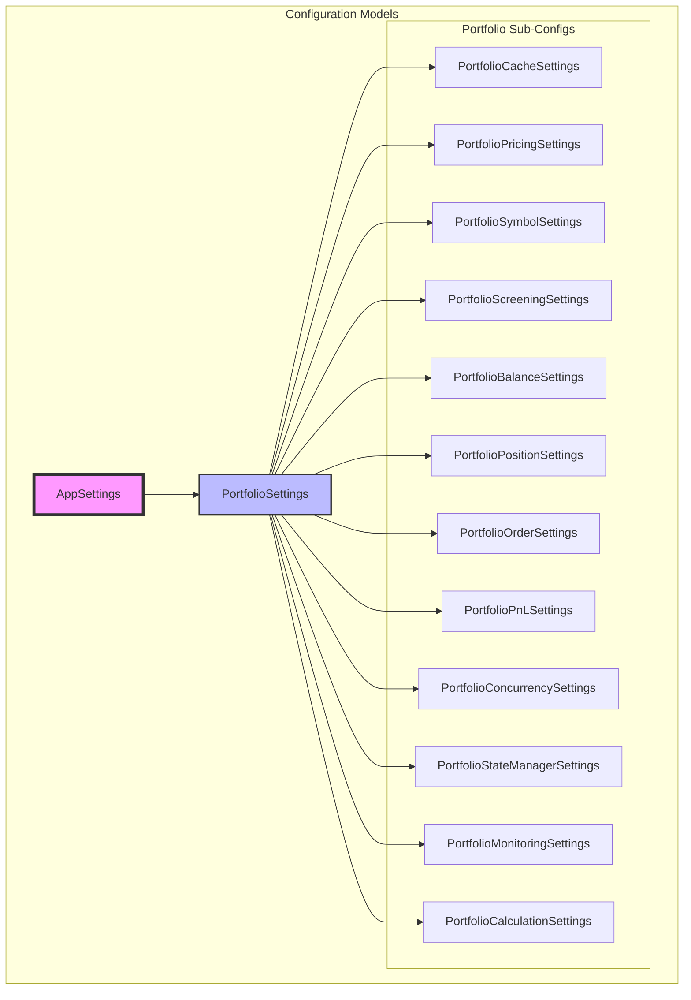
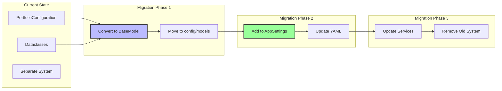
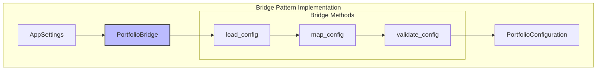
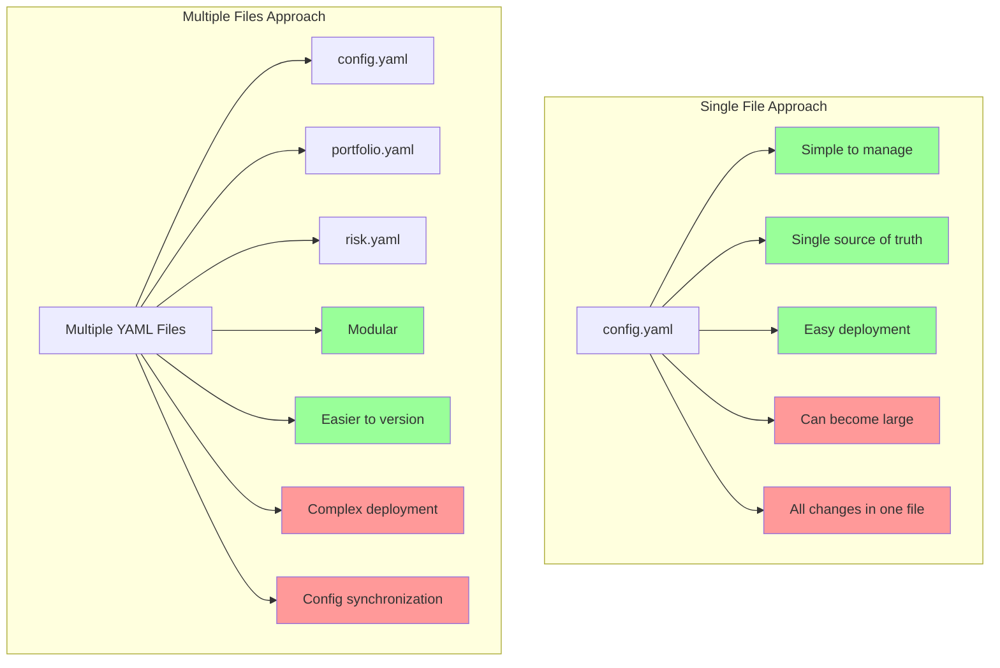
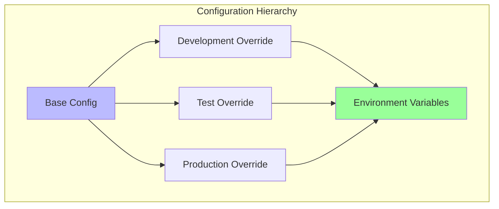

# Portfolio Configuration System Analysis Report

## Executive Summary

The CyberDelta Engine has two separate configuration systems for portfolio management:

1. **Main Configuration System** (`cyberdelta/config/`): Uses Pydantic BaseModel with centralized config management
2. **Portfolio-Specific Configuration** (`cyberdelta/core/portfolio/config/`): Uses Pydantic dataclasses with separate validation

The portfolio tracker configuration was recently removed from the main AppSettings, creating a gap that needs to be properly integrated.

## Current Architecture

### 1. Main Configuration System (`cyberdelta/config/`)



#### Key Characteristics:
- **Pydantic BaseModel**: All configurations use BaseModel with strict validation
- **Centralized Management**: Single entry point through `get_app_settings()`
- **Lazy Initialization**: Configuration loads on first access
- **Environment Support**: Config paths via environment variables
- **Model Config**: `ConfigDict(extra="forbid", frozen=True)` for immutability

#### Portfolio-Related Models in Main Config:

```python
# In config_models.py
class PortfolioStateSettings(BaseModel):
    persist_interval: float
    backup_count: int
    backup_directory: str
    atomic_updates: bool
    update_timeout: float
    max_concurrent_updates: int
    # ... validation settings

class PortfolioValidationSettings(BaseModel):
    enable_balance_validation: bool
    balance_tolerance: Decimal
    enable_position_validation: bool
    # ... more validation settings

class PortfolioCalculationSettings(BaseModel):
    pnl_calculation_method: str
    include_fees_in_pnl: bool
    # ... calculation settings
```

### 2. Portfolio-Specific Configuration (`cyberdelta/core/portfolio/config/`)



#### Key Characteristics:
- **Pydantic Dataclasses**: Uses `@dataclass` decorator
- **Separate Factory Pattern**: `PortfolioConfigFactory` for creating configs
- **Custom Validators**: Extensive field validation with custom exceptions
- **Environment-Based Creation**: `create_config_from_env()`
- **Predefined Configs**: Dev, Test, and Production configurations

#### Configuration Classes:

```python
@dataclass
class PortfolioConfiguration:
    cache: CacheConfiguration
    pricing: PricingConfiguration
    symbol: SymbolConfiguration
    screening: ScreeningConfiguration
    balance: BalanceConfiguration
    position: PositionConfiguration
    order: OrderConfiguration
    pnl: PnLConfiguration
    concurrency: ConcurrencyConfiguration
    state_manager: StateManagerConfiguration
    monitoring: MonitoringConfiguration
    debug_mode: bool
    log_level: str
```

## Configuration Gap Analysis

### Current Issues:

1. **Disconnected Systems**: Portfolio config is not integrated with main AppSettings
2. **No YAML Support**: Portfolio config lacks YAML loading capability
3. **Different Validation Patterns**: Dataclasses vs BaseModel
4. **Missing from AppSettings**: `portfolio_tracker` field was removed
5. **Initialization Gap**: No clear way to initialize portfolio config from main config



## Integration Recommendations

### Option 1: Full Integration into AppSettings (Recommended)

This approach fully integrates the portfolio configuration into the main AppSettings, providing a unified configuration system.

#### Configuration File Organization

Before implementing, we need to decide on the configuration file structure:



**Recommendation**: Use **Option A (Single Config File)** for simplicity and consistency with current architecture.

#### Detailed Implementation Architecture



#### Step-by-Step Implementation Guide

##### Step 1: Create Portfolio Model Classes

Create new file: `cyberdelta/config/models/portfolio_models.py`

```python
from decimal import Decimal
from typing import Literal
from pydantic import BaseModel, ConfigDict, Field, field_validator
from cyberdelta.config.models.config_types import ConfigDecimal, NonEmptyConfigString

class PortfolioCacheSettings(BaseModel):
    """Portfolio cache configuration settings."""
    
    model_config = ConfigDict(extra="forbid", frozen=True)
    
    enabled: bool = True
    max_size: int = Field(default=10000, gt=0, le=1000000)
    default_ttl: float = Field(default=3600.0, gt=0, le=86400)
    cleanup_interval: float = Field(default=300.0, gt=0, le=3600)
    stale_while_revalidate: float = Field(default=60.0, gt=0, le=600)
    enable_memory_optimization: bool = True
    cache_statistics_enabled: bool = True

class PortfolioPricingSettings(BaseModel):
    """Configuration for pricing services."""
    
    model_config = ConfigDict(extra="forbid", frozen=True)
    
    enabled: bool = True
    default_cache_ttl: float = Field(default=60.0, gt=0, le=3600)
    batch_size_limit: int = Field(default=50, gt=0, le=1000)
    price_staleness_threshold: float = Field(default=300.0, gt=0, le=3600)

class PortfolioCalculationSettings(BaseModel):
    """Portfolio calculation configuration."""
    
    model_config = ConfigDict(extra="forbid", frozen=True)
    
    # PnL calculation
    pnl_calculation_method: Literal["fifo", "lifo", "weighted_average"] = "weighted_average"
    include_fees_in_pnl: bool = True
    include_funding_in_pnl: bool = True
    
    # Exposure calculation
    max_exposure_calculation_depth: int = Field(default=100, gt=0, le=1000)
    group_by_base_asset: bool = True
    exposure_update_interval: float = Field(default=5.0, gt=0, le=60)
    
    # Performance metrics
    calculate_sharpe_ratio: bool = True
    sharpe_lookback_days: int = Field(default=30, gt=0, le=365)
    calculate_max_drawdown: bool = True
    performance_update_interval: float = Field(default=300.0, gt=0, le=3600)
    risk_free_rate: ConfigDecimal = Field(default=Decimal("0.02"), ge=Decimal(0), le=Decimal(1))
    default_volatility: ConfigDecimal = Field(default=Decimal("0.2"), gt=Decimal(0), le=Decimal(2))

# ... (other settings classes)

class PortfolioSettings(BaseModel):
    """Main portfolio configuration settings."""
    
    model_config = ConfigDict(extra="forbid", frozen=True)
    
    # Component configurations
    cache: PortfolioCacheSettings = Field(default_factory=PortfolioCacheSettings)
    pricing: PortfolioPricingSettings = Field(default_factory=PortfolioPricingSettings)
    calculation: PortfolioCalculationSettings = Field(default_factory=PortfolioCalculationSettings)
    # ... other components
    
    # Global portfolio settings
    base_currency: NonEmptyConfigString = "USDC"
    data_freshness_seconds: int = Field(default=60, gt=0, le=300)
    debug_mode: bool = False
    
    @field_validator("base_currency")
    @classmethod
    def validate_base_currency(cls, v: str) -> str:
        """Validate base currency is supported."""
        supported = {"USDC", "USDT", "USD"}
        if v not in supported:
            raise ValueError(f"Base currency must be one of {supported}")
        return v
```

##### Step 2: Update AppSettings

```python
# In config_models.py

from cyberdelta.config.models.portfolio_models import PortfolioSettings

class AppSettings(BaseModel):
    """Root configuration model."""
    
    model_config = ConfigDict(extra="forbid", frozen=True)
    
    general: GeneralSettings
    exchange_specific: dict[ExchangeName, ExchangeSpecificConfig]
    risk_manager: GlobalRiskSettings
    checker: CheckerSettings
    sizing: SizingSettings
    enhanced_risk: EnhancedRiskSettings
    execution: ExecutionSettings
    circuit_breaker: CircuitBreakerSettings
    position_reconciliation: PositionReconciliationSettings
    balance_monitoring: BalanceMonitoringSettings
    safety_systems: SafetySystemsSettings
    monitoring: MonitoringSettings
    portfolio: PortfolioSettings  # NEW FIELD
    symbols: SmartSymbolsConfig
    
    @model_validator(mode="after")
    def validate_portfolio_integration(self) -> Self:
        """Ensure portfolio settings are consistent with other settings."""
        # Validate that portfolio base currency matches risk settings
        if hasattr(self.risk_manager, 'base_currency'):
            if self.portfolio.base_currency != self.risk_manager.base_currency:
                raise ValueError(
                    f"Portfolio base currency {self.portfolio.base_currency} "
                    f"must match risk manager base currency {self.risk_manager.base_currency}"
                )
        return self
```

##### Step 3: Update config.yaml Structure

```yaml
# config.yaml - Full example with portfolio section

general:
  log_level: INFO
  safe_mode: true
  state_file: data/state.json

risk_manager:
  base_currency: USDC
  max_position_size: 10000
  max_leverage: 3.0
  # ... other risk settings

# NEW PORTFOLIO SECTION
portfolio:
  # Global portfolio settings
  base_currency: USDC
  data_freshness_seconds: 60
  debug_mode: false
  
  # Cache configuration
  cache:
    enabled: true
    max_size: 10000
    default_ttl: 3600
    cleanup_interval: 300
    stale_while_revalidate: 60
    enable_memory_optimization: true
    cache_statistics_enabled: true
  
  # Pricing configuration
  pricing:
    enabled: true
    default_cache_ttl: 60
    batch_size_limit: 50
    price_staleness_threshold: 300
  
  # Calculation configuration
  calculation:
    # PnL settings
    pnl_calculation_method: weighted_average
    include_fees_in_pnl: true
    include_funding_in_pnl: true
    
    # Exposure settings
    max_exposure_calculation_depth: 100
    group_by_base_asset: true
    exposure_update_interval: 5.0
    
    # Performance metrics
    calculate_sharpe_ratio: true
    sharpe_lookback_days: 30
    calculate_max_drawdown: true
    performance_update_interval: 300
    risk_free_rate: "0.02"
    default_volatility: "0.2"
  
  # State management
  state_manager:
    auto_cleanup_enabled: true
    cleanup_interval: 300
    strict_validation: true
    enable_snapshots: true
    snapshot_interval: 3600
  
  # Monitoring
  monitoring:
    enabled: true
    metrics_interval: 60
    health_check_interval: 30
    performance_tracking: true
  
  # Balance management
  balance:
    auto_cleanup_enabled: true
    cleanup_interval: 300
    max_balance_age: 3600
    precision: 8
  
  # Position management
  position:
    auto_cleanup_enabled: true
    cleanup_interval: 300
    max_position_age: 3600
    precision: 8
  
  # ... other portfolio sub-configurations

execution:
  max_retries: 3
  timeout: 30
  # ... other execution settings
```

##### Step 4: Migration Strategy



##### Step 5: Service Integration

```python
# Example: PortfolioStateManager using new config

from cyberdelta.config import get_app_settings

class PortfolioStateManager:
    """Portfolio state manager with integrated configuration."""
    
    def __init__(self, 
                 state_container: StateContainerProtocol,
                 validation_service: ValidationServiceProtocol | None = None,
                 metrics_collector: MetricsCollectorProtocol | None = None):
        # Get configuration from AppSettings
        app_settings = get_app_settings()
        self.portfolio_config = app_settings.portfolio
        
        # Use specific configurations
        self.cache_config = self.portfolio_config.cache
        self.state_config = self.portfolio_config.state_manager
        self.calculation_config = self.portfolio_config.calculation
        
        # Initialize with config values
        self.atomic_updates = self.state_config.strict_validation
        self.cache_enabled = self.cache_config.enabled
        self.base_currency = self.portfolio_config.base_currency
        
        # ... rest of initialization
```

##### Step 6: Environment Variable Support

The Pydantic BaseModel integration automatically supports environment variables:

```bash
# Override portfolio settings via environment variables
export PORTFOLIO__BASE_CURRENCY=USDT
export PORTFOLIO__CACHE__MAX_SIZE=50000
export PORTFOLIO__CALCULATION__PNL_CALCULATION_METHOD=fifo
export PORTFOLIO__DEBUG_MODE=true
```

#### Benefits of Full Integration

1. **Single Source of Truth**: All configuration in one place
2. **Consistent Validation**: Pydantic BaseModel throughout
3. **YAML Support**: Full configuration via YAML files
4. **Environment Variables**: Override any setting via env vars
5. **Type Safety**: Full type hints and validation
6. **Cross-Validation**: Can validate portfolio settings against other settings
7. **Simplified Testing**: Easy to mock entire configuration

#### Migration Checklist

- [ ] Create portfolio_models.py with all BaseModel classes
- [ ] Add PortfolioSettings to AppSettings
- [ ] Update config.yaml with portfolio section
- [ ] Update ConfigManager to handle portfolio settings
- [ ] Migrate PortfolioStateManager to use new config
- [ ] Migrate PortfolioServiceFactory to use new config
- [ ] Update all portfolio services to use app_settings.portfolio
- [ ] Remove old portfolio configuration system
- [ ] Update tests to use new configuration
- [ ] Update documentation

### Option 2: Bridge Pattern



### Option 3: Service-Level Configuration

Keep configurations separate but use dependency injection pattern:

```python
class PortfolioServiceProvider:
    """Service provider that manages portfolio configuration."""
    
    def __init__(self, app_settings: AppSettings):
        self.app_settings = app_settings
        self._portfolio_config: PortfolioConfiguration | None = None
    
    @property
    def portfolio_config(self) -> PortfolioConfiguration:
        if self._portfolio_config is None:
            self._portfolio_config = self._create_portfolio_config()
        return self._portfolio_config
    
    def _create_portfolio_config(self) -> PortfolioConfiguration:
        # Map AppSettings values to PortfolioConfiguration
        env = os.getenv("ENVIRONMENT", "production")
        
        if env == "development":
            return PortfolioConfiguration.create_development()
        elif env == "test":
            return PortfolioConfiguration.create_test()
        else:
            return PortfolioConfiguration.create_production()
```

## Configuration File Organization Deep Dive

### Single vs Multiple Configuration Files



### Recommended: Single File with Logical Sections

```yaml
# config.yaml - Organized by functional areas
# ~300-500 lines is manageable for a single file

# 1. General Settings (10-20 lines)
general:
  log_level: INFO
  safe_mode: true

# 2. Exchange Configuration (50-100 lines)
exchange_specific:
  BACKPACK:
    # ...
  HYPERLIQUID:
    # ...

# 3. Risk Management (50-80 lines)
risk_manager:
  # ...

# 4. Portfolio Configuration (100-150 lines)
portfolio:
  cache:
    # ...
  pricing:
    # ...
  calculation:
    # ...
  # ... other subsections

# 5. Execution & Safety (50-80 lines)
execution:
  # ...
safety_systems:
  # ...

# 6. Monitoring (20-30 lines)
monitoring:
  # ...

# 7. Symbols (50-100 lines)
symbols:
  # ...
```

## Environment-Specific Configurations

### Development vs Production Patterns



### Example Environment Configurations

```python
# portfolio_models.py - Factory methods for different environments

class PortfolioSettings(BaseModel):
    """Main portfolio configuration settings."""
    
    @classmethod
    def create_development_defaults(cls) -> dict[str, Any]:
        """Development-friendly defaults."""
        return {
            "debug_mode": True,
            "cache": {
                "max_size": 1000,
                "default_ttl": 60,  # 1 minute for faster feedback
                "cleanup_interval": 30,
            },
            "pricing": {
                "default_cache_ttl": 10,  # Very short for development
                "batch_size_limit": 10,
            },
            "calculation": {
                "performance_update_interval": 60,  # More frequent updates
            },
            "monitoring": {
                "metrics_interval": 10,
                "health_check_interval": 10,
            }
        }
    
    @classmethod
    def create_production_defaults(cls) -> dict[str, Any]:
        """Production-optimized defaults."""
        return {
            "debug_mode": False,
            "cache": {
                "max_size": 50000,
                "default_ttl": 3600,  # 1 hour
                "cleanup_interval": 300,
                "enable_memory_optimization": True,
            },
            "pricing": {
                "default_cache_ttl": 300,  # 5 minutes
                "batch_size_limit": 100,
            },
            "calculation": {
                "performance_update_interval": 300,
                "calculate_sharpe_ratio": True,
                "calculate_max_drawdown": True,
            },
            "monitoring": {
                "enabled": True,
                "metrics_interval": 60,
                "performance_tracking": True,
            }
        }
    
    @classmethod
    def create_test_defaults(cls) -> dict[str, Any]:
        """Test-friendly defaults."""
        return {
            "debug_mode": True,
            "cache": {
                "max_size": 100,
                "default_ttl": 1,  # Minimal caching
                "enabled": False,  # Disable for predictable tests
            },
            "calculation": {
                "performance_update_interval": 1,
            },
            "state_manager": {
                "auto_cleanup_enabled": False,  # Manual control in tests
                "strict_validation": True,
            }
        }
```

### Environment Variable Override Strategy

```bash
# Development environment
export ENVIRONMENT=development
export PORTFOLIO__DEBUG_MODE=true
export PORTFOLIO__CACHE__MAX_SIZE=1000

# Production environment
export ENVIRONMENT=production
export PORTFOLIO__CACHE__MAX_SIZE=100000
export PORTFOLIO__MONITORING__ENABLED=true

# Test environment
export ENVIRONMENT=test
export PORTFOLIO__CACHE__ENABLED=false
export PORTFOLIO__STATE_MANAGER__AUTO_CLEANUP_ENABLED=false
```

## Validation and Safety

### Cross-Configuration Validation

```python
class AppSettings(BaseModel):
    """Root configuration with cross-validation."""
    
    @model_validator(mode="after")
    def validate_consistency(self) -> Self:
        """Ensure configuration consistency across modules."""
        
        # 1. Currency consistency
        currencies = {
            self.risk_manager.base_currency,
            self.portfolio.base_currency,
            # Add other currency fields
        }
        if len(currencies) > 1:
            raise ValueError(f"Inconsistent base currencies: {currencies}")
        
        # 2. Risk limits consistency
        if self.portfolio.calculation.leverage_warning_threshold > self.risk_manager.max_leverage:
            raise ValueError(
                "Portfolio leverage warning threshold cannot exceed "
                "risk manager max leverage"
            )
        
        # 3. Performance settings
        if self.portfolio.monitoring.metrics_interval < self.monitoring.update_interval:
            raise ValueError(
                "Portfolio metrics interval cannot be less than "
                "global monitoring interval"
            )
        
        return self
```

## Best Practices for Portfolio Configuration

1. **Use Descriptive Names**: `price_staleness_threshold` not `pst`
2. **Group Related Settings**: All cache settings under `cache:`
3. **Provide Sensible Defaults**: Every field should have a reasonable default
4. **Document Units**: Use comments to specify seconds, milliseconds, etc.
5. **Validate Ranges**: Use Pydantic Field constraints
6. **Environment Overrides**: Support env vars for all critical settings

## Example: Complete Portfolio Section

```yaml
# Complete portfolio configuration section
portfolio:
  # Global settings
  base_currency: USDC
  data_freshness_seconds: 60
  debug_mode: false
  
  # Cache configuration
  cache:
    enabled: true
    max_size: 10000  # Maximum number of cached items
    default_ttl: 3600  # Time to live in seconds (1 hour)
    cleanup_interval: 300  # Cleanup interval in seconds
    stale_while_revalidate: 60  # Grace period for stale data
    enable_memory_optimization: true
    cache_statistics_enabled: true
  
  # Pricing service configuration
  pricing:
    enabled: true
    default_cache_ttl: 60  # Price cache TTL in seconds
    batch_size_limit: 50  # Max symbols per batch request
    price_staleness_threshold: 300  # Max age for price data
  
  # Symbol management
  symbol:
    fallback_enabled: true
    strict_mode: false
    symbol_validation_enabled: true
    cache_enabled: true
  
  # Data screening
  screening:
    strict_mode: false
    allow_zero_quantities: false
    allow_negative_prices: false
    max_price_value: "1000000"
    max_quantity_value: "1000000"
    min_price_value: "0.00001"
    min_quantity_value: "0.00001"
    require_trade_id: true
    require_exchange_id: true
    symbol_validation_enabled: true
    log_validation_errors: true
    log_validation_warnings: true
  
  # Balance management
  balance:
    auto_cleanup_enabled: true
    cleanup_interval: 300  # seconds
    max_balance_age: 3600  # seconds
    precision: 8  # decimal places
  
  # Position management
  position:
    auto_cleanup_enabled: true
    cleanup_interval: 300
    max_position_age: 3600
    precision: 8
  
  # Order management
  order:
    max_orders_per_exchange: 1000
    cleanup_completed_orders: true
    auto_cleanup_enabled: true
    cleanup_interval: 300
  
  # P&L configuration
  pnl:
    calculation_method: weighted_average  # fifo, lifo, weighted_average
    precision: 8
    cache_results: true
    real_time_updates: true
  
  # Concurrency control
  concurrency:
    max_concurrent_operations: 10
    lock_timeout: 30.0  # seconds
    deadlock_detection: true
  
  # State management
  state_manager:
    auto_cleanup_enabled: true
    cleanup_interval: 300
    strict_validation: true
    enable_snapshots: true
    snapshot_interval: 3600  # 1 hour
  
  # Monitoring
  monitoring:
    enabled: true
    metrics_interval: 60  # seconds
    health_check_interval: 30  # seconds
    performance_tracking: true
  
  # Calculation engine
  calculation:
    # PnL calculation
    pnl_calculation_method: weighted_average
    include_fees_in_pnl: true
    include_funding_in_pnl: true
    
    # Exposure calculation
    max_exposure_calculation_depth: 100
    group_by_base_asset: true
    exposure_update_interval: 5.0
    
    # Performance metrics
    calculate_sharpe_ratio: true
    sharpe_lookback_days: 30
    calculate_max_drawdown: true
    performance_update_interval: 300
    risk_free_rate: "0.02"  # 2% annual
    default_volatility: "0.2"  # 20% annual
    stress_scenario_move: "0.1"  # 10% move
    var_confidence_level: "0.95"  # 95% VaR
    leverage_warning_threshold: "3.0"
    
    # Caching for calculations
    realized_pnl_method: weighted_average
    price_cache_ttl: 60
    batch_size_limit: 100
    price_staleness_threshold: 300
```

## Conclusion

The portfolio configuration system needs to be integrated into the main configuration system for consistency and maintainability. The recommended approach is **Option 1 (Full Integration)** with a **single configuration file**, which provides:

### Benefits
1. **Single Source of Truth**: All configuration in one place
2. **Consistent Validation**: Pydantic BaseModel throughout
3. **YAML Support**: Full configuration via YAML files
4. **Environment Variables**: Override any setting via env vars
5. **Type Safety**: Full type hints and validation
6. **Cross-Validation**: Can validate portfolio settings against other settings
7. **Simplified Testing**: Easy to mock entire configuration

### Implementation Priority
1. **High Priority**: Convert dataclasses to BaseModel (1-2 days)
2. **High Priority**: Add portfolio section to AppSettings (1 day)
3. **Medium Priority**: Update services to use new config (2-3 days)
4. **Low Priority**: Remove old configuration system (1 day)

### Success Metrics
- All portfolio services use `app_settings.portfolio`
- Zero configuration-related runtime errors
- Simplified test setup with mock configurations
- Consistent configuration patterns across the codebase

This integration will resolve the current gap created by removing `portfolio_tracker` and provide a clean, maintainable configuration system for the portfolio module that aligns with the rest of the CyberDelta Engine architecture.