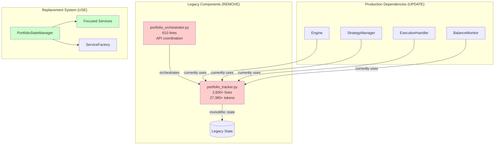

# Week 3: Legacy Code Removal - Clean Break Approach

**Duration:** Week 3 (2025-08-11 to 2025-08-17)
**Approach:** Clean Break - No Backward Compatibility
**Priority:** Critical
**Objective:** Remove PortfolioTracker and PortfolioOrchestrator legacy components entirely

## Overview

After Weeks 1-2 established clean type system and focused services, Week 3 eliminates the legacy monolithic components completely. The 2,600+ line PortfolioTracker and 610-line PortfolioOrchestrator will be removed and replaced with the modular system.

**Clean Break Strategy:**
- ❌ No adapters or compatibility wrappers
- ❌ No gradual migration or feature flags
- ✅ Complete removal of legacy files
- ✅ All dependencies updated to use modular system

## Legacy System Analysis

### Components for Complete Removal



### Legacy Dependency Analysis

```python
# Find all imports of legacy components
legacy_imports = {
    "portfolio_tracker": [
        "from cyberdelta.core.portfolio_tracker import PortfolioTracker",
        "from ..portfolio_tracker import PortfolioTracker",
        "import cyberdelta.core.portfolio_tracker",
    ],
    "portfolio_orchestrator": [
        "from cyberdelta.core.portfolio_orchestrator import PortfolioOrchestrator",
        "from ..portfolio_orchestrator import PortfolioOrchestrator",
        "import cyberdelta.core.portfolio_orchestrator",
    ]
}
```

## Week 3 Deliverables

### Day 1-2: Legacy Usage Analysis & Replacement Plan

- [ ] **Complete Legacy Usage Audit**
  ```bash
  # Find all legacy component usage
  rg "PortfolioTracker" --type py -C 3
  rg "PortfolioOrchestrator" --type py -C 3
  rg "portfolio_tracker" --type py
  rg "portfolio_orchestrator" --type py
  ```

- [ ] **Map Legacy Methods to Modular Equivalents**
  ```python
  method_mapping = {
      # PortfolioTracker -> PortfolioStateManager
      "get_total_capital": "portfolio_state_manager.get_total_capital",
      "get_positions": "portfolio_state_manager.get_positions",
      "get_balances": "portfolio_state_manager.get_balances",
      "update_balance": "portfolio_state_manager.update_balance",
      "update_position": "portfolio_state_manager.update_position",
      "calculate_unrealized_pnl": "performance_analytics.calculate_performance",
      "get_exposure_metrics": "risk_analytics.calculate_exposure",

      # PortfolioOrchestrator -> Direct API Integration
      "full_reconciliation": "portfolio_reconciliation_service.reconcile_all",
      "update_portfolio_data": "portfolio_data_service.update_from_apis",
      "get_exchange_data": "exchange_service.fetch_portfolio_data",
  }
  ```

- [ ] **Create Replacement Implementation Map**
  ```python
  replacement_plan = {
      "Engine": {
          "current": "PortfolioTracker direct usage",
          "replacement": "PortfolioStateManager via ServiceFactory",
          "breaking_changes": ["Method signatures", "Return types", "Error handling"]
      },
      "StrategyManager": {
          "current": "PortfolioTracker state queries",
          "replacement": "PerformanceAnalyticsService + RiskAnalyticsService",
          "breaking_changes": ["Async methods", "Pydantic models", "Exception types"]
      },
      "ExecutionHandler": {
          "current": "PortfolioTracker position updates",
          "replacement": "PortfolioStateManager update methods",
          "breaking_changes": ["Event-driven updates", "Validation logic"]
      }
  }
  ```

### Day 3-4: Production Component Updates

- [ ] **Update Engine Component**
  ```python
  # BEFORE: Engine using legacy PortfolioTracker
  from cyberdelta.core.portfolio_tracker import PortfolioTracker

  class Engine:
      def __init__(self, portfolio_tracker: PortfolioTracker):
          self.portfolio = portfolio_tracker

      async def get_portfolio_capital(self) -> Decimal:
          return await self.portfolio.get_total_capital()

  # AFTER: Engine using modular system
  from cyberdelta.core.portfolio.services import PortfolioServiceFactory
  from cyberdelta.core.portfolio.portfolio_types.protocols import PortfolioManagerProtocol

  class Engine:
      def __init__(self, service_factory: PortfolioServiceFactory):
          self.portfolio_manager = service_factory.create_portfolio_state_manager()
          self.performance_analytics = service_factory.create_performance_analytics()

      async def get_portfolio_capital(self) -> Decimal:
          portfolio_state = await self.portfolio_manager.get_current_state()
          performance = await self.performance_analytics.calculate_performance(portfolio_state)
          return performance.total_capital
  ```

- [ ] **Update StrategyManager Component**
  ```python
  # BEFORE: StrategyManager using legacy methods
  from cyberdelta.core.portfolio_tracker import PortfolioTracker

  class StrategyManager:
      def __init__(self, portfolio_tracker: PortfolioTracker):
          self.portfolio = portfolio_tracker

      async def check_risk_limits(self) -> bool:
          exposure = await self.portfolio.get_exposure_metrics()
          return exposure.total_exposure < self.max_exposure

  # AFTER: StrategyManager using focused services
  from cyberdelta.core.portfolio.services import PortfolioServiceFactory
  from cyberdelta.core.portfolio.portfolio_types.models import ExposureMetrics

  class StrategyManager:
      def __init__(self, service_factory: PortfolioServiceFactory):
          self.portfolio_manager = service_factory.create_portfolio_state_manager()
          self.risk_analytics = service_factory.create_risk_analytics()

      async def check_risk_limits(self) -> bool:
          portfolio_state = await self.portfolio_manager.get_current_state()
          exposure_result = await self.risk_analytics.calculate_exposure(portfolio_state)
          return exposure_result.total_exposure < self.max_exposure
  ```

- [ ] **Update ExecutionHandler Component**
  ```python
  # BEFORE: ExecutionHandler using legacy updates
  from cyberdelta.core.portfolio_tracker import PortfolioTracker

  class ExecutionHandler:
      def __init__(self, portfolio_tracker: PortfolioTracker):
          self.portfolio = portfolio_tracker

      async def handle_trade_execution(self, trade_data: dict):
          await self.portfolio.update_position(trade_data)
          await self.portfolio.update_balance(trade_data)

  # AFTER: ExecutionHandler using event-driven updates
  from cyberdelta.core.portfolio.services import PortfolioServiceFactory
  from cyberdelta.core.portfolio.portfolio_types.infrastructure import PortfolioEvent, EventType

  class ExecutionHandler:
      def __init__(self, service_factory: PortfolioServiceFactory):
          self.portfolio_manager = service_factory.create_portfolio_state_manager()
          self.event_dispatcher = service_factory.create_event_dispatcher()

      async def handle_trade_execution(self, trade_data: dict):
          # Create portfolio event
          event = PortfolioEvent(
              event_type=EventType.TRADE_EXECUTED,
              exchange_id=trade_data["exchange_id"],
              timestamp=datetime.utcnow(),
              data=trade_data
          )

          # Dispatch event - portfolio manager will handle updates
          await self.event_dispatcher.dispatch(event)
  ```

### Day 5-6: API Integration Replacement

- [ ] **Replace PortfolioOrchestrator with Direct Integration**
  ```python
  # NEW: Portfolio Reconciliation Service
  from cyberdelta.core.portfolio.services import PortfolioServiceFactory
  from cyberdelta.core.portfolio.portfolio_types.models import PortfolioState

  class PortfolioReconciliationService:
      """Replaces PortfolioOrchestrator with clean service architecture."""

      def __init__(self, service_factory: PortfolioServiceFactory):
          self.portfolio_manager = service_factory.create_portfolio_state_manager()
          self.exchange_service = service_factory.create_exchange_service()
          self.validation_service = service_factory.create_validation_service()
          self.event_dispatcher = service_factory.create_event_dispatcher()

      async def reconcile_all_exchanges(self) -> None:
          """Full portfolio reconciliation across all exchanges."""

          # Fetch data from all exchanges in parallel
          exchange_data = await self.exchange_service.fetch_all_portfolio_data()

          # Validate incoming data
          validation_result = await self.validation_service.validate_portfolio_data(exchange_data)
          if not validation_result.is_valid:
              await self._handle_validation_errors(validation_result)
              return

          # Update portfolio state
          await self.portfolio_manager.update_from_exchange_data(exchange_data)

          # Dispatch reconciliation complete event
          event = PortfolioEvent(
              event_type=EventType.RECONCILIATION_COMPLETE,
              exchange_id="all",
              timestamp=datetime.utcnow(),
              data={"exchange_count": len(exchange_data)}
          )
          await self.event_dispatcher.dispatch(event)

      async def reconcile_exchange(self, exchange_id: str) -> None:
          """Reconcile specific exchange."""

          # Fetch data from specific exchange
          exchange_data = await self.exchange_service.fetch_exchange_data(exchange_id)

          # Update portfolio state for this exchange
          await self.portfolio_manager.update_exchange_data(exchange_id, exchange_data)
  ```

- [ ] **Create Exchange Data Service**
  ```python
  # NEW: Exchange Data Service (replaces orchestrator API calls)
  from cyberdelta.core.portfolio.services.base_service import BasePortfolioService

  class ExchangeDataService(BasePortfolioService):
      """Handles all exchange API interactions for portfolio data."""

      def __init__(self, service_name: str = "exchange_data"):
          super().__init__(service_name)
          # Inject exchange APIs via dependency injection
          self.hyperliquid_api = None
          self.backpack_api = None

      async def fetch_all_portfolio_data(self) -> dict[str, dict]:
          """Fetch portfolio data from all exchanges in parallel."""

          tasks = []
          if self.hyperliquid_api:
              tasks.append(self._fetch_hyperliquid_data())
          if self.backpack_api:
              tasks.append(self._fetch_backpack_data())

          results = await asyncio.gather(*tasks, return_exceptions=True)

          exchange_data = {}
          for result in results:
              if isinstance(result, Exception):
                  # Log error but continue with other exchanges
                  self._log_exchange_error(result)
                  continue
              exchange_data.update(result)

          return exchange_data

      async def _fetch_hyperliquid_data(self) -> dict[str, dict]:
          """Fetch Hyperliquid portfolio data."""
          return {
              "hyperliquid": {
                  "balances": await self.hyperliquid_api.get_balances(),
                  "positions": await self.hyperliquid_api.get_positions(),
                  "orders": await self.hyperliquid_api.get_orders()
              }
          }

      async def _fetch_backpack_data(self) -> dict[str, dict]:
          """Fetch Backpack portfolio data."""
          return {
              "backpack": {
                  "balances": await self.backpack_api.get_balances(),
                  "positions": await self.backpack_api.get_positions(),
                  "orders": await self.backpack_api.get_orders()
              }
          }
  ```

### Day 7: Complete Legacy Removal

- [ ] **Remove Legacy Files Completely**
  ```bash
  # Delete legacy components entirely
  rm cyberdelta/core/portfolio_tracker.py
  rm cyberdelta/core/portfolio_orchestrator.py

  # Remove any legacy test files
  rm tests/unit/test_portfolio_tracker.py
  rm tests/unit/test_portfolio_orchestrator.py
  rm tests/integration/test_portfolio_orchestration.py
  ```

- [ ] **Update All Import Statements**
  ```python
  #!/usr/bin/env python3
  """Remove all legacy portfolio component imports."""

  import re
  from pathlib import Path

  def remove_legacy_imports():
      """Remove all imports of legacy portfolio components."""

      # Legacy import patterns to remove
      legacy_patterns = [
          r"from cyberdelta\.core\.portfolio_tracker import.*",
          r"from \.\.portfolio_tracker import.*",
          r"import cyberdelta\.core\.portfolio_tracker.*",
          r"from cyberdelta\.core\.portfolio_orchestrator import.*",
          r"from \.\.portfolio_orchestrator import.*",
          r"import cyberdelta\.core\.portfolio_orchestrator.*",
      ]

      # Find all Python files
      for py_file in Path("cyberdelta").rglob("*.py"):
          content = py_file.read_text()
          original_content = content

          # Remove legacy import lines
          for pattern in legacy_patterns:
              content = re.sub(pattern, "# REMOVED: Legacy import", content, flags=re.MULTILINE)

          # Clean up empty lines and comments
          lines = content.splitlines()
          cleaned_lines = []
          for line in lines:
              if line.strip() and not line.strip().startswith("# REMOVED:"):
                  cleaned_lines.append(line)

          content = "\n".join(cleaned_lines)

          if content != original_content:
              py_file.write_text(content)
              print(f"Removed legacy imports from {py_file}")

  if __name__ == "__main__":
      remove_legacy_imports()
  ```

- [ ] **Update Configuration and Initialization**
  ```python
  # Update main application initialization

  # BEFORE: Legacy component initialization
  def initialize_portfolio_system():
      portfolio_tracker = PortfolioTracker(config)
      portfolio_orchestrator = PortfolioOrchestrator(portfolio_tracker, apis)
      return portfolio_tracker, portfolio_orchestrator

  # AFTER: Modular system initialization
  def initialize_portfolio_system():
      service_factory = PortfolioServiceFactory()

      # Initialize all services
      portfolio_manager = service_factory.create_portfolio_state_manager()
      reconciliation_service = service_factory.create_reconciliation_service()

      # Initialize the service factory
      await service_factory.initialize_all()

      return service_factory
  ```

## Legacy Method Replacement Guide

### Critical Methods Mapping

```python
legacy_method_replacements = {
    # Portfolio State Queries
    "portfolio_tracker.get_total_capital()":
        "performance_analytics.calculate_performance(state).total_capital",

    "portfolio_tracker.get_positions(exchange_id)":
        "portfolio_manager.get_positions(exchange_id)",

    "portfolio_tracker.get_balances(exchange_id)":
        "portfolio_manager.get_balances(exchange_id)",

    "portfolio_tracker.get_exposure_metrics()":
        "risk_analytics.calculate_exposure(portfolio_state)",

    # Portfolio Updates
    "portfolio_tracker.update_balance(data)":
        "portfolio_manager.process_balance_update(balance_event)",

    "portfolio_tracker.update_position(data)":
        "portfolio_manager.process_position_update(position_event)",

    "portfolio_tracker.handle_order_update(data)":
        "portfolio_manager.process_order_update(order_event)",

    # Orchestration Operations
    "portfolio_orchestrator.full_reconciliation()":
        "reconciliation_service.reconcile_all_exchanges()",

    "portfolio_orchestrator.update_portfolio_data()":
        "exchange_data_service.fetch_and_update_all()",
}
```

### Error Handling Updates

```python
# BEFORE: Legacy exception handling
try:
    capital = await portfolio_tracker.get_total_capital()
except Exception as e:
    logger.error(f"Portfolio error: {e}")

# AFTER: Specific exception handling with modular system
from cyberdelta.core.portfolio.portfolio_types.infrastructure import (
    CalculationError, StateError, ValidationResult
)

try:
    portfolio_state = await portfolio_manager.get_current_state()
    performance = await performance_analytics.calculate_performance(portfolio_state)
    capital = performance.total_capital
except CalculationError as e:
    logger.error(f"Performance calculation failed: {e}")
except StateError as e:
    logger.error(f"Portfolio state error: {e}")
except Exception as e:
    logger.error(f"Unexpected portfolio error: {e}")
```

## Testing Strategy

### Legacy Removal Validation

- [ ] **Import Verification**
  ```bash
  # Verify no legacy imports remain
  rg "portfolio_tracker|portfolio_orchestrator" --type py cyberdelta/

  # Should return no results if cleanup successful
  ```

- [ ] **Component Integration Testing**
  ```python
  async def test_legacy_replacement_integration():
      """Test that all production components work without legacy system."""

      # Initialize modular system
      service_factory = PortfolioServiceFactory()
      await service_factory.initialize_all()

      # Test Engine integration
      engine = Engine(service_factory)
      capital = await engine.get_portfolio_capital()
      assert isinstance(capital, Decimal)

      # Test StrategyManager integration
      strategy_mgr = StrategyManager(service_factory)
      risk_ok = await strategy_mgr.check_risk_limits()
      assert isinstance(risk_ok, bool)

      # Test ExecutionHandler integration
      exec_handler = ExecutionHandler(service_factory)
      await exec_handler.handle_trade_execution(test_trade_data)

      # Verify no exceptions and proper functionality
      await service_factory.shutdown_all()
  ```

- [ ] **Performance Verification**
  ```python
  async def test_performance_no_regression():
      """Verify performance didn't regress after legacy removal."""

      service_factory = PortfolioServiceFactory()
      await service_factory.initialize_all()

      # Benchmark key operations
      start_time = time.time()

      # Test portfolio state retrieval
      portfolio_state = await service_factory.portfolio_manager.get_current_state()

      # Test performance calculation
      performance = await service_factory.performance_analytics.calculate_performance(portfolio_state)

      # Test risk calculation
      risk_result = await service_factory.risk_analytics.calculate_exposure(portfolio_state)

      total_time = time.time() - start_time

      # Should be faster than legacy system due to focused services
      assert total_time < 1.0  # 1 second benchmark

      await service_factory.shutdown_all()
  ```

## Breaking Changes Documentation

### API Changes

```python
breaking_changes = {
    "Method Signatures": {
        "before": "get_total_capital() -> float",
        "after": "calculate_performance(state).total_capital -> Decimal"
    },
    "Return Types": {
        "before": "dict with mixed types",
        "after": "Pydantic models with type safety"
    },
    "Error Handling": {
        "before": "Generic Exception",
        "after": "Specific typed exceptions (CalculationError, StateError)"
    },
    "Async Patterns": {
        "before": "Mixed sync/async methods",
        "after": "Fully async with proper event handling"
    }
}
```

### Migration Requirements

- [ ] **Update All Calling Code**
  - Engine component method calls
  - StrategyManager integration
  - ExecutionHandler updates
  - Test files and mocks

- [ ] **Configuration Updates**
  - Remove legacy configuration sections
  - Add modular system configuration
  - Update initialization sequences

- [ ] **Documentation Updates**
  - API documentation
  - Architecture diagrams
  - Developer onboarding guides

## Risk Management

### Technical Risks

1. **Integration Failures**
   - **Risk**: Production components fail after legacy removal
   - **Mitigation**: Comprehensive integration testing before deployment
   - **Detection**: Automated test suite covering all production workflows

2. **Performance Regressions**
   - **Risk**: Modular system slower than monolithic legacy
   - **Mitigation**: Performance benchmarking and optimization
   - **Detection**: Performance monitoring and alerting

3. **Data Loss**
   - **Risk**: Portfolio state lost during transition
   - **Mitigation**: State backup and validation procedures
   - **Detection**: Data integrity checks and reconciliation

### Operational Risks

1. **Deployment Failures**
   - **Risk**: Breaking changes cause deployment issues
   - **Mitigation**: Staged deployment with rollback capability
   - **Detection**: Deployment monitoring and health checks

2. **Developer Confusion**
   - **Risk**: Team unfamiliar with new patterns
   - **Mitigation**: Documentation and training sessions
   - **Detection**: Code review feedback and support requests

## Success Metrics

### Technical Metrics
- [ ] **Legacy Code Removal**: 100% removal of PortfolioTracker and PortfolioOrchestrator
- [ ] **Import Cleanup**: Zero legacy imports remaining in codebase
- [ ] **Test Coverage**: Maintain >90% coverage with modular system tests
- [ ] **Performance**: No more than 5% performance regression

### Quality Metrics
- [ ] **Code Complexity**: 60% reduction in cyclomatic complexity
- [ ] **Service Focus**: All services <300 lines, single responsibility
- [ ] **Type Safety**: 100% mypy strict compliance maintained
- [ ] **Error Handling**: Specific exception types for all error cases

### Integration Metrics
- [ ] **Production Components**: Engine, Strategy, Execution all using modular system
- [ ] **API Integration**: Direct exchange integration without orchestrator layer
- [ ] **Event System**: All updates event-driven, no direct state manipulation
- [ ] **Service Discovery**: Clean dependency injection through service factory

## Expected Outcomes

### Week 3 Deliverables
- [ ] **Complete Legacy Removal** - PortfolioTracker and PortfolioOrchestrator deleted
- [ ] **Updated Production Components** - Engine, Strategy, Execution using modular system
- [ ] **Direct API Integration** - Exchange data flows through focused services
- [ ] **Import Cleanup** - All legacy imports removed and replaced
- [ ] **Integration Testing** - Comprehensive validation of modular system

### System Benefits
- [ ] **Architectural Clarity** - Single system instead of dual architecture
- [ ] **Maintainability** - Focused services easier to understand and modify
- [ ] **Performance** - Potential improvements from optimized modular design
- [ ] **Development Velocity** - No dual maintenance burden

### Foundation for Week 4
- [ ] **Clean Architecture** - Pure modular system ready for optimization
- [ ] **Proven Integration** - Production components successfully migrated
- [ ] **Service Patterns** - Established patterns for service communication
- [ ] **Testing Framework** - Comprehensive testing of modular architecture

This clean-break approach eliminates the technical debt of dual architecture immediately. By Week 3 completion, the system will have a single, clean architecture that's easier to maintain, test, and extend.
