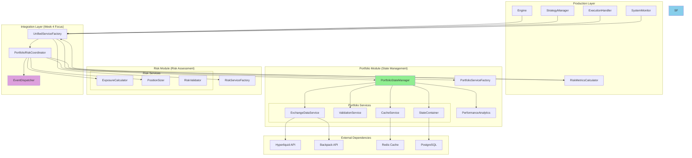

# Week 4: Modular System Integration - Clean Break Approach

**Duration:** Week 4 (2025-08-18 to 2025-08-24)
**Approach:** Clean Break - No Backward Compatibility
**Priority:** Critical
**Objective:** Establish Portfolio-Risk Integration Layer and Coordination Patterns (Clean Boundaries)

## Overview

With legacy components removed and portfolio/risk boundaries cleaned in Weeks 2-3, Week 4 focuses on **coordinating the two clean modules**. This week establishes integration patterns between portfolio state management and risk assessment.

**Clean Integration Scope:**
- Establish Portfolio ↔ Risk coordination patterns
- Create unified service orchestration layer
- Implement event-driven communication between modules
- Build production-ready integration framework
- Leave component-specific replacements to Weeks 5-7

**Clean Break Strategy:**
- ❌ No legacy compatibility layers
- ❌ No fallback to old patterns
- ✅ Complete modular system integration
- ✅ Event-driven architecture establishment

## Integration Architecture

### Target Integration State



## Week 4 Deliverables

### Day 1-2: Portfolio-Risk Coordination Framework

- [ ] **Portfolio-Risk Coordinator (Core Integration Component)**
  ```python
  """Central coordinator for portfolio state management and risk assessment."""
  from __future__ import annotations

  import asyncio
  from decimal import Decimal
  from typing import Any, Dict

  from cyberdelta.core.portfolio.services import PortfolioServiceFactory
  from cyberdelta.core.risk.services.risk_service_factory import RiskServiceFactory
  from cyberdelta.core.portfolio.portfolio_types.models import PortfolioState
  from cyberdelta.core.risk.models.risk_assessment import RiskAssessment

  # Supporting Pydantic models for type-safe integration
  from pydantic.dataclasses import dataclass

  @dataclass
  class PortfolioWithRiskModel:
      """Portfolio state enhanced with risk assessment."""
      portfolio_state: PortfolioState
      risk_assessment: RiskAssessment
      timestamp: datetime

  @dataclass
  class TradeRequestModel:
      """Trade request with validation."""
      symbol: str
      side: str  # "buy" or "sell"
      quantity: Decimal
      price: Decimal | None = None
      signal_strength: float = 1.0

      @field_validator("quantity", mode="before")
      @classmethod
      def validate_quantity(cls, v: Decimal) -> Decimal:
          """Validate quantity is positive."""
          if v <= 0:
              raise ValueError("Quantity must be positive")
          return v

      @field_validator("signal_strength", mode="before")
      @classmethod
      def validate_signal_strength(cls, v: float) -> float:
          """Validate signal strength is between 0 and 1."""
          if not 0.0 <= v <= 1.0:
              raise ValueError("Signal strength must be between 0.0 and 1.0")
          return v

  @dataclass
  class TradeValidationResultModel:
      """Result of trade validation."""
      approved: bool
      reason: str | None = None
      optimal_size: Decimal | None = None
      risk_assessment: Any | None = None
      portfolio_impact: Any | None = None
      risk_violations: list[str] = Field(default_factory=list)

  class PortfolioRiskCoordinator(BaseModel):
      """Coordinates portfolio state management with risk assessment."""

      portfolio_factory: PortfolioServiceFactory = Field(..., description="Portfolio service factory")
      risk_factory: RiskServiceFactory = Field(..., description="Risk service factory")

      model_config = ConfigDict(extra="forbid", validate_assignment=True)

      def model_post_init(self, __context: Any) -> None:
          """Initialize service instances after Pydantic validation."""
          # Portfolio module services
          self.portfolio_manager = self.portfolio_factory.get_portfolio_manager()
          self.performance_analytics = self.portfolio_factory.get_performance_analytics()

          # Risk module services
          self.exposure_calculator = self.risk_factory.create_exposure_calculator()
          self.position_sizer = self.risk_factory.create_position_sizer()
          self.risk_calculator = self.risk_factory.create_risk_metrics_calculator()
          self.risk_validator = self.risk_factory.create_risk_validator()

      async def get_current_portfolio_with_risk_assessment(self) -> PortfolioWithRiskModel:
          """Get portfolio state enhanced with risk assessment."""

          # Get current portfolio state (portfolio module responsibility)
          portfolio_state = await self.portfolio_manager.get_current_state()

          # Calculate risk metrics (risk module responsibility)
          risk_assessment = await self._calculate_comprehensive_risk(portfolio_state)

          return PortfolioWithRiskModel(
              portfolio_state=portfolio_state,
              risk_assessment=risk_assessment,
              timestamp=portfolio_state.timestamp
          )

      async def validate_trade_request(self, trade_request: TradeRequestModel) -> TradeValidationResultModel:
          """Validate trade using both portfolio state and risk assessment."""

          # Get current state
          portfolio_state = await self.portfolio_manager.get_current_state()

          # Risk module validates the trade
          risk_validation = await self.risk_validator.validate_trade(
              trade_request, portfolio_state
          )

          if not risk_validation.approved:
              return TradeValidationResultModel(
                  approved=False,
                  reason="Risk validation failed",
                  risk_violations=risk_validation.violations
              )

          # Calculate optimal position size (risk module responsibility)
          optimal_size = await self.position_sizer.calculate_optimal_size(
              portfolio_state,
              trade_request.symbol,
              trade_request.signal_strength
          )

          portfolio_impact = await self._simulate_trade_impact(trade_request, portfolio_state)

          return TradeValidationResultModel(
              approved=True,
              optimal_size=optimal_size,
              risk_assessment=risk_validation,
              portfolio_impact=portfolio_impact
          )

      async def execute_coordinated_trade(self, trade_request: Dict[str, Any]) -> Dict[str, Any]:
          """Execute trade with coordinated portfolio and risk management."""

          # Pre-trade validation
          validation_result = await self.validate_trade_request(trade_request)
          if not validation_result["approved"]:
              return {"success": False, "reason": validation_result["reason"]}

          # Execute through portfolio manager
          execution_result = await self.portfolio_manager.execute_trade(trade_request)

          # Post-trade risk assessment
          updated_state = await self.portfolio_manager.get_current_state()
          post_trade_risk = await self._calculate_comprehensive_risk(updated_state)

          return {
              "success": execution_result["success"],
              "trade_result": execution_result,
              "updated_risk_profile": post_trade_risk
          }

      async def _calculate_comprehensive_risk(self, portfolio_state: PortfolioState) -> RiskAssessment:
          """Calculate complete risk assessment using risk module."""

          # All risk calculations delegated to risk module
          exposure_metrics = await self.exposure_calculator.calculate_portfolio_exposure(portfolio_state)
          risk_metrics = await self.risk_calculator.calculate_risk_metrics(portfolio_state)

          return RiskAssessment(
              total_exposure=exposure_metrics.total_exposure,
              currency_exposures=exposure_metrics.currency_breakdown,
              var_95=risk_metrics.var_95,
              max_drawdown=risk_metrics.max_drawdown,
              leverage_ratio=risk_metrics.leverage,
              risk_score=risk_metrics.composite_score
          )

      async def _simulate_trade_impact(self, trade_request: Dict[str, Any], portfolio_state: PortfolioState) -> Dict[str, Any]:
          """Simulate impact of proposed trade on portfolio."""

          # Risk module simulates the impact
          simulated_state = await self.risk_calculator.simulate_trade_impact(
              portfolio_state, trade_request
          )

          return {
              "exposure_change": simulated_state.exposure_delta,
              "risk_change": simulated_state.risk_delta,
              "performance_impact": simulated_state.performance_impact
          }
  ```

- [ ] **Unified Service Factory (Clean Module Coordination)**
  ```python
  """Unified factory coordinating clean portfolio and risk modules."""
  from __future__ import annotations

  from cyberdelta.core.portfolio.services import PortfolioServiceFactory
  from cyberdelta.core.risk.services.risk_service_factory import RiskServiceFactory

  class UnifiedServiceFactory(BaseModel):
      """Coordinates portfolio and risk service factories with clean boundaries."""

      config: Any = Field(..., description="Configuration object")

      model_config = ConfigDict(extra="forbid", validate_assignment=True)

      def model_post_init(self, __context: Any) -> None:
          """Initialize service instances after Pydantic validation."""
          # Separate factories for each module
          self.portfolio_factory = PortfolioServiceFactory(self.config.portfolio_config)
          self.risk_factory = RiskServiceFactory(self.config.risk_config)

          # Integration layer
          self.coordinator = PortfolioRiskCoordinator(
              portfolio_factory=self.portfolio_factory,
              risk_factory=self.risk_factory
          )

      async def initialize_all(self) -> None:
          """Initialize both modules in correct order."""
          # Portfolio module first (state management)
          await self.portfolio_factory.initialize_all()

          # Risk module second (needs portfolio state)
          await self.risk_factory.initialize_all()

          # Integration layer last
          await self.coordinator.initialize()

      # Clean interfaces for production components
      def get_portfolio_manager(self):
          """Pure portfolio state management."""
          return self.portfolio_factory.get_portfolio_manager()

      def get_risk_coordinator(self):
          """Clean portfolio-risk coordination."""
          return self.coordinator

      def get_portfolio_with_risk_assessment(self):
          """Integrated portfolio + risk view."""
          return self.coordinator.get_current_portfolio_with_risk_assessment()

      async def shutdown_all(self) -> None:
          """Shutdown in reverse order."""
          await self.coordinator.shutdown()
          await self.risk_factory.shutdown_all()
          await self.portfolio_factory.shutdown_all()
  ```

  import asyncio
  from __future__ import annotations

  from typing import Any

  from pydantic import BaseModel, ConfigDict, Field

  from cyberdelta.core.portfolio.portfolio_types.models import PortfolioConfig
  from cyberdelta.core.portfolio.portfolio_types.protocols import (
      PortfolioManagerProtocol,
      EventDispatcherProtocol,
      ServiceProtocol
  )

  class IntegratedPortfolioServiceFactory:
      """Complete service factory for production integration."""

      def __init__(self, config: PortfolioConfig):
          self.config = config
          self._services: dict[str, ServiceProtocol] = {}
          self._initialized = False

      async def initialize_all(self) -> None:
          """Initialize all services in correct dependency order."""
          if self._initialized:
              return

          # Phase 1: Infrastructure services
          await self._initialize_infrastructure_services()

          # Phase 2: Data services
          await self._initialize_data_services()

          # Phase 3: Analytics services
          await self._initialize_analytics_services()

          # Phase 4: Core portfolio manager
          await self._initialize_portfolio_manager()

          # Phase 5: Event system
          await self._initialize_event_system()

          self._initialized = True

      async def _initialize_infrastructure_services(self) -> None:
          """Initialize infrastructure layer services."""

          # State container
          self._services['state_container'] = StateContainer(
              config=self.config.state_config
          )
          await self._services['state_container'].initialize()

          # Cache service
          self._services['cache_service'] = CacheService(
              redis_config=self.config.cache_config
          )
          await self._services['cache_service'].initialize()

          # Health service
          self._services['health_service'] = HealthService()
          await self._services['health_service'].initialize()

      async def _initialize_data_services(self) -> None:
          """Initialize data layer services."""

          # Validation service
          self._services['validation_service'] = ValidationService(
              config=self.config.validation_config
          )
          await self._services['validation_service'].initialize()

          # Exchange data service
          self._services['exchange_data_service'] = ExchangeDataService(
              hyperliquid_api=self.config.hyperliquid_api,
              backpack_api=self.config.backpack_api,
              cache_service=self._services['cache_service']
          )
          await self._services['exchange_data_service'].initialize()

      async def _initialize_analytics_services(self) -> None:
          """Initialize analytics layer services."""

          # Performance analytics
          self._services['performance_analytics'] = PerformanceAnalyticsService(
              base_currency=self.config.base_currency,
              cache_service=self._services['cache_service']
          )
          await self._services['performance_analytics'].initialize()

          # Risk analytics
          self._services['risk_analytics'] = RiskAnalyticsService(
              risk_config=self.config.risk_config,
              validation_service=self._services['validation_service']
          )
          await self._services['risk_analytics'].initialize()

          # Exposure analytics
          self._services['exposure_analytics'] = ExposureAnalyticsService(
              base_currency=self.config.base_currency
          )
          await self._services['exposure_analytics'].initialize()

      async def _initialize_portfolio_manager(self) -> None:
          """Initialize core portfolio state manager."""

          self._services['portfolio_manager'] = PortfolioStateManager(
              config=self.config,
              state_container=self._services['state_container'],
              validation_service=self._services['validation_service'],
              cache_service=self._services['cache_service'],
              performance_analytics=self._services['performance_analytics'],
              risk_analytics=self._services['risk_analytics'],
              exposure_analytics=self._services['exposure_analytics']
          )
          await self._services['portfolio_manager'].initialize()

      async def _initialize_event_system(self) -> None:
          """Initialize event-driven architecture."""

          self._services['event_dispatcher'] = EventDispatcher(
              portfolio_manager=self._services['portfolio_manager'],
              health_service=self._services['health_service']
          )
          await self._services['event_dispatcher'].initialize()

          # Register event handlers
          await self._register_event_handlers()

      async def _register_event_handlers(self) -> None:
          """Register all event handlers for portfolio events."""

          event_dispatcher = self._services['event_dispatcher']
          portfolio_manager = self._services['portfolio_manager']

          # Balance update events
          await event_dispatcher.register_handler(
              EventType.BALANCE_UPDATED,
              portfolio_manager.handle_balance_update
          )

          # Position update events
          await event_dispatcher.register_handler(
              EventType.POSITION_UPDATED,
              portfolio_manager.handle_position_update
          )

          # Trade execution events
          await event_dispatcher.register_handler(
              EventType.TRADE_EXECUTED,
              portfolio_manager.handle_trade_execution
          )

          # Order fill events
          await event_dispatcher.register_handler(
              EventType.ORDER_FILLED,
              portfolio_manager.handle_order_fill
          )

      # Service accessor methods
      def get_portfolio_manager(self) -> PortfolioManagerProtocol:
          return self._services['portfolio_manager']

      def get_event_dispatcher(self) -> EventDispatcherProtocol:
          return self._services['event_dispatcher']

      def get_performance_analytics(self) -> PerformanceAnalyticsService:
          return self._services['performance_analytics']

      def get_risk_analytics(self) -> RiskAnalyticsService:
          return self._services['risk_analytics']

      def get_exchange_data_service(self) -> ExchangeDataService:
          return self._services['exchange_data_service']

      async def shutdown_all(self) -> None:
          """Shutdown all services in reverse dependency order."""

          shutdown_order = [
              'event_dispatcher',
              'portfolio_manager',
              'exposure_analytics',
              'risk_analytics',
              'performance_analytics',
              'exchange_data_service',
              'validation_service',
              'health_service',
              'cache_service',
              'state_container'
          ]

          for service_name in shutdown_order:
              if service_name in self._services:
                  await self._services[service_name].shutdown()

          self._services.clear()
          self._initialized = False
  ```

- [ ] **Enhanced PortfolioStateManager with Full Integration**
  ```python
  """Enhanced portfolio state manager with full production integration."""
  from __future__ import annotations

  import asyncio
  from datetime import datetime
  from decimal import Decimal
  from typing import Any

  from cyberdelta.core.portfolio.services.base_service import BasePortfolioService
  from cyberdelta.core.portfolio.portfolio_types.models import (
      PortfolioState, Position, SpotBalance, ExposureMetrics
  )
  from cyberdelta.core.portfolio.portfolio_types.infrastructure import (
      PortfolioEvent, EventType, ValidationResult
  )
  from cyberdelta.core.portfolio.portfolio_types.protocols import (
      PortfolioManagerProtocol, StateContainerProtocol,
      ValidationServiceProtocol, CacheServiceProtocol
  )

  class IntegratedPortfolioStateManager(BasePortfolioService, PortfolioManagerProtocol):
      """Production-ready portfolio state manager with full integration."""

      def __init__(
          self,
          config: PortfolioConfig,
          state_container: StateContainerProtocol,
          validation_service: ValidationServiceProtocol,
          cache_service: CacheServiceProtocol,
          performance_analytics: PerformanceAnalyticsService,
          risk_analytics: RiskAnalyticsService,
          exposure_analytics: ExposureAnalyticsService
      ):
          super().__init__("integrated_portfolio_manager")
          self.config = config
          self.state_container = state_container
          self.validation_service = validation_service
          self.cache_service = cache_service
          self.performance_analytics = performance_analytics
          self.risk_analytics = risk_analytics
          self.exposure_analytics = exposure_analytics

          # State management
          self._current_state: PortfolioState | None = None
          self._state_lock = asyncio.Lock()
          self._last_update = datetime.utcnow()

      async def _initialize_service(self) -> None:
          """Initialize portfolio state manager."""
          # Load initial state
          await self._load_current_state()

          # Start background tasks
          asyncio.create_task(self._periodic_state_persistence())
          asyncio.create_task(self._periodic_metrics_calculation())

      async def _shutdown_service(self) -> None:
          """Shutdown portfolio state manager."""
          # Persist final state
          if self._current_state:
              await self.state_container.save_state(self._current_state)

      async def get_current_state(self) -> PortfolioState:
          """Get current portfolio state with analytics."""
          async with self._state_lock:
              if self._current_state is None:
                  await self._load_current_state()

              # Update analytics if state is stale
              if self._is_state_stale():
                  await self._refresh_analytics()

              return self._current_state

      async def get_total_capital(self, base_currency: str = "USDC") -> Decimal:
          """Get total portfolio capital."""
          state = await self.get_current_state()
          performance = await self.performance_analytics.calculate_performance(state)
          return performance.total_capital

      async def get_positions(self, exchange_id: str | None = None) -> list[Position]:
          """Get positions, optionally filtered by exchange."""
          state = await self.get_current_state()

          if exchange_id is None:
              # Return all positions
              all_positions = []
              for positions in state.positions.values():
                  all_positions.extend(positions)
              return all_positions
          else:
              return state.positions.get(exchange_id, [])

      async def get_balances(self, exchange_id: str | None = None) -> dict[str, SpotBalance]:
          """Get balances, optionally filtered by exchange."""
          state = await self.get_current_state()

          if exchange_id is None:
              # Return all balances
              all_balances = {}
              for exchange_balances in state.balances.values():
                  all_balances.update(exchange_balances)
              return all_balances
          else:
              return state.balances.get(exchange_id, {})

      async def get_exposure_metrics(self, valuation_asset: str = "USDC") -> ExposureMetrics:
          """Get current exposure metrics."""
          state = await self.get_current_state()
          exposure_result = await self.exposure_analytics.calculate_exposure(state)

          return ExposureMetrics(
              total_exposure=exposure_result.total_exposure,
              currency_exposures=exposure_result.currency_breakdown,
              position_count=len(await self.get_positions()),
              leverage_ratio=exposure_result.risk_metrics.get("leverage", None)
          )

      # Event handlers for production integration
      async def handle_balance_update(self, event: PortfolioEvent) -> None:
          """Handle balance update events from exchange data."""

          # Validate event data
          validation_result = await self.validation_service.validate_balance_data(event.data)
          if not validation_result.is_valid:
              await self._handle_validation_error(event, validation_result)
              return

          async with self._state_lock:
              # Update balance in current state
              exchange_id = event.exchange_id
              balance_data = event.data

              if self._current_state is None:
                  await self._load_current_state()

              # Update specific balance
              if exchange_id not in self._current_state.balances:
                  self._current_state.balances[exchange_id] = {}

              asset = balance_data["asset"]
              self._current_state.balances[exchange_id][asset] = SpotBalance(
                  exchange=exchange_id,
                  asset=asset,
                  total_quantity=Decimal(str(balance_data["total_quantity"])),
                  available_quantity=Decimal(str(balance_data["available_quantity"])),
                  timestamp=datetime.utcnow()
              )

              # Mark state as updated
              self._last_update = datetime.utcnow()

              # Cache invalidation
              await self.cache_service.invalidate_portfolio_cache()

      async def handle_position_update(self, event: PortfolioEvent) -> None:
          """Handle position update events from exchange data."""

          # Validate event data
          validation_result = await self.validation_service.validate_position_data(event.data)
          if not validation_result.is_valid:
              await self._handle_validation_error(event, validation_result)
              return

          async with self._state_lock:
              # Update position in current state
              exchange_id = event.exchange_id
              position_data = event.data

              if self._current_state is None:
                  await self._load_current_state()

              # Update specific position
              if exchange_id not in self._current_state.positions:
                  self._current_state.positions[exchange_id] = []

              # Find existing position or create new
              symbol = position_data["symbol"]
              existing_position_idx = None
              for idx, pos in enumerate(self._current_state.positions[exchange_id]):
                  if pos.symbol == symbol:
                      existing_position_idx = idx
                      break

              new_position = Position(
                  exchange=exchange_id,
                  symbol=symbol,
                  size=Decimal(str(position_data["size"])),
                  entry_price=Decimal(str(position_data.get("entry_price", 0))),
                  mark_price=Decimal(str(position_data.get("mark_price", 0))),
                  unrealized_pnl=Decimal(str(position_data.get("unrealized_pnl", 0)))
              )

              if existing_position_idx is not None:
                  self._current_state.positions[exchange_id][existing_position_idx] = new_position
              else:
                  self._current_state.positions[exchange_id].append(new_position)

              # Mark state as updated
              self._last_update = datetime.utcnow()

              # Cache invalidation
              await self.cache_service.invalidate_portfolio_cache()

      async def handle_trade_execution(self, event: PortfolioEvent) -> None:
          """Handle trade execution events."""

          # Trade executions trigger both position and balance updates
          # Process the trade data and update relevant state

          trade_data = event.data
          exchange_id = event.exchange_id

          # Create position update event
          position_event = PortfolioEvent(
              event_type=EventType.POSITION_UPDATED,
              exchange_id=exchange_id,
              timestamp=event.timestamp,
              data={
                  "symbol": trade_data["symbol"],
                  "size": trade_data["new_position_size"],
                  "entry_price": trade_data.get("entry_price"),
                  "mark_price": trade_data.get("mark_price")
              }
          )
          await self.handle_position_update(position_event)

          # Create balance update event for quote currency
          if "balance_change" in trade_data:
              balance_event = PortfolioEvent(
                  event_type=EventType.BALANCE_UPDATED,
                  exchange_id=exchange_id,
                  timestamp=event.timestamp,
                  data={
                      "asset": trade_data["quote_currency"],
                      "total_quantity": trade_data["balance_change"]["new_total"],
                      "available_quantity": trade_data["balance_change"]["new_available"]
                  }
              )
              await self.handle_balance_update(balance_event)

      async def update_from_exchange_data(self, exchange_data: dict[str, dict]) -> None:
          """Update portfolio from exchange API data (bulk update)."""

          # Process each exchange's data
          for exchange_id, data in exchange_data.items():

              # Update balances
              if "balances" in data:
                  for asset, balance_data in data["balances"].items():
                      event = PortfolioEvent(
                          event_type=EventType.BALANCE_UPDATED,
                          exchange_id=exchange_id,
                          timestamp=datetime.utcnow(),
                          data={
                              "asset": asset,
                              "total_quantity": balance_data["total"],
                              "available_quantity": balance_data["available"]
                          }
                      )
                      await self.handle_balance_update(event)

              # Update positions
              if "positions" in data:
                  for position_data in data["positions"]:
                      event = PortfolioEvent(
                          event_type=EventType.POSITION_UPDATED,
                          exchange_id=exchange_id,
                          timestamp=datetime.utcnow(),
                          data=position_data
                      )
                      await self.handle_position_update(event)

      async def _load_current_state(self) -> None:
          """Load current portfolio state from persistence."""
          try:
              self._current_state = await self.state_container.load_latest_state()
              if self._current_state is None:
                  # Create empty initial state
                  self._current_state = PortfolioState(
                      total_capital=Decimal("0"),
                      positions={},
                      balances={},
                      exposure_metrics=ExposureMetrics(
                          total_exposure=Decimal("0"),
                          currency_exposures={},
                          position_count=0
                      ),
                      timestamp=datetime.utcnow()
                  )
          except Exception as e:
              # Log error and create empty state
              self._current_state = PortfolioState(
                  total_capital=Decimal("0"),
                  positions={},
                  balances={},
                  exposure_metrics=ExposureMetrics(
                      total_exposure=Decimal("0"),
                      currency_exposures={},
                      position_count=0
                  ),
                  timestamp=datetime.utcnow()
              )

      async def _refresh_analytics(self) -> None:
          """Refresh analytics calculations for current state."""
          if self._current_state is None:
              return

          # Calculate fresh exposure metrics
          exposure_result = await self.exposure_analytics.calculate_exposure(self._current_state)
          self._current_state.exposure_metrics = ExposureMetrics(
              total_exposure=exposure_result.total_exposure,
              currency_exposures=exposure_result.currency_breakdown,
              position_count=len(await self.get_positions()),
              leverage_ratio=exposure_result.risk_metrics.get("leverage")
          )

          # Calculate fresh performance metrics
          performance_result = await self.performance_analytics.calculate_performance(self._current_state)
          self._current_state.total_capital = performance_result.total_capital

      def _is_state_stale(self) -> bool:
          """Check if current state needs analytics refresh."""
          if self._current_state is None:
              return True

          # Refresh if older than 30 seconds
          time_diff = datetime.utcnow() - self._last_update
          return time_diff.total_seconds() > 30

      async def _periodic_state_persistence(self) -> None:
          """Background task for periodic state persistence."""
          while self.is_initialized():
              try:
                  if self._current_state:
                      await self.state_container.save_state(self._current_state)
                  await asyncio.sleep(60)  # Save every minute
              except Exception as e:
                  # Log error but continue
                  await asyncio.sleep(60)

      async def _periodic_metrics_calculation(self) -> None:
          """Background task for periodic metrics updates."""
          while self.is_initialized():
              try:
                  if self._current_state and self._is_state_stale():
                      await self._refresh_analytics()
                  await asyncio.sleep(30)  # Refresh every 30 seconds
              except Exception as e:
                  # Log error but continue
                  await asyncio.sleep(30)

      async def _handle_validation_error(self, event: PortfolioEvent, validation_result: ValidationResult) -> None:
          """Handle validation errors for incoming events."""
          # Log validation errors
          error_msg = f"Validation failed for {event.event_type} from {event.exchange_id}: {validation_result.errors}"

          # Could dispatch error event here for monitoring
          pass
  ```

### Day 3-4: Production Component Deep Integration

- [ ] **Enhanced Engine Integration**
  ```python
  """Complete Engine integration with modular portfolio system."""
  from __future__ import annotations

  import asyncio
  from decimal import Decimal
  from typing import Any

  from cyberdelta.core.portfolio.services import IntegratedPortfolioServiceFactory
  from cyberdelta.core.portfolio.portfolio_types.models import PortfolioState
  from cyberdelta.core.portfolio.portfolio_types.infrastructure import PortfolioEvent, EventType

  class IntegratedEngine:
      """Engine fully integrated with modular portfolio system."""

      def __init__(self, portfolio_service_factory: IntegratedPortfolioServiceFactory):
          self.portfolio_factory = portfolio_service_factory
          self.portfolio_manager = portfolio_service_factory.get_portfolio_manager()
          self.performance_analytics = portfolio_service_factory.get_performance_analytics()
          self.risk_analytics = portfolio_service_factory.get_risk_analytics()
          self.event_dispatcher = portfolio_service_factory.get_event_dispatcher()

          # Engine state
          self._running = False
          self._position_limits = {}
          self._risk_limits = {}

      async def start(self) -> None:
          """Start the trading engine."""
          if self._running:
              return

          # Initialize portfolio system
          await self.portfolio_factory.initialize_all()

          # Load configuration
          await self._load_engine_config()

          # Start engine tasks
          asyncio.create_task(self._portfolio_monitoring_loop())
          asyncio.create_task(self._risk_monitoring_loop())

          self._running = True

      async def stop(self) -> None:
          """Stop the trading engine."""
          self._running = False
          await self.portfolio_factory.shutdown_all()

      async def get_portfolio_capital(self) -> Decimal:
          """Get current portfolio capital for position sizing."""
          return await self.portfolio_manager.get_total_capital()

      async def get_available_capital(self) -> Decimal:
          """Get available capital for new positions."""
          total_capital = await self.portfolio_manager.get_total_capital()
          exposure_metrics = await self.portfolio_manager.get_exposure_metrics()

          # Calculate available capital (total - current exposure)
          available = total_capital - exposure_metrics.total_exposure
          return max(Decimal("0"), available)

      async def check_position_limits(self, symbol: str, proposed_size: Decimal) -> bool:
          """Check if proposed position respects limits."""

          current_positions = await self.portfolio_manager.get_positions()

          # Check individual position limit
          symbol_limit = self._position_limits.get(symbol, Decimal("1000"))  # Default limit
          current_size = Decimal("0")

          for position in current_positions:
              if position.symbol == symbol:
                  current_size += abs(position.size)

          new_total_size = current_size + abs(proposed_size)
          return new_total_size <= symbol_limit

      async def check_risk_limits(self) -> dict[str, bool]:
          """Comprehensive risk limit checking."""

          portfolio_state = await self.portfolio_manager.get_current_state()
          risk_result = await self.risk_analytics.calculate_exposure(portfolio_state)

          risk_checks = {
              "total_exposure_ok": risk_result.total_exposure <= self._risk_limits.get("max_exposure", Decimal("10000")),
              "leverage_ok": risk_result.risk_metrics.get("leverage", 0) <= self._risk_limits.get("max_leverage", 3),
              "position_count_ok": len(await self.portfolio_manager.get_positions()) <= self._risk_limits.get("max_positions", 50),
              "currency_concentration_ok": self._check_currency_concentration(risk_result.currency_breakdown)
          }

          return risk_checks

      async def execute_trade(self, trade_request: dict[str, Any]) -> bool:
          """Execute a trade with full portfolio integration."""

          # Pre-trade risk checks
          risk_checks = await self.check_risk_limits()
          if not all(risk_checks.values()):
              return False

          # Check position limits
          symbol = trade_request["symbol"]
          size = Decimal(str(trade_request["size"]))

          if not await self.check_position_limits(symbol, size):
              return False

          # Execute the trade (integrate with actual trading logic)
          success = await self._execute_trade_on_exchange(trade_request)

          if success:
              # Create trade execution event
              trade_event = PortfolioEvent(
                  event_type=EventType.TRADE_EXECUTED,
                  exchange_id=trade_request["exchange_id"],
                  timestamp=datetime.utcnow(),
                  data={
                      "symbol": symbol,
                      "size": size,
                      "price": trade_request["price"],
                      "side": trade_request["side"],
                      "new_position_size": trade_request["new_position_size"],
                      "quote_currency": trade_request["quote_currency"],
                      "balance_change": trade_request.get("balance_change", {})
                  }
              )

              # Dispatch event - portfolio manager will handle state updates
              await self.event_dispatcher.dispatch(trade_event)

          return success

      async def _portfolio_monitoring_loop(self) -> None:
          """Background monitoring of portfolio state."""
          while self._running:
              try:
                  # Get current portfolio metrics
                  portfolio_state = await self.portfolio_manager.get_current_state()
                  performance = await self.performance_analytics.calculate_performance(portfolio_state)

                  # Check for any anomalies
                  if performance.drawdown and performance.drawdown > Decimal("0.1"):  # 10% drawdown
                      await self._handle_high_drawdown(performance)

                  # Monitor position sizes
                  positions = await self.portfolio_manager.get_positions()
                  await self._monitor_position_sizes(positions)

                  await asyncio.sleep(10)  # Check every 10 seconds

              except Exception as e:
                  # Log error but continue monitoring
                  await asyncio.sleep(10)

      async def _risk_monitoring_loop(self) -> None:
          """Background risk monitoring."""
          while self._running:
              try:
                  risk_checks = await self.check_risk_limits()

                  # Handle risk limit violations
                  if not risk_checks["total_exposure_ok"]:
                      await self._handle_exposure_violation()

                  if not risk_checks["leverage_ok"]:
                      await self._handle_leverage_violation()

                  await asyncio.sleep(5)  # Check every 5 seconds

              except Exception as e:
                  # Log error but continue monitoring
                  await asyncio.sleep(5)

      async def _load_engine_config(self) -> None:
          """Load engine configuration including limits."""
          # Load from configuration system
          self._position_limits = {
              "BTC-USD": Decimal("10"),
              "ETH-USD": Decimal("100"),
              # ... other symbol limits
          }

          self._risk_limits = {
              "max_exposure": Decimal("50000"),
              "max_leverage": Decimal("3"),
              "max_positions": 25,
              "max_currency_concentration": Decimal("0.6")  # 60%
          }

      def _check_currency_concentration(self, currency_exposures: dict[str, Decimal]) -> bool:
          """Check currency concentration limits."""
          if not currency_exposures:
              return True

          total_exposure = sum(currency_exposures.values())
          if total_exposure == 0:
              return True

          max_concentration = self._risk_limits.get("max_currency_concentration", Decimal("0.6"))

          for currency, exposure in currency_exposures.items():
              concentration = exposure / total_exposure
              if concentration > max_concentration:
                  return False

          return True

      async def _execute_trade_on_exchange(self, trade_request: dict[str, Any]) -> bool:
          """Execute trade on exchange (placeholder for actual implementation)."""
          # This would integrate with actual exchange trading logic
          # For now, simulate successful execution
          return True

      async def _handle_high_drawdown(self, performance: Any) -> None:
          """Handle high drawdown situation."""
          # Implement drawdown response logic
          pass

      async def _monitor_position_sizes(self, positions: list) -> None:
          """Monitor individual position sizes."""
          # Implement position size monitoring
          pass

      async def _handle_exposure_violation(self) -> None:
          """Handle total exposure limit violation."""
          # Implement exposure violation response
          pass

      async def _handle_leverage_violation(self) -> None:
          """Handle leverage limit violation."""
          # Implement leverage violation response
          pass
  ```

- [ ] **Enhanced StrategyManager Integration**
  ```python
  """Complete StrategyManager integration with modular portfolio system."""
  from __future__ import annotations

  import asyncio
  from decimal import Decimal
  from datetime import datetime, timedelta
  from typing import Any, dict

  from cyberdelta.core.portfolio.services import IntegratedPortfolioServiceFactory
  from cyberdelta.core.portfolio.portfolio_types.models import PortfolioState, Position
  from cyberdelta.core.portfolio.portfolio_types.calculations import PerformanceResult, ExposureResult

  class IntegratedStrategyManager:
      """Strategy manager fully integrated with modular portfolio system."""

      def __init__(self, portfolio_service_factory: IntegratedPortfolioServiceFactory):
          self.portfolio_factory = portfolio_service_factory
          self.portfolio_manager = portfolio_service_factory.get_portfolio_manager()
          self.performance_analytics = portfolio_service_factory.get_performance_analytics()
          self.risk_analytics = portfolio_service_factory.get_risk_analytics()
          self.exposure_analytics = portfolio_service_factory.get_exposure_analytics()

          # Strategy state
          self._active_strategies: dict[str, dict] = {}
          self._strategy_performance: dict[str, dict] = {}
          self._running = False

      async def start(self) -> None:
          """Start strategy management."""
          if self._running:
              return

          # Load active strategies
          await self._load_strategies()

          # Start strategy monitoring
          asyncio.create_task(self._strategy_monitoring_loop())
          asyncio.create_task(self._performance_tracking_loop())

          self._running = True

      async def stop(self) -> None:
          """Stop strategy management."""
          self._running = False

      async def check_strategy_conditions(self, strategy_id: str) -> dict[str, Any]:
          """Check conditions for a specific strategy."""

          if strategy_id not in self._active_strategies:
              return {"eligible": False, "reason": "Strategy not found"}

          strategy_config = self._active_strategies[strategy_id]

          # Get current portfolio state
          portfolio_state = await self.portfolio_manager.get_current_state()

          # Calculate current analytics
          performance = await self.performance_analytics.calculate_performance(portfolio_state)
          risk_result = await self.risk_analytics.calculate_exposure(portfolio_state)

          # Check strategy-specific conditions
          conditions = {
              "capital_available": await self._check_capital_requirements(strategy_config, performance),
              "risk_limits_ok": await self._check_risk_limits(strategy_config, risk_result),
              "position_limits_ok": await self._check_position_limits(strategy_config),
              "time_conditions_ok": self._check_time_conditions(strategy_config),
              "market_conditions_ok": await self._check_market_conditions(strategy_config)
          }

          # Overall eligibility
          eligible = all(conditions.values())

          return {
              "eligible": eligible,
              "conditions": conditions,
              "current_performance": performance,
              "current_risk": risk_result
          }

      async def calculate_position_size(self, strategy_id: str, signal_strength: float) -> Decimal:
          """Calculate appropriate position size for strategy signal."""

          if strategy_id not in self._active_strategies:
              return Decimal("0")

          strategy_config = self._active_strategies[strategy_id]

          # Get current portfolio metrics
          total_capital = await self.portfolio_manager.get_total_capital()
          exposure_metrics = await self.portfolio_manager.get_exposure_metrics()

          # Calculate base position size
          max_position_percent = strategy_config.get("max_position_percent", Decimal("0.05"))  # 5%
          base_size = total_capital * max_position_percent

          # Adjust for signal strength
          adjusted_size = base_size * Decimal(str(signal_strength))

          # Adjust for current exposure
          available_capital = total_capital - exposure_metrics.total_exposure
          max_size = min(adjusted_size, available_capital * Decimal("0.8"))  # Use 80% of available

          # Apply strategy-specific limits
          strategy_max = strategy_config.get("max_position_size", Decimal("1000"))
          final_size = min(max_size, strategy_max)

          return max(Decimal("0"), final_size)

      async def evaluate_portfolio_for_strategies(self) -> dict[str, dict]:
          """Evaluate current portfolio for all active strategies."""

          results = {}

          for strategy_id in self._active_strategies:
              try:
                  conditions = await self.check_strategy_conditions(strategy_id)
                  results[strategy_id] = conditions
              except Exception as e:
                  results[strategy_id] = {
                      "eligible": False,
                      "error": str(e)
                  }

          return results

      async def track_strategy_performance(self, strategy_id: str, trade_result: dict) -> None:
          """Track performance for a specific strategy."""

          if strategy_id not in self._strategy_performance:
              self._strategy_performance[strategy_id] = {
                  "trades": [],
                  "total_pnl": Decimal("0"),
                  "win_rate": Decimal("0"),
                  "avg_trade": Decimal("0"),
                  "max_drawdown": Decimal("0"),
                  "last_updated": datetime.utcnow()
              }

          perf = self._strategy_performance[strategy_id]

          # Add trade
          perf["trades"].append({
              "timestamp": datetime.utcnow(),
              "pnl": Decimal(str(trade_result["pnl"])),
              "symbol": trade_result["symbol"],
              "size": Decimal(str(trade_result["size"]))
          })

          # Update metrics
          await self._update_strategy_metrics(strategy_id)

      async def get_strategy_performance(self, strategy_id: str) -> dict[str, Any]:
          """Get performance metrics for a strategy."""

          if strategy_id not in self._strategy_performance:
              return {
                  "total_pnl": Decimal("0"),
                  "trade_count": 0,
                  "win_rate": Decimal("0"),
                  "avg_trade": Decimal("0")
              }

          return self._strategy_performance[strategy_id].copy()

      async def get_portfolio_attribution(self) -> dict[str, Decimal]:
          """Get P&L attribution by strategy."""

          attribution = {}

          for strategy_id, perf in self._strategy_performance.items():
              attribution[strategy_id] = perf["total_pnl"]

          return attribution

      async def _check_capital_requirements(self, strategy_config: dict, performance: PerformanceResult) -> bool:
          """Check if strategy capital requirements are met."""

          min_capital = strategy_config.get("min_capital_required", Decimal("1000"))
          return performance.total_capital >= min_capital

      async def _check_risk_limits(self, strategy_config: dict, risk_result: ExposureResult) -> bool:
          """Check strategy-specific risk limits."""

          max_exposure = strategy_config.get("max_total_exposure", Decimal("10000"))
          max_leverage = strategy_config.get("max_leverage", Decimal("2"))

          current_leverage = risk_result.risk_metrics.get("leverage", 0)

          return (risk_result.total_exposure <= max_exposure and
                  current_leverage <= max_leverage)

      async def _check_position_limits(self, strategy_config: dict) -> bool:
          """Check position-related limits for strategy."""

          max_positions = strategy_config.get("max_concurrent_positions", 10)
          current_positions = await self.portfolio_manager.get_positions()

          return len(current_positions) < max_positions

      def _check_time_conditions(self, strategy_config: dict) -> bool:
          """Check time-based conditions for strategy."""

          # Check if strategy is allowed to run at current time
          allowed_hours = strategy_config.get("allowed_trading_hours", [])
          if allowed_hours:
              current_hour = datetime.utcnow().hour
              return current_hour in allowed_hours

          return True

      async def _check_market_conditions(self, strategy_config: dict) -> bool:
          """Check market conditions for strategy."""

          # This would integrate with market data and volatility checks
          # For now, return True (implement based on specific requirements)
          return True

      async def _load_strategies(self) -> None:
          """Load active strategy configurations."""

          # Load from configuration system
          self._active_strategies = {
              "delta_neutral_arbitrage": {
                  "max_position_percent": Decimal("0.1"),
                  "max_position_size": Decimal("5000"),
                  "min_capital_required": Decimal("10000"),
                  "max_total_exposure": Decimal("50000"),
                  "max_leverage": Decimal("2"),
                  "max_concurrent_positions": 15,
                  "allowed_trading_hours": list(range(24))  # 24/7
              },
              "momentum_following": {
                  "max_position_percent": Decimal("0.05"),
                  "max_position_size": Decimal("2000"),
                  "min_capital_required": Decimal("5000"),
                  "max_total_exposure": Decimal("20000"),
                  "max_leverage": Decimal("1.5"),
                  "max_concurrent_positions": 10,
                  "allowed_trading_hours": [8, 9, 10, 11, 12, 13, 14, 15, 16]  # Market hours
              }
          }

      async def _strategy_monitoring_loop(self) -> None:
          """Background strategy monitoring."""
          while self._running:
              try:
                  # Evaluate all strategies
                  evaluations = await self.evaluate_portfolio_for_strategies()

                  # Check for any strategy violations or opportunities
                  for strategy_id, evaluation in evaluations.items():
                      if not evaluation.get("eligible", False):
                          await self._handle_strategy_violation(strategy_id, evaluation)

                  await asyncio.sleep(30)  # Check every 30 seconds

              except Exception as e:
                  await asyncio.sleep(30)

      async def _performance_tracking_loop(self) -> None:
          """Background performance tracking."""
          while self._running:
              try:
                  # Update strategy performance metrics
                  for strategy_id in self._strategy_performance:
                      await self._update_strategy_metrics(strategy_id)

                  await asyncio.sleep(60)  # Update every minute

              except Exception as e:
                  await asyncio.sleep(60)

      async def _update_strategy_metrics(self, strategy_id: str) -> None:
          """Update performance metrics for a strategy."""

          if strategy_id not in self._strategy_performance:
              return

          perf = self._strategy_performance[strategy_id]
          trades = perf["trades"]

          if not trades:
              return

          # Calculate metrics
          total_pnl = sum(trade["pnl"] for trade in trades)
          trade_count = len(trades)
          winning_trades = sum(1 for trade in trades if trade["pnl"] > 0)
          win_rate = Decimal(str(winning_trades)) / Decimal(str(trade_count)) if trade_count > 0 else Decimal("0")
          avg_trade = total_pnl / Decimal(str(trade_count)) if trade_count > 0 else Decimal("0")

          # Calculate drawdown
          running_pnl = Decimal("0")
          peak_pnl = Decimal("0")
          max_drawdown = Decimal("0")

          for trade in trades:
              running_pnl += trade["pnl"]
              if running_pnl > peak_pnl:
                  peak_pnl = running_pnl
              else:
                  drawdown = peak_pnl - running_pnl
                  if drawdown > max_drawdown:
                      max_drawdown = drawdown

          # Update metrics
          perf.update({
              "total_pnl": total_pnl,
              "trade_count": trade_count,
              "win_rate": win_rate,
              "avg_trade": avg_trade,
              "max_drawdown": max_drawdown,
              "last_updated": datetime.utcnow()
          })

      async def _handle_strategy_violation(self, strategy_id: str, evaluation: dict) -> None:
          """Handle strategy condition violations."""
          # Log violations and potentially disable strategy
          conditions = evaluation.get("conditions", {})
          for condition, passed in conditions.items():
              if not passed:
                  # Log specific violation
                  pass
  ```

### Day 5-7: Event System Integration & Production Validation

- [ ] **Complete Event System Integration**
  ```python
  """Complete event-driven architecture for portfolio system."""
  from __future__ import annotations

  import asyncio
  from typing import Any, Callable, Dict, List
  from datetime import datetime

  from cyberdelta.core.portfolio.portfolio_types.infrastructure import (
      PortfolioEvent, EventType, ValidationResult
  )
  from cyberdelta.core.portfolio.services.base_service import BasePortfolioService

  class ProductionEventDispatcher(BasePortfolioService):
      """Production-ready event dispatcher with full integration."""

      def __init__(self):
          super().__init__("production_event_dispatcher")
          self._handlers: Dict[EventType, List[Callable]] = {}
          self._event_queue = asyncio.Queue()
          self._processing_task: asyncio.Task | None = None
          self._event_history: List[PortfolioEvent] = []
          self._max_history = 1000

      async def _initialize_service(self) -> None:
          """Initialize event dispatcher."""
          # Start event processing task
          self._processing_task = asyncio.create_task(self._process_events())

      async def _shutdown_service(self) -> None:
          """Shutdown event dispatcher."""
          if self._processing_task:
              self._processing_task.cancel()
              try:
                  await self._processing_task
              except asyncio.CancelledError:
                  pass

      async def register_handler(self, event_type: EventType, handler: Callable) -> None:
          """Register event handler for specific event type."""
          if event_type not in self._handlers:
              self._handlers[event_type] = []

          self._handlers[event_type].append(handler)

      async def dispatch(self, event: PortfolioEvent) -> None:
          """Dispatch event to registered handlers."""
          await self._event_queue.put(event)

      async def _process_events(self) -> None:
          """Background task to process events."""
          while self.is_initialized():
              try:
                  # Wait for event
                  event = await asyncio.wait_for(self._event_queue.get(), timeout=1.0)

                  # Process event
                  await self._handle_event(event)

                  # Add to history
                  self._add_to_history(event)

              except asyncio.TimeoutError:
                  continue
              except Exception as e:
                  # Log error but continue processing
                  continue

      async def _handle_event(self, event: PortfolioEvent) -> None:
          """Handle individual event."""

          handlers = self._handlers.get(event.event_type, [])

          if not handlers:
              return

          # Execute all handlers concurrently
          tasks = []
          for handler in handlers:
              tasks.append(self._safe_handler_call(handler, event))

          await asyncio.gather(*tasks, return_exceptions=True)

      async def _safe_handler_call(self, handler: Callable, event: PortfolioEvent) -> None:
          """Safely call event handler with error handling."""
          try:
              if asyncio.iscoroutinefunction(handler):
                  await handler(event)
              else:
                  handler(event)
          except Exception as e:
              # Log handler error but don't stop processing
              pass

      def _add_to_history(self, event: PortfolioEvent) -> None:
          """Add event to history with size limit."""
          self._event_history.append(event)

          # Trim history if too large
          if len(self._event_history) > self._max_history:
              self._event_history = self._event_history[-self._max_history:]

      def get_recent_events(self, event_type: EventType | None = None, limit: int = 100) -> List[PortfolioEvent]:
          """Get recent events, optionally filtered by type."""

          events = self._event_history

          if event_type:
              events = [e for e in events if e.event_type == event_type]

          return events[-limit:]
  ```

- [ ] **Production Application Integration**
  ```python
  """Complete application integration with modular portfolio system."""
  from __future__ import annotations

  import asyncio
  import signal
  from contextlib import asynccontextmanager

  from cyberdelta.core.portfolio.services import IntegratedPortfolioServiceFactory
  from cyberdelta.core.portfolio.portfolio_types.models import PortfolioConfig

  class CyberDeltaApplication:
      """Main application with fully integrated modular portfolio system."""

      def __init__(self, config: PortfolioConfig):
          self.config = config
          self.portfolio_factory = IntegratedPortfolioServiceFactory(config)

          # Core components
          self.engine = None
          self.strategy_manager = None
          self.execution_handler = None
          self.risk_manager = None

          # Application state
          self._running = False
          self._shutdown_event = asyncio.Event()

      async def start(self) -> None:
          """Start the complete application."""

          try:
              # Initialize portfolio system
              await self.portfolio_factory.initialize_all()

              # Initialize core components
              await self._initialize_components()

              # Start all components
              await self._start_components()

              # Setup signal handlers
              self._setup_signal_handlers()

              self._running = True

              # Wait for shutdown signal
              await self._shutdown_event.wait()

          except Exception as e:
              await self._emergency_shutdown(e)
              raise

      async def stop(self) -> None:
          """Stop the complete application."""

          if not self._running:
              return

          self._running = False

          # Stop components in reverse order
          await self._stop_components()

          # Shutdown portfolio system
          await self.portfolio_factory.shutdown_all()

          # Signal shutdown complete
          self._shutdown_event.set()

      async def _initialize_components(self) -> None:
          """Initialize all application components."""

          # Initialize engine
          self.engine = IntegratedEngine(self.portfolio_factory)

          # Initialize strategy manager
          self.strategy_manager = IntegratedStrategyManager(self.portfolio_factory)

          # Initialize execution handler
          self.execution_handler = IntegratedExecutionHandler(self.portfolio_factory)

          # Initialize risk manager
          self.risk_manager = IntegratedRiskManager(self.portfolio_factory)

      async def _start_components(self) -> None:
          """Start all application components."""

          # Start in dependency order
          await self.engine.start()
          await self.strategy_manager.start()
          await self.execution_handler.start()
          await self.risk_manager.start()

      async def _stop_components(self) -> None:
          """Stop all application components."""

          # Stop in reverse dependency order
          if self.risk_manager:
              await self.risk_manager.stop()

          if self.execution_handler:
              await self.execution_handler.stop()

          if self.strategy_manager:
              await self.strategy_manager.stop()

          if self.engine:
              await self.engine.stop()

      def _setup_signal_handlers(self) -> None:
          """Setup graceful shutdown signal handlers."""

          def signal_handler(signum, frame):
              asyncio.create_task(self.stop())

          signal.signal(signal.SIGINT, signal_handler)
          signal.signal(signal.SIGTERM, signal_handler)

      async def _emergency_shutdown(self, error: Exception) -> None:
          """Emergency shutdown on critical error."""

          try:
              await self._stop_components()
              await self.portfolio_factory.shutdown_all()
          except Exception:
              # Best effort cleanup
              pass

      @asynccontextmanager
      async def application_context(self):
          """Context manager for application lifecycle."""
          try:
              await self.start()
              yield self
          finally:
              await self.stop()

  # Application entry point
  async def main():
      """Application main entry point."""

      # Load configuration
      config = load_portfolio_config()

      # Create and run application
      app = CyberDeltaApplication(config)

      async with app.application_context():
          # Application is running
          pass

  if __name__ == "__main__":
      asyncio.run(main())
  ```

## Integration Testing Strategy

### Comprehensive Integration Testing

- [ ] **End-to-End Integration Test**
  ```python
  async def test_complete_system_integration():
      """Test complete system integration from API to portfolio state."""

      # Initialize system
      config = create_test_config()
      app = CyberDeltaApplication(config)

      async with app.application_context():

          # Test 1: Portfolio state initialization
          portfolio_manager = app.portfolio_factory.get_portfolio_manager()
          initial_state = await portfolio_manager.get_current_state()
          assert initial_state is not None

          # Test 2: Exchange data integration
          exchange_service = app.portfolio_factory.get_exchange_data_service()
          exchange_data = await exchange_service.fetch_all_portfolio_data()
          await portfolio_manager.update_from_exchange_data(exchange_data)

          # Test 3: Analytics calculations
          performance_analytics = app.portfolio_factory.get_performance_analytics()
          updated_state = await portfolio_manager.get_current_state()
          performance = await performance_analytics.calculate_performance(updated_state)
          assert performance.total_capital >= 0

          # Test 4: Strategy evaluation
          strategy_manager = app.strategy_manager
          strategy_conditions = await strategy_manager.evaluate_portfolio_for_strategies()
          assert isinstance(strategy_conditions, dict)

          # Test 5: Risk checking
          risk_manager = app.risk_manager
          risk_checks = await risk_manager.check_all_risk_limits()
          assert isinstance(risk_checks, dict)

          # Test 6: Trade execution flow
          engine = app.engine
          capital = await engine.get_portfolio_capital()
          assert capital >= 0

          # Test 7: Event system
          event_dispatcher = app.portfolio_factory.get_event_dispatcher()
          test_event = create_test_balance_event()
          await event_dispatcher.dispatch(test_event)

          # Verify event was processed
          await asyncio.sleep(0.1)
          final_state = await portfolio_manager.get_current_state()
          # Assert balance was updated
  ```

## Success Metrics

### Technical Metrics
- [ ] **Integration Completeness**: 100% of production components using modular system
- [ ] **Event System**: All portfolio updates event-driven, no direct state manipulation
- [ ] **Service Communication**: Clean dependency injection through service factory
- [ ] **Performance**: System response times <100ms for standard operations

### Quality Metrics
- [ ] **Error Handling**: Specific exception types with proper error propagation
- [ ] **Monitoring**: Complete observability of portfolio state and operations
- [ ] **Resilience**: System continues operating with individual service failures
- [ ] **Type Safety**: 100% mypy strict compliance across all integrations

### Integration Metrics
- [ ] **API Integration**: Direct exchange integration without legacy orchestrator
- [ ] **Analytics Integration**: Real-time analytics calculations on state changes
- [ ] **Risk Integration**: Continuous risk monitoring and limit enforcement
- [ ] **Strategy Integration**: Portfolio-aware strategy evaluation and execution

## Expected Outcomes

### Week 4 Deliverables
- [ ] **Complete System Integration** - All production components using modular portfolio system
- [ ] **Event-Driven Architecture** - Full event system for portfolio state management
- [ ] **Service Factory Pattern** - Clean dependency injection and service management
- [ ] **Production Application** - Complete application integration with graceful startup/shutdown
- [ ] **Integration Testing** - Comprehensive end-to-end testing framework

### System Benefits
- [ ] **Architectural Consistency** - Single, coherent system architecture
- [ ] **Operational Reliability** - Robust error handling and graceful degradation
- [ ] **Development Productivity** - Clear patterns and easy component testing
- [ ] **Performance Optimization** - Efficient service communication and caching

### Foundation for Week 5
- [ ] **Proven Integration** - Complete system working with production components
- [ ] **Service Patterns** - Established patterns for all types of portfolio services
- [ ] **Event Architecture** - Robust event system for all portfolio state changes
- [ ] **Testing Framework** - Comprehensive testing infrastructure for complex integrations

This deep integration week ensures the modular portfolio system is fully operational with all production components and ready for the specialized replacements in subsequent weeks.
