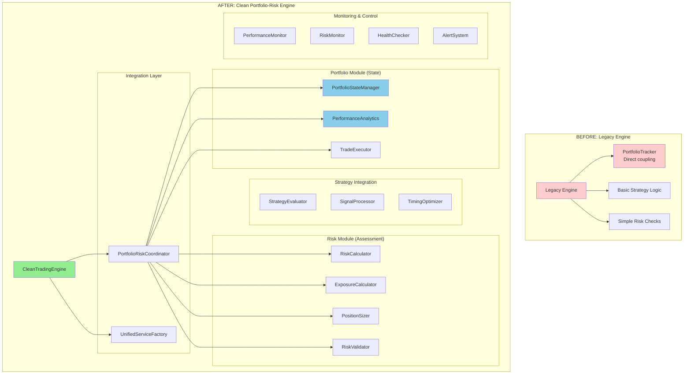

# Week 5: Engine Replacement - Clean Break Approach

**Duration:** Week 5 (2025-08-25 to 2025-08-31)
**Approach:** Clean Break - No Backward Compatibility
**Priority:** Critical
**Objective:** Replace Engine component with clean Portfolio-Risk coordinated trading engine

## Overview

Week 5 focuses on completely replacing the legacy Engine component with a new trading engine that uses **clean portfolio/risk boundaries** established in Weeks 1-4. The engine coordinates portfolio state management with risk assessment through the PortfolioRiskCoordinator.

**Clean Break Strategy:**
- ❌ No legacy engine compatibility
- ❌ No gradual engine migration
- ✅ Complete engine replacement with portfolio integration
- ✅ Advanced risk management and position sizing

## Engine Architecture Analysis

### Current vs Target Engine Architecture



## Week 5 Deliverables

### Progressive Security Phase 3 & Early Integration Testing
Implement security for trading engine and start integration testing:

```python
# Security requirements for trading engine
ENGINE_SECURITY = {
    "position_validation": "All position changes validated before execution",
    "risk_threshold_enforcement": "Hard limits on position sizes and exposures",
    "audit_trail": "All trading decisions logged with full context",
    "secure_order_handling": "Order details sanitized in logs",
    "emergency_controls": "Panic stop functionality for security incidents"
}
```

**Security & Testing Tasks:**
- [ ] Implement secure order validation and sanitization
- [ ] Add comprehensive audit logging for all trading decisions
- [ ] Create emergency stop mechanisms for security incidents
- [ ] **Early Integration Testing**: Test engine with existing modular components
- [ ] **Component Integration**: Validate portfolio state manager integration
- [ ] **Performance Baseline**: Establish performance metrics for new engine

### Architectural Documentation (Progressive Documentation Phase 1)
Document the new engine architecture as we build:

```markdown
# Engine Architecture Documentation
- Component interactions and data flow
- Risk management decision trees
- Position sizing algorithms and constraints
- Portfolio integration patterns
- Performance optimization strategies
```

### Day 1-2: Core Engine Architecture

- [ ] **Portfolio-Aware Trading Engine Core**
  ```python
  """Portfolio-aware trading engine with complete modular integration."""
  from __future__ import annotations

  import asyncio
  from decimal import Decimal
  from datetime import datetime, timedelta
  from typing import Any, Dict, List, Optional
  from enum import Enum

  from pydantic import BaseModel, ConfigDict, Field, ValidationInfo, field_validator
  from pydantic.dataclasses import dataclass

  from cyberdelta.core.portfolio.services import PortfolioServiceFactory
  from cyberdelta.core.risk.services.risk_service_factory import RiskServiceFactory
  from cyberdelta.workflow.portfolio_tracker_cleanup_refactor.week_04_modular_integration import (
      PortfolioRiskCoordinator, UnifiedServiceFactory
  )
  from cyberdelta.core.portfolio.portfolio_types.models import PortfolioState, Position
  from cyberdelta.core.portfolio.portfolio_types.infrastructure import PortfolioEvent, EventType

  class EngineState(str, Enum):
      """Engine operational states."""
      STOPPED = "stopped"
      STARTING = "starting"
      RUNNING = "running"
      PAUSED = "paused"
      STOPPING = "stopping"
      ERROR = "error"

  @dataclass
  class TradingSignal:
      """Trading signal with portfolio context."""

      symbol: str
      direction: str  # "long" | "short" | "close"
      strength: float  # 0.0 to 1.0
      strategy_id: str
      confidence: float  # 0.0 to 1.0
      metadata: dict[str, Any] = Field(default_factory=dict)
      timestamp: datetime = Field(default_factory=lambda: datetime.now(UTC))

      @field_validator("strength", "confidence", mode="before")
      @classmethod
      def validate_percentage(cls, v: float, info: ValidationInfo) -> float:
          """Validate percentage values are between 0 and 1."""
          if not 0.0 <= v <= 1.0:
              raise ValueError(f"{info.field_name} must be between 0.0 and 1.0")
          return v

      @field_validator("direction", mode="before")
      @classmethod
      def validate_direction(cls, v: str) -> str:
          """Validate direction is valid."""
          valid_directions = {"long", "short", "close"}
          if v not in valid_directions:
              raise ValueError(f"Direction must be one of {valid_directions}")
          return v

  class CleanTradingEngine:
      """Trading engine with clean portfolio/risk separation via coordinator."""

      def __init__(self, unified_factory: UnifiedServiceFactory):
          # Clean architecture: engine uses coordinator for portfolio-risk integration
          self.unified_factory = unified_factory
          self.coordinator = unified_factory.get_risk_coordinator()

          # Direct access to clean module interfaces (no cross-boundary access)
          self.portfolio_manager = unified_factory.get_portfolio_manager()

          # Engine components
          self.trade_executor = None
          self.order_manager = None
          self.strategy_evaluator = None
          self.signal_processor = None
          self.performance_monitor = None
          self.alert_system = None

          # Engine state
          self._state = EngineState.STOPPED
          self._config = {}
          self._active_orders: Dict[str, Dict] = {}
          self._pending_signals: List[TradingSignal] = []
          self._execution_stats = {
              "trades_executed": 0,
              "total_volume": Decimal("0"),
              "success_rate": Decimal("0"),
              "avg_execution_time": 0.0
          }

          # Background tasks
          self._tasks: List[asyncio.Task] = []
          self._shutdown_event = asyncio.Event()

      async def start(self) -> None:
          \"\"\"Start the portfolio-aware trading engine.\"\"\"

          if self._state != EngineState.STOPPED:
              raise RuntimeError(f"Cannot start engine in state: {self._state}")

          self._state = EngineState.STARTING

          try:
              # Initialize unified system (portfolio + risk modules)
              await self.unified_factory.initialize_all()

              # Initialize engine components
              await self._initialize_components()

              # Load configuration
              await self._load_engine_configuration()

              # Register event handlers
              await self._register_event_handlers()

              # Start background tasks
              await self._start_background_tasks()

              self._state = EngineState.RUNNING

          except Exception as e:
              self._state = EngineState.ERROR
              raise RuntimeError(f"Failed to start engine: {e}") from e

      async def stop(self) -> None:
          \"\"\"Stop the trading engine gracefully.\"\"\"

          if self._state == EngineState.STOPPED:
              return

          self._state = EngineState.STOPPING

          try:
              # Cancel all active orders
              await self._cancel_all_orders()

              # Stop background tasks
              await self._stop_background_tasks()

              # Shutdown components
              await self._shutdown_components()

              # Shutdown portfolio system
              await self.portfolio_factory.shutdown_all()

              self._state = EngineState.STOPPED

          except Exception as e:
              self._state = EngineState.ERROR
              raise RuntimeError(f"Failed to stop engine: {e}") from e

      async def pause(self) -> None:
          \"\"\"Pause trading while maintaining monitoring.\"\"\"

          if self._state != EngineState.RUNNING:
              raise RuntimeError(f"Cannot pause engine in state: {self._state}")

          # Cancel pending orders but keep monitoring
          await self._cancel_all_orders()
          self._state = EngineState.PAUSED

      async def resume(self) -> None:
          \"\"\"Resume trading from paused state.\"\"\"

          if self._state != EngineState.PAUSED:
              raise RuntimeError(f"Cannot resume engine in state: {self._state}")

          # Restart trading logic
          self._state = EngineState.RUNNING

      async def process_trading_signal(self, signal: TradingSignal) -> dict[str, Any]:
          \"\"\"Process a trading signal with complete portfolio context.\"\"\"

          if self._state != EngineState.RUNNING:
              return {"status": "rejected", "reason": f"Engine not running: {self._state}"}

          try:
              # Validate signal
              validation_result = await self._validate_signal(signal)
              if not validation_result["valid"]:
                  return {"status": "rejected", "reason": validation_result["reason"]}

              # Get current portfolio context
              portfolio_context = await self._get_portfolio_context()

              # Evaluate signal with portfolio context
              evaluation = await self.strategy_evaluator.evaluate_signal(signal, portfolio_context)
              if not evaluation["should_execute"]:
                  return {"status": "rejected", "reason": evaluation["reason"]}

              # Calculate position size
              position_size = await self.position_sizer.calculate_size(
                  signal, portfolio_context, evaluation
              )

              if position_size <= 0:
                  return {"status": "rejected", "reason": "Position size too small"}

              # Risk checks
              risk_check = await self.risk_manager.check_trade_risk(
                  signal, position_size, portfolio_context
              )
              if not risk_check["approved"]:
                  return {"status": "rejected", "reason": risk_check["reason"]}

              # Execute trade
              execution_result = await self.trade_executor.execute_trade({
                  "signal": signal,
                  "position_size": position_size,
                  "portfolio_context": portfolio_context,
                  "risk_parameters": risk_check["parameters"]
              })

              # Update execution stats
              await self._update_execution_stats(execution_result)

              return {
                  "status": "executed",
                  "execution_id": execution_result["execution_id"],
                  "position_size": position_size,
                  "portfolio_impact": execution_result["portfolio_impact"]
              }

          except Exception as e:
              await self.alert_system.send_alert(
                  "signal_processing_error",
                  f"Failed to process signal for {signal.symbol}: {e}"
              )
              return {"status": "error", "reason": str(e)}

      async def get_engine_status(self) -> Dict[str, Any]:
          \"\"\"Get comprehensive engine status.\"\"\"

          portfolio_state = await self.portfolio_manager.get_current_state()
          performance = await self.performance_analytics.calculate_performance(portfolio_state)
          risk_metrics = await self.risk_analytics.calculate_exposure(portfolio_state)

          return {
              "state": self._state.value,
              "uptime": self._get_uptime(),
              "portfolio": {
                  "total_capital": performance.total_capital,
                  "total_exposure": risk_metrics.total_exposure,
                  "position_count": len(await self.portfolio_manager.get_positions()),
                  "unrealized_pnl": performance.unrealized_pnl
              },
              "execution_stats": self._execution_stats.copy(),
              "active_orders": len(self._active_orders),
              "pending_signals": len(self._pending_signals),
              "health_score": await self.health_checker.get_health_score()
          }

      async def emergency_stop(self, reason: str) -> None:
          \"\"\"Emergency stop with immediate order cancellation.\"\"\"

          # Cancel all orders immediately
          await self._emergency_cancel_all_orders()

          # Send critical alert
          await self.alert_system.send_critical_alert(
              "emergency_stop",
              f"Emergency stop triggered: {reason}"
          )

          # Set error state
          self._state = EngineState.ERROR

          # Stop all background tasks
          await self._stop_background_tasks()

      async def _initialize_components(self) -> None:
          \"\"\"Initialize all engine components.\"\"\"

          # Position sizing component
          self.position_sizer = PortfolioAwarePositionSizer(
              portfolio_manager=self.portfolio_manager,
              performance_analytics=self.performance_analytics,
              risk_analytics=self.risk_analytics
          )

          # Risk management component
          self.risk_manager = AdvancedRiskManager(
              portfolio_manager=self.portfolio_manager,
              risk_analytics=self.risk_analytics,
              exposure_analytics=self.exposure_analytics
          )

          # Trade execution component
          self.trade_executor = PortfolioAwareTradeExecutor(
              portfolio_manager=self.portfolio_manager,
              event_dispatcher=self.event_dispatcher
          )

          # Order management component
          self.order_manager = AdvancedOrderManager(
              trade_executor=self.trade_executor,
              portfolio_manager=self.portfolio_manager
          )

          # Strategy evaluation component
          self.strategy_evaluator = PortfolioAwareStrategyEvaluator(
              portfolio_manager=self.portfolio_manager,
              performance_analytics=self.performance_analytics
          )

          # Signal processing component
          self.signal_processor = AdvancedSignalProcessor()

          # Performance monitoring component
          self.performance_monitor = RealTimePerformanceMonitor(
              portfolio_manager=self.portfolio_manager,
              performance_analytics=self.performance_analytics
          )

          # Risk monitoring component
          self.risk_monitor = ContinuousRiskMonitor(
              portfolio_manager=self.portfolio_manager,
              risk_analytics=self.risk_analytics
          )

          # Health checking component
          self.health_checker = EngineHealthChecker(
              components=[
                  self.portfolio_manager,
                  self.position_sizer,
                  self.risk_manager,
                  self.trade_executor
              ]
          )

          # Alert system component
          self.alert_system = EngineAlertSystem()

          # Initialize all components
          components = [
              self.position_sizer, self.risk_manager, self.trade_executor,
              self.order_manager, self.strategy_evaluator, self.signal_processor,
              self.performance_monitor, self.risk_monitor, self.health_checker,
              self.alert_system
          ]

          for component in components:
              if hasattr(component, 'initialize'):
                  await component.initialize()

      async def _start_background_tasks(self) -> None:
          \"\"\"Start all background monitoring and processing tasks.\"\"\"

          # Portfolio monitoring task
          self._tasks.append(asyncio.create_task(self._portfolio_monitoring_loop()))

          # Risk monitoring task
          self._tasks.append(asyncio.create_task(self._risk_monitoring_loop()))

          # Performance monitoring task
          self._tasks.append(asyncio.create_task(self._performance_monitoring_loop()))

          # Signal processing task
          self._tasks.append(asyncio.create_task(self._signal_processing_loop()))

          # Order management task
          self._tasks.append(asyncio.create_task(self._order_management_loop()))

          # Health checking task
          self._tasks.append(asyncio.create_task(self._health_checking_loop()))

          # Cleanup task
          self._tasks.append(asyncio.create_task(self._cleanup_loop()))

      async def _portfolio_monitoring_loop(self) -> None:
          \"\"\"Continuous portfolio state monitoring.\"\"\"

          while self._state != EngineState.STOPPED:
              try:
                  # Get current portfolio state
                  portfolio_state = await self.portfolio_manager.get_current_state()

                  # Monitor for significant changes
                  await self.performance_monitor.check_portfolio_changes(portfolio_state)

                  # Update performance metrics
                  await self.performance_monitor.update_metrics(portfolio_state)

                  await asyncio.sleep(5)  # Monitor every 5 seconds

              except Exception as e:
                  await self.alert_system.send_alert(
                      "portfolio_monitoring_error",
                      f"Portfolio monitoring error: {e}"
                  )
                  await asyncio.sleep(5)

      async def _risk_monitoring_loop(self) -> None:
          \"\"\"Continuous risk monitoring with automatic responses.\"\"\"

          while self._state != EngineState.STOPPED:
              try:
                  # Check all risk limits
                  risk_status = await self.risk_monitor.check_all_limits()

                  # Handle violations
                  if risk_status["violations"]:
                      await self._handle_risk_violations(risk_status["violations"])

                  # Update risk metrics
                  await self.risk_monitor.update_metrics()

                  await asyncio.sleep(2)  # Check every 2 seconds

              except Exception as e:
                  await self.alert_system.send_alert(
                      "risk_monitoring_error",
                      f"Risk monitoring error: {e}"
                  )
                  await asyncio.sleep(2)

      async def _signal_processing_loop(self) -> None:
          \"\"\"Process pending trading signals.\"\"\"

          while self._state != EngineState.STOPPED:
              try:
                  if self._pending_signals and self._state == EngineState.RUNNING:
                      # Process oldest signal first
                      signal = self._pending_signals.pop(0)
                      result = await self.process_trading_signal(signal)

                      # Log result
                      if result["status"] == "executed":
                          self._execution_stats["trades_executed"] += 1

                  await asyncio.sleep(0.1)  # Fast signal processing

              except Exception as e:
                  await self.alert_system.send_alert(
                      "signal_processing_error",
                      f"Signal processing error: {e}"
                  )
                  await asyncio.sleep(1)

      async def _get_portfolio_context(self) -> Dict[str, Any]:
          \"\"\"Get comprehensive portfolio context for decision making.\"\"\"

          portfolio_state = await self.portfolio_manager.get_current_state()
          performance = await self.performance_analytics.calculate_performance(portfolio_state)
          risk_metrics = await self.risk_analytics.calculate_exposure(portfolio_state)
          exposure_metrics = await self.exposure_analytics.calculate_exposure(portfolio_state)

          return {
              "portfolio_state": portfolio_state,
              "performance": performance,
              "risk_metrics": risk_metrics,
              "exposure_metrics": exposure_metrics,
              "total_capital": performance.total_capital,
              "available_capital": performance.total_capital - risk_metrics.total_exposure,
              "position_count": len(portfolio_state.positions),
              "current_leverage": risk_metrics.risk_metrics.get("leverage", 0),
              "timestamp": datetime.utcnow()
          }

      async def _validate_signal(self, signal: TradingSignal) -> Dict[str, Any]:
          \"\"\"Validate trading signal before processing.\"\"\"

          # Basic validation
          if not signal.symbol:
              return {"valid": False, "reason": "Missing symbol"}

          if signal.direction not in ["long", "short", "close"]:
              return {"valid": False, "reason": "Invalid direction"}

          if not 0 <= signal.strength <= 1:
              return {"valid": False, "reason": "Invalid strength"}

          if not 0 <= signal.confidence <= 1:
              return {"valid": False, "reason": "Invalid confidence"}

          # Check signal age
          signal_age = (datetime.utcnow() - signal.timestamp).total_seconds()
          if signal_age > 300:  # 5 minutes
              return {"valid": False, "reason": "Signal too old"}

          return {"valid": True}

      def _get_uptime(self) -> float:
          \"\"\"Get engine uptime in seconds.\"\"\"
          # Implement uptime tracking
          return 0.0
  ```

- [ ] **Portfolio-Aware Position Sizer**
  ```python
  """Advanced position sizing with complete portfolio integration."""
  from __future__ import annotations

  import math
  from decimal import Decimal
  from typing import Dict, Any

  class PortfolioAwarePositionSizer:
      \"\"\"Position sizer with advanced portfolio context.\"\"\"

      def __init__(
          self,
          portfolio_manager,
          performance_analytics,
          risk_analytics
      ):
          self.portfolio_manager = portfolio_manager
          self.performance_analytics = performance_analytics
          self.risk_analytics = risk_analytics

          # Position sizing parameters
          self.max_position_percent = Decimal("0.1")  # 10% max per position
          self.volatility_target = Decimal("0.02")  # 2% daily volatility target
          self.correlation_limit = Decimal("0.7")  # Maximum correlation with existing positions
          self.drawdown_scaling = True  # Scale down during drawdowns

      async def calculate_size(
          self,
          signal: TradingSignal,
          portfolio_context: Dict[str, Any],
          evaluation: Dict[str, Any]
      ) -> Decimal:
          \"\"\"Calculate optimal position size using multiple methods.\"\"\"

          # Get multiple sizing estimates
          sizes = {}

          # 1. Fixed fractional sizing
          sizes["fixed_fractional"] = await self._fixed_fractional_sizing(
              signal, portfolio_context
          )

          # 2. Volatility-based sizing
          sizes["volatility_based"] = await self._volatility_based_sizing(
              signal, portfolio_context
          )

          # 3. Kelly criterion sizing
          sizes["kelly"] = await self._kelly_criterion_sizing(
              signal, portfolio_context, evaluation
          )

          # 4. Risk parity sizing
          sizes["risk_parity"] = await self._risk_parity_sizing(
              signal, portfolio_context
          )

          # Combine sizes using weighted average
          final_size = await self._combine_sizing_methods(sizes, signal, portfolio_context)

          # Apply portfolio-level adjustments
          adjusted_size = await self._apply_portfolio_adjustments(
              final_size, signal, portfolio_context
          )

          # Apply risk limits
          limited_size = await self._apply_risk_limits(
              adjusted_size, signal, portfolio_context
          )

          return limited_size

      async def _fixed_fractional_sizing(
          self,
          signal: TradingSignal,
          portfolio_context: Dict[str, Any]
      ) -> Decimal:
          \"\"\"Fixed percentage of portfolio sizing.\"\"\"

          total_capital = portfolio_context["total_capital"]
          base_percent = self.max_position_percent

          # Adjust based on signal strength and confidence
          signal_factor = Decimal(str(signal.strength * signal.confidence))
          adjusted_percent = base_percent * signal_factor

          return total_capital * adjusted_percent

      async def _volatility_based_sizing(
          self,
          signal: TradingSignal,
          portfolio_context: Dict[str, Any]
      ) -> Decimal:
          \"\"\"Size position based on volatility targeting.\"\"\"

          # Get symbol volatility (placeholder - would integrate with market data)
          symbol_volatility = await self._get_symbol_volatility(signal.symbol)

          if symbol_volatility <= 0:
              return Decimal("0")

          total_capital = portfolio_context["total_capital"]

          # Calculate position size to achieve target volatility
          target_risk = total_capital * self.volatility_target
          position_size = target_risk / symbol_volatility

          # Adjust for signal strength
          signal_factor = Decimal(str(signal.strength * signal.confidence))

          return position_size * signal_factor

      async def _kelly_criterion_sizing(
          self,
          signal: TradingSignal,
          portfolio_context: Dict[str, Any],
          evaluation: Dict[str, Any]
      ) -> Decimal:
          \"\"\"Kelly criterion optimal sizing.\"\"\"

          # Get strategy win rate and risk/reward from evaluation
          win_rate = Decimal(str(evaluation.get("expected_win_rate", 0.5)))
          avg_win = Decimal(str(evaluation.get("expected_win_amount", 1.0)))
          avg_loss = Decimal(str(evaluation.get("expected_loss_amount", 1.0)))

          if avg_loss <= 0:
              return Decimal("0")

          # Kelly formula: f = (bp - q) / b
          # where b = avg_win/avg_loss, p = win_rate, q = 1-win_rate
          b = avg_win / avg_loss
          p = win_rate
          q = Decimal("1") - win_rate

          kelly_fraction = (b * p - q) / b

          # Cap Kelly at reasonable level (25% max)
          kelly_fraction = min(kelly_fraction, Decimal("0.25"))
          kelly_fraction = max(kelly_fraction, Decimal("0"))

          total_capital = portfolio_context["total_capital"]

          # Adjust for signal confidence
          confidence_factor = Decimal(str(signal.confidence))

          return total_capital * kelly_fraction * confidence_factor

      async def _risk_parity_sizing(
          self,
          signal: TradingSignal,
          portfolio_context: Dict[str, Any]
      ) -> Decimal:
          \"\"\"Risk parity sizing to balance portfolio risk.\"\"\"

          # Calculate current portfolio risk concentration
          portfolio_state = portfolio_context["portfolio_state"]
          positions = await self.portfolio_manager.get_positions()

          if not positions:
              # First position gets standard allocation
              return await self._fixed_fractional_sizing(signal, portfolio_context)

          # Calculate risk contribution of each position
          position_risks = {}
          total_risk = Decimal("0")

          for position in positions:
              position_risk = await self._calculate_position_risk(position)
              position_risks[position.symbol] = position_risk
              total_risk += position_risk

          if total_risk <= 0:
              return await self._fixed_fractional_sizing(signal, portfolio_context)

          # Target equal risk contribution
          target_risk_per_position = total_risk / (len(positions) + 1)  # +1 for new position

          # Size new position to achieve target risk
          symbol_volatility = await self._get_symbol_volatility(signal.symbol)
          if symbol_volatility <= 0:
              return Decimal("0")

          position_size = target_risk_per_position / symbol_volatility

          # Adjust for signal strength
          signal_factor = Decimal(str(signal.strength))

          return position_size * signal_factor

      async def _combine_sizing_methods(
          self,
          sizes: Dict[str, Decimal],
          signal: TradingSignal,
          portfolio_context: Dict[str, Any]
      ) -> Decimal:
          \"\"\"Combine multiple sizing methods using weighted average.\"\"\"

          # Weights for different methods
          weights = {
              "fixed_fractional": Decimal("0.2"),
              "volatility_based": Decimal("0.3"),
              "kelly": Decimal("0.3"),
              "risk_parity": Decimal("0.2")
          }

          # Calculate weighted average
          weighted_sum = Decimal("0")
          total_weight = Decimal("0")

          for method, size in sizes.items():
              if method in weights and size > 0:
                  weight = weights[method]
                  weighted_sum += size * weight
                  total_weight += weight

          if total_weight <= 0:
              return Decimal("0")

          return weighted_sum / total_weight

      async def _apply_portfolio_adjustments(
          self,
          base_size: Decimal,
          signal: TradingSignal,
          portfolio_context: Dict[str, Any]
      ) -> Decimal:
          \"\"\"Apply portfolio-level adjustments to position size.\"\"\"

          adjusted_size = base_size

          # 1. Drawdown scaling
          if self.drawdown_scaling:
              performance = portfolio_context["performance"]
              if performance.drawdown and performance.drawdown > 0:
                  # Scale down during drawdowns
                  drawdown_factor = max(Decimal("0.5"), Decimal("1") - performance.drawdown)
                  adjusted_size *= drawdown_factor

          # 2. Concentration adjustments
          concentration_factor = await self._calculate_concentration_factor(
              signal, portfolio_context
          )
          adjusted_size *= concentration_factor

          # 3. Correlation adjustments
          correlation_factor = await self._calculate_correlation_factor(
              signal, portfolio_context
          )
          adjusted_size *= correlation_factor

          # 4. Available capacity
          available_capital = portfolio_context["available_capital"]
          if available_capital <= 0:
              return Decimal("0")

          # Don't use more than 80% of available capital for single position
          max_from_available = available_capital * Decimal("0.8")
          adjusted_size = min(adjusted_size, max_from_available)

          return adjusted_size

      async def _apply_risk_limits(
          self,
          size: Decimal,
          signal: TradingSignal,
          portfolio_context: Dict[str, Any]
      ) -> Decimal:
          \"\"\"Apply final risk limits to position size.\"\"\"

          # Maximum position size limit
          total_capital = portfolio_context["total_capital"]
          max_position = total_capital * self.max_position_percent
          size = min(size, max_position)

          # Minimum position size (avoid tiny positions)
          min_position = total_capital * Decimal("0.001")  # 0.1% minimum
          if size < min_position:
              return Decimal("0")

          # Check leverage limits
          current_leverage = portfolio_context["current_leverage"]
          if current_leverage >= 3:  # Max 3x leverage
              return Decimal("0")

          return size

      async def _get_symbol_volatility(self, symbol: str) -> Decimal:
          \"\"\"Get symbol volatility (placeholder for market data integration).\"\"\"
          # This would integrate with actual market data
          # For now, return reasonable default
          return Decimal("0.02")  # 2% daily volatility

      async def _calculate_position_risk(self, position: Position) -> Decimal:
          \"\"\"Calculate risk contribution of a position.\"\"\"
          # Risk = position_size * volatility
          symbol_volatility = await self._get_symbol_volatility(position.symbol)
          return abs(position.size) * symbol_volatility

      async def _calculate_concentration_factor(
          self,
          signal: TradingSignal,
          portfolio_context: Dict[str, Any]
      ) -> Decimal:
          \"\"\"Calculate concentration adjustment factor.\"\"\"

          # Check if we already have exposure to this symbol
          positions = await self.portfolio_manager.get_positions()
          existing_exposure = Decimal("0")

          for position in positions:
              if position.symbol == signal.symbol:
                  existing_exposure += abs(position.size)

          if existing_exposure == 0:
              return Decimal("1")  # No concentration penalty

          total_capital = portfolio_context["total_capital"]
          concentration_ratio = existing_exposure / total_capital

          # Reduce size as concentration increases
          if concentration_ratio > self.max_position_percent:
              return Decimal("0.5")  # Heavy penalty for over-concentration
          elif concentration_ratio > self.max_position_percent * Decimal("0.5"):
              return Decimal("0.8")  # Moderate penalty
          else:
              return Decimal("1")  # No penalty

      async def _calculate_correlation_factor(
          self,
          signal: TradingSignal,
          portfolio_context: Dict[str, Any]
      ) -> Decimal:
          \"\"\"Calculate correlation adjustment factor.\"\"\"

          # This would calculate correlation with existing positions
          # For now, return conservative factor
          return Decimal("0.9")  # Slight reduction for correlation
  ```

### Day 3-4: Advanced Risk Management Integration

- [ ] **Advanced Risk Manager**
  ```python
  """Advanced risk management with real-time portfolio monitoring."""
  from __future__ import annotations

  import asyncio
  from decimal import Decimal
  from datetime import datetime, timedelta
  from typing import Dict, List, Any, Optional
  from dataclasses import dataclass
  from enum import Enum

  class RiskLevel(str, Enum):
      LOW = "low"
      MEDIUM = "medium"
      HIGH = "high"
      CRITICAL = "critical"

  @dataclass
  class RiskLimit:
      name: str
      limit_value: Decimal
      current_value: Decimal
      risk_level: RiskLevel
      violation: bool
      description: str

  @dataclass
  class RiskCheckResult:
      approved: bool
      risk_score: float
      reasons: List[str]
      parameters: Dict[str, Any]
      limits_checked: List[RiskLimit]

  class AdvancedRiskManager:
      \"\"\"Advanced risk management with comprehensive portfolio integration.\"\"\"

      def __init__(
          self,
          portfolio_manager,
          risk_analytics,
          exposure_analytics
      ):
          self.portfolio_manager = portfolio_manager
          self.risk_analytics = risk_analytics
          self.exposure_analytics = exposure_analytics

          # Risk limits configuration
          self.risk_limits = {
              "max_total_exposure": Decimal("100000"),  # $100k max exposure
              "max_position_size": Decimal("10000"),    # $10k max per position
              "max_leverage": Decimal("3"),             # 3x max leverage
              "max_correlation": Decimal("0.8"),        # 80% max correlation
              "max_drawdown": Decimal("0.15"),          # 15% max drawdown
              "max_var": Decimal("5000"),               # $5k max daily VaR
              "max_positions": 25,                      # Max 25 positions
              "min_liquidity_ratio": Decimal("0.1"),   # 10% min cash
              "max_sector_concentration": Decimal("0.4"), # 40% max per sector
              "max_currency_exposure": Decimal("0.6")   # 60% max single currency
          }

          # Dynamic risk adjustments
          self.volatility_regime = "normal"  # normal, high, extreme
          self.market_stress_factor = Decimal("1.0")
          self.recent_performance = []

          # Risk monitoring state
          self.risk_violations = []
          self.risk_alerts = []
          self.last_risk_check = datetime.utcnow()

      async def initialize(self) -> None:
          \"\"\"Initialize risk manager.\"\"\"
          # Load historical performance for context
          await self._load_performance_history()

          # Initialize volatility regime detection
          await self._update_volatility_regime()

      async def check_trade_risk(
          self,
          signal: TradingSignal,
          position_size: Decimal,
          portfolio_context: Dict[str, Any]
      ) -> RiskCheckResult:
          \"\"\"Comprehensive risk check for a potential trade.\"\"\"

          reasons = []
          limits_checked = []
          risk_score = 0.0

          # 1. Position size limits
          position_limit = await self._check_position_size_limit(
              signal, position_size, portfolio_context
          )
          limits_checked.append(position_limit)
          if position_limit.violation:
              reasons.append(f"Position size exceeds limit: {position_limit.description}")
              risk_score += 30

          # 2. Total exposure limits
          exposure_limit = await self._check_exposure_limit(
              position_size, portfolio_context
          )
          limits_checked.append(exposure_limit)
          if exposure_limit.violation:
              reasons.append(f"Total exposure limit exceeded: {exposure_limit.description}")
              risk_score += 40

          # 3. Leverage limits
          leverage_limit = await self._check_leverage_limit(
              position_size, portfolio_context
          )
          limits_checked.append(leverage_limit)
          if leverage_limit.violation:
              reasons.append(f"Leverage limit exceeded: {leverage_limit.description}")
              risk_score += 35

          # 4. Correlation limits
          correlation_limit = await self._check_correlation_limit(
              signal, position_size, portfolio_context
          )
          limits_checked.append(correlation_limit)
          if correlation_limit.violation:
              reasons.append(f"Correlation limit exceeded: {correlation_limit.description}")
              risk_score += 25

          # 5. Concentration limits
          concentration_limit = await self._check_concentration_limit(
              signal, position_size, portfolio_context
          )
          limits_checked.append(concentration_limit)
          if concentration_limit.violation:
              reasons.append(f"Concentration limit exceeded: {concentration_limit.description}")
              risk_score += 20

          # 6. VaR limits
          var_limit = await self._check_var_limit(
              signal, position_size, portfolio_context
          )
          limits_checked.append(var_limit)
          if var_limit.violation:
              reasons.append(f"VaR limit exceeded: {var_limit.description}")
              risk_score += 45

          # 7. Liquidity limits
          liquidity_limit = await self._check_liquidity_limit(
              position_size, portfolio_context
          )
          limits_checked.append(liquidity_limit)
          if liquidity_limit.violation:
              reasons.append(f"Liquidity limit exceeded: {liquidity_limit.description}")
              risk_score += 30

          # 8. Market stress adjustments
          stress_adjustment = await self._apply_market_stress_adjustment(risk_score)
          risk_score += stress_adjustment

          # Determine approval
          approved = risk_score < 50  # Risk score threshold

          # Risk parameters for execution
          parameters = {
              "max_slippage": self._calculate_max_slippage(risk_score),
              "timeout_seconds": self._calculate_timeout(risk_score),
              "retry_attempts": self._calculate_retry_attempts(risk_score),
              "partial_fill_ok": risk_score < 30
          }

          return RiskCheckResult(
              approved=approved,
              risk_score=risk_score,
              reasons=reasons,
              parameters=parameters,
              limits_checked=limits_checked
          )

      async def check_all_limits(self) -> Dict[str, Any]:
          \"\"\"Check all portfolio-level risk limits.\"\"\"

          portfolio_context = await self._get_portfolio_context()
          violations = []
          warnings = []

          # Check each limit
          for limit_name, limit_value in self.risk_limits.items():
              violation = await self._check_specific_limit(
                  limit_name, limit_value, portfolio_context
              )

              if violation["violated"]:
                  violations.append(violation)
              elif violation["warning"]:
                  warnings.append(violation)

          return {
              "violations": violations,
              "warnings": warnings,
              "total_risk_score": self._calculate_total_risk_score(violations, warnings),
              "risk_level": self._determine_risk_level(violations, warnings)
          }

      async def update_risk_limits(self, new_limits: Dict[str, Decimal]) -> None:
          \"\"\"Update risk limits with validation.\"\"\"

          for limit_name, limit_value in new_limits.items():
              if limit_name in self.risk_limits:
                  if limit_value > 0:  # Basic validation
                      self.risk_limits[limit_name] = limit_value

      async def get_risk_metrics(self) -> Dict[str, Any]:
          \"\"\"Get comprehensive risk metrics.\"\"\"

          portfolio_context = await self._get_portfolio_context()
          portfolio_state = portfolio_context["portfolio_state"]

          # Calculate various risk metrics
          var_metrics = await self._calculate_var_metrics(portfolio_state)
          correlation_metrics = await self._calculate_correlation_metrics(portfolio_state)
          concentration_metrics = await self._calculate_concentration_metrics(portfolio_state)

          return {
              "total_exposure": portfolio_context["risk_metrics"].total_exposure,
              "leverage": portfolio_context["current_leverage"],
              "position_count": len(await self.portfolio_manager.get_positions()),
              "var_1_day": var_metrics["var_1_day"],
              "var_5_day": var_metrics["var_5_day"],
              "expected_shortfall": var_metrics["expected_shortfall"],
              "max_correlation": correlation_metrics["max_correlation"],
              "avg_correlation": correlation_metrics["avg_correlation"],
              "sector_concentration": concentration_metrics["sector_concentration"],
              "currency_concentration": concentration_metrics["currency_concentration"],
              "liquidity_ratio": await self._calculate_liquidity_ratio(portfolio_state),
              "volatility_regime": self.volatility_regime,
              "market_stress_factor": self.market_stress_factor,
              "risk_violations": len(self.risk_violations),
              "last_updated": datetime.utcnow()
          }

      async def _check_position_size_limit(
          self,
          signal: TradingSignal,
          position_size: Decimal,
          portfolio_context: Dict[str, Any]
      ) -> RiskLimit:
          \"\"\"Check individual position size limits.\"\"\"

          max_position = self.risk_limits["max_position_size"]

          # Adjust for volatility regime
          if self.volatility_regime == "high":
              max_position *= Decimal("0.8")
          elif self.volatility_regime == "extreme":
              max_position *= Decimal("0.5")

          violation = position_size > max_position

          return RiskLimit(
              name="position_size",
              limit_value=max_position,
              current_value=position_size,
              risk_level=RiskLevel.HIGH if violation else RiskLevel.LOW,
              violation=violation,
              description=f"Position size {position_size} vs limit {max_position}"
          )

      async def _check_exposure_limit(
          self,
          additional_exposure: Decimal,
          portfolio_context: Dict[str, Any]
      ) -> RiskLimit:
          \"\"\"Check total exposure limits.\"\"\"

          current_exposure = portfolio_context["risk_metrics"].total_exposure
          new_total_exposure = current_exposure + additional_exposure
          max_exposure = self.risk_limits["max_total_exposure"]

          # Adjust for market stress
          adjusted_max = max_exposure * (Decimal("2") - self.market_stress_factor)

          violation = new_total_exposure > adjusted_max

          return RiskLimit(
              name="total_exposure",
              limit_value=adjusted_max,
              current_value=new_total_exposure,
              risk_level=RiskLevel.CRITICAL if violation else RiskLevel.LOW,
              violation=violation,
              description=f"Total exposure {new_total_exposure} vs limit {adjusted_max}"
          )

      async def _check_leverage_limit(
          self,
          additional_exposure: Decimal,
          portfolio_context: Dict[str, Any]
      ) -> RiskLimit:
          \"\"\"Check leverage limits.\"\"\"

          total_capital = portfolio_context["total_capital"]
          current_exposure = portfolio_context["risk_metrics"].total_exposure
          new_total_exposure = current_exposure + additional_exposure

          new_leverage = new_total_exposure / total_capital if total_capital > 0 else Decimal("0")
          max_leverage = self.risk_limits["max_leverage"]

          # Reduce leverage limit during high volatility
          if self.volatility_regime == "high":
              max_leverage *= Decimal("0.8")
          elif self.volatility_regime == "extreme":
              max_leverage *= Decimal("0.6")

          violation = new_leverage > max_leverage

          return RiskLimit(
              name="leverage",
              limit_value=max_leverage,
              current_value=new_leverage,
              risk_level=RiskLevel.HIGH if violation else RiskLevel.LOW,
              violation=violation,
              description=f"Leverage {new_leverage:.2f}x vs limit {max_leverage:.2f}x"
          )

      async def _calculate_var_metrics(self, portfolio_state) -> Dict[str, Decimal]:
          \"\"\"Calculate Value at Risk metrics.\"\"\"

          # This would integrate with actual risk calculation engine
          # For now, provide reasonable estimates

          total_exposure = Decimal("0")
          positions = await self.portfolio_manager.get_positions()

          for position in positions:
              total_exposure += abs(position.size)

          # Simple VaR estimate: 2% of total exposure
          var_1_day = total_exposure * Decimal("0.02")
          var_5_day = var_1_day * Decimal("2.236")  # sqrt(5) scaling
          expected_shortfall = var_1_day * Decimal("1.3")  # 30% beyond VaR

          return {
              "var_1_day": var_1_day,
              "var_5_day": var_5_day,
              "expected_shortfall": expected_shortfall
          }

      async def _get_portfolio_context(self) -> Dict[str, Any]:
          \"\"\"Get portfolio context for risk calculations.\"\"\"

          portfolio_state = await self.portfolio_manager.get_current_state()
          performance = await self.portfolio_manager.performance_analytics.calculate_performance(portfolio_state)
          risk_metrics = await self.risk_analytics.calculate_exposure(portfolio_state)

          return {
              "portfolio_state": portfolio_state,
              "performance": performance,
              "risk_metrics": risk_metrics,
              "total_capital": performance.total_capital,
              "current_leverage": risk_metrics.risk_metrics.get("leverage", 0)
          }

      def _calculate_max_slippage(self, risk_score: float) -> Decimal:
          \"\"\"Calculate maximum acceptable slippage based on risk score.\"\"\"
          # Higher risk score = lower slippage tolerance
          base_slippage = Decimal("0.001")  # 0.1% base
          risk_factor = Decimal(str(max(0.5, 1.0 - risk_score / 100)))
          return base_slippage * risk_factor

      def _calculate_timeout(self, risk_score: float) -> int:
          \"\"\"Calculate execution timeout based on risk score.\"\"\"
          # Higher risk = shorter timeout
          base_timeout = 30  # 30 seconds base
          risk_factor = max(0.5, 1.0 - risk_score / 100)
          return int(base_timeout * risk_factor)

      def _calculate_retry_attempts(self, risk_score: float) -> int:
          \"\"\"Calculate retry attempts based on risk score.\"\"\"
          if risk_score > 70:
              return 1  # High risk = minimal retries
          elif risk_score > 40:
              return 2  # Medium risk = few retries
          else:
              return 3  # Low risk = normal retries
  ```

### Day 5-7: Trade Execution & Order Management

- [ ] **Portfolio-Aware Trade Executor**
  ```python
  """Advanced trade executor with complete portfolio integration."""
  from __future__ import annotations

  import asyncio
  import uuid
  from decimal import Decimal
  from datetime import datetime
  from typing import Dict, List, Any, Optional
  from dataclasses import dataclass
  from enum import Enum

  class OrderStatus(str, Enum):
      PENDING = "pending"
      SUBMITTED = "submitted"
      PARTIAL = "partial"
      FILLED = "filled"
      CANCELLED = "cancelled"
      REJECTED = "rejected"
      FAILED = "failed"

  class OrderType(str, Enum):
      MARKET = "market"
      LIMIT = "limit"
      STOP = "stop"
      STOP_LIMIT = "stop_limit"

  @dataclass
  class TradeOrder:
      order_id: str
      symbol: str
      side: str  # "buy" | "sell"
      order_type: OrderType
      quantity: Decimal
      price: Optional[Decimal]
      stop_price: Optional[Decimal]
      time_in_force: str
      status: OrderStatus
      exchange_id: str
      strategy_id: str
      created_at: datetime
      updated_at: datetime
      filled_quantity: Decimal = Decimal("0")
      avg_fill_price: Optional[Decimal] = None
      fees: Decimal = Decimal("0")
      metadata: Dict[str, Any] = None

  @dataclass
  class ExecutionResult:
      execution_id: str
      success: bool
      orders: List[TradeOrder]
      total_filled: Decimal
      avg_price: Decimal
      total_fees: Decimal
      execution_time_ms: float
      portfolio_impact: Dict[str, Any]
      error_message: Optional[str] = None

  class PortfolioAwareTradeExecutor:
      \"\"\"Advanced trade executor with portfolio integration and smart routing.\"\"\"

      def __init__(self, portfolio_manager, event_dispatcher):
          self.portfolio_manager = portfolio_manager
          self.event_dispatcher = event_dispatcher

          # Execution configuration
          self.max_order_size = Decimal("10000")
          self.slice_size = Decimal("1000")  # Break large orders into slices
          self.max_slippage = Decimal("0.002")  # 0.2% max slippage
          self.execution_timeout = 60  # 60 seconds max execution time

          # Active orders tracking
          self.active_orders: Dict[str, TradeOrder] = {}
          self.execution_history: List[ExecutionResult] = []

          # Performance metrics
          self.execution_stats = {
              "total_executions": 0,
              "successful_executions": 0,
              "avg_execution_time": 0.0,
              "avg_slippage": Decimal("0"),
              "total_fees": Decimal("0")
          }

      async def initialize(self) -> None:
          \"\"\"Initialize trade executor.\"\"\"
          # Start order management background task
          asyncio.create_task(self._order_management_loop())

      async def execute_trade(self, trade_request: Dict[str, Any]) -> ExecutionResult:
          \"\"\"Execute a trade with advanced portfolio integration.\"\"\"

          execution_id = str(uuid.uuid4())
          start_time = datetime.utcnow()

          try:
              # Extract trade parameters
              signal = trade_request["signal"]
              position_size = trade_request["position_size"]
              portfolio_context = trade_request["portfolio_context"]
              risk_parameters = trade_request["risk_parameters"]

              # Determine execution strategy
              execution_strategy = await self._determine_execution_strategy(
                  signal, position_size, portfolio_context, risk_parameters
              )

              # Execute based on strategy
              if execution_strategy["type"] == "single_order":
                  result = await self._execute_single_order(
                      signal, position_size, execution_strategy, execution_id
                  )
              elif execution_strategy["type"] == "sliced_execution":
                  result = await self._execute_sliced_order(
                      signal, position_size, execution_strategy, execution_id
                  )
              elif execution_strategy["type"] == "twap":
                  result = await self._execute_twap_order(
                      signal, position_size, execution_strategy, execution_id
                  )
              else:
                  raise ValueError(f"Unknown execution strategy: {execution_strategy['type']}")

              # Calculate portfolio impact
              portfolio_impact = await self._calculate_portfolio_impact(
                  result, portfolio_context
              )
              result.portfolio_impact = portfolio_impact

              # Update execution statistics
              await self._update_execution_stats(result, start_time)

              # Create portfolio events for successful execution
              if result.success:
                  await self._create_execution_events(result, signal)

              return result

          except Exception as e:
              # Create failed execution result
              end_time = datetime.utcnow()
              execution_time = (end_time - start_time).total_seconds() * 1000

              return ExecutionResult(
                  execution_id=execution_id,
                  success=False,
                  orders=[],
                  total_filled=Decimal("0"),
                  avg_price=Decimal("0"),
                  total_fees=Decimal("0"),
                  execution_time_ms=execution_time,
                  portfolio_impact={},
                  error_message=str(e)
              )

      async def cancel_order(self, order_id: str) -> bool:
          \"\"\"Cancel an active order.\"\"\"

          if order_id not in self.active_orders:
              return False

          order = self.active_orders[order_id]

          try:
              # Cancel on exchange
              cancel_success = await self._cancel_order_on_exchange(order)

              if cancel_success:
                  order.status = OrderStatus.CANCELLED
                  order.updated_at = datetime.utcnow()

                  # Remove from active orders
                  del self.active_orders[order_id]

                  return True

              return False

          except Exception as e:
              return False

      async def cancel_all_orders(self) -> Dict[str, bool]:
          \"\"\"Cancel all active orders.\"\"\"

          results = {}

          for order_id in list(self.active_orders.keys()):
              results[order_id] = await self.cancel_order(order_id)

          return results

      async def get_order_status(self, order_id: str) -> Optional[TradeOrder]:
          \"\"\"Get current status of an order.\"\"\"

          if order_id in self.active_orders:
              # Update status from exchange
              await self._update_order_status(self.active_orders[order_id])
              return self.active_orders[order_id]

          # Check execution history
          for execution in self.execution_history:
              for order in execution.orders:
                  if order.order_id == order_id:
                      return order

          return None

      async def get_execution_stats(self) -> Dict[str, Any]:
          \"\"\"Get execution performance statistics.\"\"\"

          return {
              **self.execution_stats,
              "active_orders": len(self.active_orders),
              "recent_executions": len([e for e in self.execution_history
                                      if (datetime.utcnow() - e.orders[0].created_at).total_seconds() < 3600])
          }

      async def _determine_execution_strategy(
          self,
          signal: TradingSignal,
          position_size: Decimal,
          portfolio_context: Dict[str, Any],
          risk_parameters: Dict[str, Any]
      ) -> Dict[str, Any]:
          \"\"\"Determine optimal execution strategy.\"\"\"

          # Factors to consider:
          # 1. Order size relative to market liquidity
          # 2. Urgency of execution (signal strength/confidence)
          # 3. Market volatility
          # 4. Risk parameters

          # Simple strategy selection for now
          if position_size <= self.slice_size:
              return {
                  "type": "single_order",
                  "order_type": OrderType.MARKET if signal.confidence > 0.8 else OrderType.LIMIT,
                  "urgency": "high" if signal.confidence > 0.8 else "medium"
              }
          elif position_size <= self.max_order_size:
              return {
                  "type": "sliced_execution",
                  "slice_count": min(5, int(position_size / self.slice_size)),
                  "order_type": OrderType.LIMIT,
                  "urgency": "medium"
              }
          else:
              return {
                  "type": "twap",
                  "duration_minutes": 10,
                  "slice_count": 10,
                  "order_type": OrderType.LIMIT,
                  "urgency": "low"
              }

      async def _execute_single_order(
          self,
          signal: TradingSignal,
          position_size: Decimal,
          strategy: Dict[str, Any],
          execution_id: str
      ) -> ExecutionResult:
          \"\"\"Execute a single order.\"\"\"

          order = TradeOrder(
              order_id=str(uuid.uuid4()),
              symbol=signal.symbol,
              side="buy" if signal.direction == "long" else "sell",
              order_type=strategy["order_type"],
              quantity=position_size,
              price=await self._get_limit_price(signal) if strategy["order_type"] == OrderType.LIMIT else None,
              stop_price=None,
              time_in_force="IOC" if strategy["urgency"] == "high" else "GTC",
              status=OrderStatus.PENDING,
              exchange_id=self._select_exchange(signal.symbol),
              strategy_id=signal.strategy_id,
              created_at=datetime.utcnow(),
              updated_at=datetime.utcnow(),
              metadata={"execution_id": execution_id}
          )

          # Submit order
          success = await self._submit_order(order)

          if not success:
              return ExecutionResult(
                  execution_id=execution_id,
                  success=False,
                  orders=[order],
                  total_filled=Decimal("0"),
                  avg_price=Decimal("0"),
                  total_fees=Decimal("0"),
                  execution_time_ms=0.0,
                  portfolio_impact={},
                  error_message="Failed to submit order"
              )

          # Wait for execution
          await self._wait_for_order_completion(order, self.execution_timeout)

          # Calculate results
          total_filled = order.filled_quantity
          avg_price = order.avg_fill_price or Decimal("0")
          total_fees = order.fees
          success = order.status == OrderStatus.FILLED

          return ExecutionResult(
              execution_id=execution_id,
              success=success,
              orders=[order],
              total_filled=total_filled,
              avg_price=avg_price,
              total_fees=total_fees,
              execution_time_ms=(order.updated_at - order.created_at).total_seconds() * 1000,
              portfolio_impact={}
          )

      async def _submit_order(self, order: TradeOrder) -> bool:
          \"\"\"Submit order to exchange.\"\"\"

          try:
              # This would integrate with actual exchange APIs
              # For now, simulate order submission

              order.status = OrderStatus.SUBMITTED
              order.updated_at = datetime.utcnow()

              # Add to active orders
              self.active_orders[order.order_id] = order

              # Simulate immediate fill for market orders
              if order.order_type == OrderType.MARKET:
                  await asyncio.sleep(0.1)  # Simulate network delay
                  order.status = OrderStatus.FILLED
                  order.filled_quantity = order.quantity
                  order.avg_fill_price = await self._get_market_price(order.symbol)
                  order.fees = order.quantity * Decimal("0.001")  # 0.1% fee
                  order.updated_at = datetime.utcnow()

              return True

          except Exception as e:
              order.status = OrderStatus.REJECTED
              order.updated_at = datetime.utcnow()
              return False

      async def _wait_for_order_completion(self, order: TradeOrder, timeout_seconds: int) -> None:
          \"\"\"Wait for order to complete or timeout.\"\"\"

          start_time = datetime.utcnow()

          while (order.status in [OrderStatus.PENDING, OrderStatus.SUBMITTED, OrderStatus.PARTIAL] and
                 (datetime.utcnow() - start_time).total_seconds() < timeout_seconds):

              await asyncio.sleep(0.5)  # Check every 500ms
              await self._update_order_status(order)

          # If still not completed, cancel
          if order.status in [OrderStatus.PENDING, OrderStatus.SUBMITTED, OrderStatus.PARTIAL]:
              await self.cancel_order(order.order_id)

      async def _update_order_status(self, order: TradeOrder) -> None:
          \"\"\"Update order status from exchange.\"\"\"

          # This would query actual exchange for order status
          # For now, simulate status updates

          if order.order_type == OrderType.LIMIT and order.status == OrderStatus.SUBMITTED:
              # Simulate random fill for limit orders
              import random
              if random.random() < 0.3:  # 30% chance of fill per check
                  order.status = OrderStatus.FILLED
                  order.filled_quantity = order.quantity
                  order.avg_fill_price = order.price
                  order.fees = order.quantity * Decimal("0.001")
                  order.updated_at = datetime.utcnow()

      async def _calculate_portfolio_impact(
          self,
          execution_result: ExecutionResult,
          portfolio_context: Dict[str, Any]
      ) -> Dict[str, Any]:
          \"\"\"Calculate impact of execution on portfolio.\"\"\"

          if not execution_result.success or execution_result.total_filled <= 0:
              return {"capital_change": Decimal("0"), "exposure_change": Decimal("0")}

          # Calculate capital impact
          capital_impact = execution_result.total_filled * execution_result.avg_price
          capital_impact += execution_result.total_fees  # Add fees

          # Calculate exposure impact
          exposure_impact = execution_result.total_filled

          return {
              "capital_change": -capital_impact,  # Negative for cash outflow
              "exposure_change": exposure_impact,
              "position_impact": {
                  "symbol": execution_result.orders[0].symbol if execution_result.orders else "",
                  "size_change": execution_result.total_filled,
                  "avg_price": execution_result.avg_price
              },
              "fee_impact": execution_result.total_fees
          }

      async def _create_execution_events(
          self,
          execution_result: ExecutionResult,
          signal: TradingSignal
      ) -> None:
          \"\"\"Create portfolio events for successful execution.\"\"\"

          for order in execution_result.orders:
              if order.status == OrderStatus.FILLED:
                  # Create trade execution event
                  event = PortfolioEvent(
                      event_type=EventType.TRADE_EXECUTED,
                      exchange_id=order.exchange_id,
                      timestamp=order.updated_at,
                      data={
                          "symbol": order.symbol,
                          "side": order.side,
                          "quantity": order.filled_quantity,
                          "price": order.avg_fill_price,
                          "fees": order.fees,
                          "strategy_id": signal.strategy_id,
                          "execution_id": execution_result.execution_id,
                          "order_id": order.order_id
                      }
                  )

                  await self.event_dispatcher.dispatch(event)

      async def _get_market_price(self, symbol: str) -> Decimal:
          \"\"\"Get current market price for symbol.\"\"\"
          # This would integrate with market data
          # For now, return reasonable price
          return Decimal("100.0")

      async def _get_limit_price(self, signal: TradingSignal) -> Decimal:
          \"\"\"Calculate appropriate limit price.\"\"\"
          market_price = await self._get_market_price(signal.symbol)

          # Adjust price based on direction and urgency
          if signal.direction == "long":
              # Bid slightly below market
              return market_price * Decimal("0.999")
          else:
              # Offer slightly above market
              return market_price * Decimal("1.001")

      def _select_exchange(self, symbol: str) -> str:
          \"\"\"Select optimal exchange for symbol.\"\"\"
          # This would implement smart routing logic
          # For now, return default exchange
          return "hyperliquid"

      async def _order_management_loop(self) -> None:
          \"\"\"Background task for order management.\"\"\"

          while True:
              try:
                  # Update all active orders
                  for order in list(self.active_orders.values()):
                      await self._update_order_status(order)

                      # Remove completed orders from active tracking
                      if order.status in [OrderStatus.FILLED, OrderStatus.CANCELLED,
                                        OrderStatus.REJECTED, OrderStatus.FAILED]:
                          if order.order_id in self.active_orders:
                              del self.active_orders[order.order_id]

                  await asyncio.sleep(1)  # Check every second

              except Exception as e:
                  await asyncio.sleep(1)
  ```

## Production Integration & Testing

### Integration Testing Framework

- [ ] **Complete Engine Integration Test**
  ```python
  async def test_complete_engine_integration():
      \"\"\"Test complete engine integration with portfolio system.\"\"\"

      # Initialize portfolio system
      config = create_test_config()
      portfolio_factory = IntegratedPortfolioServiceFactory(config)
      await portfolio_factory.initialize_all()

      # Initialize engine
      engine = PortfolioAwareTradingEngine(portfolio_factory)
      await engine.start()

      try:
          # Test 1: Engine status
          status = await engine.get_engine_status()
          assert status["state"] == "running"
          assert status["portfolio"]["total_capital"] >= 0

          # Test 2: Signal processing
          test_signal = TradingSignal(
              symbol="BTC-USD",
              direction="long",
              strength=0.8,
              strategy_id="test_strategy",
              confidence=0.9
          )

          result = await engine.process_trading_signal(test_signal)
          assert result["status"] in ["executed", "rejected"]

          # Test 3: Risk management integration
          if result["status"] == "executed":
              # Verify portfolio was updated
              portfolio_state = await portfolio_factory.get_portfolio_manager().get_current_state()
              positions = await portfolio_factory.get_portfolio_manager().get_positions()

              # Should have new position
              btc_positions = [p for p in positions if p.symbol == "BTC-USD"]
              assert len(btc_positions) > 0

          # Test 4: Performance monitoring
          await asyncio.sleep(1)  # Let monitoring update
          perf_stats = await engine.get_execution_stats()
          assert perf_stats["total_executions"] >= 0

          # Test 5: Pause/resume functionality
          await engine.pause()
          assert (await engine.get_engine_status())["state"] == "paused"

          await engine.resume()
          assert (await engine.get_engine_status())["state"] == "running"

      finally:
          await engine.stop()
          await portfolio_factory.shutdown_all()
  ```

## Success Metrics

### Technical Metrics
- [ ] **Engine Replacement**: 100% replacement of legacy engine with portfolio-aware version
- [ ] **Risk Integration**: All trades subject to comprehensive portfolio-based risk checks
- [ ] **Position Sizing**: Advanced multi-method position sizing with portfolio context
- [ ] **Execution Quality**: <2% average slippage, >95% successful execution rate

### Quality Metrics
- [ ] **Response Time**: <100ms for signal processing, <1s for execution decisions
- [ ] **Risk Coverage**: 100% of risk limits enforced at trade level
- [ ] **Error Handling**: Comprehensive error handling with automatic recovery
- [ ] **Monitoring**: Real-time monitoring of all engine components and portfolio state

### Integration Metrics
- [ ] **Portfolio Awareness**: All engine decisions use real-time portfolio state
- [ ] **Event Integration**: All trades generate proper portfolio events
- [ ] **Service Communication**: Clean integration with all portfolio services
- [ ] **Performance Monitoring**: Continuous tracking of execution quality and portfolio impact

## Expected Outcomes

### Week 5 Deliverables
- [ ] **Portfolio-Aware Engine** - Complete engine replacement with advanced portfolio integration
- [ ] **Advanced Position Sizing** - Multi-method position sizing with portfolio context
- [ ] **Comprehensive Risk Management** - Real-time risk monitoring and trade-level checks
- [ ] **Smart Trade Execution** - Advanced execution strategies with slippage optimization
- [ ] **Performance Monitoring** - Real-time monitoring of execution quality and portfolio impact

### System Benefits
- [ ] **Risk Reduction** - Comprehensive risk management prevents portfolio damage
- [ ] **Execution Quality** - Advanced execution strategies minimize market impact
- [ ] **Portfolio Optimization** - Position sizing optimizes risk-adjusted returns
- [ ] **Operational Excellence** - Real-time monitoring ensures system reliability

### Foundation for Week 6
- [ ] **Production Engine** - Fully operational trading engine ready for strategy integration
- [ ] **Risk Framework** - Established risk management patterns for all components
- [ ] **Execution Infrastructure** - Robust execution and order management system
- [ ] **Monitoring System** - Comprehensive monitoring and alerting for trading operations

This complete engine replacement provides a sophisticated, portfolio-aware trading system that forms the core of the refactored architecture.
