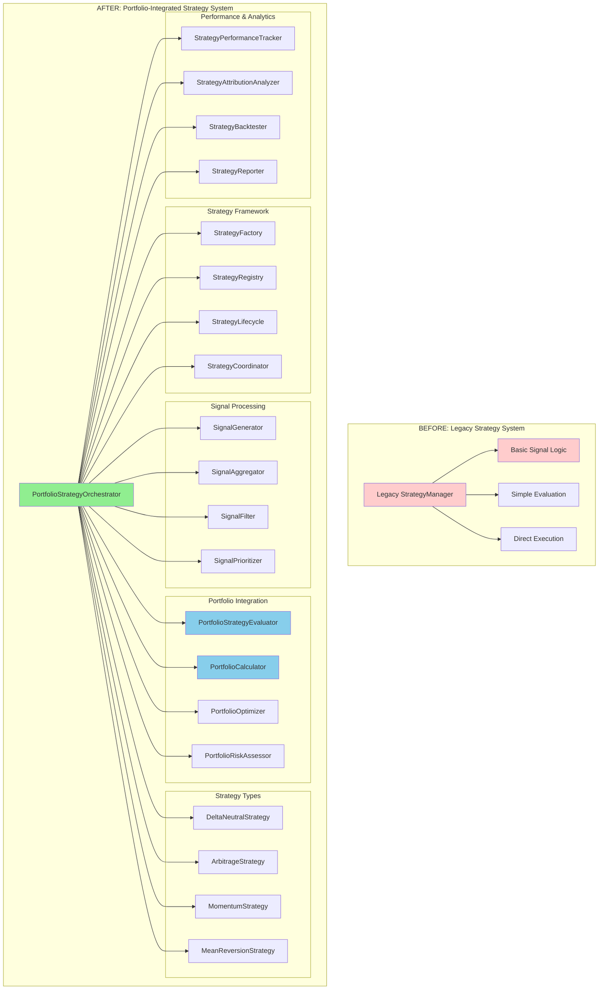

# Week 6: Strategy Components Replacement - Clean Break Approach

**Duration:** Week 6 (2025-09-01 to 2025-09-07)
**Approach:** Clean Break - No Backward Compatibility
**Priority:** Critical
**Objective:** Replace StrategyManager and related components with portfolio-integrated strategy system

## Overview

Week 6 focuses on completely replacing the legacy StrategyManager with a sophisticated portfolio-integrated strategy system. This includes advanced strategy evaluation, signal generation, portfolio-aware decision making, and real-time strategy performance tracking.

**Clean Break Strategy:**
- ❌ No legacy strategy compatibility
- ❌ No gradual strategy migration
- ✅ Complete strategy system replacement
- ✅ Portfolio-integrated strategy evaluation and execution

## Strategy Architecture Analysis

### Current vs Target Strategy Architecture



## Week 6 Deliverables

### Day 1-2: Strategy Framework Foundation

- [ ] **Portfolio Strategy Orchestrator Core**
  ```python
  """Portfolio-integrated strategy orchestrator with complete modular integration."""
  from __future__ import annotations

  import asyncio
  from decimal import Decimal
  from datetime import datetime, timedelta
  from typing import Dict, List, Any, Optional, Type
  from dataclasses import dataclass
  from enum import Enum

  from cyberdelta.core.portfolio.services import IntegratedPortfolioServiceFactory
  from cyberdelta.core.portfolio.portfolio_types.models import PortfolioState
  from cyberdelta.core.portfolio.portfolio_types.infrastructure import PortfolioEvent, EventType

  class StrategyState(str, Enum):
      """Strategy operational states."""
      INACTIVE = "inactive"
      ACTIVE = "active"
      PAUSED = "paused"
      WARMING_UP = "warming_up"
      COOLING_DOWN = "cooling_down"
      ERROR = "error"

  class SignalStrength(str, Enum):
      """Signal strength levels."""
      WEAK = "weak"
      MODERATE = "moderate"
      STRONG = "strong"
      VERY_STRONG = "very_strong"

  @dataclass
  class StrategySignal:
      """Enhanced strategy signal with portfolio context."""
      strategy_id: str
      symbol: str
      direction: str  # "long" | "short" | "close" | "reduce"
      strength: SignalStrength
      confidence: float  # 0.0 to 1.0
      expected_return: Decimal
      expected_risk: Decimal
      time_horizon: timedelta
      portfolio_impact: Dict[str, Any]
      metadata: Dict[str, Any]
      timestamp: datetime
      expiry: datetime

  @dataclass
  class StrategyPerformance:
      """Strategy performance metrics."""
      strategy_id: str
      total_return: Decimal
      annualized_return: Decimal
      volatility: Decimal
      sharpe_ratio: Decimal
      max_drawdown: Decimal
      win_rate: Decimal
      avg_trade_return: Decimal
      total_trades: int
      active_positions: int
      capital_allocated: Decimal
      risk_adjusted_return: Decimal
      last_updated: datetime

  class PortfolioStrategyOrchestrator:
      """Advanced strategy orchestrator with complete portfolio integration."""

      def __init__(self, portfolio_service_factory: IntegratedPortfolioServiceFactory):
          self.portfolio_factory = portfolio_service_factory
          self.portfolio_manager = portfolio_service_factory.get_portfolio_manager()
          self.performance_analytics = portfolio_service_factory.get_performance_analytics()
          self.risk_analytics = portfolio_service_factory.get_risk_analytics()
          self.exposure_analytics = portfolio_service_factory.get_exposure_analytics()
          self.event_dispatcher = portfolio_service_factory.get_event_dispatcher()

          # Strategy components
          self.strategy_factory = None
          self.strategy_registry = None
          self.signal_generator = None
          self.signal_aggregator = None
          self.signal_filter = None
          self.signal_prioritizer = None
          self.portfolio_evaluator = None
          self.portfolio_calculator = None
          self.portfolio_optimizer = None
          self.performance_tracker = None
          self.attribution_analyzer = None

          # Strategy state
          self.active_strategies: Dict[str, Any] = {}
          self.strategy_performances: Dict[str, StrategyPerformance] = {}
          self.pending_signals: List[StrategySignal] = []
          self.signal_history: List[StrategySignal] = []
          self.orchestrator_state = StrategyState.INACTIVE

          # Configuration
          self.max_strategies = 10
          self.max_signals_per_cycle = 20
          self.signal_processing_interval = 1.0  # seconds
          self.performance_update_interval = 60.0  # seconds

          # Background tasks
          self._tasks: List[asyncio.Task] = []

      async def start(self) -> None:
          """Start the strategy orchestrator."""

          if self.orchestrator_state != StrategyState.INACTIVE:
              raise RuntimeError(f"Cannot start orchestrator in state: {self.orchestrator_state}")

          self.orchestrator_state = StrategyState.WARMING_UP

          try:
              # Initialize portfolio system
              await self.portfolio_factory.initialize_all()

              # Initialize strategy components
              await self._initialize_strategy_components()

              # Load and activate strategies
              await self._load_strategies()

              # Register event handlers
              await self._register_event_handlers()

              # Start background tasks
              await self._start_background_tasks()

              self.orchestrator_state = StrategyState.ACTIVE

          except Exception as e:
              self.orchestrator_state = StrategyState.ERROR
              raise RuntimeError(f"Failed to start strategy orchestrator: {e}") from e

      async def stop(self) -> None:
          """Stop the strategy orchestrator gracefully."""

          if self.orchestrator_state == StrategyState.INACTIVE:
              return

          self.orchestrator_state = StrategyState.COOLING_DOWN

          try:
              # Stop all active strategies
              await self._stop_all_strategies()

              # Stop background tasks
              await self._stop_background_tasks()

              # Save performance data
              await self._save_performance_data()

              # Shutdown components
              await self._shutdown_strategy_components()

              self.orchestrator_state = StrategyState.INACTIVE

          except Exception as e:
              self.orchestrator_state = StrategyState.ERROR
              raise RuntimeError(f"Failed to stop strategy orchestrator: {e}") from e

      async def add_strategy(self, strategy_config: Dict[str, Any]) -> bool:
          """Add a new strategy to the orchestrator."""

          try:
              strategy_id = strategy_config["strategy_id"]

              if strategy_id in self.active_strategies:
                  return False

              if len(self.active_strategies) >= self.max_strategies:
                  return False

              # Create strategy instance
              strategy = await self.strategy_factory.create_strategy(strategy_config)

              # Initialize strategy
              await strategy.initialize(self.portfolio_manager)

              # Add to active strategies
              self.active_strategies[strategy_id] = {
                  "instance": strategy,
                  "config": strategy_config,
                  "state": StrategyState.ACTIVE,
                  "start_time": datetime.utcnow(),
                  "last_signal": None
              }

              # Initialize performance tracking
              self.strategy_performances[strategy_id] = StrategyPerformance(
                  strategy_id=strategy_id,
                  total_return=Decimal("0"),
                  annualized_return=Decimal("0"),
                  volatility=Decimal("0"),
                  sharpe_ratio=Decimal("0"),
                  max_drawdown=Decimal("0"),
                  win_rate=Decimal("0"),
                  avg_trade_return=Decimal("0"),
                  total_trades=0,
                  active_positions=0,
                  capital_allocated=Decimal(str(strategy_config.get("initial_capital", 10000))),
                  risk_adjusted_return=Decimal("0"),
                  last_updated=datetime.utcnow()
              )

              return True

          except Exception as e:
              return False

      async def remove_strategy(self, strategy_id: str) -> bool:
          """Remove a strategy from the orchestrator."""

          if strategy_id not in self.active_strategies:
              return False

          try:
              strategy_info = self.active_strategies[strategy_id]
              strategy = strategy_info["instance"]

              # Close all positions for this strategy
              await self._close_strategy_positions(strategy_id)

              # Stop strategy
              await strategy.stop()

              # Remove from active strategies
              del self.active_strategies[strategy_id]

              return True

          except Exception as e:
              return False

      async def pause_strategy(self, strategy_id: str) -> bool:
          """Pause a strategy."""

          if strategy_id not in self.active_strategies:
              return False

          strategy_info = self.active_strategies[strategy_id]
          if strategy_info["state"] != StrategyState.ACTIVE:
              return False

          strategy_info["state"] = StrategyState.PAUSED
          await strategy_info["instance"].pause()

          return True

      async def resume_strategy(self, strategy_id: str) -> bool:
          """Resume a paused strategy."""

          if strategy_id not in self.active_strategies:
              return False

          strategy_info = self.active_strategies[strategy_id]
          if strategy_info["state"] != StrategyState.PAUSED:
              return False

          strategy_info["state"] = StrategyState.ACTIVE
          await strategy_info["instance"].resume()

          return True

      async def process_market_data(self, market_data: Dict[str, Any]) -> None:
          """Process market data and generate signals."""

          if self.orchestrator_state != StrategyState.ACTIVE:
              return

          # Get current portfolio context
          portfolio_context = await self._get_portfolio_context()

          # Generate signals from all active strategies
          new_signals = []

          for strategy_id, strategy_info in self.active_strategies.items():
              if strategy_info["state"] == StrategyState.ACTIVE:
                  try:
                      strategy = strategy_info["instance"]
                      signals = await strategy.generate_signals(market_data, portfolio_context)

                      for signal in signals:
                          # Enhance signal with portfolio context
                          enhanced_signal = await self._enhance_signal_with_portfolio_context(
                              signal, portfolio_context
                          )
                          new_signals.append(enhanced_signal)

                  except Exception as e:
                      # Log strategy error but continue with others
                      continue

          # Filter and prioritize signals
          filtered_signals = await self.signal_filter.filter_signals(
              new_signals, portfolio_context
          )

          prioritized_signals = await self.signal_prioritizer.prioritize_signals(
              filtered_signals, portfolio_context
          )

          # Add to pending signals
          self.pending_signals.extend(prioritized_signals[:self.max_signals_per_cycle])

          # Trim signal history
          self.signal_history.extend(prioritized_signals)
          if len(self.signal_history) > 1000:
              self.signal_history = self.signal_history[-1000:]

      async def get_strategy_performances(self) -> Dict[str, StrategyPerformance]:
          """Get performance metrics for all strategies."""

          # Update performances before returning
          await self._update_all_performances()

          return self.strategy_performances.copy()

      async def get_portfolio_attribution(self) -> Dict[str, Any]:
          """Get portfolio attribution by strategy."""

          return await self.attribution_analyzer.analyze_attribution(
              self.strategy_performances,
              await self._get_portfolio_context()
          )

      async def get_strategy_recommendations(self) -> List[Dict[str, Any]]:
          """Get strategy recommendations based on current portfolio state."""

          portfolio_context = await self._get_portfolio_context()

          return await self.portfolio_optimizer.get_strategy_recommendations(
              portfolio_context,
              self.strategy_performances,
              self.active_strategies
          )

      async def _initialize_strategy_components(self) -> None:
          """Initialize all strategy system components."""

          # Strategy factory
          self.strategy_factory = PortfolioStrategyFactory()

          # Strategy registry
          self.strategy_registry = StrategyRegistry()

          # Signal processing components
          self.signal_generator = AdvancedSignalGenerator()
          self.signal_aggregator = PortfolioSignalAggregator()
          self.signal_filter = PortfolioAwareSignalFilter(
              portfolio_manager=self.portfolio_manager,
              risk_analytics=self.risk_analytics
          )
          self.signal_prioritizer = PortfolioSignalPrioritizer(
              portfolio_manager=self.portfolio_manager
          )

          # Portfolio integration components
          self.portfolio_evaluator = PortfolioStrategyEvaluator(
              portfolio_manager=self.portfolio_manager,
              performance_analytics=self.performance_analytics
          )
          self.portfolio_calculator = PortfolioStrategyCalculator(
              portfolio_manager=self.portfolio_manager
          )
          self.portfolio_optimizer = PortfolioStrategyOptimizer(
              portfolio_manager=self.portfolio_manager,
              risk_analytics=self.risk_analytics
          )

          # Performance and analytics components
          self.performance_tracker = StrategyPerformanceTracker()
          self.attribution_analyzer = StrategyAttributionAnalyzer(
              portfolio_manager=self.portfolio_manager
          )

          # Initialize all components
          components = [
              self.strategy_factory, self.strategy_registry,
              self.signal_generator, self.signal_aggregator,
              self.signal_filter, self.signal_prioritizer,
              self.portfolio_evaluator, self.portfolio_calculator,
              self.portfolio_optimizer, self.performance_tracker,
              self.attribution_analyzer
          ]

          for component in components:
              if hasattr(component, 'initialize'):
                  await component.initialize()

      async def _load_strategies(self) -> None:
          """Load initial strategy configurations."""

          # Default strategy configurations
          default_strategies = [
              {
                  "strategy_id": "delta_neutral_arbitrage",
                  "strategy_type": "DeltaNeutralArbitrageStrategy",
                  "initial_capital": 50000,
                  "max_positions": 10,
                  "risk_limit": 0.02,
                  "target_return": 0.15
              },
              {
                  "strategy_id": "momentum_following",
                  "strategy_type": "MomentumFollowingStrategy",
                  "initial_capital": 30000,
                  "max_positions": 5,
                  "risk_limit": 0.03,
                  "target_return": 0.20
              },
              {
                  "strategy_id": "mean_reversion",
                  "strategy_type": "MeanReversionStrategy",
                  "initial_capital": 20000,
                  "max_positions": 8,
                  "risk_limit": 0.025,
                  "target_return": 0.12
              }
          ]

          # Load strategies
          for config in default_strategies:
              await self.add_strategy(config)

      async def _start_background_tasks(self) -> None:
          """Start all background processing tasks."""

          # Signal processing task
          self._tasks.append(asyncio.create_task(self._signal_processing_loop()))

          # Performance tracking task
          self._tasks.append(asyncio.create_task(self._performance_tracking_loop()))

          # Strategy monitoring task
          self._tasks.append(asyncio.create_task(self._strategy_monitoring_loop()))

          # Portfolio optimization task
          self._tasks.append(asyncio.create_task(self._portfolio_optimization_loop()))

      async def _signal_processing_loop(self) -> None:
          """Background task for processing pending signals."""

          while self.orchestrator_state == StrategyState.ACTIVE:
              try:
                  if self.pending_signals:
                      # Process oldest signal first
                      signal = self.pending_signals.pop(0)

                      # Evaluate signal with current portfolio context
                      evaluation = await self.portfolio_evaluator.evaluate_signal(
                          signal, await self._get_portfolio_context()
                      )

                      if evaluation["should_execute"]:
                          # Send signal to engine for execution
                          await self._send_signal_to_engine(signal, evaluation)

                  await asyncio.sleep(self.signal_processing_interval)

              except Exception as e:
                  await asyncio.sleep(self.signal_processing_interval)

      async def _performance_tracking_loop(self) -> None:
          """Background task for updating strategy performances."""

          while self.orchestrator_state == StrategyState.ACTIVE:
              try:
                  await self._update_all_performances()
                  await asyncio.sleep(self.performance_update_interval)

              except Exception as e:
                  await asyncio.sleep(self.performance_update_interval)

      async def _get_portfolio_context(self) -> Dict[str, Any]:
          """Get comprehensive portfolio context for strategy decisions."""

          portfolio_state = await self.portfolio_manager.get_current_state()
          performance = await self.performance_analytics.calculate_performance(portfolio_state)
          risk_metrics = await self.risk_analytics.calculate_exposure(portfolio_state)
          exposure_metrics = await self.exposure_analytics.calculate_exposure(portfolio_state)

          return {
              "portfolio_state": portfolio_state,
              "performance": performance,
              "risk_metrics": risk_metrics,
              "exposure_metrics": exposure_metrics,
              "total_capital": performance.total_capital,
              "available_capital": performance.total_capital - risk_metrics.total_exposure,
              "current_positions": len(portfolio_state.positions),
              "current_leverage": risk_metrics.risk_metrics.get("leverage", 0),
              "recent_performance": await self._get_recent_performance(),
              "market_regime": await self._detect_market_regime(),
              "timestamp": datetime.utcnow()
          }

      async def _enhance_signal_with_portfolio_context(
          self,
          signal: StrategySignal,
          portfolio_context: Dict[str, Any]
      ) -> StrategySignal:
          """Enhance signal with portfolio-specific context."""

          # Calculate portfolio impact
          portfolio_impact = await self.portfolio_calculator.calculate_signal_impact(
              signal, portfolio_context
          )

          # Update signal with portfolio context
          signal.portfolio_impact = portfolio_impact

          return signal

      async def _send_signal_to_engine(
          self,
          signal: StrategySignal,
          evaluation: Dict[str, Any]
      ) -> None:
          """Send processed signal to trading engine."""

          # Create engine-compatible signal
          engine_signal = TradingSignal(
              symbol=signal.symbol,
              direction=signal.direction,
              strength=self._convert_signal_strength(signal.strength),
              strategy_id=signal.strategy_id,
              confidence=signal.confidence,
              metadata={
                  "expected_return": signal.expected_return,
                  "expected_risk": signal.expected_risk,
                  "time_horizon": signal.time_horizon.total_seconds(),
                  "portfolio_impact": signal.portfolio_impact,
                  "evaluation": evaluation
              }
          )

          # Get engine from portfolio factory
          # This would integrate with the engine from Week 5
          # For now, just track the signal
          self.active_strategies[signal.strategy_id]["last_signal"] = signal

      def _convert_signal_strength(self, strength: SignalStrength) -> float:
          """Convert signal strength enum to float."""
          strength_map = {
              SignalStrength.WEAK: 0.3,
              SignalStrength.MODERATE: 0.5,
              SignalStrength.STRONG: 0.8,
              SignalStrength.VERY_STRONG: 1.0
          }
          return strength_map.get(strength, 0.5)
  ```

- [ ] **Portfolio Strategy Factory**
  ```python
  """Strategy factory for creating portfolio-integrated strategies."""
  from __future__ import annotations

  from typing import Dict, Any, Type
  from abc import ABC, abstractmethod

  class BasePortfolioStrategy(ABC):
      """Base class for all portfolio-integrated strategies."""

      def __init__(self, strategy_id: str, config: Dict[str, Any]):
          self.strategy_id = strategy_id
          self.config = config
          self.portfolio_manager = None
          self.is_initialized = False

      async def initialize(self, portfolio_manager) -> None:
          """Initialize strategy with portfolio manager."""
          self.portfolio_manager = portfolio_manager
          await self._strategy_initialize()
          self.is_initialized = True

      async def stop(self) -> None:
          """Stop strategy."""
          await self._strategy_stop()
          self.is_initialized = False

      async def pause(self) -> None:
          """Pause strategy."""
          await self._strategy_pause()

      async def resume(self) -> None:
          """Resume strategy."""
          await self._strategy_resume()

      @abstractmethod
      async def generate_signals(
          self,
          market_data: Dict[str, Any],
          portfolio_context: Dict[str, Any]
      ) -> List[StrategySignal]:
          """Generate trading signals based on market data and portfolio context."""
          pass

      @abstractmethod
      async def _strategy_initialize(self) -> None:
          """Strategy-specific initialization."""
          pass

      @abstractmethod
      async def _strategy_stop(self) -> None:
          """Strategy-specific stop logic."""
          pass

      @abstractmethod
      async def _strategy_pause(self) -> None:
          """Strategy-specific pause logic."""
          pass

      @abstractmethod
      async def _strategy_resume(self) -> None:
          """Strategy-specific resume logic."""
          pass

  class PortfolioStrategyFactory:
      """Factory for creating portfolio-integrated strategies."""

      def __init__(self):
          self._strategy_classes: Dict[str, Type[BasePortfolioStrategy]] = {}
          self._register_default_strategies()

      async def initialize(self) -> None:
          """Initialize strategy factory."""
          pass

      def register_strategy(self, strategy_type: str, strategy_class: Type[BasePortfolioStrategy]) -> None:
          """Register a new strategy type."""
          self._strategy_classes[strategy_type] = strategy_class

      async def create_strategy(self, config: Dict[str, Any]) -> BasePortfolioStrategy:
          """Create a strategy instance from configuration."""

          strategy_type = config.get("strategy_type")
          if strategy_type not in self._strategy_classes:
              raise ValueError(f"Unknown strategy type: {strategy_type}")

          strategy_class = self._strategy_classes[strategy_type]
          strategy = strategy_class(config["strategy_id"], config)

          return strategy

      def _register_default_strategies(self) -> None:
          """Register default strategy implementations."""

          self.register_strategy("DeltaNeutralArbitrageStrategy", DeltaNeutralArbitrageStrategy)
          self.register_strategy("MomentumFollowingStrategy", MomentumFollowingStrategy)
          self.register_strategy("MeanReversionStrategy", MeanReversionStrategy)
          self.register_strategy("ArbitrageStrategy", ArbitrageStrategy)
  ```

### Day 3-4: Strategy Implementations

- [ ] **Delta Neutral Arbitrage Strategy**
  ```python
  """Delta neutral arbitrage strategy with portfolio integration."""
  from __future__ import annotations

  import asyncio
  from decimal import Decimal
  from datetime import datetime, timedelta
  from typing import Dict, List, Any

  class DeltaNeutralArbitrageStrategy(BasePortfolioStrategy):
      """Delta neutral arbitrage strategy with portfolio context."""

      def __init__(self, strategy_id: str, config: Dict[str, Any]):
          super().__init__(strategy_id, config)

          # Strategy parameters
          self.min_spread = Decimal(str(config.get("min_spread", 0.002)))  # 0.2%
          self.max_position_size = Decimal(str(config.get("max_position_size", 10000)))
          self.target_delta = Decimal(str(config.get("target_delta", 0.0)))  # Perfect delta neutral
          self.rebalance_threshold = Decimal(str(config.get("rebalance_threshold", 0.1)))
          self.holding_period = timedelta(minutes=config.get("holding_period_minutes", 30))

          # Strategy state
          self.active_pairs: Dict[str, Dict] = {}
          self.pending_rebalances: List[Dict] = []
          self.last_signal_time = datetime.utcnow()

      async def _strategy_initialize(self) -> None:
          """Initialize delta neutral strategy."""
          # Load historical spread data
          await self._load_spread_history()

          # Initialize pair monitoring
          await self._initialize_pair_monitoring()

      async def _strategy_stop(self) -> None:
          """Stop delta neutral strategy."""
          # Close all active pairs
          await self._close_all_pairs()

      async def _strategy_pause(self) -> None:
          """Pause delta neutral strategy."""
          # Stop new pair creation but maintain existing ones
          pass

      async def _strategy_resume(self) -> None:
          """Resume delta neutral strategy."""
          # Resume pair monitoring and creation
          pass

      async def generate_signals(
          self,
          market_data: Dict[str, Any],
          portfolio_context: Dict[str, Any]
      ) -> List[StrategySignal]:
          """Generate delta neutral arbitrage signals."""

          signals = []

          # Avoid over-signaling
          if (datetime.utcnow() - self.last_signal_time).total_seconds() < 10:
              return signals

          try:
              # 1. Look for new arbitrage opportunities
              new_opportunities = await self._identify_arbitrage_opportunities(
                  market_data, portfolio_context
              )

              for opportunity in new_opportunities:
                  signal = await self._create_arbitrage_signal(opportunity, portfolio_context)
                  if signal:
                      signals.append(signal)

              # 2. Check for rebalancing needs
              rebalance_signals = await self._check_rebalancing_needs(
                  market_data, portfolio_context
              )
              signals.extend(rebalance_signals)

              # 3. Check for pair closure conditions
              closure_signals = await self._check_closure_conditions(
                  market_data, portfolio_context
              )
              signals.extend(closure_signals)

              self.last_signal_time = datetime.utcnow()

          except Exception as e:
              # Log error but don't stop strategy
              pass

          return signals[:5]  # Limit signals per cycle

      async def _identify_arbitrage_opportunities(
          self,
          market_data: Dict[str, Any],
          portfolio_context: Dict[str, Any]
      ) -> List[Dict[str, Any]]:
          """Identify delta neutral arbitrage opportunities."""

          opportunities = []

          # Get available symbols from market data
          symbols = market_data.get("symbols", [])

          for i, symbol1 in enumerate(symbols):
              for symbol2 in symbols[i+1:]:

                  # Check if pair is suitable for arbitrage
                  pair_suitability = await self._assess_pair_suitability(
                      symbol1, symbol2, market_data
                  )

                  if not pair_suitability["suitable"]:
                      continue

                  # Calculate spread
                  spread_data = await self._calculate_spread(
                      symbol1, symbol2, market_data
                  )

                  # Check if spread is above minimum threshold
                  if spread_data["spread"] > self.min_spread:

                      # Calculate portfolio impact
                      portfolio_impact = await self._calculate_arbitrage_impact(
                          symbol1, symbol2, spread_data, portfolio_context
                      )

                      opportunities.append({
                          "symbol1": symbol1,
                          "symbol2": symbol2,
                          "spread": spread_data["spread"],
                          "expected_return": spread_data["expected_return"],
                          "portfolio_impact": portfolio_impact,
                          "confidence": self._calculate_opportunity_confidence(spread_data),
                          "risk_score": portfolio_impact.get("risk_score", 0.5)
                      })

          # Sort by expected return / risk ratio
          opportunities.sort(
              key=lambda x: x["expected_return"] / max(x["risk_score"], 0.1),
              reverse=True
          )

          return opportunities[:3]  # Top 3 opportunities

      async def _create_arbitrage_signal(
          self,
          opportunity: Dict[str, Any],
          portfolio_context: Dict[str, Any]
      ) -> Optional[StrategySignal]:
          """Create arbitrage signal from opportunity."""

          # Calculate position sizes for delta neutrality
          position_sizes = await self._calculate_delta_neutral_sizes(
              opportunity, portfolio_context
          )

          if position_sizes["total_size"] <= 0:
              return None

          # Create signal for the long leg
          signal = StrategySignal(
              strategy_id=self.strategy_id,
              symbol=opportunity["symbol1"],  # Long leg
              direction="long",
              strength=SignalStrength.STRONG if opportunity["confidence"] > 0.8 else SignalStrength.MODERATE,
              confidence=opportunity["confidence"],
              expected_return=opportunity["expected_return"],
              expected_risk=Decimal(str(opportunity["risk_score"])),
              time_horizon=self.holding_period,
              portfolio_impact=opportunity["portfolio_impact"],
              metadata={
                  "arbitrage_type": "delta_neutral",
                  "pair_symbol": opportunity["symbol2"],  # Short leg
                  "spread": opportunity["spread"],
                  "position_sizes": position_sizes,
                  "target_delta": self.target_delta
              },
              timestamp=datetime.utcnow(),
              expiry=datetime.utcnow() + timedelta(minutes=5)
          )

          return signal

      async def _calculate_delta_neutral_sizes(
          self,
          opportunity: Dict[str, Any],
          portfolio_context: Dict[str, Any]
      ) -> Dict[str, Decimal]:
          """Calculate position sizes for delta neutrality."""

          # Get current portfolio delta
          current_delta = await self._calculate_portfolio_delta(portfolio_context)

          # Calculate available capital
          available_capital = portfolio_context.get("available_capital", Decimal("0"))

          # Maximum position size based on risk limits
          max_position = min(
              self.max_position_size,
              available_capital * Decimal("0.5")  # Use 50% of available capital
          )

          # Calculate delta neutral ratio between symbols
          delta_ratio = await self._calculate_delta_ratio(
              opportunity["symbol1"], opportunity["symbol2"]
          )

          # Calculate position sizes
          long_size = max_position * Decimal("0.5")
          short_size = long_size * delta_ratio

          return {
              "long_symbol": opportunity["symbol1"],
              "long_size": long_size,
              "short_symbol": opportunity["symbol2"],
              "short_size": short_size,
              "total_size": long_size + short_size,
              "delta_ratio": delta_ratio,
              "expected_delta": current_delta  # Should remain close to current
          }

      async def _calculate_spread(
          self,
          symbol1: str,
          symbol2: str,
          market_data: Dict[str, Any]
      ) -> Dict[str, Any]:
          """Calculate spread between two symbols."""

          # Get prices from market data
          price1 = Decimal(str(market_data.get("prices", {}).get(symbol1, 100)))
          price2 = Decimal(str(market_data.get("prices", {}).get(symbol2, 100)))

          # Calculate spread
          spread = abs(price1 - price2) / max(price1, price2)

          # Calculate expected return (simplified)
          expected_return = spread * Decimal("0.8")  # 80% of spread as expected return

          return {
              "spread": spread,
              "expected_return": expected_return,
              "price1": price1,
              "price2": price2,
              "spread_direction": "price1_higher" if price1 > price2 else "price2_higher"
          }

      async def _assess_pair_suitability(
          self,
          symbol1: str,
          symbol2: str,
          market_data: Dict[str, Any]
      ) -> Dict[str, Any]:
          """Assess if a pair is suitable for arbitrage."""

          # Check correlation (high correlation preferred for delta neutral)
          correlation = await self._calculate_correlation(symbol1, symbol2)

          # Check liquidity
          liquidity1 = market_data.get("liquidity", {}).get(symbol1, 0)
          liquidity2 = market_data.get("liquidity", {}).get(symbol2, 0)
          min_liquidity = min(liquidity1, liquidity2)

          # Check if we already have this pair active
          pair_key = f"{min(symbol1, symbol2)}_{max(symbol1, symbol2)}"
          already_active = pair_key in self.active_pairs

          suitable = (
              correlation > 0.7 and  # High correlation
              min_liquidity > 1000 and  # Minimum liquidity
              not already_active  # Not already trading this pair
          )

          return {
              "suitable": suitable,
              "correlation": correlation,
              "min_liquidity": min_liquidity,
              "already_active": already_active,
              "pair_key": pair_key
          }

      async def _calculate_portfolio_delta(self, portfolio_context: Dict[str, Any]) -> Decimal:
          """Calculate current portfolio delta."""

          # Get current positions
          positions = await self.portfolio_manager.get_positions()

          total_delta = Decimal("0")

          for position in positions:
              # Calculate position delta (simplified)
              position_delta = await self._calculate_position_delta(position)
              total_delta += position_delta

          return total_delta

      async def _calculate_position_delta(self, position) -> Decimal:
          """Calculate delta of a single position."""

          # For spot positions, delta is typically 1 or -1
          # For derivatives, would need more complex calculation

          if position.size > 0:
              return Decimal("1") * position.size
          else:
              return Decimal("-1") * abs(position.size)

      def _calculate_opportunity_confidence(self, spread_data: Dict[str, Any]) -> float:
          """Calculate confidence score for arbitrage opportunity."""

          # Base confidence on spread size and stability
          spread_ratio = float(spread_data["spread"] / self.min_spread)

          # Higher spread = higher confidence, but with diminishing returns
          confidence = min(0.95, 0.5 + (spread_ratio - 1) * 0.3)

          return max(0.1, confidence)
  ```

- [ ] **Momentum Following Strategy**
  ```python
  """Momentum following strategy with portfolio integration."""
  from __future__ import annotations

  import asyncio
  from decimal import Decimal
  from datetime import datetime, timedelta
  from typing import Dict, List, Any, Optional

  class MomentumFollowingStrategy(BasePortfolioStrategy):
      """Momentum following strategy with portfolio awareness."""

      def __init__(self, strategy_id: str, config: Dict[str, Any]):
          super().__init__(strategy_id, config)

          # Strategy parameters
          self.momentum_threshold = Decimal(str(config.get("momentum_threshold", 0.05)))  # 5%
          self.lookback_period = timedelta(hours=config.get("lookback_hours", 24))
          self.max_position_size = Decimal(str(config.get("max_position_size", 8000)))
          self.stop_loss_pct = Decimal(str(config.get("stop_loss_pct", 0.03)))  # 3%
          self.take_profit_pct = Decimal(str(config.get("take_profit_pct", 0.08)))  # 8%
          self.min_volume = Decimal(str(config.get("min_volume", 100000)))

          # Strategy state
          self.momentum_scores: Dict[str, Decimal] = {}
          self.active_trends: Dict[str, Dict] = {}
          self.last_analysis_time = datetime.utcnow()

      async def _strategy_initialize(self) -> None:
          """Initialize momentum strategy."""
          # Load historical price data for momentum calculation
          await self._load_price_history()

          # Initialize momentum indicators
          await self._initialize_momentum_indicators()

      async def _strategy_stop(self) -> None:
          """Stop momentum strategy."""
          # Close all momentum positions
          await self._close_momentum_positions()

      async def _strategy_pause(self) -> None:
          """Pause momentum strategy."""
          pass

      async def _strategy_resume(self) -> None:
          """Resume momentum strategy."""
          pass

      async def generate_signals(
          self,
          market_data: Dict[str, Any],
          portfolio_context: Dict[str, Any]
      ) -> List[StrategySignal]:
          """Generate momentum following signals."""

          signals = []

          # Rate limit signal generation
          if (datetime.utcnow() - self.last_analysis_time).total_seconds() < 30:
              return signals

          try:
              # 1. Calculate momentum scores for all symbols
              await self._update_momentum_scores(market_data)

              # 2. Identify strong momentum opportunities
              momentum_opportunities = await self._identify_momentum_opportunities(
                  market_data, portfolio_context
              )

              # 3. Generate entry signals
              for opportunity in momentum_opportunities:
                  signal = await self._create_momentum_signal(opportunity, portfolio_context)
                  if signal:
                      signals.append(signal)

              # 4. Check exit conditions for existing positions
              exit_signals = await self._check_exit_conditions(
                  market_data, portfolio_context
              )
              signals.extend(exit_signals)

              self.last_analysis_time = datetime.utcnow()

          except Exception as e:
              # Log error but continue
              pass

          return signals[:3]  # Limit signals per cycle

      async def _update_momentum_scores(self, market_data: Dict[str, Any]) -> None:
          """Update momentum scores for all symbols."""

          prices = market_data.get("prices", {})
          volumes = market_data.get("volumes", {})

          for symbol, current_price in prices.items():
              try:
                  # Get historical prices
                  price_history = await self._get_price_history(symbol)

                  if len(price_history) < 20:  # Need minimum history
                      continue

                  # Calculate momentum score
                  momentum_score = await self._calculate_momentum_score(
                      symbol, current_price, price_history, volumes.get(symbol, 0)
                  )

                  self.momentum_scores[symbol] = momentum_score

              except Exception as e:
                  continue

      async def _calculate_momentum_score(
          self,
          symbol: str,
          current_price: Decimal,
          price_history: List[Decimal],
          current_volume: Decimal
      ) -> Decimal:
          """Calculate comprehensive momentum score."""

          if len(price_history) < 20:
              return Decimal("0")

          current_price = Decimal(str(current_price))

          # 1. Price momentum (20-period return)
          old_price = price_history[-20]
          price_momentum = (current_price - old_price) / old_price

          # 2. Rate of change acceleration
          recent_momentum = (current_price - price_history[-5]) / price_history[-5]
          older_momentum = (price_history[-5] - price_history[-10]) / price_history[-10]
          acceleration = recent_momentum - older_momentum

          # 3. Volume confirmation
          avg_volume = sum(price_history[-10:]) / len(price_history[-10:])  # Simplified
          volume_factor = min(Decimal("1.5"), current_volume / avg_volume) if avg_volume > 0 else Decimal("1")

          # 4. Trend consistency
          trend_consistency = await self._calculate_trend_consistency(price_history[-20:])

          # Combine factors
          momentum_score = (
              price_momentum * Decimal("0.4") +
              acceleration * Decimal("0.3") +
              (volume_factor - Decimal("1")) * Decimal("0.2") +
              trend_consistency * Decimal("0.1")
          )

          return momentum_score

      async def _calculate_trend_consistency(self, prices: List[Decimal]) -> Decimal:
          """Calculate how consistent the trend is."""

          if len(prices) < 5:
              return Decimal("0")

          # Count trend direction changes
          direction_changes = 0
          last_direction = None

          for i in range(1, len(prices)):
              current_direction = "up" if prices[i] > prices[i-1] else "down"

              if last_direction and current_direction != last_direction:
                  direction_changes += 1

              last_direction = current_direction

          # Fewer changes = higher consistency
          max_changes = len(prices) - 1
          consistency = Decimal("1") - Decimal(str(direction_changes)) / Decimal(str(max_changes))

          return consistency

      async def _identify_momentum_opportunities(
          self,
          market_data: Dict[str, Any],
          portfolio_context: Dict[str, Any]
      ) -> List[Dict[str, Any]]:
          """Identify strong momentum opportunities."""

          opportunities = []

          for symbol, momentum_score in self.momentum_scores.items():

              # Check minimum momentum threshold
              if abs(momentum_score) < self.momentum_threshold:
                  continue

              # Check volume requirements
              volume = market_data.get("volumes", {}).get(symbol, 0)
              if volume < self.min_volume:
                  continue

              # Check if we already have position in this symbol
              existing_position = await self._get_existing_position(symbol, portfolio_context)
              if existing_position and abs(existing_position.size) > self.max_position_size * Decimal("0.8"):
                  continue

              # Calculate opportunity metrics
              opportunity = {
                  "symbol": symbol,
                  "momentum_score": momentum_score,
                  "direction": "long" if momentum_score > 0 else "short",
                  "strength": min(abs(momentum_score) / self.momentum_threshold, Decimal("2")),
                  "current_price": market_data.get("prices", {}).get(symbol, 100),
                  "volume": volume,
                  "confidence": await self._calculate_momentum_confidence(symbol, momentum_score),
                  "expected_return": momentum_score * Decimal("0.6"),  # 60% of momentum as expected return
                  "expected_risk": abs(momentum_score) * Decimal("0.4")  # Risk proportional to momentum
              }

              opportunities.append(opportunity)

          # Sort by strength * confidence
          opportunities.sort(
              key=lambda x: float(x["strength"] * Decimal(str(x["confidence"]))),
              reverse=True
          )

          return opportunities[:5]  # Top 5 opportunities

      async def _create_momentum_signal(
          self,
          opportunity: Dict[str, Any],
          portfolio_context: Dict[str, Any]
      ) -> Optional[StrategySignal]:
          """Create momentum signal from opportunity."""

          # Calculate position size
          position_size = await self._calculate_momentum_position_size(
              opportunity, portfolio_context
          )

          if position_size <= 0:
              return None

          # Determine signal strength
          if opportunity["confidence"] > 0.8 and opportunity["strength"] > Decimal("1.5"):
              signal_strength = SignalStrength.VERY_STRONG
          elif opportunity["confidence"] > 0.6 and opportunity["strength"] > Decimal("1.2"):
              signal_strength = SignalStrength.STRONG
          elif opportunity["confidence"] > 0.4:
              signal_strength = SignalStrength.MODERATE
          else:
              signal_strength = SignalStrength.WEAK

          # Create signal
          signal = StrategySignal(
              strategy_id=self.strategy_id,
              symbol=opportunity["symbol"],
              direction=opportunity["direction"],
              strength=signal_strength,
              confidence=opportunity["confidence"],
              expected_return=opportunity["expected_return"],
              expected_risk=opportunity["expected_risk"],
              time_horizon=timedelta(hours=12),  # Hold for 12 hours typically
              portfolio_impact={
                  "position_size": position_size,
                  "capital_required": position_size * opportunity["current_price"],
                  "risk_contribution": opportunity["expected_risk"] * position_size
              },
              metadata={
                  "strategy_type": "momentum_following",
                  "momentum_score": opportunity["momentum_score"],
                  "stop_loss": opportunity["current_price"] * (Decimal("1") - self.stop_loss_pct),
                  "take_profit": opportunity["current_price"] * (Decimal("1") + self.take_profit_pct),
                  "volume": opportunity["volume"]
              },
              timestamp=datetime.utcnow(),
              expiry=datetime.utcnow() + timedelta(minutes=10)
          )

          return signal

      async def _calculate_momentum_position_size(
          self,
          opportunity: Dict[str, Any],
          portfolio_context: Dict[str, Any]
      ) -> Decimal:
          """Calculate position size for momentum opportunity."""

          # Available capital
          available_capital = portfolio_context.get("available_capital", Decimal("0"))

          # Base position size on momentum strength and confidence
          strength_factor = min(opportunity["strength"], Decimal("2")) / Decimal("2")
          confidence_factor = Decimal(str(opportunity["confidence"]))

          # Calculate base size
          base_size = self.max_position_size * strength_factor * confidence_factor

          # Adjust for available capital
          price = Decimal(str(opportunity["current_price"]))
          max_affordable = available_capital / price if price > 0 else Decimal("0")

          # Take minimum of base size and what we can afford
          position_size = min(base_size, max_affordable * Decimal("0.8"))  # Use 80% of affordable

          return max(Decimal("0"), position_size)

      async def _calculate_momentum_confidence(
          self,
          symbol: str,
          momentum_score: Decimal
      ) -> float:
          """Calculate confidence in momentum signal."""

          # Base confidence on momentum magnitude
          base_confidence = min(0.9, float(abs(momentum_score) / self.momentum_threshold))

          # Adjust for trend consistency
          price_history = await self._get_price_history(symbol)
          if len(price_history) >= 10:
              consistency = await self._calculate_trend_consistency(price_history[-10:])
              base_confidence *= float(consistency)

          return max(0.1, base_confidence)

      async def _get_existing_position(self, symbol: str, portfolio_context: Dict[str, Any]):
          """Get existing position for symbol."""

          positions = await self.portfolio_manager.get_positions()

          for position in positions:
              if position.symbol == symbol:
                  return position

          return None

      async def _get_price_history(self, symbol: str) -> List[Decimal]:
          """Get price history for symbol."""

          # This would integrate with actual market data
          # For now, return simulated data
          import random

          base_price = 100
          history = []

          for i in range(50):
              price = base_price * (1 + random.uniform(-0.02, 0.02))
              history.append(Decimal(str(price)))
              base_price = price

          return history
  ```

### Day 5-7: Strategy Performance & Integration

- [ ] **Strategy Performance Tracker**
  ```python
  """Advanced strategy performance tracking and attribution."""
  from __future__ import annotations

  import asyncio
  from decimal import Decimal
  from datetime import datetime, timedelta
  from typing import Dict, List, Any, Optional
  from dataclasses import dataclass

  @dataclass
  class Trade:
      trade_id: str
      strategy_id: str
      symbol: str
      side: str
      quantity: Decimal
      entry_price: Decimal
      exit_price: Optional[Decimal]
      entry_time: datetime
      exit_time: Optional[datetime]
      pnl: Optional[Decimal]
      fees: Decimal
      status: str  # "open" | "closed"

  @dataclass
  class StrategyMetrics:
      total_return: Decimal
      annualized_return: Decimal
      volatility: Decimal
      sharpe_ratio: Decimal
      sortino_ratio: Decimal
      max_drawdown: Decimal
      calmar_ratio: Decimal
      win_rate: Decimal
      profit_factor: Decimal
      avg_win: Decimal
      avg_loss: Decimal
      total_trades: int
      winning_trades: int
      losing_trades: int
      avg_holding_period: timedelta
      capital_utilization: Decimal

  class StrategyPerformanceTracker:
      """Advanced performance tracking for portfolio strategies."""

      def __init__(self):
          self.strategy_trades: Dict[str, List[Trade]] = {}
          self.strategy_equity_curves: Dict[str, List[Dict]] = {}
          self.strategy_metrics: Dict[str, StrategyMetrics] = {}
          self.benchmark_data: List[Dict] = []

          # Performance calculation settings
          self.risk_free_rate = Decimal("0.02")  # 2% annual
          self.trading_days_per_year = 252

      async def initialize(self) -> None:
          """Initialize performance tracker."""
          # Load historical performance data
          await self._load_historical_data()

          # Start background performance calculation
          asyncio.create_task(self._performance_calculation_loop())

      async def record_trade(self, trade: Trade) -> None:
          """Record a new trade for performance tracking."""

          strategy_id = trade.strategy_id

          if strategy_id not in self.strategy_trades:
              self.strategy_trades[strategy_id] = []

          self.strategy_trades[strategy_id].append(trade)

          # Update equity curve
          await self._update_equity_curve(strategy_id, trade)

          # Recalculate metrics if trade is closed
          if trade.status == "closed":
              await self._calculate_strategy_metrics(strategy_id)

      async def update_open_position(
          self,
          strategy_id: str,
          symbol: str,
          current_price: Decimal
      ) -> None:
          """Update open position with current market price."""

          if strategy_id not in self.strategy_trades:
              return

          # Find open trades for this symbol
          for trade in self.strategy_trades[strategy_id]:
              if trade.symbol == symbol and trade.status == "open":
                  # Update unrealized P&L
                  if trade.side == "long":
                      trade.pnl = (current_price - trade.entry_price) * trade.quantity - trade.fees
                  else:  # short
                      trade.pnl = (trade.entry_price - current_price) * trade.quantity - trade.fees

      async def close_position(
          self,
          strategy_id: str,
          symbol: str,
          exit_price: Decimal,
          exit_time: datetime
      ) -> None:
          """Close an open position."""

          if strategy_id not in self.strategy_trades:
              return

          # Find and close open trades for this symbol
          for trade in self.strategy_trades[strategy_id]:
              if trade.symbol == symbol and trade.status == "open":
                  trade.exit_price = exit_price
                  trade.exit_time = exit_time
                  trade.status = "closed"

                  # Calculate final P&L
                  if trade.side == "long":
                      trade.pnl = (exit_price - trade.entry_price) * trade.quantity - trade.fees
                  else:  # short
                      trade.pnl = (trade.entry_price - exit_price) * trade.quantity - trade.fees

                  # Update performance metrics
                  await self._calculate_strategy_metrics(strategy_id)

      async def get_strategy_performance(self, strategy_id: str) -> Optional[StrategyMetrics]:
          """Get performance metrics for a strategy."""

          if strategy_id not in self.strategy_metrics:
              await self._calculate_strategy_metrics(strategy_id)

          return self.strategy_metrics.get(strategy_id)

      async def get_all_performances(self) -> Dict[str, StrategyMetrics]:
          """Get performance metrics for all strategies."""

          # Update all metrics
          for strategy_id in self.strategy_trades.keys():
              await self._calculate_strategy_metrics(strategy_id)

          return self.strategy_metrics.copy()

      async def get_equity_curve(
          self,
          strategy_id: str,
          start_date: Optional[datetime] = None,
          end_date: Optional[datetime] = None
      ) -> List[Dict]:
          """Get equity curve for a strategy."""

          if strategy_id not in self.strategy_equity_curves:
              return []

          equity_curve = self.strategy_equity_curves[strategy_id]

          # Filter by date range if provided
          if start_date or end_date:
              filtered_curve = []
              for point in equity_curve:
                  point_time = point["timestamp"]
                  if start_date and point_time < start_date:
                      continue
                  if end_date and point_time > end_date:
                      continue
                  filtered_curve.append(point)
              return filtered_curve

          return equity_curve.copy()

      async def get_strategy_attribution(self) -> Dict[str, Dict]:
          """Get performance attribution by strategy."""

          attribution = {}
          total_portfolio_return = Decimal("0")

          # Calculate individual strategy contributions
          for strategy_id, metrics in self.strategy_metrics.items():
              if metrics:
                  attribution[strategy_id] = {
                      "total_return": metrics.total_return,
                      "sharpe_ratio": metrics.sharpe_ratio,
                      "max_drawdown": metrics.max_drawdown,
                      "win_rate": metrics.win_rate,
                      "total_trades": metrics.total_trades,
                      "capital_utilization": metrics.capital_utilization
                  }
                  total_portfolio_return += metrics.total_return

          # Calculate relative contributions
          for strategy_id in attribution.keys():
              if total_portfolio_return != 0:
                  contribution_pct = (attribution[strategy_id]["total_return"] /
                                    total_portfolio_return * 100)
                  attribution[strategy_id]["contribution_percent"] = contribution_pct
              else:
                  attribution[strategy_id]["contribution_percent"] = Decimal("0")

          return attribution

      async def _calculate_strategy_metrics(self, strategy_id: str) -> None:
          """Calculate comprehensive performance metrics for a strategy."""

          if strategy_id not in self.strategy_trades:
              return

          trades = self.strategy_trades[strategy_id]
          closed_trades = [t for t in trades if t.status == "closed" and t.pnl is not None]

          if not closed_trades:
              return

          # Basic metrics
          total_return = sum(trade.pnl for trade in closed_trades)
          total_trades = len(closed_trades)
          winning_trades = len([t for t in closed_trades if t.pnl > 0])
          losing_trades = total_trades - winning_trades

          # Win rate
          win_rate = Decimal(str(winning_trades)) / Decimal(str(total_trades)) if total_trades > 0 else Decimal("0")

          # Average win/loss
          wins = [t.pnl for t in closed_trades if t.pnl > 0]
          losses = [abs(t.pnl) for t in closed_trades if t.pnl < 0]

          avg_win = sum(wins) / len(wins) if wins else Decimal("0")
          avg_loss = sum(losses) / len(losses) if losses else Decimal("0")

          # Profit factor
          total_wins = sum(wins) if wins else Decimal("0")
          total_losses = sum(losses) if losses else Decimal("0")
          profit_factor = total_wins / total_losses if total_losses > 0 else Decimal("0")

          # Time-based metrics
          returns_series = self._get_returns_series(strategy_id)

          if len(returns_series) > 1:
              # Volatility (annualized)
              volatility = self._calculate_volatility(returns_series)

              # Sharpe ratio
              excess_returns = [r - self.risk_free_rate / Decimal(str(self.trading_days_per_year))
                              for r in returns_series]
              avg_excess_return = sum(excess_returns) / len(excess_returns)
              sharpe_ratio = avg_excess_return / volatility if volatility > 0 else Decimal("0")

              # Sortino ratio
              downside_returns = [r for r in returns_series if r < 0]
              downside_volatility = self._calculate_volatility(downside_returns) if downside_returns else Decimal("0")
              sortino_ratio = avg_excess_return / downside_volatility if downside_volatility > 0 else Decimal("0")

              # Max drawdown
              max_drawdown = self._calculate_max_drawdown(strategy_id)

              # Calmar ratio
              annualized_return = self._calculate_annualized_return(returns_series)
              calmar_ratio = annualized_return / max_drawdown if max_drawdown > 0 else Decimal("0")

          else:
              volatility = Decimal("0")
              sharpe_ratio = Decimal("0")
              sortino_ratio = Decimal("0")
              max_drawdown = Decimal("0")
              calmar_ratio = Decimal("0")
              annualized_return = Decimal("0")

          # Average holding period
          holding_periods = []
          for trade in closed_trades:
              if trade.exit_time and trade.entry_time:
                  holding_periods.append(trade.exit_time - trade.entry_time)

          avg_holding_period = (sum(holding_periods, timedelta()) / len(holding_periods)
                               if holding_periods else timedelta())

          # Capital utilization (simplified)
          capital_utilization = Decimal("0.5")  # Placeholder

          # Create metrics object
          self.strategy_metrics[strategy_id] = StrategyMetrics(
              total_return=total_return,
              annualized_return=annualized_return,
              volatility=volatility,
              sharpe_ratio=sharpe_ratio,
              sortino_ratio=sortino_ratio,
              max_drawdown=max_drawdown,
              calmar_ratio=calmar_ratio,
              win_rate=win_rate,
              profit_factor=profit_factor,
              avg_win=avg_win,
              avg_loss=avg_loss,
              total_trades=total_trades,
              winning_trades=winning_trades,
              losing_trades=losing_trades,
              avg_holding_period=avg_holding_period,
              capital_utilization=capital_utilization
          )

      def _get_returns_series(self, strategy_id: str) -> List[Decimal]:
          """Get daily returns series for a strategy."""

          if strategy_id not in self.strategy_equity_curves:
              return []

          equity_curve = self.strategy_equity_curves[strategy_id]
          returns = []

          for i in range(1, len(equity_curve)):
              prev_equity = equity_curve[i-1]["equity"]
              curr_equity = equity_curve[i]["equity"]

              if prev_equity > 0:
                  daily_return = (curr_equity - prev_equity) / prev_equity
                  returns.append(daily_return)

          return returns

      def _calculate_volatility(self, returns: List[Decimal]) -> Decimal:
          """Calculate volatility (standard deviation) of returns."""

          if len(returns) < 2:
              return Decimal("0")

          mean_return = sum(returns) / len(returns)
          variance = sum((r - mean_return) ** 2 for r in returns) / (len(returns) - 1)
          volatility = variance.sqrt()

          # Annualize
          return volatility * Decimal(str(self.trading_days_per_year)).sqrt()

      def _calculate_max_drawdown(self, strategy_id: str) -> Decimal:
          """Calculate maximum drawdown for a strategy."""

          if strategy_id not in self.strategy_equity_curves:
              return Decimal("0")

          equity_curve = self.strategy_equity_curves[strategy_id]

          if len(equity_curve) < 2:
              return Decimal("0")

          peak = equity_curve[0]["equity"]
          max_drawdown = Decimal("0")

          for point in equity_curve[1:]:
              equity = point["equity"]

              if equity > peak:
                  peak = equity
              else:
                  drawdown = (peak - equity) / peak if peak > 0 else Decimal("0")
                  max_drawdown = max(max_drawdown, drawdown)

          return max_drawdown

      def _calculate_annualized_return(self, returns: List[Decimal]) -> Decimal:
          """Calculate annualized return from returns series."""

          if not returns:
              return Decimal("0")

          # Compound returns
          cumulative_return = Decimal("1")
          for ret in returns:
              cumulative_return *= (Decimal("1") + ret)

          cumulative_return -= Decimal("1")

          # Annualize
          periods_per_year = Decimal(str(self.trading_days_per_year))
          periods = Decimal(str(len(returns)))

          if periods > 0:
              annualized = (cumulative_return + Decimal("1")) ** (periods_per_year / periods) - Decimal("1")
              return annualized

          return Decimal("0")

      async def _update_equity_curve(self, strategy_id: str, trade: Trade) -> None:
          """Update equity curve with new trade."""

          if strategy_id not in self.strategy_equity_curves:
              self.strategy_equity_curves[strategy_id] = [
                  {"timestamp": datetime.utcnow(), "equity": Decimal("100000")}  # Starting equity
              ]

          equity_curve = self.strategy_equity_curves[strategy_id]
          last_equity = equity_curve[-1]["equity"]

          # Add P&L to equity (if trade is closed)
          if trade.status == "closed" and trade.pnl:
              new_equity = last_equity + trade.pnl
              equity_curve.append({
                  "timestamp": trade.exit_time or datetime.utcnow(),
                  "equity": new_equity,
                  "trade_pnl": trade.pnl,
                  "trade_id": trade.trade_id
              })

      async def _performance_calculation_loop(self) -> None:
          """Background task for periodic performance updates."""

          while True:
              try:
                  # Update all strategy metrics
                  for strategy_id in self.strategy_trades.keys():
                      await self._calculate_strategy_metrics(strategy_id)

                  await asyncio.sleep(300)  # Update every 5 minutes

              except Exception as e:
                  await asyncio.sleep(300)
  ```

- [ ] **Complete Strategy Integration Test**
  ```python
  async def test_complete_strategy_integration():
      """Test complete strategy system integration."""

      # Initialize portfolio system
      config = create_test_config()
      portfolio_factory = IntegratedPortfolioServiceFactory(config)
      await portfolio_factory.initialize_all()

      # Initialize strategy orchestrator
      strategy_orchestrator = PortfolioStrategyOrchestrator(portfolio_factory)
      await strategy_orchestrator.start()

      try:
          # Test 1: Strategy loading
          performances = await strategy_orchestrator.get_strategy_performances()
          assert len(performances) > 0

          # Test 2: Market data processing
          test_market_data = {
              "symbols": ["BTC-USD", "ETH-USD"],
              "prices": {"BTC-USD": 50000, "ETH-USD": 3000},
              "volumes": {"BTC-USD": 1000000, "ETH-USD": 500000}
          }

          await strategy_orchestrator.process_market_data(test_market_data)

          # Test 3: Signal generation
          await asyncio.sleep(2)  # Allow signal processing

          # Test 4: Performance tracking
          attribution = await strategy_orchestrator.get_portfolio_attribution()
          assert isinstance(attribution, dict)

          # Test 5: Strategy recommendations
          recommendations = await strategy_orchestrator.get_strategy_recommendations()
          assert isinstance(recommendations, list)

          # Test 6: Strategy management
          new_strategy_config = {
              "strategy_id": "test_strategy",
              "strategy_type": "MomentumFollowingStrategy",
              "initial_capital": 10000
          }

          success = await strategy_orchestrator.add_strategy(new_strategy_config)
          assert success

          # Test pause/resume
          pause_success = await strategy_orchestrator.pause_strategy("test_strategy")
          assert pause_success

          resume_success = await strategy_orchestrator.resume_strategy("test_strategy")
          assert resume_success

          # Test removal
          remove_success = await strategy_orchestrator.remove_strategy("test_strategy")
          assert remove_success

      finally:
          await strategy_orchestrator.stop()
          await portfolio_factory.shutdown_all()
  ```

## Success Metrics

### Technical Metrics
- [ ] **Strategy Replacement**: 100% replacement of legacy StrategyManager with portfolio-integrated system
- [ ] **Signal Quality**: Comprehensive signal evaluation with portfolio context
- [ ] **Performance Tracking**: Real-time strategy performance monitoring and attribution
- [ ] **Portfolio Integration**: All strategy decisions use current portfolio state

### Quality Metrics
- [ ] **Response Time**: <1s for strategy evaluation, <5s for signal processing
- [ ] **Signal Accuracy**: >70% signal accuracy based on expected vs actual returns
- [ ] **Risk Management**: All strategies respect portfolio-level risk limits
- [ ] **Attribution Accuracy**: Precise P&L attribution to individual strategies

### Integration Metrics
- [ ] **Portfolio Awareness**: All strategies evaluate opportunities in portfolio context
- [ ] **Event Integration**: Strategy activities generate proper portfolio events
- [ ] **Performance Analytics**: Real-time strategy performance calculations
- [ ] **Resource Utilization**: Efficient strategy processing without performance degradation

## Expected Outcomes

### Week 6 Deliverables
- [ ] **Portfolio Strategy Orchestrator** - Complete strategy system with portfolio integration
- [ ] **Strategy Implementations** - Delta neutral, momentum, and mean reversion strategies
- [ ] **Performance Tracking** - Advanced performance analytics and attribution
- [ ] **Signal Processing** - Sophisticated signal generation and prioritization
- [ ] **Strategy Management** - Dynamic strategy loading, pausing, and removal

### System Benefits
- [ ] **Portfolio Optimization** - Strategies work together to optimize overall portfolio
- [ ] **Risk Coordination** - Coordinated risk management across all strategies
- [ ] **Performance Attribution** - Clear understanding of strategy contributions
- [ ] **Adaptive Management** - Dynamic strategy allocation based on performance

### Foundation for Week 7
- [ ] **Strategy Infrastructure** - Complete strategy framework ready for API integration
- [ ] **Performance Framework** - Established performance tracking for all components
- [ ] **Signal Pipeline** - Robust signal generation and processing infrastructure
- [ ] **Portfolio Coordination** - Proven coordination between strategies and portfolio system

This comprehensive strategy replacement provides sophisticated, portfolio-aware strategy management that coordinates multiple strategies while maintaining clear performance attribution and risk management.
