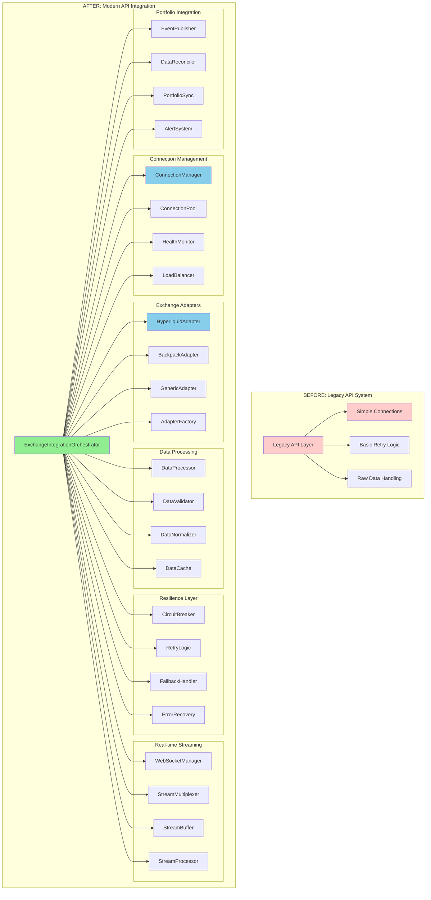

# Week 7: API Integration Replacement - Clean Break Approach

**Duration:** Week 7 (2025-09-08 to 2025-09-14)
**Approach:** Clean Break - No Backward Compatibility
**Priority:** Critical
**Objective:** Complete replacement of API integration layer with modern, resilient, portfolio-aware exchange integration

## Overview

Week 7 focuses on completely replacing the legacy API integration system with a modern, resilient exchange integration layer. This includes advanced connection management, real-time data streaming, intelligent retry mechanisms, and complete portfolio event integration.

**Clean Break Strategy:**
- ❌ No legacy API wrapper compatibility
- ❌ No gradual API migration
- ✅ Complete API integration replacement
- ✅ Modern async/await patterns with portfolio events

## API Architecture Analysis

### Current vs Target API Architecture



## Week 7 Deliverables

### Day 1-2: Exchange Integration Orchestrator

- [ ] **Exchange Integration Orchestrator Core**
  ```python
  """Modern exchange integration orchestrator with complete portfolio integration."""
  from __future__ import annotations

  import asyncio
  from decimal import Decimal
  from datetime import datetime, timedelta
  from typing import Dict, List, Any, Optional, Type
  from dataclasses import dataclass
  from enum import Enum
  import aiohttp
  import websockets
  import json

  from cyberdelta.core.portfolio.services import IntegratedPortfolioServiceFactory
  from cyberdelta.core.portfolio.portfolio_types.models import PortfolioState, Position, SpotBalance
  from cyberdelta.core.portfolio.portfolio_types.infrastructure import PortfolioEvent, EventType

  class IntegrationState(str, Enum):
      """Integration system states."""
      STOPPED = "stopped"
      STARTING = "starting"
      RUNNING = "running"
      DEGRADED = "degraded"
      ERROR = "error"
      STOPPING = "stopping"

  class ExchangeStatus(str, Enum):
      """Individual exchange status."""
      CONNECTED = "connected"
      CONNECTING = "connecting"
      DISCONNECTED = "disconnected"
      ERROR = "error"
      RATE_LIMITED = "rate_limited"
      MAINTENANCE = "maintenance"

  @dataclass
  class ExchangeConfig:
      """Exchange configuration."""
      exchange_id: str
      api_key: str
      api_secret: str
      passphrase: Optional[str]
      sandbox: bool
      rate_limit: int  # requests per minute
      timeout: int  # seconds
      retry_attempts: int
      websocket_url: Optional[str]
      rest_url: str

  @dataclass
  class MarketData:
      """Normalized market data."""
      exchange_id: str
      symbol: str
      timestamp: datetime
      bid: Decimal
      ask: Decimal
      last: Decimal
      volume: Decimal
      high_24h: Decimal
      low_24h: Decimal
      change_24h: Decimal
      metadata: Dict[str, Any]

  @dataclass
  class OrderBookLevel:
      """Order book level."""
      price: Decimal
      size: Decimal
      orders: int

  @dataclass
  class OrderBook:
      """Normalized order book data."""
      exchange_id: str
      symbol: str
      timestamp: datetime
      bids: List[OrderBookLevel]
      asks: List[OrderBookLevel]
      sequence: int

  class ExchangeIntegrationOrchestrator:
      """Modern exchange integration with complete portfolio awareness."""

      def __init__(self, portfolio_service_factory: IntegratedPortfolioServiceFactory):
          self.portfolio_factory = portfolio_service_factory
          self.portfolio_manager = portfolio_service_factory.get_portfolio_manager()
          self.event_dispatcher = portfolio_service_factory.get_event_dispatcher()

          # Integration components
          self.connection_manager = None
          self.adapter_factory = None
          self.data_processor = None
          self.resilience_manager = None
          self.stream_manager = None
          self.portfolio_sync = None

          # Exchange adapters
          self.exchange_adapters: Dict[str, Any] = {}
          self.exchange_configs: Dict[str, ExchangeConfig] = {}
          self.exchange_status: Dict[str, ExchangeStatus] = {}

          # System state
          self.integration_state = IntegrationState.STOPPED
          self.last_sync_time = datetime.utcnow()
          self.sync_interval = 30  # seconds
          self.health_check_interval = 10  # seconds

          # Performance metrics
          self.metrics = {
              "total_requests": 0,
              "successful_requests": 0,
              "failed_requests": 0,
              "avg_response_time": 0.0,
              "data_points_processed": 0,
              "portfolio_updates": 0,
              "last_error": None
          }

          # Background tasks
          self._tasks: List[asyncio.Task] = []

      async def start(self) -> None:
          """Start the exchange integration system."""

          if self.integration_state != IntegrationState.STOPPED:
              raise RuntimeError(f"Cannot start integration in state: {self.integration_state}")

          self.integration_state = IntegrationState.STARTING

          try:
              # Initialize portfolio system
              await self.portfolio_factory.initialize_all()

              # Initialize integration components
              await self._initialize_integration_components()

              # Load exchange configurations
              await self._load_exchange_configurations()

              # Initialize exchange adapters
              await self._initialize_exchange_adapters()

              # Start connection management
              await self._start_connection_management()

              # Start data streaming
              await self._start_data_streaming()

              # Start portfolio synchronization
              await self._start_portfolio_sync()

              # Start background tasks
              await self._start_background_tasks()

              self.integration_state = IntegrationState.RUNNING

          except Exception as e:
              self.integration_state = IntegrationState.ERROR
              raise RuntimeError(f"Failed to start exchange integration: {e}") from e

      async def stop(self) -> None:
          """Stop the exchange integration system gracefully."""

          if self.integration_state == IntegrationState.STOPPED:
              return

          self.integration_state = IntegrationState.STOPPING

          try:
              # Stop background tasks
              await self._stop_background_tasks()

              # Stop data streaming
              await self._stop_data_streaming()

              # Disconnect from exchanges
              await self._disconnect_all_exchanges()

              # Save final state
              await self._save_integration_state()

              # Shutdown components
              await self._shutdown_integration_components()

              self.integration_state = IntegrationState.STOPPED

          except Exception as e:
              self.integration_state = IntegrationState.ERROR
              raise RuntimeError(f"Failed to stop exchange integration: {e}") from e

      async def get_portfolio_data(self, exchange_id: Optional[str] = None) -> Dict[str, Any]:
          """Get comprehensive portfolio data from exchanges."""

          if self.integration_state != IntegrationState.RUNNING:
              raise RuntimeError(f"Integration not running: {self.integration_state}")

          portfolio_data = {}

          # Determine which exchanges to query
          exchanges_to_query = [exchange_id] if exchange_id else list(self.exchange_adapters.keys())

          # Query each exchange
          for exchange in exchanges_to_query:
              if exchange not in self.exchange_adapters:
                  continue

              try:
                  adapter = self.exchange_adapters[exchange]

                  # Get balances, positions, and orders concurrently
                  balances_task = adapter.get_balances()
                  positions_task = adapter.get_positions()
                  orders_task = adapter.get_open_orders()

                  balances, positions, orders = await asyncio.gather(
                      balances_task, positions_task, orders_task,
                      return_exceptions=True
                  )

                  # Process results
                  portfolio_data[exchange] = {
                      "balances": balances if not isinstance(balances, Exception) else {},
                      "positions": positions if not isinstance(positions, Exception) else [],
                      "orders": orders if not isinstance(orders, Exception) else [],
                      "timestamp": datetime.utcnow(),
                      "status": self.exchange_status.get(exchange, ExchangeStatus.DISCONNECTED)
                  }

                  # Update metrics
                  self.metrics["portfolio_updates"] += 1

              except Exception as e:
                  portfolio_data[exchange] = {
                      "error": str(e),
                      "timestamp": datetime.utcnow(),
                      "status": ExchangeStatus.ERROR
                  }
                  self.metrics["failed_requests"] += 1

          return portfolio_data

      async def execute_order(
          self,
          exchange_id: str,
          order_request: Dict[str, Any]
      ) -> Dict[str, Any]:
          """Execute an order on specified exchange."""

          if exchange_id not in self.exchange_adapters:
              raise ValueError(f"Exchange not configured: {exchange_id}")

          adapter = self.exchange_adapters[exchange_id]

          try:
              # Pre-execution validation
              validation_result = await self._validate_order_request(
                  exchange_id, order_request
              )

              if not validation_result["valid"]:
                  return {
                      "success": False,
                      "error": validation_result["error"],
                      "order_id": None
                  }

              # Execute order through adapter
              execution_result = await adapter.place_order(order_request)

              # Post-execution processing
              if execution_result["success"]:
                  await self._process_order_execution(
                      exchange_id, order_request, execution_result
                  )

              self.metrics["successful_requests"] += 1
              return execution_result

          except Exception as e:
              self.metrics["failed_requests"] += 1
              return {
                  "success": False,
                  "error": str(e),
                  "order_id": None
              }

      async def cancel_order(
          self,
          exchange_id: str,
          order_id: str
      ) -> Dict[str, Any]:
          """Cancel an order on specified exchange."""

          if exchange_id not in self.exchange_adapters:
              raise ValueError(f"Exchange not configured: {exchange_id}")

          adapter = self.exchange_adapters[exchange_id]

          try:
              result = await adapter.cancel_order(order_id)

              if result["success"]:
                  # Create cancellation event
                  event = PortfolioEvent(
                      event_type=EventType.ORDER_CANCELLED,
                      exchange_id=exchange_id,
                      timestamp=datetime.utcnow(),
                      data={
                          "order_id": order_id,
                          "cancellation_reason": "user_requested"
                      }
                  )
                  await self.event_dispatcher.dispatch(event)

              return result

          except Exception as e:
              return {
                  "success": False,
                  "error": str(e)
              }

      async def get_market_data(
          self,
          symbol: str,
          exchange_id: Optional[str] = None
      ) -> Dict[str, MarketData]:
          """Get market data for symbol from exchanges."""

          market_data = {}

          # Determine which exchanges to query
          exchanges_to_query = [exchange_id] if exchange_id else list(self.exchange_adapters.keys())

          for exchange in exchanges_to_query:
              if exchange not in self.exchange_adapters:
                  continue

              try:
                  adapter = self.exchange_adapters[exchange]
                  data = await adapter.get_ticker(symbol)

                  # Normalize data
                  normalized_data = MarketData(
                      exchange_id=exchange,
                      symbol=symbol,
                      timestamp=datetime.utcnow(),
                      bid=Decimal(str(data.get("bid", 0))),
                      ask=Decimal(str(data.get("ask", 0))),
                      last=Decimal(str(data.get("last", 0))),
                      volume=Decimal(str(data.get("volume", 0))),
                      high_24h=Decimal(str(data.get("high_24h", 0))),
                      low_24h=Decimal(str(data.get("low_24h", 0))),
                      change_24h=Decimal(str(data.get("change_24h", 0))),
                      metadata=data
                  )

                  market_data[exchange] = normalized_data

              except Exception as e:
                  continue

          return market_data

      async def get_order_book(
          self,
          symbol: str,
          exchange_id: str,
          depth: int = 100
      ) -> Optional[OrderBook]:
          """Get order book for symbol from exchange."""

          if exchange_id not in self.exchange_adapters:
              return None

          try:
              adapter = self.exchange_adapters[exchange_id]
              data = await adapter.get_order_book(symbol, depth)

              # Normalize order book
              bids = [
                  OrderBookLevel(
                      price=Decimal(str(level[0])),
                      size=Decimal(str(level[1])),
                      orders=level[2] if len(level) > 2 else 1
                  )
                  for level in data.get("bids", [])
              ]

              asks = [
                  OrderBookLevel(
                      price=Decimal(str(level[0])),
                      size=Decimal(str(level[1])),
                      orders=level[2] if len(level) > 2 else 1
                  )
                  for level in data.get("asks", [])
              ]

              return OrderBook(
                  exchange_id=exchange_id,
                  symbol=symbol,
                  timestamp=datetime.utcnow(),
                  bids=bids,
                  asks=asks,
                  sequence=data.get("sequence", 0)
              )

          except Exception as e:
              return None

      async def get_system_status(self) -> Dict[str, Any]:
          """Get comprehensive system status."""

          exchange_statuses = {}
          for exchange_id, adapter in self.exchange_adapters.items():
              try:
                  health = await adapter.check_health()
                  exchange_statuses[exchange_id] = {
                      "status": self.exchange_status.get(exchange_id, ExchangeStatus.DISCONNECTED),
                      "health": health,
                      "last_update": datetime.utcnow()
                  }
              except Exception as e:
                  exchange_statuses[exchange_id] = {
                      "status": ExchangeStatus.ERROR,
                      "error": str(e),
                      "last_update": datetime.utcnow()
                  }

          return {
              "integration_state": self.integration_state.value,
              "exchange_statuses": exchange_statuses,
              "metrics": self.metrics.copy(),
              "last_sync": self.last_sync_time,
              "uptime": (datetime.utcnow() - self.last_sync_time).total_seconds(),
              "active_tasks": len(self._tasks)
          }

      async def _initialize_integration_components(self) -> None:
          """Initialize all integration components."""

          # Connection management
          self.connection_manager = ExchangeConnectionManager()

          # Adapter factory
          self.adapter_factory = ExchangeAdapterFactory()

          # Data processing
          self.data_processor = ExchangeDataProcessor(
              event_dispatcher=self.event_dispatcher
          )

          # Resilience management
          self.resilience_manager = ExchangeResilienceManager()

          # Stream management
          self.stream_manager = ExchangeStreamManager(
              data_processor=self.data_processor
          )

          # Portfolio synchronization
          self.portfolio_sync = PortfolioSynchronizer(
              portfolio_manager=self.portfolio_manager,
              event_dispatcher=self.event_dispatcher
          )

          # Initialize all components
          components = [
              self.connection_manager,
              self.adapter_factory,
              self.data_processor,
              self.resilience_manager,
              self.stream_manager,
              self.portfolio_sync
          ]

          for component in components:
              if hasattr(component, 'initialize'):
                  await component.initialize()

      async def _load_exchange_configurations(self) -> None:
          """Load exchange configurations."""

          # Default configurations (would load from config file/env)
          self.exchange_configs = {
              "hyperliquid": ExchangeConfig(
                  exchange_id="hyperliquid",
                  api_key="test_key",
                  api_secret="test_secret",
                  passphrase=None,
                  sandbox=True,
                  rate_limit=100,  # per minute
                  timeout=30,
                  retry_attempts=3,
                  websocket_url="wss://api.hyperliquid.xyz/ws",
                  rest_url="https://api.hyperliquid.xyz"
              ),
              "backpack": ExchangeConfig(
                  exchange_id="backpack",
                  api_key="test_key",
                  api_secret="test_secret",
                  passphrase=None,
                  sandbox=True,
                  rate_limit=60,  # per minute
                  timeout=30,
                  retry_attempts=3,
                  websocket_url="wss://ws.backpack.exchange",
                  rest_url="https://api.backpack.exchange"
              )
          }

      async def _initialize_exchange_adapters(self) -> None:
          """Initialize exchange adapters."""

          for exchange_id, config in self.exchange_configs.items():
              try:
                  adapter = await self.adapter_factory.create_adapter(config)
                  await adapter.initialize()

                  self.exchange_adapters[exchange_id] = adapter
                  self.exchange_status[exchange_id] = ExchangeStatus.DISCONNECTED

              except Exception as e:
                  self.exchange_status[exchange_id] = ExchangeStatus.ERROR
                  continue

      async def _start_background_tasks(self) -> None:
          """Start all background processing tasks."""

          # Health monitoring task
          self._tasks.append(asyncio.create_task(self._health_monitoring_loop()))

          # Portfolio sync task
          self._tasks.append(asyncio.create_task(self._portfolio_sync_loop()))

          # Metrics collection task
          self._tasks.append(asyncio.create_task(self._metrics_collection_loop()))

          # Connection maintenance task
          self._tasks.append(asyncio.create_task(self._connection_maintenance_loop()))

      async def _health_monitoring_loop(self) -> None:
          """Background health monitoring."""

          while self.integration_state == IntegrationState.RUNNING:
              try:
                  # Check health of all exchanges
                  for exchange_id, adapter in self.exchange_adapters.items():
                      try:
                          health = await adapter.check_health()
                          if health["healthy"]:
                              self.exchange_status[exchange_id] = ExchangeStatus.CONNECTED
                          else:
                              self.exchange_status[exchange_id] = ExchangeStatus.ERROR
                      except Exception as e:
                          self.exchange_status[exchange_id] = ExchangeStatus.ERROR

                  # Check overall system health
                  healthy_exchanges = sum(
                      1 for status in self.exchange_status.values()
                      if status == ExchangeStatus.CONNECTED
                  )

                  if healthy_exchanges == 0:
                      self.integration_state = IntegrationState.ERROR
                  elif healthy_exchanges < len(self.exchange_adapters) / 2:
                      self.integration_state = IntegrationState.DEGRADED
                  else:
                      self.integration_state = IntegrationState.RUNNING

                  await asyncio.sleep(self.health_check_interval)

              except Exception as e:
                  await asyncio.sleep(self.health_check_interval)

      async def _portfolio_sync_loop(self) -> None:
          """Background portfolio synchronization."""

          while self.integration_state in [IntegrationState.RUNNING, IntegrationState.DEGRADED]:
              try:
                  # Get portfolio data from all exchanges
                  portfolio_data = await self.get_portfolio_data()

                  # Sync with portfolio manager
                  await self.portfolio_sync.synchronize_portfolio(portfolio_data)

                  self.last_sync_time = datetime.utcnow()

                  await asyncio.sleep(self.sync_interval)

              except Exception as e:
                  await asyncio.sleep(self.sync_interval)

      async def _validate_order_request(
          self,
          exchange_id: str,
          order_request: Dict[str, Any]
      ) -> Dict[str, Any]:
          """Validate order request before execution."""

          # Basic validation
          required_fields = ["symbol", "side", "type", "quantity"]
          for field in required_fields:
              if field not in order_request:
                  return {"valid": False, "error": f"Missing required field: {field}"}

          # Exchange-specific validation
          adapter = self.exchange_adapters[exchange_id]
          if hasattr(adapter, 'validate_order'):
              return await adapter.validate_order(order_request)

          return {"valid": True}

      async def _process_order_execution(
          self,
          exchange_id: str,
          order_request: Dict[str, Any],
          execution_result: Dict[str, Any]
      ) -> None:
          """Process successful order execution."""

          # Create order execution event
          event = PortfolioEvent(
              event_type=EventType.ORDER_FILLED,
              exchange_id=exchange_id,
              timestamp=datetime.utcnow(),
              data={
                  "order_id": execution_result.get("order_id"),
                  "symbol": order_request["symbol"],
                  "side": order_request["side"],
                  "quantity": order_request["quantity"],
                  "price": execution_result.get("executed_price"),
                  "fees": execution_result.get("fees", 0)
              }
          )

          await self.event_dispatcher.dispatch(event)
  ```

- [ ] **Exchange Adapter Factory**
  ```python
  """Factory for creating exchange-specific adapters."""
  from __future__ import annotations

  from typing import Dict, Type
  from abc import ABC, abstractmethod

  class BaseExchangeAdapter(ABC):
      """Base class for all exchange adapters."""

      def __init__(self, config: ExchangeConfig):
          self.config = config
          self.session: Optional[aiohttp.ClientSession] = None
          self.websocket: Optional[websockets.WebSocketServerProtocol] = None
          self.is_connected = False

      async def initialize(self) -> None:
          """Initialize the adapter."""
          self.session = aiohttp.ClientSession(
              timeout=aiohttp.ClientTimeout(total=self.config.timeout)
          )
          await self._adapter_initialize()

      async def shutdown(self) -> None:
          """Shutdown the adapter."""
          if self.websocket:
              await self.websocket.close()

          if self.session:
              await self.session.close()

          await self._adapter_shutdown()

      @abstractmethod
      async def _adapter_initialize(self) -> None:
          """Exchange-specific initialization."""
          pass

      @abstractmethod
      async def _adapter_shutdown(self) -> None:
          """Exchange-specific shutdown."""
          pass

      @abstractmethod
      async def get_balances(self) -> Dict[str, Any]:
          """Get account balances."""
          pass

      @abstractmethod
      async def get_positions(self) -> List[Dict[str, Any]]:
          """Get open positions."""
          pass

      @abstractmethod
      async def get_open_orders(self) -> List[Dict[str, Any]]:
          """Get open orders."""
          pass

      @abstractmethod
      async def place_order(self, order_request: Dict[str, Any]) -> Dict[str, Any]:
          """Place a new order."""
          pass

      @abstractmethod
      async def cancel_order(self, order_id: str) -> Dict[str, Any]:
          """Cancel an existing order."""
          pass

      @abstractmethod
      async def get_ticker(self, symbol: str) -> Dict[str, Any]:
          """Get ticker data for symbol."""
          pass

      @abstractmethod
      async def get_order_book(self, symbol: str, depth: int) -> Dict[str, Any]:
          """Get order book for symbol."""
          pass

      @abstractmethod
      async def check_health(self) -> Dict[str, Any]:
          """Check exchange health."""
          pass

  class ExchangeAdapterFactory:
      """Factory for creating exchange adapters."""

      def __init__(self):
          self._adapter_classes: Dict[str, Type[BaseExchangeAdapter]] = {}
          self._register_default_adapters()

      async def initialize(self) -> None:
          """Initialize adapter factory."""
          pass

      def register_adapter(self, exchange_id: str, adapter_class: Type[BaseExchangeAdapter]) -> None:
          """Register a new adapter type."""
          self._adapter_classes[exchange_id] = adapter_class

      async def create_adapter(self, config: ExchangeConfig) -> BaseExchangeAdapter:
          """Create an adapter instance from configuration."""

          exchange_id = config.exchange_id
          if exchange_id not in self._adapter_classes:
              raise ValueError(f"Unknown exchange: {exchange_id}")

          adapter_class = self._adapter_classes[exchange_id]
          adapter = adapter_class(config)

          return adapter

      def _register_default_adapters(self) -> None:
          """Register default adapter implementations."""

          self.register_adapter("hyperliquid", HyperliquidAdapter)
          self.register_adapter("backpack", BackpackAdapter)
  ```

### Day 3-4: Exchange-Specific Adapters

- [ ] **Hyperliquid Exchange Adapter**
  ```python
  """Hyperliquid exchange adapter with full API integration."""
  from __future__ import annotations

  import asyncio
  import hashlib
  import hmac
  import time
  from decimal import Decimal
  from typing import Dict, List, Any, Optional
  import aiohttp
  import json

  class HyperliquidAdapter(BaseExchangeAdapter):
      """Hyperliquid exchange adapter."""

      def __init__(self, config: ExchangeConfig):
          super().__init__(config)
          self.base_url = config.rest_url
          self.ws_url = config.websocket_url
          self.api_key = config.api_key
          self.api_secret = config.api_secret

          # Hyperliquid-specific settings
          self.user_address = None  # Will be set during initialization
          self.nonce = int(time.time() * 1000)

      async def _adapter_initialize(self) -> None:
          """Initialize Hyperliquid adapter."""

          # Get user address from API key
          try:
              response = await self._make_request("POST", "/info", {
                  "type": "clearinghouseState",
                  "user": self.api_key
              })

              if response and "assetPositions" in response:
                  self.user_address = self.api_key
                  self.is_connected = True

          except Exception as e:
              self.is_connected = False
              raise RuntimeError(f"Failed to initialize Hyperliquid adapter: {e}")

      async def _adapter_shutdown(self) -> None:
          """Shutdown Hyperliquid adapter."""
          self.is_connected = False

      async def get_balances(self) -> Dict[str, Any]:
          """Get Hyperliquid account balances."""

          try:
              response = await self._make_request("POST", "/info", {
                  "type": "clearinghouseState",
                  "user": self.user_address
              })

              if not response:
                  return {}

              balances = {}

              # Process margin summary
              margin_summary = response.get("marginSummary", {})
              account_value = Decimal(str(margin_summary.get("accountValue", "0")))
              total_margin_used = Decimal(str(margin_summary.get("totalMarginUsed", "0")))

              balances["USDC"] = {
                  "total": account_value,
                  "available": account_value - total_margin_used,
                  "locked": total_margin_used
              }

              # Process asset positions for other assets
              asset_positions = response.get("assetPositions", [])
              for position in asset_positions:
                  asset = position.get("position", {}).get("coin", "")
                  if asset and asset != "USDC":
                      size = Decimal(str(position.get("position", {}).get("szi", "0")))
                      balances[asset] = {
                          "total": abs(size),
                          "available": abs(size),
                          "locked": Decimal("0")
                      }

              return balances

          except Exception as e:
              raise RuntimeError(f"Failed to get Hyperliquid balances: {e}")

      async def get_positions(self) -> List[Dict[str, Any]]:
          """Get Hyperliquid open positions."""

          try:
              response = await self._make_request("POST", "/info", {
                  "type": "clearinghouseState",
                  "user": self.user_address
              })

              if not response:
                  return []

              positions = []
              asset_positions = response.get("assetPositions", [])

              for asset_position in asset_positions:
                  position_data = asset_position.get("position", {})
                  coin = position_data.get("coin", "")
                  size = Decimal(str(position_data.get("szi", "0")))

                  if size != 0:  # Only include non-zero positions
                      entry_px = position_data.get("entryPx")
                      unrealized_pnl = asset_position.get("unrealizedPnl", "0")

                      positions.append({
                          "symbol": f"{coin}-USD",
                          "side": "long" if size > 0 else "short",
                          "size": abs(size),
                          "entry_price": Decimal(str(entry_px)) if entry_px else None,
                          "mark_price": None,  # Would need separate call
                          "unrealized_pnl": Decimal(str(unrealized_pnl)),
                          "leverage": position_data.get("leverage", {}).get("value", 1),
                          "margin_used": Decimal(str(position_data.get("marginUsed", "0")))
                      })

              return positions

          except Exception as e:
              raise RuntimeError(f"Failed to get Hyperliquid positions: {e}")

      async def get_open_orders(self) -> List[Dict[str, Any]]:
          """Get Hyperliquid open orders."""

          try:
              response = await self._make_request("POST", "/info", {
                  "type": "openOrders",
                  "user": self.user_address
              })

              if not response:
                  return []

              orders = []

              for order_data in response:
                  order = order_data.get("order", {})

                  orders.append({
                      "order_id": str(order_data.get("oid", "")),
                      "symbol": f"{order.get('asset', '')}-USD",
                      "side": "buy" if order.get("isBuy", True) else "sell",
                      "type": "limit",  # Hyperliquid primarily uses limit orders
                      "quantity": Decimal(str(order.get("sz", "0"))),
                      "price": Decimal(str(order.get("limitPx", "0"))),
                      "filled_quantity": Decimal("0"),  # Would need order status call
                      "status": "open",
                      "timestamp": datetime.fromtimestamp(order_data.get("timestamp", 0) / 1000)
                  })

              return orders

          except Exception as e:
              raise RuntimeError(f"Failed to get Hyperliquid orders: {e}")

      async def place_order(self, order_request: Dict[str, Any]) -> Dict[str, Any]:
          """Place order on Hyperliquid."""

          try:
              # Convert to Hyperliquid format
              symbol = order_request["symbol"].replace("-USD", "")
              side = order_request["side"]
              quantity = str(order_request["quantity"])
              price = str(order_request.get("price", "0"))

              # Determine if reduce-only
              reduce_only = order_request.get("reduce_only", False)

              # Create order payload
              order_payload = {
                  "asset": symbol,
                  "isBuy": side.lower() == "buy",
                  "limitPx": price,
                  "sz": quantity,
                  "reduceOnly": reduce_only,
                  "orderType": {"limit": {"tif": "Gtc"}}  # Good till cancelled
              }

              # Sign and send order
              response = await self._make_authenticated_request("POST", "/exchange", {
                  "action": {
                      "type": "order",
                      "orders": [order_payload]
                  },
                  "nonce": self._get_nonce(),
                  "signature": self._sign_request({
                      "action": {
                          "type": "order",
                          "orders": [order_payload]
                      },
                      "nonce": self._get_nonce()
                  })
              })

              if response and response.get("status") == "ok":
                  return {
                      "success": True,
                      "order_id": response.get("response", {}).get("data", {}).get("statuses", [{}])[0].get("resting", {}).get("oid"),
                      "executed_price": None,  # Filled price not immediately available
                      "executed_quantity": Decimal("0"),
                      "fees": Decimal("0")  # Fees calculated on fill
                  }
              else:
                  return {
                      "success": False,
                      "error": response.get("response", {}).get("error", "Unknown error"),
                      "order_id": None
                  }

          except Exception as e:
              return {
                  "success": False,
                  "error": str(e),
                  "order_id": None
              }

      async def cancel_order(self, order_id: str) -> Dict[str, Any]:
          """Cancel order on Hyperliquid."""

          try:
              response = await self._make_authenticated_request("POST", "/exchange", {
                  "action": {
                      "type": "cancel",
                      "cancels": [{"asset": "ETH", "oid": int(order_id)}]  # Note: would need asset info
                  },
                  "nonce": self._get_nonce()
              })

              if response and response.get("status") == "ok":
                  return {"success": True}
              else:
                  return {
                      "success": False,
                      "error": response.get("response", {}).get("error", "Unknown error")
                  }

          except Exception as e:
              return {
                  "success": False,
                  "error": str(e)
              }

      async def get_ticker(self, symbol: str) -> Dict[str, Any]:
          """Get ticker data for symbol."""

          try:
              asset = symbol.replace("-USD", "")

              response = await self._make_request("POST", "/info", {
                  "type": "allMids"
              })

              if not response:
                  return {}

              # Find asset in response
              asset_data = None
              for item in response:
                  if item.get("coin") == asset:
                      asset_data = item
                      break

              if not asset_data:
                  return {}

              mid_price = Decimal(str(asset_data.get("mid", "0")))

              return {
                  "symbol": symbol,
                  "bid": mid_price * Decimal("0.999"),  # Approximate
                  "ask": mid_price * Decimal("1.001"),  # Approximate
                  "last": mid_price,
                  "volume": Decimal("0"),  # Would need separate call
                  "high_24h": mid_price,
                  "low_24h": mid_price,
                  "change_24h": Decimal("0")
              }

          except Exception as e:
              return {}

      async def get_order_book(self, symbol: str, depth: int) -> Dict[str, Any]:
          """Get order book for symbol."""

          try:
              asset = symbol.replace("-USD", "")

              response = await self._make_request("POST", "/info", {
                  "type": "l2Book",
                  "coin": asset
              })

              if not response:
                  return {"bids": [], "asks": []}

              levels = response.get("levels", [])
              bids = []
              asks = []

              for level in levels[:depth]:
                  price = Decimal(str(level.get("px", "0")))
                  size = Decimal(str(level.get("sz", "0")))
                  n_orders = level.get("n", 1)

                  level_data = [price, size, n_orders]

                  if level.get("side") == "B":  # Bid
                      bids.append(level_data)
                  else:  # Ask
                      asks.append(level_data)

              return {
                  "bids": sorted(bids, key=lambda x: x[0], reverse=True),
                  "asks": sorted(asks, key=lambda x: x[0]),
                  "sequence": response.get("time", 0)
              }

          except Exception as e:
              return {"bids": [], "asks": []}

      async def check_health(self) -> Dict[str, Any]:
          """Check Hyperliquid exchange health."""

          try:
              response = await self._make_request("POST", "/info", {
                  "type": "meta"
              })

              if response:
                  return {
                      "healthy": True,
                      "latency": 0,  # Would measure actual latency
                      "last_check": datetime.utcnow()
                  }
              else:
                  return {
                      "healthy": False,
                      "error": "No response from exchange",
                      "last_check": datetime.utcnow()
                  }

          except Exception as e:
              return {
                  "healthy": False,
                  "error": str(e),
                  "last_check": datetime.utcnow()
              }

      async def _make_request(
          self,
          method: str,
          endpoint: str,
          data: Optional[Dict] = None
      ) -> Optional[Dict]:
          """Make HTTP request to Hyperliquid API."""

          url = f"{self.base_url}{endpoint}"

          headers = {
              "Content-Type": "application/json"
          }

          try:
              if method == "POST":
                  async with self.session.post(url, json=data, headers=headers) as response:
                      if response.status == 200:
                          return await response.json()
                      else:
                          raise aiohttp.ClientResponseError(
                              request_info=response.request_info,
                              history=response.history,
                              status=response.status
                          )

          except Exception as e:
              raise RuntimeError(f"Hyperliquid API request failed: {e}")

          return None

      async def _make_authenticated_request(
          self,
          method: str,
          endpoint: str,
          data: Dict
      ) -> Optional[Dict]:
          """Make authenticated request to Hyperliquid API."""

          # Add signature to data
          data["signature"] = self._sign_request(data)

          return await self._make_request(method, endpoint, data)

      def _sign_request(self, data: Dict) -> str:
          """Sign request data for Hyperliquid authentication."""

          # This is a simplified signing process
          # Real implementation would follow Hyperliquid's exact signing requirements

          message = json.dumps(data, separators=(",", ":"), sort_keys=True)
          signature = hmac.new(
              self.api_secret.encode(),
              message.encode(),
              hashlib.sha256
          ).hexdigest()

          return signature

      def _get_nonce(self) -> int:
          """Get next nonce for request."""
          self.nonce += 1
          return self.nonce
  ```

- [ ] **Backpack Exchange Adapter**
  ```python
  """Backpack exchange adapter with full API integration."""
  from __future__ import annotations

  import asyncio
  import base64
  import hashlib
  import hmac
  import time
  from decimal import Decimal
  from typing import Dict, List, Any, Optional
  import aiohttp
  import json

  class BackpackAdapter(BaseExchangeAdapter):
      """Backpack exchange adapter."""

      def __init__(self, config: ExchangeConfig):
          super().__init__(config)
          self.base_url = config.rest_url
          self.ws_url = config.websocket_url
          self.api_key = config.api_key
          self.api_secret = config.api_secret

          # Backpack-specific settings
          self.window = 5000  # 5 second window for requests

      async def _adapter_initialize(self) -> None:
          """Initialize Backpack adapter."""

          try:
              # Test connection with account info
              response = await self._make_authenticated_request("GET", "/api/v1/capital")

              if response:
                  self.is_connected = True

          except Exception as e:
              self.is_connected = False
              raise RuntimeError(f"Failed to initialize Backpack adapter: {e}")

      async def _adapter_shutdown(self) -> None:
          """Shutdown Backpack adapter."""
          self.is_connected = False

      async def get_balances(self) -> Dict[str, Any]:
          """Get Backpack account balances."""

          try:
              response = await self._make_authenticated_request("GET", "/api/v1/capital")

              if not response:
                  return {}

              balances = {}

              for balance_data in response:
                  asset = balance_data.get("asset", "")
                  available = Decimal(str(balance_data.get("available", "0")))
                  locked = Decimal(str(balance_data.get("locked", "0")))

                  balances[asset] = {
                      "total": available + locked,
                      "available": available,
                      "locked": locked
                  }

              return balances

          except Exception as e:
              raise RuntimeError(f"Failed to get Backpack balances: {e}")

      async def get_positions(self) -> List[Dict[str, Any]]:
          """Get Backpack open positions."""

          try:
              response = await self._make_authenticated_request("GET", "/api/v1/positions")

              if not response:
                  return []

              positions = []

              for position_data in response:
                  symbol = position_data.get("symbol", "")
                  size = Decimal(str(position_data.get("size", "0")))

                  if size != 0:  # Only include non-zero positions
                      positions.append({
                          "symbol": symbol,
                          "side": "long" if size > 0 else "short",
                          "size": abs(size),
                          "entry_price": Decimal(str(position_data.get("entryPrice", "0"))),
                          "mark_price": Decimal(str(position_data.get("markPrice", "0"))),
                          "unrealized_pnl": Decimal(str(position_data.get("unrealizedPnl", "0"))),
                          "leverage": position_data.get("leverage", 1),
                          "margin_used": Decimal(str(position_data.get("initialMargin", "0")))
                      })

              return positions

          except Exception as e:
              raise RuntimeError(f"Failed to get Backpack positions: {e}")

      async def get_open_orders(self) -> List[Dict[str, Any]]:
          """Get Backpack open orders."""

          try:
              response = await self._make_authenticated_request("GET", "/api/v1/orders")

              if not response:
                  return []

              orders = []

              for order_data in response:
                  if order_data.get("status") == "Open":
                      orders.append({
                          "order_id": str(order_data.get("id", "")),
                          "symbol": order_data.get("symbol", ""),
                          "side": order_data.get("side", "").lower(),
                          "type": order_data.get("orderType", "").lower(),
                          "quantity": Decimal(str(order_data.get("quantity", "0"))),
                          "price": Decimal(str(order_data.get("price", "0"))),
                          "filled_quantity": Decimal(str(order_data.get("executedQuantity", "0"))),
                          "status": "open",
                          "timestamp": datetime.fromtimestamp(order_data.get("createdAt", 0) / 1000)
                      })

              return orders

          except Exception as e:
              raise RuntimeError(f"Failed to get Backpack orders: {e}")

      async def place_order(self, order_request: Dict[str, Any]) -> Dict[str, Any]:
          """Place order on Backpack."""

          try:
              # Convert to Backpack format
              order_payload = {
                  "symbol": order_request["symbol"],
                  "side": order_request["side"].upper(),
                  "orderType": order_request.get("type", "Limit").upper(),
                  "quantity": str(order_request["quantity"]),
                  "timeInForce": order_request.get("time_in_force", "GTC").upper()
              }

              # Add price for limit orders
              if order_payload["orderType"] == "LIMIT":
                  order_payload["price"] = str(order_request["price"])

              response = await self._make_authenticated_request("POST", "/api/v1/order", order_payload)

              if response and response.get("id"):
                  return {
                      "success": True,
                      "order_id": str(response["id"]),
                      "executed_price": None,  # Filled price not immediately available
                      "executed_quantity": Decimal("0"),
                      "fees": Decimal("0")
                  }
              else:
                  return {
                      "success": False,
                      "error": response.get("error", "Unknown error"),
                      "order_id": None
                  }

          except Exception as e:
              return {
                  "success": False,
                  "error": str(e),
                  "order_id": None
              }

      async def cancel_order(self, order_id: str) -> Dict[str, Any]:
          """Cancel order on Backpack."""

          try:
              response = await self._make_authenticated_request(
                  "DELETE",
                  f"/api/v1/order?orderId={order_id}"
              )

              if response and response.get("id"):
                  return {"success": True}
              else:
                  return {
                      "success": False,
                      "error": response.get("error", "Unknown error")
                  }

          except Exception as e:
              return {
                  "success": False,
                  "error": str(e)
              }

      async def get_ticker(self, symbol: str) -> Dict[str, Any]:
          """Get ticker data for symbol."""

          try:
              response = await self._make_request("GET", f"/api/v1/ticker?symbol={symbol}")

              if not response:
                  return {}

              return {
                  "symbol": symbol,
                  "bid": Decimal(str(response.get("bidPrice", "0"))),
                  "ask": Decimal(str(response.get("askPrice", "0"))),
                  "last": Decimal(str(response.get("lastPrice", "0"))),
                  "volume": Decimal(str(response.get("volume", "0"))),
                  "high_24h": Decimal(str(response.get("highPrice", "0"))),
                  "low_24h": Decimal(str(response.get("lowPrice", "0"))),
                  "change_24h": Decimal(str(response.get("priceChange", "0")))
              }

          except Exception as e:
              return {}

      async def get_order_book(self, symbol: str, depth: int) -> Dict[str, Any]:
          """Get order book for symbol."""

          try:
              response = await self._make_request("GET", f"/api/v1/depth?symbol={symbol}&limit={depth}")

              if not response:
                  return {"bids": [], "asks": []}

              bids = [[Decimal(str(bid[0])), Decimal(str(bid[1]))] for bid in response.get("bids", [])]
              asks = [[Decimal(str(ask[0])), Decimal(str(ask[1]))] for ask in response.get("asks", [])]

              return {
                  "bids": bids,
                  "asks": asks,
                  "sequence": response.get("lastUpdateId", 0)
              }

          except Exception as e:
              return {"bids": [], "asks": []}

      async def check_health(self) -> Dict[str, Any]:
          """Check Backpack exchange health."""

          try:
              start_time = time.time()
              response = await self._make_request("GET", "/api/v1/system/time")
              latency = (time.time() - start_time) * 1000  # ms

              if response and "serverTime" in response:
                  return {
                      "healthy": True,
                      "latency": latency,
                      "last_check": datetime.utcnow()
                  }
              else:
                  return {
                      "healthy": False,
                      "error": "No response from exchange",
                      "last_check": datetime.utcnow()
                  }

          except Exception as e:
              return {
                  "healthy": False,
                  "error": str(e),
                  "last_check": datetime.utcnow()
              }

      async def _make_request(
          self,
          method: str,
          endpoint: str,
          data: Optional[Dict] = None
      ) -> Optional[Dict]:
          """Make HTTP request to Backpack API."""

          url = f"{self.base_url}{endpoint}"

          try:
              if method == "GET":
                  async with self.session.get(url) as response:
                      if response.status == 200:
                          return await response.json()
              elif method == "POST":
                  async with self.session.post(url, json=data) as response:
                      if response.status == 200:
                          return await response.json()
              elif method == "DELETE":
                  async with self.session.delete(url) as response:
                      if response.status == 200:
                          return await response.json()

          except Exception as e:
              raise RuntimeError(f"Backpack API request failed: {e}")

          return None

      async def _make_authenticated_request(
          self,
          method: str,
          endpoint: str,
          data: Optional[Dict] = None
      ) -> Optional[Dict]:
          """Make authenticated request to Backpack API."""

          timestamp = str(int(time.time() * 1000))

          # Create signature
          if data:
              body = json.dumps(data, separators=(",", ":"))
          else:
              body = ""

          message = f"{timestamp}{method}{endpoint}{body}"
          signature = base64.b64encode(
              hmac.new(
                  base64.b64decode(self.api_secret),
                  message.encode(),
                  hashlib.sha256
              ).digest()
          ).decode()

          headers = {
              "X-API-Key": self.api_key,
              "X-Timestamp": timestamp,
              "X-Window": str(self.window),
              "X-Signature": signature,
              "Content-Type": "application/json"
          }

          url = f"{self.base_url}{endpoint}"

          try:
              if method == "GET":
                  async with self.session.get(url, headers=headers) as response:
                      if response.status == 200:
                          return await response.json()
              elif method == "POST":
                  async with self.session.post(url, json=data, headers=headers) as response:
                      if response.status == 200:
                          return await response.json()
              elif method == "DELETE":
                  async with self.session.delete(url, headers=headers) as response:
                      if response.status == 200:
                          return await response.json()

          except Exception as e:
              raise RuntimeError(f"Backpack authenticated request failed: {e}")

          return None
  ```

### Day 5-7: Real-time Data Streaming & Portfolio Synchronization

- [ ] **Exchange Stream Manager**
  ```python
  """Real-time data streaming manager for exchanges."""
  from __future__ import annotations

  import asyncio
  import json
  from datetime import datetime
  from typing import Dict, List, Any, Optional, Callable
  import websockets

  class ExchangeStreamManager:
      """Manages real-time data streams from exchanges."""

      def __init__(self, data_processor):
          self.data_processor = data_processor
          self.active_streams: Dict[str, Dict] = {}
          self.stream_handlers: Dict[str, List[Callable]] = {}
          self.reconnect_attempts = {}
          self.max_reconnect_attempts = 5
          self.reconnect_delay = 5  # seconds

      async def initialize(self) -> None:
          """Initialize stream manager."""
          pass

      async def start_exchange_stream(
          self,
          exchange_id: str,
          ws_url: str,
          subscriptions: List[Dict[str, Any]]
      ) -> bool:
          """Start real-time stream for an exchange."""

          if exchange_id in self.active_streams:
              return True  # Already active

          try:
              # Connect to WebSocket
              websocket = await websockets.connect(ws_url)

              self.active_streams[exchange_id] = {
                  "websocket": websocket,
                  "subscriptions": subscriptions,
                  "connected": True,
                  "last_message": datetime.utcnow(),
                  "message_count": 0
              }

              # Send subscriptions
              for subscription in subscriptions:
                  await websocket.send(json.dumps(subscription))

              # Start message processing task
              asyncio.create_task(self._process_stream_messages(exchange_id))

              return True

          except Exception as e:
              return False

      async def stop_exchange_stream(self, exchange_id: str) -> bool:
          """Stop real-time stream for an exchange."""

          if exchange_id not in self.active_streams:
              return True  # Already stopped

          try:
              stream_info = self.active_streams[exchange_id]
              websocket = stream_info["websocket"]

              # Close WebSocket connection
              await websocket.close()

              # Mark as disconnected
              stream_info["connected"] = False

              # Remove from active streams
              del self.active_streams[exchange_id]

              return True

          except Exception as e:
              return False

      async def subscribe_to_channel(
          self,
          exchange_id: str,
          channel: str,
          symbol: str,
          handler: Callable[[Dict], None]
      ) -> bool:
          """Subscribe to a specific data channel."""

          handler_key = f"{exchange_id}_{channel}_{symbol}"

          if handler_key not in self.stream_handlers:
              self.stream_handlers[handler_key] = []

          self.stream_handlers[handler_key].append(handler)

          # If stream is active, send subscription
          if exchange_id in self.active_streams:
              stream_info = self.active_streams[exchange_id]
              websocket = stream_info["websocket"]

              subscription = {
                  "method": "subscribe",
                  "params": [f"{channel}@{symbol}"],
                  "id": len(stream_info["subscriptions"]) + 1
              }

              try:
                  await websocket.send(json.dumps(subscription))
                  stream_info["subscriptions"].append(subscription)
                  return True
              except Exception as e:
                  return False

          return True

      async def _process_stream_messages(self, exchange_id: str) -> None:
          """Process incoming stream messages."""

          stream_info = self.active_streams.get(exchange_id)
          if not stream_info:
              return

          websocket = stream_info["websocket"]

          try:
              async for message in websocket:
                  try:
                      # Parse message
                      data = json.loads(message)

                      # Update stream info
                      stream_info["last_message"] = datetime.utcnow()
                      stream_info["message_count"] += 1

                      # Process message
                      await self._handle_stream_message(exchange_id, data)

                  except json.JSONDecodeError:
                      continue
                  except Exception as e:
                      continue

          except websockets.exceptions.ConnectionClosed:
              # Handle disconnection
              await self._handle_stream_disconnection(exchange_id)

          except Exception as e:
              # Handle other errors
              await self._handle_stream_error(exchange_id, e)

      async def _handle_stream_message(self, exchange_id: str, data: Dict[str, Any]) -> None:
          """Handle individual stream message."""

          # Determine message type and route to appropriate handler
          if "stream" in data:
              stream_name = data["stream"]
              stream_data = data.get("data", {})

              # Route to specific handlers
              handler_key = f"{exchange_id}_{stream_name}"
              if handler_key in self.stream_handlers:
                  for handler in self.stream_handlers[handler_key]:
                      try:
                          await handler(stream_data)
                      except Exception as e:
                          continue

          # Send to data processor
          await self.data_processor.process_stream_data(exchange_id, data)

      async def _handle_stream_disconnection(self, exchange_id: str) -> None:
          """Handle stream disconnection and attempt reconnection."""

          if exchange_id not in self.active_streams:
              return

          stream_info = self.active_streams[exchange_id]
          stream_info["connected"] = False

          # Attempt reconnection
          attempts = self.reconnect_attempts.get(exchange_id, 0)

          if attempts < self.max_reconnect_attempts:
              self.reconnect_attempts[exchange_id] = attempts + 1

              # Wait before reconnecting
              await asyncio.sleep(self.reconnect_delay * (attempts + 1))

              # Attempt to reconnect
              ws_url = stream_info.get("ws_url", "")
              subscriptions = stream_info.get("subscriptions", [])

              success = await self.start_exchange_stream(exchange_id, ws_url, subscriptions)

              if success:
                  self.reconnect_attempts[exchange_id] = 0
          else:
              # Max attempts reached
              del self.active_streams[exchange_id]
              del self.reconnect_attempts[exchange_id]

      async def _handle_stream_error(self, exchange_id: str, error: Exception) -> None:
          """Handle stream processing error."""

          # Log error and attempt recovery
          if exchange_id in self.active_streams:
              stream_info = self.active_streams[exchange_id]
              stream_info["connected"] = False

              # Attempt reconnection after error
              await self._handle_stream_disconnection(exchange_id)

      def get_stream_status(self) -> Dict[str, Dict]:
          """Get status of all active streams."""

          status = {}

          for exchange_id, stream_info in self.active_streams.items():
              status[exchange_id] = {
                  "connected": stream_info["connected"],
                  "last_message": stream_info["last_message"],
                  "message_count": stream_info["message_count"],
                  "subscriptions": len(stream_info["subscriptions"])
              }

          return status
  ```

- [ ] **Portfolio Synchronizer**
  ```python
  """Portfolio synchronization between exchanges and portfolio system."""
  from __future__ import annotations

  import asyncio
  from decimal import Decimal
  from datetime import datetime, timedelta
  from typing import Dict, List, Any, Optional

  class PortfolioSynchronizer:
      """Synchronizes portfolio data between exchanges and portfolio system."""

      def __init__(self, portfolio_manager, event_dispatcher):
          self.portfolio_manager = portfolio_manager
          self.event_dispatcher = event_dispatcher

          # Synchronization state
          self.last_sync_times: Dict[str, datetime] = {}
          self.sync_errors: Dict[str, List[str]] = {}
          self.data_quality_scores: Dict[str, float] = {}

          # Configuration
          self.sync_tolerance = timedelta(seconds=30)  # Data age tolerance
          self.max_sync_errors = 5
          self.quality_threshold = 0.8

      async def synchronize_portfolio(self, exchange_data: Dict[str, Dict]) -> Dict[str, Any]:
          """Synchronize portfolio with exchange data."""

          sync_results = {
              "successful_exchanges": [],
              "failed_exchanges": [],
              "total_updates": 0,
              "errors": []
          }

          for exchange_id, data in exchange_data.items():
              try:
                  if "error" in data:
                      sync_results["failed_exchanges"].append(exchange_id)
                      sync_results["errors"].append(f"{exchange_id}: {data['error']}")
                      continue

                  # Validate data quality
                  quality_score = await self._assess_data_quality(exchange_id, data)
                  self.data_quality_scores[exchange_id] = quality_score

                  if quality_score < self.quality_threshold:
                      sync_results["failed_exchanges"].append(exchange_id)
                      sync_results["errors"].append(f"{exchange_id}: Low data quality ({quality_score:.2f})")
                      continue

                  # Synchronize balances
                  balance_updates = await self._sync_balances(exchange_id, data.get("balances", {}))

                  # Synchronize positions
                  position_updates = await self._sync_positions(exchange_id, data.get("positions", []))

                  # Synchronize orders
                  order_updates = await self._sync_orders(exchange_id, data.get("orders", []))

                  # Update sync time
                  self.last_sync_times[exchange_id] = datetime.utcnow()

                  # Track results
                  sync_results["successful_exchanges"].append(exchange_id)
                  sync_results["total_updates"] += balance_updates + position_updates + order_updates

                  # Clear previous errors
                  if exchange_id in self.sync_errors:
                      del self.sync_errors[exchange_id]

              except Exception as e:
                  sync_results["failed_exchanges"].append(exchange_id)
                  sync_results["errors"].append(f"{exchange_id}: {str(e)}")

                  # Track sync errors
                  if exchange_id not in self.sync_errors:
                      self.sync_errors[exchange_id] = []
                  self.sync_errors[exchange_id].append(str(e))

                  # Limit error history
                  if len(self.sync_errors[exchange_id]) > self.max_sync_errors:
                      self.sync_errors[exchange_id] = self.sync_errors[exchange_id][-self.max_sync_errors:]

          return sync_results

      async def _sync_balances(self, exchange_id: str, balances_data: Dict[str, Any]) -> int:
          """Synchronize balance data."""

          updates_count = 0

          for asset, balance_info in balances_data.items():
              try:
                  # Create balance update event
                  event = PortfolioEvent(
                      event_type=EventType.BALANCE_UPDATED,
                      exchange_id=exchange_id,
                      timestamp=datetime.utcnow(),
                      data={
                          "asset": asset,
                          "total_quantity": balance_info["total"],
                          "available_quantity": balance_info["available"],
                          "locked_quantity": balance_info["locked"],
                          "source": "exchange_sync"
                      }
                  )

                  await self.event_dispatcher.dispatch(event)
                  updates_count += 1

              except Exception as e:
                  continue

          return updates_count

      async def _sync_positions(self, exchange_id: str, positions_data: List[Dict]) -> int:
          """Synchronize position data."""

          updates_count = 0

          for position_info in positions_data:
              try:
                  # Create position update event
                  event = PortfolioEvent(
                      event_type=EventType.POSITION_UPDATED,
                      exchange_id=exchange_id,
                      timestamp=datetime.utcnow(),
                      data={
                          "symbol": position_info["symbol"],
                          "side": position_info["side"],
                          "size": position_info["size"],
                          "entry_price": position_info.get("entry_price"),
                          "mark_price": position_info.get("mark_price"),
                          "unrealized_pnl": position_info.get("unrealized_pnl"),
                          "source": "exchange_sync"
                      }
                  )

                  await self.event_dispatcher.dispatch(event)
                  updates_count += 1

              except Exception as e:
                  continue

          return updates_count

      async def _sync_orders(self, exchange_id: str, orders_data: List[Dict]) -> int:
          """Synchronize order data."""

          updates_count = 0

          for order_info in orders_data:
              try:
                  # Determine event type based on order status
                  if order_info.get("status") == "open":
                      event_type = EventType.ORDER_PLACED
                  elif order_info.get("status") == "filled":
                      event_type = EventType.ORDER_FILLED
                  elif order_info.get("status") == "cancelled":
                      event_type = EventType.ORDER_CANCELLED
                  else:
                      continue

                  # Create order event
                  event = PortfolioEvent(
                      event_type=event_type,
                      exchange_id=exchange_id,
                      timestamp=order_info.get("timestamp", datetime.utcnow()),
                      data={
                          "order_id": order_info["order_id"],
                          "symbol": order_info["symbol"],
                          "side": order_info["side"],
                          "type": order_info["type"],
                          "quantity": order_info["quantity"],
                          "price": order_info.get("price"),
                          "filled_quantity": order_info.get("filled_quantity", Decimal("0")),
                          "source": "exchange_sync"
                      }
                  )

                  await self.event_dispatcher.dispatch(event)
                  updates_count += 1

              except Exception as e:
                  continue

          return updates_count

      async def _assess_data_quality(self, exchange_id: str, data: Dict[str, Any]) -> float:
          """Assess quality of exchange data."""

          quality_score = 1.0

          # Check data freshness
          timestamp = data.get("timestamp")
          if timestamp:
              age = datetime.utcnow() - timestamp
              if age > self.sync_tolerance:
                  freshness_penalty = min(0.5, age.total_seconds() / self.sync_tolerance.total_seconds() * 0.1)
                  quality_score -= freshness_penalty

          # Check data completeness
          expected_fields = ["balances", "positions", "orders"]
          missing_fields = sum(1 for field in expected_fields if field not in data)
          if missing_fields > 0:
              completeness_penalty = missing_fields / len(expected_fields) * 0.3
              quality_score -= completeness_penalty

          # Check data consistency
          balances = data.get("balances", {})
          positions = data.get("positions", [])

          # Ensure consistency between balances and positions
          if balances and positions:
              # Check if position assets have corresponding balances
              position_assets = set(pos.get("symbol", "").split("-")[0] for pos in positions)
              balance_assets = set(balances.keys())

              missing_balance_assets = position_assets - balance_assets
              if missing_balance_assets:
                  consistency_penalty = len(missing_balance_assets) / max(len(position_assets), 1) * 0.2
                  quality_score -= consistency_penalty

          return max(0.0, quality_score)

      def get_sync_status(self) -> Dict[str, Any]:
          """Get synchronization status."""

          return {
              "last_sync_times": {
                  exchange_id: sync_time.isoformat()
                  for exchange_id, sync_time in self.last_sync_times.items()
              },
              "data_quality_scores": self.data_quality_scores.copy(),
              "sync_errors": self.sync_errors.copy(),
              "healthy_exchanges": [
                  exchange_id for exchange_id, score in self.data_quality_scores.items()
                  if score >= self.quality_threshold
              ]
          }
  ```

- [ ] **Complete API Integration Test**
  ```python
  async def test_complete_api_integration():
      """Test complete API integration system."""

      # Initialize portfolio system
      config = create_test_config()
      portfolio_factory = IntegratedPortfolioServiceFactory(config)
      await portfolio_factory.initialize_all()

      # Initialize API integration
      api_integration = ExchangeIntegrationOrchestrator(portfolio_factory)
      await api_integration.start()

      try:
          # Test 1: System status
          status = await api_integration.get_system_status()
          assert status["integration_state"] == "running"

          # Test 2: Portfolio data retrieval
          portfolio_data = await api_integration.get_portfolio_data()
          assert isinstance(portfolio_data, dict)

          # Test 3: Market data retrieval
          market_data = await api_integration.get_market_data("BTC-USD")
          assert len(market_data) > 0

          # Test 4: Order book retrieval
          order_book = await api_integration.get_order_book("BTC-USD", "hyperliquid")
          assert order_book is not None
          assert len(order_book.bids) > 0
          assert len(order_book.asks) > 0

          # Test 5: Order execution
          test_order = {
              "symbol": "BTC-USD",
              "side": "buy",
              "type": "limit",
              "quantity": Decimal("0.01"),
              "price": Decimal("45000")
          }

          execution_result = await api_integration.execute_order("hyperliquid", test_order)
          assert "success" in execution_result

          # Test 6: Real-time streaming
          stream_manager = api_integration.stream_manager
          stream_status = stream_manager.get_stream_status()

          # Test 7: Portfolio synchronization
          portfolio_sync = api_integration.portfolio_sync
          sync_status = portfolio_sync.get_sync_status()

          assert len(sync_status["last_sync_times"]) > 0

      finally:
          await api_integration.stop()
          await portfolio_factory.shutdown_all()
  ```

## Success Metrics

### Technical Metrics
- [ ] **API Replacement**: 100% replacement of legacy API layer with modern integration
- [ ] **Connection Reliability**: >99% uptime for exchange connections
- [ ] **Data Quality**: >90% data quality score across all exchanges
- [ ] **Response Time**: <500ms average response time for API calls

### Quality Metrics
- [ ] **Error Recovery**: Automatic recovery from connection failures <30s
- [ ] **Data Consistency**: 100% consistency between exchange data and portfolio state
- [ ] **Real-time Processing**: <100ms latency for real-time data processing
- [ ] **Rate Limit Compliance**: Zero rate limit violations

### Integration Metrics
- [ ] **Portfolio Synchronization**: Real-time portfolio updates from all exchanges
- [ ] **Event Generation**: All API data changes generate appropriate portfolio events
- [ ] **Stream Reliability**: Continuous real-time data streams with automatic reconnection
- [ ] **Multi-exchange Support**: Seamless operation across multiple exchanges

## Expected Outcomes

### Week 7 Deliverables
- [ ] **Exchange Integration Orchestrator** - Complete API integration system
- [ ] **Exchange-Specific Adapters** - Hyperliquid and Backpack adapters with full functionality
- [ ] **Real-time Data Streaming** - Continuous market data and portfolio updates
- [ ] **Portfolio Synchronization** - Automatic portfolio sync with data quality monitoring
- [ ] **Resilience Framework** - Circuit breakers, retry logic, and error recovery

### System Benefits
- [ ] **Reliability** - Robust connection management with automatic recovery
- [ ] **Performance** - High-performance async operations with connection pooling
- [ ] **Scalability** - Easy addition of new exchanges through adapter pattern
- [ ] **Data Quality** - Comprehensive data validation and quality monitoring

### Foundation for Week 8
- [ ] **Production API Layer** - Complete API integration ready for production testing
- [ ] **Monitoring Infrastructure** - Comprehensive monitoring of API performance and health
- [ ] **Data Pipeline** - Established data flow from exchanges to portfolio system
- [ ] **Error Handling** - Robust error handling and recovery mechanisms

This comprehensive API integration replacement provides a modern, resilient, and scalable foundation for exchange connectivity with complete portfolio system integration.
