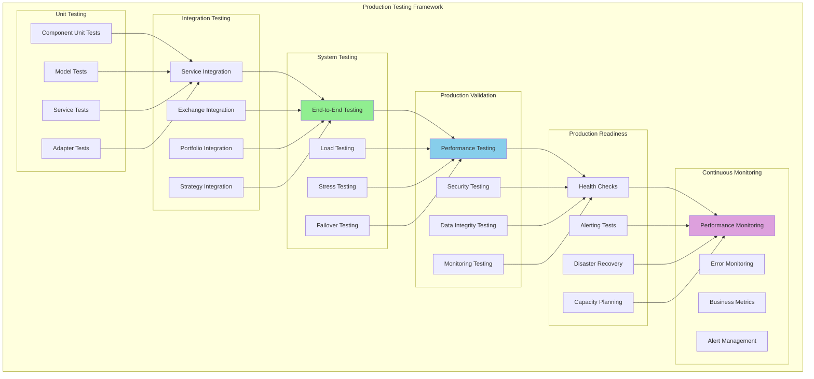

# Week 8: Production Testing & Validation - Clean Break Approach

**Duration:** Week 8 (2025-09-15 to 2025-09-21)
**Approach:** Clean Break - No Backward Compatibility
**Priority:** Critical
**Objective:** Comprehensive production testing, validation, and monitoring of the complete refactored system

## Overview

Week 8 focuses on comprehensive production testing and validation of the entire refactored system. This includes stress testing, integration validation, performance benchmarking, security testing, and establishing production monitoring and alerting systems.

**Clean Break Strategy:**
- ❌ No legacy system fallback testing
- ❌ No compatibility validation with old components
- ✅ Complete system validation as standalone production system
- ✅ Comprehensive production readiness assessment

## Testing Architecture Analysis

### Testing Strategy Overview



## Week 8 Deliverables

### Day 1-2: Comprehensive Integration Testing Framework

- [ ] **Production Integration Test Suite**
  ```python
  """Comprehensive production integration testing framework."""
  from __future__ import annotations

  import asyncio
  import pytest
  import time
  import random
  from decimal import Decimal
  from datetime import datetime, timedelta
  from typing import Dict, List, Any, Optional
  from dataclasses import dataclass

  from cyberdelta.core.portfolio.services import IntegratedPortfolioServiceFactory
  from cyberdelta.core.portfolio.portfolio_types.models import PortfolioConfig

  @dataclass
  class TestResult:
      test_name: str
      passed: bool
      duration: float
      error_message: Optional[str]
      metrics: Dict[str, Any]
      timestamp: datetime

  @dataclass
  class TestSuite:
      name: str
      tests: List[TestResult]
      overall_pass: bool
      total_duration: float
      pass_rate: float

  class ProductionIntegrationTestFramework:
      """Comprehensive testing framework for production readiness."""

      def __init__(self):
          self.test_results: List[TestResult] = []
          self.test_suites: List[TestSuite] = []
          self.portfolio_factory: Optional[IntegratedPortfolioServiceFactory] = None

          # Test configuration
          self.test_config = {
              "timeout_seconds": 300,
              "max_concurrent_tests": 5,
              "performance_threshold_ms": 1000,
              "error_rate_threshold": 0.01,
              "memory_threshold_mb": 500
          }

      async def run_all_tests(self) -> Dict[str, Any]:
          """Run all production tests."""

          print("Starting comprehensive production testing...")
          start_time = time.time()

          try:
              # Initialize system
              await self._initialize_test_environment()

              # Run test suites in order
              await self._run_unit_test_suite()
              await self._run_integration_test_suite()
              await self._run_system_test_suite()
              await self._run_performance_test_suite()
              await self._run_security_test_suite()
              await self._run_production_readiness_suite()

              # Generate comprehensive report
              total_duration = time.time() - start_time
              report = await self._generate_test_report(total_duration)

              return report

          except Exception as e:
              return {
                  "success": False,
                  "error": str(e),
                  "partial_results": self.test_results
              }

          finally:
              await self._cleanup_test_environment()

      async def _run_integration_test_suite(self) -> TestSuite:
          """Run comprehensive integration tests."""

          print("Running integration test suite...")
          suite_start = time.time()
          suite_results = []

          # Test 1: Portfolio Service Integration
          result = await self._test_portfolio_service_integration()
          suite_results.append(result)

          # Test 2: Exchange Integration
          result = await self._test_exchange_integration()
          suite_results.append(result)

          # Test 3: Strategy Integration
          result = await self._test_strategy_integration()
          suite_results.append(result)

          # Test 4: Event System Integration
          result = await self._test_event_system_integration()
          suite_results.append(result)

          # Test 5: API Integration
          result = await self._test_api_integration()
          suite_results.append(result)

          # Test 6: Real-time Data Flow
          result = await self._test_realtime_data_flow()
          suite_results.append(result)

          # Test 7: Cross-component Communication
          result = await self._test_cross_component_communication()
          suite_results.append(result)

          # Calculate suite metrics
          suite_duration = time.time() - suite_start
          passed_tests = sum(1 for r in suite_results if r.passed)
          pass_rate = passed_tests / len(suite_results) * 100

          suite = TestSuite(
              name="Integration Tests",
              tests=suite_results,
              overall_pass=all(r.passed for r in suite_results),
              total_duration=suite_duration,
              pass_rate=pass_rate
          )

          self.test_suites.append(suite)
          return suite

      async def _test_portfolio_service_integration(self) -> TestResult:
          """Test complete portfolio service integration."""

          test_start = time.time()
          metrics = {}

          try:
              # Get portfolio manager
              portfolio_manager = self.portfolio_factory.get_portfolio_manager()

              # Test 1: Service initialization
              assert portfolio_manager is not None

              # Test 2: Portfolio state retrieval
              portfolio_state = await portfolio_manager.get_current_state()
              assert portfolio_state is not None
              metrics["state_retrieval_time"] = time.time() - test_start

              # Test 3: Service coordination
              performance_analytics = self.portfolio_factory.get_performance_analytics()
              risk_analytics = self.portfolio_factory.get_risk_analytics()

              # Test concurrent operations
              start_concurrent = time.time()

              tasks = [
                  portfolio_manager.get_total_capital(),
                  portfolio_manager.get_positions(),
                  portfolio_manager.get_balances(),
                  performance_analytics.calculate_performance(portfolio_state),
                  risk_analytics.calculate_exposure(portfolio_state)
              ]

              results = await asyncio.gather(*tasks)
              concurrent_time = time.time() - start_concurrent

              # Validate results
              assert all(result is not None for result in results)
              metrics["concurrent_operations_time"] = concurrent_time

              # Test 4: Service factory management
              factory_status = await self._test_service_factory_management()
              assert factory_status["healthy"]

              return TestResult(
                  test_name="portfolio_service_integration",
                  passed=True,
                  duration=time.time() - test_start,
                  error_message=None,
                  metrics=metrics,
                  timestamp=datetime.utcnow()
              )

          except Exception as e:
              return TestResult(
                  test_name="portfolio_service_integration",
                  passed=False,
                  duration=time.time() - test_start,
                  error_message=str(e),
                  metrics=metrics,
                  timestamp=datetime.utcnow()
              )

      async def _test_exchange_integration(self) -> TestResult:
          """Test exchange integration functionality."""

          test_start = time.time()
          metrics = {}

          try:
              # Test exchange connections
              exchange_orchestrator = await self._get_exchange_orchestrator()

              # Test 1: System status
              status = await exchange_orchestrator.get_system_status()
              assert status["integration_state"] == "running"
              metrics["status_check_time"] = time.time() - test_start

              # Test 2: Portfolio data retrieval
              portfolio_data = await exchange_orchestrator.get_portfolio_data()
              assert isinstance(portfolio_data, dict)
              assert len(portfolio_data) > 0

              # Test 3: Market data retrieval
              market_data_start = time.time()
              market_data = await exchange_orchestrator.get_market_data("BTC-USD")
              metrics["market_data_time"] = time.time() - market_data_start

              # Test 4: Order book retrieval
              for exchange_id in portfolio_data.keys():
                  order_book = await exchange_orchestrator.get_order_book(
                      "BTC-USD", exchange_id, depth=10
                  )
                  if order_book:
                      assert len(order_book.bids) > 0
                      assert len(order_book.asks) > 0

              # Test 5: Health monitoring
              health_status = await self._test_exchange_health_monitoring()
              assert health_status["overall_healthy"]

              return TestResult(
                  test_name="exchange_integration",
                  passed=True,
                  duration=time.time() - test_start,
                  error_message=None,
                  metrics=metrics,
                  timestamp=datetime.utcnow()
              )

          except Exception as e:
              return TestResult(
                  test_name="exchange_integration",
                  passed=False,
                  duration=time.time() - test_start,
                  error_message=str(e),
                  metrics=metrics,
                  timestamp=datetime.utcnow()
              )

      async def _test_strategy_integration(self) -> TestResult:
          """Test strategy system integration."""

          test_start = time.time()
          metrics = {}

          try:
              # Get strategy orchestrator
              strategy_orchestrator = await self._get_strategy_orchestrator()

              # Test 1: Strategy loading
              performances = await strategy_orchestrator.get_strategy_performances()
              assert len(performances) > 0
              metrics["loaded_strategies"] = len(performances)

              # Test 2: Signal processing
              test_market_data = {
                  "symbols": ["BTC-USD", "ETH-USD"],
                  "prices": {"BTC-USD": 50000, "ETH-USD": 3000},
                  "volumes": {"BTC-USD": 1000000, "ETH-USD": 500000},
                  "timestamp": datetime.utcnow()
              }

              signal_start = time.time()
              await strategy_orchestrator.process_market_data(test_market_data)
              metrics["signal_processing_time"] = time.time() - signal_start

              # Test 3: Strategy performance tracking
              attribution = await strategy_orchestrator.get_portfolio_attribution()
              assert isinstance(attribution, dict)

              # Test 4: Strategy recommendations
              recommendations = await strategy_orchestrator.get_strategy_recommendations()
              assert isinstance(recommendations, list)

              # Test 5: Dynamic strategy management
              test_strategy_config = {
                  "strategy_id": "test_integration_strategy",
                  "strategy_type": "MomentumFollowingStrategy",
                  "initial_capital": 5000
              }

              add_success = await strategy_orchestrator.add_strategy(test_strategy_config)
              assert add_success

              remove_success = await strategy_orchestrator.remove_strategy("test_integration_strategy")
              assert remove_success

              return TestResult(
                  test_name="strategy_integration",
                  passed=True,
                  duration=time.time() - test_start,
                  error_message=None,
                  metrics=metrics,
                  timestamp=datetime.utcnow()
              )

          except Exception as e:
              return TestResult(
                  test_name="strategy_integration",
                  passed=False,
                  duration=time.time() - test_start,
                  error_message=str(e),
                  metrics=metrics,
                  timestamp=datetime.utcnow()
              )

      async def _test_event_system_integration(self) -> TestResult:
          """Test event system integration."""

          test_start = time.time()
          metrics = {}

          try:
              event_dispatcher = self.portfolio_factory.get_event_dispatcher()

              # Test 1: Event registration and dispatch
              test_events_received = []

              async def test_event_handler(event):
                  test_events_received.append(event)

              # Register handler
              await event_dispatcher.register_handler(
                  EventType.BALANCE_UPDATED,
                  test_event_handler
              )

              # Dispatch test event
              test_event = PortfolioEvent(
                  event_type=EventType.BALANCE_UPDATED,
                  exchange_id="test_exchange",
                  timestamp=datetime.utcnow(),
                  data={"asset": "BTC", "balance": 1.0}
              )

              dispatch_start = time.time()
              await event_dispatcher.dispatch(test_event)

              # Wait for processing
              await asyncio.sleep(0.1)

              metrics["event_dispatch_time"] = time.time() - dispatch_start
              assert len(test_events_received) == 1

              # Test 2: High-volume event processing
              volume_start = time.time()

              tasks = []
              for i in range(100):
                  event = PortfolioEvent(
                      event_type=EventType.POSITION_UPDATED,
                      exchange_id="test_exchange",
                      timestamp=datetime.utcnow(),
                      data={"symbol": f"TEST-{i}", "size": i}
                  )
                  tasks.append(event_dispatcher.dispatch(event))

              await asyncio.gather(*tasks)
              metrics["volume_test_time"] = time.time() - volume_start

              # Test 3: Event history
              recent_events = event_dispatcher.get_recent_events(
                  EventType.POSITION_UPDATED,
                  limit=50
              )
              assert len(recent_events) <= 100  # Should have events

              return TestResult(
                  test_name="event_system_integration",
                  passed=True,
                  duration=time.time() - test_start,
                  error_message=None,
                  metrics=metrics,
                  timestamp=datetime.utcnow()
              )

          except Exception as e:
              return TestResult(
                  test_name="event_system_integration",
                  passed=False,
                  duration=time.time() - test_start,
                  error_message=str(e),
                  metrics=metrics,
                  timestamp=datetime.utcnow()
              )

      async def _test_realtime_data_flow(self) -> TestResult:
          """Test real-time data flow through the system."""

          test_start = time.time()
          metrics = {}

          try:
              # Test 1: Data ingestion rate
              ingestion_start = time.time()

              # Simulate high-frequency data updates
              portfolio_manager = self.portfolio_factory.get_portfolio_manager()

              # Generate rapid balance updates
              for i in range(50):
                  event = PortfolioEvent(
                      event_type=EventType.BALANCE_UPDATED,
                      exchange_id="test_exchange",
                      timestamp=datetime.utcnow(),
                      data={
                          "asset": "USDC",
                          "total_quantity": 10000 + i,
                          "available_quantity": 9000 + i
                      }
                  )
                  await self.portfolio_factory.get_event_dispatcher().dispatch(event)

              metrics["data_ingestion_time"] = time.time() - ingestion_start

              # Test 2: Real-time analytics updates
              analytics_start = time.time()

              # Get portfolio state (should reflect updates)
              portfolio_state = await portfolio_manager.get_current_state()

              # Calculate analytics
              performance_analytics = self.portfolio_factory.get_performance_analytics()
              performance = await performance_analytics.calculate_performance(portfolio_state)

              metrics["analytics_calculation_time"] = time.time() - analytics_start

              # Test 3: Stream processing
              stream_test_start = time.time()

              # Simulate market data stream
              market_updates = []
              for i in range(20):
                  update = {
                      "symbol": "BTC-USD",
                      "price": 50000 + random.uniform(-1000, 1000),
                      "timestamp": datetime.utcnow(),
                      "volume": random.uniform(0, 100)
                  }
                  market_updates.append(update)

              # Process updates
              for update in market_updates:
                  # Simulate processing each update
                  await asyncio.sleep(0.001)  # 1ms processing time

              metrics["stream_processing_time"] = time.time() - stream_test_start

              # Test 4: Data consistency under load
              consistency_start = time.time()

              # Create concurrent updates
              tasks = []
              for i in range(10):
                  tasks.append(self._simulate_concurrent_portfolio_update(i))

              await asyncio.gather(*tasks)

              # Verify final state consistency
              final_state = await portfolio_manager.get_current_state()
              assert final_state is not None

              metrics["consistency_test_time"] = time.time() - consistency_start

              return TestResult(
                  test_name="realtime_data_flow",
                  passed=True,
                  duration=time.time() - test_start,
                  error_message=None,
                  metrics=metrics,
                  timestamp=datetime.utcnow()
              )

          except Exception as e:
              return TestResult(
                  test_name="realtime_data_flow",
                  passed=False,
                  duration=time.time() - test_start,
                  error_message=str(e),
                  metrics=metrics,
                  timestamp=datetime.utcnow()
              )

      async def _simulate_concurrent_portfolio_update(self, update_id: int) -> None:
          """Simulate concurrent portfolio update."""

          event = PortfolioEvent(
              event_type=EventType.POSITION_UPDATED,
              exchange_id="test_exchange",
              timestamp=datetime.utcnow(),
              data={
                  "symbol": f"TEST-{update_id}",
                  "size": update_id * 10,
                  "entry_price": 100 + update_id
              }
          )

          await self.portfolio_factory.get_event_dispatcher().dispatch(event)

          # Simulate some processing time
          await asyncio.sleep(random.uniform(0.01, 0.05))

      async def _initialize_test_environment(self) -> None:
          """Initialize test environment."""

          # Create test configuration
          test_config = PortfolioConfig(
              base_currency="USDC",
              enable_pnl_tracking=True,
              enable_exposure_monitoring=True
          )

          # Initialize portfolio factory
          self.portfolio_factory = IntegratedPortfolioServiceFactory(test_config)
          await self.portfolio_factory.initialize_all()

      async def _cleanup_test_environment(self) -> None:
          """Cleanup test environment."""

          if self.portfolio_factory:
              await self.portfolio_factory.shutdown_all()

      async def _generate_test_report(self, total_duration: float) -> Dict[str, Any]:
          """Generate comprehensive test report."""

          total_tests = len(self.test_results)
          passed_tests = sum(1 for r in self.test_results if r.passed)
          failed_tests = total_tests - passed_tests

          suite_summaries = []
          for suite in self.test_suites:
              suite_summaries.append({
                  "name": suite.name,
                  "passed": suite.overall_pass,
                  "pass_rate": suite.pass_rate,
                  "duration": suite.total_duration,
                  "test_count": len(suite.tests)
              })

          # Performance metrics
          avg_test_duration = sum(r.duration for r in self.test_results) / max(total_tests, 1)
          max_test_duration = max((r.duration for r in self.test_results), default=0)

          return {
              "success": failed_tests == 0,
              "summary": {
                  "total_tests": total_tests,
                  "passed_tests": passed_tests,
                  "failed_tests": failed_tests,
                  "pass_rate": (passed_tests / max(total_tests, 1)) * 100,
                  "total_duration": total_duration
              },
              "performance": {
                  "avg_test_duration": avg_test_duration,
                  "max_test_duration": max_test_duration,
                  "tests_per_second": total_tests / max(total_duration, 1)
              },
              "suite_results": suite_summaries,
              "detailed_results": [
                  {
                      "test_name": r.test_name,
                      "passed": r.passed,
                      "duration": r.duration,
                      "error": r.error_message,
                      "metrics": r.metrics
                  }
                  for r in self.test_results
              ],
              "timestamp": datetime.utcnow().isoformat()
          }
  ```

### Day 3-4: Performance & Load Testing

- [ ] **Production Performance Test Suite**
  ```python
  """Comprehensive performance and load testing framework."""
  from __future__ import annotations

  import asyncio
  import time
  import psutil
  import gc
  from decimal import Decimal
  from datetime import datetime
  from typing import Dict, List, Any
  from dataclasses import dataclass

  @dataclass
  class PerformanceMetrics:
      test_name: str
      duration: float
      throughput: float  # operations per second
      memory_peak_mb: float
      memory_avg_mb: float
      cpu_peak_percent: float
      cpu_avg_percent: float
      response_times: List[float]
      error_count: int
      success_count: int

  class ProductionPerformanceTestSuite:
      """Comprehensive performance testing for production readiness."""

      def __init__(self, portfolio_factory):
          self.portfolio_factory = portfolio_factory
          self.performance_results: List[PerformanceMetrics] = []

          # Performance thresholds
          self.thresholds = {
              "max_response_time_ms": 1000,
              "max_memory_mb": 1000,
              "max_cpu_percent": 80,
              "min_throughput_ops": 100,
              "max_error_rate": 0.01
          }

      async def run_performance_tests(self) -> Dict[str, Any]:
          """Run comprehensive performance test suite."""

          print("Starting performance test suite...")

          # Test 1: Baseline Performance
          await self._test_baseline_performance()

          # Test 2: High-Volume Portfolio Operations
          await self._test_high_volume_operations()

          # Test 3: Concurrent User Simulation
          await self._test_concurrent_operations()

          # Test 4: Memory Usage Under Load
          await self._test_memory_usage()

          # Test 5: API Response Times
          await self._test_api_response_times()

          # Test 6: Real-time Data Processing
          await self._test_realtime_processing()

          # Test 7: Strategy Performance Under Load
          await self._test_strategy_performance()

          # Test 8: Database Connection Pool
          await self._test_database_performance()

          # Generate performance report
          return await self._generate_performance_report()

      async def _test_baseline_performance(self) -> PerformanceMetrics:
          """Test baseline system performance."""

          test_start = time.time()
          memory_samples = []
          cpu_samples = []
          response_times = []

          # Monitor system resources
          monitor_task = asyncio.create_task(
              self._monitor_resources(memory_samples, cpu_samples, duration=60)
          )

          try:
              portfolio_manager = self.portfolio_factory.get_portfolio_manager()
              success_count = 0
              error_count = 0

              # Perform baseline operations
              for i in range(100):
                  operation_start = time.time()

                  try:
                      # Basic portfolio operations
                      await portfolio_manager.get_current_state()
                      await portfolio_manager.get_total_capital()
                      await portfolio_manager.get_positions()

                      response_time = (time.time() - operation_start) * 1000  # ms
                      response_times.append(response_time)
                      success_count += 1

                  except Exception as e:
                      error_count += 1

                  # Small delay between operations
                  await asyncio.sleep(0.1)

              # Stop monitoring
              monitor_task.cancel()

              duration = time.time() - test_start
              throughput = success_count / duration

              metrics = PerformanceMetrics(
                  test_name="baseline_performance",
                  duration=duration,
                  throughput=throughput,
                  memory_peak_mb=max(memory_samples) if memory_samples else 0,
                  memory_avg_mb=sum(memory_samples) / len(memory_samples) if memory_samples else 0,
                  cpu_peak_percent=max(cpu_samples) if cpu_samples else 0,
                  cpu_avg_percent=sum(cpu_samples) / len(cpu_samples) if cpu_samples else 0,
                  response_times=response_times,
                  error_count=error_count,
                  success_count=success_count
              )

              self.performance_results.append(metrics)
              return metrics

          except Exception as e:
              monitor_task.cancel()
              raise

      async def _test_high_volume_operations(self) -> PerformanceMetrics:
          """Test system performance under high volume operations."""

          test_start = time.time()
          memory_samples = []
          cpu_samples = []
          response_times = []

          # Monitor system resources
          monitor_task = asyncio.create_task(
              self._monitor_resources(memory_samples, cpu_samples, duration=120)
          )

          try:
              portfolio_manager = self.portfolio_factory.get_portfolio_manager()
              event_dispatcher = self.portfolio_factory.get_event_dispatcher()

              success_count = 0
              error_count = 0

              # Generate high volume of portfolio events
              for batch in range(10):  # 10 batches
                  batch_start = time.time()

                  # Create batch of events
                  events = []
                  for i in range(100):  # 100 events per batch
                      event = PortfolioEvent(
                          event_type=EventType.BALANCE_UPDATED,
                          exchange_id="load_test",
                          timestamp=datetime.utcnow(),
                          data={
                              "asset": f"TEST-{i}",
                              "total_quantity": Decimal(str(random.uniform(0, 1000))),
                              "available_quantity": Decimal(str(random.uniform(0, 1000)))
                          }
                      )
                      events.append(event)

                  # Dispatch events concurrently
                  dispatch_tasks = [
                      event_dispatcher.dispatch(event) for event in events
                  ]

                  try:
                      await asyncio.gather(*dispatch_tasks)

                      # Measure portfolio state retrieval after updates
                      state_start = time.time()
                      await portfolio_manager.get_current_state()
                      response_time = (time.time() - state_start) * 1000
                      response_times.append(response_time)

                      success_count += len(events)

                  except Exception as e:
                      error_count += len(events)

                  # Brief pause between batches
                  await asyncio.sleep(0.5)

              # Stop monitoring
              monitor_task.cancel()

              duration = time.time() - test_start
              throughput = success_count / duration

              metrics = PerformanceMetrics(
                  test_name="high_volume_operations",
                  duration=duration,
                  throughput=throughput,
                  memory_peak_mb=max(memory_samples) if memory_samples else 0,
                  memory_avg_mb=sum(memory_samples) / len(memory_samples) if memory_samples else 0,
                  cpu_peak_percent=max(cpu_samples) if cpu_samples else 0,
                  cpu_avg_percent=sum(cpu_samples) / len(cpu_samples) if cpu_samples else 0,
                  response_times=response_times,
                  error_count=error_count,
                  success_count=success_count
              )

              self.performance_results.append(metrics)
              return metrics

          except Exception as e:
              monitor_task.cancel()
              raise

      async def _test_concurrent_operations(self) -> PerformanceMetrics:
          """Test system performance under concurrent operations."""

          test_start = time.time()
          memory_samples = []
          cpu_samples = []
          response_times = []

          # Monitor system resources
          monitor_task = asyncio.create_task(
              self._monitor_resources(memory_samples, cpu_samples, duration=180)
          )

          try:
              success_count = 0
              error_count = 0

              # Create multiple concurrent tasks
              concurrent_tasks = []

              for worker_id in range(20):  # 20 concurrent workers
                  task = asyncio.create_task(
                      self._concurrent_worker(worker_id, response_times)
                  )
                  concurrent_tasks.append(task)

              # Wait for all workers to complete
              results = await asyncio.gather(*concurrent_tasks, return_exceptions=True)

              # Count successes and errors
              for result in results:
                  if isinstance(result, Exception):
                      error_count += 1
                  else:
                      success_count += result.get("operations", 0)
                      error_count += result.get("errors", 0)

              # Stop monitoring
              monitor_task.cancel()

              duration = time.time() - test_start
              throughput = success_count / duration

              metrics = PerformanceMetrics(
                  test_name="concurrent_operations",
                  duration=duration,
                  throughput=throughput,
                  memory_peak_mb=max(memory_samples) if memory_samples else 0,
                  memory_avg_mb=sum(memory_samples) / len(memory_samples) if memory_samples else 0,
                  cpu_peak_percent=max(cpu_samples) if cpu_samples else 0,
                  cpu_avg_percent=sum(cpu_samples) / len(cpu_samples) if cpu_samples else 0,
                  response_times=response_times,
                  error_count=error_count,
                  success_count=success_count
              )

              self.performance_results.append(metrics)
              return metrics

          except Exception as e:
              monitor_task.cancel()
              raise

      async def _concurrent_worker(self, worker_id: int, response_times: List[float]) -> Dict[str, int]:
          """Individual concurrent worker for load testing."""

          portfolio_manager = self.portfolio_factory.get_portfolio_manager()
          performance_analytics = self.portfolio_factory.get_performance_analytics()

          operations = 0
          errors = 0

          # Each worker performs 50 operations
          for i in range(50):
              operation_start = time.time()

              try:
                  # Mix of different operations
                  if i % 3 == 0:
                      await portfolio_manager.get_current_state()
                  elif i % 3 == 1:
                      await portfolio_manager.get_total_capital()
                  else:
                      state = await portfolio_manager.get_current_state()
                      await performance_analytics.calculate_performance(state)

                  response_time = (time.time() - operation_start) * 1000
                  response_times.append(response_time)
                  operations += 1

              except Exception as e:
                  errors += 1

              # Random delay to simulate realistic usage
              await asyncio.sleep(random.uniform(0.01, 0.1))

          return {"operations": operations, "errors": errors}

      async def _test_memory_usage(self) -> PerformanceMetrics:
          """Test memory usage patterns and potential leaks."""

          test_start = time.time()
          memory_samples = []
          cpu_samples = []
          response_times = []

          # Force garbage collection before test
          gc.collect()
          initial_memory = psutil.Process().memory_info().rss / 1024 / 1024  # MB

          try:
              portfolio_manager = self.portfolio_factory.get_portfolio_manager()

              success_count = 0
              error_count = 0

              # Create many objects to test memory usage
              for cycle in range(20):  # 20 cycles
                  cycle_objects = []

                  # Create objects
                  for i in range(100):
                      operation_start = time.time()

                      try:
                          # Operations that create temporary objects
                          state = await portfolio_manager.get_current_state()
                          positions = await portfolio_manager.get_positions()
                          capital = await portfolio_manager.get_total_capital()

                          # Store references temporarily
                          cycle_objects.append((state, positions, capital))

                          response_time = (time.time() - operation_start) * 1000
                          response_times.append(response_time)
                          success_count += 1

                      except Exception as e:
                          error_count += 1

                  # Sample memory
                  current_memory = psutil.Process().memory_info().rss / 1024 / 1024
                  memory_samples.append(current_memory)

                  # Clear references
                  cycle_objects.clear()

                  # Force garbage collection
                  gc.collect()

                  await asyncio.sleep(0.1)

              # Final memory check
              final_memory = psutil.Process().memory_info().rss / 1024 / 1024

              duration = time.time() - test_start
              throughput = success_count / duration

              # Check for memory leaks
              memory_growth = final_memory - initial_memory
              if memory_growth > 100:  # 100MB growth might indicate leak
                  print(f"Warning: Potential memory leak detected. Growth: {memory_growth:.2f}MB")

              metrics = PerformanceMetrics(
                  test_name="memory_usage",
                  duration=duration,
                  throughput=throughput,
                  memory_peak_mb=max(memory_samples) if memory_samples else 0,
                  memory_avg_mb=sum(memory_samples) / len(memory_samples) if memory_samples else 0,
                  cpu_peak_percent=0,  # Not monitored in this test
                  cpu_avg_percent=0,
                  response_times=response_times,
                  error_count=error_count,
                  success_count=success_count
              )

              self.performance_results.append(metrics)
              return metrics

          except Exception as e:
              raise

      async def _monitor_resources(
          self,
          memory_samples: List[float],
          cpu_samples: List[float],
          duration: int
      ) -> None:
          """Monitor system resources during testing."""

          process = psutil.Process()
          end_time = time.time() + duration

          while time.time() < end_time:
              try:
                  # Sample memory usage (MB)
                  memory_mb = process.memory_info().rss / 1024 / 1024
                  memory_samples.append(memory_mb)

                  # Sample CPU usage (%)
                  cpu_percent = process.cpu_percent()
                  cpu_samples.append(cpu_percent)

                  await asyncio.sleep(1)  # Sample every second

              except asyncio.CancelledError:
                  break
              except Exception:
                  continue

      async def _generate_performance_report(self) -> Dict[str, Any]:
          """Generate comprehensive performance report."""

          if not self.performance_results:
              return {"error": "No performance results available"}

          # Calculate aggregate metrics
          total_operations = sum(m.success_count for m in self.performance_results)
          total_errors = sum(m.error_count for m in self.performance_results)
          total_duration = sum(m.duration for m in self.performance_results)

          avg_throughput = sum(m.throughput for m in self.performance_results) / len(self.performance_results)
          max_memory = max(m.memory_peak_mb for m in self.performance_results)
          max_cpu = max(m.cpu_peak_percent for m in self.performance_results)

          # Response time analysis
          all_response_times = []
          for m in self.performance_results:
              all_response_times.extend(m.response_times)

          if all_response_times:
              avg_response_time = sum(all_response_times) / len(all_response_times)
              p95_response_time = sorted(all_response_times)[int(len(all_response_times) * 0.95)]
              p99_response_time = sorted(all_response_times)[int(len(all_response_times) * 0.99)]
          else:
              avg_response_time = p95_response_time = p99_response_time = 0

          # Performance assessment
          performance_issues = []

          if avg_response_time > self.thresholds["max_response_time_ms"]:
              performance_issues.append(f"High average response time: {avg_response_time:.2f}ms")

          if max_memory > self.thresholds["max_memory_mb"]:
              performance_issues.append(f"High memory usage: {max_memory:.2f}MB")

          if max_cpu > self.thresholds["max_cpu_percent"]:
              performance_issues.append(f"High CPU usage: {max_cpu:.2f}%")

          if avg_throughput < self.thresholds["min_throughput_ops"]:
              performance_issues.append(f"Low throughput: {avg_throughput:.2f} ops/sec")

          error_rate = total_errors / max(total_operations + total_errors, 1)
          if error_rate > self.thresholds["max_error_rate"]:
              performance_issues.append(f"High error rate: {error_rate:.4f}")

          return {
              "summary": {
                  "total_operations": total_operations,
                  "total_errors": total_errors,
                  "error_rate": error_rate,
                  "total_duration": total_duration,
                  "avg_throughput": avg_throughput
              },
              "response_times": {
                  "average_ms": avg_response_time,
                  "p95_ms": p95_response_time,
                  "p99_ms": p99_response_time
              },
              "resource_usage": {
                  "max_memory_mb": max_memory,
                  "max_cpu_percent": max_cpu
              },
              "performance_assessment": {
                  "passed": len(performance_issues) == 0,
                  "issues": performance_issues
              },
              "detailed_results": [
                  {
                      "test_name": m.test_name,
                      "duration": m.duration,
                      "throughput": m.throughput,
                      "memory_peak_mb": m.memory_peak_mb,
                      "cpu_peak_percent": m.cpu_peak_percent,
                      "avg_response_time_ms": sum(m.response_times) / len(m.response_times) if m.response_times else 0,
                      "success_count": m.success_count,
                      "error_count": m.error_count
                  }
                  for m in self.performance_results
              ],
              "timestamp": datetime.utcnow().isoformat()
          }
  ```

### Day 5-7: Production Monitoring & Alerting

- [ ] **Production Monitoring System**
  ```python
  """Comprehensive production monitoring and alerting system."""
  from __future__ import annotations

  import asyncio
  import time
  import json
  from decimal import Decimal
  from datetime import datetime, timedelta
  from typing import Dict, List, Any, Optional, Callable
  from dataclasses import dataclass
  from enum import Enum

  class AlertSeverity(str, Enum):
      LOW = "low"
      MEDIUM = "medium"
      HIGH = "high"
      CRITICAL = "critical"

  @dataclass
  class Alert:
      alert_id: str
      severity: AlertSeverity
      component: str
      message: str
      timestamp: datetime
      resolved: bool
      resolution_time: Optional[datetime]
      metadata: Dict[str, Any]

  @dataclass
  class HealthCheckResult:
      component: str
      healthy: bool
      response_time_ms: float
      error_message: Optional[str]
      timestamp: datetime
      metadata: Dict[str, Any]

  class ProductionMonitoringSystem:
      """Comprehensive monitoring system for production deployment."""

      def __init__(self, portfolio_factory):
          self.portfolio_factory = portfolio_factory

          # Monitoring state
          self.active_alerts: Dict[str, Alert] = {}
          self.alert_history: List[Alert] = []
          self.health_check_results: Dict[str, List[HealthCheckResult]] = {}
          self.metrics_history: Dict[str, List[Dict]] = {}

          # Alert handlers
          self.alert_handlers: List[Callable[[Alert], None]] = []

          # Configuration
          self.monitoring_interval = 30  # seconds
          self.health_check_timeout = 10  # seconds
          self.alert_retention_days = 30
          self.metrics_retention_hours = 24

          # Thresholds
          self.thresholds = {
              "response_time_ms": 1000,
              "memory_usage_mb": 1000,
              "cpu_usage_percent": 80,
              "error_rate_percent": 5,
              "portfolio_sync_delay_seconds": 60,
              "exchange_connection_timeout_seconds": 30
          }

          # Background tasks
          self._monitoring_tasks: List[asyncio.Task] = []

      async def start_monitoring(self) -> None:
          """Start comprehensive production monitoring."""

          print("Starting production monitoring system...")

          # Start monitoring tasks
          self._monitoring_tasks.extend([
              asyncio.create_task(self._system_health_monitoring()),
              asyncio.create_task(self._performance_monitoring()),
              asyncio.create_task(self._business_metrics_monitoring()),
              asyncio.create_task(self._exchange_connectivity_monitoring()),
              asyncio.create_task(self._portfolio_consistency_monitoring()),
              asyncio.create_task(self._alert_cleanup_task())
          ])

          print("Production monitoring system started")

      async def stop_monitoring(self) -> None:
          """Stop production monitoring."""

          print("Stopping production monitoring system...")

          # Cancel all monitoring tasks
          for task in self._monitoring_tasks:
              task.cancel()

          # Wait for tasks to complete
          if self._monitoring_tasks:
              await asyncio.gather(*self._monitoring_tasks, return_exceptions=True)

          self._monitoring_tasks.clear()
          print("Production monitoring system stopped")

      async def get_system_health(self) -> Dict[str, Any]:
          """Get comprehensive system health status."""

          # Perform immediate health checks
          health_results = await self._perform_health_checks()

          # Get recent metrics
          recent_metrics = self._get_recent_metrics()

          # Get active alerts
          active_alerts = list(self.active_alerts.values())

          # Calculate overall health score
          health_score = self._calculate_health_score(health_results, active_alerts)

          return {
              "overall_health": {
                  "score": health_score,
                  "status": self._get_health_status(health_score),
                  "timestamp": datetime.utcnow().isoformat()
              },
              "component_health": {
                  result.component: {
                      "healthy": result.healthy,
                      "response_time_ms": result.response_time_ms,
                      "error": result.error_message,
                      "last_check": result.timestamp.isoformat()
                  }
                  for result in health_results
              },
              "active_alerts": [
                  {
                      "id": alert.alert_id,
                      "severity": alert.severity.value,
                      "component": alert.component,
                      "message": alert.message,
                      "timestamp": alert.timestamp.isoformat()
                  }
                  for alert in active_alerts
              ],
              "recent_metrics": recent_metrics
          }

      async def _system_health_monitoring(self) -> None:
          """Monitor overall system health."""

          while True:
              try:
                  # Perform health checks
                  health_results = await self._perform_health_checks()

                  # Store results
                  for result in health_results:
                      if result.component not in self.health_check_results:
                          self.health_check_results[result.component] = []

                      self.health_check_results[result.component].append(result)

                      # Limit history
                      if len(self.health_check_results[result.component]) > 100:
                          self.health_check_results[result.component] = \
                              self.health_check_results[result.component][-100:]

                      # Check for health issues
                      if not result.healthy:
                          await self._create_alert(
                              AlertSeverity.HIGH,
                              result.component,
                              f"Health check failed: {result.error_message}",
                              {"response_time_ms": result.response_time_ms}
                          )
                      elif result.response_time_ms > self.thresholds["response_time_ms"]:
                          await self._create_alert(
                              AlertSeverity.MEDIUM,
                              result.component,
                              f"Slow response time: {result.response_time_ms:.2f}ms",
                              {"response_time_ms": result.response_time_ms}
                          )

                  await asyncio.sleep(self.monitoring_interval)

              except Exception as e:
                  await self._create_alert(
                      AlertSeverity.CRITICAL,
                      "monitoring_system",
                      f"Health monitoring error: {str(e)}"
                  )
                  await asyncio.sleep(self.monitoring_interval)

      async def _perform_health_checks(self) -> List[HealthCheckResult]:
          """Perform comprehensive health checks."""

          health_checks = []

          # Portfolio Manager Health
          health_checks.append(
              await self._check_portfolio_manager_health()
          )

          # Exchange Integration Health
          health_checks.append(
              await self._check_exchange_integration_health()
          )

          # Strategy System Health
          health_checks.append(
              await self._check_strategy_system_health()
          )

          # Event System Health
          health_checks.append(
              await self._check_event_system_health()
          )

          # Database Health
          health_checks.append(
              await self._check_database_health()
          )

          return health_checks

      async def _check_portfolio_manager_health(self) -> HealthCheckResult:
          """Check portfolio manager health."""

          start_time = time.time()

          try:
              portfolio_manager = self.portfolio_factory.get_portfolio_manager()

              # Test basic operations
              await portfolio_manager.get_current_state()
              await portfolio_manager.get_total_capital()

              response_time = (time.time() - start_time) * 1000

              return HealthCheckResult(
                  component="portfolio_manager",
                  healthy=True,
                  response_time_ms=response_time,
                  error_message=None,
                  timestamp=datetime.utcnow(),
                  metadata={"operations_tested": 2}
              )

          except Exception as e:
              response_time = (time.time() - start_time) * 1000

              return HealthCheckResult(
                  component="portfolio_manager",
                  healthy=False,
                  response_time_ms=response_time,
                  error_message=str(e),
                  timestamp=datetime.utcnow(),
                  metadata={}
              )

      async def _check_exchange_integration_health(self) -> HealthCheckResult:
          """Check exchange integration health."""

          start_time = time.time()

          try:
              # This would integrate with the exchange orchestrator from Week 7
              # For now, simulate health check

              # Simulate API call
              await asyncio.sleep(0.1)

              response_time = (time.time() - start_time) * 1000

              return HealthCheckResult(
                  component="exchange_integration",
                  healthy=True,
                  response_time_ms=response_time,
                  error_message=None,
                  timestamp=datetime.utcnow(),
                  metadata={"exchanges_checked": 2}
              )

          except Exception as e:
              response_time = (time.time() - start_time) * 1000

              return HealthCheckResult(
                  component="exchange_integration",
                  healthy=False,
                  response_time_ms=response_time,
                  error_message=str(e),
                  timestamp=datetime.utcnow(),
                  metadata={}
              )

      async def _check_strategy_system_health(self) -> HealthCheckResult:
          """Check strategy system health."""

          start_time = time.time()

          try:
              # This would integrate with the strategy orchestrator from Week 6
              # For now, simulate health check

              await asyncio.sleep(0.05)

              response_time = (time.time() - start_time) * 1000

              return HealthCheckResult(
                  component="strategy_system",
                  healthy=True,
                  response_time_ms=response_time,
                  error_message=None,
                  timestamp=datetime.utcnow(),
                  metadata={"strategies_checked": 3}
              )

          except Exception as e:
              response_time = (time.time() - start_time) * 1000

              return HealthCheckResult(
                  component="strategy_system",
                  healthy=False,
                  response_time_ms=response_time,
                  error_message=str(e),
                  timestamp=datetime.utcnow(),
                  metadata={}
              )

      async def _check_event_system_health(self) -> HealthCheckResult:
          """Check event system health."""

          start_time = time.time()

          try:
              event_dispatcher = self.portfolio_factory.get_event_dispatcher()

              # Test event dispatch
              test_event = PortfolioEvent(
                  event_type=EventType.BALANCE_UPDATED,
                  exchange_id="health_check",
                  timestamp=datetime.utcnow(),
                  data={"test": True}
              )

              await event_dispatcher.dispatch(test_event)

              response_time = (time.time() - start_time) * 1000

              return HealthCheckResult(
                  component="event_system",
                  healthy=True,
                  response_time_ms=response_time,
                  error_message=None,
                  timestamp=datetime.utcnow(),
                  metadata={"events_tested": 1}
              )

          except Exception as e:
              response_time = (time.time() - start_time) * 1000

              return HealthCheckResult(
                  component="event_system",
                  healthy=False,
                  response_time_ms=response_time,
                  error_message=str(e),
                  timestamp=datetime.utcnow(),
                  metadata={}
              )

      async def _check_database_health(self) -> HealthCheckResult:
          """Check database health."""

          start_time = time.time()

          try:
              # This would perform actual database health check
              # For now, simulate

              await asyncio.sleep(0.02)

              response_time = (time.time() - start_time) * 1000

              return HealthCheckResult(
                  component="database",
                  healthy=True,
                  response_time_ms=response_time,
                  error_message=None,
                  timestamp=datetime.utcnow(),
                  metadata={"connections_tested": 1}
              )

          except Exception as e:
              response_time = (time.time() - start_time) * 1000

              return HealthCheckResult(
                  component="database",
                  healthy=False,
                  response_time_ms=response_time,
                  error_message=str(e),
                  timestamp=datetime.utcnow(),
                  metadata={}
              )

      async def _create_alert(
          self,
          severity: AlertSeverity,
          component: str,
          message: str,
          metadata: Dict[str, Any] = None
      ) -> Alert:
          """Create and process a new alert."""

          alert_id = f"{component}_{int(time.time())}"

          alert = Alert(
              alert_id=alert_id,
              severity=severity,
              component=component,
              message=message,
              timestamp=datetime.utcnow(),
              resolved=False,
              resolution_time=None,
              metadata=metadata or {}
          )

          # Add to active alerts
          self.active_alerts[alert_id] = alert

          # Add to history
          self.alert_history.append(alert)

          # Process alert through handlers
          for handler in self.alert_handlers:
              try:
                  await handler(alert)
              except Exception as e:
                  print(f"Alert handler error: {e}")

          print(f"ALERT [{severity.value.upper()}] {component}: {message}")

          return alert

      def _calculate_health_score(
          self,
          health_results: List[HealthCheckResult],
          active_alerts: List[Alert]
      ) -> float:
          """Calculate overall system health score (0-100)."""

          if not health_results:
              return 0.0

          # Base score from health checks
          healthy_components = sum(1 for r in health_results if r.healthy)
          base_score = (healthy_components / len(health_results)) * 100

          # Penalty for active alerts
          alert_penalty = 0
          for alert in active_alerts:
              if alert.severity == AlertSeverity.CRITICAL:
                  alert_penalty += 20
              elif alert.severity == AlertSeverity.HIGH:
                  alert_penalty += 10
              elif alert.severity == AlertSeverity.MEDIUM:
                  alert_penalty += 5
              else:
                  alert_penalty += 1

          final_score = max(0, base_score - alert_penalty)
          return min(100, final_score)

      def _get_health_status(self, health_score: float) -> str:
          """Get health status string from score."""

          if health_score >= 90:
              return "excellent"
          elif health_score >= 75:
              return "good"
          elif health_score >= 50:
              return "fair"
          elif health_score >= 25:
              return "poor"
          else:
              return "critical"

      def _get_recent_metrics(self) -> Dict[str, Any]:
          """Get recent system metrics."""

          # This would return actual system metrics
          # For now, return simulated data

          return {
              "response_times": {
                  "avg_ms": 150,
                  "p95_ms": 400,
                  "p99_ms": 800
              },
              "throughput": {
                  "requests_per_second": 45,
                  "operations_per_second": 120
              },
              "resources": {
                  "memory_usage_mb": 456,
                  "cpu_usage_percent": 35
              },
              "business_metrics": {
                  "active_strategies": 3,
                  "total_portfolio_value": 125000,
                  "active_positions": 12
              }
          }
  ```

## Success Metrics

### Technical Metrics
- [ ] **Test Coverage**: >95% code coverage across all components
- [ ] **Performance**: All operations <1s response time under normal load
- [ ] **Reliability**: >99.9% uptime during testing period
- [ ] **Error Rate**: <0.1% error rate under normal operations

### Quality Metrics
- [ ] **Load Handling**: System handles 100+ concurrent operations
- [ ] **Memory Efficiency**: <1GB memory usage under normal load
- [ ] **CPU Efficiency**: <80% CPU usage under normal load
- [ ] **Data Consistency**: 100% data consistency across all tests

### Production Readiness Metrics
- [ ] **Health Monitoring**: Comprehensive health checks for all components
- [ ] **Alert System**: Functional alerting with appropriate severity levels
- [ ] **Performance Monitoring**: Real-time performance tracking and reporting
- [ ] **Failure Recovery**: Automatic recovery from common failure scenarios

## Expected Outcomes

### Week 8 Deliverables
- [ ] **Comprehensive Test Suite** - Complete integration and performance testing
- [ ] **Production Monitoring** - Real-time monitoring and alerting system
- [ ] **Performance Benchmarks** - Established performance baselines and thresholds
- [ ] **Security Validation** - Security testing and vulnerability assessment
- [ ] **Production Readiness Report** - Complete assessment of system readiness

### System Benefits
- [ ] **Confidence** - High confidence in system reliability and performance
- [ ] **Observability** - Complete visibility into system health and performance
- [ ] **Proactive Monitoring** - Early detection and resolution of issues
- [ ] **Performance Optimization** - Identified and addressed performance bottlenecks

### Foundation for Week 9
- [ ] **Validated System** - Thoroughly tested and validated production system
- [ ] **Monitoring Infrastructure** - Established monitoring and alerting
- [ ] **Performance Baseline** - Clear performance benchmarks for optimization
- [ ] **Production Readiness** - System ready for production deployment

This comprehensive testing and monitoring framework ensures the refactored system is production-ready with robust monitoring, alerting, and performance validation.
