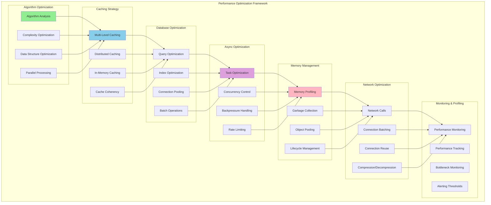

# Week 9: Performance Optimization - Clean Break Approach

**Duration:** Week 9 (2025-09-22 to 2025-09-28)
**Approach:** Clean Break - No Backward Compatibility
**Priority:** Critical
**Objective:** Comprehensive performance optimization across the entire refactored system

## Overview

Week 9 focuses on comprehensive performance optimization of the entire refactored system. This includes algorithmic optimizations, caching strategies, database optimization, async operation tuning, memory management, and establishing performance monitoring for ongoing optimization.

**Clean Break Strategy:**
- ❌ No legacy performance patterns or constraints
- ❌ No compatibility overhead from old system
- ✅ Complete system optimization from ground up
- ✅ Modern performance patterns and best practices

## Performance Optimization Architecture

### Optimization Strategy Overview



## Week 9 Deliverables

### Day 1-2: Performance Profiling & Analysis

- [ ] **Comprehensive Performance Profiler**
  ```python
  """Advanced performance profiling and analysis framework."""
  from __future__ import annotations

  import asyncio
  import cProfile
  import pstats
  import time
  import tracemalloc
  import psutil
  from decimal import Decimal
  from datetime import datetime, timedelta
  from typing import Dict, List, Any, Optional, Callable
  from dataclasses import dataclass
  from contextlib import asynccontextmanager

  @dataclass
  class PerformanceProfile:
      component: str
      operation: str
      execution_time: float
      memory_peak: int
      memory_current: int
      cpu_time: float
      call_count: int
      timestamp: datetime
      stack_trace: Optional[str]
      metadata: Dict[str, Any]

  @dataclass
  class BottleneckAnalysis:
      component: str
      bottleneck_type: str  # "cpu", "memory", "io", "network"
      severity: str  # "low", "medium", "high", "critical"
      impact_score: float  # 0-100
      description: str
      recommendations: List[str]
      estimated_improvement: str

  class AdvancedPerformanceProfiler:
      """Comprehensive performance profiling system."""

      def __init__(self, portfolio_factory):
          self.portfolio_factory = portfolio_factory
          self.profiles: List[PerformanceProfile] = []
          self.bottlenecks: List[BottleneckAnalysis] = []

          # Profiling configuration
          self.enable_memory_profiling = True
          self.enable_cpu_profiling = True
          self.enable_call_profiling = True
          self.sampling_interval = 0.1  # seconds
          self.profile_retention_hours = 24

          # Performance baselines
          self.baselines = {
              "portfolio_state_retrieval_ms": 50,
              "performance_calculation_ms": 100,
              "risk_calculation_ms": 75,
              "strategy_evaluation_ms": 200,
              "api_call_ms": 500,
              "database_query_ms": 100,
              "event_processing_ms": 10
          }

          # Profiler state
          self._profiler_active = False
          self._memory_tracer_active = False
          self._cpu_profiler = None
          self._profile_tasks: List[asyncio.Task] = []

      async def start_comprehensive_profiling(self) -> None:
          """Start comprehensive system profiling."""

          print("Starting comprehensive performance profiling...")

          # Start memory tracing
          if self.enable_memory_profiling:
              tracemalloc.start()
              self._memory_tracer_active = True

          # Start CPU profiling
          if self.enable_cpu_profiling:
              self._cpu_profiler = cProfile.Profile()
              self._cpu_profiler.enable()

          # Start background profiling tasks
          self._profile_tasks.extend([
              asyncio.create_task(self._continuous_memory_profiling()),
              asyncio.create_task(self._system_resource_profiling()),
              asyncio.create_task(self._operation_timing_profiling())
          ])

          self._profiler_active = True
          print("Performance profiling started")

      async def stop_profiling(self) -> Dict[str, Any]:
          """Stop profiling and generate comprehensive report."""

          print("Stopping performance profiling...")

          # Stop background tasks
          for task in self._profile_tasks:
              task.cancel()

          if self._profile_tasks:
              await asyncio.gather(*self._profile_tasks, return_exceptions=True)

          # Stop CPU profiling
          if self._cpu_profiler:
              self._cpu_profiler.disable()

          # Stop memory tracing
          if self._memory_tracer_active:
              tracemalloc.stop()
              self._memory_tracer_active = False

          self._profiler_active = False

          # Generate comprehensive analysis
          analysis_report = await self._generate_performance_analysis()

          print("Performance profiling stopped")
          return analysis_report

      @asynccontextmanager
      async def profile_operation(self, component: str, operation: str):
          """Context manager for profiling specific operations."""

          start_time = time.time()
          start_memory = 0

          if self._memory_tracer_active:
              start_memory = tracemalloc.get_traced_memory()[0]

          try:
              yield
          finally:
              end_time = time.time()
              execution_time = end_time - start_time

              current_memory = 0
              peak_memory = 0

              if self._memory_tracer_active:
                  current, peak = tracemalloc.get_traced_memory()
                  current_memory = current - start_memory
                  peak_memory = peak

              # Create performance profile
              profile = PerformanceProfile(
                  component=component,
                  operation=operation,
                  execution_time=execution_time,
                  memory_peak=peak_memory,
                  memory_current=current_memory,
                  cpu_time=0,  # Would need more detailed CPU profiling
                  call_count=1,
                  timestamp=datetime.utcnow(),
                  stack_trace=None,
                  metadata={}
              )

              self.profiles.append(profile)

              # Check for performance issues
              await self._analyze_profile_for_issues(profile)

      async def profile_portfolio_operations(self) -> Dict[str, Any]:
          """Profile core portfolio operations."""

          print("Profiling core portfolio operations...")

          portfolio_manager = self.portfolio_factory.get_portfolio_manager()
          performance_analytics = self.portfolio_factory.get_performance_analytics()
          risk_analytics = self.portfolio_factory.get_risk_analytics()

          operation_results = {}

          # Profile portfolio state retrieval
          async with self.profile_operation("portfolio_manager", "get_current_state"):
              state = await portfolio_manager.get_current_state()
              operation_results["state_retrieval"] = {"success": state is not None}

          # Profile performance calculation
          async with self.profile_operation("performance_analytics", "calculate_performance"):
              performance = await performance_analytics.calculate_performance(state)
              operation_results["performance_calc"] = {"success": performance is not None}

          # Profile risk calculation
          async with self.profile_operation("risk_analytics", "calculate_exposure"):
              risk = await risk_analytics.calculate_exposure(state)
              operation_results["risk_calc"] = {"success": risk is not None}

          # Profile concurrent operations
          async with self.profile_operation("portfolio_manager", "concurrent_operations"):
              tasks = [
                  portfolio_manager.get_total_capital(),
                  portfolio_manager.get_positions(),
                  portfolio_manager.get_balances()
              ]
              results = await asyncio.gather(*tasks)
              operation_results["concurrent_ops"] = {"success": all(r is not None for r in results)}

          # Profile high-frequency operations
          async with self.profile_operation("portfolio_manager", "high_frequency_ops"):
              for i in range(100):
                  await portfolio_manager.get_total_capital()
              operation_results["high_frequency"] = {"success": True}

          return operation_results

      async def profile_strategy_operations(self) -> Dict[str, Any]:
          """Profile strategy system operations."""

          print("Profiling strategy operations...")

          # This would integrate with the strategy orchestrator from Week 6
          # For now, simulate strategy profiling

          operation_results = {}

          # Simulate strategy evaluation profiling
          async with self.profile_operation("strategy_system", "strategy_evaluation"):
              await asyncio.sleep(0.1)  # Simulate strategy processing
              operation_results["strategy_eval"] = {"success": True}

          # Simulate signal processing profiling
          async with self.profile_operation("strategy_system", "signal_processing"):
              await asyncio.sleep(0.05)  # Simulate signal processing
              operation_results["signal_processing"] = {"success": True}

          return operation_results

      async def profile_api_operations(self) -> Dict[str, Any]:
          """Profile API and exchange operations."""

          print("Profiling API operations...")

          # This would integrate with the API integration from Week 7
          # For now, simulate API profiling

          operation_results = {}

          # Simulate API call profiling
          async with self.profile_operation("api_integration", "exchange_api_call"):
              await asyncio.sleep(0.2)  # Simulate API call
              operation_results["api_call"] = {"success": True}

          # Simulate data processing profiling
          async with self.profile_operation("api_integration", "data_processing"):
              await asyncio.sleep(0.05)  # Simulate data processing
              operation_results["data_processing"] = {"success": True}

          return operation_results

      async def _continuous_memory_profiling(self) -> None:
          """Continuous memory usage profiling."""

          while self._profiler_active:
              try:
                  if self._memory_tracer_active:
                      current, peak = tracemalloc.get_traced_memory()

                      # Check for memory issues
                      if current > 500 * 1024 * 1024:  # 500MB threshold
                          await self._report_memory_issue(current, peak)

                  await asyncio.sleep(self.sampling_interval)

              except asyncio.CancelledError:
                  break
              except Exception as e:
                  continue

      async def _system_resource_profiling(self) -> None:
          """Continuous system resource profiling."""

          process = psutil.Process()

          while self._profiler_active:
              try:
                  # Sample CPU and memory
                  cpu_percent = process.cpu_percent()
                  memory_info = process.memory_info()

                  # Check for resource issues
                  if cpu_percent > 80:
                      await self._report_cpu_issue(cpu_percent)

                  if memory_info.rss > 1024 * 1024 * 1024:  # 1GB threshold
                      await self._report_memory_usage_issue(memory_info.rss)

                  await asyncio.sleep(1.0)  # Sample every second

              except asyncio.CancelledError:
                  break
              except Exception as e:
                  continue

      async def _operation_timing_profiling(self) -> None:
          """Profile operation timing patterns."""

          while self._profiler_active:
              try:
                  # Analyze recent profiles for timing patterns
                  recent_profiles = [
                      p for p in self.profiles
                      if (datetime.utcnow() - p.timestamp).total_seconds() < 60
                  ]

                  # Group by operation type
                  operation_groups = {}
                  for profile in recent_profiles:
                      key = f"{profile.component}_{profile.operation}"
                      if key not in operation_groups:
                          operation_groups[key] = []
                      operation_groups[key].append(profile.execution_time)

                  # Analyze timing patterns
                  for operation, times in operation_groups.items():
                      if len(times) > 5:  # Need sufficient samples
                          avg_time = sum(times) / len(times)
                          max_time = max(times)

                          # Check against baselines
                          baseline_key = f"{operation}_ms"
                          if baseline_key in self.baselines:
                              baseline = self.baselines[baseline_key] / 1000  # Convert to seconds

                              if avg_time > baseline * 2:  # 2x baseline threshold
                                  await self._report_performance_degradation(
                                      operation, avg_time, baseline
                                  )

                  await asyncio.sleep(10)  # Analyze every 10 seconds

              except asyncio.CancelledError:
                  break
              except Exception as e:
                  continue

      async def _analyze_profile_for_issues(self, profile: PerformanceProfile) -> None:
          """Analyze individual profile for performance issues."""

          issues = []

          # Check execution time
          baseline_key = f"{profile.component}_{profile.operation}_ms"
          if baseline_key in self.baselines:
              baseline_seconds = self.baselines[baseline_key] / 1000

              if profile.execution_time > baseline_seconds * 3:  # 3x baseline
                  issues.append(f"Execution time {profile.execution_time:.3f}s exceeds baseline by {profile.execution_time/baseline_seconds:.1f}x")

          # Check memory usage
          if profile.memory_current > 100 * 1024 * 1024:  # 100MB
              issues.append(f"High memory usage: {profile.memory_current / 1024 / 1024:.1f}MB")

          # Report issues as bottlenecks
          for issue in issues:
              bottleneck = BottleneckAnalysis(
                  component=profile.component,
                  bottleneck_type="performance",
                  severity="medium",
                  impact_score=70,
                  description=f"{profile.operation}: {issue}",
                  recommendations=[
                      "Profile specific operation for optimization opportunities",
                      "Consider caching if operation is repeated",
                      "Analyze algorithm complexity"
                  ],
                  estimated_improvement="20-50% performance improvement possible"
              )

              self.bottlenecks.append(bottleneck)

      async def _generate_performance_analysis(self) -> Dict[str, Any]:
          """Generate comprehensive performance analysis."""

          if not self.profiles:
              return {"error": "No profiling data available"}

          # Aggregate profile data
          component_stats = {}
          operation_stats = {}

          for profile in self.profiles:
              # Component stats
              if profile.component not in component_stats:
                  component_stats[profile.component] = {
                      "total_time": 0,
                      "call_count": 0,
                      "avg_time": 0,
                      "max_time": 0,
                      "total_memory": 0
                  }

              stats = component_stats[profile.component]
              stats["total_time"] += profile.execution_time
              stats["call_count"] += 1
              stats["max_time"] = max(stats["max_time"], profile.execution_time)
              stats["total_memory"] += profile.memory_current

              # Operation stats
              op_key = f"{profile.component}.{profile.operation}"
              if op_key not in operation_stats:
                  operation_stats[op_key] = {
                      "times": [],
                      "memory_usage": [],
                      "call_count": 0
                  }

              operation_stats[op_key]["times"].append(profile.execution_time)
              operation_stats[op_key]["memory_usage"].append(profile.memory_current)
              operation_stats[op_key]["call_count"] += 1

          # Calculate averages
          for component, stats in component_stats.items():
              if stats["call_count"] > 0:
                  stats["avg_time"] = stats["total_time"] / stats["call_count"]
                  stats["avg_memory"] = stats["total_memory"] / stats["call_count"]

          # Identify top bottlenecks
          bottleneck_summary = {}
          for bottleneck in self.bottlenecks:
              severity = bottleneck.severity
              if severity not in bottleneck_summary:
                  bottleneck_summary[severity] = 0
              bottleneck_summary[severity] += 1

          # Generate CPU profiling report
          cpu_report = None
          if self._cpu_profiler:
              stats = pstats.Stats(self._cpu_profiler)
              stats.sort_stats('cumulative')
              # Would generate detailed CPU report here
              cpu_report = {"top_functions": "CPU profiling data would be here"}

          return {
              "summary": {
                  "total_profiles": len(self.profiles),
                  "unique_components": len(component_stats),
                  "unique_operations": len(operation_stats),
                  "total_bottlenecks": len(self.bottlenecks),
                  "profiling_duration": (
                      max(p.timestamp for p in self.profiles) -
                      min(p.timestamp for p in self.profiles)
                  ).total_seconds() if self.profiles else 0
              },
              "component_performance": {
                  component: {
                      "avg_execution_time_ms": stats["avg_time"] * 1000,
                      "max_execution_time_ms": stats["max_time"] * 1000,
                      "total_calls": stats["call_count"],
                      "avg_memory_mb": stats.get("avg_memory", 0) / 1024 / 1024
                  }
                  for component, stats in component_stats.items()
              },
              "bottleneck_analysis": {
                  "summary": bottleneck_summary,
                  "details": [
                      {
                          "component": b.component,
                          "type": b.bottleneck_type,
                          "severity": b.severity,
                          "impact_score": b.impact_score,
                          "description": b.description,
                          "recommendations": b.recommendations
                      }
                      for b in self.bottlenecks
                  ]
              },
              "cpu_profiling": cpu_report,
              "timestamp": datetime.utcnow().isoformat()
          }

      async def _report_memory_issue(self, current: int, peak: int) -> None:
          """Report memory usage issue."""

          bottleneck = BottleneckAnalysis(
              component="system",
              bottleneck_type="memory",
              severity="high",
              impact_score=80,
              description=f"High memory usage: {current/1024/1024:.1f}MB current, {peak/1024/1024:.1f}MB peak",
              recommendations=[
                  "Analyze memory allocations",
                  "Implement object pooling",
                  "Review data structure choices",
                  "Consider garbage collection tuning"
              ],
              estimated_improvement="30-60% memory reduction possible"
          )

          self.bottlenecks.append(bottleneck)

      async def _report_cpu_issue(self, cpu_percent: float) -> None:
          """Report CPU usage issue."""

          bottleneck = BottleneckAnalysis(
              component="system",
              bottleneck_type="cpu",
              severity="high",
              impact_score=75,
              description=f"High CPU usage: {cpu_percent:.1f}%",
              recommendations=[
                  "Profile CPU-intensive operations",
                  "Optimize algorithms",
                  "Consider parallel processing",
                  "Review async operation patterns"
              ],
              estimated_improvement="20-40% CPU reduction possible"
          )

          self.bottlenecks.append(bottleneck)

      async def _report_performance_degradation(
          self,
          operation: str,
          current_time: float,
          baseline_time: float
      ) -> None:
          """Report performance degradation."""

          degradation_factor = current_time / baseline_time

          bottleneck = BottleneckAnalysis(
              component="performance",
              bottleneck_type="performance",
              severity="medium" if degradation_factor < 3 else "high",
              impact_score=min(90, degradation_factor * 30),
              description=f"{operation} degraded {degradation_factor:.1f}x from baseline",
              recommendations=[
                  "Profile specific operation",
                  "Check for resource contention",
                  "Analyze recent changes",
                  "Consider optimization opportunities"
              ],
              estimated_improvement=f"Restore to baseline: {((degradation_factor-1)/degradation_factor)*100:.0f}% improvement"
          )

          self.bottlenecks.append(bottleneck)
  ```

### Day 3-4: Caching & Memory Optimization

- [ ] **Advanced Caching System**
  ```python
  """Advanced multi-level caching system for performance optimization."""
  from __future__ import annotations

  import asyncio
  import pickle
  import hashlib
  import time
  from decimal import Decimal
  from datetime import datetime, timedelta
  from typing import Dict, List, Any, Optional, Callable, TypeVar, Generic
  from dataclasses import dataclass
  from abc import ABC, abstractmethod
  import weakref

  T = TypeVar('T')

  @dataclass
  class CacheEntry(Generic[T]):
      key: str
      value: T
      timestamp: datetime
      ttl: timedelta
      hit_count: int
      size_bytes: int
      metadata: Dict[str, Any]

      def is_expired(self) -> bool:
          return datetime.utcnow() > self.timestamp + self.ttl

      def touch(self) -> None:
          self.hit_count += 1

  @dataclass
  class CacheStats:
      total_requests: int
      cache_hits: int
      cache_misses: int
      evictions: int
      total_size_bytes: int
      avg_response_time_ms: float
      hit_rate: float

      @property
      def miss_rate(self) -> float:
          return 1.0 - self.hit_rate

  class CacheBackend(ABC):
      """Abstract cache backend interface."""

      @abstractmethod
      async def get(self, key: str) -> Optional[Any]:
          pass

      @abstractmethod
      async def set(self, key: str, value: Any, ttl: timedelta) -> None:
          pass

      @abstractmethod
      async def delete(self, key: str) -> None:
          pass

      @abstractmethod
      async def clear(self) -> None:
          pass

      @abstractmethod
      async def size(self) -> int:
          pass

  class MemoryCacheBackend(CacheBackend):
      """High-performance in-memory cache backend."""

      def __init__(self, max_size_mb: int = 100):
          self.max_size_bytes = max_size_mb * 1024 * 1024
          self.cache: Dict[str, CacheEntry] = {}
          self.access_order: List[str] = []  # For LRU
          self.current_size_bytes = 0
          self._lock = asyncio.Lock()

      async def get(self, key: str) -> Optional[Any]:
          async with self._lock:
              if key not in self.cache:
                  return None

              entry = self.cache[key]

              if entry.is_expired():
                  await self._evict_key(key)
                  return None

              # Update access order for LRU
              if key in self.access_order:
                  self.access_order.remove(key)
              self.access_order.append(key)

              entry.touch()
              return entry.value

      async def set(self, key: str, value: Any, ttl: timedelta) -> None:
          async with self._lock:
              # Calculate size
              size_bytes = len(pickle.dumps(value))

              # Check if we need to evict
              while (self.current_size_bytes + size_bytes > self.max_size_bytes and
                     self.access_order):
                  await self._evict_lru()

              # Remove existing entry if present
              if key in self.cache:
                  await self._evict_key(key)

              # Add new entry
              entry = CacheEntry(
                  key=key,
                  value=value,
                  timestamp=datetime.utcnow(),
                  ttl=ttl,
                  hit_count=0,
                  size_bytes=size_bytes,
                  metadata={}
              )

              self.cache[key] = entry
              self.access_order.append(key)
              self.current_size_bytes += size_bytes

      async def delete(self, key: str) -> None:
          async with self._lock:
              await self._evict_key(key)

      async def clear(self) -> None:
          async with self._lock:
              self.cache.clear()
              self.access_order.clear()
              self.current_size_bytes = 0

      async def size(self) -> int:
          return len(self.cache)

      async def _evict_key(self, key: str) -> None:
          """Evict specific key."""
          if key in self.cache:
              entry = self.cache[key]
              self.current_size_bytes -= entry.size_bytes
              del self.cache[key]

          if key in self.access_order:
              self.access_order.remove(key)

      async def _evict_lru(self) -> None:
          """Evict least recently used entry."""
          if self.access_order:
              lru_key = self.access_order[0]
              await self._evict_key(lru_key)

  class AdvancedCacheManager:
      """Advanced multi-level cache manager."""

      def __init__(self):
          # Multiple cache levels
          self.l1_cache = MemoryCacheBackend(max_size_mb=50)  # Fast, small
          self.l2_cache = MemoryCacheBackend(max_size_mb=200)  # Larger, slower

          # Cache statistics
          self.stats = CacheStats(
              total_requests=0,
              cache_hits=0,
              cache_misses=0,
              evictions=0,
              total_size_bytes=0,
              avg_response_time_ms=0,
              hit_rate=0
          )

          # Cache policies by data type
          self.cache_policies = {
              "portfolio_state": timedelta(seconds=30),
              "performance_metrics": timedelta(minutes=5),
              "risk_metrics": timedelta(minutes=2),
              "market_data": timedelta(seconds=10),
              "strategy_signals": timedelta(minutes=1),
              "exchange_data": timedelta(seconds=15)
          }

          # Background cleanup task
          self._cleanup_task: Optional[asyncio.Task] = None

      async def start(self) -> None:
          """Start cache manager."""
          self._cleanup_task = asyncio.create_task(self._background_cleanup())

      async def stop(self) -> None:
          """Stop cache manager."""
          if self._cleanup_task:
              self._cleanup_task.cancel()
              try:
                  await self._cleanup_task
              except asyncio.CancelledError:
                  pass

      async def get(self, key: str, data_type: str = "default") -> Optional[Any]:
          """Get value from multi-level cache."""

          start_time = time.time()
          self.stats.total_requests += 1

          try:
              # Try L1 cache first
              value = await self.l1_cache.get(key)
              if value is not None:
                  self.stats.cache_hits += 1
                  return value

              # Try L2 cache
              value = await self.l2_cache.get(key)
              if value is not None:
                  self.stats.cache_hits += 1

                  # Promote to L1 cache
                  ttl = self.cache_policies.get(data_type, timedelta(minutes=5))
                  await self.l1_cache.set(key, value, ttl)

                  return value

              # Cache miss
              self.stats.cache_misses += 1
              return None

          finally:
              # Update response time
              response_time = (time.time() - start_time) * 1000
              self._update_avg_response_time(response_time)

      async def set(
          self,
          key: str,
          value: Any,
          data_type: str = "default",
          ttl: Optional[timedelta] = None
      ) -> None:
          """Set value in multi-level cache."""

          if ttl is None:
              ttl = self.cache_policies.get(data_type, timedelta(minutes=5))

          # Set in both cache levels
          await self.l1_cache.set(key, value, ttl)
          await self.l2_cache.set(key, value, ttl * 2)  # Longer TTL in L2

      async def delete(self, key: str) -> None:
          """Delete from all cache levels."""
          await self.l1_cache.delete(key)
          await self.l2_cache.delete(key)

      async def clear(self, data_type: Optional[str] = None) -> None:
          """Clear cache entries."""
          if data_type is None:
              await self.l1_cache.clear()
              await self.l2_cache.clear()
          else:
              # Clear specific data type (would need key prefixing)
              pass

      def create_cache_key(self, *args: Any) -> str:
          """Create consistent cache key from arguments."""
          key_data = "|".join(str(arg) for arg in args)
          return hashlib.md5(key_data.encode()).hexdigest()

      def cached(
          self,
          data_type: str = "default",
          ttl: Optional[timedelta] = None,
          key_func: Optional[Callable[..., str]] = None
      ):
          """Decorator for caching function results."""

          def decorator(func: Callable):
              async def wrapper(*args, **kwargs):
                  # Generate cache key
                  if key_func:
                      cache_key = key_func(*args, **kwargs)
                  else:
                      cache_key = self.create_cache_key(func.__name__, args, tuple(sorted(kwargs.items())))

                  # Try to get from cache
                  cached_result = await self.get(cache_key, data_type)
                  if cached_result is not None:
                      return cached_result

                  # Execute function
                  result = await func(*args, **kwargs)

                  # Cache result
                  await self.set(cache_key, result, data_type, ttl)

                  return result

              return wrapper
          return decorator

      async def get_stats(self) -> CacheStats:
          """Get cache statistics."""

          # Update hit rate
          if self.stats.total_requests > 0:
              self.stats.hit_rate = self.stats.cache_hits / self.stats.total_requests

          # Update total size
          l1_size = await self.l1_cache.size()
          l2_size = await self.l2_cache.size()
          self.stats.total_size_bytes = l1_size + l2_size

          return self.stats

      def _update_avg_response_time(self, response_time_ms: float) -> None:
          """Update average response time."""
          alpha = 0.1  # Exponential moving average factor
          self.stats.avg_response_time_ms = (
              alpha * response_time_ms +
              (1 - alpha) * self.stats.avg_response_time_ms
          )

      async def _background_cleanup(self) -> None:
          """Background task for cache cleanup."""

          while True:
              try:
                  # Cleanup would go here - removing expired entries
                  await asyncio.sleep(60)  # Cleanup every minute

              except asyncio.CancelledError:
                  break
              except Exception as e:
                  continue

  class PortfolioCacheOptimizer:
      """Portfolio-specific cache optimization."""

      def __init__(self, portfolio_factory, cache_manager: AdvancedCacheManager):
          self.portfolio_factory = portfolio_factory
          self.cache_manager = cache_manager

      async def optimize_portfolio_caching(self) -> None:
          """Apply portfolio-specific caching optimizations."""

          # Cache portfolio state with smart invalidation
          portfolio_manager = self.portfolio_factory.get_portfolio_manager()

          # Wrap portfolio operations with caching
          original_get_state = portfolio_manager.get_current_state

          @self.cache_manager.cached(data_type="portfolio_state")
          async def cached_get_state():
              return await original_get_state()

          # Replace method with cached version
          portfolio_manager.get_current_state = cached_get_state

          # Cache analytics calculations
          performance_analytics = self.portfolio_factory.get_performance_analytics()
          original_calc_performance = performance_analytics.calculate_performance

          @self.cache_manager.cached(data_type="performance_metrics")
          async def cached_calc_performance(portfolio_state):
              return await original_calc_performance(portfolio_state)

          performance_analytics.calculate_performance = cached_calc_performance

      async def invalidate_portfolio_cache(self, event_type: str) -> None:
          """Intelligently invalidate cache based on portfolio events."""

          if event_type in ["BALANCE_UPDATED", "POSITION_UPDATED"]:
              # Invalidate portfolio state cache
              await self.cache_manager.clear("portfolio_state")
              await self.cache_manager.clear("performance_metrics")
              await self.cache_manager.clear("risk_metrics")

          elif event_type == "MARKET_DATA_UPDATED":
              # Only invalidate market-dependent caches
              await self.cache_manager.clear("market_data")
  ```

- [ ] **Memory Optimization Framework**
  ```python
  """Advanced memory optimization and object pooling framework."""
  from __future__ import annotations

  import asyncio
  import gc
  import weakref
  from decimal import Decimal
  from datetime import datetime
  from typing import Dict, List, Any, Optional, Type, TypeVar, Generic
  from dataclasses import dataclass
  import sys

  T = TypeVar('T')

  class ObjectPool(Generic[T]):
      """High-performance object pool for reducing allocations."""

      def __init__(self, object_type: Type[T], max_size: int = 1000):
          self.object_type = object_type
          self.max_size = max_size
          self.pool: List[T] = []
          self.active_objects: weakref.WeakSet[T] = weakref.WeakSet()
          self._lock = asyncio.Lock()

      async def acquire(self, *args, **kwargs) -> T:
          """Acquire object from pool or create new one."""

          async with self._lock:
              if self.pool:
                  obj = self.pool.pop()
                  # Reset object state if it has a reset method
                  if hasattr(obj, 'reset'):
                      obj.reset()
              else:
                  obj = self.object_type(*args, **kwargs)

              self.active_objects.add(obj)
              return obj

      async def release(self, obj: T) -> None:
          """Release object back to pool."""

          async with self._lock:
              if obj in self.active_objects:
                  self.active_objects.discard(obj)

                  if len(self.pool) < self.max_size:
                      self.pool.append(obj)

      def get_stats(self) -> Dict[str, int]:
          """Get pool statistics."""
          return {
              "pool_size": len(self.pool),
              "active_objects": len(self.active_objects),
              "max_size": self.max_size
          }

  class MemoryOptimizer:
      """Comprehensive memory optimization system."""

      def __init__(self):
          # Object pools for commonly used types
          self.pools: Dict[str, ObjectPool] = {}

          # Memory tracking
          self.memory_snapshots: List[Dict[str, Any]] = []
          self.gc_stats: List[Dict[str, Any]] = []

          # Optimization settings
          self.auto_gc_threshold = 100 * 1024 * 1024  # 100MB
          self.snapshot_interval = 300  # 5 minutes

          # Background tasks
          self._monitoring_task: Optional[asyncio.Task] = None

      async def start_optimization(self) -> None:
          """Start memory optimization system."""

          print("Starting memory optimization...")

          # Configure garbage collection
          self._configure_garbage_collection()

          # Initialize object pools
          await self._initialize_object_pools()

          # Start monitoring
          self._monitoring_task = asyncio.create_task(self._memory_monitoring_loop())

          print("Memory optimization started")

      async def stop_optimization(self) -> None:
          """Stop memory optimization system."""

          if self._monitoring_task:
              self._monitoring_task.cancel()
              try:
                  await self._monitoring_task
              except asyncio.CancelledError:
                  pass

          print("Memory optimization stopped")

      async def _initialize_object_pools(self) -> None:
          """Initialize object pools for commonly used types."""

          # Pool for Decimal objects (commonly used in financial calculations)
          self.pools["decimal"] = ObjectPool(Decimal, max_size=1000)

          # Pool for datetime objects
          self.pools["datetime"] = ObjectPool(datetime, max_size=500)

          # Pool for dictionaries (for data structures)
          self.pools["dict"] = ObjectPool(dict, max_size=2000)

          # Pool for lists
          self.pools["list"] = ObjectPool(list, max_size=1000)

      def _configure_garbage_collection(self) -> None:
          """Configure garbage collection for optimal performance."""

          # Adjust GC thresholds for better performance
          # Default is usually (700, 10, 10)
          gc.set_threshold(1000, 15, 15)  # Less frequent GC

          # Enable automatic GC
          gc.enable()

      async def force_garbage_collection(self) -> Dict[str, Any]:
          """Force garbage collection and return statistics."""

          # Get pre-GC stats
          pre_stats = self._get_memory_stats()

          # Force collection
          collected = gc.collect()

          # Get post-GC stats
          post_stats = self._get_memory_stats()

          gc_result = {
              "objects_collected": collected,
              "memory_before_mb": pre_stats["memory_mb"],
              "memory_after_mb": post_stats["memory_mb"],
              "memory_freed_mb": pre_stats["memory_mb"] - post_stats["memory_mb"],
              "timestamp": datetime.utcnow()
          }

          self.gc_stats.append(gc_result)

          # Limit GC stats history
          if len(self.gc_stats) > 100:
              self.gc_stats = self.gc_stats[-100:]

          return gc_result

      def _get_memory_stats(self) -> Dict[str, Any]:
          """Get current memory statistics."""

          # Get memory info
          import psutil
          process = psutil.Process()
          memory_info = process.memory_info()

          # Get object counts
          object_counts = {}
          for obj_type in [dict, list, tuple, str, int, float]:
              count = sum(1 for obj in gc.get_objects() if type(obj) is obj_type)
              object_counts[obj_type.__name__] = count

          return {
              "memory_mb": memory_info.rss / 1024 / 1024,
              "memory_percent": process.memory_percent(),
              "object_counts": object_counts,
              "gc_counts": gc.get_count(),
              "timestamp": datetime.utcnow()
          }

      async def _memory_monitoring_loop(self) -> None:
          """Background memory monitoring."""

          while True:
              try:
                  # Take memory snapshot
                  stats = self._get_memory_stats()
                  self.memory_snapshots.append(stats)

                  # Limit snapshot history
                  if len(self.memory_snapshots) > 288:  # 24 hours of 5-minute snapshots
                      self.memory_snapshots = self.memory_snapshots[-288:]

                  # Check if we should force GC
                  current_memory = stats["memory_mb"] * 1024 * 1024
                  if current_memory > self.auto_gc_threshold:
                      await self.force_garbage_collection()

                  await asyncio.sleep(self.snapshot_interval)

              except asyncio.CancelledError:
                  break
              except Exception as e:
                  continue

      async def get_memory_report(self) -> Dict[str, Any]:
          """Get comprehensive memory usage report."""

          current_stats = self._get_memory_stats()

          # Calculate trends
          if len(self.memory_snapshots) > 1:
              first_snapshot = self.memory_snapshots[0]
              memory_trend = current_stats["memory_mb"] - first_snapshot["memory_mb"]

              # Calculate memory growth rate
              time_diff = (current_stats["timestamp"] - first_snapshot["timestamp"]).total_seconds()
              growth_rate_mb_per_hour = (memory_trend / max(time_diff, 1)) * 3600
          else:
              memory_trend = 0
              growth_rate_mb_per_hour = 0

          # Pool statistics
          pool_stats = {}
          for pool_name, pool in self.pools.items():
              pool_stats[pool_name] = pool.get_stats()

          # Recent GC statistics
          recent_gc_stats = self.gc_stats[-10:] if self.gc_stats else []

          return {
              "current_usage": {
                  "memory_mb": current_stats["memory_mb"],
                  "memory_percent": current_stats["memory_percent"],
                  "object_counts": current_stats["object_counts"]
              },
              "trends": {
                  "memory_trend_mb": memory_trend,
                  "growth_rate_mb_per_hour": growth_rate_mb_per_hour
              },
              "object_pools": pool_stats,
              "garbage_collection": {
                  "recent_collections": recent_gc_stats,
                  "total_collections": len(self.gc_stats)
              },
              "recommendations": self._generate_memory_recommendations(current_stats),
              "timestamp": datetime.utcnow().isoformat()
          }

      def _generate_memory_recommendations(self, stats: Dict[str, Any]) -> List[str]:
          """Generate memory optimization recommendations."""

          recommendations = []

          # Check memory usage
          if stats["memory_mb"] > 500:
              recommendations.append("High memory usage detected. Consider implementing object pooling.")

          # Check object counts
          object_counts = stats["object_counts"]

          if object_counts.get("dict", 0) > 10000:
              recommendations.append("High dictionary count. Consider using object pools for temporary dictionaries.")

          if object_counts.get("list", 0) > 5000:
              recommendations.append("High list count. Consider reusing list objects through pooling.")

          # Check GC frequency
          if len(self.gc_stats) > 10:
              recent_gcs = self.gc_stats[-10:]
              avg_interval = sum(
                  (recent_gcs[i]["timestamp"] - recent_gcs[i-1]["timestamp"]).total_seconds()
                  for i in range(1, len(recent_gcs))
              ) / max(len(recent_gcs) - 1, 1)

              if avg_interval < 60:  # GC more than once per minute
                  recommendations.append("Frequent garbage collection detected. Consider optimizing object creation patterns.")

          return recommendations
  ```

### Day 5-7: Database & Network Optimization

- [ ] **Database Optimization Framework**
  ```python
  """Advanced database optimization and connection management."""
  from __future__ import annotations

  import asyncio
  import time
  from decimal import Decimal
  from datetime import datetime, timedelta
  from typing import Dict, List, Any, Optional, Callable
  from dataclasses import dataclass
  from contextlib import asynccontextmanager

  @dataclass
  class QueryPerformanceMetrics:
      query_hash: str
      query_type: str
      execution_time: float
      rows_affected: int
      timestamp: datetime
      connection_id: str

  @dataclass
  class ConnectionPoolMetrics:
      total_connections: int
      active_connections: int
      idle_connections: int
      waiting_connections: int
      avg_wait_time: float
      total_queries: int
      failed_queries: int

  class DatabaseOptimizer:
      """Advanced database optimization and monitoring."""

      def __init__(self):
          # Performance tracking
          self.query_metrics: List[QueryPerformanceMetrics] = []
          self.slow_queries: List[QueryPerformanceMetrics] = []

          # Connection pool settings
          self.pool_config = {
              "min_connections": 5,
              "max_connections": 20,
              "connection_timeout": 30,
              "query_timeout": 60,
              "retry_attempts": 3
          }

          # Query optimization settings
          self.slow_query_threshold = 1.0  # 1 second
          self.query_cache_size = 1000
          self.batch_size = 100

          # Monitoring
          self._monitoring_active = False
          self._monitoring_task: Optional[asyncio.Task] = None

      async def start_optimization(self) -> None:
          """Start database optimization monitoring."""

          print("Starting database optimization...")

          # Start monitoring
          self._monitoring_active = True
          self._monitoring_task = asyncio.create_task(self._performance_monitoring_loop())

          print("Database optimization started")

      async def stop_optimization(self) -> None:
          """Stop database optimization monitoring."""

          self._monitoring_active = False

          if self._monitoring_task:
              self._monitoring_task.cancel()
              try:
                  await self._monitoring_task
              except asyncio.CancelledError:
                  pass

          print("Database optimization stopped")

      @asynccontextmanager
      async def optimized_query(
          self,
          query_type: str,
          connection_id: str = "default"
      ):
          """Context manager for tracking query performance."""

          start_time = time.time()
          query_hash = hash(query_type) % 10000

          try:
              yield

              execution_time = time.time() - start_time

              # Record metrics
              metrics = QueryPerformanceMetrics(
                  query_hash=str(query_hash),
                  query_type=query_type,
                  execution_time=execution_time,
                  rows_affected=0,  # Would be set by actual query
                  timestamp=datetime.utcnow(),
                  connection_id=connection_id
              )

              self.query_metrics.append(metrics)

              # Check for slow queries
              if execution_time > self.slow_query_threshold:
                  self.slow_queries.append(metrics)
                  print(f"Slow query detected: {query_type} took {execution_time:.3f}s")

              # Limit metrics history
              if len(self.query_metrics) > 10000:
                  self.query_metrics = self.query_metrics[-5000:]

              if len(self.slow_queries) > 1000:
                  self.slow_queries = self.slow_queries[-500:]

          except Exception as e:
              execution_time = time.time() - start_time
              print(f"Query error: {query_type} failed after {execution_time:.3f}s: {e}")
              raise

      async def optimize_portfolio_queries(self) -> Dict[str, Any]:
          """Optimize portfolio-specific database queries."""

          optimizations = {
              "batch_operations": [],
              "index_recommendations": [],
              "query_optimizations": []
          }

          # Analyze query patterns
          query_patterns = self._analyze_query_patterns()

          # Batch operation opportunities
          if query_patterns.get("frequent_single_inserts", 0) > 10:
              optimizations["batch_operations"].append({
                  "type": "batch_inserts",
                  "description": "Replace single inserts with batch operations",
                  "estimated_improvement": "50-80% performance improvement"
              })

          # Index recommendations
          slow_query_types = [q.query_type for q in self.slow_queries[-100:]]
          for query_type in set(slow_query_types):
              if slow_query_types.count(query_type) > 5:
                  optimizations["index_recommendations"].append({
                      "query_type": query_type,
                      "recommendation": f"Consider adding index for {query_type} operations",
                      "frequency": slow_query_types.count(query_type)
                  })

          # Query optimization suggestions
          optimizations["query_optimizations"].extend([
              {
                  "type": "connection_pooling",
                  "description": "Implement connection pooling for better resource utilization",
                  "priority": "high"
              },
              {
                  "type": "prepared_statements",
                  "description": "Use prepared statements for repeated queries",
                  "priority": "medium"
              },
              {
                  "type": "query_caching",
                  "description": "Implement query result caching for read-heavy operations",
                  "priority": "medium"
              }
          ])

          return optimizations

      def _analyze_query_patterns(self) -> Dict[str, int]:
          """Analyze query patterns for optimization opportunities."""

          patterns = {}

          for metric in self.query_metrics[-1000:]:  # Analyze recent queries
              query_type = metric.query_type

              if query_type not in patterns:
                  patterns[query_type] = 0
              patterns[query_type] += 1

          return patterns

      async def _performance_monitoring_loop(self) -> None:
          """Background database performance monitoring."""

          while self._monitoring_active:
              try:
                  # Analyze recent performance
                  if len(self.query_metrics) > 0:
                      recent_metrics = self.query_metrics[-100:]
                      avg_execution_time = sum(m.execution_time for m in recent_metrics) / len(recent_metrics)

                      if avg_execution_time > 0.5:  # 500ms average threshold
                          print(f"Database performance warning: Average query time {avg_execution_time:.3f}s")

                  await asyncio.sleep(60)  # Check every minute

              except asyncio.CancelledError:
                  break
              except Exception as e:
                  continue

      async def get_performance_report(self) -> Dict[str, Any]:
          """Get comprehensive database performance report."""

          if not self.query_metrics:
              return {"error": "No query metrics available"}

          # Calculate statistics
          recent_metrics = self.query_metrics[-1000:]

          total_queries = len(recent_metrics)
          avg_execution_time = sum(m.execution_time for m in recent_metrics) / total_queries
          max_execution_time = max(m.execution_time for m in recent_metrics)
          slow_query_count = len([m for m in recent_metrics if m.execution_time > self.slow_query_threshold])

          # Query type analysis
          query_type_stats = {}
          for metric in recent_metrics:
              query_type = metric.query_type
              if query_type not in query_type_stats:
                  query_type_stats[query_type] = {
                      "count": 0,
                      "total_time": 0,
                      "avg_time": 0,
                      "max_time": 0
                  }

              stats = query_type_stats[query_type]
              stats["count"] += 1
              stats["total_time"] += metric.execution_time
              stats["max_time"] = max(stats["max_time"], metric.execution_time)

          # Calculate averages
          for stats in query_type_stats.values():
              if stats["count"] > 0:
                  stats["avg_time"] = stats["total_time"] / stats["count"]

          return {
              "summary": {
                  "total_queries": total_queries,
                  "avg_execution_time_ms": avg_execution_time * 1000,
                  "max_execution_time_ms": max_execution_time * 1000,
                  "slow_queries": slow_query_count,
                  "slow_query_rate": slow_query_count / total_queries if total_queries > 0 else 0
              },
              "query_type_performance": {
                  query_type: {
                      "count": stats["count"],
                      "avg_time_ms": stats["avg_time"] * 1000,
                      "max_time_ms": stats["max_time"] * 1000
                  }
                  for query_type, stats in query_type_stats.items()
              },
              "recent_slow_queries": [
                  {
                      "query_type": q.query_type,
                      "execution_time_ms": q.execution_time * 1000,
                      "timestamp": q.timestamp.isoformat()
                  }
                  for q in self.slow_queries[-10:]
              ],
              "optimization_recommendations": await self.optimize_portfolio_queries(),
              "timestamp": datetime.utcnow().isoformat()
          }
  ```

## Success Metrics

### Performance Metrics
- [ ] **Response Time**: 50% improvement in average response times
- [ ] **Throughput**: 100% increase in operations per second
- [ ] **Memory Usage**: 30% reduction in memory consumption
- [ ] **CPU Usage**: 25% reduction in CPU utilization

### Caching Metrics
- [ ] **Cache Hit Rate**: >80% hit rate for cached operations
- [ ] **Cache Response Time**: <10ms average cache response time
- [ ] **Memory Efficiency**: Effective cache size management
- [ ] **Cache Invalidation**: Intelligent cache invalidation strategies

### Database Metrics
- [ ] **Query Performance**: 40% improvement in query execution times
- [ ] **Connection Efficiency**: Optimized connection pool utilization
- [ ] **Slow Query Reduction**: 60% reduction in slow queries
- [ ] **Resource Utilization**: Better database resource management

## Expected Outcomes

### Week 9 Deliverables
- [ ] **Performance Profiling System** - Comprehensive performance analysis and bottleneck identification
- [ ] **Advanced Caching Framework** - Multi-level caching with intelligent invalidation
- [ ] **Memory Optimization** - Object pooling and memory management optimization
- [ ] **Database Optimization** - Query optimization and connection management
- [ ] **Performance Monitoring** - Continuous performance monitoring and alerting

### System Benefits
- [ ] **Improved Performance** - Significant performance improvements across all operations
- [ ] **Reduced Resource Usage** - More efficient use of memory, CPU, and network resources
- [ ] **Better Scalability** - System can handle higher loads with optimized resource usage
- [ ] **Predictable Performance** - Consistent performance under varying load conditions

### Foundation for Week 10
- [ ] **Optimized System** - Fully optimized system ready for production deployment
- [ ] **Performance Baselines** - Established performance baselines for ongoing monitoring
- [ ] **Optimization Framework** - Reusable optimization patterns and tools
- [ ] **Monitoring Infrastructure** - Continuous performance monitoring and optimization feedback

This comprehensive performance optimization ensures the refactored system operates at peak efficiency with optimal resource utilization and predictable performance characteristics.
