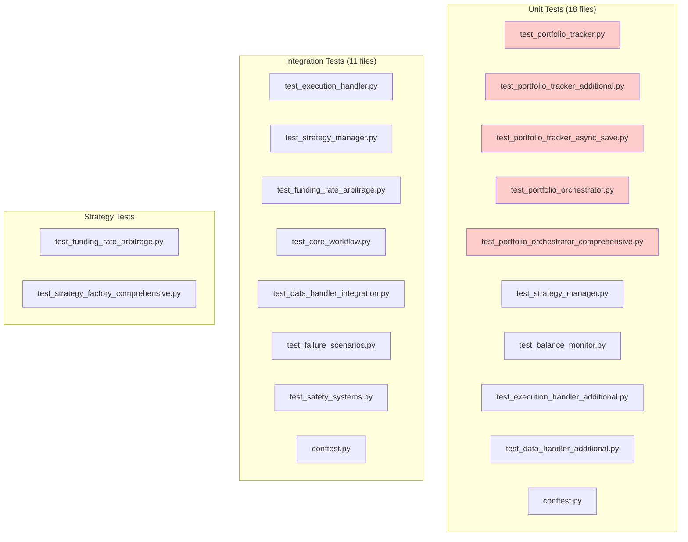

# Week 11: Test Suite and Non-Core Component Migration

**Duration:** Week 11 (2025-09-22 to 2025-09-28)
**Approach:** Systematic Test and Non-Core Migration
**Priority:** High
**Objective:** Complete the portfolio tracker migration by updating all tests and non-core components

## Overview

Following the successful core production migration in Week 3, Week 11 addresses the remaining legacy dependencies in test suites and non-core components. This phase ensures complete removal of PortfolioTracker and PortfolioOrchestrator references throughout the entire codebase.

**Current State:**
- **Core production code:** ✅ Fully migrated (Week 3)
- **Test files:** ❌ 29 files still using legacy imports
- **Non-core components:** ❌ 4 files need updates
- **Main.py:** ❌ Application entry point needs update

## Remaining Legacy Dependencies

### Test Files (29 files)



### Non-Core Production Files (5 files)

```bash
# Production components still using legacy imports
cyberdelta/core/execution/synchronized_order_submission.py
cyberdelta/core/services/__init__.py
cyberdelta/strategies/factory/strategy_factory.py
cyberdelta/strategies/funding_rate_arbitrage.py
cyberdelta/validation/position_reconciliation.py
main.py
```

## Migration Strategy

### Phase 1: Test Infrastructure Updates

1. **Update Test Fixtures**
   ```python
   # BEFORE: Legacy fixture
   @pytest.fixture
   def portfolio_tracker():
       return PortfolioTracker(config)

   # AFTER: Modular fixture
   @pytest.fixture
   def portfolio_state_manager():
       factory = PortfolioServiceFactory()
       return factory.create_portfolio_state_manager()
   ```

2. **Update Mock Objects**
   ```python
   # BEFORE: Legacy mocks
   mock_portfolio = Mock(spec=PortfolioTracker)
   mock_portfolio.get_total_capital.return_value = Decimal("100000")

   # AFTER: Modular mocks
   mock_portfolio = Mock(spec=PortfolioStateManager)
   mock_state = PortfolioState(total_capital=Decimal("100000"))
   mock_portfolio.get_current_state.return_value = mock_state
   ```

### Phase 2: Test Categories

#### Category 1: Delete Legacy-Specific Tests
These tests are no longer needed:
- `test_portfolio_tracker.py` - Testing removed component
- `test_portfolio_tracker_additional.py` - Testing removed component
- `test_portfolio_tracker_async_save.py` - Testing removed component
- `test_portfolio_orchestrator.py` - Testing removed component
- `test_portfolio_orchestrator_comprehensive.py` - Testing removed component

#### Category 2: Update Integration Tests
These tests need API updates to use new interfaces:

```python
# Example: test_strategy_manager.py
# BEFORE
async def test_strategy_manager_integration(portfolio_tracker):
    strategy_manager = StrategyManager(
        config, execution_handler, portfolio_tracker, risk_manager, signal_queue
    )
    
# AFTER
async def test_strategy_manager_integration(portfolio_state_manager):
    strategy_manager = StrategyManager(
        config, execution_handler, portfolio_state_manager, risk_manager, signal_queue
    )
```

#### Category 3: Update Method Calls
Tests calling legacy methods need updates:

```python
# BEFORE: Direct method calls
capital = await portfolio_tracker.get_total_capital()
positions = portfolio_tracker.get_positions("hyperliquid")

# AFTER: Using modular system
state = await portfolio_state_manager.get_current_state()
capital = state.total_capital
positions = await portfolio_state_manager.get_positions(ExchangeName.HYPERLIQUID)
```

### Phase 3: Non-Core Component Updates

#### 1. synchronized_order_submission.py
```python
# Update constructor and usage
- from cyberdelta.core.portfolio_tracker import PortfolioTracker
+ from cyberdelta.core.portfolio.managers.portfolio_state_manager import PortfolioStateManager

class SynchronizedOrderSubmission:
-    def __init__(self, portfolio_tracker: PortfolioTracker, ...):
+    def __init__(self, portfolio_state_manager: PortfolioStateManager, ...):
```

#### 2. strategy_factory.py
```python
# Update factory method
def create_funding_rate_arbitrage(
    config: AppSettings,
-   portfolio_tracker: PortfolioTracker,
+   portfolio_state_manager: PortfolioStateManager,
    ...
) -> FundingRateArbitrage:
```

#### 3. funding_rate_arbitrage.py
```python
# Update strategy initialization
class FundingRateArbitrage(Strategy):
    def __init__(
        self,
-       portfolio_tracker: PortfolioTracker,
+       portfolio_state_manager: PortfolioStateManager,
        ...
    ):
```

#### 4. position_reconciliation.py
```python
# Update validation logic
class PositionReconciliation:
-   def __init__(self, portfolio_tracker: PortfolioTracker):
+   def __init__(self, portfolio_state_manager: PortfolioStateManager):
```

#### 5. main.py
```python
# Update application initialization
- from cyberdelta.core import PortfolioTracker
+ from cyberdelta.core import PortfolioStateManager

# In initialize_components()
- portfolio_tracker = PortfolioTracker(config)
+ service_factory = PortfolioServiceFactory()
+ portfolio_state_manager = service_factory.create_portfolio_state_manager()
```

## Implementation Plan

### Day 1-2: Test Infrastructure
- [ ] Update all test conftest.py files
- [ ] Create new test fixtures for modular system
- [ ] Update mock factories and utilities

### Day 3-4: Unit Test Updates
- [ ] Delete legacy-specific test files (5 files)
- [ ] Update remaining unit tests (13 files)
- [ ] Ensure all unit tests pass

### Day 5: Integration Test Updates  
- [ ] Update integration test fixtures
- [ ] Migrate integration tests to new API
- [ ] Verify end-to-end test scenarios

### Day 6: Non-Core Component Updates
- [ ] Update synchronized_order_submission.py
- [ ] Update strategy files (factory and implementation)
- [ ] Update position_reconciliation.py
- [ ] Update main.py application entry point

### Day 7: Final Validation
- [ ] Run complete test suite
- [ ] Verify no legacy imports remain
- [ ] Update documentation

## Testing Requirements

### Pre-Migration Checklist
```bash
# Capture current test coverage
pytest --cov=cyberdelta --cov-report=html
mv htmlcov htmlcov_before_migration

# Run all tests and save results
pytest -v > test_results_before.txt
```

### Post-Migration Validation
```bash
# Verify no legacy imports
rg "PortfolioTracker|PortfolioOrchestrator" --type py

# Run updated test suite
pytest -v

# Compare coverage
pytest --cov=cyberdelta --cov-report=html
diff htmlcov_before_migration htmlcov
```

## Migration Scripts

### Script 1: Update Test Imports
```python
#!/usr/bin/env python3
"""Update test file imports from legacy to modular system."""

import re
from pathlib import Path

def update_test_imports():
    """Update imports in test files."""
    
    replacements = {
        r"from cyberdelta\.core\.portfolio_tracker import PortfolioTracker":
            "from cyberdelta.core.portfolio.managers.portfolio_state_manager import PortfolioStateManager",
        r"from cyberdelta\.core import PortfolioTracker":
            "from cyberdelta.core import PortfolioStateManager",
        r"PortfolioTracker\(":
            "PortfolioStateManager(",
        r"portfolio_tracker: PortfolioTracker":
            "portfolio_state_manager: PortfolioStateManager",
    }
    
    test_dirs = [
        Path("tests/unit"),
        Path("tests/integration"),
    ]
    
    for test_dir in test_dirs:
        for py_file in test_dir.rglob("*.py"):
            content = py_file.read_text()
            original = content
            
            for pattern, replacement in replacements.items():
                content = re.sub(pattern, replacement, content)
            
            if content != original:
                py_file.write_text(content)
                print(f"Updated: {py_file}")

if __name__ == "__main__":
    update_test_imports()
```

### Script 2: Update Method Calls
```python
#!/usr/bin/env python3
"""Update method calls from legacy to modular patterns."""

import re
from pathlib import Path

def update_method_calls():
    """Update method call patterns in tests."""
    
    # Pattern replacements for method calls
    method_updates = {
        # Direct capital access
        r"await portfolio_tracker\.get_total_capital\(\)":
            "state = await portfolio_state_manager.get_current_state()\n    capital = state.total_capital",
        
        # Position queries
        r"portfolio_tracker\.get_positions\(([^)]+)\)":
            r"await portfolio_state_manager.get_positions(ExchangeName(\1))",
        
        # Balance queries
        r"portfolio_tracker\.get_exchange_balance\(([^,]+),\s*([^)]+)\)":
            r"balances = await portfolio_state_manager.get_balances(ExchangeName(\1))\n    balance = balances.get(\2)",
    }
    
    for py_file in Path("tests").rglob("*.py"):
        if py_file.is_file():
            content = py_file.read_text()
            original = content
            
            for pattern, replacement in method_updates.items():
                content = re.sub(pattern, replacement, content, flags=re.MULTILINE)
            
            if content != original:
                py_file.write_text(content)
                print(f"Updated method calls in: {py_file}")

if __name__ == "__main__":
    update_method_calls()
```

## Risk Mitigation

### Potential Issues
1. **Test Coverage Drop**
   - Risk: Removing legacy tests might reduce coverage
   - Mitigation: Ensure new tests cover all functionality

2. **Mock Complexity**
   - Risk: New mocks might be more complex
   - Mitigation: Create helper functions for common mock patterns

3. **Async Migration**
   - Risk: Some tests might not handle async properly
   - Mitigation: Use pytest-asyncio consistently

### Rollback Plan
```bash
# If issues arise, tests can be temporarily disabled
# Mark failing tests with:
@pytest.mark.skip(reason="Pending portfolio migration")
```

## Success Metrics

### Quantitative Metrics
- [ ] **0 legacy imports** remaining in codebase
- [ ] **100% test pass rate** after migration
- [ ] **No coverage regression** (maintain >90%)
- [ ] **All CI/CD pipelines green**

### Qualitative Metrics
- [ ] **Cleaner test structure** with focused test files
- [ ] **Improved mock patterns** using modular interfaces
- [ ] **Better test maintainability** with service-oriented approach
- [ ] **Consistent async patterns** throughout tests

## Documentation Updates

### Required Documentation Changes
1. **Testing Guide** - Update examples to use new fixtures
2. **Developer Setup** - Update initialization examples
3. **API Reference** - Remove legacy class documentation
4. **Migration Guide** - Document changes for external users

## Conclusion

Week 11 completes the portfolio tracker migration by addressing all remaining dependencies in tests and non-core components. This systematic approach ensures:

- Complete removal of legacy code
- Maintained test coverage
- Clean, consistent codebase
- No production disruption

The migration from 3,335 lines of monolithic code to a clean, modular architecture will be fully complete, with all tests and supporting components aligned with the new system architecture.