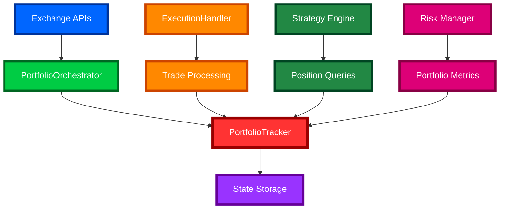
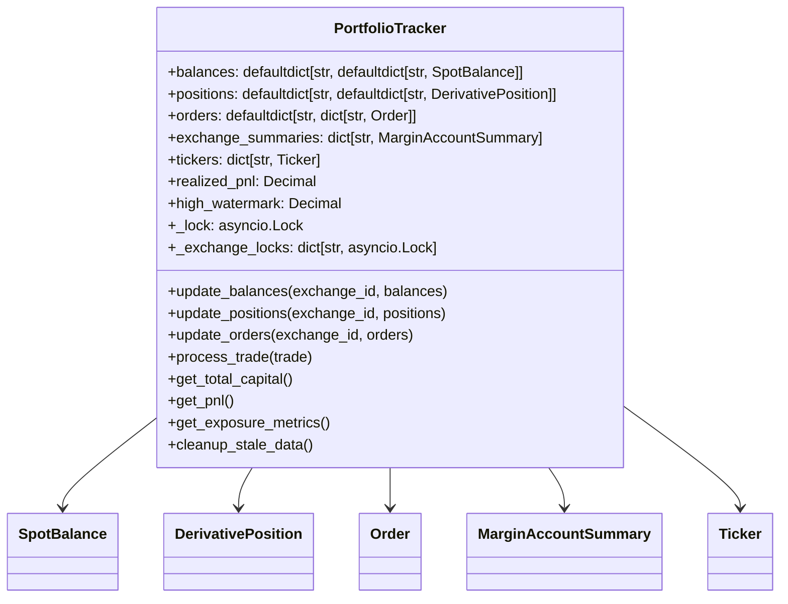
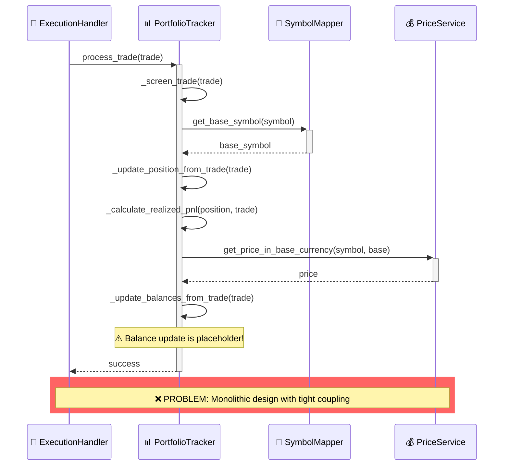
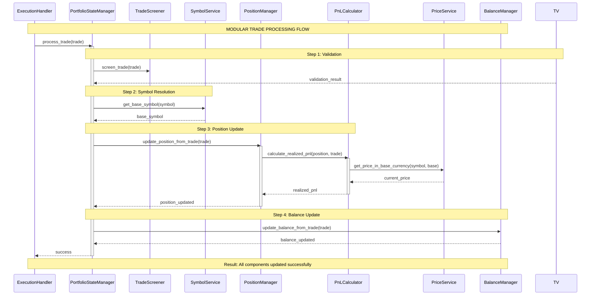
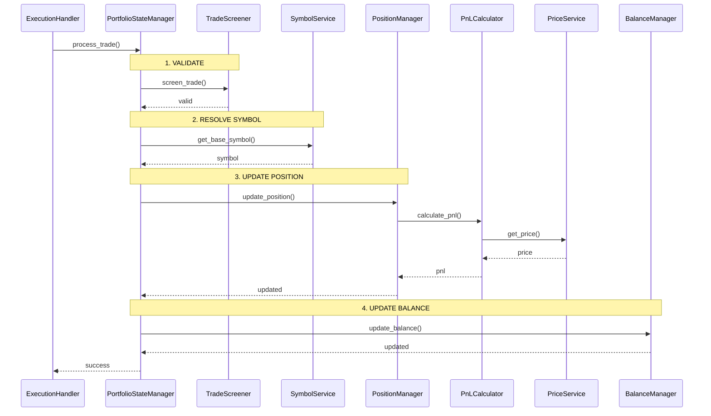

# PortfolioTracker Analysis & Next Steps Refactor Plan

## Executive Summary

This document presents a comprehensive analysis of the `PortfolioTracker` class in the CyberDeltaEngine project, identifying critical issues, architectural problems, and proposing a detailed refactoring plan to transform it into a more robust, modular, and maintainable system.

## Business Context

The `PortfolioTracker` is a critical component of the CyberDeltaEngine automated trading system that:
- Manages portfolio state across multiple exchanges (Hyperliquid, Backpack)
- Tracks positions, balances, and orders in real-time
- Calculates P&L, exposure metrics, and performance statistics
- Supports delta-neutral arbitrage strategies
- Handles financial precision using Decimal arithmetic

## Current Architecture Analysis

### System Data Flow


### Current PortfolioTracker Structure


## 1. Critical Problems Identified

### 1.1 Race Conditions and Concurrency Issues

**Problem**: Inconsistent locking strategy creates race conditions
- **Location**: Lines 115-117, 198-212, 325-337
- **Issue**: Mix of global `_lock` and per-exchange `_exchange_locks`
- **Impact**: Data corruption, deadlocks, inconsistent state

```python
# PROBLEM: Inconsistent locking
async def update_positions(self, exchange_id: str, positions: list[DerivativePosition]) -> None:
    async with self._lock:  # Global lock
        # ... update logic
        
async def update_orders(self, exchange_id: str, orders: list[Order]) -> None:
    async with self._get_exchange_lock(exchange_id):  # Exchange-specific lock
        # ... update logic
```

**Critical Risk**: In a multi-exchange environment, this could lead to:
- Deadlocks when multiple methods access the same exchange
- Race conditions between balance and position updates
- Inconsistent portfolio state during concurrent operations

### 1.2 Business Logic Flaws

**Problem**: Incorrect position size calculation for short positions
- **Location**: Lines 991-1002, 1039-1044
- **Issue**: Position sizing and PnL calculations are incorrect for short positions
- **Impact**: Incorrect P&L reporting, portfolio valuation errors

```python
# PROBLEM: Incorrect short position handling
if current_position.size < Decimal(0) and trade.side == OrderSide.SELL:
    new_avg_price = (
        (abs(current_position.size) * current_entry_price) + (trade.quantity * trade.price)
    ) / (abs(current_position.size) + trade.quantity)
    current_position.size -= trade.quantity  # WRONG: Should be more negative
```

**Critical Risk**: This could lead to:
- Incorrect position sizing for short positions
- Wrong P&L calculations affecting trading decisions
- Potential regulatory and financial reporting issues

### 1.3 Memory Leaks and Resource Management

**Problem**: Unbounded data structures and resource leaks
- **Location**: Lines 161-162, 2187-2189, 2485-2488
- **Issue**: Ticker cache grows without bounds, background tasks accumulate
- **Impact**: Memory exhaustion, system instability

```python
# PROBLEM: Unbounded ticker cache
self.tickers: dict[str, Ticker] = {}  # Grows without limits

# PROBLEM: Background task accumulation
task = asyncio.create_task(_do_parse())
self._background_tasks.add(task)  # May not be properly cleaned up
```

### 1.4 Incomplete Implementations

**Problem**: Critical functionality marked as placeholders
- **Location**: Lines 1124-1134, 2147-2157, 2317-2328
- **Issue**: Balance updates, position parsing, and state persistence not implemented
- **Impact**: System instability, data inconsistency

```python
# PROBLEM: Critical balance update not implemented
def _update_balances_from_trade(self, exchange_id: str, trade: Trade) -> None:
    # Placeholder for balance update logic based on trade details
    logger.debug("placeholder_balance_update_for_trade_method")
```

**Critical Risk**: This means:
- Balances don't update after trades
- Portfolio state becomes inconsistent
- Risk management calculations are incorrect

## 2. Tight Coupling Problems

### 2.1 External Service Dependencies

**High Coupling Areas**:
- **Symbol Mapping**: Heavy dependency on `SymbolMapper` for trade processing
- **Price Service**: Dependency on `PriceDataService` for P&L calculations
- **Configuration**: Tight coupling to `AppSettings` and `PortfolioTrackerConfig`
- **Data Models**: Strong dependency on core data models

```python
# PROBLEM: Hard dependency on SymbolMapper
if not hasattr(self, "symbol_mapper") or self.symbol_mapper is None:
    # Unsafe fallback that could crash
    base_symbol = trade.symbol.split("-")[0].split("/")[0]
```

**Issues**:
- System breaks if `SymbolMapper` is unavailable
- Difficult to test in isolation
- Violates dependency inversion principle

### 2.2 Monolithic Design

**Problem**: Single class handles multiple responsibilities
- State management
- Data validation
- P&L calculations
- Memory management
- Trade processing
- Price conversions

**Impact**: Violates Single Responsibility Principle, hard to maintain and test

## 3. Improvement Opportunities

### 3.1 Performance Optimizations

**Current Bottlenecks**:
- **O(n²) complexity** in PnL calculations (lines 1436-1456)
- **Individual price lookups** for each asset (lines 1226-1283)
- **Inefficient ticker cleanup** with full sorting (lines 2571-2577)

**Improvements**:
- Batch price lookups
- Cache frequently accessed data
- Use more efficient data structures
- Implement lazy evaluation for expensive calculations

### 3.2 Error Handling Enhancement

**Current Issues**:
- Silent failures in decimal validation
- Incomplete arithmetic exception handling
- Inconsistent error responses

**Improvements**:
- Comprehensive error handling strategy
- Proper exception hierarchy
- Graceful degradation patterns
- Circuit breaker patterns for external dependencies

### 3.3 Memory Management

**Current Issues**:
- No automatic cleanup of stale data
- Unbounded data structure growth
- Resource leaks in background tasks

**Improvements**:
- Implement automatic cleanup mechanisms
- Add configurable retention policies
- Proper resource lifecycle management
- Memory usage monitoring and alerts

## 4. Modular Refactoring Plan

### 4.1 Proposed Architecture

```mermaid
graph TB
    subgraph PM ["🏛️ Portfolio Management Layer"]
        A[PortfolioStateManager] --> B[BalanceManager]
        A --> C[PositionManager]
        A --> D[OrderManager]
        A --> E[AccountSummaryManager]
    end
    
    subgraph CL ["🧮 Calculation Layer"]
        F[PnLCalculator] --> G[RealizedPnLCalculator]
        F --> H[UnrealizedPnLCalculator]
        I[ExposureCalculator]
        J[PortfolioMetricsCalculator]
    end
    
    subgraph IL ["⚙️ Infrastructure Layer"]
        K[PriceService]
        L[SymbolService]
        M[PersistenceService]
        N[CacheService]
    end
    
    subgraph SL ["🔍 Screening Layer"]
        O[TradeScreener]
        P[DataScreener]
        Q[BusinessRulesScreener]
    end
    
    A --> F
    A --> I
    A --> J
    
    B --> K
    C --> K
    F --> K
    
    A --> L
    O --> L
    
    A --> M
    A --> N
    
    style PM fill:#00aa00,stroke:#004400,stroke-width:5px,color:#ffffff
    style CL fill:#0066ff,stroke:#003399,stroke-width:5px,color:#ffffff
    style IL fill:#ff8800,stroke:#cc4400,stroke-width:5px,color:#ffffff
    style SL fill:#ff0066,stroke:#990033,stroke-width:5px,color:#ffffff
    
    style A fill:#00ff00,stroke:#006600,stroke-width:4px,color:#000000
    style B fill:#66ff66,stroke:#339933,stroke-width:3px,color:#000000
    style C fill:#66ff66,stroke:#339933,stroke-width:3px,color:#000000
    style D fill:#66ff66,stroke:#339933,stroke-width:3px,color:#000000
    style E fill:#66ff66,stroke:#339933,stroke-width:3px,color:#000000
    
    style F fill:#3399ff,stroke:#0066cc,stroke-width:4px,color:#ffffff
    style G fill:#66aaff,stroke:#3377cc,stroke-width:3px,color:#000000
    style H fill:#66aaff,stroke:#3377cc,stroke-width:3px,color:#000000
    style I fill:#66aaff,stroke:#3377cc,stroke-width:3px,color:#000000
    style J fill:#66aaff,stroke:#3377cc,stroke-width:3px,color:#000000
    
    style K fill:#ffaa00,stroke:#cc7700,stroke-width:4px,color:#000000
    style L fill:#ffcc66,stroke:#cc9933,stroke-width:3px,color:#000000
    style M fill:#ffcc66,stroke:#cc9933,stroke-width:3px,color:#000000
    style N fill:#ffcc66,stroke:#cc9933,stroke-width:3px,color:#000000
    
    style O fill:#ff3399,stroke:#cc0066,stroke-width:4px,color:#ffffff
    style P fill:#ff66aa,stroke:#cc3377,stroke-width:3px,color:#000000
    style Q fill:#ff66aa,stroke:#cc3377,stroke-width:3px,color:#000000
```



### 4.2 Component Breakdown

#### 4.2.1 Core State Management Components

**PortfolioStateManager**
- Orchestrates all portfolio operations
- Manages component lifecycle
- Handles cross-component synchronization

**BalanceManager**
- Manages spot balance state
- Handles balance updates and validation
- Provides balance query interface

**PositionManager**
- Manages derivative position state
- Handles position lifecycle (open, modify, close)
- Provides position query interface

**OrderManager**
- Manages order state
- Handles order lifecycle tracking
- Provides order query interface

#### 4.2.2 Calculation Components

**PnLCalculator**
- Coordinates P&L calculations
- Delegates to specialized calculators
- Handles currency conversions

**RealizedPnLCalculator**
- Calculates realized P&L from trades
- Handles position size changes
- Manages P&L aggregation

**UnrealizedPnLCalculator**
- Calculates unrealized P&L using current prices
- Handles mark-to-market calculations
- Manages price data dependencies

**ExposureCalculator**
- Calculates portfolio exposure metrics
- Handles risk calculations
- Provides exposure reporting

#### 4.2.3 Infrastructure Components

**PriceService**
- Abstracts price data access
- Handles price conversions
- Manages price caching

**SymbolService**
- Abstracts symbol mapping
- Handles symbol normalization
- Provides symbol metadata

**PersistenceService**
- Handles state persistence
- Manages data serialization
- Provides backup/restore functionality

**CacheService**
- Manages data caching
- Handles cache invalidation
- Provides performance optimization

### 4.3 Implementation Strategy

#### Phase 1: Extract Calculation Logic
```python
# 1. Extract PnL calculation logic
class PnLCalculator:
    def __init__(self, price_service: PriceService):
        self.price_service = price_service
        
    async def calculate_realized_pnl(self, position: DerivativePosition, trade: Trade) -> Decimal:
        # Move logic from _calculate_realized_pnl
        pass
        
    async def calculate_unrealized_pnl(self, position: DerivativePosition) -> Decimal:
        # Move logic from _calculate_position_unrealized_pnl
        pass

# 2. Extract position management logic
class PositionManager:
    def __init__(self, pnl_calculator: PnLCalculator):
        self.pnl_calculator = pnl_calculator
        self.positions: dict[str, dict[str, DerivativePosition]] = {}
        
    async def update_position_from_trade(self, trade: Trade) -> None:
        # Move logic from _update_position_from_trade
        pass
```

#### Phase 2: Extract Infrastructure Services
```python
# 1. Extract price service
class PriceService:
    def __init__(self, cache_service: CacheService):
        self.cache_service = cache_service
        
    async def get_price_in_base_currency(self, symbol: str, base_currency: str) -> Decimal:
        # Move logic from _get_asset_price_in_base
        pass

# 2. Extract symbol service
class SymbolService:
    def __init__(self, symbol_mapper: SymbolMapper):
        self.symbol_mapper = symbol_mapper
        
    def get_base_symbol(self, symbol: str) -> str:
        # Move logic from _get_base_symbol
        pass
```

#### Phase 3: Create Orchestrating Manager
```python
class PortfolioStateManager:
    def __init__(
        self,
        balance_manager: BalanceManager,
        position_manager: PositionManager,
        order_manager: OrderManager,
        pnl_calculator: PnLCalculator,
        exposure_calculator: ExposureCalculator,
    ):
        self.balance_manager = balance_manager
        self.position_manager = position_manager
        self.order_manager = order_manager
        self.pnl_calculator = pnl_calculator
        self.exposure_calculator = exposure_calculator
        
    async def process_trade(self, trade: Trade) -> None:
        # Orchestrate trade processing across components
        await self.position_manager.update_position_from_trade(trade)
        await self.balance_manager.update_balance_from_trade(trade)
        # ... coordinate other updates
```

## 5. Critical Failure Modes and Fixes

### 5.1 Data Corruption Scenarios

**Scenario 1: Race Condition in Position Updates**
- **Cause**: Concurrent trade processing without proper locking
- **Impact**: Incorrect position sizes, wrong P&L calculations
- **Fix**: Implement consistent locking strategy with exchange-specific locks

**Scenario 2: Memory Overflow**
- **Cause**: Unbounded ticker cache growth
- **Impact**: System crashes, out-of-memory errors
- **Fix**: Implement LRU cache with configurable size limits

**Scenario 3: Calculation Errors**
- **Cause**: Incorrect short position handling
- **Impact**: Wrong P&L, incorrect risk calculations
- **Fix**: Rewrite position calculation logic with proper testing

### 5.2 System Availability Issues

**Scenario 1: Deadlock in Multi-Exchange Operations**
- **Cause**: Inconsistent locking order
- **Impact**: System freeze, trading halted
- **Fix**: Implement ordered locking protocol

**Scenario 2: External Service Failures**
- **Cause**: Hard dependency on SymbolMapper/PriceService
- **Impact**: System crashes when services unavailable
- **Fix**: Implement circuit breaker pattern with fallback mechanisms

## 6. Detailed Implementation Plan

### Phase 1: Critical Bug Fixes (Week 1-2)

**Priority 1: Fix Race Conditions**
1. Implement consistent locking strategy
2. Fix position calculation logic
3. Add proper error handling

**Priority 2: Complete Missing Implementations**
1. Implement balance update logic
2. Add position parsing functionality
3. Complete state persistence

**Priority 3: Memory Management**
1. Implement ticker cache cleanup
2. Add background task management
3. Implement data retention policies

### Phase 2: Component Extraction (Week 3-4)

**Step 1: Extract Calculation Logic**
- Move P&L calculation to dedicated classes
- Extract exposure calculation logic
- Create portfolio metrics calculator

**Step 2: Extract Infrastructure Services**
- Create price service abstraction
- Extract symbol service
- Implement caching service

**Step 3: Create Manager Classes**
- Implement balance manager
- Create position manager
- Build order manager

### Phase 3: Integration and Testing (Week 5-6)

**Step 1: Create Orchestrating Manager**
- Build portfolio state manager
- Wire up all components
- Implement proper dependency injection

**Step 2: Comprehensive Testing**
- Unit tests for all components
- Integration tests for manager interactions
- Performance tests for bottlenecks
- Stress tests for concurrency

**Step 3: Performance Optimization**
- Implement batching for price lookups
- Add caching strategies
- Optimize data structures

### Phase 4: Production Readiness (Week 7-8)

**Step 1: Monitoring and Observability**
- Add performance metrics
- Implement health checks
- Create alerting mechanisms

**Step 2: Documentation and Migration**
- Update API documentation
- Create migration guide
- Implement backward compatibility

**Step 3: Deployment and Rollback Planning**
- Staged rollout plan
- Rollback procedures
- Production monitoring

## 7. Sequence Diagrams

### Current Trade Processing Flow


### Proposed Modular Trade Processing Flow (Readable Version)


### Simple Clean Version


## 8. Success Metrics

### 8.1 Technical Metrics
- **Zero data corruption incidents** in trade processing
- **< 100ms response time** for portfolio queries
- **< 10MB memory growth** per hour of operation
- **99.9% uptime** for portfolio tracking
- **100% test coverage** for financial calculations

### 8.2 Business Metrics
- **Accurate P&L calculations** within 0.01% tolerance
- **Real-time position updates** < 1 second latency
- **Multi-exchange support** with consistent state
- **Regulatory compliance** for financial reporting
- **Audit trail** for all portfolio changes

## 9. Risk Mitigation

### 9.1 Implementation Risks
- **Data migration complexity**: Implement thorough testing and rollback procedures
- **Performance degradation**: Benchmark before/after, optimize bottlenecks
- **Integration issues**: Staged rollout with feature flags
- **Regression bugs**: Comprehensive test suite with edge cases

### 9.2 Business Risks
- **Trading interruption**: Implement zero-downtime deployment
- **Financial losses**: Thorough testing of P&L calculations
- **Compliance issues**: Maintain audit trails and proper validation
- **System failures**: Implement circuit breakers and fallback mechanisms

## 10. Conclusion

The `PortfolioTracker` class requires significant refactoring to address critical race conditions, business logic flaws, and architectural issues. The proposed modular architecture will:

1. **Eliminate race conditions** through consistent locking
2. **Fix calculation errors** with proper testing
3. **Improve maintainability** through separation of concerns
4. **Enhance performance** through optimized data structures
5. **Increase reliability** through better error handling

The implementation should be done in phases with thorough testing at each stage to ensure system stability and data integrity. The modular design will make the system more testable, maintainable, and extensible for future enhancements.

**Critical Success Factors**:
- Executive sponsorship for the refactoring effort
- Dedicated team with trading domain expertise
- Comprehensive testing strategy
- Staged deployment with rollback capability
- Continuous monitoring and validation

This refactoring is essential for the long-term success and reliability of the CyberDeltaEngine trading system.

## 11. Comprehensive Module Structure Plan

### 11.1 Proposed Directory Structure

```
cyberdelta/
├── core/
│   ├── portfolio/                           # Portfolio management package
│   │   ├── __init__.py                      # Package exports
│   │   ├── managers/                        # Core state managers
│   │   │   ├── __init__.py
│   │   │   ├── base/                        # Base manager classes
│   │   │   │   ├── __init__.py
│   │   │   │   ├── base_manager.py          # AbstractPortfolioManager
│   │   │   │   ├── state_manager_protocol.py # Manager interface protocols
│   │   │   │   └── lifecycle_mixin.py       # Common lifecycle methods
│   │   │   ├── balance_manager.py           # SpotBalanceManager
│   │   │   ├── position_manager.py          # DerivativePositionManager
│   │   │   ├── order_manager.py             # OrderLifecycleManager
│   │   │   ├── account_summary_manager.py   # MarginAccountSummaryManager
│   │   │   └── portfolio_state_manager.py   # Main orchestrating manager
│   │   ├── calculators/                     # Financial calculation engines
│   │   │   ├── __init__.py
│   │   │   ├── base/                        # Base calculator classes
│   │   │   │   ├── __init__.py
│   │   │   │   ├── base_calculator.py       # AbstractCalculator
│   │   │   │   ├── calculator_protocol.py   # Calculator interfaces
│   │   │   │   └── calculation_context.py   # Calculation context objects
│   │   │   ├── pnl/                         # P&L calculation components
│   │   │   │   ├── __init__.py
│   │   │   │   ├── realized_pnl_calculator.py    # RealizedPnLCalculator
│   │   │   │   ├── unrealized_pnl_calculator.py  # UnrealizedPnLCalculator
│   │   │   │   ├── pnl_aggregator.py        # PnLAggregator
│   │   │   │   └── pnl_screener.py         # PnLScreener
│   │   │   ├── exposure/                    # Exposure calculation components
│   │   │   │   ├── __init__.py
│   │   │   │   ├── position_exposure_calculator.py    # PositionExposureCalculator
│   │   │   │   ├── portfolio_exposure_calculator.py   # PortfolioExposureCalculator
│   │   │   │   ├── currency_exposure_calculator.py    # CurrencyExposureCalculator
│   │   │   │   └── risk_exposure_calculator.py        # RiskExposureCalculator
│   │   │   ├── metrics/                     # Portfolio metrics calculators
│   │   │   │   ├── __init__.py
│   │   │   │   ├── performance_calculator.py         # PerformanceCalculator
│   │   │   │   ├── drawdown_calculator.py            # DrawdownCalculator
│   │   │   │   ├── sharpe_calculator.py              # SharpeRatioCalculator
│   │   │   │   └── volatility_calculator.py          # VolatilityCalculator
│   │   │   └── position/                    # Position-specific calculations
│   │   │       ├── __init__.py
│   │   │       ├── position_sizer.py        # PositionSizer
│   │   │       ├── average_price_calculator.py       # AveragePriceCalculator
│   │   │       └── position_merger.py       # PositionMerger
│   │   ├── services/                        # Infrastructure services
│   │   │   ├── __init__.py
│   │   │   ├── base/                        # Base service classes
│   │   │   │   ├── __init__.py
│   │   │   │   ├── base_service.py          # AbstractService
│   │   │   │   ├── service_protocol.py      # Service interfaces
│   │   │   │   └── async_service_mixin.py   # Async service utilities
│   │   │   ├── pricing/                     # Price data services
│   │   │   │   ├── __init__.py
│   │   │   │   ├── price_service.py         # PriceDataService
│   │   │   │   ├── price_cache_service.py   # PriceCacheService
│   │   │   │   ├── currency_converter.py    # CurrencyConverter
│   │   │   │   └── price_screener.py       # PriceScreener
│   │   │   ├── symbol/                      # Symbol management services
│   │   │   │   ├── __init__.py
│   │   │   │   ├── symbol_service.py        # SymbolNormalizationService
│   │   │   │   ├── symbol_mapper_service.py # SymbolMappingService
│   │   │   │   └── symbol_screener.py      # SymbolScreener
│   │   │   ├── persistence/                 # Data persistence services
│   │   │   │   ├── __init__.py
│   │   │   │   ├── state_persistence_service.py      # StatePersistenceService
│   │   │   │   ├── backup_service.py        # BackupService
│   │   │   │   ├── serialization_service.py # SerializationService
│   │   │   │   └── recovery_service.py      # RecoveryService
│   │   │   ├── cache/                       # Caching services
│   │   │   │   ├── __init__.py
│   │   │   │   ├── cache_service.py         # MemoryCacheService
│   │   │   │   ├── lru_cache_service.py     # LRUCacheService
│   │   │   │   ├── cache_invalidator.py     # CacheInvalidationService
│   │   │   │   └── cache_metrics.py         # CacheMetricsService
│   │   │   └── monitoring/                  # Monitoring and observability
│   │   │       ├── __init__.py
│   │   │       ├── performance_monitor.py   # PerformanceMonitor
│   │   │       ├── health_checker.py        # HealthChecker
│   │   │       ├── metrics_collector.py     # MetricsCollector
│   │   │       └── alerting_service.py      # AlertingService
│   │   ├── screening/                       # Data screening components
│   │   │   ├── __init__.py
│   │   │   ├── base/                        # Base screener classes
│   │   │   │   ├── __init__.py
│   │   │   │   ├── base_screener.py         # AbstractDataScreener
│   │   │   │   ├── screener_protocol.py     # Screener interfaces
│   │   │   │   └── screening_result.py      # ScreeningResult classes
│   │   │   ├── trade_screener.py            # TradeDataScreener
│   │   │   ├── position_screener.py         # PositionDataScreener
│   │   │   ├── balance_screener.py          # BalanceDataScreener
│   │   │   ├── order_screener.py            # OrderDataScreener
│   │   │   ├── financial_screener.py        # FinancialDataScreener
│   │   │   └── business_rules_screener.py   # BusinessRulesScreener
│   │   ├── events/                          # Event handling system
│   │   │   ├── __init__.py
│   │   │   ├── base/                        # Base event classes
│   │   │   │   ├── __init__.py
│   │   │   │   ├── base_event.py            # BasePortfolioEvent
│   │   │   │   ├── event_handler_protocol.py # Event handler interfaces
│   │   │   │   └── event_dispatcher.py      # EventDispatcher
│   │   │   ├── portfolio_events.py          # Portfolio-specific events
│   │   │   ├── trade_events.py              # Trade processing events
│   │   │   ├── balance_events.py            # Balance update events
│   │   │   ├── position_events.py           # Position change events
│   │   │   └── error_events.py              # Error and exception events
│   │   ├── state/                           # State management utilities
│   │   │   ├── __init__.py
│   │   │   ├── state_container.py           # StateContainer
│   │   │   ├── state_snapshot.py            # StateSnapshot
│   │   │   ├── state_diff.py                # StateDiff
│   │   │   ├── state_lock_manager.py        # StateLockManager
│   │   │   └── concurrency_manager.py       # ConcurrencyManager
│   │   ├── exceptions/                      # Portfolio-specific exceptions
│   │   │   ├── __init__.py
│   │   │   ├── base_exceptions.py           # Base portfolio exceptions
│   │   │   ├── calculation_exceptions.py    # P&L calculation errors
│   │   │   ├── validation_exceptions.py     # Data validation errors
│   │   │   ├── state_exceptions.py          # State management errors
│   │   │   └── service_exceptions.py        # Service layer errors
│   │   ├── config/                          # Portfolio configuration
│   │   │   ├── __init__.py
│   │   │   ├── portfolio_config.py          # PortfolioConfiguration
│   │   │   ├── calculation_config.py        # CalculationConfiguration
│   │   │   ├── cache_config.py              # CacheConfiguration
│   │   │   └── monitoring_config.py         # MonitoringConfiguration
│   │   └── types/                           # Type definitions and protocols
│   │       ├── __init__.py
│   │       ├── portfolio_types.py           # Portfolio-specific types
│   │       ├── calculation_types.py         # Calculation-related types
│   │       ├── manager_protocols.py         # Manager interface protocols
│   │       └── service_protocols.py         # Service interface protocols
│   └── portfolio_tracker.py                # Legacy compatibility wrapper
└── tests/
    └── unit/
        └── core/
            └── portfolio/                   # Mirror the portfolio package structure
                ├── __init__.py
                ├── managers/
                │   ├── __init__.py
                │   ├── test_balance_manager.py
                │   ├── test_position_manager.py
                │   ├── test_order_manager.py
                │   ├── test_account_summary_manager.py
                │   └── test_portfolio_state_manager.py
                ├── calculators/
                │   ├── __init__.py
                │   ├── pnl/
                │   │   ├── __init__.py
                │   │   ├── test_realized_pnl_calculator.py
                │   │   ├── test_unrealized_pnl_calculator.py
                │   │   └── test_pnl_aggregator.py
                │   ├── exposure/
                │   │   ├── __init__.py
                │   │   ├── test_position_exposure_calculator.py
                │   │   └── test_portfolio_exposure_calculator.py
                │   └── metrics/
                │       ├── __init__.py
                │       ├── test_performance_calculator.py
                │       └── test_drawdown_calculator.py
                ├── services/
                │   ├── __init__.py
                │   ├── pricing/
                │   │   ├── __init__.py
                │   │   ├── test_price_service.py
                │   │   └── test_currency_converter.py
                │   ├── persistence/
                │   │   ├── __init__.py
                │   │   └── test_state_persistence_service.py
                │   └── cache/
                │       ├── __init__.py
                │       └── test_cache_service.py
                ├── screening/
                │   ├── __init__.py
                │   ├── test_trade_screener.py
                │   ├── test_position_screener.py
                │   └── test_business_rules_screener.py
                └── integration/
                    ├── __init__.py
                    ├── test_portfolio_integration.py
                    ├── test_trade_processing_flow.py
                    └── test_concurrent_operations.py
```

### 11.2 Module Naming Conventions

#### 11.2.1 File Naming Conventions

**Managers**: `{domain}_manager.py`
- `balance_manager.py` - manages spot balances
- `position_manager.py` - manages derivative positions
- `order_manager.py` - manages order lifecycle
- `portfolio_state_manager.py` - orchestrates all managers

**Calculators**: `{calculation_type}_calculator.py`
- `realized_pnl_calculator.py` - calculates realized P&L
- `unrealized_pnl_calculator.py` - calculates unrealized P&L
- `exposure_calculator.py` - calculates position exposure
- `performance_calculator.py` - calculates performance metrics

**Services**: `{service_domain}_service.py`
- `price_service.py` - handles price data
- `symbol_service.py` - handles symbol normalization
- `cache_service.py` - handles caching operations
- `persistence_service.py` - handles state persistence

**Screeners**: `{screening_domain}_screener.py`
- `trade_screener.py` - screens trade data
- `position_screener.py` - screens position data
- `business_rules_screener.py` - screens business rules

#### 11.2.2 Class Naming Conventions

**Manager Classes**:
```python
class SpotBalanceManager(BasePortfolioManager[SpotBalance])
class DerivativePositionManager(BasePortfolioManager[DerivativePosition])
class OrderLifecycleManager(BasePortfolioManager[Order])
class MarginAccountSummaryManager(BasePortfolioManager[MarginAccountSummary])
class PortfolioStateManager  # Main orchestrator
```

**Calculator Classes**:
```python
class RealizedPnLCalculator(BaseCalculator[RealizedPnLResult])
class UnrealizedPnLCalculator(BaseCalculator[UnrealizedPnLResult])
class PositionExposureCalculator(BaseCalculator[ExposureResult])
class PortfolioExposureCalculator(BaseCalculator[PortfolioExposureResult])
class PerformanceCalculator(BaseCalculator[PerformanceMetrics])
class DrawdownCalculator(BaseCalculator[DrawdownMetrics])
```

**Service Classes**:
```python
class PriceDataService(BasePortfolioService)
class PriceCacheService(BasePortfolioService)
class CurrencyConverter(BasePortfolioService)
class SymbolNormalizationService(BasePortfolioService)
class StatePersistenceService(BasePortfolioService)
class MemoryCacheService(BasePortfolioService)
```

**Screener Classes**:
```python
class TradeDataScreener(BaseDataScreener[Trade])
class PositionDataScreener(BaseDataScreener[DerivativePosition])
class BalanceDataScreener(BaseDataScreener[SpotBalance])
class BusinessRulesScreener(BaseDataScreener[Any])
```

#### 11.2.3 Protocol and Interface Naming

**Manager Protocols**:
```python
class PortfolioManagerProtocol(Protocol[T])
class StateManagerProtocol(Protocol)
class LifecycleManagerProtocol(Protocol[T])
```

**Calculator Protocols**:
```python
class CalculatorProtocol(Protocol[T, R])
class PnLCalculatorProtocol(Protocol)
class ExposureCalculatorProtocol(Protocol)
class MetricsCalculatorProtocol(Protocol)
```

**Service Protocols**:
```python
class PortfolioServiceProtocol(Protocol)
class PriceServiceProtocol(Protocol)
class CacheServiceProtocol(Protocol[K, V])
class PersistenceServiceProtocol(Protocol)
```

**Screener Protocols**:
```python
class ScreenerProtocol(Protocol[T, R])
class DataScreenerProtocol(Protocol)
class BusinessRulesScreenerProtocol(Protocol)
class FinancialScreenerProtocol(Protocol)
```

### 11.3 Key Component Specifications

#### 11.3.1 Core Manager Classes

**PortfolioStateManager** (Main Orchestrator)
```python
class PortfolioStateManager:
    """
    Central orchestrator for all portfolio state operations.
    Coordinates between managers and ensures data consistency.
    """
    def __init__(
        self,
        balance_manager: SpotBalanceManager,
        position_manager: DerivativePositionManager,
        order_manager: OrderLifecycleManager,
        account_summary_manager: MarginAccountSummaryManager,
        pnl_calculator: RealizedPnLCalculator,
        exposure_calculator: PortfolioExposureCalculator,
        event_dispatcher: EventDispatcher,
        concurrency_manager: ConcurrencyManager,
    ) -> None: ...
    
    async def process_trade(self, trade: Trade) -> TradeProcessingResult: ...
    async def update_from_orchestrator(self, update_data: PortfolioUpdateData) -> None: ...
    async def get_portfolio_snapshot(self) -> PortfolioSnapshot: ...
    async def calculate_total_pnl(self) -> PnLResult: ...
    async def calculate_exposure_metrics(self) -> ExposureMetrics: ...
```

**SpotBalanceManager**
```python
class SpotBalanceManager(BasePortfolioManager[SpotBalance]):
    """
    Manages spot balance state across all exchanges.
    Handles balance updates, validation, and queries.
    """
    async def update_balances(
        self, 
        exchange_id: str, 
        balances: dict[str, SpotBalance]
    ) -> BalanceUpdateResult: ...
    
    async def get_balance(
        self, 
        exchange_id: str, 
        asset: str
    ) -> SpotBalance | None: ...
    
    async def get_total_balance_in_currency(
        self, 
        asset: str, 
        target_currency: str
    ) -> Decimal: ...
    
    async def update_balance_from_trade(
        self, 
        trade: Trade
    ) -> BalanceUpdateResult: ...
```

**DerivativePositionManager**
```python
class DerivativePositionManager(BasePortfolioManager[DerivativePosition]):
    """
    Manages derivative position state across all exchanges.
    Handles position lifecycle, updates, and calculations.
    """
    async def update_positions(
        self, 
        exchange_id: str, 
        positions: list[DerivativePosition]
    ) -> PositionUpdateResult: ...
    
    async def update_position_from_trade(
        self, 
        trade: Trade
    ) -> PositionUpdateResult: ...
    
    async def get_position(
        self, 
        exchange_id: str, 
        symbol: str
    ) -> DerivativePosition | None: ...
    
    async def get_positions_by_symbol(
        self, 
        symbol: str
    ) -> list[DerivativePosition]: ...
    
    async def calculate_net_position(
        self, 
        symbol: str
    ) -> NetPositionResult: ...
```

#### 11.3.2 Calculator Classes

**RealizedPnLCalculator**
```python
class RealizedPnLCalculator(BaseCalculator[RealizedPnLResult]):
    """
    Calculates realized P&L from trade executions.
    Handles FIFO, LIFO, and weighted average methods.
    """
    def __init__(
        self,
        price_service: PriceDataService,
        calculation_method: PnLCalculationMethod = PnLCalculationMethod.FIFO,
    ) -> None: ...
    
    async def calculate_from_trade(
        self, 
        position: DerivativePosition, 
        trade: Trade
    ) -> RealizedPnLResult: ...
    
    async def calculate_for_position_close(
        self, 
        position: DerivativePosition, 
        close_price: Decimal
    ) -> RealizedPnLResult: ...
```

**UnrealizedPnLCalculator**
```python
class UnrealizedPnLCalculator(BaseCalculator[UnrealizedPnLResult]):
    """
    Calculates unrealized P&L using current market prices.
    Handles mark-to-market calculations.
    """
    def __init__(
        self,
        price_service: PriceDataService,
        currency_converter: CurrencyConverter,
    ) -> None: ...
    
    async def calculate_for_position(
        self, 
        position: DerivativePosition,
        base_currency: str = "USD"
    ) -> UnrealizedPnLResult: ...
    
    async def calculate_for_portfolio(
        self, 
        positions: list[DerivativePosition],
        base_currency: str = "USD"
    ) -> PortfolioUnrealizedPnLResult: ...
```

#### 11.3.3 Service Classes

**PriceDataService**
```python
class PriceDataService(BasePortfolioService):
    """
    Manages price data access and conversions.
    Handles caching and price validation.
    """
    def __init__(
        self,
        cache_service: PriceCacheService,
        price_screener: PriceScreener,
        api_clients: dict[str, ExchangeAPI],
    ) -> None: ...
    
    async def get_current_price(
        self, 
        symbol: str, 
        exchange_id: str | None = None
    ) -> Decimal: ...
    
    async def get_price_in_currency(
        self, 
        symbol: str, 
        target_currency: str,
        exchange_id: str | None = None
    ) -> Decimal: ...
    
    async def batch_get_prices(
        self, 
        symbols: list[str],
        target_currency: str
    ) -> dict[str, Decimal]: ...
```

**CurrencyConverter**
```python
class CurrencyConverter(BasePortfolioService):
    """
    Handles currency conversions for portfolio calculations.
    Manages exchange rates and conversion caching.
    """
    def __init__(
        self,
        price_service: PriceDataService,
        cache_service: CacheServiceProtocol[str, Decimal],
    ) -> None: ...
    
    async def convert(
        self, 
        amount: Decimal, 
        from_currency: str, 
        to_currency: str
    ) -> Decimal: ...
    
    async def get_exchange_rate(
        self, 
        from_currency: str, 
        to_currency: str
    ) -> Decimal: ...
    
    async def batch_convert(
        self, 
        conversions: list[CurrencyConversion]
    ) -> list[Decimal]: ...
```

### 11.4 Integration Points

#### 11.4.1 Legacy Compatibility Layer

**portfolio_tracker.py** (Compatibility Wrapper)
```python
class PortfolioTracker:
    """
    Legacy compatibility wrapper for the old PortfolioTracker interface.
    Delegates to the new modular components while maintaining backward compatibility.
    """
    def __init__(
        self,
        app_settings: AppSettings,
        pt_config: PortfolioTrackerConfig,
        symbol_mapper: SymbolMapper | None = None,
    ) -> None:
        # Initialize new modular components
        self._state_manager = self._create_state_manager(app_settings, pt_config)
        self._legacy_adapter = LegacyPortfolioAdapter(self._state_manager)
    
    # Legacy method signatures maintained
    async def update_balances(self, exchange_id: str, balances: dict[str, SpotBalance]) -> None:
        return await self._legacy_adapter.update_balances(exchange_id, balances)
    
    async def process_trade(self, trade: Trade) -> None:
        return await self._legacy_adapter.process_trade(trade)
    
    async def get_total_capital(self, base_currency: str = "USD") -> Decimal:
        return await self._legacy_adapter.get_total_capital(base_currency)
```

#### 11.4.2 Factory and Dependency Injection

**portfolio_factory.py**
```python
class PortfolioComponentFactory:
    """
    Factory for creating and wiring portfolio components.
    Handles dependency injection and configuration.
    """
    @staticmethod
    def create_portfolio_state_manager(
        app_settings: AppSettings,
        pt_config: PortfolioTrackerConfig,
    ) -> PortfolioStateManager:
        # Create services
        cache_service = MemoryCacheService(config=pt_config.cache)
        price_service = PriceDataService(cache_service=cache_service)
        currency_converter = CurrencyConverter(price_service=price_service)
        
        # Create calculators
        realized_pnl_calc = RealizedPnLCalculator(price_service=price_service)
        unrealized_pnl_calc = UnrealizedPnLCalculator(
            price_service=price_service,
            currency_converter=currency_converter
        )
        
        # Create managers
        balance_manager = SpotBalanceManager(config=pt_config.balances)
        position_manager = DerivativePositionManager(config=pt_config.positions)
        order_manager = OrderLifecycleManager(config=pt_config.orders)
        
        # Create state manager
        return PortfolioStateManager(
            balance_manager=balance_manager,
            position_manager=position_manager,
            order_manager=order_manager,
            pnl_calculator=realized_pnl_calc,
            exposure_calculator=PortfolioExposureCalculator(),
            event_dispatcher=EventDispatcher(),
            concurrency_manager=ConcurrencyManager(),
        )
```

### 11.5 Migration Strategy

#### 11.5.1 Phase 1: Infrastructure Setup
1. Create new package structure
2. Implement base classes and protocols
3. Create factory and dependency injection
4. Set up testing framework

#### 11.5.2 Phase 2: Core Components
1. Implement manager classes
2. Implement calculator classes
3. Implement service classes
4. Create integration tests

#### 11.5.3 Phase 3: Legacy Integration
1. Create compatibility wrapper
2. Implement legacy adapter
3. Update main application
4. Run parallel systems for validation

#### 11.5.4 Phase 4: Full Migration
1. Switch to new system
2. Remove legacy code
3. Update documentation
4. Performance optimization

This comprehensive module structure provides a clear, maintainable, and extensible architecture for the portfolio management system, addressing all the identified issues while maintaining backward compatibility during migration.