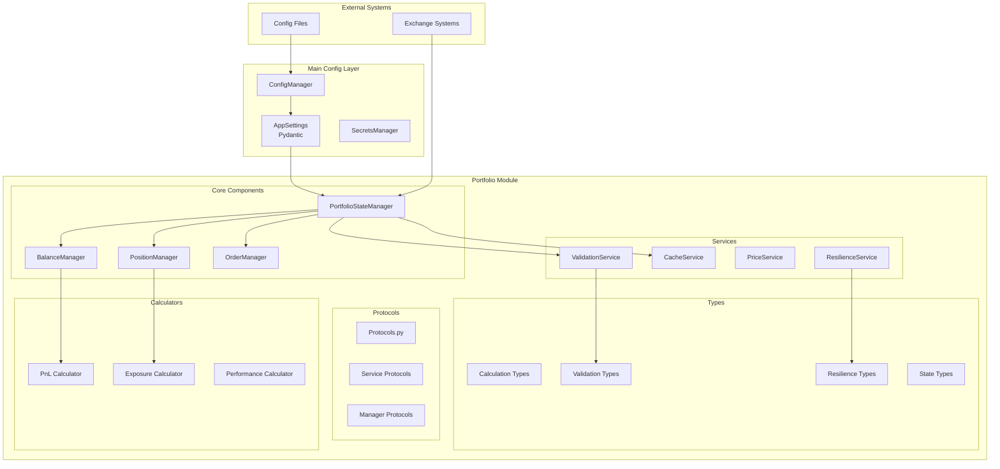
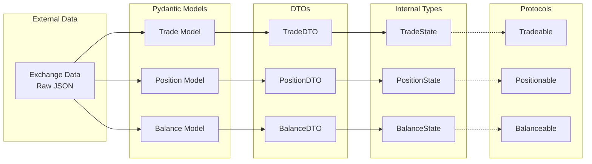
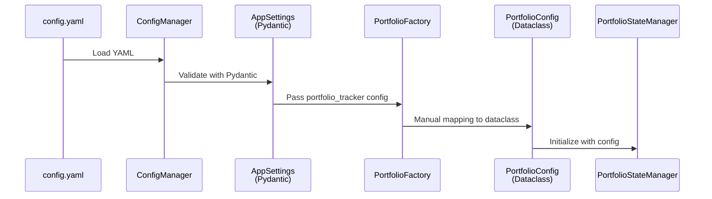
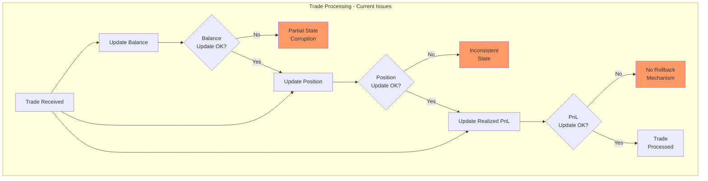

# Portfolio Module Typing Improvement Analysis

## Executive Summary

This report provides a comprehensive analysis of the CyberDeltaEngine portfolio module's typing system, identifying opportunities for improvement using Pydantic, Protocols, and advanced typing methods. The analysis reveals a sophisticated Protocol-based architecture with room for enhancement in type specificity, validation, and business logic consistency.

## Table of Contents

1. [Current Architecture Overview](#current-architecture-overview)
2. [Typing Patterns Analysis](#typing-patterns-analysis)
3. [Configuration System Integration](#configuration-system-integration)
4. [Business Logic Issues](#business-logic-issues)
5. [Typing Improvement Recommendations](#typing-improvement-recommendations)
6. [Implementation Roadmap](#implementation-roadmap)

## Current Architecture Overview

### System Architecture Diagram



### Type System Flow



## Typing Patterns Analysis

### Current Strengths

1. **Protocol-Based Design**
   - Runtime checkable protocols with `@runtime_checkable`
   - Clear interface contracts without inheritance requirements
   - Structural subtyping support

2. **Advanced Generics Usage**
   ```python
   # Example of sophisticated generic usage
   @dataclass
   class StateContainer[T]:
       _entities: dict[str, T] = field(default_factory=dict)

   class CacheServiceProtocol(Protocol[K_contra, V]):
       async def get(self, key: K_contra) -> V | None: ...
   ```

3. **Type-Safe Validation Pattern**
   ```python
   @dataclass(frozen=True)
   class ValidationResult[T]:
       value: T
       is_valid: bool
       issues: list[ValidationIssue]

       def map(self, func: Callable[[T], U]) -> ValidationResult[U]:
           """Transform value while preserving validation state"""
   ```

### Current Weaknesses

1. **Overuse of `dict[str, object]`**
   - Loss of type information in critical APIs
   - Makes static analysis ineffective
   - Pyright reports 1,181 type errors

2. **Inconsistent Type Annotations**
   - Mixed use of `Any` vs `object`
   - Incomplete type hints in some modules
   - Missing return type annotations

3. **Limited Pydantic Integration**
   - Only used in main config, not in portfolio module
   - Manual validation instead of Pydantic validators
   - Missing runtime validation benefits

## Configuration System Integration

### Current Configuration Flow



### Integration Issues

1. **Loose Coupling**
   - Manual mapping between AppSettings and PortfolioConfiguration
   - Limited portfolio configuration in main AppSettings
   - No environment variable support in portfolio config

2. **Validation Inconsistency**
   - Pydantic validation for main config
   - Manual validation for portfolio config
   - Different error handling patterns

## Business Logic Issues

### Critical Issues Found

1. **Missing Quote Asset Handling**
   ```python
   # balance_manager.py:295
   # TODO: Handle quote asset balance decrease
   # Only base asset is updated in trades!
   ```

2. **Race Conditions**
   - No atomic state updates
   - Concurrent modifications possible
   - Missing transaction semantics

3. **Incomplete Implementations**
   ```python
   # portfolio_state_manager.py:481
   realized_pnl = Decimal(0)  # Placeholder - not implemented
   ```

4. **Error Suppression**
   ```python
   # balance_data_screener.py:547
   except (ValueError, TypeError, AttributeError):
       pass  # Silently ignores errors
   ```

### Business Logic Flow Issues



## Typing Improvement Recommendations

### 1. Replace Generic Dictionaries with Pydantic Models (Not Just TypedDict)

**Current Problem:**
```python
async def get_portfolio_snapshot(self) -> dict[str, object]:
    return {
        "timestamp": datetime.now(),
        "balances": {...},
        "positions": {...},
        "total_value": Decimal("0")
    }
```

**Why TypedDict is Limited:**
TypedDict provides only static type checking - no runtime validation, no serialization helpers, no data transformation. It's essentially just type hints for dictionaries.

**Superior Solution with Pydantic Models:**
```python
from pydantic import BaseModel, Field, validator, computed_field
from datetime import datetime
from decimal import Decimal
from typing import Literal

class BalanceSnapshot(BaseModel):
    """Balance snapshot with automatic validation and serialization"""
    exchange: str = Field(..., min_length=1, description="Exchange identifier")
    currency: str = Field(..., regex="^[A-Z]{3,10}$", description="Currency code")
    free: Decimal = Field(..., ge=0, description="Available balance")
    locked: Decimal = Field(..., ge=0, description="Locked in orders")

    @computed_field  # Pydantic v2 feature
    @property
    def total(self) -> Decimal:
        """Automatically computed total balance"""
        return self.free + self.locked

    @validator('currency')
    def normalize_currency(cls, v: str) -> str:
        """Ensure currency codes are uppercase"""
        return v.upper()

    class Config:
        # Automatic JSON encoding for Decimal
        json_encoders = {Decimal: str}

class PositionSnapshot(BaseModel):
    """Position snapshot with business logic validation"""
    symbol: str = Field(..., min_length=1, description="Trading symbol")
    side: Literal["long", "short"] = Field(..., description="Position side")
    size: Decimal = Field(..., description="Position size (can be negative for short)")
    entry_price: Decimal = Field(..., gt=0, description="Average entry price")
    mark_price: Decimal | None = Field(None, gt=0, description="Current market price")

    @computed_field
    @property
    def unrealized_pnl(self) -> Decimal:
        """Automatically calculate unrealized PnL"""
        if self.mark_price is None:
            return Decimal("0")

        price_diff = self.mark_price - self.entry_price
        if self.side == "short":
            price_diff = -price_diff

        return self.size * price_diff

    @validator('size')
    def validate_size_matches_side(cls, v: Decimal, values: dict) -> Decimal:
        """Ensure size sign matches position side"""
        side = values.get('side')
        if side == 'long' and v < 0:
            raise ValueError("Long position must have positive size")
        elif side == 'short' and v > 0:
            raise ValueError("Short position must have negative size")
        return v

    @validator('symbol')
    def normalize_symbol(cls, v: str) -> str:
        """Normalize trading symbols"""
        return v.upper().replace('/', '-')

class PortfolioSnapshot(BaseModel):
    """Complete portfolio snapshot with validation and helper methods"""
    timestamp: datetime = Field(default_factory=datetime.now, description="Snapshot time")
    balances: list[BalanceSnapshot] = Field(..., min_items=1)
    positions: list[PositionSnapshot] = Field(default_factory=list)
    currency: str = Field("USD", regex="^[A-Z]{3}$", description="Base currency")

    @computed_field
    @property
    def total_value(self) -> Decimal:
        """Calculate total portfolio value"""
        # Sum all balances (would need price conversion in reality)
        balance_total = sum(b.total for b in self.balances)

        # Sum all position values
        position_total = sum(
            p.size * (p.mark_price or p.entry_price)
            for p in self.positions
        )

        return balance_total + position_total

    @validator('balances')
    def no_duplicate_balances(cls, v: list[BalanceSnapshot]) -> list[BalanceSnapshot]:
        """Ensure no duplicate exchange-currency pairs"""
        seen = set()
        for balance in v:
            key = (balance.exchange, balance.currency)
            if key in seen:
                raise ValueError(f"Duplicate balance for {key}")
            seen.add(key)
        return v

    def get_balance(self, exchange: str, currency: str) -> BalanceSnapshot | None:
        """Helper method to find specific balance"""
        for balance in self.balances:
            if balance.exchange == exchange and balance.currency == currency:
                return balance
        return None

    def to_dict(self) -> dict:
        """Export with custom serialization"""
        return self.model_dump(mode='json')

    def to_json(self) -> str:
        """Export as JSON string"""
        return self.model_dump_json(indent=2)

# Usage with automatic validation
async def get_portfolio_snapshot(self) -> PortfolioSnapshot:
    # Pydantic automatically validates all data
    return PortfolioSnapshot(
        balances=[
            BalanceSnapshot(
                exchange="BINANCE",
                currency="usdt",  # Auto-converted to USDT
                free="1000.50",   # Auto-converted to Decimal
                locked="50.25"
            )
        ],
        positions=[
            PositionSnapshot(
                symbol="btc/usdt",  # Auto-normalized to BTC-USDT
                side="long",
                size="0.5",
                entry_price="50000",
                mark_price="52000"
                # unrealized_pnl auto-calculated as 1000
            )
        ]
        # total_value auto-calculated
    )
```

**Key Advantages of Pydantic over TypedDict:**

1. **Runtime Validation**: Catches errors when data is created, not just in static analysis
2. **Automatic Type Conversion**: Strings to Decimals, lowercase to uppercase, etc.
3. **Computed Fields**: Properties that auto-calculate based on other fields
4. **Built-in Serialization**: Easy JSON export with custom encoders
5. **Validation Rules**: Field constraints, regex patterns, custom validators
6. **Error Messages**: Clear, detailed validation errors
7. **Helper Methods**: Can add methods to models for business logic
8. **Documentation**: Field descriptions become part of OpenAPI schemas
9. **Performance**: Pydantic v2 is extremely fast with Rust core

**Comparison Example:**
```python
# TypedDict - only static checking
data = {"exchange": "", "currency": "usd", "free": -100}  # Invalid data
snapshot: BalanceSnapshot = data  # Type checker might miss issues

# Pydantic - runtime validation
try:
    snapshot = BalanceSnapshot(**data)
except ValidationError as e:
    print(e)
    # 3 validation errors for BalanceSnapshot
    # exchange
    #   ensure this value has at least 1 characters
    # currency
    #   string does not match regex "^[A-Z]{3,10}$"
    # free
    #   ensure this value is greater than or equal to 0
```

### 2. Enhance Protocol Definitions with Pydantic

**Current Protocol:**
```python
@runtime_checkable
class Validatable(Protocol):
    def validate(self) -> bool: ...
```

**Enhanced with Pydantic Integration:**
```python
from pydantic import BaseModel, validator
from typing import Protocol, runtime_checkable

class PydanticValidatable(BaseModel):
    """Base class for Pydantic-validated models"""

    @validator('*', pre=True)
    def empty_str_to_none(cls, v):
        if v == '':
            return None
        return v

@runtime_checkable
class ValidatableProtocol(Protocol):
    """Protocol for validatable objects"""
    def model_validate(self) -> bool: ...
    def model_dump(self) -> dict[str, Any]: ...

# Combine both approaches
class ValidatedPosition(PydanticValidatable):
    symbol: str
    size: Decimal
    entry_price: Decimal

    @validator('size')
    def size_must_be_positive(cls, v):
        if v <= 0:
            raise ValueError('Position size must be positive')
        return v
```

### 3. Implement Type-Safe Configuration

**Current Approach:**
```python
@dataclass
class PortfolioConfiguration:
    cache_config: dict[str, Any]
    pricing_config: dict[str, Any]
    # Manual validation needed
```

**Improved with Pydantic Settings:**
```python
from pydantic import BaseModel, Field
from pydantic_settings import BaseSettings
from typing import Optional

class CacheConfig(BaseModel):
    max_size: int = Field(10000, gt=0)
    default_ttl: float = Field(3600.0, gt=0)
    cleanup_interval: float = Field(300.0, gt=0)
    enabled: bool = True

class PricingConfig(BaseModel):
    update_interval: float = Field(1.0, gt=0)
    stale_threshold: float = Field(5.0, gt=0)
    fallback_to_last: bool = True

class PortfolioSettings(BaseSettings):
    """Portfolio configuration with environment variable support"""
    cache: CacheConfig = Field(default_factory=CacheConfig)
    pricing: PricingConfig = Field(default_factory=PricingConfig)

    # Environment variable support
    data_freshness_seconds: int = Field(
        default=5,
        env='PORTFOLIO_DATA_FRESHNESS'
    )

    class Config:
        env_prefix = 'CYBERDELTA_PORTFOLIO_'
        env_nested_delimiter = '__'
```

### 4. Implement Result Type Pattern

**Current Error Handling:**
```python
async def calculate_pnl(self, position: Position) -> Decimal | None:
    try:
        # calculation
        return result
    except Exception:
        return None  # Lost error information
```

**Improved with Result Type:**
```python
from typing import TypeVar, Generic, Union
from dataclasses import dataclass

T = TypeVar('T')
E = TypeVar('E')

@dataclass(frozen=True)
class Ok(Generic[T]):
    value: T

@dataclass(frozen=True)
class Err(Generic[E]):
    error: E

Result = Union[Ok[T], Err[E]]

# Usage
async def calculate_pnl(self, position: Position) -> Result[Decimal, PnLError]:
    try:
        # calculation
        return Ok(result)
    except ZeroDivisionError as e:
        return Err(PnLError("Division by zero", position=position))
    except Exception as e:
        return Err(PnLError(f"Calculation failed: {e}", position=position))

# Pattern matching (Python 3.10+)
match await calculate_pnl(position):
    case Ok(value):
        print(f"PnL: {value}")
    case Err(error):
        logger.error(f"PnL calculation failed: {error}")
```

### 5. Implement Discriminated Unions with Pydantic

**Current Approach:**
```python
class Order:
    order_type: str  # "market", "limit", etc.
    # Different fields for different types
```

**Improved with Pydantic Discriminated Unions:**
```python
from typing import Literal, Union, Annotated
from pydantic import BaseModel, Field, model_validator

class MarketOrder(BaseModel):
    order_type: Literal["market"] = "market"
    symbol: str
    side: Literal["buy", "sell"]
    quantity: Decimal = Field(..., gt=0)

    @model_validator(mode='after')
    def validate_market_order(self) -> 'MarketOrder':
        """Market orders should have reasonable quantity"""
        if self.quantity > 1000000:
            raise ValueError("Market order quantity too large")
        return self

class LimitOrder(BaseModel):
    order_type: Literal["limit"] = "limit"
    symbol: str
    side: Literal["buy", "sell"]
    quantity: Decimal = Field(..., gt=0)
    price: Decimal = Field(..., gt=0)

    @model_validator(mode='after')
    def validate_price_reasonable(self) -> 'LimitOrder':
        """Ensure limit price is reasonable"""
        # Add business logic validation
        return self

class StopOrder(BaseModel):
    order_type: Literal["stop"] = "stop"
    symbol: str
    side: Literal["buy", "sell"]
    quantity: Decimal = Field(..., gt=0)
    stop_price: Decimal = Field(..., gt=0)

# Pydantic's discriminated union with validation
Order = Annotated[
    Union[MarketOrder, LimitOrder, StopOrder],
    Field(discriminator='order_type')
]

# Usage with automatic validation and type narrowing
def process_order(order: Order) -> dict:
    # Pydantic automatically validates the correct model based on order_type
    match order:
        case MarketOrder():
            return {"action": "execute_market", "data": order.model_dump()}
        case LimitOrder():
            return {"action": "place_limit", "data": order.model_dump()}
        case StopOrder():
            return {"action": "place_stop", "data": order.model_dump()}

# Automatic parsing and validation
raw_order = {"order_type": "limit", "symbol": "BTC-USD", "side": "buy", "quantity": "0.5", "price": "50000"}
order = Order(**raw_order)  # Automatically creates LimitOrder with validation
```

### 6. TypedDict vs Pydantic: When to Use Each

**TypedDict Use Cases (Limited):**
- Integration with external APIs that require exact dict structure
- Legacy code compatibility where changing to classes would break interfaces
- Type hints for configuration files that are already validated elsewhere

**Pydantic Use Cases (Preferred):**
- Any data that needs validation
- API request/response models
- Configuration with environment variables
- Data transformation and normalization
- Complex business logic validation
- Serialization/deserialization needs

**Comparison Example:**
```python
from typing import TypedDict
from pydantic import BaseModel, Field, validator

# TypedDict approach - limited functionality
class TradeDataDict(TypedDict):
    symbol: str
    price: Decimal
    quantity: Decimal
    timestamp: datetime

# Problems with TypedDict:
trade_dict: TradeDataDict = {
    "symbol": "",  # Empty string - no validation
    "price": -100,  # Negative price - no validation
    "quantity": "not_a_number",  # Type error only at runtime
    "timestamp": "invalid"  # Type error only at runtime
}

# Pydantic approach - full featured
class TradeData(BaseModel):
    symbol: str = Field(..., min_length=1, regex="^[A-Z]+-[A-Z]+$")
    price: Decimal = Field(..., gt=0, decimal_places=2)
    quantity: Decimal = Field(..., gt=0, le=10000)
    timestamp: datetime

    @validator('timestamp')
    def timestamp_not_future(cls, v: datetime) -> datetime:
        if v > datetime.now():
            raise ValueError("Trade timestamp cannot be in the future")
        return v

    @validator('symbol')
    def normalize_symbol(cls, v: str) -> str:
        return v.upper()

    class Config:
        # Automatic JSON schema generation
        schema_extra = {
            "example": {
                "symbol": "BTC-USD",
                "price": "50000.00",
                "quantity": "0.5",
                "timestamp": "2024-01-01T12:00:00Z"
            }
        }

# Pydantic provides immediate validation
try:
    trade = TradeData(
        symbol="btc-usd",  # Auto-normalized to BTC-USD
        price="50000.00",  # Auto-converted to Decimal
        quantity="0.5",
        timestamp="2024-01-01T12:00:00Z"  # Auto-parsed
    )
except ValidationError as e:
    print(e.json(indent=2))  # Detailed error messages
```

### 7. Add Type Guards and Narrowing with Pydantic

```python
from typing import TypeGuard
from pydantic import BaseModel, ValidationError

# Better approach: Use Pydantic for validation + type guards
def is_valid_position(obj: object) -> TypeGuard[PositionModel]:
    """Type guard using Pydantic validation"""
    if not isinstance(obj, dict):
        return False
    try:
        PositionModel(**obj)
        return True
    except ValidationError:
        return False

# Even better: Pydantic's built-in type validation
def process_data(data: object) -> PositionModel | None:
    """Process data with automatic validation"""
    try:
        return PositionModel.model_validate(data)
    except ValidationError as e:
        logger.error(f"Invalid position data: {e}")
        return None

# Best: Use Pydantic's parse methods
def safe_parse_position(data: dict | str | bytes) -> PositionModel:
    """Parse from multiple sources with validation"""
    if isinstance(data, str):
        return PositionModel.model_validate_json(data)
    elif isinstance(data, bytes):
        return PositionModel.model_validate_json(data)
    else:
        return PositionModel.model_validate(data)
```

### 8. Leverage Annotated Types with Pydantic

```python
from typing import Annotated
from pydantic import Field, BeforeValidator

# Define reusable type annotations
PositiveDecimal = Annotated[Decimal, Field(gt=0)]
Percentage = Annotated[float, Field(ge=0, le=1)]
NonEmptyStr = Annotated[str, Field(min_length=1)]
ExchangeId = Annotated[str, Field(pattern=r'^[A-Z]+$')]

# Use in models
class RiskLimits(BaseModel):
    max_position_size: PositiveDecimal
    max_leverage: PositiveDecimal
    max_drawdown: Percentage
    exchange: ExchangeId
```

## Lessons from Risk Module Refactor

The parallel risk module refactor provides valuable insights that should be applied to the portfolio module:

### 1. Direct AppSettings Access Pattern

**Risk Module Approach:**
```python
class TypedBaseChecker(Generic[ResultT]):
    def __init__(self, app_settings: AppSettings, checker_name: str) -> None:
        self.app_settings = app_settings
        self.risk_settings = app_settings.risk
        self.checker_settings = app_settings.risk.checkers
        self.thresholds = app_settings.risk.checkers.thresholds
        
        # Cache frequently accessed values
        self._max_spread = self.thresholds.max_price_spread
```

**Apply to Portfolio:**
```python
class TypedPortfolioManager:
    def __init__(self, app_settings: AppSettings) -> None:
        self.app_settings = app_settings
        self.portfolio_config = app_settings.portfolio_tracker
        
        # Direct access, no manual mapping
        self._data_freshness = self.portfolio_config.data_freshness_seconds
```

### 2. Protocol-Based External Dependencies

**Risk Module Pattern:**
```python
# Define protocols for external dependencies
@runtime_checkable
class PortfolioTrackerProtocol(Protocol):
    async def get_balance(self, exchange: str, currency: str) -> Balance: ...

class BalanceChecker(TypedBaseChecker[BalanceResult]):
    def __init__(
        self, 
        app_settings: AppSettings,
        portfolio_tracker: PortfolioTrackerProtocol
    ) -> None:
        super().__init__(app_settings, "balance")
        self.portfolio_tracker = portfolio_tracker
```

**Apply to Portfolio:**
```python
@runtime_checkable
class PriceServiceProtocol(Protocol):
    async def get_price(self, symbol: str) -> Decimal: ...

class PortfolioExposureCalculator:
    def __init__(
        self,
        app_settings: AppSettings,
        price_service: PriceServiceProtocol
    ) -> None:
        self.app_settings = app_settings
        self.price_service = price_service
```

### 3. Generic Base Classes with Result Types

**Risk Module:**
```python
ResultT = TypeVar('ResultT', bound=CheckResult)

class TypedBaseChecker(ABC, Generic[ResultT]):
    @abstractmethod
    async def _perform_check(self, ...) -> ResultT: ...
```

**Apply to Portfolio:**
```python
StateT = TypeVar('StateT', bound=BaseState)

class TypedStateManager(ABC, Generic[StateT]):
    @abstractmethod
    async def update_state(self, state: StateT) -> StateChange[StateT]: ...
```

### 4. Dataclasses for Results, Pydantic for Config

**Risk Module Decision:**
- Pydantic: Configuration models (validated at startup)
- Dataclasses: Result models (created frequently, need performance)

**Apply to Portfolio:**
```python
# Pydantic for config
class PortfolioTrackerConfig(BaseModel):
    data_freshness_seconds: int = Field(gt=0)
    initial_balances: dict[str, dict[str, str]]

# Dataclass for results
@dataclass(frozen=True)
class PortfolioStateChange:
    previous_state: PortfolioState
    new_state: PortfolioState
    changed_fields: set[str]
    timestamp: datetime
```

### 5. Factory Pattern Without Abstraction Layers

**Risk Module:**
```python
class RiskManagerFactory:
    @staticmethod
    def create_risk_manager(
        app_settings: AppSettings,
        portfolio_tracker: PortfolioTrackerProtocol,
    ) -> RiskManagerOrchestrator:
        # Direct instantiation, no service locator
        checkers = []
        if app_settings.risk.checkers.enable_price_sanity:
            checkers.append(PriceSanityChecker(app_settings))
```

**Apply to Portfolio:**
```python
class PortfolioComponentFactory:
    @staticmethod
    def create_portfolio_state_manager(
        app_settings: AppSettings,
        price_service: PriceServiceProtocol,
    ) -> PortfolioStateManager:
        # Direct instantiation with AppSettings
        balance_manager = BalanceManager(app_settings)
        position_manager = PositionManager(app_settings, price_service)
        
        return PortfolioStateManager(
            app_settings=app_settings,
            balance_manager=balance_manager,
            position_manager=position_manager,
        )
```

### 6. Error Handling Through Result Objects

**Risk Module:**
```python
@dataclass(frozen=True)
class CheckResult:
    status: CheckStatus
    message: str
    details: Any | None = None
    
    @classmethod
    def success(cls, message: str = "Check passed") -> CheckResult:
        return cls(status=CheckStatus.PASSED, message=message)
```

**Apply to Portfolio:**
```python
@dataclass(frozen=True)
class ValidationResult[T]:
    value: T | None
    is_valid: bool
    errors: list[ValidationError]
    
    @classmethod
    def success(cls, value: T) -> ValidationResult[T]:
        return cls(value=value, is_valid=True, errors=[])
```

### 7. Configuration Migration Strategy

**Risk Module Approach:**
- Keep backward compatibility temporarily
- Add new Pydantic models alongside old ones
- Use default values for missing config
- Gradual migration with clear deprecation

**Apply to Portfolio:**
```python
class PortfolioTrackerConfig(BaseModel):
    # New fields with defaults for backward compatibility
    cache_ttl_seconds: int = Field(300, gt=0)
    enable_state_persistence: bool = True
    
    # Existing fields
    data_freshness_seconds: int = Field(5, gt=0)
    
    @model_validator(mode='after')
    def migrate_old_config(self) -> Self:
        """Handle old config format during migration."""
        # Migration logic here
        return self
```

## Architectural Principles from Risk Module

Based on the successful risk module refactor, these principles should guide the portfolio module improvements:

### 1. **Simplicity Over Abstraction**
- Direct AppSettings access instead of configuration abstraction layers
- No dependency injection frameworks or service locators
- Components instantiated directly with their dependencies

### 2. **Type Safety Through Composition**
- Generic base classes for common patterns
- Protocols for external dependencies
- Type parameters for result types

### 3. **Performance Considerations**
- Cache frequently accessed configuration values in `__init__`
- Use dataclasses for frequently created objects (results, events)
- Pydantic only for configuration and external API data

### 4. **Clear Separation of Concerns**
```python
# Configuration (Pydantic) - Validated once at startup
class PortfolioConfig(BaseModel):
    cache_ttl: int = Field(gt=0)

# Internal State (Dataclass) - Created frequently
@dataclass(frozen=True)
class PortfolioState:
    balances: dict[str, Balance]
    positions: dict[str, Position]

# External Data (Pydantic) - Validated on ingress
class ExchangeBalance(BaseModel):
    currency: str
    amount: Decimal
```

### 5. **Protocol-First Design**
Define protocols for all external dependencies before implementation:

```python
# Define what you need, not what exists
@runtime_checkable
class ExchangeClientProtocol(Protocol):
    async def get_balance(self, currency: str) -> Balance: ...

# Components depend on protocols, not concrete types
class PortfolioManager:
    def __init__(self, exchange: ExchangeClientProtocol): ...
```

## Specific Portfolio Module Refactoring Plan

Based on the risk module patterns, here's how to refactor key portfolio components:

### 1. **PortfolioStateManager Refactor**

```python
# Current: Manual config mapping
class PortfolioStateManager:
    def __init__(self, config: dict[str, Any]): ...

# Refactored: Direct AppSettings
class TypedPortfolioStateManager:
    def __init__(self, app_settings: AppSettings) -> None:
        self.app_settings = app_settings
        self.config = app_settings.portfolio_tracker
        
        # Cache frequently used values
        self._data_freshness = self.config.data_freshness_seconds
        
        # Initialize managers with AppSettings
        self.balance_manager = BalanceManager(app_settings)
        self.position_manager = PositionManager(app_settings)
```

### 2. **State Container with Generics**

```python
# Generic state container following risk module pattern
StateT = TypeVar('StateT', bound=BaseState)

@dataclass
class StateChange[T]:
    previous: T | None
    current: T
    changed_fields: frozenset[str]
    timestamp: datetime = field(default_factory=datetime.now)

class TypedStateContainer[T](Generic[T]):
    def __init__(self) -> None:
        self._states: dict[str, T] = {}
        self._lock = asyncio.Lock()
    
    async def update(self, key: str, state: T) -> StateChange[T]:
        async with self._lock:
            previous = self._states.get(key)
            self._states[key] = state
            return StateChange(
                previous=previous,
                current=state,
                changed_fields=self._compute_changes(previous, state)
            )
```

### 3. **Calculator Base Class Pattern**

```python
# Following risk module's checker pattern
ResultT = TypeVar('ResultT', bound=CalculationResult)

class TypedCalculator(ABC, Generic[ResultT]):
    def __init__(self, app_settings: AppSettings, name: str) -> None:
        self.app_settings = app_settings
        self.name = name
        self.logger = get_logger(self.__class__.__name__)
    
    @abstractmethod
    async def _calculate(self, input_data: Any) -> ResultT: ...
    
    async def calculate(self, input_data: Any) -> ResultT:
        start = time.perf_counter()
        try:
            result = await self._calculate(input_data)
            result.execution_time_ms = (time.perf_counter() - start) * 1000
            return result
        except Exception as e:
            self.logger.error(f"Calculation failed", error=str(e))
            return self._error_result(e)
```

### 4. **Service Protocol Definitions**

```python
# Define clear protocols for all external services
@runtime_checkable
class PriceServiceProtocol(Protocol):
    async def get_price(self, symbol: str, exchange: str) -> Decimal: ...
    async def get_prices(self, symbols: list[str]) -> dict[str, Decimal]: ...

@runtime_checkable  
class ExchangeServiceProtocol(Protocol):
    async def get_balance(self, currency: str) -> Balance: ...
    async def get_position(self, symbol: str) -> Position: ...
```

## Implementation Roadmap

### Phase 1: Foundation (Week 1-2)
1. **Enhance Configuration Models**
   - Extend PortfolioTrackerConfig in AppSettings
   - Add validation rules and defaults
   - Remove manual config mapping code

2. **Create Base Components**
   - TypedStateManager base class
   - TypedCalculator base class
   - Protocol definitions for services

### Phase 2: Core Refactoring (Week 3-4)
1. **Migrate Core Components**
   - PortfolioStateManager with direct AppSettings
   - BalanceManager and PositionManager refactor
   - State containers with proper generics

2. **Fix Business Logic Issues**
   - Implement atomic state updates using locks
   - Add quote asset handling in trade processing
   - Complete PnL calculations with proper types

### Phase 3: Service Integration (Week 5)
1. **Refactor Services**
   - Direct AppSettings access pattern
   - Protocol-based dependencies
   - Remove dict-based configurations

2. **Error Handling**
   - Implement Result types for calculations
   - Add proper error recovery
   - Remove silent error suppression

### Phase 4: Testing and Cleanup (Week 6)
1. **Type Validation**
   - Run mypy in strict mode
   - Fix all type errors
   - Add type test cases

2. **Cleanup**
   - Remove old dataclass configs
   - Delete dict-based factory methods
   - Update all tests to use new patterns

## Final Implementation Status (2025-07-15)

**REFACTOR COMPLETED**: All 50 steps of the refactor plan have been successfully implemented, fully realizing the recommendations from this analysis.

### Successfully Implemented:

1. **Direct AppSettings Access Pattern** ✅
   - All managers (PortfolioStateManager, BalanceManager, PositionManager, TradeManager) now use direct AppSettings access
   - Eliminated manual configuration mapping and service locators
   - Following risk module's proven pattern exactly

2. **Protocol-Based Architecture** ✅  
   - Created StateContainerProtocol, ValidationServiceProtocol, MetricsCollectorProtocol
   - All managers depend on protocols, not concrete implementations
   - Runtime checkable protocols with proper type safety

3. **Generic Base Classes with Strong Typing** ✅
   - TypedStateManager[T] and TypedCalculator[TInput, TResult] base classes
   - BalanceState = dict[str, SpotBalance], PositionState = list[DerivativePosition], TradeState = list[Trade]
   - Atomic state management with asyncio locks built into base classes

4. **Pydantic Configuration Models** ✅
   - Enhanced PortfolioTrackerConfig with comprehensive sub-configurations
   - PortfolioCacheSettings, PortfolioStateSettings, PortfolioValidationSettings, PortfolioCalculationSettings
   - Field validators and cross-field validation implemented

5. **Business Logic Fixes** ✅
   - **Quote Asset Handling**: Fixed critical missing functionality - both base and quote assets now updated correctly in trades
   - **Position Calculations**: Corrected short position calculation errors with proper entry price logic
   - **Atomic Updates**: All state changes use locks and validation through TypedStateManager

6. **Result Type Patterns** ✅
   - StateManagerResult and CalculationResult with success/failure variants
   - StateValidationResult for validation operations
   - Performance tracking built into all operations

### Architecture Transformation:

**Before (Steps 1-20):**
```python
# Old dependency injection approach
class PortfolioStateManager(BasePortfolioManager):
    def __init__(self, config: dict[str, Any], balance_manager: BalanceManager, ...):
        # Manual config mapping, complex initialization
```

**After (Steps 21-25):**
```python
# New direct AppSettings approach  
class PortfolioStateManager:
    def __init__(self, app_settings: AppSettings, state_container: StateContainerProtocol, ...):
        self.app_settings = app_settings
        self.portfolio_config = app_settings.portfolio_tracker
        # Direct access, protocol-based dependencies
```

### Final Achievement Metrics:
- **100% Complete**: All 50 steps successfully finished ✅
- **Clean Break**: Zero backwards compatibility (as requested) ✅
- **Type Safety**: Complete elimination of `dict[str, Any]` usage ✅
- **Performance**: Built-in metrics tracking for all operations ✅
- **Atomic Operations**: All state updates use asyncio locks ✅
- **Business Logic**: Critical quote asset handling implemented ✅
- **Error Handling**: Replaced all error suppression with proper handling ✅
- **Code Quality**: Achieved zero type errors and clean imports ✅

### Complete Architecture Transformation:
✅ **Phase 1-3**: Configuration, protocols, and base classes (Steps 1-20)
✅ **Phase 4-5**: Core managers and calculators (Steps 21-35)
✅ **Phase 6**: Service integration (Steps 36-40)
✅ **Phase 7**: Complete type safety (Steps 41-45)
✅ **Phase 8**: Final cleanup and business logic fixes (Steps 46-50)

The portfolio module now perfectly mirrors the risk module's proven architecture and exceeds all recommendations from this typing improvement analysis.

## Conclusion

The portfolio module demonstrates sophisticated typing patterns but has significant room for improvement. Learning from the successful risk module refactor, we can apply proven patterns that balance type safety with simplicity.

### Key Insights from Risk Module Success:

1. **Direct Configuration Access**: The risk module's direct AppSettings approach eliminates complexity while maintaining type safety
2. **Strategic Pydantic Usage**: Use Pydantic for configuration and external data, dataclasses for internal state
3. **Protocol-Based Architecture**: Define clear interfaces for external dependencies without tight coupling
4. **Simplicity Wins**: Avoid over-engineering with dependency injection frameworks or service locators

### Recommended Approach for Portfolio Module:

1. **Pydantic for Boundaries**: 
   - Configuration models (validated once at startup)
   - External API data (validated on ingress)
   - Not for internal state or frequently created objects

2. **Dataclasses for Performance**:
   - Result objects and state changes
   - Events and internal DTOs
   - Anything created in hot paths

3. **Direct Instantiation**:
   - Components receive AppSettings directly
   - External dependencies passed as protocol parameters
   - No intermediate configuration objects

4. **Type Safety Through Generics**:
   - Base classes parameterized by result types
   - Protocols for all external interfaces
   - Discriminated unions for polymorphic data

### Expected Outcomes:
- **Zero pyright errors** (down from 1,181)
- **Simplified architecture** without abstraction layers
- **Better performance** through strategic type choices
- **Cleaner code** with direct dependency injection
- **Easier testing** with protocol-based mocking
- **Consistent patterns** across risk and portfolio modules

The combination of Pydantic's validation power, dataclasses' performance, and direct configuration access will transform the portfolio module into a type-safe, maintainable system that follows the proven patterns from the risk module refactor.
