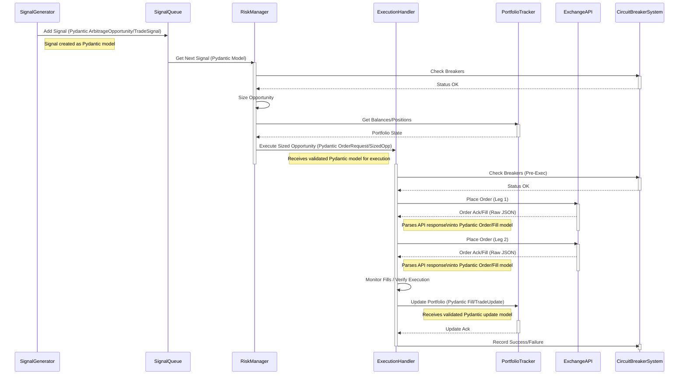

# Code Relationships (Enhanced for Pydantic Integration)

**Legend:** Notes indicate key boundaries where data structures should be defined and validated using Pydantic models *before* being processed by the receiving component.

## Core Components Overview

```mermaid
graph TD
    subgraph ApplicationEntry["Application Entry (main.py)"]
        Main[main.py]
    end

    subgraph UserSystem ["User/System"]
        ConfigFile[config.yaml] --> Main
        note right of ConfigFile: Validate loaded config.yaml\nusing Pydantic ConfigModel
        SecretsFile[secrets.yaml] --> Main
        note right of SecretsFile: Validate loaded secrets.yaml\nusing Pydantic SecretsModel
        InputData[Market Data]
        Output[Signals_Orders_Logs]
        Engine --> Output
    end

    subgraph CoreEngine
        Engine
        DataHandler[Data Handler (Parses to Pydantic Models)]
        StrategyManager
        SignalGenerator
        SignalQueue[Signal Queue (Processes Pydantic Signals)]
        RiskManager
        ExecutionHandler[Execution Handler (Accepts Pydantic Order Requests)]
        PortfolioTracker[Portfolio Tracker (Accepts Pydantic Fills/Updates)]
        BalanceMonitor
        StateManager[State Manager (Validates Loaded State w/ Pydantic)]
        Strategy(Strategy ABC)
        FundingRateArbitrageStrategy
        ArbitrageOpportunity[Arbitrage Opportunity (Pydantic Model)]
        SizedOpportunity[Sized Opportunity (Pydantic Model)]
        Balance[Balance (Pydantic Model)]
        Position[Position (Pydantic Model)]
        Order[Order (Pydantic Model)]
        MarketData[Market Data (Pydantic Model)]
        FundingRate[Funding Rate (Pydantic Model)]
    end
    note right of DataHandler: Validates ALL incoming API data\n(REST/WS) using Pydantic models\nbefore passing data internally.

    subgraph ExternalSystems
        APIs(Exchange APIs) --> DataHandler
        ValidationSystems[Validation Systems]
        MonitoringSystems[Monitoring Systems]
    end

    StateFile[engine_state.json] --> StateManager
    note right of StateFile: Validate loaded state.json\nusing Pydantic StateModel

    Main -- Creates_Configures --> StateManager
    Main -- Creates_Configures --> Config((load_config))
    Main -- Creates_Configures --> PortfolioTracker
    Main -- Creates_Configures --> ValidationSystems
    Main -- Creates_Configures --> ExecutionHandler
    Main -- Creates_Configures --> RiskManager
    Main -- Creates_Configures --> SignalQueue
    Main -- Creates_Configures --> Engine
    Main -- Creates_Configures --> DataHandler
    Main -- Creates_Uses --> APIs
    Main -- Creates_Configures --> FundingRateArbitrageStrategy

    Engine -- Gets_Data_Updates --> DataHandler
    Engine -- Manages --> StrategyManager
    Engine -- Sends_Signals --> SignalQueue
    note right of Engine: Forwards Pydantic TradeSignal model
    Engine -- Gets_State --> PortfolioTracker
    Engine -- Gets_State --> BalanceMonitor

    StrategyManager -- Manages --> Strategy
    FundingRateArbitrageStrategy --> Strategy

    DataHandler -- Notifies_Observer --> Engine
    note left of DataHandler: Sends Pydantic MarketData model
    DataHandler -- Subscribes_Fetches --> APIs
    DataHandler -- Provides_Data --> SignalGenerator

    SignalGenerator -- Uses_Data --> DataHandler
    SignalGenerator -- Generates --> ArbitrageOpportunity
    note right of SignalGenerator: Creates Pydantic ArbitrageOpportunity model
    SignalGenerator -- Enqueues_Signal --> SignalQueue

    SignalQueue -- Sends_Signal --> RiskManager
    note right of SignalQueue: Forwards Pydantic TradeSignal model

    RiskManager -- Sizes --> ArbitrageOpportunity
    RiskManager -- Creates --> SizedOpportunity
    note right of RiskManager: Creates Pydantic SizedOpportunity model
    RiskManager -- Gets_State --> PortfolioTracker
    RiskManager -- Sends_Order --> ExecutionHandler
    note left of ExecutionHandler: Receives Pydantic SizedOpportunity model
    RiskManager --> ValidationSystems

    ExecutionHandler -- Executes --> SizedOpportunity
    ExecutionHandler -- Updates_State --> PortfolioTracker
    note left of PortfolioTracker: Receives Pydantic Fill/TradeUpdate model
    ExecutionHandler -- Places_Orders --> APIs
    ExecutionHandler --> ValidationSystems

    PortfolioTracker -- Tracks --> Balance
    PortfolioTracker -- Tracks --> Position
    PortfolioTracker -- Tracks --> Order
    PortfolioTracker -- Fetches_Data --> APIs
    PortfolioTracker --> ValidationSystems
    PortfolioTracker -- Load_Save_State --> StateManager

    BalanceMonitor --> PortfolioTracker

    StateManager -- Handles --> StateFile

    Engine -- Reports_to --> MonitoringSystems

    FundingRateArbitrageStrategy -- Uses --> MarketData
    FundingRateArbitrageStrategy -- Uses --> FundingRate
```

## API Class Hierarchy

```mermaid
classDiagram
    direction LR

    note "Core Data Models (Ticker, OrderBook, Balance, etc.) should be Pydantic BaseModels for type safety and potential validation within API parsing logic."

    class Ticker
    class OrderBook
    class Balance
    class Position
    class Order
    class APIError
    class APIErrorCode

    class ExchangeAPI {
        <<Abstract>>
        +str exchange_name
        +connect() None
        +close() None
        +get_ticker(str) Ticker
        +get_order_book(str) OrderBook
        +get_balances() dict<str, Balance>
        +get_positions(str) list<Position>
        +place_order(...) Order
        +cancel_order(str) dict
        +get_open_orders(str) list<Order>
        #_request(str, str, ...)
        #_map_error_response(...) APIError
        #_authenticate(...)*
        #_sign_request(...)*
    }
    note left of ExchangeAPI: Concrete implementations parse responses\ninto Pydantic models (Ticker, OrderBook, etc.)\nHandle Pydantic ValidationErrors here.

    class BackpackAPI {
        +exchange_name = "Backpack"
        #_sign_request(...)
        #_map_error_response(...)
    }
    class HyperliquidAPI {
        +exchange_name = "Hyperliquid"
        #_authenticate(...)
        #_map_error_response(...)
    }

    ExchangeAPI <|-- BackpackAPI
    ExchangeAPI <|-- HyperliquidAPI
    ExchangeAPI ..> APIError : Creates_Uses
    APIError ..> APIErrorCode : Uses
    ExchangeAPI ..> Ticker : Returns
    ExchangeAPI ..> OrderBook : Returns
    ExchangeAPI ..> Balance : Returns
    ExchangeAPI ..> Position : Returns
    ExchangeAPI ..> Order : Returns_Uses
```

## Strategy Management

```mermaid
graph TD
    subgraph Core
        StrategyManager
        Engine
        SignalQueue[Signal Queue (Processes Pydantic Signals)]
        Strategy(Strategy ABC)
        FundingRateArbitrageStrategy
    end
    subgraph Data
         MarketData[Market Data (Pydantic Model)]
         FundingRate[Funding Rate (Pydantic Model)]
         Ticker[Ticker Data (Pydantic Model)]
    end
    subgraph Signals
        TradeSignal[Trade Signal (Pydantic Model)]
        ArbitrageOpportunity[Arbitrage Opportunity (Pydantic Model)]
    end

    StrategyManager --> Strategy
    Strategy --> TradeSignal
    note left of TradeSignal: Strategy outputs this Pydantic model
    StrategyManager -- Manages --> FundingRateArbitrageStrategy
    FundingRateArbitrageStrategy --> Strategy
    FundingRateArbitrageStrategy -- Uses --> MarketData
    FundingRateArbitrageStrategy -- Uses --> FundingRate
    FundingRateArbitrageStrategy -- Uses --> Ticker
    FundingRateArbitrageStrategy -- Creates --> ArbitrageOpportunity
    note right of ArbitrageOpportunity: Strategy outputs this Pydantic model
    FundingRateArbitrageStrategy -- Creates --> TradeSignal
    Engine -- Routes_MarketData --> StrategyManager
    note left of StrategyManager: Receives Pydantic MarketData
    StrategyManager -- Sends_Signals --> SignalQueue
    note right of SignalQueue: Receives Pydantic TradeSignal
```

## Opportunity Execution Data Flow (Simplified Sequence)



## Configuration Management

```mermaid
graph TD
    subgraph Input
        ConfigFile[config.yaml]
        SecretsFile[secrets.yaml]
        EnvVars[(Environment Variables)]
    end
    subgraph Processing
        Main[main.py]
        UtilConfig(utils.config.load_config)
        SecretsManager(config.SecretsManager)
    end
    subgraph OutputData
       ConfigObject((Config Data))
       note right of ConfigObject: Result of Pydantic validation\nagainst Config Schema
       SecretsObject((Secrets Data))
       note right of SecretsObject: Result of Pydantic validation\nagainst Secrets Schema
    end
    subgraph Consumers
        CoreComponent[Core Components]
    end

    Main -- Uses --> UtilConfig
    UtilConfig -- Creates --> ConfigObject
    note left of UtilConfig: Validates loaded YAML\nusing Pydantic ConfigModel here
    UtilConfig -- Reads --> ConfigFile
    UtilConfig -- Reads --> EnvVars

    Main -- Uses --> SecretsManager
    SecretsManager -- Loads --> SecretsFile
    note left of SecretsManager: Validates loaded YAML\nusing Pydantic SecretsModel here
    SecretsManager -- Reads --> EnvVars
    SecretsManager --> SecretsObject

    Main -- Gets_Data --> ConfigObject
    Main -- Gets_Data --> SecretsObject
    Main -- Provides_Config_Secrets --> CoreComponent
```

## Validation Systems

```mermaid
graph TD
    subgraph EntryConfig
        Main[main.py]
    end
    subgraph Validation
        CBS[CircuitBreakerSystem]
        PRS[PositionReconciliationSystem]
        FRV[FundingRateValidator]
        MTFP[MultiTierFundingProvider]
    end
    subgraph Core
       RM[RiskManager]
       EH[ExecutionHandler]
       PT[PortfolioTracker]
       SG[SignalGenerator]
       Engine
    end
    subgraph External
       ExchangeAPI(Exchange API)
    end

    note over Validation,Core: Pydantic models ensure data passed BETWEEN\n core components (e.g. to PT, RM)\n has expected structure, reducing validation logic needs\n within these components themselves.

    Main -- Creates_Configures --> CBS
    RM -- Check_Breakers --> CBS
    EH -- Check_Record_Breakers --> CBS
    RM -- Get_Validation_Factor --> FRV
    Engine -- Periodically_Runs --> PRS
    PRS -- Reads_Local_State --> PT
    PRS -- Reads_Exchange_State --> ExchangeAPI
    note right of ExchangeAPI: Response parsed into Pydantic Position model
    SG -- Get_Funding_Rate --> MTFP
    MTFP -- Records_Prediction_Payment --> FRV
    MTFP -- Fetch_Rates --> ExchangeAPI
    note right of ExchangeAPI: Response parsed into Pydantic FundingRate model
```

These enhanced diagrams should provide a clearer visual guide for where to focus the Pydantic refactoring effort, ensuring data validation occurs at critical boundaries and data structures used internally are well-defined.