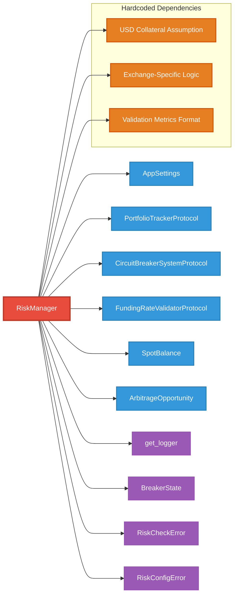
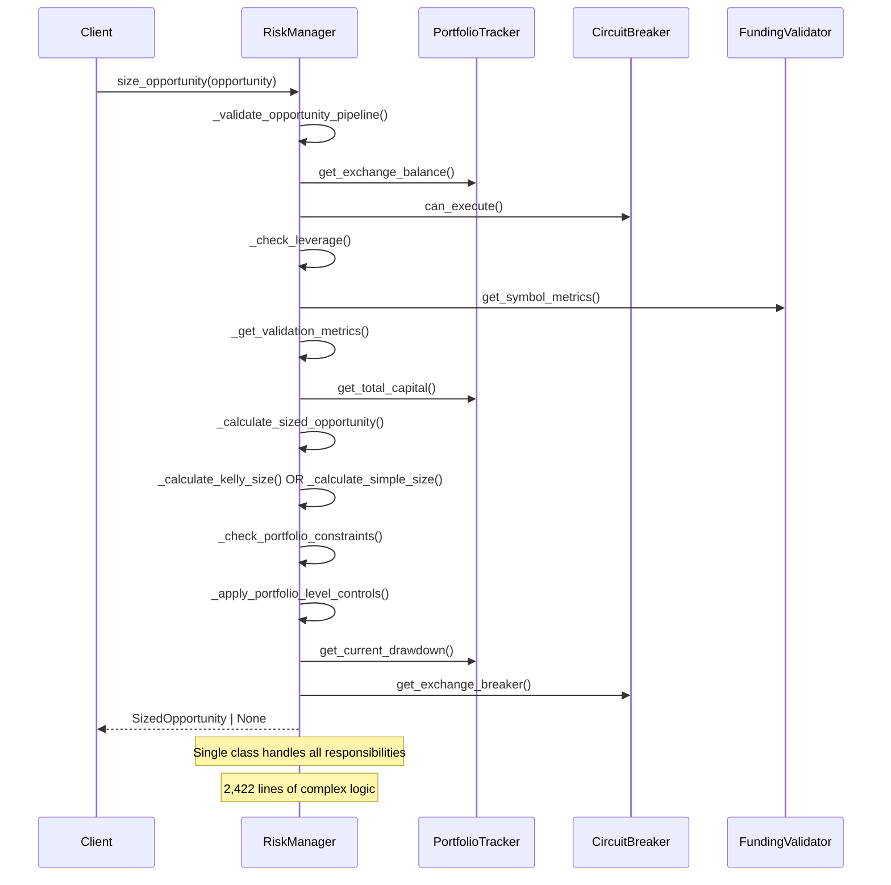
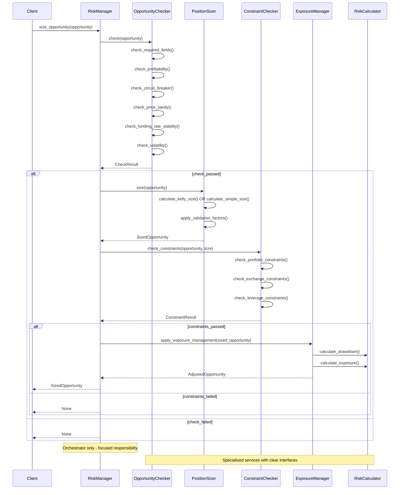
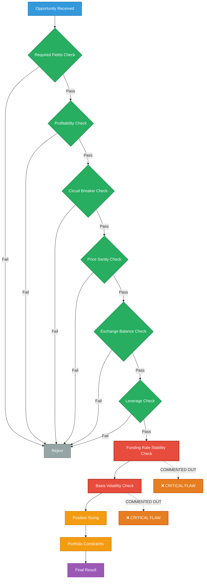
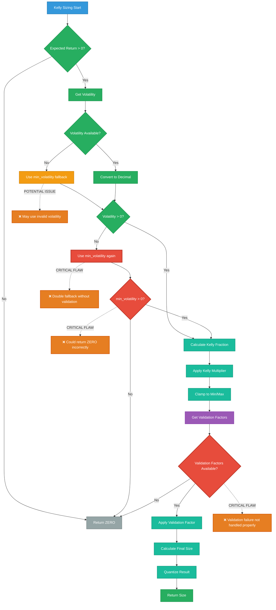
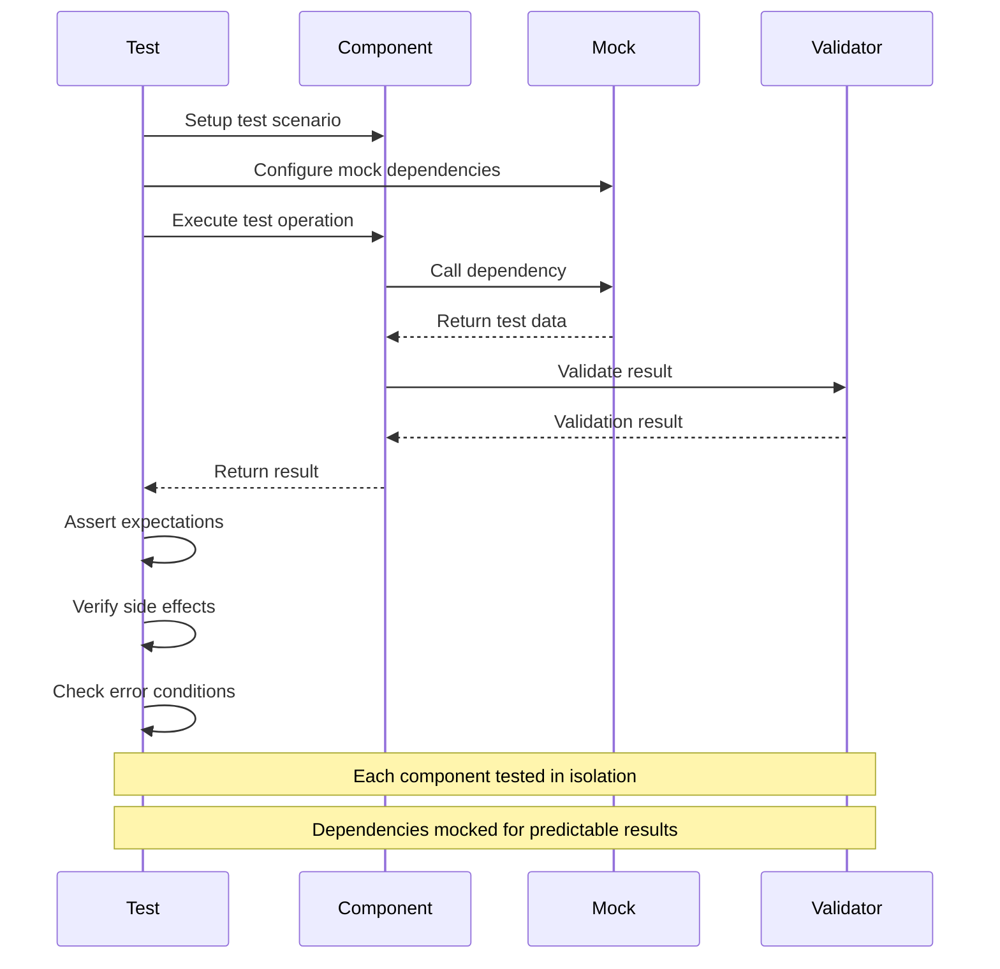

# Risk Manager Deep Code Analysis Report

**Date:** July 8, 2025  
**Author:** Claude Code  
**Target:** `cyberdelta/core/risk_manager.py`  
**Goal:** Comprehensive analysis for refactoring and improvement

## Executive Summary

The `RiskManager` class is a critical component of the CyberDeltaEngine with **significant architectural and implementation issues**. This 2,422-line monolithic class exhibits poor separation of concerns, tight coupling, and numerous business logic flaws that pose serious risks to a financial trading system.

**Critical Issues Found:**
- **Monolithic Design**: Single class handling 15+ distinct responsibilities
- **Tight Coupling**: Hard dependencies on multiple external systems
- **Business Logic Flaws**: Inconsistent validation, missing checks, and calculation errors
- **Poor Error Handling**: Inconsistent exception handling and logging
- **Configuration Management**: Hardcoded defaults and missing validation
- **Code Duplication**: Repeated validation logic and calculations

### Current System Overview

```mermaid
graph TD
    A[RiskManager - 2,422 lines] --> B[Opportunity Validation]
    A --> C[Position Sizing]
    A --> D[Portfolio Constraints]
    A --> E[Risk Calculations]
    A --> F[Circuit Breaker Integration]
    A --> G[Funding Rate Validation]
    A --> H[Exchange Balance Checks]
    A --> I[Leverage Calculations]
    A --> J[Drawdown Monitoring]
    A --> K[Exposure Management]
    
    B --> L[AppSettings]
    C --> M[PortfolioTracker]
    D --> N[CircuitBreakerSystem]
    E --> O[FundingRateValidator]
    F --> P[SpotBalance]
    G --> Q[ArbitrageOpportunity]
    
    style A fill:#e74c3c,stroke:#c0392b,stroke-width:3px,color:#fff
    style B fill:#f39c12,stroke:#d68910,stroke-width:2px,color:#fff
    style C fill:#f39c12,stroke:#d68910,stroke-width:2px,color:#fff
    style D fill:#f39c12,stroke:#d68910,stroke-width:2px,color:#fff
    style E fill:#f39c12,stroke:#d68910,stroke-width:2px,color:#fff
    style F fill:#f39c12,stroke:#d68910,stroke-width:2px,color:#fff
    style G fill:#f39c12,stroke:#d68910,stroke-width:2px,color:#fff
    style H fill:#f39c12,stroke:#d68910,stroke-width:2px,color:#fff
    style I fill:#f39c12,stroke:#d68910,stroke-width:2px,color:#fff
    style J fill:#f39c12,stroke:#d68910,stroke-width:2px,color:#fff
    style K fill:#f39c12,stroke:#d68910,stroke-width:2px,color:#fff
    style L fill:#95a5a6,stroke:#7f8c8d,stroke-width:1px,color:#2c3e50
    style M fill:#95a5a6,stroke:#7f8c8d,stroke-width:1px,color:#2c3e50
    style N fill:#95a5a6,stroke:#7f8c8d,stroke-width:1px,color:#2c3e50
    style O fill:#95a5a6,stroke:#7f8c8d,stroke-width:1px,color:#2c3e50
    style P fill:#95a5a6,stroke:#7f8c8d,stroke-width:1px,color:#2c3e50
    style Q fill:#95a5a6,stroke:#7f8c8d,stroke-width:1px,color:#2c3e50
```



## 1. Problems, Bugs, and Inconsistencies

### 1.1 Critical Business Logic Flaws

#### Validation Inconsistencies
- **File:** risk_manager.py:1443-1491
- **Issue:** `_validate_opportunity_pipeline` has commented-out checks for funding rate stability and basis volatility
- **Impact:** Critical risk factors are ignored during validation
- **Code:**
```python
# if not self._check_funding_rate_stability(opportunity): # COMMENTED OUT
# if not self._check_basis_volatility(opportunity): # COMMENTED OUT
```

#### Size Calculation Errors
- **File:** risk_manager.py:1298-1441
- **Issue:** Simple sizing method doesn't properly validate minimum trade sizes per exchange
- **Impact:** May accept trades below exchange-specific minimums
- **Code:**
```python
if size <= self.min_trade_size_usd:  # Uses global instead of per-exchange minimum
```

#### Kelly Criterion Implementation Flaws
- **File:** risk_manager.py:365-546
- **Issue:** Volatility handling allows fallback to potentially invalid values
- **Impact:** Position sizing could be based on incorrect volatility estimates
- **Code:**
```python
if volatility <= ZERO:
    volatility = self.min_volatility  # Fallback could still be invalid
```

### 1.2 Configuration Management Issues

#### Missing Validation
- **File:** risk_manager.py:300-363
- **Issue:** `_load_config` sets hardcoded defaults without validation
- **Impact:** System may operate with invalid configuration
- **Code:**
```python
self.min_trade_size_usd = Decimal("1.0")  # Hardcoded default
self.max_leverage = Decimal("5.0")  # No validation
```

#### Inconsistent Default Values
- **File:** risk_manager.py:341-348
- **Issue:** Kelly criterion defaults are set even when Kelly is disabled
- **Impact:** Confusing configuration state and potential logic errors

### 1.3 Error Handling Inconsistencies

#### Mixed Exception Types
- **File:** risk_manager.py:1443-1491
- **Issue:** Uses `RiskCheckError` for validation but `ValueError` for other failures
- **Impact:** Inconsistent error handling across the system

#### Logging Inconsistencies
- **File:** risk_manager.py:1764, 1934
- **Issue:** Mix of `self.logger` and global `logger` usage
- **Impact:** Inconsistent logging context and potential failures

### 1.4 Data Type and Precision Issues

#### Decimal Conversion Inconsistencies
- **File:** risk_manager.py:95-100, 1416-1417
- **Issue:** Redundant Decimal string conversion in SizedOpportunity constructor
- **Impact:** Performance overhead and potential precision loss

#### Float/Decimal Mixing
- **File:** risk_manager.py:326-329
- **Issue:** Exchange risk modifiers stored as float instead of Decimal
- **Impact:** Precision loss in financial calculations

## 2. Tight Coupling Problems

### 2.1 Current Dependency Structure



### 2.2 Direct Dependencies
The RiskManager is tightly coupled to:
- `AppSettings` (configuration structure)
- `PortfolioTrackerProtocol` (portfolio state)
- `CircuitBreakerSystemProtocol` (circuit breaker system)
- `FundingRateValidatorProtocol` (funding validation)
- `SpotBalance` (balance data structure)
- `ArbitrageOpportunity` (opportunity structure)

### 2.3 Implicit Dependencies
- **File:** risk_manager.py:869-873, 2209-2223
- **Issue:** Hardcoded assumptions about collateral assets being "USD"
- **Impact:** System cannot handle non-USD collateral without code changes

### 2.4 Protocol Violations
- **File:** risk_manager.py:1140-1254
- **Issue:** `_get_validation_metrics` assumes specific return format from protocol
- **Impact:** Brittle integration with funding rate validator

## 3. Improvement Opportunities

### 3.1 Architectural Improvements

#### Single Responsibility Principle
**Current State:** One class handles:
- Opportunity validation
- Position sizing (Kelly & Simple)
- Portfolio constraints
- Risk calculations
- Circuit breaker integration
- Funding rate validation
- Exchange balance checks
- Leverage calculations
- Drawdown monitoring
- Exposure management

**Proposed:** Split into focused services:
- `OpportunityChecker`
- `PositionSizer`
- `PortfolioConstraintChecker`
- `RiskCalculator`
- `ExposureManager`

#### Dependency Injection
**Current State:** Direct instantiation and tight coupling
**Proposed:** Constructor injection with interfaces

#### Configuration Management
**Current State:** Hardcoded defaults and mixed validation
**Proposed:** Centralized configuration with validation

### 3.2 Code Quality Improvements

#### Eliminate Code Duplication
- **File:** risk_manager.py:666-751, 2225-2310
- **Issue:** Duplicate balance checking logic
- **Solution:** Extract common balance validation

#### Improve Error Handling
- **File:** risk_manager.py:1443-1491
- **Issue:** Inconsistent exception types
- **Solution:** Standardize on domain-specific exceptions

#### Type Safety
- **File:** risk_manager.py:326-329
- **Issue:** Mixed float/Decimal types
- **Solution:** Consistent Decimal usage throughout

### 3.3 Performance Improvements

#### Async/Await Consistency
- **File:** risk_manager.py:1806-1862
- **Issue:** Inefficient sequential async operations
- **Solution:** Batch async operations where possible

#### Caching Opportunities
- **File:** risk_manager.py:1140-1254
- **Issue:** Repeated checking metric retrieval
- **Solution:** Cache checking results with TTL

## 4. Modular System Refactoring Strategy

### 4.1 Proposed Architecture

```mermaid
graph TD
    A[RiskManager - Orchestrator] --> B[OpportunityChecker]
    A --> C[PositionSizer]
    A --> D[ConstraintChecker]
    A --> E[ExposureManager]
    A --> F[RiskCalculator]
    
    B --> B1[RequiredFieldsChecker]
    B --> B2[ProfitabilityChecker]
    B --> B3[CircuitBreakerChecker]
    B --> B4[PriceSanityChecker]
    B --> B5[FundingRateChecker]
    B --> B6[VolatilityChecker]
    
    C --> C1[KellyCriterionSizer]
    C --> C2[SimpleSizer]
    C --> C3[ValidationFactorApplier]
    
    D --> D1[PortfolioConstraints]
    D --> D2[ExchangeConstraints]
    D --> D3[LeverageConstraints]
    D --> D4[MinimumSizeConstraints]
    
    E --> E1[PositionExposureCalculator]
    E --> E2[TotalExposureCalculator]
    E --> E3[ExposureLimitEnforcer]
    
    F --> F1[DrawdownCalculator]
    F --> F2[LiquidationRiskCalculator]
    F --> F3[MarginCalculator]
    
    style A fill:#27ae60,stroke:#229954,stroke-width:3px,color:#fff
    style B fill:#3498db,stroke:#2980b9,stroke-width:2px,color:#fff
    style C fill:#e74c3c,stroke:#c0392b,stroke-width:2px,color:#fff
    style D fill:#f39c12,stroke:#d68910,stroke-width:2px,color:#fff
    style E fill:#9b59b6,stroke:#8e44ad,stroke-width:2px,color:#fff
    style F fill:#1abc9c,stroke:#16a085,stroke-width:2px,color:#fff
    style B1 fill:#85c1e9,stroke:#5dade2,stroke-width:1px,color:#2c3e50
    style B2 fill:#85c1e9,stroke:#5dade2,stroke-width:1px,color:#2c3e50
    style B3 fill:#85c1e9,stroke:#5dade2,stroke-width:1px,color:#2c3e50
    style B4 fill:#85c1e9,stroke:#5dade2,stroke-width:1px,color:#2c3e50
    style B5 fill:#85c1e9,stroke:#5dade2,stroke-width:1px,color:#2c3e50
    style B6 fill:#85c1e9,stroke:#5dade2,stroke-width:1px,color:#2c3e50
    style C1 fill:#f1948a,stroke:#ec7063,stroke-width:1px,color:#fff
    style C2 fill:#f1948a,stroke:#ec7063,stroke-width:1px,color:#fff
    style C3 fill:#f1948a,stroke:#ec7063,stroke-width:1px,color:#fff
    style D1 fill:#f7dc6f,stroke:#f4d03f,stroke-width:1px,color:#2c3e50
    style D2 fill:#f7dc6f,stroke:#f4d03f,stroke-width:1px,color:#2c3e50
    style D3 fill:#f7dc6f,stroke:#f4d03f,stroke-width:1px,color:#2c3e50
    style D4 fill:#f7dc6f,stroke:#f4d03f,stroke-width:1px,color:#2c3e50
    style E1 fill:#bb8fce,stroke:#a569bd,stroke-width:1px,color:#fff
    style E2 fill:#bb8fce,stroke:#a569bd,stroke-width:1px,color:#fff
    style E3 fill:#bb8fce,stroke:#a569bd,stroke-width:1px,color:#fff
    style F1 fill:#7fb3d3,stroke:#5499c7,stroke-width:1px,color:#fff
    style F2 fill:#7fb3d3,stroke:#5499c7,stroke-width:1px,color:#fff
    style F3 fill:#7fb3d3,stroke:#5499c7,stroke-width:1px,color:#fff
```



#### Component Hierarchy
```
RiskManager (Orchestrator)
├── OpportunityChecker
│   ├── RequiredFieldsChecker
│   ├── ProfitabilityChecker
│   ├── CircuitBreakerChecker
│   ├── PriceSanityChecker
│   ├── FundingRateChecker
│   └── VolatilityChecker
├── PositionSizer
│   ├── KellyCriterionSizer
│   ├── SimpleSizer
│   └── ValidationFactorApplier
├── ConstraintChecker
│   ├── PortfolioConstraints
│   ├── ExchangeConstraints
│   ├── LeverageConstraints
│   └── MinimumSizeConstraints
├── ExposureManager
│   ├── PositionExposureCalculator
│   ├── TotalExposureCalculator
│   └── ExposureLimitEnforcer
└── RiskCalculator
    ├── DrawdownCalculator
    ├── LiquidationRiskCalculator
    └── MarginCalculator
```

### 4.2 Interface Definitions

#### Core Interfaces
```python
class OpportunityCheckerInterface(Protocol):
    async def check(self, opportunity: ArbitrageOpportunity) -> CheckResult
    
class PositionSizerInterface(Protocol):
    async def size(self, opportunity: ArbitrageOpportunity) -> SizedOpportunity | None
    
class ConstraintCheckerInterface(Protocol):
    async def check(self, opportunity: ArbitrageOpportunity, size: Decimal) -> ConstraintResult
```

### 4.3 Current vs Proposed Flow

#### Current Monolithic Flow


#### Proposed Modular Flow


### 4.4 Migration Strategy

#### Phase 1: Extract Checkers
1. Create `OpportunityChecker` class
2. Move checking methods
3. Update RiskManager to use checker
4. Add comprehensive tests

#### Phase 2: Extract Position Sizers
1. Create `PositionSizer` hierarchy
2. Move sizing logic
3. Update RiskManager integration
4. Add sizing-specific tests

#### Phase 3: Extract Constraint Checkers
1. Create `ConstraintChecker` services
2. Move constraint validation
3. Update RiskManager to use checkers
4. Add constraint-specific tests

#### Phase 4: Extract Calculators
1. Create calculation services
2. Move calculation logic
3. Update RiskManager to use calculators
4. Add calculation tests

## 5. Business Logic Flaws and Critical Failures

### 5.1 Critical Flow Issues



### 5.2 Critical Safety Issues

#### Missing Validation Checks
- **File:** risk_manager.py:1443-1491
- **Issue:** Commented-out funding rate stability and basis volatility checks
- **Risk:** HIGH - May accept dangerous trades without proper validation
- **Solution:** Implement proper funding rate stability validation

#### Inconsistent Minimum Trade Size
- **File:** risk_manager.py:1392-1400
- **Issue:** Uses global minimum instead of exchange-specific minimums
- **Risk:** MEDIUM - May violate exchange-specific requirements
- **Solution:** Implement per-exchange minimum validation

#### Leverage Calculation Errors
- **File:** risk_manager.py:847-859
- **Issue:** Potential division by zero in leverage calculation
- **Risk:** HIGH - Could cause system crash during risk assessment
- **Solution:** Add proper zero-capital handling

### 5.2 Configuration Vulnerabilities

#### Hardcoded Financial Parameters
- **File:** risk_manager.py:312-324
- **Issue:** Critical risk parameters hardcoded as defaults
- **Risk:** HIGH - System may operate with inappropriate risk limits
- **Solution:** Require explicit configuration validation

#### Missing Exchange-Specific Configuration
- **File:** risk_manager.py:2209-2223
- **Issue:** Hardcoded USD assumption for collateral
- **Risk:** MEDIUM - Cannot handle different collateral types
- **Solution:** Implement exchange-specific collateral configuration

### 5.3 Calculation Accuracy Issues

#### Volatility Fallback Logic
- **File:** risk_manager.py:423-444
- **Issue:** Multiple fallback layers without proper bounds checking
- **Risk:** MEDIUM - May use invalid volatility for position sizing
- **Solution:** Implement proper volatility validation

#### Validation Factor Application
- **File:** risk_manager.py:1364-1391
- **Issue:** Validation factor reduces size but doesn't validate result
- **Risk:** MEDIUM - May produce invalid position sizes
- **Solution:** Add post-validation size checks

### 5.4 Kelly Criterion Implementation Issues



## 6. Specific Recommendations

### 6.1 Immediate Actions (High Priority)

1. **Uncomment and Fix Validation Checks**
   - Implement `_check_funding_rate_stability`
   - Implement `_check_basis_volatility`
   - Add comprehensive validation pipeline

2. **Fix Leverage Calculation**
   - Add zero-capital protection
   - Implement proper error handling
   - Add validation for leverage limits

3. **Standardize Exception Handling**
   - Use consistent exception types
   - Add proper error context
   - Implement error recovery strategies

### 6.2 Short-term Improvements (Medium Priority)

1. **Extract Checking Logic**
   - Create separate checker classes
   - Implement check result objects
   - Add checking-specific tests

2. **Improve Configuration Management**
   - Add configuration validation
   - Remove hardcoded defaults
   - Implement configuration documentation

3. **Fix Data Type Inconsistencies**
   - Use Decimal throughout
   - Remove redundant conversions
   - Add type validation

### 6.3 Long-term Refactoring (Low Priority)

1. **Implement Modular Architecture**
   - Break down monolithic class
   - Create focused services
   - Implement dependency injection

2. **Add Comprehensive Testing**
   - Unit tests for each component
   - Integration tests for workflows
   - Property-based testing for calculations

3. **Performance Optimization**
   - Implement caching strategies
   - Optimize async operations
   - Add performance monitoring

## 7. Testing Strategy

### 7.1 Current Testing Gaps
- Limited checking testing
- No error condition testing
- Missing edge case coverage
- No performance testing

### 7.2 Comprehensive Testing Architecture

```mermaid
graph TD
    A[Testing Strategy] --> B[Unit Tests]
    A --> C[Integration Tests]
    A --> D[Property Tests]
    A --> E[Performance Tests]
    A --> F[Security Tests]
    
    B --> B1[OpportunityChecker Tests]
    B --> B2[PositionSizer Tests]
    B --> B3[ConstraintChecker Tests]
    B --> B4[ExposureManager Tests]
    B --> B5[RiskCalculator Tests]
    
    C --> C1[Component Interaction Tests]
    C --> C2[End-to-End Flow Tests]
    C --> C3[Error Handling Tests]
    
    D --> D1[Kelly Criterion Properties]
    D --> D2[Validation Factor Properties]
    D --> D3[Constraint Satisfaction Properties]
    
    E --> E1[Sizing Performance Tests]
    E --> E2[Checking Performance Tests]
    E --> E3[Memory Usage Tests]
    
    F --> F1[Input Checking Tests]
    F --> F2[Configuration Security Tests]
    F --> F3[Edge Case Attack Tests]
    
    style A fill:#27ae60,stroke:#229954,stroke-width:3px,color:#fff
    style B fill:#3498db,stroke:#2980b9,stroke-width:2px,color:#fff
    style C fill:#e74c3c,stroke:#c0392b,stroke-width:2px,color:#fff
    style D fill:#f39c12,stroke:#d68910,stroke-width:2px,color:#fff
    style E fill:#9b59b6,stroke:#8e44ad,stroke-width:2px,color:#fff
    style F fill:#1abc9c,stroke:#16a085,stroke-width:2px,color:#fff
    style B1 fill:#85c1e9,stroke:#5dade2,stroke-width:1px,color:#2c3e50
    style B2 fill:#85c1e9,stroke:#5dade2,stroke-width:1px,color:#2c3e50
    style B3 fill:#85c1e9,stroke:#5dade2,stroke-width:1px,color:#2c3e50
    style B4 fill:#85c1e9,stroke:#5dade2,stroke-width:1px,color:#2c3e50
    style B5 fill:#85c1e9,stroke:#5dade2,stroke-width:1px,color:#2c3e50
    style C1 fill:#f1948a,stroke:#ec7063,stroke-width:1px,color:#fff
    style C2 fill:#f1948a,stroke:#ec7063,stroke-width:1px,color:#fff
    style C3 fill:#f1948a,stroke:#ec7063,stroke-width:1px,color:#fff
    style D1 fill:#f7dc6f,stroke:#f4d03f,stroke-width:1px,color:#2c3e50
    style D2 fill:#f7dc6f,stroke:#f4d03f,stroke-width:1px,color:#2c3e50
    style D3 fill:#f7dc6f,stroke:#f4d03f,stroke-width:1px,color:#2c3e50
    style E1 fill:#bb8fce,stroke:#a569bd,stroke-width:1px,color:#fff
    style E2 fill:#bb8fce,stroke:#a569bd,stroke-width:1px,color:#fff
    style E3 fill:#bb8fce,stroke:#a569bd,stroke-width:1px,color:#fff
    style F1 fill:#7fb3d3,stroke:#5499c7,stroke-width:1px,color:#fff
    style F2 fill:#7fb3d3,stroke:#5499c7,stroke-width:1px,color:#fff
    style F3 fill:#7fb3d3,stroke:#5499c7,stroke-width:1px,color:#fff
```



### 7.3 Testing Flow for Critical Components



### 7.4 Recommended Testing Approach
1. **Unit Tests**: Each extracted component
2. **Integration Tests**: Component interactions
3. **Property Tests**: Mathematical calculations
4. **Performance Tests**: Sizing performance
5. **Security Tests**: Input validation

## 8. Conclusion

The `RiskManager` class requires **immediate attention** due to critical business logic flaws and architectural issues. The current implementation poses significant risks to the financial trading system, including:

- **Financial Risk**: Incorrect position sizing and validation
- **Operational Risk**: System crashes from unhandled edge cases
- **Compliance Risk**: Violation of exchange-specific requirements
- **Maintenance Risk**: Monolithic design impedes changes

**Recommended Priority:**
1. **Critical Fixes**: Address validation and calculation errors
2. **Architectural Refactoring**: Break down monolithic class
3. **Testing**: Comprehensive test coverage
4. **Documentation**: Improve code documentation and business logic explanation

The refactoring should follow the proposed modular architecture to create a more maintainable, testable, and reliable risk management system.