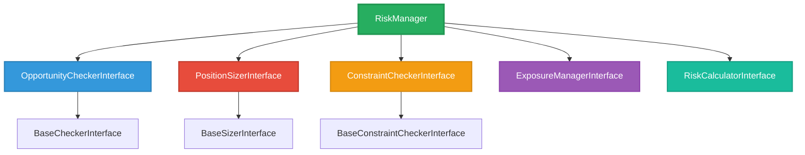

# Risk Manager Refactoring: Module Tree Plan

**Date:** July 8, 2025  
**Author:** Claude Code  
**Purpose:** Detailed module structure and naming conventions for risk manager refactoring

## Executive Summary

This document proposes a complete module-tree restructuring of the monolithic `RiskManager` class into a modular, maintainable architecture following Domain-Driven Design (DDD) principles and Python best practices.

## Current vs Proposed Structure

### Current Structure
```
cyberdelta/core/
├── risk_manager.py (2,422 lines - MONOLITHIC)
└── models/
    └── ... (various models)
```

### Proposed Structure
```
cyberdelta/core/risk/
├── __init__.py
├── orchestrator/
│   ├── __init__.py
│   ├── risk_manager.py                    # Main orchestrator (< 200 lines)
│   └── risk_manager_factory.py           # Factory for dependency injection
├── checks/
│   ├── __init__.py
│   ├── interfaces/
│   │   ├── __init__.py
│   │   └── check_interfaces.py           # Protocols and interfaces
│   ├── checkers/
│   │   ├── __init__.py
│   │   ├── base_checker.py               # Abstract base checker
│   │   ├── required_fields_checker.py    # Field presence checking
│   │   ├── profitability_checker.py      # Profitability checks
│   │   ├── circuit_breaker_checker.py    # Circuit breaker integration
│   │   ├── price_sanity_checker.py       # Price checking
│   │   ├── funding_rate_checker.py       # Funding rate stability
│   │   ├── volatility_checker.py         # Basis volatility checks
│   │   └── exchange_balance_checker.py   # Balance checking
│   ├── pipeline/
│   │   ├── __init__.py
│   │   ├── check_pipeline.py             # Orchestrates checking flow
│   │   └── check_context.py              # Context object for checking
│   └── models/
│       ├── __init__.py
│       ├── check_result.py               # Check result objects
│       └── check_error.py                # Check error types
├── sizing/
│   ├── __init__.py
│   ├── interfaces/
│   │   ├── __init__.py
│   │   └── sizing_interfaces.py          # Sizing protocols
│   ├── strategies/
│   │   ├── __init__.py
│   │   ├── base_sizer.py                 # Abstract base sizer
│   │   ├── kelly_criterion_sizer.py      # Kelly criterion implementation
│   │   ├── simple_sizer.py               # Simple sizing methods
│   │   └── adaptive_sizer.py             # Future: ML-based sizing
│   ├── calculators/
│   │   ├── __init__.py
│   │   ├── kelly_calculator.py           # Kelly formula calculations
│   │   ├── volatility_calculator.py      # Volatility calculations
│   │   └── validation_factor_applier.py  # Validation factor application
│   ├── models/
│   │   ├── __init__.py
│   │   ├── sizing_request.py             # Sizing request object
│   │   ├── sizing_result.py              # Sizing result object
│   │   └── sizing_parameters.py          # Sizing configuration
│   └── utils/
│       ├── __init__.py
│       └── sizing_utils.py               # Utility functions
├── constraints/
│   ├── __init__.py
│   ├── interfaces/
│   │   ├── __init__.py
│   │   └── constraint_interfaces.py      # Constraint protocols
│   ├── checkers/
│   │   ├── __init__.py
│   │   ├── base_constraint_checker.py    # Abstract base checker
│   │   ├── portfolio_constraint_checker.py # Portfolio-level constraints
│   │   ├── exchange_constraint_checker.py  # Exchange-specific constraints
│   │   ├── leverage_constraint_checker.py  # Leverage constraints
│   │   ├── position_size_constraint_checker.py # Position size limits
│   │   └── minimum_size_constraint_checker.py  # Minimum size validation
│   ├── models/
│   │   ├── __init__.py
│   │   ├── constraint_result.py          # Constraint check result
│   │   └── constraint_violation.py       # Constraint violation details
│   └── utils/
│       ├── __init__.py
│       └── constraint_utils.py           # Constraint utilities
├── exposure/
│   ├── __init__.py
│   ├── interfaces/
│   │   ├── __init__.py
│   │   └── exposure_interfaces.py        # Exposure management protocols
│   ├── calculators/
│   │   ├── __init__.py
│   │   ├── position_exposure_calculator.py # Individual position exposure
│   │   ├── total_exposure_calculator.py    # Total portfolio exposure
│   │   └── correlation_calculator.py       # Position correlation (future)
│   ├── managers/
│   │   ├── __init__.py
│   │   ├── exposure_manager.py           # Main exposure management
│   │   ├── exposure_limit_enforcer.py    # Exposure limit enforcement
│   │   └── diversification_manager.py    # Diversification rules (future)
│   ├── models/
│   │   ├── __init__.py
│   │   ├── exposure_calculation.py       # Exposure calculation result
│   │   └── exposure_limits.py            # Exposure limit configuration
│   └── utils/
│       ├── __init__.py
│       └── exposure_utils.py             # Exposure utilities
├── calculations/
│   ├── __init__.py
│   ├── interfaces/
│   │   ├── __init__.py
│   │   └── calculation_interfaces.py     # Calculation protocols
│   ├── calculators/
│   │   ├── __init__.py
│   │   ├── drawdown_calculator.py        # Drawdown calculations
│   │   ├── liquidation_risk_calculator.py # Liquidation risk assessment
│   │   ├── margin_calculator.py          # Margin calculations
│   │   ├── volatility_calculator.py      # Volatility calculations
│   │   └── correlation_calculator.py     # Correlation calculations
│   ├── models/
│   │   ├── __init__.py
│   │   ├── calculation_result.py         # Calculation result base
│   │   ├── risk_metrics.py               # Risk metrics container
│   │   └── financial_metrics.py          # Financial metrics
│   └── utils/
│       ├── __init__.py
│       └── calculation_utils.py          # Calculation utilities
├── config/
│   ├── __init__.py
│   ├── models/
│   │   ├── __init__.py
│   │   ├── risk_config.py                # Risk configuration models
│   │   ├── sizing_config.py              # Sizing configuration
│   │   ├── check_config.py               # Check configuration
│   │   └── constraint_config.py          # Constraint configuration
│   ├── validators/
│   │   ├── __init__.py
│   │   └── config_validator.py           # Configuration validation
│   └── defaults/
│       ├── __init__.py
│       └── default_config.py             # Default configuration values
├── exceptions/
│   ├── __init__.py
│   ├── base_exceptions.py                # Base risk exceptions
│   ├── check_exceptions.py               # Check-specific exceptions
│   ├── sizing_exceptions.py              # Sizing-specific exceptions
│   ├── constraint_exceptions.py          # Constraint-specific exceptions
│   └── calculation_exceptions.py         # Calculation-specific exceptions
├── models/
│   ├── __init__.py
│   ├── opportunity.py                    # Enhanced opportunity model
│   ├── sized_opportunity.py              # Sized opportunity model
│   ├── risk_assessment.py                # Risk assessment result
│   └── portfolio_state.py                # Portfolio state snapshot
└── utils/
    ├── __init__.py
    ├── decimal_utils.py                  # Decimal handling utilities
    ├── logging_utils.py                  # Risk-specific logging
    └── testing_utils.py                  # Testing utilities
```

## Module Details

### 1. Orchestrator Layer

#### `cyberdelta/core/risk/orchestrator/risk_manager.py`
```python
class RiskManager:
    """Main orchestrator for risk management operations.
    
    Coordinates validation, sizing, constraints, and exposure management.
    Lightweight orchestrator pattern - delegates to specialized services.
    """
    
    def __init__(
        self,
        checker: OpportunityCheckerInterface,
        sizer: PositionSizerInterface,
        constraint_checker: ConstraintCheckerInterface,
        exposure_manager: ExposureManagerInterface,
        calculator: RiskCalculatorInterface,
        config: RiskConfig,
    ) -> None: ...
    
    async def size_opportunity(
        self, 
        opportunity: ArbitrageOpportunity
    ) -> SizedOpportunity | None: ...
    
    async def check_opportunities(
        self,
        opportunities: list[ArbitrageOpportunity],
    ) -> list[SizedOpportunity]: ...
```

#### `cyberdelta/core/risk/orchestrator/risk_manager_factory.py`
```python
class RiskManagerFactory:
    """Factory for creating configured RiskManager instances."""
    
    @staticmethod
    def create_risk_manager(
        app_settings: AppSettings,
        portfolio_tracker: PortfolioTrackerProtocol,
        circuit_breaker_system: CircuitBreakerSystemProtocol | None = None,
        funding_rate_validator: FundingRateValidatorProtocol | None = None,
    ) -> RiskManager: ...
```

### 2. Checking Layer

#### `cyberdelta/core/risk/checks/interfaces/check_interfaces.py`
```python
class OpportunityCheckerInterface(Protocol):
    """Protocol for opportunity checking."""
    
    async def check(
        self, 
        opportunity: ArbitrageOpportunity
    ) -> CheckResult: ...

class BaseCheckerInterface(Protocol):
    """Protocol for individual checkers."""
    
    async def check(
        self,
        opportunity: ArbitrageOpportunity,
        context: CheckContext,
    ) -> CheckResult: ...
```

#### `cyberdelta/core/risk/checks/checkers/`
- **`base_checker.py`**: Abstract base class for all checkers
- **`required_fields_checker.py`**: Checks required fields are present
- **`profitability_checker.py`**: Checks minimum profitability requirements
- **`circuit_breaker_checker.py`**: Integrates with circuit breaker system
- **`price_sanity_checker.py`**: Checks price reasonableness
- **`funding_rate_checker.py`**: Checks funding rate stability
- **`volatility_checker.py`**: Checks basis volatility within bounds
- **`exchange_balance_checker.py`**: Checks exchange balance sufficiency

#### `cyberdelta/core/risk/checks/pipeline/check_pipeline.py`
```python
class CheckPipeline:
    """Orchestrates the checking process through multiple checkers."""
    
    def __init__(self, checkers: list[BaseCheckerInterface]) -> None: ...
    
    async def check(
        self,
        opportunity: ArbitrageOpportunity,
    ) -> CheckResult: ...
```

### 3. Sizing Layer

#### `cyberdelta/core/risk/sizing/interfaces/sizing_interfaces.py`
```python
class PositionSizerInterface(Protocol):
    """Protocol for position sizing strategies."""
    
    async def size(
        self,
        opportunity: ArbitrageOpportunity,
        context: SizingContext,
    ) -> SizingResult: ...
```

#### `cyberdelta/core/risk/sizing/strategies/`
- **`base_sizer.py`**: Abstract base class for sizing strategies
- **`kelly_criterion_sizer.py`**: Kelly criterion implementation
- **`simple_sizer.py`**: Simple fixed/fractional sizing
- **`adaptive_sizer.py`**: Future ML-based adaptive sizing

#### `cyberdelta/core/risk/sizing/calculators/`
- **`kelly_calculator.py`**: Pure Kelly formula calculations
- **`volatility_calculator.py`**: Volatility calculations and fallbacks
- **`validation_factor_applier.py`**: Applies validation factors to sizes

### 4. Constraints Layer

#### `cyberdelta/core/risk/constraints/interfaces/constraint_interfaces.py`
```python
class ConstraintCheckerInterface(Protocol):
    """Protocol for constraint checking."""
    
    async def check(
        self,
        opportunity: ArbitrageOpportunity,
        size: Decimal,
        context: ConstraintContext,
    ) -> ConstraintResult: ...
```

#### `cyberdelta/core/risk/constraints/checkers/`
- **`base_constraint_checker.py`**: Abstract base for constraint checkers
- **`portfolio_constraint_checker.py`**: Portfolio-level constraints
- **`exchange_constraint_checker.py`**: Exchange-specific constraints
- **`leverage_constraint_checker.py`**: Leverage limit enforcement
- **`position_size_constraint_checker.py`**: Maximum position size limits
- **`minimum_size_constraint_checker.py`**: Minimum size validation

### 5. Exposure Layer

#### `cyberdelta/core/risk/exposure/interfaces/exposure_interfaces.py`
```python
class ExposureManagerInterface(Protocol):
    """Protocol for exposure management."""
    
    async def manage_exposure(
        self,
        sized_opportunities: list[SizedOpportunity],
    ) -> list[SizedOpportunity]: ...
```

#### `cyberdelta/core/risk/exposure/calculators/`
- **`position_exposure_calculator.py`**: Individual position exposure
- **`total_exposure_calculator.py`**: Total portfolio exposure
- **`correlation_calculator.py`**: Position correlation analysis

#### `cyberdelta/core/risk/exposure/managers/`
- **`exposure_manager.py`**: Main exposure management orchestrator
- **`exposure_limit_enforcer.py`**: Enforces exposure limits
- **`diversification_manager.py`**: Future diversification rules

### 6. Calculations Layer

#### `cyberdelta/core/risk/calculations/calculators/`
- **`drawdown_calculator.py`**: Portfolio drawdown calculations
- **`liquidation_risk_calculator.py`**: Liquidation risk assessment
- **`margin_calculator.py`**: Margin requirement calculations
- **`volatility_calculator.py`**: Various volatility measures
- **`correlation_calculator.py`**: Correlation calculations

### 7. Configuration Layer

#### `cyberdelta/core/risk/config/models/`
- **`risk_config.py`**: Main risk configuration model
- **`sizing_config.py`**: Sizing-specific configuration
- **`validation_config.py`**: Validation configuration
- **`constraint_config.py`**: Constraint configuration

### 8. Exception Hierarchy

#### `cyberdelta/core/risk/exceptions/`
```python
# base_exceptions.py
class RiskError(Exception):
    """Base exception for all risk-related errors."""
    pass

class RiskCheckError(RiskError):
    """Base for check errors."""
    pass

class RiskCalculationError(RiskError):
    """Base for calculation errors."""
    pass

# check_exceptions.py
class OpportunityCheckError(RiskCheckError):
    """Opportunity check failed."""
    pass

class RequiredFieldsError(OpportunityCheckError):
    """Required fields missing or invalid."""
    pass

# sizing_exceptions.py
class SizingError(RiskError):
    """Base for sizing errors."""
    pass

class KellyCalculationError(SizingError):
    """Kelly criterion calculation failed."""
    pass

# constraint_exceptions.py
class ConstraintViolationError(RiskError):
    """Constraint violation detected."""
    pass

class PortfolioConstraintError(ConstraintViolationError):
    """Portfolio constraint violated."""
    pass
```

## Naming Conventions

### 1. Module Names
- **Lowercase with underscores**: `risk_manager.py`, `kelly_calculator.py`
- **Descriptive and specific**: `funding_rate_checker.py` not `checker.py`
- **Consistent suffixes**: `_checker.py`, `_calculator.py`, `_sizer.py`

### 2. Class Names
- **PascalCase**: `RiskManager`, `KellyCalculator`
- **Interface suffix**: `OpportunityCheckerInterface`
- **Descriptive naming**: `RequiredFieldsChecker` not `FieldChecker`

### 3. Package Structure
- **Domain-driven**: `checks/`, `sizing/`, `constraints/`
- **Layered architecture**: `interfaces/`, `models/`, `utils/`
- **Consistent organization**: Each domain has same sub-structure

### 4. Import Aliases
```python
# Standard aliases for risk components
from cyberdelta.core.risk.checks import OpportunityCheckerInterface as OCI
from cyberdelta.core.risk.sizing import PositionSizerInterface as PSI
from cyberdelta.core.risk.constraints import ConstraintCheckerInterface as CCI
```

## Implementation Dependencies

### 1. Interface Dependencies


### 2. Configuration Dependencies
```python
# Configuration injection pattern
@dataclass
class RiskConfig:
    check_config: CheckConfig
    sizing_config: SizingConfig
    constraint_config: ConstraintConfig
    exposure_config: ExposureConfig
    calculation_config: CalculationConfig
```

### 3. External Dependencies
- **Portfolio Tracker**: `PortfolioTrackerProtocol`
- **Circuit Breaker**: `CircuitBreakerSystemProtocol`
- **Funding Validator**: `FundingRateValidatorProtocol`
- **App Settings**: `AppSettings`

## Migration Strategy

### Phase 1: Create Infrastructure
1. Create module structure and interfaces
2. Implement base classes and protocols
3. Create configuration models
4. Implement exception hierarchy

### Phase 2: Extract Checking
1. Implement individual checkers
2. Create checking pipeline
3. Migrate checking logic from RiskManager
4. Add comprehensive tests

### Phase 3: Extract Sizing
1. Implement sizing strategies
2. Create sizing calculators
3. Migrate sizing logic from RiskManager
4. Add sizing tests

### Phase 4: Extract Constraints
1. Implement constraint checkers
2. Migrate constraint logic from RiskManager
3. Add constraint tests

### Phase 5: Extract Exposure & Calculations
1. Implement exposure management
2. Implement calculation services
3. Migrate remaining logic from RiskManager
4. Add final tests

### Phase 6: Create New Orchestrator
1. Implement new lightweight RiskManager
2. Implement factory pattern
3. Integration testing
4. Performance testing

## Testing Strategy

### Test Structure
```
tests/unit/core/risk/
├── orchestrator/
│   ├── test_risk_manager.py
│   └── test_risk_manager_factory.py
├── checks/
│   ├── checkers/
│   │   ├── test_required_fields_checker.py
│   │   ├── test_profitability_checker.py
│   │   └── ...
│   ├── test_check_pipeline.py
│   └── test_check_context.py
├── sizing/
│   ├── strategies/
│   │   ├── test_kelly_criterion_sizer.py
│   │   └── test_simple_sizer.py
│   ├── calculators/
│   │   ├── test_kelly_calculator.py
│   │   └── test_volatility_calculator.py
│   └── test_sizing_models.py
├── constraints/
│   ├── checkers/
│   │   ├── test_portfolio_constraint_checker.py
│   │   └── test_leverage_constraint_checker.py
│   └── test_constraint_models.py
├── exposure/
│   ├── calculators/
│   │   └── test_exposure_calculators.py
│   └── managers/
│       └── test_exposure_manager.py
├── calculations/
│   ├── calculators/
│   │   ├── test_drawdown_calculator.py
│   │   └── test_liquidation_risk_calculator.py
│   └── test_calculation_models.py
└── config/
    ├── test_risk_config.py
    └── test_config_validator.py
```

### Testing Patterns
- **Unit tests**: Each component in isolation
- **Integration tests**: Component interactions
- **Property tests**: Mathematical properties
- **Performance tests**: Sizing performance benchmarks

## Benefits of This Structure

### 1. Maintainability
- **Single Responsibility**: Each module has one clear purpose
- **Loose Coupling**: Interfaces define contracts, not implementations
- **High Cohesion**: Related functionality grouped together

### 2. Testability
- **Isolation**: Each component can be tested independently
- **Mocking**: Interfaces enable easy mocking of dependencies
- **Coverage**: Granular testing of each responsibility

### 3. Extensibility
- **New Strategies**: Easy to add new sizing or validation strategies
- **Plugin Architecture**: Components can be swapped via dependency injection
- **Future Features**: Clear extension points for new functionality

### 4. Performance
- **Lazy Loading**: Components loaded only when needed
- **Caching**: Easy to add caching at component boundaries
- **Parallelization**: Independent components can run in parallel

### 5. Security
- **Input Validation**: Centralized validation with clear boundaries
- **Error Handling**: Comprehensive exception hierarchy
- **Configuration**: Validated configuration with clear defaults

## Implementation Timeline

### Week 1-2: Infrastructure
- Module structure creation
- Interface definitions
- Base classes and protocols
- Configuration models
- Exception hierarchy

### Week 3-4: Checking Layer
- Individual checker implementations
- Checking pipeline
- Checking models and context
- Comprehensive checking tests

### Week 5-6: Sizing Layer
- Sizing strategy implementations
- Calculator implementations
- Sizing models and utilities
- Sizing tests and benchmarks

### Week 7-8: Constraints Layer
- Constraint checker implementations
- Constraint models
- Constraint tests
- Integration with sizing

### Week 9-10: Exposure & Calculations
- Exposure management implementation
- Calculation services
- Risk assessment models
- Performance optimization

### Week 11-12: Integration & Testing
- New RiskManager orchestrator
- Factory implementation
- Integration testing
- Performance testing
- Documentation and migration

This modular structure transforms the monolithic RiskManager into a maintainable, testable, and extensible system that follows software engineering best practices while maintaining the critical safety requirements of a financial trading system.