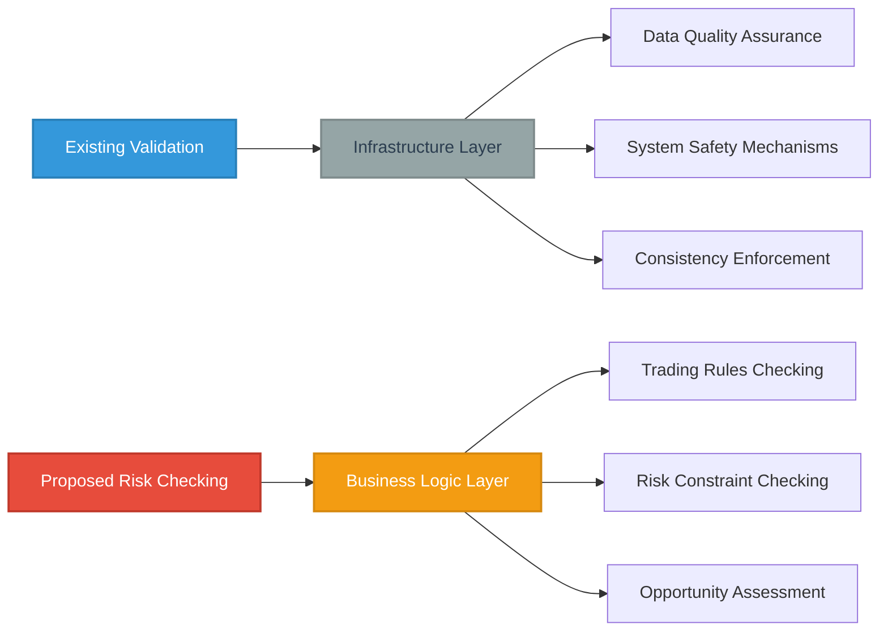
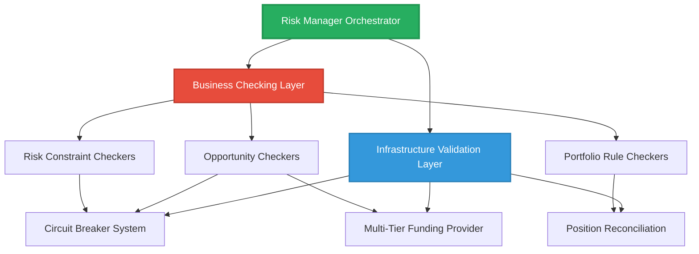

# Existing Validation Module Analysis & Integration Strategy

**Date:** July 8, 2025  
**Author:** Claude Code  
**Purpose:** Deep analysis of cyberdelta/validation/ and integration plan for risk manager refactoring

## Executive Summary

The existing `cyberdelta/validation/` module contains sophisticated domain-specific functionality that is **complementary but separate** from the risk management checking we're planning. The module serves as a **data quality and consistency layer** rather than a **business logic checking layer**.

**Key Finding:** There is **minimal direct coupling** between the existing validation module and risk manager, allowing for clean integration into our new modular structure.

## Current Validation Module Structure

### Domain Architecture

```mermaid
graph TD
    A[cyberdelta/validation/] --> B[Circuit Breaker System]
    A --> C[Funding Data Management]
    A --> D[Position Reconciliation]
    A --> E[Data Quality Models]
    
    B --> B1[CircuitBreaker Base]
    B --> B2[VolatilityBreaker]
    B --> B3[DrawdownBreaker]
    B --> B4[APIErrorBreaker]
    B --> B5[LiquidityBreaker]
    B --> B6[CircuitBreakerSystem]
    
    C --> C1[FundingData Models]
    C --> C2[MultiTierFundingProvider]
    C --> C3[FundingRateValidator]
    C --> C4[ArbitrageOpportunity]
    
    D --> D1[PositionReconciliationSystem]
    D --> D2[DiscrepancyDetail Models]
    
    E --> E1[Source Reliability]
    E --> E2[Confidence Factors]
    E --> E3[Historical Tracking]
    
    style A fill:#3498db,stroke:#2980b9,stroke-width:3px,color:#fff
    style B fill:#e74c3c,stroke:#c0392b,stroke-width:2px,color:#fff
    style C fill:#f39c12,stroke:#d68910,stroke-width:2px,color:#fff
    style D fill:#9b59b6,stroke:#8e44ad,stroke-width:2px,color:#fff
    style E fill:#1abc9c,stroke:#16a085,stroke-width:2px,color:#fff
```



## Detailed Module Analysis

### 1. Circuit Breaker System (Safety Infrastructure)

#### Current Structure
```
cyberdelta/validation/circuit_breaker.py (1,670 lines)
```

#### Key Components
- **`CircuitBreaker`** (Abstract Base): State management (CLOSED/OPEN/HALF_OPEN)
- **`VolatilityBreaker`**: Price volatility monitoring with thresholds
- **`DrawdownBreaker`**: Portfolio drawdown monitoring
- **`APIErrorBreaker`**: API failure rate monitoring with time windows
- **`LiquidityBreaker`**: Market liquidity monitoring
- **`CircuitBreakerSystem`**: Orchestrator managing multiple breakers

#### Functionality Analysis
- **State Management**: Three-state pattern with cooldown periods
- **Recovery Testing**: HALF_OPEN state for gradual recovery
- **Exchange-Specific**: Per-exchange and per-symbol breakers
- **Configuration-Driven**: Extensive configuration with defaults
- **Logging Integration**: Comprehensive structured logging

#### Current Coupling
```python
# RiskManager imports
from cyberdelta.validation.circuit_breaker import BreakerState
from cyberdelta.validation.funding_data import ArbitrageOpportunity
```

### 2. Funding Data Management (Data Quality Layer)

#### Current Structure
```
cyberdelta/validation/funding_data.py (400+ lines)
cyberdelta/validation/multi_tier_funding_provider.py (800+ lines)
cyberdelta/validation/funding_rate_validator.py (300+ lines)
```

#### Key Components
- **`FundingData`**: Single-source funding rate data
- **`IntegratedFundingData`**: Multi-source aggregated data
- **`MultiTierFundingProvider`**: Multi-tier data sourcing with confidence scoring
- **`FundingRateValidator`**: Historical accuracy tracking
- **`ArbitrageOpportunity`**: Trading opportunity model

#### Functionality Analysis
- **Multi-Source Integration**: PRIMARY/SECONDARY/TERTIARY/FALLBACK sources
- **Confidence Scoring**: Based on source reliability, freshness, consensus
- **Historical Validation**: Prediction vs actual tracking
- **Cache Management**: Performance optimization with TTL
- **Error Handling**: Comprehensive fallback mechanisms

### 3. Position Reconciliation (Data Consistency Layer)

#### Current Structure
```
cyberdelta/validation/position_reconciliation.py (600+ lines)
cyberdelta/validation/models/discrepancy_detail.py (200+ lines)
```

#### Key Components
- **`PositionReconciliationSystem`**: Position validation and correction
- **`DiscrepancyDetail`**: Immutable discrepancy records
- **`HistoricalDiscrepancyRecord`**: Mutable wrapper with context

#### Functionality Analysis
- **Three-Way Reconciliation**: API vs Local vs Fill History
- **Auto-Correction**: Configurable correction of detected drift
- **Threshold-Based Alerting**: Configurable discrepancy thresholds
- **Historical Tracking**: Audit trail for compliance

## Domain Classification

### Infrastructure vs Business Logic



### Current vs Proposed Responsibilities

| **Current Validation Module** | **Proposed Risk Checking** |
|-------------------------------|------------------------------|
| Circuit breaker management | Business rule checking |
| Data source reliability | Profitability checking |
| Position reconciliation | Risk constraint enforcement |
| Funding rate accuracy | Opportunity qualification |
| System safety mechanisms | Trading logic checking |
| Infrastructure monitoring | Portfolio rule checking |

## Coupling Analysis

### Minimal Direct Coupling Found

#### Risk Manager Dependencies
```python
# Only two imports from validation module:
from cyberdelta.validation.circuit_breaker import BreakerState
from cyberdelta.validation.funding_data import ArbitrageOpportunity
```

#### Usage Patterns
1. **`BreakerState`**: Used for circuit breaker state checking
2. **`ArbitrageOpportunity`**: Used as input data model
3. **`CircuitBreakerSystemProtocol`**: Dependency injection interface

#### No Direct Instantiation
- Risk manager receives circuit breaker system via dependency injection
- No direct creation of validation objects
- Clean interface-based integration

### Loose Coupling Benefits
- **Independent Evolution**: Both modules can evolve separately
- **Clear Boundaries**: Infrastructure vs business logic separation
- **Testability**: Each layer can be tested independently
- **Configurability**: Different checking rules for different environments

## Integration Strategy

### 1. Preserve Existing Infrastructure Layer

```
cyberdelta/validation/               # Keep as infrastructure layer
├── circuit_breaker.py              # System safety mechanisms
├── funding_data.py                  # Data quality models
├── funding_rate_validator.py        # Historical accuracy tracking
├── multi_tier_funding_provider.py  # Multi-source data integration
├── position_reconciliation.py      # Position consistency checking
└── models/
    └── discrepancy_detail.py        # Data consistency models
```

### 2. New Risk Checking Structure

```
cyberdelta/core/risk/checks/         # New business logic layer
├── interfaces/
│   └── check_interfaces.py          # Business checking contracts
├── checkers/
│   ├── base_checker.py              # Abstract business checker
│   ├── required_fields_checker.py   # Field presence checking
│   ├── profitability_checker.py     # Business profitability rules
│   ├── price_sanity_checker.py      # Price reasonableness
│   ├── funding_rate_stability_checker.py # Rate stability rules
│   └── volatility_bounds_checker.py # Volatility business rules
├── pipeline/
│   └── check_pipeline.py            # Business checking orchestration
└── models/
    └── check_result.py               # Business checking results
```

### 3. Integration Points

#### Circuit Breaker Integration
```python
# In new risk manager orchestrator
class RiskManager:
    def __init__(
        self,
        circuit_breaker_system: CircuitBreakerSystemProtocol,  # From infrastructure
        opportunity_checker: OpportunityCheckerInterface,      # From business layer
        # ... other dependencies
    ):
        self.circuit_breaker_system = circuit_breaker_system
        self.opportunity_checker = opportunity_checker
```

#### Data Model Integration
```python
# Use existing ArbitrageOpportunity as input
# New business checkers operate on this model
class RequiredFieldsChecker:
    def check(self, opportunity: ArbitrageOpportunity) -> CheckResult:
        # Business logic checking using infrastructure data model
```

#### Funding Rate Integration
```python
# New funding rate stability checker uses infrastructure data
class FundingRateStabilityChecker:
    def __init__(self, funding_provider: MultiTierFundingProvider):
        self.funding_provider = funding_provider
    
    def check(self, opportunity: ArbitrageOpportunity) -> CheckResult:
        # Use high-quality funding data for business rule checking
```

## Proposed Integration Architecture

### Layered Architecture


### Interface Contracts
```python
# Clear separation between layers
class OpportunityCheckerInterface(Protocol):
    """Business logic checking interface"""
    async def check(self, opportunity: ArbitrageOpportunity) -> CheckResult

class CircuitBreakerSystemProtocol(Protocol):
    """Infrastructure safety interface"""
    def can_execute(self, exchange: str) -> tuple[bool, str | None]

class FundingProviderProtocol(Protocol):
    """Infrastructure data quality interface"""
    def get_funding_rate(self, exchange: str, symbol: str) -> IntegratedFundingData
```

## Benefits of This Integration Approach

### 1. **Separation of Concerns**
- **Infrastructure Layer**: Data quality, safety, consistency
- **Business Layer**: Trading rules, risk policies, opportunity qualification

### 2. **Minimal Disruption**
- Existing validation module continues working unchanged
- New business checking layer adds functionality without conflicts
- Current dependencies remain stable

### 3. **Enhanced Functionality**
- Business checkers can leverage high-quality infrastructure data
- Circuit breaker system provides safety net for business operations
- Position reconciliation ensures data integrity for risk calculations

### 4. **Clear Evolution Path**
- Infrastructure layer focuses on data quality and safety
- Business layer focuses on trading and risk logic
- Each layer can evolve independently

### 5. **Improved Testability**
- Infrastructure layer tested with reliability/performance tests
- Business layer tested with business rule/constraint tests
- Clear mocking boundaries between layers

## Migration Timeline

### Phase 1: Infrastructure Preservation (Week 1)
- Ensure existing validation module works with new structure
- Create interface protocols for existing components
- Update imports in risk manager

### Phase 2: Business Layer Creation (Weeks 2-3)
- Implement new business checking interfaces
- Create business checkers using infrastructure data
- Implement business checking pipeline

### Phase 3: Integration (Weeks 4-5)
- Integrate business checkers with risk manager
- Connect business layer to infrastructure layer
- Comprehensive testing of both layers

### Phase 4: Optimization (Week 6)
- Performance optimization of layered architecture
- Enhanced error handling across layers
- Documentation and knowledge transfer

## Conclusion

The existing `cyberdelta/validation/` module is a well-designed **infrastructure layer** that complements rather than conflicts with our proposed **business logic checking**. The minimal coupling allows for clean integration where:

1. **Infrastructure layer** provides data quality, safety mechanisms, and consistency enforcement
2. **Business layer** provides trading rules, risk constraints, and opportunity qualification
3. **Integration points** are clean and interface-based
4. **Evolution** can happen independently in each layer

This approach maximizes the value of existing code while enabling the modular risk management architecture we're building.

**Recommendation:** Proceed with the integration strategy outlined above, preserving the existing validation infrastructure and building the new business checking layer on top of it.