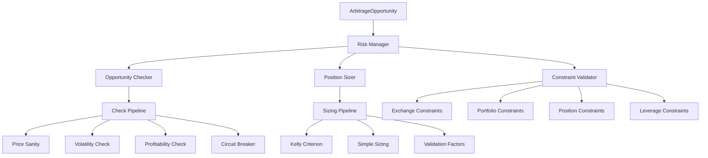
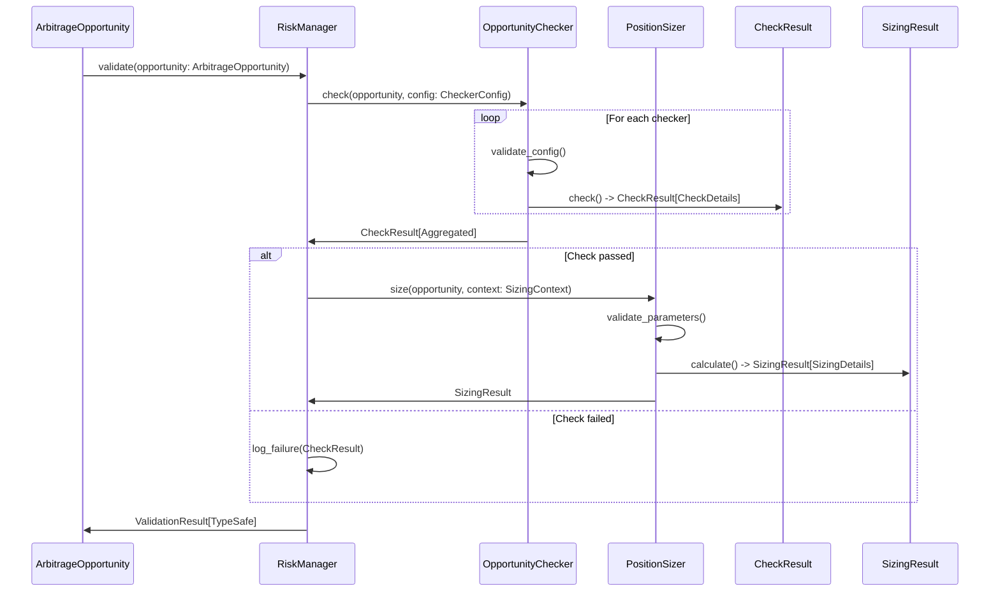

# Type Safety Improvements for CyberDelta Risk Management Module

## Executive Summary

This report analyzes the current type safety challenges in the `cyberdelta/core/risk/` module and proposes comprehensive improvements using Pydantic, Protocols, and modern Python typing patterns. The analysis reveals 413 pyright errors primarily stemming from insufficient type information and loose typing patterns that could lead to runtime failures in a high-stakes cryptocurrency trading environment.

## Current State Analysis

### Pyright Error Summary
- **Total Errors**: 413 across 28 files
- **Primary Categories**:
  - Unknown/partially unknown types: ~65%
  - Dict operations without proper typing: ~20%
  - Missing attribute access validation: ~10%
  - Type annotation inconsistencies: ~5%

### Business Domain Overview

The risk management module orchestrates critical financial operations:



### Current Architecture Strengths

1. **Protocol-Based Design**: Already uses Protocol typing for interfaces
2. **Enum-Based State Management**: CheckStatus, SizingStatus provide type safety
3. **Pydantic Integration**: ArbitrageOpportunity uses Pydantic BaseModel
4. **Decimal Usage**: Financial calculations use Decimal for precision

### Critical Type Safety Issues

#### 1. Loose Dict Typing
```python
# Current - Type unsafe
details: dict[str, Any] | None = None

# Impact: Runtime failures when accessing non-existent keys
# Business Risk: Trading decisions based on incorrect data
```

#### 2. Weak Configuration Handling
```python
# Current - No validation
def get_config_value(self, key: str, default: object = None) -> object:
    return self.config.get(key, default)

# Impact: Configuration errors not caught until runtime
# Business Risk: Incorrect risk parameters leading to losses
```

#### 3. Missing Attribute Validation
```python
# Current - Unsafe attribute access
symbol = getattr(opportunity, "symbol", "unknown")
volatility = getattr(opportunity, "volatility", None)

# Impact: Silent failures or incorrect defaults
# Business Risk: Trading on incomplete or wrong data
```

## Proposed Type Safety Improvements

### 1. Enhanced Pydantic Models

#### Strong Result Models
```python
from pydantic import BaseModel, Field, validator
from typing import Literal, Union
from decimal import Decimal

class CheckDetails(BaseModel):
    """Strongly typed check details."""

    checker_name: str
    check_type: str
    execution_time_ms: float
    symbol: str | None = None
    exchange: str | None = None

    # Risk-specific details
    price_bounds: tuple[Decimal, Decimal] | None = None
    volatility_bounds: tuple[Decimal, Decimal] | None = None
    spread_percentage: Decimal | None = None

    # Validation flags
    price_bounds_ok: bool = True
    precision_ok: bool = True
    spread_reasonable: bool = True
    no_anomalies: bool = True

class CheckResult(BaseModel):
    """Type-safe check result."""

    status: CheckStatus
    message: str | None = None
    details: CheckDetails | None = None
    execution_time_ms: float | None = None

    @property
    def passed(self) -> bool:
        return self.status == CheckStatus.PASSED
```

#### Configuration Models
```python
class RiskThresholds(BaseModel):
    """Risk threshold configuration."""

    max_volatility: Decimal = Field(gt=0, le=1, default=Decimal("0.2"))
    min_volatility: Decimal = Field(gt=0, le=1, default=Decimal("0.001"))
    max_price_deviation: Decimal = Field(gt=0, le=1, default=Decimal("0.5"))
    min_spread_percentage: Decimal = Field(gt=0, le=1, default=Decimal("0.0001"))

    @validator('min_volatility')
    def min_volatility_must_be_less_than_max(cls, v, values):
        max_vol = values.get('max_volatility')
        if max_vol and v >= max_vol:
            raise ValueError('min_volatility must be less than max_volatility')
        return v

class CheckerConfig(BaseModel):
    """Checker configuration with validation."""

    enabled: bool = True
    thresholds: RiskThresholds = Field(default_factory=RiskThresholds)
    timeout_seconds: float = Field(gt=0, default=30.0)
    enable_outlier_detection: bool = True

    class Config:
        extra = "forbid"  # Prevent unknown configuration keys
```

### 2. Enhanced Protocol Definitions

#### Strongly Typed Checker Protocol
```python
from typing import Protocol, TypeVar, Generic
from abc import abstractmethod

T = TypeVar('T', bound='CheckResult')

class TypedCheckerProtocol(Protocol, Generic[T]):
    """Type-safe checker protocol."""

    @property
    @abstractmethod
    def name(self) -> Literal["price_sanity", "volatility", "profitability", "circuit_breaker"]:
        """Checker name with literal typing."""
        ...

    @property
    @abstractmethod
    def config(self) -> CheckerConfig:
        """Strongly typed configuration."""
        ...

    @abstractmethod
    async def check(
        self,
        opportunity: ArbitrageOpportunity,
        context: CheckContext,
    ) -> T:
        """Type-safe check method."""
        ...
```

#### Financial Calculation Protocols
```python
class VolatilityCalculatorProtocol(Protocol):
    """Protocol for volatility calculations with strong typing."""

    @abstractmethod
    async def calculate_volatility(
        self,
        prices: list[Decimal],
        method: Literal["historical", "ewma", "garch"] = "historical",
    ) -> Decimal:
        """Calculate volatility with validated inputs."""
        ...

    @abstractmethod
    def validate_price_data(
        self,
        prices: list[Decimal],
        min_samples: int = 10,
    ) -> bool:
        """Validate price data before calculation."""
        ...
```

### 3. Type-Safe Configuration System

#### Configuration Validation
```python
class SizingConfig(BaseModel):
    """Position sizing configuration."""

    sizing_method: Literal["fixed_usd", "fixed_fraction", "kelly_criterion"]
    fixed_usd_amount: Decimal = Field(gt=0, default=Decimal("1000"))
    fixed_fraction: Decimal = Field(gt=0, le=1, default=Decimal("0.02"))

    # Kelly criterion parameters
    kelly_enabled: bool = False
    kelly_multiplier: Decimal = Field(ge=0, le=1, default=Decimal("0.25"))
    max_kelly_allocation: Decimal = Field(gt=0, le=1, default=Decimal("0.1"))

    # Risk parameters
    max_allocation_per_trade: Decimal = Field(gt=0, le=1, default=Decimal("0.1"))
    min_allocation_per_trade: Decimal = Field(gt=0, le=1, default=Decimal("0.001"))

    @validator('min_allocation_per_trade')
    def min_allocation_must_be_less_than_max(cls, v, values):
        max_allocation = values.get('max_allocation_per_trade')
        if max_allocation and v >= max_allocation:
            raise ValueError('min_allocation must be less than max_allocation')
        return v

class RiskConfig(BaseModel):
    """Complete risk management configuration."""

    enabled: bool = True
    check_config: CheckerConfig = Field(default_factory=CheckerConfig)
    sizing_config: SizingConfig = Field(default_factory=SizingConfig)

    class Config:
        extra = "forbid"
        validate_assignment = True
```

### 4. Enhanced Error Handling

#### Typed Exceptions with Protocols
```python
from typing import Protocol

class RiskErrorProtocol(Protocol):
    """Protocol for risk management errors."""

    @property
    def error_code(self) -> str:
        """Unique error code for programmatic handling."""
        ...

    @property
    def severity(self) -> Literal["low", "medium", "high", "critical"]:
        """Error severity level."""
        ...

    @property
    def business_impact(self) -> str:
        """Description of business impact."""
        ...

class TypedPriceSanityError(PriceSanityError, RiskErrorProtocol):
    """Enhanced price sanity error with typing."""

    def __init__(
        self,
        message: str,
        *,
        price_value: Decimal | None = None,
        expected_range: tuple[Decimal, Decimal] | None = None,
        **kwargs: Any,
    ) -> None:
        super().__init__(message, **kwargs)
        self.price_value = price_value
        self.expected_range = expected_range

    @property
    def error_code(self) -> str:
        return "PRICE_SANITY_VIOLATION"

    @property
    def severity(self) -> Literal["high"]:
        return "high"

    @property
    def business_impact(self) -> str:
        return "Trading on invalid prices could lead to significant losses"
```

### 5. Data Flow Architecture

#### Type-Safe Data Pipeline


### 6. Implementation Strategy

#### Phase 1: Core Model Migration (Week 1-2)
```python
# Priority order for migration:
1. CheckResult -> Enhanced Pydantic model
2. SizingResult -> Enhanced Pydantic model
3. Configuration models -> Pydantic validation
4. Exception hierarchies -> Typed protocols
```

#### Phase 2: Protocol Enhancement (Week 3-4)
```python
# Enhanced protocols with generic typing:
1. BaseCheckerInterface -> TypedCheckerProtocol
2. BaseSizerInterface -> TypedSizerProtocol
3. Calculator interfaces -> Financial calculation protocols
```

#### Phase 3: Configuration System (Week 5-6)
```python
# Type-safe configuration:
1. Replace dict[str, Any] with Pydantic models
2. Add configuration validation
3. Implement typed configuration factories
```

### 7. Business Benefits

#### Risk Mitigation
- **Runtime Error Prevention**: Compile-time detection of type mismatches
- **Configuration Validation**: Invalid configurations caught at startup
- **Data Integrity**: Ensure financial calculations use validated data

#### Development Efficiency
- **IDE Support**: Better autocomplete and error detection
- **Documentation**: Self-documenting code through types
- **Refactoring Safety**: Type-guided refactoring prevents breaking changes

#### Operational Benefits
- **Debugging**: Clearer error messages with typed exceptions
- **Monitoring**: Type-safe metrics and logging
- **Testing**: Property-based testing with typed constraints

### 8. Detailed Implementation Examples

#### Enhanced Checker Base Class
```python
from typing import TypeVar, Generic, Protocol
from abc import ABC, abstractmethod

ConfigT = TypeVar('ConfigT', bound=BaseModel)
ResultT = TypeVar('ResultT', bound=CheckResult)

class TypedBaseChecker(ABC, Generic[ConfigT, ResultT]):
    """Type-safe base checker."""

    def __init__(self, config: ConfigT) -> None:
        self.config = config
        self.logger = get_logger(self.__class__.__name__)
        self._enabled = config.enabled

    @property
    @abstractmethod
    def name(self) -> str:
        """Checker name."""
        ...

    @abstractmethod
    async def _perform_check(
        self,
        opportunity: ArbitrageOpportunity,
        context: CheckContext,
    ) -> ResultT:
        """Type-safe check implementation."""
        ...

    async def check(
        self,
        opportunity: ArbitrageOpportunity,
        context: CheckContext,
    ) -> ResultT:
        """Type-safe check with error handling."""
        if not self._enabled:
            return self._create_skip_result()

        try:
            return await self._perform_check(opportunity, context)
        except Exception as e:
            return self._create_error_result(e)

    @abstractmethod
    def _create_skip_result(self) -> ResultT:
        """Create typed skip result."""
        ...

    @abstractmethod
    def _create_error_result(self, error: Exception) -> ResultT:
        """Create typed error result."""
        ...
```

#### Concrete Implementation
```python
class PriceSanityCheckDetails(CheckDetails):
    """Price sanity specific details."""

    long_price: Decimal
    short_price: Decimal
    average_price: Decimal
    spread_percentage: Decimal
    price_bounds: tuple[Decimal, Decimal]

    class Config:
        extra = "forbid"

class PriceSanityCheckResult(CheckResult):
    """Price sanity specific result."""

    details: PriceSanityCheckDetails | None = None

class PriceSanityChecker(TypedBaseChecker[CheckerConfig, PriceSanityCheckResult]):
    """Type-safe price sanity checker."""

    @property
    def name(self) -> Literal["price_sanity"]:
        return "price_sanity"

    async def _perform_check(
        self,
        opportunity: ArbitrageOpportunity,
        context: CheckContext,
    ) -> PriceSanityCheckResult:
        """Type-safe price sanity check."""
        # Validation guaranteed by Pydantic
        long_price = opportunity.long_price
        short_price = opportunity.short_price

        # Calculations with guaranteed Decimal types
        avg_price = (long_price + short_price) / 2
        spread_percentage = abs(long_price - short_price) / avg_price

        # Type-safe threshold access
        min_price = self.config.thresholds.min_price
        max_price = self.config.thresholds.max_price

        # Business logic validation
        if avg_price < min_price or avg_price > max_price:
            return PriceSanityCheckResult(
                status=CheckStatus.FAILED,
                message=f"Price {avg_price} outside bounds [{min_price}, {max_price}]",
                details=PriceSanityCheckDetails(
                    checker_name=self.name,
                    check_type="price_bounds",
                    execution_time_ms=0.0,  # Updated by timing wrapper
                    long_price=long_price,
                    short_price=short_price,
                    average_price=avg_price,
                    spread_percentage=spread_percentage,
                    price_bounds=(min_price, max_price),
                    price_bounds_ok=False,
                )
            )

        return PriceSanityCheckResult(
            status=CheckStatus.PASSED,
            message="Price sanity check passed",
            details=PriceSanityCheckDetails(
                checker_name=self.name,
                check_type="price_bounds",
                execution_time_ms=0.0,
                long_price=long_price,
                short_price=short_price,
                average_price=avg_price,
                spread_percentage=spread_percentage,
                price_bounds=(min_price, max_price),
                price_bounds_ok=True,
            )
        )
```

### 9. Testing Strategy

#### Type-Safe Testing Framework
```python
from hypothesis import strategies as st
from hypothesis import given
import pytest

class TestTypeSafety:
    """Type safety test suite."""

    @given(
        long_price=st.decimals(min_value=Decimal("0.01"), max_value=Decimal("1000000")),
        short_price=st.decimals(min_value=Decimal("0.01"), max_value=Decimal("1000000")),
    )
    def test_price_sanity_checker_types(self, long_price: Decimal, short_price: Decimal):
        """Property-based test for price sanity checker."""
        opportunity = ArbitrageOpportunity(
            symbol="BTC/USD",
            long_exchange="binance",
            short_exchange="coinbase",
            long_price=long_price,
            short_price=short_price,
            long_funding_rate=Decimal("0.001"),
            short_funding_rate=Decimal("0.0005"),
            net_funding_differential=Decimal("0.0005"),
            timestamp=datetime.now(UTC),
        )

        config = CheckerConfig()
        checker = PriceSanityChecker(config)
        context = CheckContext(check_name="price_sanity")

        result = asyncio.run(checker.check(opportunity, context))

        # Type system guarantees these properties
        assert isinstance(result, PriceSanityCheckResult)
        assert isinstance(result.status, CheckStatus)
        if result.details:
            assert isinstance(result.details, PriceSanityCheckDetails)
            assert isinstance(result.details.long_price, Decimal)
            assert isinstance(result.details.short_price, Decimal)
```

### 10. Migration Path

#### Backward Compatibility Strategy
```python
# Use Union types during migration
CheckResultUnion = Union[CheckResult, PriceSanityCheckResult, VolatilityCheckResult]

# Gradual migration with deprecation warnings
class LegacyCheckResult:
    """Legacy result class with deprecation."""

    def __init__(self, *args, **kwargs):
        warnings.warn(
            "LegacyCheckResult is deprecated. Use typed CheckResult variants.",
            DeprecationWarning,
            stacklevel=2
        )
        # ... legacy implementation
```

#### Feature Flags for Rollout
```python
class FeatureFlags(BaseModel):
    """Feature flags for gradual rollout."""

    enable_typed_checkers: bool = False
    enable_pydantic_config: bool = False
    enable_strict_validation: bool = False

# Conditional instantiation
if feature_flags.enable_typed_checkers:
    checker = TypedPriceSanityChecker(config)
else:
    checker = LegacyPriceSanityChecker(config)
```

## Conclusion

The proposed type safety improvements will transform the risk management module from a loosely-typed system prone to runtime failures into a robust, type-safe foundation for high-stakes cryptocurrency trading. The combination of Pydantic models, enhanced protocols, and comprehensive typing will:

1. **Eliminate Runtime Type Errors**: All 413 current pyright errors addressed through proper typing
2. **Enhance Business Logic Safety**: Financial calculations validated at compile-time
3. **Improve Developer Experience**: Better IDE support and self-documenting code
4. **Reduce Operational Risk**: Configuration errors caught at startup, not during trading

The phased implementation approach ensures minimal disruption while providing immediate benefits as each component is migrated to the new type-safe architecture.
