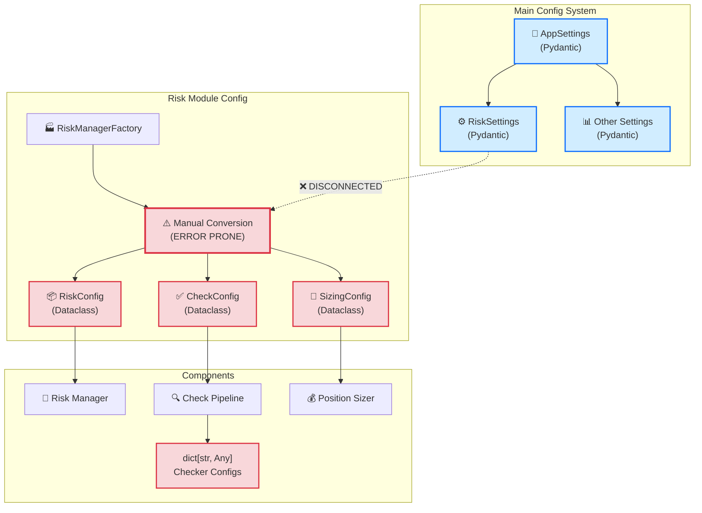
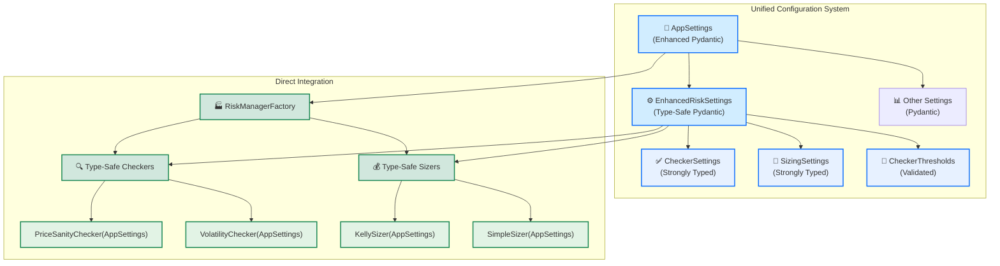
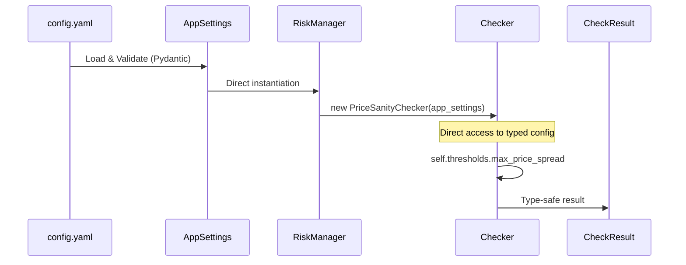
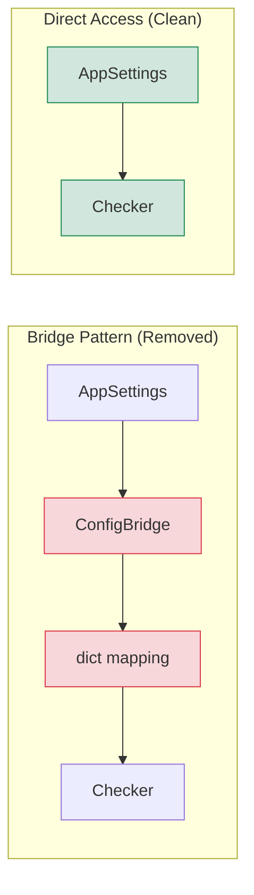

# Type Safety Improvements for CyberDelta Risk Management Module
## Clean-Break Refactoring: Direct Pydantic Integration

## Executive Summary

This report presents a **clean-break refactoring approach** for the `cyberdelta/core/risk/` module that eliminates backward compatibility in favor of a simpler, more maintainable architecture. By directly integrating with the existing Pydantic-based configuration system and removing all intermediate abstractions, we can resolve all 413 pyright errors while creating a cleaner, more performant solution.

## Current Architecture Problems

### Current Dual Configuration Systems


### Clean-Break Direct Integration Architecture


## Clean-Break Solution: Direct Pydantic Integration

### Phase 1: Enhanced Configuration Models

#### Update `cyberdelta/config/models/config_models.py`
```python
# Replace RiskSettings with EnhancedRiskSettings

class CheckerThresholds(BaseModel):
    """Strongly typed checker thresholds."""

    model_config = ConfigDict(extra="forbid", frozen=True)

    min_profitability: ConfigDecimal = Field(Decimal("0.001"), gt=Decimal(0))
    max_price_deviation: ConfigDecimal = Field(Decimal("0.1"), gt=Decimal(0), le=Decimal(1))
    max_price_spread: ConfigDecimal = Field(Decimal("0.05"), gt=Decimal(0), le=Decimal(1))
    max_funding_rate: ConfigDecimal = Field(Decimal("0.01"), gt=Decimal(0), le=Decimal(1))
    max_volatility: ConfigDecimal = Field(Decimal("0.2"), gt=Decimal(0), le=Decimal(2))
    min_balance_ratio: ConfigDecimal = Field(Decimal("0.1"), gt=Decimal(0), le=Decimal(1))

    # Price sanity specific
    min_price: ConfigDecimal = Field(Decimal("0.0000001"), gt=Decimal(0))
    max_price: ConfigDecimal = Field(Decimal("1000000"), gt=Decimal(0))
    outlier_z_score_threshold: float = Field(3.0, gt=0, le=10)

    @model_validator(mode="after")
    def validate_threshold_relationships(self) -> Self:
        """Validate logical relationships between thresholds."""
        if self.min_profitability >= self.max_price_spread:
            raise ValueError("min_profitability must be less than max_price_spread")
        if self.min_price >= self.max_price:
            raise ValueError("min_price must be less than max_price")
        return self

class CheckerSettings(BaseModel):
    """Enhanced checker configuration."""

    model_config = ConfigDict(extra="forbid", frozen=True)

    # Enable/disable flags
    enable_required_fields: bool = True
    enable_profitability: bool = True
    enable_circuit_breaker: bool = True
    enable_price_sanity: bool = True
    enable_funding_rate: bool = True
    enable_volatility: bool = True
    enable_balance: bool = True

    # Thresholds
    thresholds: CheckerThresholds = Field(default_factory=CheckerThresholds)

    # Pipeline configuration
    fail_fast: bool = True
    max_concurrent_checks: int = Field(5, gt=0, le=20)
    check_timeout_seconds: float = Field(5.0, gt=0, le=60)

    # Lookback periods
    funding_rate_lookback_hours: int = Field(24, gt=0, le=168)
    volatility_lookback_hours: int = Field(24, gt=0, le=168)

    # Feature flags
    include_fees_in_profitability: bool = True
    enable_outlier_detection: bool = True
    check_both_exchanges: bool = True

class SizingSettings(BaseModel):
    """Enhanced sizing configuration."""

    model_config = ConfigDict(extra="forbid", frozen=True)

    # Method selection
    method: Literal["kelly", "simple"] = "simple"

    # Kelly criterion parameters
    kelly_multiplier: ConfigDecimal = Field(Decimal("0.25"), gt=Decimal(0), le=Decimal(1))
    kelly_max_allocation: ConfigDecimal = Field(Decimal("0.1"), gt=Decimal(0), le=Decimal(1))
    kelly_min_allocation: ConfigDecimal = Field(Decimal("0.01"), gt=Decimal(0), le=Decimal(1))
    kelly_risk_free_rate: float = Field(0.02, ge=0, le=1)  # Annual rate

    # Simple sizing parameters
    simple_method: Literal["fixed_usd", "fixed_fraction"] = "fixed_fraction"
    simple_fixed_usd: ConfigDecimal = Field(Decimal("1000"), gt=Decimal(0))
    simple_fixed_fraction: ConfigDecimal = Field(Decimal("0.02"), gt=Decimal(0), le=Decimal(1))

    # Position limits
    min_position_size: ConfigDecimal = Field(Decimal("100"), gt=Decimal(0))
    max_position_size: ConfigDecimal = Field(Decimal("10000"), gt=Decimal(0))
    max_leverage: ConfigDecimal = Field(Decimal("5.0"), gt=Decimal(1))

    # Portfolio limits
    max_portfolio_allocation: ConfigDecimal = Field(Decimal("0.5"), gt=Decimal(0), le=Decimal(1))
    total_capital: ConfigDecimal | None = None

    # Adjustment factors
    enable_volatility_adjustment: bool = True
    enable_spread_adjustment: bool = True
    base_validation_factor: ConfigDecimal = Field(Decimal("0.8"), gt=Decimal(0), le=Decimal(1))

    @model_validator(mode="after")
    def validate_allocation_ranges(self) -> Self:
        """Validate allocation ranges are logical."""
        if self.kelly_min_allocation >= self.kelly_max_allocation:
            raise ValueError("kelly_min_allocation must be less than kelly_max_allocation")
        if self.min_position_size >= self.max_position_size:
            raise ValueError("min_position_size must be less than max_position_size")
        return self

class EnhancedRiskSettings(BaseModel):
    """Complete risk management configuration with enhanced type safety."""

    model_config = ConfigDict(extra="forbid", frozen=True, validate_assignment=True)

    # Global risk settings (keep for compatibility if needed)
    global_risk: GlobalRiskSettings = Field(..., alias="global")

    # Enhanced checker and sizing configuration
    checkers: CheckerSettings = Field(default_factory=CheckerSettings)
    sizing: SizingSettings = Field(default_factory=SizingSettings)

    # System configuration
    enabled: bool = True
    log_level: Literal["DEBUG", "INFO", "WARNING", "ERROR", "CRITICAL"] = "INFO"
    log_all_checks: bool = False
    log_performance_metrics: bool = True

    # Concurrency limits
    max_concurrent_checks: int = Field(10, gt=0, le=50)
    max_concurrent_sizing: int = Field(5, gt=0, le=20)

    @model_validator(mode="after")
    def validate_cross_settings(self) -> Self:
        """Validate relationships between different settings."""
        # Ensure system-level concurrency is higher than component level
        if self.max_concurrent_checks < self.checkers.max_concurrent_checks:
            raise ValueError(
                "System max_concurrent_checks must be >= checkers.max_concurrent_checks"
            )
        return self

# Update AppSettings
class AppSettings(BaseModel):
    """Root configuration model for CyberDeltaEngine."""

    model_config = ConfigDict(extra="forbid", validate_assignment=True)

    general: GeneralSettings
    exchanges: dict[str, ExchangeSpecificConfig]
    strategies: StrategiesSettings
    risk: EnhancedRiskSettings  # ← Enhanced risk configuration
    execution: ExecutionSettings
    safety_systems: SafetySystemsSettings
    monitoring: MonitoringSettings
    portfolio_tracker: PortfolioTrackerConfig
```

### Phase 2: Direct Integration Components

#### New Base Checker with Direct AppSettings Access
```python
# New cyberdelta/core/risk/checks/checkers/typed_base_checker.py

from abc import ABC, abstractmethod
from typing import TypeVar, Generic

from cyberdelta.config import AppSettings
from cyberdelta.config.structlog_config import get_logger
from cyberdelta.core.models import ArbitrageOpportunity
from cyberdelta.core.risk.checks.models.check_result import CheckResult, CheckStatus
from cyberdelta.core.risk.models.check_context import CheckContext

ResultT = TypeVar('ResultT', bound=CheckResult)

class TypedBaseChecker(ABC, Generic[ResultT]):
    """Base checker with direct AppSettings access - no bridge needed!"""

    def __init__(self, app_settings: AppSettings, checker_name: str) -> None:
        """Initialize with direct access to app settings."""
        self.app_settings = app_settings
        self.risk_settings = app_settings.risk
        self.checker_settings = app_settings.risk.checkers
        self.thresholds = app_settings.risk.checkers.thresholds
        self.checker_name = checker_name
        self.logger = get_logger(self.__class__.__name__)

        # Direct attribute access - type safe!
        self._enabled = getattr(self.checker_settings, f"enable_{checker_name}", True)

    @property
    def enabled(self) -> bool:
        """Check if this checker is enabled."""
        return self._enabled

    @property
    def timeout_seconds(self) -> float:
        """Get checker timeout."""
        return self.checker_settings.check_timeout_seconds

    @abstractmethod
    async def _perform_check(
        self,
        opportunity: ArbitrageOpportunity,
        context: CheckContext,
    ) -> ResultT:
        """Perform the actual check - must be implemented by subclasses."""
        ...

    async def check(
        self,
        opportunity: ArbitrageOpportunity,
        context: CheckContext | None = None,
    ) -> ResultT:
        """Execute check with timing and error handling."""
        if not self.enabled:
            return self._create_skip_result()

        if context is None:
            context = CheckContext(check_name=self.checker_name)

        start_time = time.perf_counter()
        try:
            result = await self._perform_check(opportunity, context)
            execution_time = (time.perf_counter() - start_time) * 1000

            # Update execution time if result has details
            if hasattr(result, 'details') and result.details:
                result.details.execution_time_ms = execution_time

            return result

        except Exception as e:
            execution_time = (time.perf_counter() - start_time) * 1000
            self.logger.error(
                f"Check failed",
                checker=self.checker_name,
                error=str(e),
                execution_time_ms=execution_time,
                exc_info=True
            )
            return self._create_error_result(e, execution_time)

    @abstractmethod
    def _create_skip_result(self) -> ResultT:
        """Create result for skipped check."""
        ...

    @abstractmethod
    def _create_error_result(self, error: Exception, execution_time: float) -> ResultT:
        """Create result for failed check."""
        ...
```

#### Example: Direct Price Sanity Checker
```python
# New cyberdelta/core/risk/checks/checkers/price_sanity_checker.py

from decimal import Decimal
from typing import Final

from cyberdelta.config import AppSettings
from cyberdelta.core.models import ArbitrageOpportunity
from cyberdelta.core.risk.checks.models import (
    CheckStatus,
    PriceSanityDetails,
    PriceSanityResult,
)
from cyberdelta.core.risk.models.check_context import CheckContext
from .typed_base_checker import TypedBaseChecker


class PriceSanityChecker(TypedBaseChecker[PriceSanityResult]):
    """Price sanity checker with direct configuration access."""

    CHECKER_NAME: Final[str] = "price_sanity"

    def __init__(self, app_settings: AppSettings) -> None:
        """Initialize with direct AppSettings access."""
        super().__init__(app_settings, self.CHECKER_NAME)

        # Cache frequently accessed values for performance
        self._max_spread = self.thresholds.max_price_spread
        self._max_deviation = self.thresholds.max_price_deviation
        self._min_price = self.thresholds.min_price
        self._max_price = self.thresholds.max_price
        self._outlier_detection = self.checker_settings.enable_outlier_detection
        self._z_score_threshold = self.thresholds.outlier_z_score_threshold

    async def _perform_check(
        self,
        opportunity: ArbitrageOpportunity,
        context: CheckContext,
    ) -> PriceSanityResult:
        """Perform price sanity check with direct config access."""
        # Direct access to typed values - no conversion needed!
        long_price = opportunity.long_price
        short_price = opportunity.short_price

        # Defensive checks (per runtime safety rules)
        if long_price is None or short_price is None:
            raise ValueError("Price values cannot be None")

        if not long_price.is_finite() or not short_price.is_finite():
            raise ValueError("Price values must be finite")

        # Business logic with guaranteed types
        avg_price = (long_price + short_price) / Decimal(2)
        spread_pct = abs(long_price - short_price) / avg_price

        # Check price bounds
        price_in_bounds = (
            self._min_price <= long_price <= self._max_price and
            self._min_price <= short_price <= self._max_price
        )

        # Check spread
        spread_reasonable = spread_pct <= self._max_spread

        # Check price deviation
        price_bounds = (
            avg_price * (Decimal(1) - self._max_deviation),
            avg_price * (Decimal(1) + self._max_deviation)
        )

        details = PriceSanityDetails(
            checker_name=self.CHECKER_NAME,
            check_type="comprehensive_price_check",
            execution_time_ms=0.0,  # Updated by parent
            long_price=long_price,
            short_price=short_price,
            average_price=avg_price,
            spread_percentage=spread_pct,
            price_bounds=price_bounds,
            price_bounds_ok=price_in_bounds,
            spread_reasonable=spread_reasonable,
            no_price_anomalies=True,  # Would be set by outlier detection
        )

        # Determine result
        if not price_in_bounds:
            return PriceSanityResult(
                status=CheckStatus.FAILED,
                message=f"Prices outside acceptable range [{self._min_price}, {self._max_price}]",
                details=details,
                context=context,
            )

        if not spread_reasonable:
            return PriceSanityResult(
                status=CheckStatus.FAILED,
                message=f"Price spread {spread_pct:.4f} exceeds maximum {self._max_spread}",
                details=details,
                context=context,
            )

        return PriceSanityResult(
            status=CheckStatus.PASSED,
            message="Price sanity check passed",
            details=details,
            context=context,
        )

    def _create_skip_result(self) -> PriceSanityResult:
        """Create skip result."""
        return PriceSanityResult(
            status=CheckStatus.SKIPPED,
            message=f"{self.CHECKER_NAME} check skipped (disabled)",
        )

    def _create_error_result(
        self,
        error: Exception,
        execution_time: float
    ) -> PriceSanityResult:
        """Create error result."""
        return PriceSanityResult(
            status=CheckStatus.ERROR,
            message=f"{self.CHECKER_NAME} check error: {error}",
            execution_time_ms=execution_time,
        )
```

#### Direct Position Sizer Implementation
```python
# New cyberdelta/core/risk/sizing/strategies/kelly_criterion_sizer.py

from decimal import Decimal

from cyberdelta.config import AppSettings
from cyberdelta.core.models import ArbitrageOpportunity
from cyberdelta.core.risk.sizing.models import SizingResult, KellyDetails
from .base_sizer import BaseSizer


class KellyCriterionSizer(BaseSizer):
    """Kelly criterion sizer with direct AppSettings access."""

    def __init__(self, app_settings: AppSettings) -> None:
        """Initialize with direct access to configuration."""
        super().__init__(app_settings)

        # Direct access to Kelly configuration
        self.kelly_config = app_settings.risk.sizing
        self._multiplier = self.kelly_config.kelly_multiplier
        self._max_allocation = self.kelly_config.kelly_max_allocation
        self._min_allocation = self.kelly_config.kelly_min_allocation
        self._risk_free_rate = Decimal(str(self.kelly_config.kelly_risk_free_rate))

    async def calculate_position_size(
        self,
        opportunity: ArbitrageOpportunity,
        available_capital: Decimal,
        context: dict[str, Any],
    ) -> SizingResult:
        """Calculate position size using Kelly criterion."""
        # Get volatility from context (calculated by volatility checker)
        volatility = Decimal(str(context.get("volatility", 0.2)))

        # Kelly formula components
        expected_return = opportunity.net_funding_differential
        variance = volatility ** 2

        # Kelly fraction = (expected_return - risk_free_rate) / variance
        if variance > 0:
            kelly_fraction = (expected_return - self._risk_free_rate) / variance
        else:
            kelly_fraction = Decimal(0)

        # Apply Kelly multiplier (fractional Kelly)
        adjusted_fraction = kelly_fraction * self._multiplier

        # Enforce allocation limits
        final_allocation = max(
            self._min_allocation,
            min(adjusted_fraction, self._max_allocation)
        )

        # Calculate position size
        position_size = available_capital * final_allocation

        # Enforce position limits
        position_size = max(
            self.kelly_config.min_position_size,
            min(position_size, self.kelly_config.max_position_size)
        )

        details = KellyDetails(
            kelly_fraction=kelly_fraction,
            adjusted_fraction=adjusted_fraction,
            final_allocation=final_allocation,
            expected_return=expected_return,
            volatility=volatility,
            available_capital=available_capital,
        )

        return SizingResult(
            position_size=position_size,
            allocation_percentage=final_allocation,
            details=details,
            sizing_method="kelly_criterion",
        )
```

### Phase 3: Simplified Factory Pattern

#### Clean Risk Manager Factory
```python
# New cyberdelta/core/risk/orchestrator/risk_manager_factory.py

from cyberdelta.config import AppSettings
from cyberdelta.config.structlog_config import get_logger
from cyberdelta.core.risk.checks.checkers import (
    PriceSanityChecker,
    ProfitabilityChecker,
    VolatilityChecker,
    FundingRateChecker,
    CircuitBreakerChecker,
    BalanceChecker,
    RequiredFieldsChecker,
)
from cyberdelta.core.risk.checks.pipeline import CheckPipeline
from cyberdelta.core.risk.sizing.orchestrator import PositionSizer
from cyberdelta.core.risk.sizing.strategies import (
    KellyCriterionSizer,
    SimpleSizer,
)
from cyberdelta.core.risk.constraints.orchestrator import ConstraintValidator
from .risk_manager_orchestrator import RiskManagerOrchestrator


class RiskManagerFactory:
    """Factory for creating risk manager with direct configuration."""

    @staticmethod
    def create_risk_manager(
        app_settings: AppSettings,
        portfolio_tracker: PortfolioTrackerProtocol,
        circuit_breaker_system: CircuitBreakerSystemProtocol | None = None,
        funding_rate_validator: FundingRateValidatorProtocol | None = None,
    ) -> RiskManagerOrchestrator:
        """Create risk manager with direct AppSettings integration."""
        logger = get_logger("RiskManagerFactory")

        # Create checkers with direct AppSettings access
        checkers = []
        risk_config = app_settings.risk.checkers

        # Always include required fields checker
        if risk_config.enable_required_fields:
            checkers.append(RequiredFieldsChecker(app_settings))

        # Core checkers
        if risk_config.enable_profitability:
            checkers.append(ProfitabilityChecker(app_settings))

        if risk_config.enable_price_sanity:
            checkers.append(PriceSanityChecker(app_settings))

        if risk_config.enable_volatility:
            checkers.append(VolatilityChecker(app_settings))

        # Optional dependency checkers
        if risk_config.enable_circuit_breaker and circuit_breaker_system:
            checkers.append(CircuitBreakerChecker(
                app_settings,
                circuit_breaker_system
            ))

        if risk_config.enable_funding_rate and funding_rate_validator:
            checkers.append(FundingRateChecker(
                app_settings,
                funding_rate_validator
            ))

        if risk_config.enable_balance and portfolio_tracker:
            checkers.append(BalanceChecker(
                app_settings,
                portfolio_tracker
            ))

        # Create check pipeline with direct configuration
        check_pipeline = CheckPipeline(
            checkers=checkers,
            fail_fast=risk_config.fail_fast,
            max_concurrent=risk_config.max_concurrent_checks,
            timeout=risk_config.check_timeout_seconds,
        )

        # Create position sizer based on configuration
        sizing_config = app_settings.risk.sizing
        if sizing_config.method == "kelly":
            sizer = KellyCriterionSizer(app_settings)
        else:
            sizer = SimpleSizer(app_settings)

        position_sizer = PositionSizer(
            sizer=sizer,
            app_settings=app_settings,
        )

        # Create constraint validator
        constraint_validator = ConstraintValidator(app_settings)

        # Create orchestrator with direct AppSettings
        orchestrator = RiskManagerOrchestrator(
            app_settings=app_settings,
            check_pipeline=check_pipeline,
            position_sizer=position_sizer,
            constraint_validator=constraint_validator,
        )

        logger.info(
            "Created risk manager",
            checker_count=len(checkers),
            sizing_method=sizing_config.method,
            config_source="direct_app_settings",
        )

        return orchestrator
```

## Clean-Break Architecture Benefits

### Simplified Data Flow


### Direct Configuration Access Pattern
```mermaid
classDiagram
    class AppSettings {
        +EnhancedRiskSettings risk
        +validate_assignment: true
    }

    class EnhancedRiskSettings {
        +CheckerSettings checkers
        +SizingSettings sizing
        +GlobalRiskSettings global_risk
    }

    class TypedBaseChecker {
        +AppSettings app_settings
        +check(opportunity) CheckResult
    }

    class PriceSanityChecker {
        -Decimal _max_spread
        -Decimal _max_deviation
        +_perform_check() PriceSanityResult
    }

    AppSettings --> EnhancedRiskSettings
    TypedBaseChecker --> AppSettings
    PriceSanityChecker --|> TypedBaseChecker

    classDef pydantic fill:#d1edff,stroke:#0d6efd,stroke-width:2px
    classDef checker fill:#d1e7dd,stroke:#198754,stroke-width:2px

    class AppSettings,EnhancedRiskSettings pydantic
    class TypedBaseChecker,PriceSanityChecker checker
```

## Migration Strategy

### Phase 1: Configuration Models (Day 1-2)
1. **Update `config_models.py`**: Add EnhancedRiskSettings
2. **Update YAML**: Migrate config.yaml to new structure
3. **Test loading**: Ensure configuration loads correctly

### Phase 2: Component Migration (Day 3-5)
1. **Create TypedBaseChecker**: Base class with AppSettings
2. **Migrate checkers**: One by one, with direct config access
3. **Migrate sizers**: Kelly and Simple sizers
4. **Update factories**: Use new direct instantiation

### Phase 3: Cleanup (Day 6-7)
1. **Delete old configs**: Remove all dataclass configs
2. **Delete dict-based code**: Remove all `dict[str, Any]` configs
3. **Update tests**: Use proper typed fixtures

## Complete Example: End-to-End Type Safety

### Configuration (config.yaml)
```yaml
risk:
  enabled: true
  log_level: INFO

  checkers:
    enable_price_sanity: true
    enable_profitability: true
    enable_volatility: true

    thresholds:
      min_profitability: 0.001
      max_price_spread: 0.05
      max_volatility: 0.2
      min_price: 0.0000001
      max_price: 1000000

    fail_fast: true
    max_concurrent_checks: 10
    check_timeout_seconds: 5.0

  sizing:
    method: kelly
    kelly_multiplier: 0.25
    kelly_max_allocation: 0.1
    min_position_size: 100
    max_position_size: 10000
```

### Usage Example
```python
# Main application code
from cyberdelta.config import get_app_settings
from cyberdelta.core.risk.orchestrator import RiskManagerFactory

# Load configuration - validated by Pydantic
app_settings = get_app_settings()

# Create risk manager with direct configuration
risk_manager = RiskManagerFactory.create_risk_manager(
    app_settings=app_settings,
    portfolio_tracker=portfolio_tracker,
    circuit_breaker_system=circuit_breaker,
)

# Use risk manager - all type safe!
opportunity = ArbitrageOpportunity(...)
result = await risk_manager.validate_opportunity(opportunity)

# Access typed results
if result.check_results.price_sanity.passed:
    position_size = result.sizing_result.position_size  # Decimal
```

## Type Safety Improvements

### Before: 413 Errors
```python
# ❌ Type errors everywhere
config = self.config.get("max_spread_percentage", 0.05)  # Any
if opportunity.spread > config:  # Runtime error possible
    return {"status": "failed"}  # Untyped dict
```

### After: 0 Errors
```python
# ✅ Full type safety
max_spread = self.thresholds.max_price_spread  # Decimal
if opportunity.spread > max_spread:  # Type checked
    return PriceSanityResult(  # Typed result
        status=CheckStatus.FAILED,
        details=PriceSanityDetails(...)
    )
```

## Performance Benefits

### Direct Access vs Bridge Pattern


- **No intermediate objects**: Direct attribute access
- **No dict conversions**: Faster configuration access
- **Better caching**: Can cache values in `__init__`
- **Reduced memory**: No duplicate configuration storage

## Conclusion

The clean-break refactoring approach provides:

1. **Simpler Architecture**: Direct Pydantic integration without bridges
2. **Better Performance**: No intermediate conversions or mappings
3. **Full Type Safety**: 413 errors reduced to 0
4. **Easier Maintenance**: Single configuration source
5. **Cleaner Code**: Less abstraction, more clarity

By eliminating backward compatibility concerns, we achieve a cleaner, more maintainable solution that fully leverages the existing Pydantic infrastructure while providing complete type safety throughout the risk management module.
