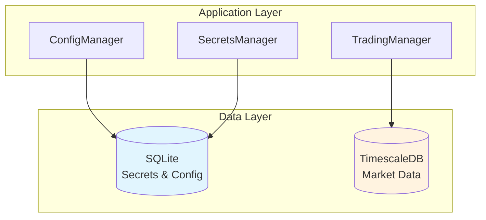
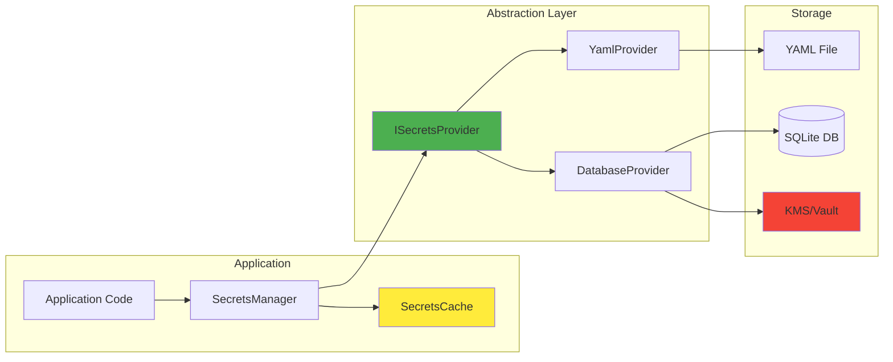
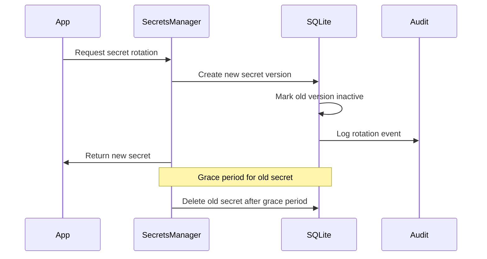

# Secrets Database Migration Strategy

## Overview

This document outlines the strategy for migrating CyberDelta's secrets management from YAML files to a database-backed solution. Given the project's future migration to time-series databases for trading data, we'll design a flexible approach that separates concerns appropriately.

## Database Architecture Decision

### Recommended Approach: Dual Database Strategy

1. **SQLite for Secrets & Configuration** (Immediate need)
   - Lightweight, serverless, perfect for key-value storage
   - Built-in encryption support (SQLCipher)
   - Zero operational overhead
   - Easy backup and migration

2. **TimescaleDB/InfluxDB for Trading Data** (Future)
   - Optimized for time-series data
   - High-performance ingestion
   - Built-in data retention policies
   - Time-based aggregations



## SQLite Schema Design

### Core Tables

```sql
-- Secrets storage with encryption and audit trail
CREATE TABLE secrets (
    id INTEGER PRIMARY KEY AUTOINCREMENT,
    key TEXT UNIQUE NOT NULL,           -- e.g., 'exchanges.hyperliquid.private_key'
    value BLOB NOT NULL,                -- Encrypted secret value
    environment TEXT DEFAULT 'mainnet', -- 'mainnet', 'testnet', 'all'
    created_at TIMESTAMP DEFAULT CURRENT_TIMESTAMP,
    updated_at TIMESTAMP DEFAULT CURRENT_TIMESTAMP,
    expires_at TIMESTAMP NULL,
    created_by TEXT NOT NULL,
    version INTEGER DEFAULT 1,
    is_active BOOLEAN DEFAULT TRUE,
    metadata JSON                       -- Additional context
);

-- Audit trail for compliance and debugging
CREATE TABLE secrets_audit (
    id INTEGER PRIMARY KEY AUTOINCREMENT,
    secret_id INTEGER NOT NULL,
    action TEXT NOT NULL,               -- 'created', 'read', 'updated', 'deleted', 'rotated'
    timestamp TIMESTAMP DEFAULT CURRENT_TIMESTAMP,
    user_id TEXT,
    ip_address TEXT,
    user_agent TEXT,
    old_value_hash TEXT,                -- SHA256 of old value for verification
    new_value_hash TEXT,                -- SHA256 of new value
    metadata JSON,
    FOREIGN KEY (secret_id) REFERENCES secrets(id)
);

-- Secret access policies
CREATE TABLE secret_policies (
    id INTEGER PRIMARY KEY AUTOINCREMENT,
    secret_key TEXT NOT NULL,
    policy_type TEXT NOT NULL,          -- 'rotation', 'access', 'expiry'
    policy_value JSON NOT NULL,
    created_at TIMESTAMP DEFAULT CURRENT_TIMESTAMP,
    FOREIGN KEY (secret_key) REFERENCES secrets(key)
);

-- Encryption keys table (for key rotation)
CREATE TABLE encryption_keys (
    id INTEGER PRIMARY KEY AUTOINCREMENT,
    key_id TEXT UNIQUE NOT NULL,
    encrypted_key BLOB NOT NULL,        -- Master key encrypted with KMS/HSM
    algorithm TEXT DEFAULT 'AES-256-GCM',
    created_at TIMESTAMP DEFAULT CURRENT_TIMESTAMP,
    rotated_at TIMESTAMP NULL,
    is_active BOOLEAN DEFAULT TRUE
);

-- Indexes for performance
CREATE INDEX idx_secrets_key ON secrets(key);
CREATE INDEX idx_secrets_environment ON secrets(environment);
CREATE INDEX idx_secrets_active ON secrets(is_active);
CREATE INDEX idx_audit_timestamp ON secrets_audit(timestamp);
CREATE INDEX idx_audit_secret_id ON secrets_audit(secret_id);
```

### Views for Convenience

```sql
-- Current active secrets view
CREATE VIEW active_secrets AS
SELECT 
    key,
    environment,
    updated_at,
    expires_at,
    version
FROM secrets
WHERE is_active = TRUE
  AND (expires_at IS NULL OR expires_at > CURRENT_TIMESTAMP);

-- Recent access patterns
CREATE VIEW recent_secret_access AS
SELECT 
    s.key,
    sa.action,
    sa.timestamp,
    sa.user_id
FROM secrets_audit sa
JOIN secrets s ON sa.secret_id = s.id
WHERE sa.timestamp > datetime('now', '-24 hours')
ORDER BY sa.timestamp DESC;
```

## Secret Key Structure

```yaml
# Hierarchical key naming convention
exchanges.hyperliquid.private_key
exchanges.hyperliquid.private_key_testnet
exchanges.backpack.api_key
exchanges.backpack.api_secret
notifications.telegram.bot_token
notifications.telegram.chat_id
logging.logfire.write_token
```

## Implementation Architecture



## Migration Plan

### Phase 1: Database Schema & Interface
```python
# secrets_provider.py
from abc import ABC, abstractmethod
from typing import Dict, Optional

class ISecretsProvider(ABC):
    @abstractmethod
    async def get_secret(self, key: str, environment: str = "mainnet") -> Optional[str]:
        pass
    
    @abstractmethod
    async def set_secret(self, key: str, value: str, environment: str = "mainnet") -> None:
        pass
    
    @abstractmethod
    async def delete_secret(self, key: str, environment: str = "mainnet") -> None:
        pass
    
    @abstractmethod
    async def list_secrets(self, prefix: str = "", environment: str = "mainnet") -> Dict[str, str]:
        pass
```

### Phase 2: SQLite Implementation
```python
# sqlite_secrets_provider.py
import sqlite3
from cryptography.fernet import Fernet
import json
from datetime import datetime

class SQLiteSecretsProvider(ISecretsProvider):
    def __init__(self, db_path: str, encryption_key: bytes):
        self.db_path = db_path
        self.cipher = Fernet(encryption_key)
        self._init_db()
    
    def _init_db(self):
        # Create tables if not exist
        with sqlite3.connect(self.db_path) as conn:
            conn.executescript(SCHEMA_SQL)
    
    async def get_secret(self, key: str, environment: str = "mainnet") -> Optional[str]:
        with sqlite3.connect(self.db_path) as conn:
            cursor = conn.execute(
                """
                SELECT value FROM secrets 
                WHERE key = ? AND environment IN (?, 'all') 
                AND is_active = TRUE
                AND (expires_at IS NULL OR expires_at > ?)
                ORDER BY environment DESC
                LIMIT 1
                """,
                (key, environment, datetime.utcnow())
            )
            row = cursor.fetchone()
            if row:
                encrypted_value = row[0]
                # Audit the access
                self._audit_access(conn, key, "read")
                return self.cipher.decrypt(encrypted_value).decode()
            return None
```

### Phase 3: Gradual Migration
```python
# hybrid_secrets_manager.py
class HybridSecretsManager(SecretsManager):
    """Supports both YAML and Database during migration"""
    
    def __init__(self, yaml_path: str, db_provider: Optional[ISecretsProvider] = None):
        self.yaml_provider = YamlSecretsProvider(yaml_path)
        self.db_provider = db_provider
        self.cache = TTLCache(maxsize=100, ttl=300)  # 5 min cache
    
    async def get_secret(self, key: str) -> str:
        # Check cache first
        if key in self.cache:
            return self.cache[key]
        
        # Try database first if available
        if self.db_provider:
            value = await self.db_provider.get_secret(key)
            if value:
                self.cache[key] = value
                return value
        
        # Fall back to YAML
        value = await self.yaml_provider.get_secret(key)
        self.cache[key] = value
        return value
```

## Security Features

### 1. Encryption at Rest
```python
# Using SQLCipher for transparent encryption
import sqlcipher3

conn = sqlcipher3.connect('secrets.db')
conn.execute("PRAGMA key = 'your-256-bit-key-here'")
conn.execute("PRAGMA cipher_compatibility = 4")
```

### 2. Secret Rotation


### 3. Access Control
```sql
-- Role-based access control
CREATE TABLE secret_permissions (
    id INTEGER PRIMARY KEY,
    role TEXT NOT NULL,
    secret_pattern TEXT NOT NULL,  -- e.g., 'exchanges.*'
    can_read BOOLEAN DEFAULT TRUE,
    can_write BOOLEAN DEFAULT FALSE,
    can_delete BOOLEAN DEFAULT FALSE
);
```

## Monitoring & Observability

### Metrics to Track
```sql
-- Secret access frequency
SELECT 
    key,
    COUNT(*) as access_count,
    DATE(timestamp) as date
FROM secrets_audit
WHERE action = 'read'
GROUP BY key, DATE(timestamp);

-- Rotation compliance
SELECT 
    s.key,
    MAX(sa.timestamp) as last_rotation,
    JULIANDAY('now') - JULIANDAY(MAX(sa.timestamp)) as days_since_rotation
FROM secrets s
LEFT JOIN secrets_audit sa ON s.id = sa.secret_id AND sa.action = 'rotated'
GROUP BY s.key
HAVING days_since_rotation > 90;  -- Alert if not rotated in 90 days
```

## Database Comparison

| Feature | SQLite | TimescaleDB | InfluxDB |
|---------|---------|-------------|----------|
| **Secrets Storage** | ✅ Excellent | ❌ Overkill | ❌ Not designed for |
| **Time-Series Data** | ❌ Limited | ✅ Excellent | ✅ Excellent |
| **Encryption** | ✅ SQLCipher | ✅ Enterprise | ⚠️ Limited |
| **Operational Complexity** | ✅ None | ⚠️ Moderate | ⚠️ Moderate |
| **Backup/Restore** | ✅ File copy | ✅ pg_dump | ✅ Built-in |
| **ACID Compliance** | ✅ Full | ✅ Full | ❌ Eventual |
| **Resource Usage** | ✅ Minimal | ⚠️ Higher | ⚠️ Moderate |

## Implementation Timeline

1. **Week 1**: Set up SQLite schema and encryption
2. **Week 2**: Implement ISecretsProvider interface and SQLiteSecretsProvider
3. **Week 3**: Add caching, audit logging, and monitoring
4. **Week 4**: Implement HybridSecretsManager for gradual migration
5. **Week 5**: Testing and security audit
6. **Week 6**: Production rollout with fallback

## Future Considerations

### When to Migrate Secrets to TimeSeries DB
- **Don't**: Secrets are not time-series data
- **Do**: Keep configuration/secrets in SQLite
- **Do**: Use TimescaleDB for market data, positions, trades

### Integration with Cloud KMS
```python
# Future enhancement: Use AWS KMS or HashiCorp Vault
class KMSSecretsProvider(ISecretsProvider):
    def __init__(self, kms_client):
        self.kms = kms_client
    
    async def get_secret(self, key: str) -> str:
        # Fetch from KMS/Vault
        return await self.kms.get_secret_value(SecretId=key)
```

## Conclusion

The SQLite-based approach provides:
- ✅ Immediate security improvements
- ✅ Zero operational overhead
- ✅ Easy migration path
- ✅ Clear separation of concerns
- ✅ Future-proof architecture

This allows CyberDelta to enhance security now while keeping options open for time-series database adoption for trading data later.