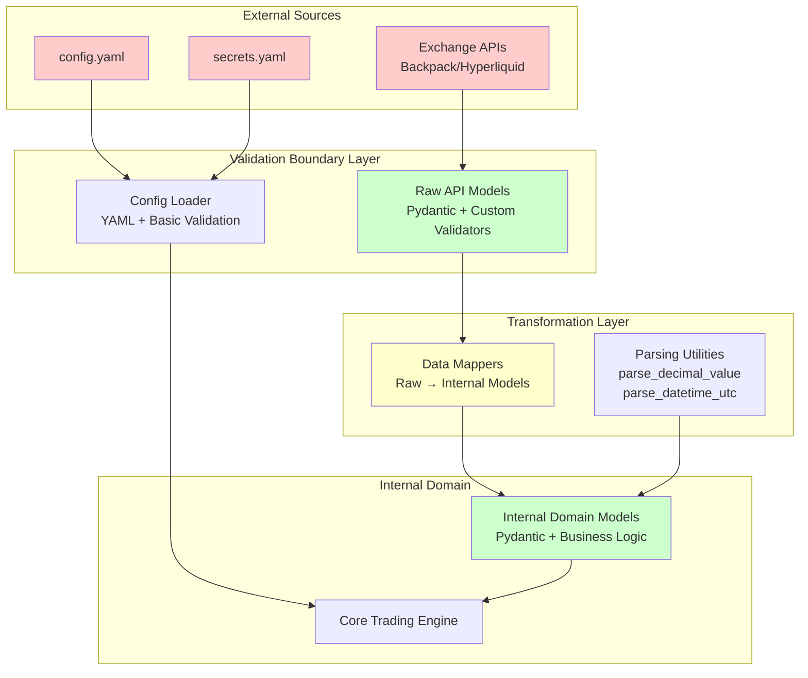

# Comprehensive Security Vulnerability Assessment
## CyberDeltaEngine Data Flow and Sanitization Analysis

**Assessment Date:** 2025-06-16  
**Scope:** Complete data flow from raw API responses to internal models  
**Critical Focus:** Security vulnerabilities in current sanitization approach  

---

## Executive Summary

The CyberDeltaEngine exhibits a **multi-layered security architecture** with both strengths and critical vulnerabilities. While the system demonstrates sophisticated validation at the Raw API Model boundary and defensive programming patterns in mappers, **significant security gaps exist** that could lead to financial loss, system compromise, and operational disruption.

**Risk Classification:** **HIGH** - Critical vulnerabilities identified with potential for severe business impact.

---

## 1. Data Flow Architecture Analysis

### 1.1 Current Architecture Overview



### 1.2 Trust Boundaries Identified

1. **External API Responses** → Raw API Models
2. **Configuration Files** → Application Settings
3. **Raw API Models** → Internal Domain Models
4. **Internal Models** → Core Trading Logic

---

## 2. Critical Security Vulnerabilities

### 2.1 Bypass of Pydantic Validation in Mappers ⚠️ **CRITICAL**

**Vulnerability Description:**
The transformation layer bypasses Pydantic validation by directly instantiating internal models with unvalidated data, creating a critical security gap.

**Evidence:**
```python
# From bp_account_data_mapper.py:461
return MarginAccountSummary(
    exchange=ExchangeName.BACKPACK.value,  # ❌ Raw string, bypasses enum validation
    timestamp=datetime.now(UTC),
    total_equity=calculated_total_equity,   # ❌ Could be corrupted calculation
    # ... other fields directly assigned without validation
)
```

**Attack Vectors:**
- **Data Type Confusion:** Malicious API responses could provide unexpected types that pass initial parsing but corrupt internal calculations
- **Business Logic Bypass:** Direct instantiation bypasses field validators that enforce business rules
- **State Corruption:** Invalid data can propagate through the system undetected

**Impact:** **CRITICAL**
- Financial loss through corrupted balance/position data
- System instability from invalid state
- Potential for exploitation of business logic flaws

### 2.2 Weak Configuration Validation ⚠️ **HIGH**

**Vulnerability Description:**
Configuration validation only checks for section presence, not value validity, allowing malicious configuration injection.

**Evidence:**
```python
# From security reports - config validation only checks:
def _validate_config(self) -> bool:
    # Only checks for section presence and boolean flags
    # NO validation of URLs, timeouts, numerical limits, etc.
    return True  # Returns True even if values are malformed
```

**Attack Vectors:**
- **Malicious URL Injection:** Attacker could redirect API calls to malicious endpoints
- **Resource Exhaustion:** Invalid timeout/rate limit values could cause DoS
- **Parameter Tampering:** Strategy parameters could be modified to cause losses

**Impact:** **HIGH**
- Redirection of trading operations to attacker-controlled endpoints
- Denial of service through resource exhaustion
- Financial losses through manipulated trading parameters

### 2.3 Insufficient Numeric Validation ⚠️ **HIGH**

**Vulnerability Description:**
While basic finite decimal validation exists, business logic constraints are not enforced at the validation boundary.

**Evidence:**
```python
# Raw models validate finite decimals but not business constraints:
def _validate_raw_parsable_finite_decimal_string(v: object, info: ValidationInfo) -> str:
    # ✅ Validates finite decimal
    # ❌ No validation of: price > 0, quantity > 0, reasonable ranges
    if not d.is_finite():
        raise ValueError("Value must be a finite decimal")
    return s
```

**Attack Vectors:**
- **Negative Price/Quantity Injection:** Could bypass trading logic safety checks
- **Extreme Value Attacks:** Very large/small values could cause calculation overflow/underflow
- **Zero Value Exploitation:** Zero prices/quantities could corrupt financial calculations

**Impact:** **HIGH**
- Arithmetic errors leading to incorrect trading decisions
- Potential for financial exploitation through edge case manipulation
- System instability from calculation errors

### 2.4 Error Message Information Disclosure ⚠️ **MEDIUM**

**Vulnerability Description:**
Detailed error messages in validation failures could leak sensitive system information.

**Evidence:**
```python
# From parsing utilities:
raise ValueError(f"{prefix}Cannot convert '{value}' to Decimal: {e}") from e
# Could expose internal data structures and processing details
```

**Attack Vectors:**
- **System Reconnaissance:** Error messages reveal internal structure and data formats
- **Data Extraction:** Validation errors might expose sensitive configuration or state information

**Impact:** **MEDIUM**
- Information disclosure that aids further attacks
- Potential exposure of sensitive trading parameters or system architecture

### 2.5 Race Conditions in Mapper Transformations ⚠️ **MEDIUM**

**Vulnerability Description:**
Mapper methods are not thread-safe and could produce corrupted data under concurrent access.

**Evidence:**
```python
# Mappers use shared state without synchronization:
calculated_total_equity = Decimal("0.0")  # ❌ No thread safety
for sb in internal_spot_balances:
    calculated_total_equity += sb.total_quantity  # ❌ Race condition possible
```

**Attack Vectors:**
- **Concurrent Modification:** Multiple threads processing data simultaneously could corrupt calculations
- **State Inconsistency:** Race conditions could lead to inconsistent financial data

**Impact:** **MEDIUM**
- Inconsistent financial calculations
- Potential for exploitation through timing attacks
- System instability under high load

---

## 3. Business Logic Vulnerabilities

### 3.1 Zero-Value Handling Inconsistencies ⚠️ **HIGH**

**Vulnerability Description:**
Inconsistent handling of zero values across the system could lead to financial calculation errors.

**Evidence:**
```python
# Inconsistent zero handling:
if price <= Decimal("0") or quantity <= Decimal("0"):
    logger.warning(f"Skipping trade {raw_fill.trade_id}")
    return None  # ❌ Silently drops data - could miss important events
```

**Attack Vectors:**
- **Zero-Value Exploitation:** Attacker could force zero values to bypass certain checks
- **Data Loss:** Important events might be silently dropped instead of properly handled

### 3.2 Timestamp Manipulation Vulnerabilities ⚠️ **MEDIUM**

**Vulnerability Description:**
Flexible timestamp parsing could be exploited to manipulate event ordering or create temporal inconsistencies.

**Evidence:**
```python
# Accepts multiple timestamp formats without strict validation:
def _validate_raw_flexible_timestamp(v: object, info: ValidationInfo) -> int | float | str:
    # Accepts int, float, or ISO string
    # Could lead to inconsistent temporal ordering
```

**Attack Vectors:**
- **Temporal Confusion:** Different timestamp formats could cause ordering issues
- **Replay Attacks:** Manipulation of timestamps could enable replay of old events

---

## 4. Denial of Service Vulnerabilities

### 4.1 Unbounded Memory Usage ⚠️ **HIGH**

**Vulnerability Description:**
No limits on data structure sizes could lead to memory exhaustion attacks.

**Evidence:**
```python
# No size limits on collections:
internal_spot_balances = [
    # ❌ No limit on number of balances that could be processed
    BackpackAccountDataMapper.transform_raw_balance_to_internal(symbol, bal_raw)
    for symbol, bal_raw in spot_balances_raw.items()  # ❌ Unbounded iteration
]
```

**Attack Vectors:**
- **Memory Exhaustion:** Malicious API responses with excessive data could exhaust system memory
- **CPU Resource Attacks:** Large data sets could cause CPU exhaustion during processing

### 4.2 Infinite Loop Potential ⚠️ **MEDIUM**

**Vulnerability Description:**
Complex validation logic could potentially create infinite loops under certain malformed inputs.

---

## 5. Injection and Manipulation Risks

### 5.1 String Field Injection ⚠️ **MEDIUM**

**Vulnerability Description:**
While basic string validation exists, special character handling could be exploited.

**Evidence:**
```python
# Basic string validation might not handle all injection vectors:
def validate_str_field(value: object, field_name: str = "", max_length: int | None = None, allow_empty: bool = False) -> str:
    # ✅ Validates UTF-8 
    # ⚠️ No validation of special characters, control sequences, etc.
```

### 5.2 Enum Value Manipulation ⚠️ **LOW**

**Vulnerability Description:**
While enum validation exists at the raw level, internal model creation bypasses these checks.

---

## 6. Risk Assessment Matrix

| Vulnerability | Likelihood | Impact | Risk Level | Business Impact |
|---------------|------------|--------|------------|----------------|
| Pydantic Validation Bypass | High | Critical | **CRITICAL** | Financial Loss, System Compromise |
| Configuration Validation | Medium | High | **HIGH** | Operational Disruption, Security Bypass |
| Numeric Validation Gaps | Medium | High | **HIGH** | Financial Loss, Calculation Errors |
| Memory Exhaustion | Low | High | **MEDIUM** | System Downtime, DoS |
| Race Conditions | Low | Medium | **MEDIUM** | Data Corruption, Inconsistent State |
| Information Disclosure | Medium | Low | **MEDIUM** | Security Reconnaissance |
| Timestamp Manipulation | Low | Medium | **LOW** | Event Ordering Issues |

---

## 7. Attack Scenarios

### 7.1 High-Impact Attack: Financial Data Manipulation

**Scenario:** Attacker manipulates API responses to inject corrupted financial data
1. Attacker compromises exchange API or performs MITM attack
2. Injects malformed balance data that passes basic validation
3. Mapper bypasses Pydantic validation during internal model creation
4. Corrupted balance data propagates to trading logic
5. System makes incorrect trading decisions based on false data
6. **Result:** Significant financial losses

### 7.2 Medium-Impact Attack: Configuration Poisoning

**Scenario:** Attacker modifies configuration files
1. Attacker gains access to configuration files (insider threat, compromised system)
2. Modifies API URLs to point to attacker-controlled endpoints
3. Changes trading parameters to favor attacker positions
4. Weak validation allows malicious configuration to load
5. **Result:** Redirection of trading operations, financial losses

### 7.3 Low-Impact Attack: Information Gathering

**Scenario:** Attacker uses verbose error messages for reconnaissance
1. Attacker sends malformed data to trigger validation errors
2. Error messages reveal internal structure and data formats
3. Information used to craft more sophisticated attacks
4. **Result:** Enhanced attack capability

---

## 8. Critical Security Recommendations

### 8.1 Immediate Actions (Critical Priority)

1. **Implement Schema Validation at All Boundaries**
   ```python
   # Example implementation:
   @staticmethod
   def create_validated_internal_model(raw_data: dict) -> InternalModel:
       # Force Pydantic validation instead of direct instantiation
       return InternalModel.model_validate(raw_data)
   ```

2. **Enhance Configuration Validation**
   ```python
   # Implement comprehensive config schema validation:
   class ConfigSchema(BaseModel):
       exchanges: ExchangeConfigDict
       strategies: StrategyConfigDict
       # ... with full validation rules
   ```

3. **Add Business Logic Constraints to Raw Models**
   ```python
   # Example enhanced validation:
   @field_validator('price')
   def validate_price_positive(cls, v):
       if v <= 0:
           raise ValueError("Price must be positive")
       return v
   ```

### 8.2 Short-term Improvements (High Priority)

1. **Implement Input Sanitization**
   - Add strict bounds checking for all numeric fields
   - Implement whitelist validation for string fields
   - Add size limits for collections and strings

2. **Enhance Error Handling**
   - Implement secure error messages that don't leak sensitive information
   - Add comprehensive logging for security events
   - Implement rate limiting for error-triggering requests

3. **Add Thread Safety**
   - Implement thread-safe mapper operations
   - Add synchronization for shared state access
   - Use immutable data structures where possible

### 8.3 Long-term Security Hardening (Medium Priority)

1. **Implement Security Monitoring**
   - Add anomaly detection for unusual data patterns
   - Implement alerting for validation failures
   - Add security event logging and analysis

2. **Enhance Cryptographic Security**
   - Implement additional signature verification
   - Add nonce validation and replay protection
   - Enhance key management practices

3. **Implement Defense in Depth**
   - Add multiple validation layers
   - Implement circuit breakers for security events
   - Add automated threat response capabilities

---

## 9. Implementation Priority

### Phase 1 (Immediate - 1-2 weeks)
- Fix Pydantic validation bypass in mappers
- Implement basic business logic constraints
- Enhance configuration validation

### Phase 2 (Short-term - 2-4 weeks)  
- Add comprehensive input sanitization
- Implement thread safety measures
- Enhance error handling security

### Phase 3 (Medium-term - 1-2 months)
- Implement security monitoring
- Add anomaly detection
- Complete defense-in-depth implementation

---

## 10. Conclusion

The CyberDeltaEngine demonstrates a sophisticated understanding of security principles with strong validation at the Raw API Model boundary. However, **critical vulnerabilities exist in the transformation layer** that could lead to significant financial losses and system compromise.

The **bypass of Pydantic validation in mappers** represents the most critical security risk, as it allows unvalidated data to enter the core trading logic. Combined with weak configuration validation and incomplete business logic constraints, these vulnerabilities create a significant attack surface.

**Immediate action is required** to address the critical vulnerabilities, particularly the validation bypass issues. The recommended phased approach will systematically address the identified risks while maintaining system functionality.

**Overall Security Rating: HIGH RISK** - Requires immediate attention to prevent potential financial losses and system compromise.