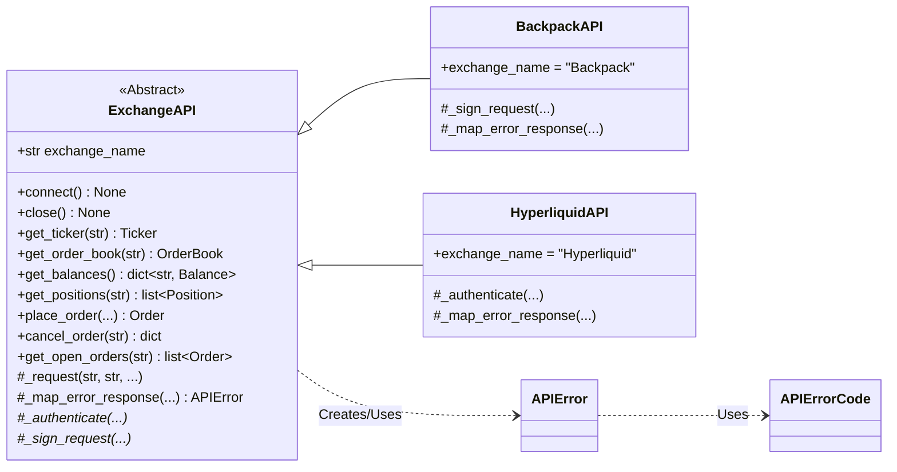
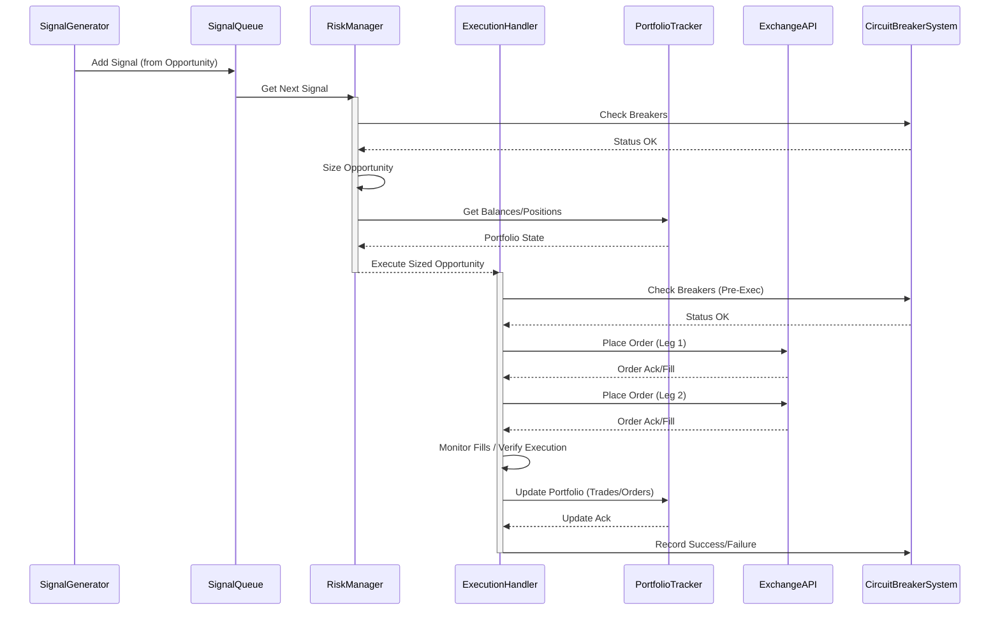

# Code Relationships

## Core Components Overview
```mermaid
graph TD
    subgraph ApplicationEntry["Application Entry (main.py)"]
        Main[main.py]
    end

    subgraph User/System
        ConfigFile[Config File] --> Main
        SecretsFile[Secrets File] --> Main
        InputData[Market Data] --> DataHandler
        Engine --> Output[Signals / Orders / Logs]
    end

    subgraph CoreEngine
        Engine
        DataHandler
        StrategyManager
        SignalGenerator
        SignalQueue
        RiskManager
        ExecutionHandler
        PortfolioTracker
        BalanceMonitor
        StateManager
        Strategy(Strategy ABC)
        FundingRateArbitrageStrategy
    end

    subgraph ExternalSystems
        APIs(Exchange APIs)
        ValidationSystems
        MonitoringSystems
    end

    Main -- Creates/Configures --> StateManager
    Main -- Creates/Configures --> Config((load_config))
    Main -- Creates/Configures --> PortfolioTracker
    Main -- Creates/Configures --> CircuitBreakerSystem(ValidationSystems)
    Main -- Creates/Configures --> ExecutionHandler
    Main -- Creates/Configures --> RiskManager
    Main -- Creates/Configures --> SignalQueue
    Main -- Creates/Configures --> Engine
    Main -- Creates/Configures --> DataHandler
    Main -- Creates/Uses --> APIs
    Main -- Creates/Configures --> FundingRateArbitrageStrategy

    Engine --> DataHandler : Gets Data Updates
    Engine --> StrategyManager : Manages
    Engine --> SignalQueue : Sends Signals
    Engine --> PortfolioTracker : Gets State
    Engine --> BalanceMonitor : Gets State

    StrategyManager --> Strategy : Manages
    FundingRateArbitrageStrategy --|> Strategy

    DataHandler --> Engine : Notifies Observer
    DataHandler --> APIs : Subscribes/Fetches
    DataHandler --> SignalGenerator : Provides Data

    SignalGenerator --> DataHandler : Uses Data
    SignalGenerator -- Generates --> ArbitrageOpportunity
    SignalGenerator --> SignalQueue : Enqueues Signal

    SignalQueue --> RiskManager : Sends Signal

    RiskManager -- Sizes --> ArbitrageOpportunity
    RiskManager -- Creates --> SizedOpportunity
    RiskManager --> PortfolioTracker : Gets State
    RiskManager --> ExecutionHandler : Sends Order
    RiskManager --> ValidationSystems

    ExecutionHandler -- Executes --> SizedOpportunity
    ExecutionHandler --> PortfolioTracker : Updates State
    ExecutionHandler --> APIs : Places Orders
    ExecutionHandler --> ValidationSystems

    PortfolioTracker -- Tracks --> Balance
    PortfolioTracker -- Tracks --> Position
    PortfolioTracker -- Tracks --> Order
    PortfolioTracker --> APIs : Fetches Data
    PortfolioTracker --> ValidationSystems
    PortfolioTracker --> StateManager : Load/Save State

    BalanceMonitor --> PortfolioTracker

    StateManager -- Handles --> StateFile[engine_state.json]

    CoreEngine -- Reports to --> MonitoringSystems

    FundingRateArbitrageStrategy -- Uses --> MarketData
    FundingRateArbitrageStrategy -- Uses --> FundingRate
```

## API Class Hierarchy


## Strategy Management
```mermaid
graph TD
    StrategyManager --> Strategy(Strategy ABC)
    Strategy --> TradeSignal
    StrategyManager -- Manages --> FundingRateArbitrageStrategy
    FundingRateArbitrageStrategy --|> Strategy
    FundingRateArbitrageStrategy -- Uses --> MarketData
    FundingRateArbitrageStrategy -- Uses --> FundingRate
    FundingRateArbitrageStrategy -- Uses --> Ticker
    FundingRateArbitrageStrategy -- Creates --> ArbitrageOpportunity
    FundingRateArbitrageStrategy -- Creates --> TradeSignal
    Engine --> StrategyManager : Routes MarketData
    StrategyManager --> SignalQueue : Sends Signals
```

## Opportunity Execution Data Flow (Simplified Sequence)


## Configuration Management
```mermaid
graph TD
    Main[main.py] -- Uses --> UtilConfig(utils.config.load_config)
    UtilConfig -- Creates --> ConfigObject((Config Data))
    UtilConfig -- Reads --> ConfigFile[config.yaml]
    UtilConfig -- Reads --> EnvVars[(Environment Variables)]

    Main -- Uses --> SecretsManager(config.SecretsManager)
    SecretsManager -- Loads --> SecretsFile[secrets.yaml]
    SecretsManager -- Reads --> EnvVars
    SecretsManager --> SecretsObject((Secrets Data))

    Main -- Gets Data --> ConfigObject
    Main -- Gets Data --> SecretsObject

    CoreComponent --> Main : Receives Config/Secrets
```

## Validation Systems
```mermaid
graph TD
    Main[main.py] -- Creates/Configures --> CBS
    subgraph Validation
        CBS[CircuitBreakerSystem]
        PRS[PositionReconciliationSystem]
        FRV[FundingRateValidator]
        MTFP[MultiTierFundingProvider]
    end
    subgraph Core
       RM[RiskManager]
       EH[ExecutionHandler]
       PT[PortfolioTracker]
       SG[SignalGenerator]
       Engine
    end
    RM --> CBS : Check Breakers
    EH --> CBS : Check/Record Breakers
    RM --> FRV : Get Validation Factor
    Engine -- Periodically Runs --> PRS
    PRS --> PT : Reads Local State
    PRS --> ExchangeAPI : Reads Exchange State
    SG --> MTFP : Get Funding Rate
    MTFP --> FRV : Records Prediction/Payment
    MTFP --> ExchangeAPI : Fetch Rates