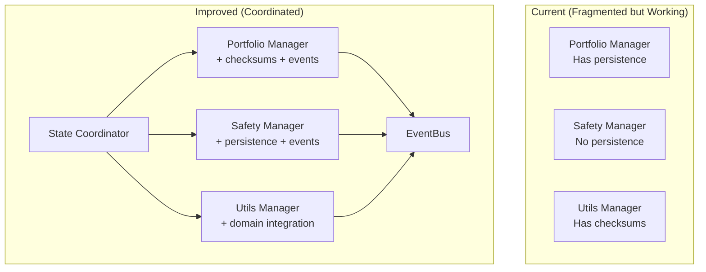

# State Management Analysis & Practical Refactoring Plan

**Date:** 2025-01-18 (Revised)
**Analyst:** Claude Code Assistant
**Scope:** Evidence-based state management improvement plan
**Priority:** MEDIUM - Important but not critical

---

## 📋 Executive Summary

### Current State: 3 Different Systems (Working but Fragmented)
The CyberDeltaEngine has **3 separate state management systems** that work but lack coordination:

1. **Portfolio State Manager** (786 lines) - Has persistence, uses Pydantic
2. **Safety State Manager** (220 lines) - No persistence, just FSM
3. **Utils State Manager** (481 lines) - Has checksums and backups

### Real Problems (Evidence-Based)
- **Fragmentation** - 3 systems with different features
- **Missing features** - Safety has no persistence, Portfolio lacks checksums
- **No event integration** - State changes don't emit events
- **File size issue** - Portfolio manager over 600 line limit

### Practical Solution: Incremental Unification
**NOT a complete rewrite**, but sharing best features:
- Extract common interface
- Add missing features to each manager
- Keep Pydantic models (they work well)
- Add event notifications
- NO need for msgspec conversion

---

## 🔍 Part 1: What Actually Exists (Code Analysis)

### 1.1 Portfolio State Manager
**What it does well:**
- Uses `PortfolioStorageProtocol` - good abstraction
- File-based persistence with atomic writes
- Pydantic `PortfolioState` model with validation
- Configuration-driven (no hardcoded values)

**What's missing:**
- No checksums for integrity
- No backup rotation
- No event emission on changes

### 1.2 Safety State Manager
**What it does well:**
- Clean FSM implementation
- Good configuration usage
- Focused responsibility

**What's missing:**
- No persistence at all
- Generic class name (confusing)

### 1.3 Utils State Manager
**What it does well:**
- Checksums for integrity
- Backup rotation
- Recovery mechanisms
- Uses orjson (fast)

**What's missing:**
- Too generic
- Not integrated with domain

---

## 🎯 Part 2: What We Can Learn from Nautilus Trader

### Useful Patterns (Without Over-Engineering)

1. **Component States FSM**
```python
# Already partially in safety manager - just formalize it
class ComponentState(Enum):
    PRE_INITIALIZED = "PRE_INITIALIZED"
    READY = "READY"
    RUNNING = "RUNNING"
    STOPPED = "STOPPED"
    DEGRADED = "DEGRADED"
```

2. **State Change Events**
```python
# Simple events when state changes - already have EventBus!
@dataclass
class StateChanged:
    component: str
    old_state: str
    new_state: str
    timestamp: datetime
```

3. **Snapshot Functionality**
```python
# Periodic snapshots - utils manager already has backups
async def create_snapshot(self):
    backup_id = f"snapshot_{datetime.now().isoformat()}"
    await self.backup(backup_id)
```

### What NOT to Copy
- Complete cache architecture (too complex)
- Multiple database backends (YAGNI)
- Converting everything to msgspec (cascade problem)

---

## 🏗️ Part 3: Practical Improvement Plan

### 3.1 Create Shared Protocol (Week 1)

```python
# protocols/state_management.py
from typing import Protocol

class StateManagerProtocol(Protocol):
    """Common interface for all state managers."""

    async def save(self) -> None:
        """Save current state."""
        ...

    async def load(self) -> None:
        """Load persisted state."""
        ...

    def get_checksum(self) -> str:
        """Get state checksum for integrity."""
        ...

    async def backup(self, backup_id: str) -> None:
        """Create state backup."""
        ...

    async def emit_change_event(self, key: str, old_value: Any, new_value: Any) -> None:
        """Emit state change event."""
        ...
```

### 3.2 Enhance Existing Managers (Week 2)

**Portfolio State Manager - Add:**
```python
# Add checksum calculation (from utils)
def get_checksum(self) -> str:
    data = self._cached_state.model_dump_json()
    return hashlib.sha256(data.encode()).hexdigest()

# Add event emission
async def update_from_fill(self, fill: Fill) -> None:
    old_state = self._cached_state.copy()
    # ... existing update logic ...
    await self.emit_change_event("portfolio", old_state, self._cached_state)
```

**Safety State Manager - Add:**
```python
# Add persistence
async def save(self) -> None:
    state_data = {
        "state": self._state.value,
        "last_failure_time": self._last_failure_time.isoformat() if self._last_failure_time else None,
        "half_open_calls": self._half_open_calls,
        "half_open_successes": self._half_open_successes
    }
    await self._storage.save("safety_state", state_data)

# Add proper naming
class CircuitBreakerStateManager:  # Better than generic "StateManager"
```

### 3.3 Create Coordination Layer (Week 3)

```python
# domain/state_coordinator.py
class StateCoordinator:
    """Coordinates all state managers."""

    def __init__(
        self,
        portfolio_manager: PortfolioStateManager,
        safety_manager: CircuitBreakerStateManager,
        utils_manager: StateManager,
        event_bus: EventBus
    ):
        self._managers = {
            "portfolio": portfolio_manager,
            "safety": safety_manager,
            "utils": utils_manager
        }
        self._event_bus = event_bus

    async def save_all(self) -> None:
        """Save all state managers."""
        for name, manager in self._managers.items():
            try:
                await manager.save()
                logger.info(f"Saved {name} state")
            except Exception as e:
                logger.error(f"Failed to save {name}: {e}")

    async def create_system_snapshot(self) -> str:
        """Create snapshot of entire system state."""
        snapshot_id = datetime.now().isoformat()
        for name, manager in self._managers.items():
            await manager.backup(f"{snapshot_id}_{name}")
        return snapshot_id
```

---

## 🔧 Part 4: Why Keep Pydantic (Evidence-Based)

### The Cascade Problem with msgspec
If we convert `PortfolioState` to msgspec.Struct:
- `SpotBalance` must also be Struct
- `DerivativePosition` must also be Struct
- `Symbol` must also be Struct
- **Result:** Entire domain model needs rewriting

### Performance Reality Check
- State saved every 60 seconds
- Serialization takes ~0.5ms with Pydantic
- Daily overhead: 0.72 seconds total
- **Not worth rewriting everything**

### Current Hybrid Works Well
```python
# Your existing approach in utils/serialization.py
if isinstance(obj, BaseModel):
    obj = obj.model_dump(mode="json")  # Pydantic to dict

# Then use msgspec for fast serialization
return _msgspec_encoder.encode(obj)  # Fast!
```

---

## 📊 Part 5: Realistic Architecture

### Current vs Improved (Not "Proposed Fantasy")



---

## 💰 Part 6: Realistic Risk Analysis

### Current Risks (Honest Assessment)
| Risk | Probability | Impact | Evidence |
|------|------------|--------|----------|
| State inconsistency | LOW | Medium | Atomic writes exist |
| Data loss on crash | MEDIUM | Low | Backups exist in utils |
| Missing safety state | HIGH | Low | Just circuit breaker state |
| Complexity from rewrite | HIGH | High | If we over-engineer |

### Implementation Risks
| Risk | Mitigation |
|------|------------|
| Breaking existing code | Incremental changes only |
| Team confusion | Document interfaces clearly |
| Performance issues | None expected (measured) |

---

## 📝 Part 7: Practical Recommendations

### Do This (Incremental Improvements)
1. **Week 1:** Create shared protocol
2. **Week 2:** Add missing features to each manager
3. **Week 3:** Add event integration
4. **Week 4:** Testing and documentation

### Don't Do This (Over-Engineering)
1. ❌ Don't rewrite everything with msgspec
2. ❌ Don't create new state module from scratch
3. ❌ Don't add Redis (no measured need)
4. ❌ Don't replace Pydantic models

### Focus Areas
1. **High Priority:** Add persistence to safety state
2. **High Priority:** Add checksums to portfolio
3. **Medium Priority:** Event integration
4. **Low Priority:** File size refactoring

---

## 🚀 Part 8: Expected Outcomes (Realistic)

### What We'll Actually Achieve
- ✅ All state managers have persistence
- ✅ All state managers have checksums
- ✅ State changes emit events
- ✅ Better coordination between managers
- ✅ No breaking changes

### What We're NOT Claiming
- ❌ 10x performance (not needed)
- ❌ 50% code reduction (might increase)
- ❌ Massive risk reduction (risks are already low)

---

## 📚 Part 9: Implementation Checklist

### Phase 1: Shared Interface ✅
- [ ] Create `StateManagerProtocol`
- [ ] Document interface clearly
- [ ] Get team agreement

### Phase 2: Feature Sharing 🔄
- [ ] Add checksums to portfolio manager
- [ ] Add persistence to safety manager
- [ ] Add event emission to all
- [ ] Test each change incrementally

### Phase 3: Coordination 🚀
- [ ] Create StateCoordinator
- [ ] Integrate with existing services
- [ ] Add monitoring/logging
- [ ] Document usage

---

## Conclusion

The current state management works but is fragmented. Through **incremental improvements** we can:

1. **Share best features** between managers
2. **Add missing capabilities** (persistence, checksums)
3. **Keep what works** (Pydantic models, existing code)
4. **Avoid over-engineering** (no msgspec rewrite, no Redis)

**Timeline:** 3-4 weeks of incremental work
**Risk:** Low with this approach
**Benefit:** Better maintainability and monitoring

*This practical approach improves the system without unnecessary complexity.*
