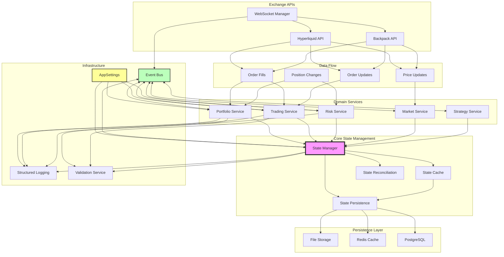
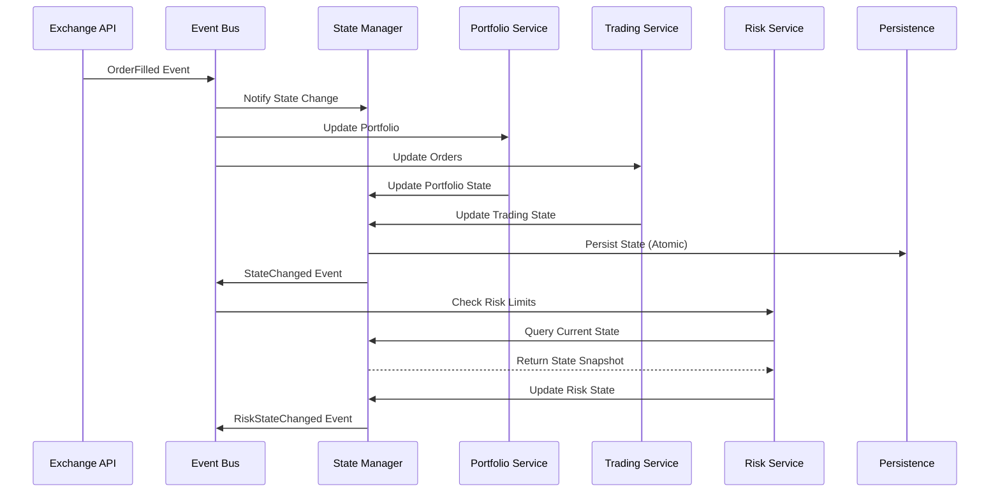
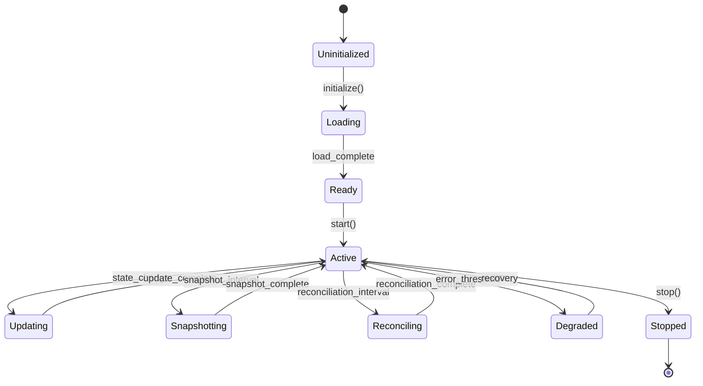
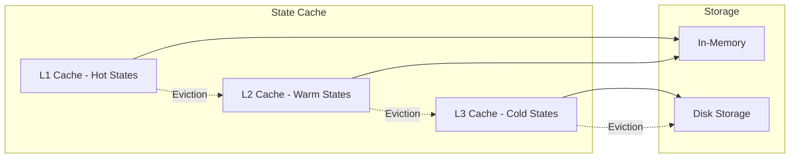

# State Manager Module Connections

## Complete System Architecture with State Manager

This document illustrates how the unified state manager integrates with all existing modules in CyberDeltaEngine.

## Module Connection Diagram



## Event Flow Sequence



## State Lifecycle



## Integration with New Business Logic Architecture

Based on the `workflow/new_business_logic_architecture/clean_new_arch.md`, the state manager fits into the architecture as follows:

### 1. **Configuration-First Principle**
The state manager fully embraces the configuration-first approach:
```python
class StateManager:
    def __init__(self, config: AppSettings):
        # All behavior driven by configuration
        self.snapshot_interval = config.state.snapshot_interval_seconds
        self.reconciliation_interval = config.state.reconciliation_interval_seconds
        self.cache_config = config.state.cache
```

### 2. **Structured Logging Integration**
Following the logging requirements:
```python
import structlog
from cyberdelta.logging.logging_helpers import log_trading_event

logger = structlog.get_logger(__name__)

class StateManager:
    async def update_state(self, state_id: str, updates: dict):
        log_trading_event(
            logger,
            "state_updated",
            state_id=state_id,
            version=state.version,
            exclude_sensitive=True
        )
```

### 3. **Event-Driven Architecture**
The state manager is a core participant in the event-driven system:
- **Publishes**: StateChanged, StateReconciled, StatePersisted events
- **Subscribes**: OrderFilled, PositionOpened, RiskViolation events
- **Priority Handling**: Critical state updates use HIGH priority

### 4. **Domain Boundaries**
While unified, the state manager respects domain boundaries:
- Portfolio state managed by PortfolioService
- Trading state managed by TradingService
- Risk state managed by RiskService
- Each domain owns its state logic, state manager provides infrastructure

## Key Integration Points

### 1. Portfolio Management
```python
class PortfolioService:
    async def process_fill(self, fill: Fill):
        # Get state from manager
        state = await self.state_manager.get_state("portfolio")

        # Update using domain logic
        state.update_from_fill(fill)

        # Persist through manager
        await self.state_manager.update_state("portfolio", state)
```

### 2. Risk Management
```python
class RiskService:
    async def check_limits(self):
        # Query multiple states
        portfolio = await self.state_manager.get_state("portfolio")
        trading = await self.state_manager.get_state("trading")

        # Perform risk checks
        violations = self.calculate_violations(portfolio, trading)

        # Update risk state
        risk_state = await self.state_manager.get_state("risk")
        risk_state.violations = violations
        await self.state_manager.update_state("risk", risk_state)
```

### 3. Trading Engine
```python
class TradingEngine:
    async def execute_order(self, order: Order):
        # Check current state
        trading_state = await self.state_manager.get_state("trading")

        if trading_state.can_execute(order):
            # Execute order
            result = await self.send_order(order)

            # Update state
            trading_state.add_active_order(order)
            await self.state_manager.update_state("trading", trading_state)
```

## Performance Optimizations

### 1. Cache Architecture


### 2. Batch Processing
- Batch state updates every N milliseconds
- Aggregate multiple changes before persistence
- Reduce event bus traffic with consolidated events

### 3. Lazy Loading
- Load states on-demand
- Preload critical states on startup
- Background loading for anticipated states

## Monitoring and Observability

### Key Metrics
```python
class StateMetrics:
    # Operation metrics
    state_updates_total: Counter
    state_queries_total: Counter
    cache_hits: Counter
    cache_misses: Counter

    # Performance metrics
    update_latency: Histogram
    query_latency: Histogram
    persistence_latency: Histogram

    # Health metrics
    reconciliation_failures: Counter
    state_corruption_detected: Counter
    recovery_attempts: Counter
```

### Health Checks
```python
class StateHealthCheck:
    async def check_health(self) -> HealthStatus:
        checks = [
            self.check_cache_health(),
            self.check_persistence_health(),
            self.check_reconciliation_health(),
            self.check_state_consistency()
        ]

        results = await asyncio.gather(*checks)
        return HealthStatus.aggregate(results)
```

## Security Considerations

### 1. State Validation
- Checksum validation on load
- Schema validation with Pydantic
- Version conflict detection

### 2. Access Control
- Read/write permissions per domain
- Audit trail for state changes
- Encrypted storage for sensitive data

### 3. Data Integrity
- Atomic transactions
- Write-ahead logging
- Backup verification

## Future Enhancements

### Phase 1 (Current Scope)
- ✅ Unified state manager
- ✅ Event bus integration
- ✅ Basic persistence
- ✅ Domain state models

### Phase 2 (Next Quarter)
- [ ] Distributed state synchronization
- [ ] Multi-region replication
- [ ] Advanced caching strategies
- [ ] State versioning and history

### Phase 3 (Future)
- [ ] Machine learning on state patterns
- [ ] Predictive state preloading
- [ ] State compression algorithms
- [ ] Real-time state analytics

## Summary

The unified state manager serves as the central nervous system of CyberDeltaEngine, providing:

1. **Centralized State Management**: Single source of truth for all system state
2. **Event-Driven Updates**: Seamless integration with event bus
3. **Domain Separation**: Respects boundaries while sharing infrastructure
4. **Performance Optimization**: Multi-level caching and batch processing
5. **Reliability**: Persistence, reconciliation, and recovery mechanisms
6. **Observability**: Comprehensive metrics and health checks
7. **Security**: Validation, access control, and data integrity

This architecture provides a solid foundation for the trading engine's state management needs while maintaining flexibility for future enhancements.
