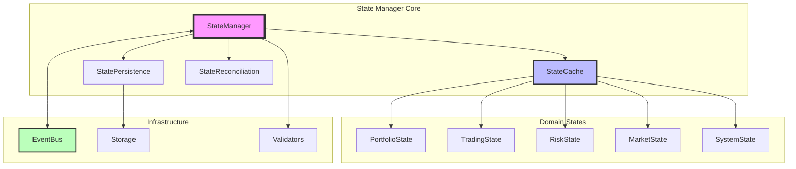
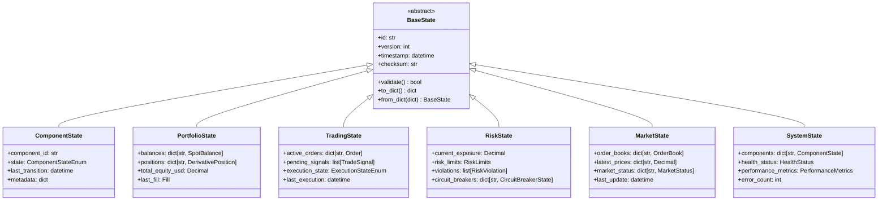

# CyberDeltaEngine State Manager Architecture Report

## Executive Summary

This report presents a comprehensive analysis and design for a unified state management system for CyberDeltaEngine. After studying the existing codebase patterns and Nautilus Trader's proven architecture, we propose a centralized, event-driven state management module that consolidates fragmented state handling across the system while maintaining domain boundaries and enabling efficient persistence.

## Current State Analysis

### Existing State Management Patterns

Our codebase currently has **three distinct state management implementations**:

1. **Generic State Manager** (`cyberdelta/utils/state_manager.py`)
   - File-based persistence with JSON/orjson
   - Backup rotation and recovery mechanisms
   - Checksum validation for integrity
   - Used for general application state

2. **Portfolio State Manager** (`cyberdelta/domain/portfolio/state_manager.py`)
   - Manages balances and positions
   - Integrates with financial calculators
   - Handles fill updates and PnL calculations
   - Uses protocol-based storage abstraction

3. **Circuit Breaker State Manager** (`cyberdelta/domain/safety/state_manager.py`)
   - FSM for circuit breaker states (CLOSED/OPEN/HALF_OPEN)
   - Cooldown period management
   - Recovery threshold tracking
   - State transition logic

### Key Issues Identified

1. **Fragmentation**: Three separate implementations with overlapping functionality
2. **Inconsistent Persistence**: Different serialization approaches (JSON vs domain models)
3. **Limited Event Integration**: Weak coupling with the event bus system
4. **No Centralized State Access**: Each domain manages its own state independently
5. **Missing State Synchronization**: No mechanism for cross-domain state consistency

## Nautilus Trader Patterns Study

### Key Architectural Insights

1. **Component State Management**
   - Finite State Machine (FSM) for component lifecycle
   - States: PRE_INITIALIZED → READY → RUNNING → STOPPED/DEGRADED/FAULTED → DISPOSED
   - Event-driven state transitions with `ComponentStateChanged` events

2. **Cache-Centric Architecture**
   - Centralized cache for all trading state
   - Efficient O(1) lookups with pre-compiled decoders
   - Memory management with configurable purging
   - Snapshot support for persistence

3. **Event-Driven Updates**
   - State changes trigger events via message bus
   - Priority-based handler execution
   - Request/response pattern for synchronous queries

4. **Reconciliation Mechanisms**
   - State reconciliation between internal and external systems
   - Missing order generation for position alignment
   - Snapshot intervals for periodic persistence

## Proposed Unified State Manager Architecture

### Core Design Principles

1. **Single Source of Truth**: One centralized state manager for all domain states
2. **Event-Driven**: All state changes propagate through the event bus
3. **Domain Separation**: Maintain logical boundaries while sharing infrastructure
4. **Type Safety**: Pydantic models for all state representations
5. **Configuration-First**: All behavior driven by AppSettings

### Architectural Components



### State Hierarchy



## Implementation Design

### File Structure

```
cyberdelta/state/
├── __init__.py
├── base/
│   ├── __init__.py
│   ├── state_base.py           # BaseState abstract class
│   ├── state_cache.py          # In-memory state cache
│   └── state_events.py         # State change events
├── core/
│   ├── __init__.py
│   ├── state_manager.py        # Main StateManager class
│   ├── state_reconciliation.py # Reconciliation logic
│   └── state_snapshot.py       # Snapshot management
├── domains/
│   ├── __init__.py
│   ├── portfolio_state.py      # Portfolio-specific state
│   ├── trading_state.py        # Trading/execution state
│   ├── risk_state.py           # Risk management state
│   ├── market_state.py         # Market data state
│   └── system_state.py         # System/component state
├── persistence/
│   ├── __init__.py
│   ├── file_storage.py         # File-based persistence
│   ├── redis_storage.py        # Redis persistence
│   └── storage_protocol.py     # Storage interface
├── protocols/
│   ├── __init__.py
│   ├── state_protocol.py       # State interfaces
│   └── reconciliation_protocol.py
└── utils/
    ├── __init__.py
    ├── state_validator.py      # State validation
    └── state_serializer.py     # Serialization utilities
```

### Core StateManager Implementation

```python
from cyberdelta.config.models import AppSettings
from cyberdelta.infrastructure.event_bus import EventBus
from cyberdelta.state.base import BaseState, StateCache
from cyberdelta.state.protocols import StateStorageProtocol

class StateManager:
    """Unified state management system for CyberDeltaEngine.

    Following CODING_STANDARDS.md:
    - ALL configuration from AppSettings
    - NO hardcoded values
    - Event-driven architecture
    - Type-safe with Pydantic models
    """

    def __init__(
        self,
        config: AppSettings,
        event_bus: EventBus,
        storage: StateStorageProtocol,
    ) -> None:
        self.config = config
        self._event_bus = event_bus
        self._storage = storage
        self._cache = StateCache(config)

        # Configuration-driven settings
        self._snapshot_interval = config.state.snapshot_interval_seconds
        self._reconciliation_interval = config.state.reconciliation_interval_seconds
        self._purge_interval = config.state.purge_interval_minutes

        # State domains
        self._domains: dict[str, BaseState] = {}

    async def initialize(self) -> None:
        """Initialize state manager and load persisted states."""
        # Load states from storage
        states = await self._storage.load_all()
        for state in states:
            self._cache.put(state.id, state)
            self._domains[state.id] = state

        # Subscribe to state change events
        self._subscribe_to_events()

    async def get_state(self, state_id: str) -> BaseState | None:
        """Get state by ID with cache-first lookup."""
        return self._cache.get(state_id)

    async def update_state(
        self,
        state_id: str,
        updates: dict,
        atomic: bool = True
    ) -> None:
        """Update state with optional atomic persistence."""
        state = self._cache.get(state_id)
        if not state:
            raise ValueError(f"State {state_id} not found")

        # Apply updates
        state.update(updates)
        state.version += 1
        state.timestamp = datetime.now(UTC)

        # Persist if atomic
        if atomic:
            await self._storage.save(state)

        # Publish state change event
        await self._publish_state_change(state)
```

### Event Integration

```python
from cyberdelta.models.events import StateChanged
from cyberdelta.enums.event_bus import HandlerPriority

class StateEventHandler:
    """Handles state-related events from the event bus."""

    def __init__(self, state_manager: StateManager, event_bus: EventBus):
        self._state_manager = state_manager
        self._event_bus = event_bus

        # Subscribe to relevant events
        event_bus.subscribe(
            OrderFilled,
            self._handle_order_filled,
            priority=HandlerPriority.HIGH
        )
        event_bus.subscribe(
            PositionOpened,
            self._handle_position_opened,
            priority=HandlerPriority.HIGH
        )

    async def _handle_order_filled(self, event: OrderFilled) -> None:
        """Update trading state on order fill."""
        trading_state = await self._state_manager.get_state("trading")
        trading_state.remove_active_order(event.order_id)
        await self._state_manager.update_state("trading", trading_state)

    async def _handle_position_opened(self, event: PositionOpened) -> None:
        """Update portfolio state on position open."""
        portfolio_state = await self._state_manager.get_state("portfolio")
        portfolio_state.add_position(event.position)
        await self._state_manager.update_state("portfolio", portfolio_state)
```

## Integration Points

### 1. Event Bus Integration

The state manager will be deeply integrated with the existing event bus:

- **Subscribe** to domain events (fills, orders, positions, risk violations)
- **Publish** state change events for other components
- **Priority handling** for critical state updates
- **Request/Response** pattern for state queries

### 2. Domain Service Integration

Each domain service will interact with the state manager:

```python
class PortfolioService:
    def __init__(self, state_manager: StateManager, ...):
        self._state_manager = state_manager

    async def update_from_fill(self, fill: Fill) -> None:
        # Get current state
        state = await self._state_manager.get_state("portfolio")

        # Update state
        state.update_from_fill(fill)

        # Persist atomically
        await self._state_manager.update_state("portfolio", state)
```

### 3. Persistence Layer

Multiple storage backends supported via protocol:

- **File Storage**: JSON/Parquet files with rotation
- **Redis**: For distributed state sharing
- **PostgreSQL**: For audit trail and history

## Benefits of Unified Architecture

### 1. **Consistency**
- Single pattern for all state management
- Uniform serialization and validation
- Consistent error handling

### 2. **Performance**
- Centralized caching with O(1) lookups
- Batch state updates
- Optimized event propagation

### 3. **Reliability**
- Atomic state transitions
- Automatic reconciliation
- Backup and recovery mechanisms

### 4. **Observability**
- Centralized state monitoring
- Event audit trail
- Performance metrics

### 5. **Maintainability**
- Clear separation of concerns
- Protocol-based extensibility
- Configuration-driven behavior

## Migration Strategy

### Phase 1: Core Implementation (Week 1-2)
1. Implement base state classes and protocols
2. Create StateManager and StateCache
3. Set up event integration

### Phase 2: Domain Migration (Week 3-4)
1. Migrate PortfolioState (highest priority)
2. Migrate TradingState
3. Migrate RiskState and SystemState

### Phase 3: Storage Implementation (Week 5)
1. Implement file-based storage
2. Add Redis support
3. Create reconciliation logic

### Phase 4: Testing and Optimization (Week 6)
1. Comprehensive testing
2. Performance optimization
3. Documentation

## Risk Mitigation

1. **Backward Compatibility**: Maintain existing interfaces during migration
2. **Gradual Rollout**: Migrate one domain at a time
3. **Feature Flags**: Control new state manager activation
4. **Comprehensive Testing**: Unit, integration, and e2e tests
5. **Monitoring**: Add metrics and alerts for state operations

## Performance Considerations

### Caching Strategy
- **LRU Cache** for frequently accessed states
- **TTL-based expiry** for market data states
- **Preloading** of critical states on startup

### Serialization
- **msgspec** for performance-critical paths
- **orjson** for JSON compatibility
- **Parquet** for historical state storage

### Concurrency
- **asyncio.Lock** for state mutations
- **Read-write locks** for cache access
- **Event batching** for high-frequency updates

## Monitoring and Metrics

Key metrics to track:

1. **State Operations**
   - Updates per second
   - Cache hit ratio
   - Persistence latency

2. **Memory Usage**
   - Cache size
   - State object counts
   - Memory growth rate

3. **Reliability**
   - Reconciliation success rate
   - Recovery time
   - Error rates

## Conclusion

The proposed unified state management architecture addresses current fragmentation while incorporating best practices from Nautilus Trader. It provides:

1. **Centralized state management** with domain separation
2. **Event-driven updates** via the existing event bus
3. **Flexible persistence** with multiple storage backends
4. **Type safety** through Pydantic models
5. **Configuration-driven behavior** following CODING_STANDARDS.md

This architecture will significantly improve system reliability, performance, and maintainability while providing a solid foundation for future enhancements.

## Next Steps

1. **Review and approve** this architecture design
2. **Create detailed implementation tickets** for each phase
3. **Begin Phase 1 implementation** with core components
4. **Set up monitoring** and performance benchmarks
5. **Plan migration timeline** with minimal disruption

## Appendix: Configuration Schema

```yaml
state:
  # Cache configuration
  cache:
    max_size: 10000
    ttl_seconds: 300
    preload_domains: ["portfolio", "trading", "risk"]

  # Persistence configuration
  persistence:
    backend: "file"  # file, redis, postgresql
    snapshot_interval_seconds: 60
    backup_count: 5
    backup_rotation_minutes: 60

  # Reconciliation configuration
  reconciliation:
    enabled: true
    interval_seconds: 300
    max_retries: 3

  # Memory management
  memory:
    purge_interval_minutes: 15
    purge_buffer_minutes: 60
    max_state_age_minutes: 1440
```
