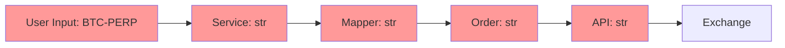
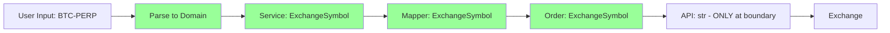
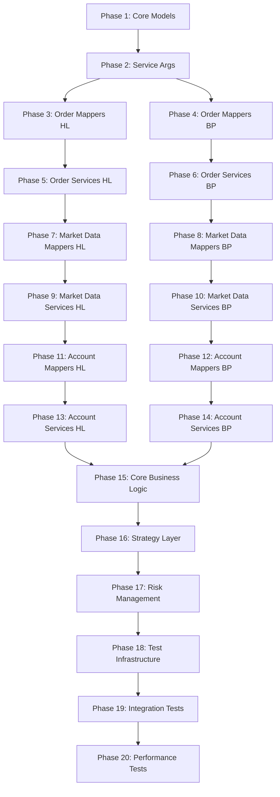
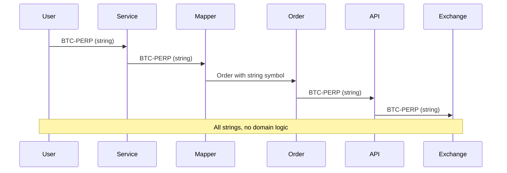
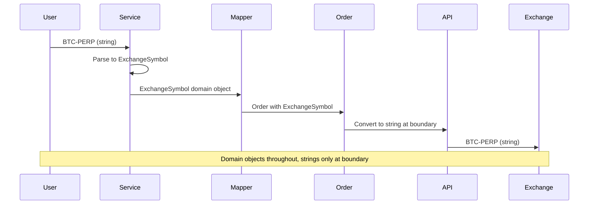
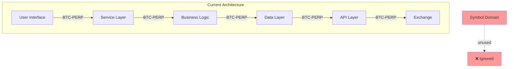
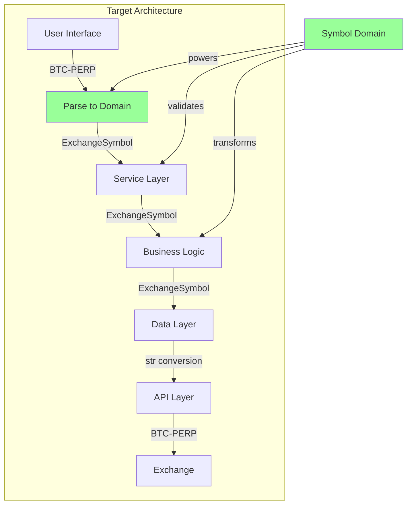

# Symbol Domain Migration: Comprehensive 20-Phase Strategic Plan

## 🔍 Executive Summary

After extensive codebase analysis, the symbol domain infrastructure is **100% complete and production-ready**. However, **95%+ of the codebase completely ignores it**, creating a massive string-based system that bypasses all domain logic.

### Current Reality
```
🏗️ BUILT: Excellent symbol infrastructure (models, service, factories, validation)
❌ USED: Almost nowhere - strings everywhere
🎯 GOAL: Domain objects flowing throughout the entire system
```

## 📊 Deep Analysis Results

### ✅ What EXISTS (Production Ready)
- **Domain Models**: `InternalSymbol`, `ExchangeSymbol`, `UnifiedSymbol` - Well designed
- **Symbol Service**: Complete transformation, validation, registry
- **Test Factories**: Full factory infrastructure in `tests/factories/symbol_factories.py`
- **Main Integration**: `main.py` correctly injects `SymbolService` into handlers

### ❌ What BLOCKS Us (95% String Usage)
- **Critical**: `Order.symbol: str` at `cyberdelta/core/models/market/order.py:72`
- **Critical**: `PlaceOrderArgs.symbol: str` at `cyberdelta/apis/models/service_args_models.py:95`
- **1,429 hardcoded strings** across 114 test files (`"BTC-PERP"`, `"ETH-PERP"`, etc.)
- **All mappers** parse to strings instead of domain objects
- **All services** accept/return strings

### 🚨 The Core Problem


**Current Flow**: String → String → String → String → External API

**Target Flow**:


## 🎯 20-Phase Migration Strategy

### Core Principles
1. **Layer-by-layer transformation** - Complete one layer before moving to next
2. **Breaking changes force adoption** - No backwards compatibility
3. **Domain objects throughout** - Strings only at system boundaries
4. **Type safety enforces correctness** - Let mypy find all usage

### Phase Dependencies


---

## 📋 PHASE 1: Core Domain Models (FOUNDATION)
**Duration**: 1 day
**Impact**: Forces entire system to adapt
**Files**: 2 critical files

### Changes Required

#### 1.1 Order Model (`cyberdelta/core/models/market/order.py`)
```python
# CHANGE LINE 72:
# OLD:
symbol: str = Field(..., description="Trading symbol.")

# NEW:
symbol: ExchangeSymbol = Field(..., description="Exchange-specific trading symbol")

# ADD IMPORT:
from cyberdelta.core.symbols.models import ExchangeSymbol
```

#### 1.2 Cancel Order Result Model (Same File)
```python
# CHANGE LINE 479:
# OLD:
symbol: str | None = Field(default=None, description="Symbol of the order(s)...")

# NEW:
symbol: ExchangeSymbol | None = Field(default=None, description="Symbol of the order(s)...")
```

### Why This Phase First
- **Forces everything else to adapt** - Order is created everywhere
- **Type checker will find all locations** that need updating
- **No dual systems** - Clean break from string-based approach
- **Small surface area** - Only 2 fields to change

### Expected Breakage
- ~100 places that create `Order` objects will fail
- All order mappers will fail to compile
- All service argument validation will fail
- **This is GOOD** - forces systematic migration

---

## 📋 PHASE 2: Service Arguments (ENFORCEMENT)
**Duration**: 1 day
**Impact**: Forces all service calls to use domain objects
**Files**: 1 file, ~25 argument models

### Changes Required

#### 2.1 Primary Service Args (`cyberdelta/apis/models/service_args_models.py`)
```python
# Import domain models
from cyberdelta.core.symbols.models import ExchangeSymbol

# CHANGE ALL symbol fields from str to ExchangeSymbol:

# Line 95 - PlaceOrderArgs:
symbol: ExchangeSymbol  # Was: str

# Line 509 - CancelOrderArgs:
symbol: ExchangeSymbol | None  # was: str | None

# Line 638 - GetAllOpenOrdersArgs:
symbol: ExchangeSymbol | None  # Was: str | None

# Line 665 - GetOrderArgs:
symbol: ExchangeSymbol | None  # Was: str | None

# Plus ~20 more Args classes with symbol fields
```

#### 2.2 Update Validators
```python
# REMOVE string validators for symbol fields
# ADD domain object validators
@field_validator("symbol", mode="before")
@classmethod
def validate_symbol_domain(cls, v: ExchangeSymbol | str, info: ValidationInfo) -> ExchangeSymbol:
    """Accept ExchangeSymbol or parse string to ExchangeSymbol during migration."""
    if isinstance(v, ExchangeSymbol):
        return v
    if isinstance(v, str):
        # Migration helper - will be removed in Phase 18
        return ExchangeSymbol(value=v, exchange_id=ExchangeName.UNKNOWN)
    raise ValueError(f"Invalid symbol type: {type(v)}")
```

### Why This Phase Second
- **Service arguments are the API contract** - changing them forces all callers to adapt
- **Creates pressure throughout the system** - every service call must provide domain objects
- **Maintains migration bridge** - temporary string acceptance during transition

---

## 📋 PHASE 3: Hyperliquid Order Mappers (ENTRY POINT)
**Duration**: 1 day
**Impact**: Orders flow into system as domain objects
**Files**: 2 mapper files

### Changes Required

#### 3.1 Main Order Mapper (`cyberdelta/apis/hyperliquid/mappers/trading/hl_order_mapper.py`)
```python
# ADD import
from cyberdelta.core.symbols.models import ExchangeSymbol, create_exchange_symbol
from cyberdelta.enums.exchange_names import ExchangeName

# MODIFY _create_order_from_components method:
def _create_order_from_components(self, raw_order, components) -> Order:
    # Parse symbol to domain object at entry point
    exchange_symbol = create_exchange_symbol(
        value=raw_order.asset,
        exchange_id=ExchangeName.HYPERLIQUID,
        asset_index=getattr(raw_order, 'asset_index', None)
    )

    order_data = {
        "symbol": exchange_symbol,  # Domain object!
        "exchange": "hyperliquid",
        # ... rest of fields
    }
    return Order(**order_data)
```

#### 3.2 Order Response Mapper (`cyberdelta/apis/hyperliquid/mappers/trading/hl_order_response_mapper.py`)
```python
# Same pattern - parse exchange responses to domain objects
def map_raw_status_to_order(self, raw_status) -> Order:
    exchange_symbol = create_exchange_symbol(
        value=raw_status.coin,
        exchange_id=ExchangeName.HYPERLIQUID
    )
    # Use domain object in Order creation
```

### Why This Phase Third
- **Orders enter the system here** - fixing entry point ensures domain objects flow forward
- **Hyperliquid first** - simpler exchange format, easier to validate approach
- **Clear boundaries** - parse raw exchange data to domain objects at edge

---

## 📋 PHASE 4: Backpack Order Mappers (PARITY)
**Duration**: 1 day
**Impact**: Both exchanges now create domain objects
**Files**: 2 mapper files

### Changes Required

#### 4.1 Backpack Order Mapper (`cyberdelta/apis/backpack/mappers/trading/bp_order_mapper.py`)
```python
# Same pattern as Hyperliquid
def transform_order(self, raw_order: BackpackRawOrder) -> Order:
    exchange_symbol = create_exchange_symbol(
        value=raw_order.symbol,
        exchange_id=ExchangeName.BACKPACK,
        symbol_id=getattr(raw_order, 'symbol_id', None)
    )

    order_data = {
        "symbol": exchange_symbol,  # Domain object
        # ... rest
    }
    return Order(**order_data)
```

### Expected Result After Phase 4
- **All Order objects contain ExchangeSymbol** instead of strings
- **Type safety enforced** at Order creation boundaries
- **Foundation set** for service layer updates

---

## 📋 PHASE 5: Hyperliquid Order Services (FLOW)
**Duration**: 1 day
**Impact**: Service operations use domain objects
**Files**: 4 service files

### Changes Required

#### 5.1 Order Placement Service (`cyberdelta/apis/hyperliquid/services/trading/hl_order_placement_service.py`)
```python
async def place_order(self, args: PlaceOrderArgs) -> Order:
    # args.symbol is now ExchangeSymbol
    # Convert to string ONLY at API boundary
    payload = self.request_builder.build_place_order_payload(
        symbol=str(args.symbol),  # String conversion ONLY here
        # ... other args
    )

    # Process response -> Order (via mapper that creates domain objects)
    return self.order_mapper.map_response_to_order(response)
```

#### 5.2 Order Cancellation Service
```python
async def cancel_order(self, args: CancelOrderArgs) -> CancelOrderResult:
    # args.symbol is now ExchangeSymbol | None
    payload = self.request_builder.build_cancel_payload(
        symbol=str(args.symbol) if args.symbol else None,  # String only at boundary
        # ...
    )
```

### Pattern Established
- **Domain objects flow through services** - no internal string operations
- **String conversion ONLY at API request boundaries** - `str(domain_object)`
- **Response parsing creates domain objects** - via updated mappers

---

## 📋 PHASE 6: Backpack Order Services (PARITY)
**Duration**: 1 day
**Impact**: Complete order flow uses domain objects
**Files**: 4 service files

### Changes Required
- Same pattern as Phase 5 but for Backpack services
- All order-related services now work with `ExchangeSymbol` objects
- String conversion only at HTTP request boundaries

### Milestone After Phase 6
🎯 **ORDER FLOW COMPLETE**: User request → Domain validation → Service (domain) → API (string) → Exchange

---

## 📋 PHASE 7: Hyperliquid Market Data Mappers
**Duration**: 1 day
**Impact**: Market data enters system as domain objects
**Files**: 5 mapper files

### Changes Required

#### 7.1 Ticker Mapper (`cyberdelta/apis/hyperliquid/mappers/market_data/hl_price_ticker_mapper.py`)
```python
def map_raw_ticker(self, raw_ticker) -> Ticker:
    exchange_symbol = create_exchange_symbol(
        value=raw_ticker.coin,
        exchange_id=ExchangeName.HYPERLIQUID
    )

    return Ticker(
        symbol=exchange_symbol,  # Domain object
        # ... other fields
    )
```

#### 7.2 Order Book, Trade, Funding Rate Mappers
- Same pattern across all market data mappers
- Parse exchange symbols to domain objects at entry point

---

## 📋 PHASE 8-10: Market Data Services (Both Exchanges)
**Duration**: 3 days total (1 day each for HL mappers, BP mappers, services)
**Impact**: Complete market data flow uses domain objects

### Pattern
- Market data mappers create domain objects from exchange responses
- Market data services accept domain objects in arguments
- String conversion only at HTTP boundaries

---

## 📋 PHASE 11-14: Account Data (Both Exchanges)
**Duration**: 4 days
**Impact**: Account operations use domain objects

### Scope
- Balance mappers and services
- Position mappers and services
- Transaction history mappers and services
- Account summary mappers and services

### Same Pattern Applied
- Domain objects at all internal boundaries
- String conversion only for HTTP requests

---

## 📋 PHASE 15: Core Business Logic Layer
**Duration**: 2 days
**Impact**: Business logic operates on domain objects
**Files**: 8 core files

### Changes Required

#### 15.1 Execution Handler (`cyberdelta/core/execution_handler.py`)
```python
# Methods now work with ExchangeSymbol objects
async def execute_trade_signal(self, signal: TradeSignal) -> None:
    # signal contains ExchangeSymbol objects
    order_args = PlaceOrderArgs(
        symbol=signal.symbol,  # Already ExchangeSymbol
        # ...
    )
```

#### 15.2 Data Handler, Portfolio Tracker, Signal Generator
- Update all to work with domain objects internally
- Use symbol service for any transformations needed

### Files Updated
- `cyberdelta/core/execution_handler.py`
- `cyberdelta/core/data_handler.py`
- `cyberdelta/core/portfolio_tracker.py`
- `cyberdelta/core/signal_generator.py`
- `cyberdelta/core/risk_manager.py`
- `cyberdelta/core/services/price_data_service.py`
- `cyberdelta/core/portfolio/services/symbol/symbol_service.py`
- `cyberdelta/core/services/validation.py`

---

## 📋 PHASE 16: Strategy Layer
**Duration**: 1 day
**Impact**: Strategies work with domain symbols
**Files**: 3 strategy files

### Changes Required
- `cyberdelta/strategies/funding_rate_arbitrage.py`
- Strategy base classes
- Signal generation components

### Pattern
- Strategies receive and emit domain objects
- Internal logic works with typed symbols
- Clear type safety throughout

---

## 📋 PHASE 17: Risk Management
**Duration**: 1 day
**Impact**: Risk calculations use domain objects
**Files**: Risk management components

### Updates
- Position sizing with domain objects
- Risk calculations with typed symbols
- Constraint validation with domain models

---

## 📋 PHASE 18: Test Infrastructure Overhaul
**Duration**: 3 days
**Impact**: Remove 1,429 hardcoded strings
**Files**: 114+ test files

### Strategy: Batch Processing by Domain

#### 18.1 Day 1: API Layer Tests (40 files)
```python
# OLD:
test_symbol = "BTC-PERP"

# NEW:
test_symbol = ExchangeSymbolFactory.create_hyperliquid("BTC-PERP")
# OR:
test_symbol = ExchangeSymbolFactory.btc_perp_hyperliquid()
```

#### 18.2 Day 2: Core Layer Tests (35 files)
- Core business logic tests
- Service tests
- Integration tests

#### 18.3 Day 3: Remaining Tests (39 files)
- Validation tests
- Portfolio tests
- Strategy tests

### Tooling Support
```bash
# Regex replacement patterns
find tests/ -name "*.py" -exec sed -i 's/test_symbol = "BTC-PERP"/test_symbol = ExchangeSymbolFactory.btc_perp_hyperliquid()/g' {} \;
```

---

## 📋 PHASE 19: Integration Test Updates
**Duration**: 1 day
**Impact**: End-to-end tests use domain objects
**Files**: Integration test suites

### Focus
- `tests/integration/core/test_execution_handler.py`
- `tests/integration/core/test_unified_symbol_system.py`
- `tests/integration/test_core_workflow.py`
- `tests/integration/apis/test_symbol_api_integration.py`

---

## 📋 PHASE 20: Performance Validation & Cleanup
**Duration**: 1 day
**Impact**: System optimization and validation

### Tasks
- Performance testing with domain objects vs strings
- Memory usage analysis
- Remove any remaining migration helpers
- Final validation of type safety
- Update documentation

---

## 🔄 Data Flow Transformation

### Current System Flow


### Target System Flow


## 🏗️ Architecture Evolution

### Before Migration


### After Migration


## ⚡ Implementation Guidelines

### Daily Workflow
1. **Start Phase** - Update todo list, mark phase as in_progress
2. **Make Changes** - Implement breaking changes for the phase
3. **Run Tests** - Fix compilation errors (expected)
4. **Validate** - Ensure mypy passes, tests work
5. **Complete Phase** - Mark todo as completed

### Phase Completion Criteria
- [ ] All files in phase updated to use domain objects
- [ ] No `symbol: str` parameters remain in scope
- [ ] mypy type checking passes
- [ ] All tests in scope pass

### Error Handling Strategy
- **Compilation Errors Expected** - Each phase will break dependent code
- **Fix Forward, Not Backward** - Update callers to use domain objects
- **Use Type Checker** - Let mypy find all locations needing updates
- **No Rollbacks** - Breaking changes force complete migration

## 🎯 Success Metrics

### Per-Phase Success
- ✅ No string symbol operations in phase scope
- ✅ All affected tests pass
- ✅ mypy validation passes

### Overall Success
- **0 hardcoded symbol strings** except in test factory definitions
- **100% domain object usage** in business logic
- **Type safety enforced** throughout the system
- **Performance maintained** or improved
- **Clean architecture** with proper boundaries

## 📅 Timeline Summary

| Week | Phases | Focus | Duration |
|------|--------|-------|----------|
| **Week 1** | 1-6 | Foundation & Order Flow | 6 days |
| **Week 2** | 7-14 | Market & Account Data | 8 days |
| **Week 3** | 15-17 | Business Logic | 4 days |
| **Week 4** | 18-20 | Testing & Validation | 5 days |

**Total Duration**: ~4 weeks of focused development

## 🚀 Why This Plan Will Succeed

### 1. **Forced Migration**
- Breaking changes make old patterns impossible
- Type checker finds all remaining string usage
- No dual systems or compatibility layers

### 2. **Clear Progress**
- Each phase has concrete deliverables
- Visible progress with each phase completion
- No ambiguous "partially done" states

### 3. **Dependency-Driven**
- Phases ordered by actual code dependencies
- Foundation phases force adaptation in dependent layers
- Natural flow from core to periphery

### 4. **Granular Scope**
- 20 phases allow precise progress tracking
- Each phase manageable in 1-2 days
- Clear rollback boundaries if needed

### 5. **Domain-Driven Design**
- Leverages existing excellent infrastructure
- Enforces proper architectural boundaries
- Maintains type safety throughout

---

## 🔥 Final Call to Action

The symbol domain infrastructure is **already built and excellent**. The migration is not about building - it's about **forcing adoption** of what already exists.

**This 20-phase plan transforms the entire codebase from string-based chaos to domain-driven excellence, one clean break at a time.**

Ready to begin? Start with Phase 1: Change `Order.symbol` from `str` to `ExchangeSymbol` and watch the type checker guide the rest of the migration.

**Let the breaking changes guide us to success.** 🎯
