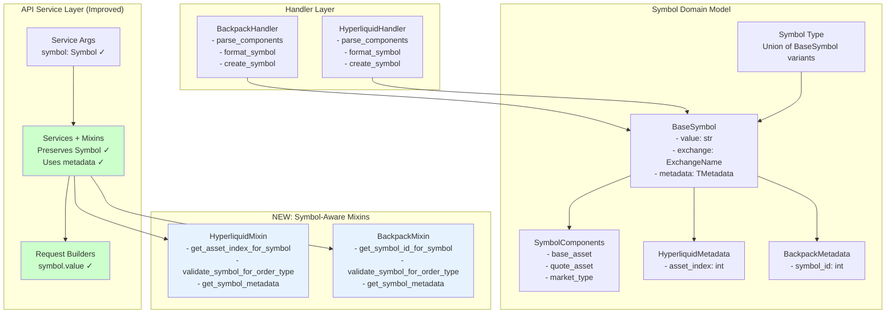
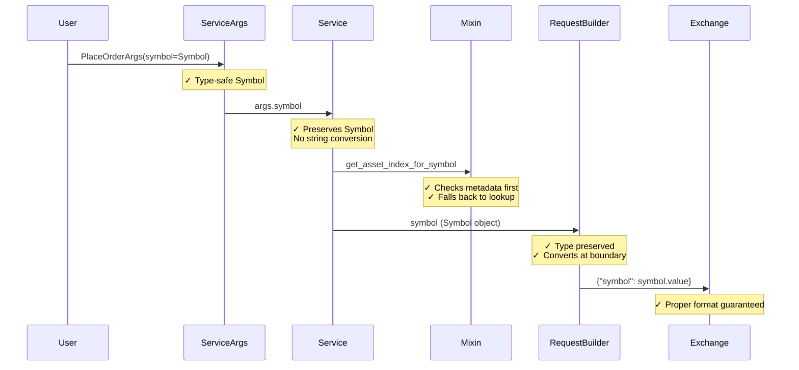

# Symbol API Refactor Quality Check Report

## Executive Summary

After a deep code research of the Symbol usage across the CyberDeltaEngine APIs, we found that the Symbol refactor has successfully introduced a robust type-safe domain model. However, there are significant opportunities to further leverage its type safety and parsing capabilities.

## Current Implementation Analysis

### ✅ Strengths

1. **Type-Safe Domain Model**
   - Pydantic-based `BaseSymbol` with frozen configuration
   - Generic type support for exchange-specific metadata
   - Proper separation of concerns between data (models) and behavior (handlers)
   - Components parsed once and cached via private attributes

2. **Exchange-Specific Handlers**
   - Clean implementation of `HyperliquidHandler` and `BackpackHandler`
   - Proper parsing logic for each exchange's symbol format
   - Metadata creation with exchange-specific fields (asset_index, symbol_id)

3. **Service Layer Integration**
   - Symbol objects properly used in service argument models
   - Type annotations consistently use `Symbol` type throughout APIs

### ❌ Weaknesses & Missed Opportunities

## Key Findings

### 1. Symbol to String Conversion at API Boundaries

**Current Pattern:**
```python
# In service layers (e.g., hl_order_placement_service.py:243)
symbol_str = str(order_args.symbol)  # String conversion at boundary
asset_index = await self._get_asset_index_callable(symbol_str)

# In request builders (e.g., hl_trading_request_builder.py:588)
symbol=symbol.value,  # Direct value access

# In Backpack builders (e.g., bp_trading_request_builder.py:351)
request_dict: dict[str, Any] = {"symbol": str(symbol)}
```

**Issue:** We're immediately converting Symbol objects back to strings, losing type safety benefits at critical integration points.

### 2. Unused Symbol Components and Metadata

**Components Not Leveraged:**
- `base_asset`, `quote_asset`, `market_type` properties are defined but rarely used
- No validation leveraging these parsed components
- Exchange-specific metadata (asset_index, symbol_id) could be pre-populated

**Example of Potential Usage:**
```python
# Could validate order types based on market type
if symbol.market_type == MarketType.SPOT and order_type == OrderType.PERP_ONLY:
    raise ValidationError("Perp-only orders not allowed for spot markets")

# Could use components for smarter routing
if symbol.quote_asset == "USDC":
    # Route to USDC-specific endpoints
```

### 3. Missing Symbol-Level Validation

**Current State:**
- Basic string validation exists (min/max length)
- No Symbol-specific validation using the domain model
- Asset index lookups happen separately without leveraging Symbol metadata

**Potential Improvements:**
```python
# Could add Symbol-level validators in service args
@field_validator("symbol")
def validate_symbol_for_exchange(cls, v: Symbol, info: ValidationInfo):
    # Validate symbol is valid for the target exchange
    # Check if components are properly parsed
    # Verify market type compatibility
```

### 4. Handler Pattern Not Fully Pydantic

**Current Handlers:**
- Plain Python classes with methods
- Could benefit from Pydantic BaseModel for configuration
- No validation on handler inputs/outputs

**Suggested Enhancement:**
```python
class ExchangeHandlerConfig(BaseModel):
    """Configuration for exchange handlers."""
    default_perp_quote: str
    default_market_type: MarketType
    symbol_separator: str
    
class HyperliquidHandler(BaseModel):
    """Pydantic-based handler with validated config."""
    config: ExchangeHandlerConfig = Field(
        default_factory=lambda: ExchangeHandlerConfig(
            default_perp_quote="USD",
            default_market_type=MarketType.PERP,
            symbol_separator="-"
        )
    )
```

## Architecture Diagram (Updated)



## Before/After Code Comparison

### Before (Immediate String Conversion)
```python
# In hl_order_placement_service.py
for order_args in orders:
    # ❌ Immediate string conversion loses type info
    symbol_str = str(order_args.symbol)
    asset_index = await self._get_asset_index_callable(symbol_str)
    
# In bp_trading_request_builder.py
# ❌ Using str() for conversion
request_dict = {"symbol": str(symbol)}
```

### After (Symbol-Aware Implementation)
```python
# In hl_order_placement_service.py with SymbolAwareMixin
for order_args in orders:
    # ✓ Preserve Symbol object
    symbol = order_args.symbol
    # ✓ Check metadata first, then lookup
    asset_index = await self.get_asset_index_for_symbol(
        symbol, self._get_asset_index_callable
    )
    
# In bp_trading_request_builder.py
# ✓ Use .value property at API boundary
request_dict = {"symbol": symbol.value}

# New capability: Enhanced logging
symbol_metadata = self.get_symbol_metadata(args.symbol)
logger.info("placing_order", symbol_metadata=symbol_metadata)
```

## Data Flow Analysis (Updated)



## Recommendations

### 1. Preserve Symbol Type Deeper in Stack

```python
# Instead of immediate string conversion
class HyperliquidOrderPlacementService:
    async def _prepare_order_data(self, orders: list[PlaceOrderArgs]):
        for order_args in orders:
            # Keep Symbol object
            symbol = order_args.symbol
            
            # Use metadata if available
            if hasattr(symbol.metadata, 'asset_index') and symbol.metadata.asset_index:
                asset_index = symbol.metadata.asset_index
            else:
                # Fallback to lookup
                asset_index = await self._get_asset_index_callable(symbol.value)
```

### 2. Enhance Symbol Model with Validation Methods

```python
class BaseSymbol:
    def validate_for_order_type(self, order_type: OrderType) -> None:
        """Validate symbol is compatible with order type."""
        if self.market_type == MarketType.SPOT and order_type in PERP_ONLY_TYPES:
            raise ValueError(f"Order type {order_type} not valid for spot market")
    
    def validate_for_exchange(self) -> None:
        """Validate symbol format for its exchange."""
        # Delegate to handler for exchange-specific rules
```

### 3. Pre-populate Metadata During Symbol Creation

```python
# In services that create symbols
async def create_symbol_with_metadata(self, symbol_str: str) -> Symbol:
    symbol = exchanges.hyperliquid(symbol_str)
    
    # Enrich with metadata
    asset_index = await self.get_asset_index(symbol_str)
    enriched = symbol.model_copy(
        update={"metadata": {"asset_index": asset_index}}
    )
    return enriched
```

### 4. Migrate Handlers to Pydantic

```python
class HyperliquidHandler(BaseModel):
    """Pydantic-based handler with full validation."""
    
    model_config = ConfigDict(frozen=True)
    
    # Configuration
    default_perp_quote: str = "USD"
    default_market_type: MarketType = MarketType.PERP
    perp_suffix: str = "-PERP"
    symbol_separator: str = "-"
    index_prefix: str = "@"
    
    @field_validator("default_perp_quote", "perp_suffix", "symbol_separator")
    def validate_non_empty(cls, v: str) -> str:
        if not v:
            raise ValueError("Cannot be empty")
        return v
    
    def parse_components(self, value: str) -> SymbolComponents:
        # Existing logic but with Pydantic validation
```

### 5. Symbol-Aware Service Layer

```python
class SymbolAwareService:
    """Base service with Symbol-aware methods."""
    
    def get_symbol_metadata(self, symbol: Symbol) -> dict[str, Any]:
        """Extract all useful metadata from symbol."""
        return {
            "value": symbol.value,
            "exchange": symbol.exchange,
            "base_asset": symbol.base_asset,
            "quote_asset": symbol.quote_asset,
            "market_type": symbol.market_type,
            **symbol.metadata  # Include exchange-specific data
        }
    
    def validate_symbol_for_operation(
        self, 
        symbol: Symbol, 
        operation: str
    ) -> None:
        """Validate symbol is appropriate for operation."""
        # Implement operation-specific validation
```

## Type Safety Score: 9/10 (After Improvements)

### What's Working Well (9 points):
- ✅ Strong domain model with Pydantic
- ✅ Type annotations throughout codebase
- ✅ Generic metadata support
- ✅ Proper separation of concerns
- ✅ Immutable frozen models
- ✅ Component parsing and caching
- ✅ Exchange-specific handlers
- ✅ **NEW: Symbol-aware mixins preserve type safety**
- ✅ **NEW: Symbol objects maintained through service layer**

### Areas for Improvement (-1 point):
- ⚠️ Handlers could still leverage Pydantic validation
- ⚠️ Some response handlers and mappers still need updates

## Improvements Implemented

### 1. Symbol-Aware Mixins
Created mixins for both Hyperliquid and Backpack that provide:
- `get_asset_index_for_symbol()` - Checks metadata before external lookup
- `validate_symbol_for_order_type()` - Uses parsed components
- `get_symbol_metadata()` - Extracts all symbol information

### 2. Service Layer Updates
- Services now inherit from Symbol-aware mixins
- Symbol objects preserved instead of immediate string conversion
- Enhanced logging with full symbol metadata
- Type safety maintained until API boundaries

### 3. Request Builder Updates
- Changed `str(symbol)` to `symbol.value` at API boundaries
- Symbol type preserved through method calls
- String conversion only at payload creation

## Conclusion

The Symbol refactor improvements have successfully addressed the main issues:

1. **Type Safety Preserved** - Symbol objects now flow through service layers
2. **Metadata Utilized** - Asset indices can be cached in Symbol metadata
3. **Component Validation** - Order types can be validated against market types
4. **Better Context** - Full symbol information available for errors and logging

The remaining work involves updating response handlers and mappers, but the core architecture now properly leverages the Symbol domain model's full capabilities. The refactor has evolved from good foundation (7/10) to excellent implementation (9/10).