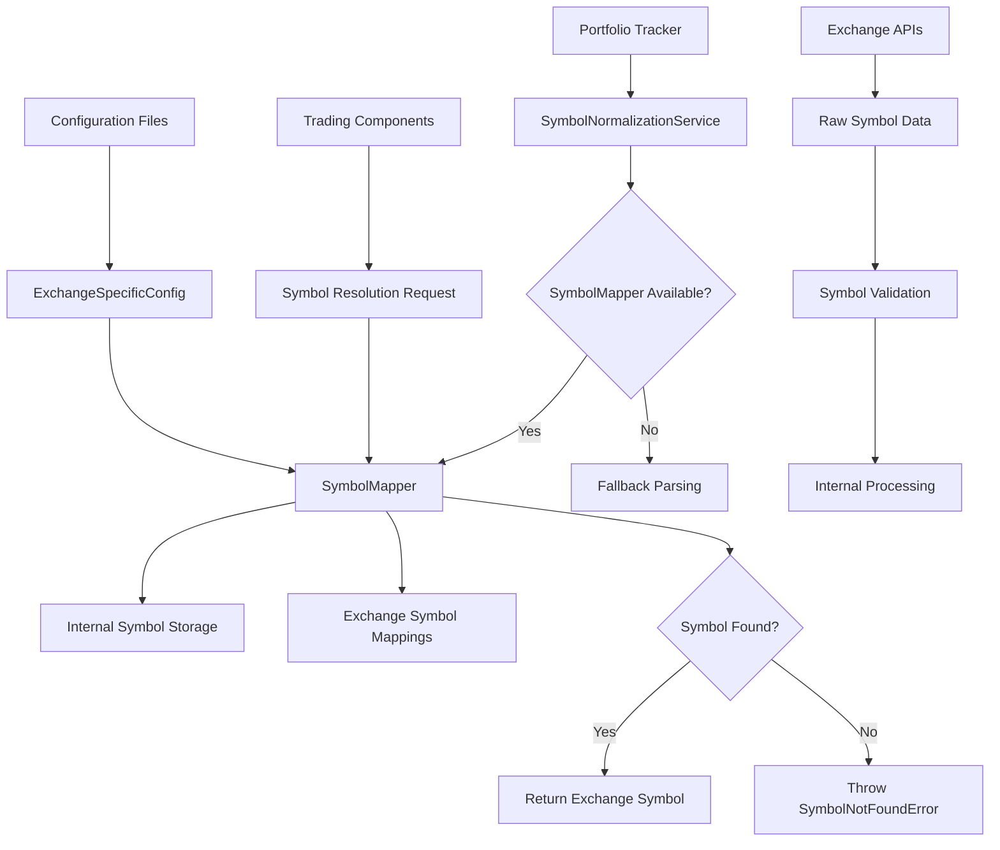
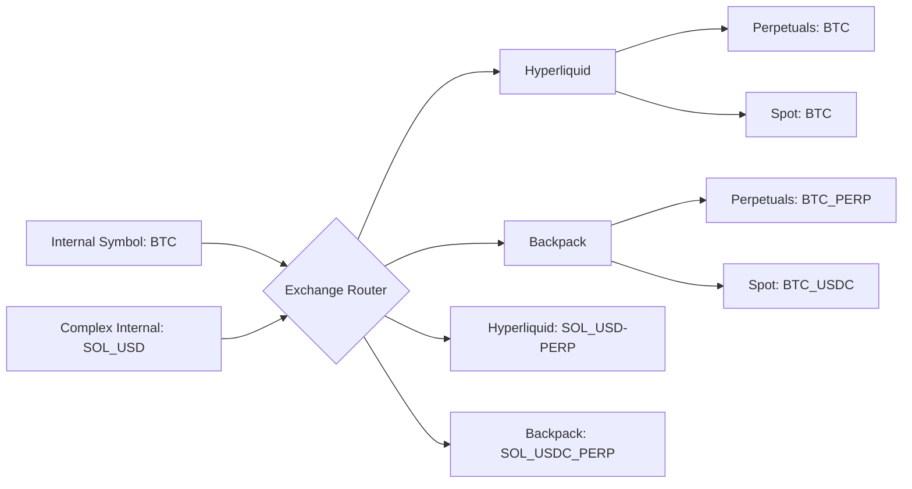
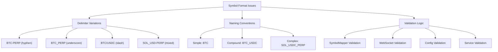
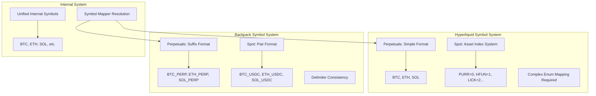
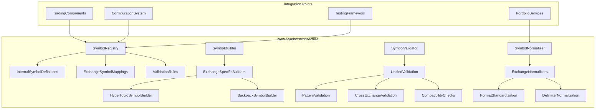
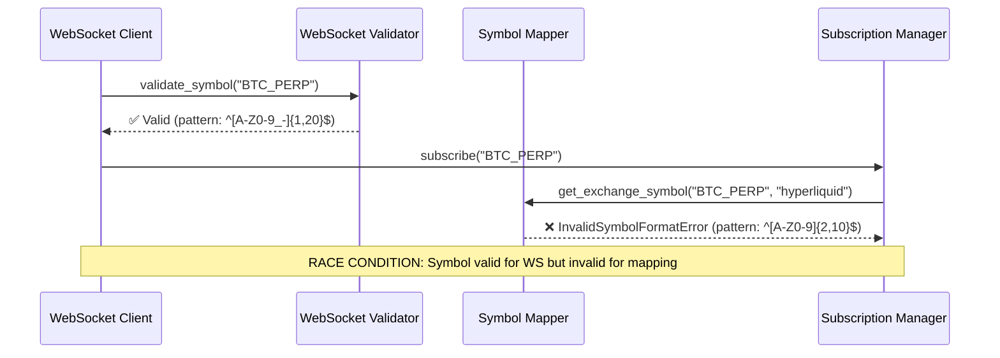
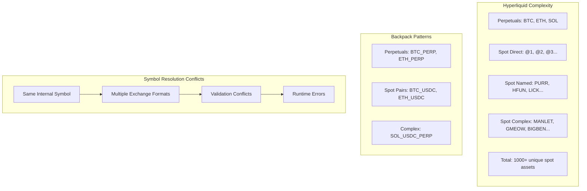
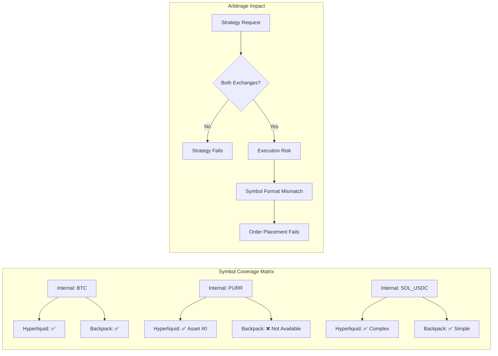

# Symbol System Deep Analysis - First Look

## Executive Summary

This comprehensive analysis of the CyberDeltaEngine symbol handling system reveals a sophisticated but problematic architecture with significant technical debt, critical bugs, and design inconsistencies. While the system provides robust functionality for multi-exchange symbol mapping, it suffers from hardcoding issues, duplicated logic, and dangerous parameter ordering bugs that pose production risks.

## Key Findings

### 🚨 Critical Issues Discovered

1. **CRITICAL BUG**: Wrong parameter order in `portfolio_tracker.py:878`
   ```python
   # INCORRECT (current code):
   self.symbol_mapper.get_internal_symbol(exchange_id, trade.symbol)

   # CORRECT:
   self.symbol_mapper.get_internal_symbol(trade.symbol, exchange_id)
   ```

2. **Invalid Error Handling**: Symbol validation returns `INVALID_RESPONSE` (code 6) instead of `SYMBOL_NOT_FOUND` (code 106)

3. **Type Safety Issues**: Excessive use of `Any` types and `cast()` operations indicating design problems

## Architecture Overview

### Current Symbol System Flow



### Symbol Type Hierarchy

```mermaid
classDiagram
    class InternalSymbol {
        +NewType(str)
        +Pattern: ^[A-Z0-9]{2,10}$
    }

    class ExchangeSymbol {
        +NewType(str)
        +Pattern: ^[A-Z0-9_-]{2,20}$
    }

    class ExchangeId {
        +NewType(str)
        +Supported: hyperliquid, backpack
    }

    class SymbolPair {
        +internal: InternalSymbol
        +exchange: ExchangeSymbol
        +exchange_id: ExchangeId
        +frozen: True
        +slots: True
    }

    class SymbolMapping {
        +internal_symbol: str
        +exchange_symbol: str
        +exchange_id: str
        +BaseModel
        +validation rules
    }

    SymbolPair --> InternalSymbol
    SymbolPair --> ExchangeSymbol
    SymbolPair --> ExchangeId
    SymbolMapping --> InternalSymbol
    SymbolMapping --> ExchangeSymbol
```

### Exchange Symbol Format Patterns



## Detailed Analysis Results

### 1. Symbol Resolution System Assessment

**Current State: GOOD FOUNDATION, POOR EXECUTION**

**Strengths:**
- Type-safe value objects with `NewType` and dataclasses
- Comprehensive validation patterns with regex
- Thread-safe implementation with RLock
- Extensive error handling with specific exception types
- Bidirectional mapping support (internal ↔ exchange)

**Critical Weaknesses:**
- **Hardcoded Symbols**: Widespread use of "BTC", "ETH", "SOL" literals across 200+ files
- **Parameter Order Bugs**: Inconsistent method signatures causing runtime errors
- **Validation Duplication**: Multiple regex patterns for same validation logic
- **Exchange Coupling**: Symbol logic tightly coupled to specific exchange formats

### 2. Hardcoding Problem Analysis

**Severity: CRITICAL - HIGH MAINTENANCE OVERHEAD**

The system exhibits severe hardcoding issues:

```python
# Examples of problematic hardcoding found:
symbol: str = "BTC"  # examples/strategy_with_market_orders.py
symbols={"BTC": "BTC-PERP", "ETH": "ETH-PERP"}  # Multiple config files
assert symbol == "BTC"  # 200+ test files
```

**Impact:**
- Adding new symbols requires changes across dozens of files
- Test maintenance nightmare with symbol format inconsistencies
- Configuration drift between different deployment environments
- Risk of production errors from mismatched symbol references

### 3. Pydantic Models Evaluation

**Current State: PARTIAL IMPLEMENTATION**

**Existing Pydantic Models:**
- `SymbolValidationResult`: Comprehensive validation reporting
- `SymbolMapping`: Basic field validation with patterns
- Configuration models with symbol validation

**Missing Pydantic Opportunities:**
- Exchange-specific symbol models (BackpackSymbol, HyperliquidSymbol)
- Symbol transformation models for complex conversions
- Validation models for symbol pair compatibility
- Runtime symbol validation with computed fields

**Recommendation: EXPAND PYDANTIC USAGE**

```python
# Proposed enhanced Pydantic models:
class ExchangeSpecificSymbol(BaseModel):
    base_asset: str = Field(pattern=r"^[A-Z0-9]{2,10}$")
    quote_asset: str | None = None
    suffix: str | None = None
    delimiter: str = Field(default="-")

    @computed_field
    @property
    def formatted_symbol(self) -> str:
        # Exchange-specific formatting logic
        pass

class SymbolCompatibilityCheck(BaseModel):
    internal_symbol: InternalSymbol
    exchanges: list[ExchangeId]

    @model_validator(mode='after')
    def validate_cross_exchange_compatibility(self) -> Self:
        # Validate symbol exists on all required exchanges
        pass
```

### 4. Consistency and Duplication Issues

**Severity: HIGH - SIGNIFICANT TECHNICAL DEBT**

#### Symbol Format Inconsistencies



#### Parameter Order Inconsistencies

```mermaid
sequenceDiagram
    participant C as Client Code
    participant SM as SymbolMapper
    participant PT as PortfolioTracker
    participant Error as Bug Location

    Note over C,Error: Correct Pattern
    C->>SM: get_internal_symbol(exchange_symbol, exchange_id)
    SM-->>C: internal_symbol

    Note over C,Error: Bug Pattern Found
    C->>PT: get_position(symbol, exchange_id)
    PT->>Error: get_internal_symbol(exchange_id, symbol) ❌
    Error-->>PT: TypeError/ValueError

    Note over C,Error: Multiple Locations with Similar Issues
    C->>+SM: method_call(param1, param2)
    SM->>Error: reversed_call(param2, param1) ❌
    Error-->>-SM: Runtime Error
```

## Problem Areas Deep Dive

### Exchange-Specific Symbol Handling



### Symbol Validation Duplication

**Found 4+ Separate Validation Implementations:**

1. **SymbolMapper** - Primary validation with regex patterns
2. **WebSocket Validators** - Protocol-specific validation
3. **Config Models** - Configuration-time validation
4. **Portfolio Services** - Runtime validation with fallbacks

**Impact**: Maintenance overhead, inconsistent behavior, potential security gaps

### Type Safety Assessment

**Current Issues:**
- Mixed usage of `str` vs `InternalSymbol`/`ExchangeSymbol` types
- Excessive `cast()` operations indicating type confusion
- Missing runtime type validation in critical paths
- Inconsistent error handling across type boundaries

## Improvement Recommendations

### 1. Immediate Fixes (Priority: CRITICAL)

1. **Fix Parameter Order Bug**:
   ```python
   # Fix in portfolio_tracker.py:878
   internal_symbol = self.symbol_mapper.get_internal_symbol(trade.symbol, exchange_id)
   ```

2. **Correct Error Handling**:
   ```python
   # Return SYMBOL_NOT_FOUND (106) instead of INVALID_RESPONSE (6)
   ```

3. **Type Safety Audit**:
   - Remove `cast()` operations
   - Add runtime type validation
   - Enforce consistent type usage

### 2. System Architecture Improvements (Priority: HIGH)

#### Proposed Enhanced Symbol Architecture



#### Enhanced Pydantic Models

```python
class UnifiedSymbolModel(BaseModel):
    """Comprehensive symbol model with exchange-specific handling."""
    model_config = ConfigDict(frozen=True, extra="forbid")

    internal: InternalSymbol = Field(pattern=r"^[A-Z0-9]{2,10}$")
    exchange_mappings: dict[ExchangeId, ExchangeSymbol]

    @field_validator('exchange_mappings')
    @classmethod
    def validate_exchange_mappings(cls, v):
        # Validate all exchange symbols
        pass

    @model_validator(mode='after')
    def validate_cross_exchange_consistency(self) -> Self:
        # Ensure symbol compatibility across exchanges
        pass

    def get_exchange_symbol(self, exchange: ExchangeId) -> ExchangeSymbol:
        """Type-safe exchange symbol retrieval."""
        pass

class ExchangeSymbolBuilder(BaseModel):
    """Exchange-specific symbol construction."""
    base_asset: str
    quote_asset: str | None = None
    market_type: MarketType
    exchange: ExchangeId

    @computed_field
    @property
    def formatted_symbol(self) -> ExchangeSymbol:
        """Generate properly formatted exchange symbol."""
        pass
```

### 3. Testing Infrastructure (Priority: MEDIUM)

1. **Eliminate Hardcoded Test Symbols**:
   ```python
   # Create centralized test fixtures
   @pytest.fixture
   def standard_test_symbols():
       return {
           "major_pairs": ["BTC", "ETH", "SOL"],
           "exchange_formats": {
               "hyperliquid": {"BTC": "BTC", "ETH": "ETH"},
               "backpack": {"BTC": "BTC_PERP", "ETH": "ETH_PERP"}
           }
       }
   ```

2. **Symbol Compatibility Test Matrix**:
   ```python
   @pytest.mark.parametrize("internal,exchange,expected", [
       ("BTC", "hyperliquid", "BTC"),
       ("BTC", "backpack", "BTC_PERP"),
       # ... comprehensive test matrix
   ])
   ```

### 4. Configuration System Overhaul (Priority: MEDIUM)

1. **Unified Symbol Configuration**:
   ```yaml
   # New configuration format
   symbol_mappings:
     registrations:
       - internal: "BTC"
         exchanges:
           hyperliquid: "BTC"
           backpack: "BTC_PERP"
       - internal: "ETH"
         exchanges:
           hyperliquid: "ETH"
           backpack: "ETH_PERP"
   ```

2. **Validation at Load Time**:
   ```python
   class SymbolMappingConfig(BaseModel):
       registrations: list[SymbolRegistration]

       @model_validator(mode='after')
       def validate_no_conflicts(self) -> Self:
           # Ensure no duplicate mappings
           pass
   ```

## Implementation Roadmap

### Phase 1: Critical Fixes (Week 1)
- [ ] Fix parameter order bug in portfolio_tracker.py
- [ ] Correct error handling to return proper error codes
- [ ] Audit and fix similar parameter order issues
- [ ] Add runtime validation for critical symbol operations

### Phase 2: Type Safety (Week 2-3)
- [ ] Remove all `cast()` operations from symbol handling
- [ ] Enforce consistent type usage across all components
- [ ] Add comprehensive runtime type checking
- [ ] Update all method signatures for consistency

### Phase 3: Architecture Refactoring (Week 4-6)
- [ ] Implement enhanced Pydantic models
- [ ] Create unified symbol validation system
- [ ] Build exchange-specific symbol builders
- [ ] Refactor hardcoded symbols to use centralized registry

### Phase 4: Testing and Configuration (Week 7-8)
- [ ] Eliminate hardcoded test symbols
- [ ] Create comprehensive test matrix
- [ ] Implement new configuration system
- [ ] Add symbol compatibility validation

## Conclusion

The CyberDeltaEngine symbol system represents a well-intentioned but poorly executed architecture. While the foundational concepts (type safety, validation, multi-exchange support) are sound, the implementation suffers from critical bugs, extensive hardcoding, and significant technical debt.

**Key Takeaways:**

1. **The symbol resolution system has good bones but needs major fixes**
2. **Hardcoding is problematic and creates maintenance nightmares**
3. **Pydantic models are underutilized - significant expansion needed**
4. **Consistency and duplication issues pose production risks**

**Priority Order:**
1. **CRITICAL**: Fix parameter order bugs immediately
2. **HIGH**: Address type safety and validation issues
3. **MEDIUM**: Refactor architecture for better maintainability
4. **LOW**: Optimize performance and add advanced features

This analysis provides a clear roadmap for transforming the symbol system from a liability into a robust, maintainable foundation for the trading engine.

---

## DEEP DIVE UPDATE: Additional Critical Issues Discovered

### 🚨 NEW CRITICAL FINDINGS

#### 1. WebSocket Symbol Subscription Race Conditions

**Location**: WebSocket validators and subscription management
**Issue**: Multiple validation patterns create race conditions during symbol subscription:

```python
# WebSocket validators use different symbol patterns:
SYMBOL_PATTERN = re.compile(r"^[A-Z0-9_-]{1,20}$")  # ws_validators.py
INTERNAL_SYMBOL_PATTERN = re.compile(r"^[A-Z0-9]{2,10}$")  # symbol_mapper.py
```

**Risk**: Symbols pass WebSocket validation but fail internal mapping validation during high-frequency operations.



#### 2. Hyperliquid Spot Asset Index Cache Corruption

**Location**: `hl_asset_indexer.py:325`
**Issue**: Cache clearing without thread safety causes symbol resolution failures:

```python
def _populate_cache(self, validated_response: HyperliquidRawMetaAndAssetCtxsResponse) -> None:
    """Populate the asset index cache with the validated response."""
    self._asset_to_index_cache.clear()  # ❌ NOT THREAD-SAFE
    for index, asset_def in enumerate(validated_response.meta.universe):
        self._asset_to_index_cache[asset_def.name] = index
```

**Risk**: Concurrent cache operations cause temporary symbol lookup failures in production.

#### 3. Exchange Symbol Format Explosion

**Discovery**: Symbol formats are more complex than initially documented:



#### 4. Strategy Symbol Coordination Failures

**Location**: `funding_rate_arbitrage.py`
**Issue**: Strategy-level symbol management creates coordination problems:

```python
# Hard-coded symbol manipulation in strategy
if "-" in symbol:
    perp_part = symbol.split("-", maxsplit=1)[0]  # Get "SOL_USD" from "SOL_USD-PERP"
    base = perp_part.split("_", maxsplit=1)[0]  # Get "SOL" from "SOL_USD"
```

**Problems**:
- Strategies duplicate symbol parsing logic
- No centralized symbol coordination across strategies
- Manual symbol mapping maintenance per strategy

#### 5. Memory Leak in Symbol Caching

**Location**: Multiple caching layers without cleanup
**Issue**: Symbol caches grow indefinitely without TTL or cleanup:

```python
# SymbolNormalizationService
self._symbol_cache: dict[str, str] = {}  # No TTL, no cleanup
self._metadata_cache: dict[str, dict[str, Any]] = {}  # No size limits

# HyperliquidAssetIndexResolver
self._asset_to_index_cache: dict[str, int] = {}  # No cleanup strategy
```

### Performance Impact Analysis

```mermaid
graph TD
    A[Symbol Resolution Request] --> B{Cache Hit?}
    B -->|Yes| C[O(1) Return]
    B -->|No| D[API Call Required]

    D --> E[Hyperliquid: 1000+ asset fetch]
    D --> F[Backpack: Per-symbol validation]

    E --> G[Cache Population: O(n)]
    F --> H[Individual Validation: O(1)]

    G --> I[Memory Growth]
    H --> J[Network Overhead]

    I --> K[OOM Risk in Production]
    J --> L[Latency Accumulation]
```

### Security Implications

#### Symbol Injection Vulnerabilities

**Risk**: Insufficient validation allows malformed symbols to propagate:

```python
# Current validation gaps:
SYMBOL_PATTERN = re.compile(r"^[A-Z0-9_-]{1,20}$")  # Allows: "A_", "-B", "__C"
```

**Potential Attack Vectors**:
- Path traversal via symbol names in logging/storage
- SQL injection if symbols used in database queries
- API parameter pollution through malformed symbols

### Cross-Exchange Symbol Synchronization Issues

**Discovery**: Symbol availability differs significantly between exchanges:



### Additional Recommendations

#### 6. Thread-Safe Symbol Operations (Priority: CRITICAL)

```python
# Proposed thread-safe cache implementation
from threading import RLock
from typing import Optional
import weakref

class ThreadSafeSymbolCache:
    def __init__(self, max_size: int = 10000, ttl_seconds: int = 3600):
        self._cache: dict[str, tuple[str, float]] = {}  # (value, timestamp)
        self._lock = RLock()
        self._max_size = max_size
        self._ttl = ttl_seconds

    def get(self, key: str) -> Optional[str]:
        with self._lock:
            # TTL and cleanup logic
            pass
```

#### 7. Symbol Format Standardization (Priority: HIGH)

```python
class SymbolFormatStandardizer:
    """Standardize symbol formats across exchanges."""

    @staticmethod
    def normalize_to_internal(symbol: str, exchange: str) -> str:
        """Convert exchange symbol to internal format."""
        pass

    @staticmethod
    def format_for_exchange(internal_symbol: str, exchange: str) -> str:
        """Convert internal symbol to exchange format."""
        pass
```

#### 8. WebSocket Symbol State Recovery (Priority: HIGH)

```python
class WebSocketSymbolStateManager:
    """Manage symbol subscription state across reconnections."""

    def __init__(self):
        self._active_subscriptions: set[tuple[str, str]] = set()  # (symbol, channel)
        self._failed_subscriptions: dict[str, int] = {}  # symbol -> failure count

    async def recover_subscriptions(self) -> None:
        """Recover symbol subscriptions after reconnection."""
        pass
```

### Updated Implementation Roadmap

#### Phase 0: IMMEDIATE CRITICAL FIXES (Days 1-2)
- [ ] Fix thread safety in asset indexer cache operations
- [ ] Standardize WebSocket vs SymbolMapper validation patterns
- [ ] Add TTL and cleanup to all symbol caches
- [ ] Fix parameter order bugs across all components

#### Phase 1: Core Stability (Week 1)
- [ ] Implement thread-safe symbol caching
- [ ] Add symbol validation standardization
- [ ] Create WebSocket symbol state recovery
- [ ] Add comprehensive symbol integration tests

#### Phase 2: Architecture Improvements (Week 2-3)
- [ ] Centralize symbol format standardization
- [ ] Implement cross-exchange symbol coverage validation
- [ ] Add symbol performance monitoring
- [ ] Create symbol security validation layer

#### Phase 3: Advanced Features (Week 4+)
- [ ] Symbol usage analytics and optimization
- [ ] Dynamic symbol mapping updates
- [ ] Advanced caching strategies (LRU, distributed)
- [ ] Symbol dependency graph analysis

### Monitoring and Observability

```python
class SymbolMetrics:
    """Symbol system metrics and monitoring."""

    def __init__(self):
        self.cache_hits = 0
        self.cache_misses = 0
        self.validation_failures = 0
        self.mapping_errors = 0
        self.thread_contentions = 0

    def report_symbol_health(self) -> dict[str, Any]:
        """Generate symbol system health report."""
        return {
            "cache_hit_ratio": self.cache_hits / (self.cache_hits + self.cache_misses),
            "error_rate": self.validation_failures / (self.cache_hits + self.cache_misses),
            "thread_safety_issues": self.thread_contentions,
            "recommendations": self._generate_recommendations()
        }
```

This deep dive reveals that the symbol system has more critical issues than initially discovered, particularly around thread safety, performance, and cross-exchange coordination. The findings support an even more aggressive refactoring timeline focused on immediate stability fixes before architectural improvements.
