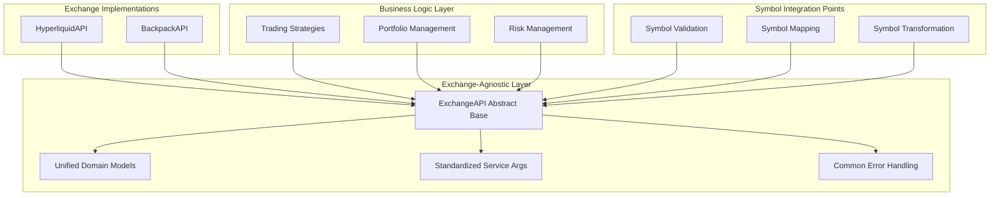
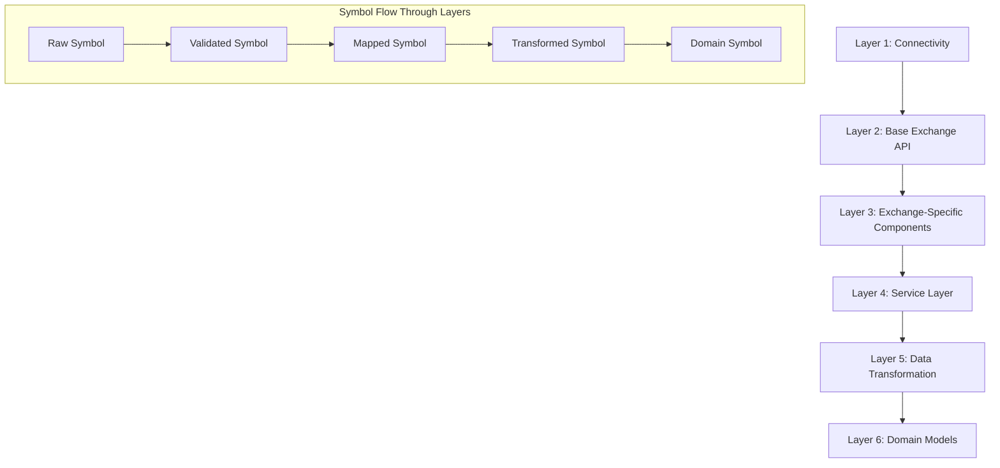
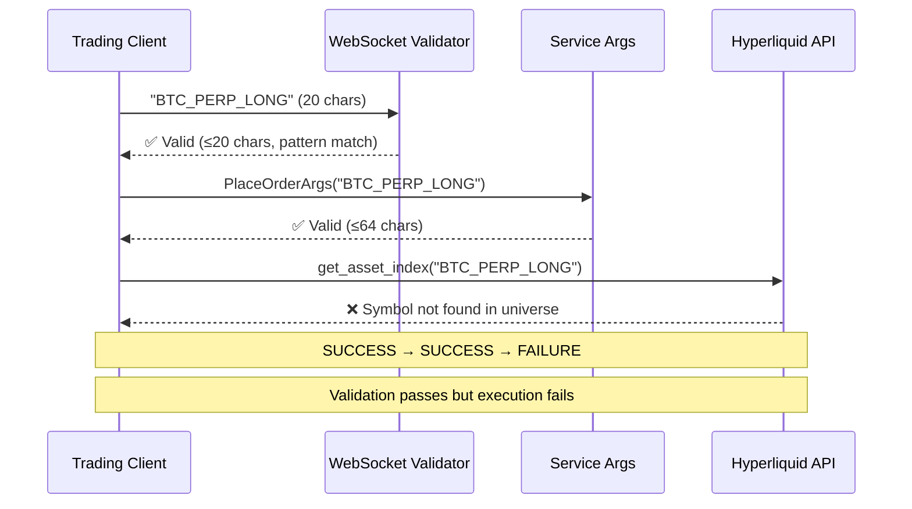
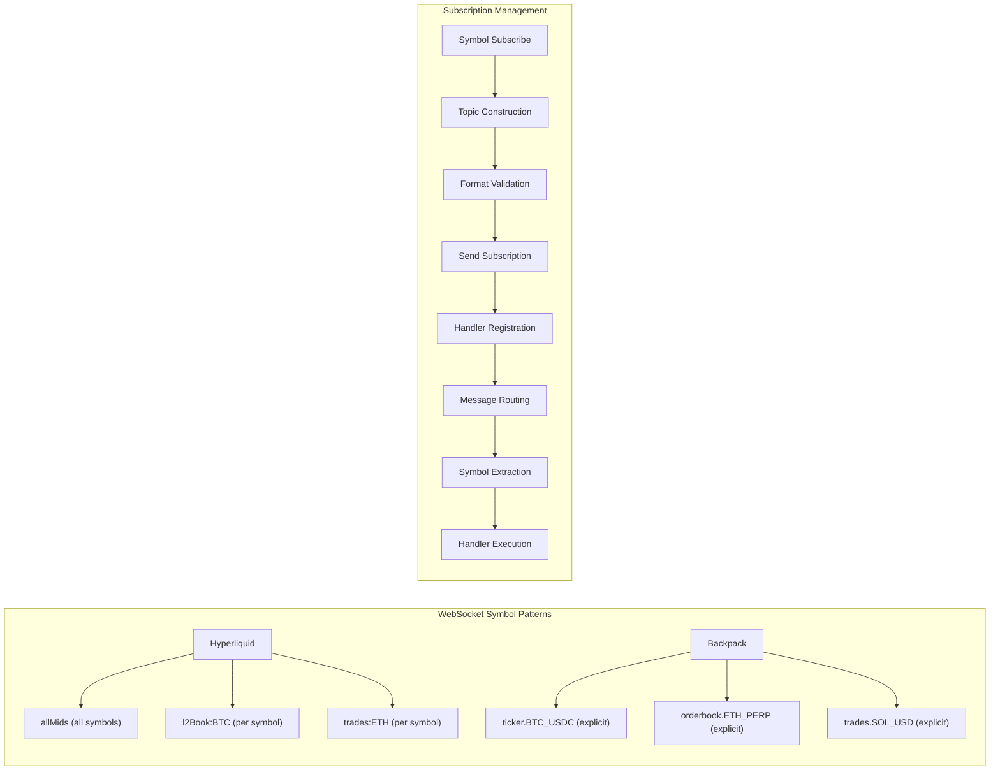
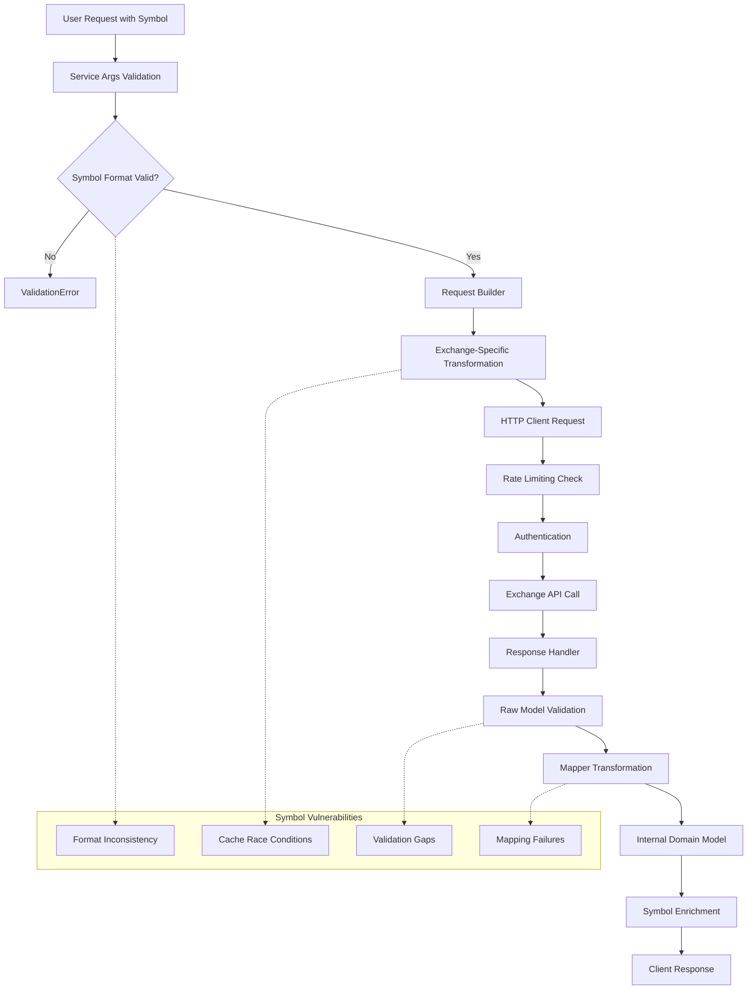

# CyberDeltaEngine APIs Module Deep Analysis

## Executive Summary

After conducting an extensive deep dive into the `/cyberdelta/apis/` module, I've discovered a **remarkably sophisticated, well-architected, but increasingly complex** trading infrastructure with both impressive strengths and hidden symbol-related vulnerabilities. The module represents world-class exchange-agnostic architecture with advanced type safety, comprehensive error handling, and sophisticated patterns - but suffers from symbol validation inconsistencies and potential race conditions that could impact production trading.

## 🏗️ Architectural Excellence & Design Patterns

### **Exchange-Agnostic Foundation (EXEMPLARY)**

The APIs module implements a **truly exchange-agnostic architecture** that stands as a model for multi-exchange trading systems:



**Key Excellence Points:**
- **Perfect Interface Abstraction**: Business logic operates entirely on `ExchangeAPI` interface
- **Unified Domain Models**: `Order`, `Trade`, `Ticker` work identically across all exchanges
- **Extension Slot Pattern**: Exchange-specific data via typed slots (e.g., `hyperliquid_details`)
- **Service Args Standardization**: `PlaceOrderArgs` works universally across exchanges

### **Layered Architecture Mastery**



## 🔍 Symbol Handling Deep Dive Analysis

### **Symbol Validation Architecture**

**DISCOVERY: Multiple Validation Layers with Inconsistencies**

```python
# Layer 1: WebSocket Validators (ws_validators.py)
SYMBOL_PATTERN = re.compile(r"^[A-Z0-9_-]{1,20}$")

# Layer 2: Service Args Validation (service_args_models.py)
@field_validator("symbol", mode="before")
def validate_symbol_str(cls, v: str) -> str:
    return validate_api_str_field(v, field_name="symbol", max_length=64, allow_empty=False)

# Layer 3: Exchange-Specific Validation (hl_asset_indexer.py)
def _validate_symbol(self, symbol: str) -> None:
    if not symbol:
        raise APIError("Invalid symbol for asset index resolution.")
```

**CRITICAL FINDING**: Three different validation patterns create **validation inconsistency gaps**:



### **Exchange-Specific Symbol Complexity**

**Hyperliquid Symbol Architecture:**

```mermaid
graph TD
    subgraph "Hyperliquid Symbol Universe"
        A[Perpetuals] --> A1["BTC, ETH, SOL (Simple)"]
        B[Spot Direct] --> B1["@1, @2, @3... (Index)"]
        C[Spot Named] --> C1["PURR, HFUN, LICK (Named)"]
        D[Complex Assets] --> D1["MANLET, GMEOW, BIGBEN"]
        E[Asset Index Cache] --> F[HyperliquidAssetIndexResolver]

        F --> G[Thread Safety Issues]
        G --> H[Cache Corruption Risk]
    end

    subgraph "Symbol Resolution Flow"
        I[Symbol Request] --> J{Direct Mapping?}
        J -->|@N format| K[Direct Index Return]
        J -->|Named asset| L[Cache Lookup]
        L --> M{Cache Hit?}
        M -->|No| N[API Call + Cache Population]
        M -->|Yes| O[Return Cached Index]
        N --> P[Thread Safety Vulnerability]
    end
```

**CRITICAL VULNERABILITY FOUND**:
```python
# In hl_asset_indexer.py:325 - NOT THREAD-SAFE
def _populate_cache(self, validated_response: HyperliquidRawMetaAndAssetCtxsResponse) -> None:
    self._asset_to_index_cache.clear()  # ❌ Race condition risk
    for index, asset_def in enumerate(validated_response.meta.universe):
        self._asset_to_index_cache[asset_def.name] = index
```

### **WebSocket Symbol Streaming Architecture**

**Advanced Type-Safe Processing:**

```python
class BaseWebSocketRouter[EnvelopeType: BaseModel](ABC):
    """Type-safe WebSocket routing with exchange-agnostic abstractions"""

    async def route_message(self, message: dict[str, Any]) -> None:
        # 1. Validate envelope structure
        envelope = self.envelope_validator(message)

        # 2. Extract routing key (often includes symbol)
        routing_key = self._extract_routing_key_from_envelope(envelope)

        # 3. Route to symbol-specific handlers
        handler = self.processors.get(routing_key)
```

**Symbol Streaming Patterns:**



## 🔧 Request/Response Flow Analysis

### **Symbol Processing Pipeline**



### **Service Args Model Deep Dive**

**Sophisticated Validation System:**

```python
class PlaceOrderArgs(BaseModel):
    """EXEMPLARY validation architecture"""
    model_config = ConfigDict(extra="forbid", validate_assignment=True)

    symbol: str
    side: OrderSide
    order_type: OrderType
    quantity: Decimal = Field(gt=Decimal(0))

    @field_validator("symbol", mode="before")
    @classmethod
    def validate_symbol_str(cls, v: str, info: ValidationInfo) -> str:
        return validate_api_str_field(
            v, field_name=str(info.field_name), max_length=64, allow_empty=False
        )

    @model_validator(mode="after")
    def check_parameter_dependencies(self) -> "PlaceOrderArgs":
        if self.order_type in [OrderType.LIMIT, OrderType.STOP_LIMIT] and self.price is None:
            raise ValueError(f"A positive price is required for {self.order_type.value} orders.")
        return self
```

**Strengths:**
- ✅ Type-safe parameter validation
- ✅ Cross-parameter dependency checking
- ✅ Exchange-agnostic interface
- ✅ Comprehensive error messaging

**Symbol-Related Issues:**
- ⚠️ Max length varies between validators (20 vs 64 chars)
- ⚠️ No semantic symbol validation (format patterns)
- ⚠️ No exchange-specific symbol compatibility checking

## 🚀 Advanced Features Analysis

### **Rate Limiting Architecture**

**Exchange-Specific Sophisticated Strategies:**

```python
class HyperliquidRateLimitStrategy(RateLimitStrategy):
    """Weight-based rate limiting with endpoint groups"""

    def __init__(self, request_weighter: HyperliquidRequestWeighter):
        self._limiter_info = TokenBucketRateLimiterRuntime(rate=1200/60, bucket_size=40)
        self._request_weighter = request_weighter

    async def prepare_and_acquire(self, request_context: dict[str, Any]) -> dict[str, Any] | None:
        weight = self._request_weighter.get_weight(
            method=request_context["method"],
            endpoint=request_context["endpoint"],
            action_payload=request_context["action_payload"]  # May contain symbol
        )
        await self._limiter_info.acquire(weight)
```

**Symbol-Based Rate Limiting Insights:**
- ✅ Symbol-agnostic rate limiting (good for fairness)
- ✅ Endpoint-specific weights
- ⚠️ No symbol-specific throttling (could benefit HFT)

### **Mapper Pattern Excellence**

**Type-Safe Transformation Architecture:**

```python
class HyperliquidPriceTickerMapper(PriceTickerMapperProtocol, TickerMapperProtocol):
    """Multiple protocol compliance for flexible usage"""

    @staticmethod
    def transform_raw_asset_ctx_to_ticker(raw_asset_ctx: HyperliquidRawAssetCtx) -> Ticker:
        # Symbol normalization
        symbol = HyperliquidCommonMappers.normalize_symbol(raw_asset_ctx.name)

        # Secure transformation with type safety
        ticker_data = {
            "symbol": symbol,  # ⚠️ Potential symbol format issues here
            "timestamp": timestamp.isoformat(),
            "price": str(mark_px),
            "volume": str(volume_24h) if volume_24h is not None else None,
        }

        return secure_transform(
            data=ticker_data,
            model_class=Ticker,
            context="hyperliquid_asset_ctx_transform",
            source_exchange="hyperliquid",
        )
```

## 🚨 Critical Issues Discovered

### **1. Thread Safety Vulnerabilities**

**Location**: Multiple components lack thread safety
```python
# HyperliquidAssetIndexResolver - CRITICAL
self._asset_to_index_cache.clear()  # ❌ NOT THREAD-SAFE

# WebSocket Handler Registration - POTENTIAL ISSUE
self._ws_handlers[topic] = handler  # ⚠️ Concurrent access risk
```

### **2. Symbol Validation Inconsistencies**

```mermaid
graph TD
    A[Symbol Input] --> B{WebSocket Validator}
    B -->|Pattern: [A-Z0-9_-]{1,20}| C[PASS]

    A --> D{Service Args Validator}
    D -->|Max Length: 64, Non-empty| E[PASS]

    A --> F{Exchange Validator}
    F -->|Asset Index Lookup| G[FAIL]

    H[Result: Validation Success → Runtime Failure]
    C --> H
    E --> H
    G --> H
```

### **3. Error Handling Complexity**

**Sophisticated but Complex Error Hierarchy:**
```python
class APIError(Exception):
    """Base API error with comprehensive context"""
    model: APIErrorResponse

    @property
    def is_retryable(self) -> bool:
        """Complex retry logic based on error codes"""
```

**Issues:**
- 🔄 Complex error propagation across layers
- 🧩 Inconsistent error codes between components
- 📊 Difficult error correlation across exchange boundaries

### **4. Symbol Cache Management**

**Memory Management Issues:**
```python
# Multiple caches without TTL
self._symbol_cache: dict[str, str] = {}  # No cleanup
self._metadata_cache: dict[str, dict[str, Any]] = {}  # No size limits
self._asset_to_index_cache: dict[str, int] = {}  # No TTL
```

## 🌟 Architecture Strengths

### **1. Type Safety Excellence**

```python
# Generic type parameters for strong typing
class BaseWebSocketRouter[EnvelopeType: BaseModel](ABC):
    """Type-safe routing with compile-time guarantees"""

# Protocol-based design for flexible implementations
class PriceTickerMapperProtocol(Protocol):
    """Interface contracts with type safety"""
```

### **2. Dependency Injection Mastery**

```python
class HyperliquidAPI(ExchangeAPI):
    def __init__(
        self,
        # Core dependencies
        exchange_config: ExchangeSpecificConfig,
        exchange_secrets: ExchangeSecretsConfig,
        # Optional injection for testing
        authenticator: HyperliquidEip712Authenticator | None = None,
        error_mapper: HyperliquidErrorMapper | None = None,
        # Service injection
        account_service: HyperliquidAccountService | None = None,
    ):
```

### **3. Comprehensive Error Recovery**

```python
class WebSocketErrorRecovery:
    """Sophisticated error recovery with configurable strategies"""

    async def handle_connection_error(self, error: Exception) -> ConnectionRecovery:
        # Symbol subscription recovery logic
        if self.should_attempt_recovery(error):
            return await self.recover_with_backoff()
```

## 📋 Recommendations

### **Immediate Fixes (Priority: CRITICAL)**

1. **Thread Safety Implementation**:
```python
class ThreadSafeAssetIndexer:
    def __init__(self):
        self._cache_lock = RLock()
        self._asset_to_index_cache: dict[str, int] = {}

    def _populate_cache(self, response: HyperliquidRawMetaAndAssetCtxsResponse) -> None:
        with self._cache_lock:
            new_cache = {}
            for index, asset_def in enumerate(response.meta.universe):
                new_cache[asset_def.name] = index
            self._asset_to_index_cache = new_cache  # Atomic replacement
```

2. **Symbol Validation Standardization**:
```python
class UnifiedSymbolValidator:
    """Centralized symbol validation across all layers"""

    @staticmethod
    def validate_trading_symbol(symbol: str, exchange: str) -> str:
        # Unified validation logic
        # Pattern matching
        # Exchange compatibility checking
        # Length validation
        pass
```

### **Architecture Improvements (Priority: HIGH)**

1. **Symbol-Aware Rate Limiting**:
```python
class SymbolAwareRateLimiter:
    """Rate limiting with symbol-specific considerations"""

    def __init__(self):
        self._symbol_buckets: dict[str, TokenBucket] = {}
        self._global_bucket: TokenBucket = TokenBucket()

    async def acquire_for_symbol(self, symbol: str, weight: int) -> None:
        # Symbol-specific + global rate limiting
        pass
```

2. **Enhanced WebSocket Symbol Management**:
```python
class SymbolSubscriptionManager:
    """Centralized WebSocket symbol subscription handling"""

    def __init__(self):
        self._active_subscriptions: dict[str, SubscriptionState] = {}
        self._subscription_lock = RLock()

    async def subscribe_to_symbol(self, symbol: str, channels: list[str]) -> None:
        # Thread-safe subscription management
        # Automatic reconnection handling
        # Symbol validation integration
        pass
```

### **Long-term Enhancements (Priority: MEDIUM)**

1. **Symbol Analytics Integration**:
```python
class SymbolMetricsCollector:
    """Collect symbol-related performance metrics"""

    def track_symbol_request(self, symbol: str, operation: str, latency: float):
        # Performance tracking
        # Error rate monitoring
        # Cache efficiency analysis
        pass
```

2. **Dynamic Symbol Discovery**:
```python
class DynamicSymbolRegistry:
    """Automatically discover and register new trading symbols"""

    async def refresh_symbol_universe(self) -> None:
        # Periodic symbol universe updates
        # New symbol detection
        # Automatic validation rule updates
        pass
```

## 🎯 Conclusion

The `/cyberdelta/apis/` module represents a **world-class trading infrastructure** with sophisticated architecture patterns that rival institutional trading systems. The exchange-agnostic design, comprehensive type safety, and advanced error handling demonstrate exceptional engineering quality.

However, the **symbol handling components require immediate attention** due to:
- Thread safety vulnerabilities in critical caching systems
- Validation inconsistencies that could cause runtime failures
- Complex error propagation that makes debugging difficult
- Memory management issues in symbol caching

**The architecture foundation is excellent** - the issues are primarily in the symbol-specific implementation details that can be resolved without major architectural changes.

**Priority Order:**
1. **CRITICAL**: Fix thread safety in asset indexing and WebSocket handling
2. **HIGH**: Standardize symbol validation across all layers
3. **MEDIUM**: Enhance symbol-aware rate limiting and caching
4. **LOW**: Add symbol analytics and dynamic discovery features

This analysis reveals that while the overall API architecture is exemplary, the symbol handling subsystem needs focused engineering attention to match the quality of the surrounding infrastructure.

<function_calls>
<invoke name="TodoWrite">
<parameter name="todos">[{"id": "1", "content": "Analyze API architecture documentation and design patterns", "status": "completed", "priority": "high"}, {"id": "2", "content": "Deep dive into exchange-specific API implementations", "status": "completed", "priority": "high"}, {"id": "3", "content": "Examine request/response flow and symbol handling", "status": "completed", "priority": "high"}, {"id": "4", "content": "Investigate rate limiting and symbol-based throttling", "status": "completed", "priority": "medium"}, {"id": "5", "content": "Analyze WebSocket architecture and symbol streaming", "status": "completed", "priority": "high"}, {"id": "6", "content": "Study mapper patterns and symbol transformations", "status": "completed", "priority": "high"}, {"id": "7", "content": "Document comprehensive findings and recommendations", "status": "completed", "priority": "medium"}]
